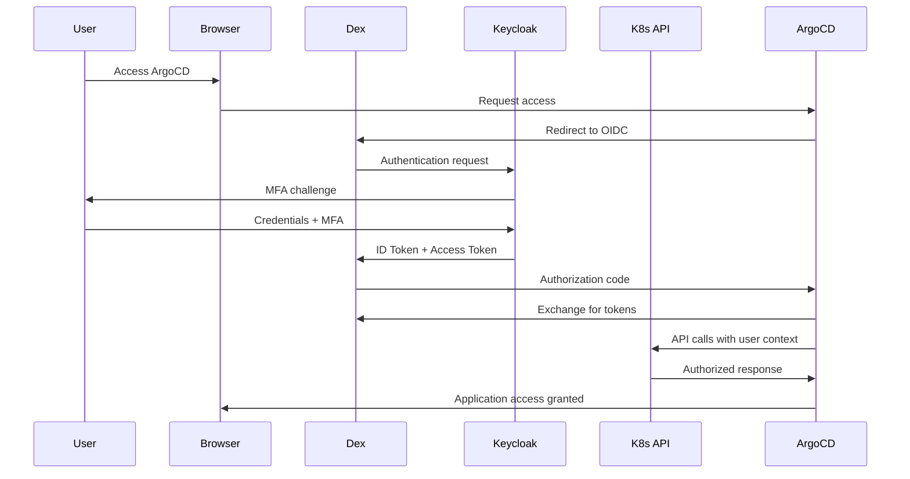

# ADR-008: Identity and Access Management (IAM) Strategy

## Status
Accepted

## Date
2024-12-01

## Context
The RH OVE multi-cluster ecosystem requires enterprise-grade identity and access management to ensure secure authentication and authorization across all clusters and services. Traditional cluster-specific authentication creates operational complexity and security risks in multi-cluster environments.

## Decision
We will implement a comprehensive IAM strategy using OpenID Connect (OIDC) providers with Keycloak as the primary identity provider, integrated with Kubernetes-native RBAC and service mesh authentication.

## Rationale

### Advantages
1. **Centralized Identity Management**: Single source of truth for user identities across all clusters
2. **Single Sign-On (SSO)**: Seamless authentication across all services and clusters
3. **Enterprise Integration**: Native integration with existing LDAP/Active Directory infrastructure
4. **Multi-Factor Authentication**: Enhanced security with mandatory MFA for administrative accounts
5. **Audit and Compliance**: Complete audit trail for SOC 2, GDPR, and HIPAA compliance
6. **Zero Trust Security**: Identity-aware access controls with least-privilege principles
7. **Scalability**: Supports horizontal scaling across multiple clusters and regions

### Alternatives Considered

#### 1. Basic Kubernetes ServiceAccount Authentication
- **Pros**: Simple, native Kubernetes integration
- **Cons**: No centralized management, limited audit capabilities, poor user experience
- **Rejected**: Insufficient for enterprise requirements

#### 2. LDAP Direct Integration
- **Pros**: Direct integration with existing directory services
- **Cons**: No OIDC compliance, limited multi-cluster support, poor web service integration
- **Rejected**: Limited modern authentication capabilities

#### 3. Commercial Solutions (Auth0, Okta)
- **Pros**: Feature-rich, managed service
- **Cons**: Vendor lock-in, higher costs, limited customization
- **Alternative**: Considered for specific use cases but Keycloak preferred for primary solution

## Implementation Details

### Core Components

#### Identity Provider: Keycloak (Red Hat SSO)
```yaml
# Keycloak Deployment Configuration
apiVersion: apps/v1
kind: Deployment
metadata:
  name: keycloak
  namespace: auth-system
spec:
  replicas: 3
  selector:
    matchLabels:
      app: keycloak
  template:
    spec:
      containers:
      - name: keycloak
        image: quay.io/keycloak/keycloak:20.0
        env:
        - name: KC_DB
          value: postgres
        - name: KC_DB_URL
          value: jdbc:postgresql://postgres:5432/keycloak
        - name: KC_HOSTNAME_STRICT
          value: "false"
        - name: KC_HTTP_ENABLED
          value: "true"
        - name: KC_PROXY
          value: edge
```

#### OIDC Integration with OpenShift
```yaml
apiVersion: config.openshift.io/v1
kind: OAuth
metadata:
  name: cluster
spec:
  identityProviders:
  - name: keycloak-oidc
    mappingMethod: claim
    type: OpenID
    openID:
      clientID: openshift-cluster
      clientSecret:
        name: oidc-client-secret
      issuer: https://keycloak.company.com/auth/realms/openshift
      claims:
        preferredUsername: [preferred_username]
        name: [name]
        email: [email]
        groups: [groups]
```

#### Dex OIDC Proxy for Service Authentication
```yaml
apiVersion: v1
kind: ConfigMap
metadata:
  name: dex-config
  namespace: auth-system
data:
  config.yaml: |
    issuer: https://dex.company.com
    storage:
      type: kubernetes
      config:
        inCluster: true
    connectors:
    - type: oidc
      id: keycloak
      name: Keycloak
      config:
        issuer: https://keycloak.company.com/auth/realms/company
        clientID: dex-client
        clientSecret: $DEX_CLIENT_SECRET
        scopes: [openid, profile, email, groups]
```

### Authentication Flow



### Authorization Model

#### Group-Based RBAC
```yaml
# Keycloak Groups mapped to Kubernetes RBAC
groups:
  platform-admins:
    kubernetes-role: cluster-admin
    argocd-role: admin
  web-developers:
    kubernetes-role: developer
    kubernetes-namespaces: [app-web-prod, app-web-staging, app-web-dev]
    argocd-role: web-app-admin
  database-admins:
    kubernetes-role: developer
    kubernetes-namespaces: [app-database-prod, app-database-staging]
    argocd-role: database-admin
  security-auditors:
    kubernetes-role: view
    argocd-role: readonly
```

#### Kubernetes RBAC Integration
```yaml
apiVersion: rbac.authorization.k8s.io/v1
kind: ClusterRoleBinding
metadata:
  name: platform-admin-binding
subjects:
- kind: Group
  name: "platform-admins"
  apiGroup: rbac.authorization.k8s.io
roleRef:
  kind: ClusterRole
  name: cluster-admin
  apiGroup: rbac.authorization.k8s.io
```

### Security Controls

#### Token Management
- **Access Tokens**: 15-minute expiration
- **Refresh Tokens**: 1-hour expiration
- **ID Tokens**: 5-minute expiration
- **Service Account Tokens**: 2-hour expiration with projected volumes

#### Multi-Factor Authentication
```yaml
# Mandatory MFA Flow in Keycloak
authenticationFlows:
  - alias: "browser-with-mfa"
    description: "Browser flow with mandatory MFA"
    authenticationExecutions:
      - authenticator: "auth-username-password-form"
        requirement: "REQUIRED"
      - authenticator: "auth-otp-form"
        requirement: "REQUIRED"
```

#### Network Security
- Network policies restricting authentication service communication
- TLS 1.3 encryption for all authentication traffic
- Certificate-based mutual TLS for service-to-service communication

## User Lifecycle Management

### Automated Provisioning
- SCIM integration for user provisioning/deprovisioning
- Automated group assignment based on organizational roles
- ServiceAccount creation for automated systems

### Self-Service Capabilities
- Password reset and account recovery
- MFA device management
- Access request workflows

## Monitoring and Audit

### Metrics and Monitoring
```yaml
# Prometheus ServiceMonitor for Authentication Metrics
apiVersion: monitoring.coreos.com/v1
kind: ServiceMonitor
metadata:
  name: dex-metrics
  namespace: auth-system
spec:
  selector:
    matchLabels:
      app: dex
  endpoints:
  - port: metrics
    interval: 30s
```

### Audit Logging
- Complete authentication audit trail
- RBAC change tracking
- Failed authentication monitoring
- Compliance reporting automation

### Key Metrics
- Authentication success/failure rates
- Active user sessions
- Token expiration and renewal rates
- MFA adoption rates
- Policy violation incidents

## Disaster Recovery

### High Availability
- Multi-replica Keycloak deployment with database clustering
- Cross-region identity provider replication
- Automated failover with health checks

### Backup Strategy
```yaml
# Daily Keycloak Database Backup
apiVersion: batch/v1
kind: CronJob
metadata:
  name: keycloak-backup
  namespace: auth-system
spec:
  schedule: "0 2 * * *"
  jobTemplate:
    spec:
      template:
        spec:
          containers:
          - name: backup
            image: postgres:13
            command: ["/bin/bash", "-c"]
            args:
            - pg_dump -h keycloak-db -U keycloak keycloak > /backup/keycloak-$(date +%Y%m%d).sql && aws s3 cp /backup/keycloak-$(date +%Y%m%d).sql s3://iam-backups/
```

## Consequences

### Positive
- **Enhanced Security**: Zero trust identity-aware access controls
- **Operational Efficiency**: Centralized identity management reduces operational overhead
- **Compliance Ready**: Built-in audit trails and regulatory framework alignment
- **Developer Experience**: Single sign-on with self-service capabilities
- **Scalability**: Supports multi-cluster and multi-region deployments
- **Cost Optimization**: Reduced manual identity management tasks

### Negative
- **Initial Complexity**: Setup and configuration require specialized knowledge
- **Dependencies**: Additional infrastructure components to manage and monitor
- **Learning Curve**: Teams need training on OIDC and Keycloak administration
- **Single Point of Failure**: Identity provider availability critical for system access
- **Token Management**: Requires careful handling of token lifecycle and security

## Migration Strategy

### Phase 1: Infrastructure Setup (2-3 weeks)
1. Deploy Keycloak in management cluster with HA configuration
2. Configure LDAP/AD integration and user federation
3. Set up Dex OIDC proxy in all clusters
4. Implement network policies and security controls

### Phase 2: Service Integration (3-4 weeks)
1. Configure OpenShift OAuth with OIDC
2. Integrate ArgoCD with OIDC authentication
3. Configure Grafana and Prometheus with OIDC
4. Set up RBAC mappings and group assignments

### Phase 3: User Migration (2-3 weeks)
1. Migrate existing users to new identity system
2. Configure MFA for all administrative accounts
3. Test authentication flows and access controls
4. Train users on new authentication experience

### Phase 4: Monitoring and Optimization (1-2 weeks)
1. Deploy monitoring and alerting for authentication services
2. Configure audit logging and compliance reporting
3. Optimize token lifecycle and security policies
4. Document operational procedures and runbooks

## Compliance Considerations

### Regulatory Alignment
- **SOC 2 Type II**: Automated audit trails and access controls
- **GDPR**: Right to be forgotten and data minimization
- **HIPAA**: PHI access controls and audit logging
- **SOX**: Financial system access controls and separation of duties

### Audit Requirements
- All authentication events logged with timestamps
- RBAC changes tracked with user attribution
- Failed authentication attempts monitored and alerted
- Regular access reviews automated with reporting

This IAM strategy provides enterprise-grade identity and access management for the RH OVE multi-cluster ecosystem, ensuring security, compliance, and operational efficiency through modern OIDC-based authentication and Kubernetes-native authorization.
