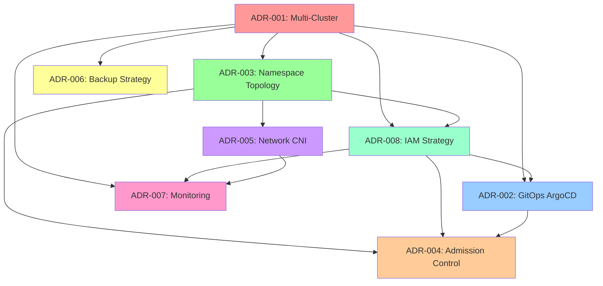
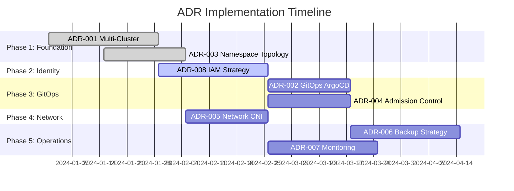

# Architecture Decision Records (ADR) Table

This document provides a comprehensive overview of all architectural decisions made for the RH OVE multi-cluster ecosystem.

## ADR Summary Table

| ADR | Title | Status | Date | Context | Decision |
|-----|-------|--------|------|---------|----------|
| [ADR-001](adr-001-multi-cluster-pattern.md) | Multi-Cluster Architecture Pattern | Accepted | 2024-12-01 | Need to support multiple environments with centralized governance and scalable infrastructure | Implement multi-cluster pattern with one management cluster and multiple application clusters |
| [ADR-002](adr-002-gitops-argocd.md) | GitOps with ArgoCD Hub Architecture | Accepted | 2024-12-01 | Require consistent, auditable, scalable deployment approach across multiple clusters | Implement GitOps using ArgoCD in hub-spoke pattern with Git-based configuration |
| [ADR-003](adr-003-cluster-topology.md) | Namespace-Based Cluster Topology | Accepted | 2024-12-01 | Need efficient organizational strategy for mixed VM and container workloads with isolation and security | Implement application namespace-based topology organized by business application |
| [ADR-004](adr-004-admission-controller.md) | Admission Controller Strategy | Accepted | 2024-12-01 | Require flexible, secure, policy-driven approach for resource admission and validation | Implement layered admission control using OpenShift built-in controllers, KubeVirt webhooks, and Kyverno policies |
| [ADR-005](adr-005-network-cni.md) | Cilium CNI with Multus Multi-Network Strategy | Accepted | 2024-12-01 | Need advanced networking for container and VM workloads with enterprise-grade security and performance | Implement Cilium as primary CNI with Multus for multi-network support using eBPF-powered networking |
| [ADR-006](adr-006-backup-strategy.md) | Backup Strategy for RH OVE Ecosystem | Accepted | 2024-12-01 | Ensure data protection and recovery across multi-cluster environment with business continuity requirements | Adopt centralized backup strategy using Rubrik for VM and containerized workloads |
| [ADR-007](adr-007-monitoring-strategy.md) | Monitoring Strategy for RH OVE Ecosystem | Accepted | 2024-12-01 | Need comprehensive monitoring for operational visibility, performance management, and incident response | Implement integrated monitoring using Prometheus/Grafana, Dynatrace, and Hubble |
| [ADR-008](adr-008-iam-strategy.md) | Identity and Access Management (IAM) Strategy | Accepted | 2024-12-01 | Need enterprise-grade identity and access management across multi-cluster ecosystem | Implement comprehensive IAM using OIDC providers with Keycloak, integrated with Kubernetes RBAC |

## Detailed ADR Information

### ADR-001: Multi-Cluster Architecture Pattern

**Key Components:**
- **Management Cluster**: RHACM, ArgoCD Hub, RHACS, Federated Prometheus, Centralized logging, Rubrik backup management
- **Application Clusters**: Production (HA, performance-optimized), Staging (production-like), Development (resource-optimized)
- **Network Architecture**: Dedicated segments per cluster, VPN/private connectivity, zero-trust principles

**Benefits:** Separation of concerns, horizontal scalability, security isolation, operational efficiency, fault isolation, resource optimization

**Trade-offs:** Increased network complexity, additional operational overhead, potential data sync challenges

---

### ADR-002: GitOps with ArgoCD Hub Architecture

**Key Components:**
- **ArgoCD Hub**: Centralized instance in management cluster with HA (3 replicas)
- **ArgoCD Agents**: Lightweight agents in application clusters
- **Repository Structure**: Clusters, applications (base/overlays), infrastructure (networking/storage/monitoring)
- **Application of Applications Pattern**: Root ArgoCD app manages cluster-specific applications

**Benefits:** Declarative configuration, complete audit trail, pull-based security, consistency, easy rollbacks, self-healing

**Trade-offs:** Learning curve for GitOps workflows, Git repository complexity, network dependencies, secret management complexity

---

### ADR-003: Namespace-Based Cluster Topology

**Key Components:**
- **Naming Convention**: `{app-name}-{environment}` (e.g., app-web-prod, app-database-staging)
- **Standard Templates**: Namespace with labels, ResourceQuota, LimitRange, NetworkPolicies
- **Cross-Namespace Communication**: Controlled via NetworkPolicies with explicit allow rules
- **RBAC Integration**: Namespace-level roles aligned with application teams

**Benefits:** Strong isolation, simplified RBAC, clear resource attribution, network microsegmentation, operational clarity, compliance alignment

**Trade-offs:** Initial complexity in planning boundaries, cross-app dependency management, shared services challenges

---

### ADR-004: Admission Controller Strategy

**Key Components:**
- **OpenShift Built-in**: Security Context Constraints, RBAC enforcement, quotas and limits
- **KubeVirt Webhooks**: Validation and mutation webhooks for VM specifications
- **Kyverno Policies**: Configuration validation, resource constraints, dynamic policy application

**Benefits:** Centralized policy management, dynamic policy application, security enforcement, misconfiguration prevention, extensibility

**Trade-offs:** Complex rule management, performance overhead, learning curve for policy authors

---

### ADR-005: Cilium CNI with Multus Multi-Network Strategy

**Key Components:**
- **Cilium Features**: eBPF performance, identity-aware security, L7 security, service mesh capabilities, WireGuard encryption
- **Multus Integration**: Multi-network support, legacy network integration, SR-IOV for high performance, network segmentation
- **Hubble Observability**: Network flow monitoring, policy violation detection, security auditing
- **NetworkAttachmentDefinitions**: Management, storage, and data networks with VLAN support

**Benefits:** Superior eBPF performance (10-100x better than iptables), identity-aware policies, L7 security without sidecars, deep observability, multi-network support

**Trade-offs:** Learning curve for eBPF concepts, debugging complexity, higher memory usage, potential compatibility issues

---

### ADR-006: Backup Strategy for RH OVE Ecosystem

**Key Components:**
- **Rubrik Management**: Centralized in management cluster with unified policy management
- **Backup Architecture**: Management cluster (Rubrik node), Application clusters (Edge devices, agents), Cloud archive (long-term retention)
- **Policy Configuration**: Daily backups (24h RPO), weekly full with daily incrementals, AES-256 encryption, cloud replication
- **Compliance**: GDPR, HIPAA, SOC 2 alignment with audit trails and access control

**Benefits:** Unified management, policy-driven, deduplication/compression, cloud integration, application consistency

**Trade-offs:** Higher upfront costs than open-source alternatives, training requirements for administrators

---

### ADR-007: Monitoring Strategy for RH OVE Ecosystem

**Key Components:**
- **Prometheus/Grafana**: Scalable metrics collection, customizable dashboards, real-time metrics, integrated alerting
- **Dynatrace**: Full-stack monitoring, AI-powered analytics, cloud-native support, unified observability
- **Hubble**: eBPF-powered network insights, high throughput flow capture, Cilium integration
- **Integration**: Federated Prometheus (3 replicas, 500Gi storage), OAuth SSO, automated tagging

**Benefits:** Operational efficiency with reduced MTTR, proactive performance management, unified observability across clusters

**Trade-offs:** Integration complexity, resource overhead, training requirements for multiple tools

---

### ADR-008: Identity and Access Management (IAM) Strategy

**Key Components:**
- **Keycloak (Red Hat SSO)**: Primary OIDC provider with LDAP/AD integration, MFA support, group-based access control
- **Dex OIDC Proxy**: Service authentication across clusters with static client configuration
- **OpenShift OAuth Integration**: Native cluster authentication with OIDC claims mapping
- **RBAC Integration**: Kubernetes-native authorization with group-based role assignments
- **Service Account Management**: Time-limited tokens with projected volumes and automated lifecycle

**Benefits:** Centralized identity management, single sign-on across all services, enterprise LDAP/AD integration, MFA enforcement, zero trust security, complete audit trails, compliance ready (SOC 2, GDPR, HIPAA)

**Trade-offs:** Initial setup complexity, additional infrastructure dependencies, OIDC/Keycloak learning curve, identity provider availability critical, token lifecycle management complexity

## Cross-ADR Dependencies

## Implementation Timeline

| Phase | ADRs | Duration | Dependencies | Key Deliverables |
|-------|------|----------|-------------|------------------|
| **Phase 1: Foundation** | ADR-001, ADR-003 | 4-6 weeks | Infrastructure setup | Multi-cluster setup, namespace topology |
| **Phase 2: Identity & Access** | ADR-008 | 3-4 weeks | Foundation complete | Keycloak deployment, OIDC integration, MFA setup |
| **Phase 3: GitOps & Policy** | ADR-002, ADR-004 | 3-4 weeks | Foundation + IAM complete | ArgoCD hub with OIDC auth, admission controllers |
| **Phase 4: Networking** | ADR-005 | 2-3 weeks | Foundation complete | Cilium CNI, Multus, network policies |
| **Phase 5: Operations** | ADR-006, ADR-007 | 4-5 weeks | All previous phases | Backup strategy, monitoring with IAM integration |

### Detailed Phase Dependencies

### Critical Path Analysis

**Critical Dependencies:**
- **ADR-008 (IAM)** must be completed before GitOps and Admission Control implementation
- **ADR-003 (Namespace Topology)** enables proper RBAC integration with IAM
- **ADR-007 (Monitoring)** requires IAM integration for authentication and authorization
- **ADR-002 (GitOps)** requires IAM for secure access control and audit trails

**Parallel Implementation Opportunities:**
- ADR-005 (Network CNI) can be implemented in parallel with IAM setup
- ADR-006 (Backup) and ADR-007 (Monitoring) can be implemented concurrently in final phase

This comprehensive table provides a complete overview of all architectural decisions, their relationships, and implementation considerations for the RH OVE multi-cluster ecosystem.

