# RH OVE Ecosystem Context Diagram

## Overview

This context diagram provides a high-level view of the RH OVE (Red Hat OpenShift Virtualization Engine) ecosystem within the broader enterprise environment. It illustrates the system boundaries, external entities, data flows, and key integrations that define how the RH OVE ecosystem interacts with users, external systems, and enterprise services.

## Executive Summary

The RH OVE ecosystem represents a strategic modernization initiative that transforms enterprise virtualization infrastructure while preserving existing investments. This platform enables organizations to migrate from traditional virtualization (VMware) to a cloud-native, Kubernetes-based solution that supports both virtual machines and containers on a unified platform.

### High-Level Business Context

```mermaid
graph TB
    subgraph "Business Drivers"
        COST[Cost Optimization]
        AGILITY[Business Agility]
        INNOVATION[Digital Innovation]
        COMPLIANCE[Regulatory Compliance]
    end
    
    subgraph "Current State - Legacy Infrastructure"
        VMWARE_OLD[VMware vSphere]
        LEGACY_APPS[Legacy Applications]
        SILOS[Infrastructure Silos]
        MANUAL[Manual Operations]
    end
    
    subgraph "RH OVE Ecosystem - Target State"
        direction TB
        UNIFIED[Unified Platform]
        AUTOMATION[Automated Operations]
        MODERN[Modern Workloads]
        HYBRID[Hybrid Capabilities]
    end
    
    subgraph "Business Outcomes"
        TCO[Reduced TCO]
        TTM[Faster Time-to-Market]
        SCALE[Improved Scalability]
        RISK[Reduced Risk]
    end
    
    subgraph "Enterprise Integration"
        IDENTITY[Enterprise Identity]
        SECURITY[Security Systems]
        MONITORING[Enterprise Monitoring]
        BACKUP[Data Protection]
    end
    
    %% Business Flow
    COST --> UNIFIED
    AGILITY --> AUTOMATION
    INNOVATION --> MODERN
    COMPLIANCE --> SECURITY
    
    %% Transformation Flow
    VMWARE_OLD -.-> UNIFIED
    LEGACY_APPS -.-> MODERN
    SILOS -.-> HYBRID
    MANUAL -.-> AUTOMATION
    
    %% Integration
    UNIFIED --> IDENTITY
    AUTOMATION --> MONITORING
    MODERN --> SECURITY
    HYBRID --> BACKUP
    
    %% Outcomes
    UNIFIED --> TCO
    AUTOMATION --> TTM
    MODERN --> SCALE
    HYBRID --> RISK
    
    %% Styling
    classDef businessClass fill:#e3f2fd,stroke:#1565c0,stroke-width:3px
    classDef legacyClass fill:#fff3e0,stroke:#f57c00,stroke-width:2px
    classDef targetClass fill:#e8f5e8,stroke:#2e7d32,stroke-width:3px
    classDef outcomeClass fill:#f3e5f5,stroke:#7b1fa2,stroke-width:3px
    classDef integrationClass fill:#fce4ec,stroke:#c2185b,stroke-width:2px
    
    class COST,AGILITY,INNOVATION,COMPLIANCE businessClass
    class VMWARE_OLD,LEGACY_APPS,SILOS,MANUAL legacyClass
    class UNIFIED,AUTOMATION,MODERN,HYBRID targetClass
    class TCO,TTM,SCALE,RISK outcomeClass
    class IDENTITY,SECURITY,MONITORING,BACKUP integrationClass
```

### Strategic Value Proposition

#### **Modernization Without Disruption**
- Migrate from VMware to cloud-native platform while maintaining existing VM workloads
- Gradual transformation path that minimizes business risk
- Unified platform for both virtual machines and containers

#### **Cost Optimization**
- Eliminate VMware licensing costs and vendor lock-in
- Reduce infrastructure complexity and operational overhead
- Optimize resource utilization through intelligent workload placement

#### **Enhanced Agility**
- GitOps-driven automation for rapid deployment and scaling
- Self-service capabilities for development teams
- Faster time-to-market for new applications and services

#### **Enterprise-Grade Security and Compliance**
- Zero-trust architecture with micro-segmentation
- Integrated security scanning and policy enforcement
- Comprehensive audit trails and compliance reporting

## System Context

The RH OVE ecosystem operates as a comprehensive multi-cluster virtualization platform that bridges traditional virtualization workloads with modern cloud-native operations, providing seamless integration with enterprise infrastructure and services.

## Context Diagram

```mermaid
graph LR
    %% External Users and Roles
    subgraph "Enterprise Users"
        DEV[Developers]
        OPS[Operations Teams]
        SEC[Security Teams]
        BIZ[Business Users]
        ADM[Platform Administrators]
    end
    
    %% External Enterprise Systems
    subgraph "Enterprise Identity & Access"
        AD[Active Directory/LDAP]
        SSO[Enterprise SSO/OIDC]
        PAM[Privileged Access Management]
    end
    
    subgraph "Enterprise Management"
        CMDB[Configuration Management Database]
        ITSM[IT Service Management]
        SIEM[Security Information Event Management]
        ASSET[Asset Management Systems]
    end
    
    subgraph "Enterprise Infrastructure"
        DNS[Enterprise DNS]
        NTP[Network Time Protocol]
        PKI[Public Key Infrastructure]
        PROXY[Enterprise Proxy/Firewall]
        LB[Load Balancers]
        IPAM[IP Address Management]
    end
    
    subgraph "Data Center Infrastructure"
        COMPUTE[Physical/Virtual Compute]
        STORAGE[Enterprise Storage Systems]
        NETWORK[Enterprise Network Infrastructure]
        BACKUP[Enterprise Backup Systems]
    end
    
    subgraph "External Services"
        REGISTRY[Container Registries]
        REPOS[Git Repositories]
        MONITOR[External Monitoring]
        CLOUD[Public Cloud Services]
    end
    
    %% RH OVE Ecosystem - Main System
    subgraph "RH OVE Ecosystem" 
        direction TB
        
        subgraph "Management Plane"
            MGMT[Management Cluster]
            GITOPS[GitOps Platform - ArgoCD]
            POLICY[Policy Management - Kyverno]
            SECURITY[Security - RHACS]
            OBSERV[Observability Stack]
            CLUSTER_MGMT[Multi-Cluster Management - RHACM]
        end
        
        subgraph "Application Planes"
            PROD[Production Clusters]
            STAGING[Staging Clusters]
            DEV_CLUSTER[Development Clusters]
            EDGE[Edge Clusters]
        end
        
        subgraph "Virtualization Layer"
            KUBEVIRT[KubeVirt Engine]
            VM_WORKLOADS[Virtual Machine Workloads]
            CONTAINER_WORKLOADS[Container Workloads]
        end
        
        subgraph "Infrastructure Services"
            CNI[Cilium CNI]
            CSI[Storage CSI Drivers]
            MULTUS[Multi-Network - Multus]
            BACKUP_AGENT[Backup Agents]
        end
    end
    
    %% Legacy Systems Integration
    subgraph "Legacy Infrastructure"
        VMWARE[VMware Infrastructure]
        LEGACY_APP[Legacy Applications]
        MAINFRAME[Mainframe Systems]
        PHYSICAL[Physical Servers]
    end
    
    %% External Connections - Users
    DEV --> MGMT
    OPS --> MGMT
    SEC --> SECURITY
    BIZ --> VM_WORKLOADS
    ADM --> CLUSTER_MGMT
    
    %% External Connections - Identity
    AD --> MGMT
    SSO --> MGMT
    PAM --> MGMT
    
    %% External Connections - Management
    MGMT --> CMDB
    MGMT --> ITSM
    SECURITY --> SIEM
    OBSERV --> MONITOR
    MGMT --> ASSET
    
    %% External Connections - Infrastructure
    MGMT --> DNS
    MGMT --> NTP
    MGMT --> PKI
    MGMT --> PROXY
    LB --> MGMT
    MULTUS -.-> IPAM
    CNI -.-> DNS
    CSI -.-> PKI
    
    %% External Connections - Data Center
    KUBEVIRT --> COMPUTE
    CSI -.-> STORAGE
    CNI -.-> NETWORK
    MULTUS -.-> NETWORK
    BACKUP_AGENT -.-> BACKUP
    
    %% External Connections - Services
    GITOPS --> REPOS
    MGMT --> REGISTRY
    OBSERV --> MONITOR
    MGMT --> CLOUD
    
    %% Legacy Integration
    KUBEVIRT --> VMWARE
    VM_WORKLOADS --> LEGACY_APP
    KUBEVIRT --> PHYSICAL
    
    %% Internal Connections
    MGMT --> PROD
    MGMT --> STAGING
    MGMT --> DEV_CLUSTER
    MGMT --> EDGE
    
    GITOPS --> PROD
    GITOPS --> STAGING
    GITOPS --> DEV_CLUSTER
    
    POLICY --> PROD
    POLICY --> STAGING
    POLICY --> DEV_CLUSTER
    
    SECURITY --> PROD
    SECURITY --> STAGING
    SECURITY --> DEV_CLUSTER
    
    OBSERV --> PROD
    OBSERV --> STAGING
    OBSERV --> DEV_CLUSTER
    
    %% Styling
    classDef userClass fill:#e1f5fe,stroke:#01579b,stroke-width:2px
    classDef enterpriseClass fill:#f3e5f5,stroke:#4a148c,stroke-width:2px
    classDef coreClass fill:#e8f5e8,stroke:#1b5e20,stroke-width:2px
    classDef legacyClass fill:#fff3e0,stroke:#e65100,stroke-width:2px
    classDef infraClass fill:#fce4ec,stroke:#880e4f,stroke-width:2px
    
    class DEV,OPS,SEC,BIZ,ADM userClass
    class AD,SSO,PAM,CMDB,ITSM,SIEM,ASSET,DNS,NTP,PKI,PROXY,LB,IPAM enterpriseClass
    class MGMT,GITOPS,POLICY,SECURITY,OBSERV,CLUSTER_MGMT,PROD,STAGING,DEV_CLUSTER,EDGE,KUBEVIRT coreClass
    class VMWARE,LEGACY_APP,MAINFRAME,PHYSICAL legacyClass
    class COMPUTE,STORAGE,NETWORK,BACKUP,REGISTRY,REPOS,MONITOR,CLOUD infraClass
```

## System Boundaries and Responsibilities

### RH OVE Ecosystem Core
The central system encompasses:
- **Management Plane**: Centralized governance, policy, and operations control
- **Application Planes**: Multiple clusters for different environments and purposes
- **Virtualization Layer**: KubeVirt-based VM and container workload execution
- **Infrastructure Services**: Networking, storage, and backup integration

### Key External Integrations

#### Identity and Access Management
- **Active Directory/LDAP**: Enterprise user directory integration
- **Enterprise SSO/OIDC**: Single sign-on and OAuth/OIDC authentication
- **Privileged Access Management**: Elevated access control and auditing

#### Enterprise Management Systems
- **CMDB**: Configuration item tracking and relationship mapping
- **ITSM**: Service request and incident management integration
- **SIEM**: Security event correlation and threat detection
- **Asset Management**: Hardware and software asset tracking

#### Infrastructure Dependencies
- **Enterprise DNS**: Name resolution services
- **NTP**: Time synchronization across all components
- **PKI**: Certificate management and trust establishment
- **IPAM**: IP Address Management for network planning and allocation
- **Network Infrastructure**: Physical and virtual networking
- **Storage Systems**: Persistent storage for VMs and containers
- **Backup Systems**: Data protection and recovery services

#### Development and Operations
- **Git Repositories**: Source code and configuration management
- **Container Registries**: Image storage and distribution
- **External Monitoring**: Enterprise monitoring system integration
- **Public Cloud Services**: Hybrid and multi-cloud connectivity

### Legacy System Integration

The RH OVE ecosystem provides migration paths and integration capabilities for:
- **VMware Infrastructure**: VM migration and workload transformation
- **Legacy Applications**: Containerization and modernization support
- **Physical Servers**: Bare metal integration and management
- **Mainframe Systems**: API integration and data exchange

## Data Flow Patterns

### Inbound Data Flows
- **User Authentication**: From enterprise identity systems
- **Configuration Data**: From Git repositories and CMDB
- **Monitoring Metrics**: To enterprise monitoring systems
- **Security Events**: To SIEM platforms
- **Backup Data**: From enterprise backup systems

### Outbound Data Flows
- **Audit Logs**: To compliance and logging systems
- **Performance Metrics**: To enterprise dashboards
- **Security Alerts**: To security operations centers
- **Configuration Changes**: To change management systems
- **Service Status**: To IT service management platforms

### Bidirectional Integration
- **Identity Federation**: Continuous authentication and authorization
- **Policy Synchronization**: Enterprise policy distribution and compliance
- **Asset Discovery**: Dynamic configuration item updates
- **Network Connectivity**: Secure communication channels

## Security Boundaries

### Trust Zones
1. **Management Zone**: High-security administrative functions
2. **Production Zone**: Business-critical workload execution
3. **Development Zone**: Lower-trust development activities
4. **DMZ**: External-facing services and integrations

### Security Controls
- **Network Segmentation**: Micro-segmentation with Cilium
- **Zero Trust Architecture**: Identity-based access controls
- **Encryption**: End-to-end data protection
- **Audit Logging**: Comprehensive activity tracking

## Scalability and Growth

The context diagram illustrates the ecosystem's ability to:
- **Horizontal Scaling**: Add application clusters as needed
- **Geographic Distribution**: Deploy across multiple data centers
- **Hybrid Integration**: Seamlessly connect on-premises and cloud resources
- **Legacy Modernization**: Gradual transformation of existing systems

## Operational Model

### Day-1 Operations (Deployment)
- Initial cluster provisioning and configuration
- Integration with enterprise systems
- Security policy establishment
- Baseline monitoring setup

### Day-2 Operations (Management)
- Ongoing cluster lifecycle management
- Policy updates and compliance monitoring
- Performance optimization and scaling
- Security incident response

This context diagram serves as the foundation for understanding how the RH OVE ecosystem integrates with and enhances existing enterprise infrastructure while providing a modern, scalable platform for virtualization and containerization workloads.
