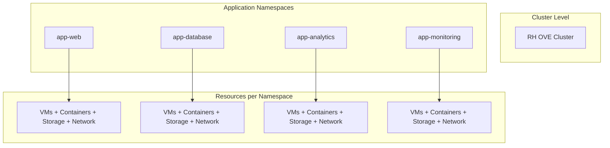
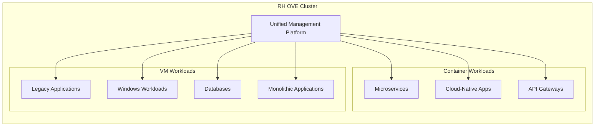
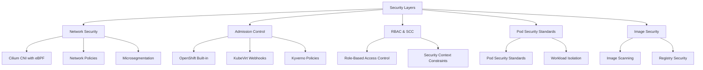
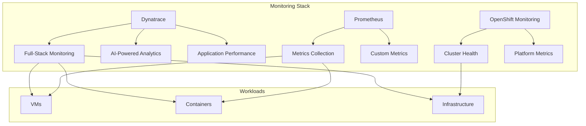

# Design Principles

## Overview

The RH OVE solution is built on fundamental design principles that ensure scalability, security, and operational efficiency for hybrid container and VM workloads.

## Core Principles

### 1. Application Namespace-Based Topology

Based on the analysis from our research, using an application namespace-based topology is considered a best practice for RH OVE clusters.



**Benefits:**
- **Isolation and Security**: Strong RBAC and network policy enforcement
- **Operational Efficiency**: Simplified management and troubleshooting
- **Network Segregation**: Namespace-scoped NetworkAttachmentDefinitions
- **Scalability**: Prevents resource clutter and performance bottlenecks
- **Policy Management**: Granular security policies and quotas

**Implementation:**
- Group related VMs and Kubernetes resources by application or business domain
- Apply consistent labeling for automation and cost management
- Combine with network policies and RBAC rules
- Designate separate namespaces for dev, test, and prod environments

### 2. Mixed Workload Strategy

Multiplexing Kubernetes container workloads and VM workloads on the same RH OVE cluster is highly advantageous:



**Advantages:**
- **Unified Management**: Same Kubernetes-native interface for all workloads
- **Resource Optimization**: Better hardware consolidation
- **Flexibility**: Gradual modernization path for legacy applications
- **Streamlined DevOps**: Integrated CI/CD pipelines for all workload types
- **Advanced Platform Features**: HA, storage provisioning, monitoring for all

### 3. Security-First Design

Implement defense-in-depth security across all layers:



### 4. GitOps-Driven Operations

Implement infrastructure and application management through GitOps principles:

**Benefits:**
- **Single Source of Truth**: All configurations version-controlled in Git
- **Declarative Management**: Infrastructure as Code for VMs and containers
- **Automation**: Reduced human error through automated deployments
- **Auditability**: Complete change tracking and rollback capabilities
- **Collaboration**: Peer review through pull requests

### 5. Observability and Monitoring

Comprehensive monitoring strategy across all workload types:



## Implementation Guidelines

### Namespace Design

```yaml
# Example namespace structure
apiVersion: v1
kind: Namespace
metadata:
  name: app-web-prod
  labels:
    app: web
    environment: production
    tier: frontend
  annotations:
    network-policy: strict
    backup-policy: daily
```

### Resource Quotas

```yaml
apiVersion: v1
kind: ResourceQuota
metadata:
  name: compute-quota
  namespace: app-web-prod
spec:
  hard:
    requests.cpu: "10"
    requests.memory: 20Gi
    limits.cpu: "20"
    limits.memory: 40Gi
    persistentvolumeclaims: "10"
```

### Network Policies

```yaml
apiVersion: networking.k8s.io/v1
kind: NetworkPolicy
metadata:
  name: app-web-netpol
  namespace: app-web-prod
spec:
  podSelector:
    matchLabels:
      app: web
  policyTypes:
  - Ingress
  - Egress
  ingress:
  - from:
    - namespaceSelector:
        matchLabels:
          name: app-gateway-prod
```

## Best Practices

### Design Decisions
1. **Plan namespace strategy early**: Define naming conventions and access hierarchies
2. **Implement least privilege**: Use RBAC and network policies consistently
3. **Design for scale**: Consider resource limits and node capacity planning
4. **Plan for disaster recovery**: Include backup and restoration strategies

### Operational Considerations
1. **Monitor resource utilization**: Prevent resource contention between workload types
2. **Implement proper logging**: Centralized logging for both VMs and containers
3. **Regular security assessments**: Continuous compliance and vulnerability management
4. **Performance testing**: Regular load testing for mixed workload scenarios

These design principles ensure that the RH OVE solution provides a robust, secure, and scalable platform for modern hybrid workloads while supporting organizational transformation initiatives.
