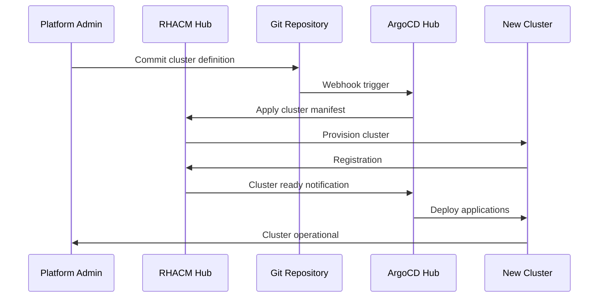
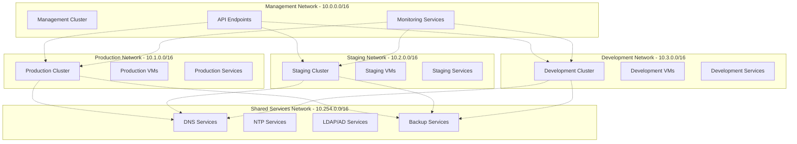
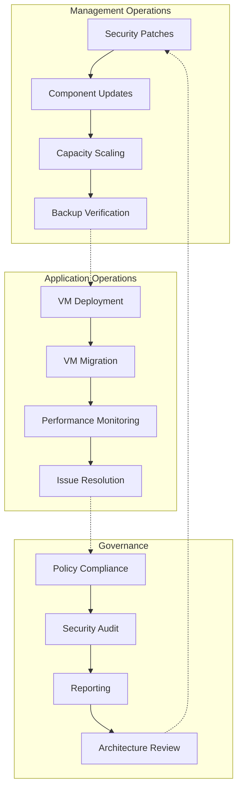

# Global Architecture Overview

## Overview

The RH OVE ecosystem is designed as a multi-cluster architecture that separates concerns between management operations and application workloads. This design provides scalability, security, and operational efficiency by dedicating specialized clusters for different purposes while maintaining centralized governance and oversight.

## Architecture Principles

### Separation of Concerns

- **Management Cluster**: Centralized control plane for governance, policy, monitoring, and operations

- **Application Clusters**: Dedicated workload execution environments for virtual machines and containers

- **Clear Boundaries**: Well-defined interfaces and responsibilities between cluster types

### Scalability and Growth

- **Horizontal Scaling**: Add application clusters as demand grows

- **Regional Distribution**: Deploy clusters across different geographic locations

- **Resource Optimization**: Right-size clusters based on workload requirements

### Security and Compliance

- **Zero Trust Architecture**: Network-level security between clusters

- **Centralized Policy Management**: Consistent security policies across all clusters

- **Compliance Monitoring**: Unified compliance reporting and auditing

## Multi-Cluster Topology

```mermaid
graph TB
    subgraph "Management Cluster"
        subgraph "GitOps Platform"
            ARGO[ArgoCD Hub]
            GIT[Git Repositories]
        end
        
        subgraph "Policy & Security"
            RHACS[Red Hat Advanced Cluster Security]
            POL[Policy Engine - Kyverno]
        end
        
        subgraph "Multi-Cluster Management"
            RHACM[Red Hat Advanced Cluster Management]
            FLEET[Fleet Management]
        end
        
        subgraph "Observability Stack"
            PROM[Prometheus Federation]
            GRAF[Grafana Central]
            ALERT[AlertManager]
            LOG[Logging Aggregation]
        end
        
        subgraph "Backup & DR"
            RUBRIK[Rubrik Management]
            BACKUP[Backup Policies]
        end
    end
    
    subgraph "Application Cluster 1 - Production"
        subgraph "Virtualization Stack 1"
            OVE1[OpenShift Virtualization]
            VM1[Virtual Machines]
            CDI1[Containerized Data Importer]
        end
        
        subgraph "Networking 1"
            CIL1[Cilium CNI]
            MULT1[Multus Multi-Network]
            SRIOV1[SR-IOV Networks]
        end
        
        subgraph "Storage 1"
            CSI1[CSI Drivers]
            PV1[Persistent Volumes]
        end
        
        subgraph "Local Agents"
            ARGO1[ArgoCD Agent]
            RHACS1[RHACS Agent]
            MON1[Monitoring Agents]
        end
    end
    
    subgraph "Application Cluster 2 - Staging"
        subgraph "Virtualization Stack 2"
            OVE2[OpenShift Virtualization]
            VM2[Virtual Machines]
            CDI2[Containerized Data Importer]
        end
        
        subgraph "Networking 2"
            CIL2[Cilium CNI]
            MULT2[Multus Multi-Network]
            SRIOV2[SR-IOV Networks]
        end
        
        subgraph "Storage 2"
            CSI2[CSI Drivers]
            PV2[Persistent Volumes]
        end
        
        subgraph "Local Agents"
            ARGO2[ArgoCD Agent]
            RHACS2[RHACS Agent]
            MON2[Monitoring Agents]
        end
    end
    
    subgraph "Application Cluster N - Development"
        subgraph "Virtualization Stack N"
            OVEN[OpenShift Virtualization]
            VMN[Virtual Machines]
            CDIN[Containerized Data Importer]
        end
        
        subgraph "Networking N"
            CILN[Cilium CNI]
            MULTN[Multus Multi-Network]
            SRIOVN[SR-IOV Networks]
        end
        
        subgraph "Storage N"
            CSIN[CSI Drivers]
            PVN[Persistent Volumes]
        end
        
        subgraph "Local Agents"
            ARGON[ArgoCD Agent]
            RHACSN[RHACS Agent]
            MONN[Monitoring Agents]
        end
    end
    
    %% Management to Application Connections
    ARGO --> ARGO1
    ARGO --> ARGO2
    ARGO --> ARGON
    
    RHACM --> ARGO1
    RHACM --> ARGO2
    RHACM --> ARGON
    
    RHACS --> RHACS1
    RHACS --> RHACS2
    RHACS --> RHACSN
    
    PROM --> MON1
    PROM --> MON2
    PROM --> MONN
    
    RUBRIK --> PV1
    RUBRIK --> PV2
    RUBRIK --> PVN
    
    %% Git to ArgoCD
    GIT --> ARGO
    
    %% Policy Distribution
    POL --> RHACS1
    POL --> RHACS2
    POL --> RHACSN
```



## Management Cluster Components

### Core Management Services

#### Red Hat Advanced Cluster Management (RHACM)

```yaml
apiVersion: operator.open-cluster-management.io/v1
kind: MultiClusterHub
metadata:
  name: multiclusterhub
  namespace: open-cluster-management
spec:
  availabilityConfig: High
  enableClusterBackup: true
  overrides:
    components:
    - name: multicluster-observability-operator
      enabled: true
    - name: cluster-lifecycle
      enabled: true
    - name: cluster-permission
      enabled: true
```

**Responsibilities:**
- Cluster lifecycle management
- Policy distribution and compliance
- Application deployment coordination
- Resource optimization across clusters

#### ArgoCD Hub Configuration

```yaml
apiVersion: argoproj.io/v1alpha1
kind: ArgoCD
metadata:
  name: argocd-hub
  namespace: argocd
spec:
  server:
    route:
      enabled: true
      tls:
        termination: reencrypt
    replicas: 3
  controller:
    resources:
      requests:
        cpu: 500m
        memory: 1Gi
      limits:
        cpu: 2
        memory: 4Gi
  dex:
    openShiftOAuth: true
  ha:
    enabled: true
  rbac:
    defaultPolicy: 'role:readonly'
    policy: |
      p, role:admin, applications, *, */*, allow
      p, role:admin, clusters, *, *, allow
      p, role:admin, repositories, *, *, allow
      g, argocd-admins, role:admin
```

**Responsibilities:**
- GitOps workflow orchestration
- Application deployment to target clusters
- Configuration drift detection and remediation
- Multi-cluster application synchronization

### Security and Compliance

#### Red Hat Advanced Cluster Security (RHACS)

```yaml
apiVersion: platform.stackrox.io/v1alpha1
kind: Central
metadata:
  name: stackrox-central-services
  namespace: stackrox
spec:
  central:
    exposure:
      loadBalancer:
        enabled: true
    persistence:
      persistentVolumeClaim:
        claimName: central-db
    resources:
      requests:
        cpu: 1500m
        memory: 4Gi
      limits:
        cpu: 4000m
        memory: 8Gi
  scanner:
    resources:
      requests:
        cpu: 200m
        memory: 200Mi
      limits:
        cpu: 2000m
        memory: 4Gi
```

**Responsibilities:**
- Centralized security policy management
- Vulnerability scanning across clusters
- Runtime threat detection
- Compliance reporting and audit trails

#### Policy Engine (Kyverno)

```yaml
apiVersion: kyverno.io/v1
kind: ClusterPolicy
metadata:
  name: multi-cluster-vm-policy
spec:
  validationFailureAction: enforce
  background: true
  rules:
  - name: require-vm-labels
    match:
      any:
      - resources:
          kinds:
          - VirtualMachine
    validate:
      message: "VMs must have required labels: environment, owner, backup-policy"
      pattern:
        metadata:
          labels:
            environment: "?*"
            owner: "?*"
            backup-policy: "?*"
```

### Observability and Monitoring

#### Federated Prometheus Configuration

```yaml
apiVersion: monitoring.coreos.com/v1
kind: Prometheus
metadata:
  name: prometheus-federation
  namespace: monitoring
spec:
  replicas: 3
  retention: 30d
  storage:
    volumeClaimTemplate:
      spec:
        accessModes: ["ReadWriteOnce"]
        resources:
          requests:
            storage: 500Gi
  serviceAccountName: prometheus
  serviceMonitorSelector:
    matchLabels:
      prometheus: federation
  additionalScrapeConfigs:
    name: additional-scrape-configs
    key: prometheus-additional.yaml
```

**Federation Configuration:**
```yaml
- job_name: 'federate-app-clusters'
  scrape_interval: 15s
  honor_labels: true
  metrics_path: '/federate'
  params:
    'match[]':
      - '{job=~"kubernetes-.*"}'
      - '{job=~"node-.*"}'
      - '{job=~"kubevirt-.*"}'
  static_configs:
    - targets:
      - 'prometheus-app-cluster-1.monitoring.svc.cluster.local:9090'
      - 'prometheus-app-cluster-2.monitoring.svc.cluster.local:9090'
      - 'prometheus-app-cluster-n.monitoring.svc.cluster.local:9090'
```

#### Centralized Logging

```yaml
apiVersion: logging.openshift.io/v1
kind: ClusterLogForwarder
metadata:
  name: central-log-forwarder
  namespace: openshift-logging
spec:
  outputs:
  - name: central-elasticsearch
    type: elasticsearch
    url: https://elasticsearch-central.logging.svc.cluster.local:9200
    secret:
      name: elasticsearch-central-secret
  pipelines:
  - name: forward-app-logs
    inputRefs:
    - application
    - infrastructure
    - audit
    outputRefs:
    - central-elasticsearch
```

## Application Cluster Architecture

### Cluster Sizing and Resource Allocation

#### Production Cluster Profile

```yaml
apiVersion: v1
kind: ConfigMap
metadata:
  name: cluster-profile-production
data:
  profile: |
    cluster_type: production
    node_count: 12
    master_nodes: 3
    worker_nodes: 9
    storage_nodes: 3
    
    node_specifications:
      master:
        cpu: 16
        memory: 64Gi
        storage: 500Gi SSD
      worker:
        cpu: 32
        memory: 128Gi
        storage: 1Ti NVMe
      storage:
        cpu: 8
        memory: 32Gi
        storage: 4Ti SSD
    
    network_configuration:
      cni: cilium
      multi_network: multus
      sr_iov: enabled
      encryption: wireguard
    
    virtualization:
      kubevirt_version: "v1.1.0"
      nested_virtualization: true
      hugepages: 1Gi
      cpu_pinning: enabled
```

#### Staging/Development Cluster Profile

```yaml
apiVersion: v1
kind: ConfigMap
metadata:
  name: cluster-profile-staging
data:
  profile: |
    cluster_type: staging
    node_count: 6
    master_nodes: 3
    worker_nodes: 3
    
    node_specifications:
      master:
        cpu: 8
        memory: 32Gi
        storage: 200Gi SSD
      worker:
        cpu: 16
        memory: 64Gi
        storage: 500Gi SSD
    
    network_configuration:
      cni: cilium
      multi_network: multus
      sr_iov: optional
      encryption: ipsec
    
    virtualization:
      kubevirt_version: "v1.1.0"
      nested_virtualization: false
      hugepages: optional
      cpu_pinning: disabled
```

### Virtualization Stack Configuration

#### OpenShift Virtualization Deployment

```yaml
apiVersion: hco.kubevirt.io/v1beta1
kind: HyperConverged
metadata:
  name: kubevirt-hyperconverged
  namespace: openshift-cnv
spec:
  infra:
    nodePlacement:
      nodeSelector:
        node-role.kubernetes.io/worker: ""
  workloads:
    nodePlacement:
      nodeSelector:
        node-role.kubernetes.io/worker: ""
  featureGates:
    enableCommonBootImageImport: true
    deployTektonTaskResources: true
    enableApplicationAwareQuota: true
  configuration:
    network:
      networkBinding:
        plugins:
          macvtap: {}
          passt: {}
    virtualMachineOptions:
      disableFreePageReporting: false
      disableSerialConsoleLog: false
```

### Multi-Network Configuration

#### Network Attachment Definitions for Different Environments

```yaml
# Production Network Configuration
apiVersion: k8s.cni.cncf.io/v1
kind: NetworkAttachmentDefinition
metadata:
  name: prod-management-network
  namespace: vm-production
spec:
  config: |
    {
      "cniVersion": "0.3.1",
      "name": "prod-management-network",
      "type": "macvlan",
      "master": "ens192",
      "mode": "bridge",
      "ipam": {
        "type": "static"
      }
    }
---
# Staging Network Configuration
apiVersion: k8s.cni.cncf.io/v1
kind: NetworkAttachmentDefinition
metadata:
  name: staging-management-network
  namespace: vm-staging
spec:
  config: |
    {
      "cniVersion": "0.3.1",
      "name": "staging-management-network",
      "type": "macvlan",
      "master": "ens192",
      "mode": "bridge",
      "vlan": 100,
      "ipam": {
        "type": "dhcp"
      }
    }
```

## Cluster Lifecycle Management

### Cluster Provisioning Workflow



### Cluster Template

```yaml
apiVersion: cluster.open-cluster-management.io/v1
kind: ManagedCluster
metadata:
  name: app-cluster-{{ .Values.environment }}-{{ .Values.region }}
  labels:
    environment: {{ .Values.environment }}
    region: {{ .Values.region }}
    cluster.open-cluster-management.io/clusterset: {{ .Values.clusterset }}
spec:
  hubAcceptsClient: true
  leaseDurationSeconds: 60
---
apiVersion: agent.open-cluster-management.io/v1
kind: KlusterletAddonConfig
metadata:
  name: app-cluster-{{ .Values.environment }}-{{ .Values.region }}
  namespace: app-cluster-{{ .Values.environment }}-{{ .Values.region }}
spec:
  clusterName: app-cluster-{{ .Values.environment }}-{{ .Values.region }}
  clusterNamespace: app-cluster-{{ .Values.environment }}-{{ .Values.region }}
  clusterLabels:
    environment: {{ .Values.environment }}
    region: {{ .Values.region }}
  applicationManager:
    enabled: true
  policyController:
    enabled: true
  searchCollector:
    enabled: true
  certPolicyController:
    enabled: true
```

## Multi-Cluster Networking

### Cluster Network Isolation



### Service Mesh Integration

```yaml
apiVersion: networking.istio.io/v1beta1
kind: VirtualService
metadata:
  name: cross-cluster-vm-service
spec:
  hosts:
  - vm-service.production.svc.cluster.local
  gateways:
  - mesh
  - cross-cluster-gateway
  http:
  - match:
    - headers:
        cluster:
          exact: staging
    route:
    - destination:
        host: vm-service.staging.svc.cluster.local
  - route:
    - destination:
        host: vm-service.production.svc.cluster.local
```

## Disaster Recovery and Business Continuity

### Multi-Cluster Backup Strategy

```yaml
apiVersion: velero.io/v1
kind: Schedule
metadata:
  name: multi-cluster-backup
  namespace: velero
spec:
  schedule: "0 2 * * *"  # Daily at 2 AM
  template:
    includedNamespaces:
    - vm-production
    - vm-staging
    - openshift-cnv
    excludedResources:
    - pods
    - replicasets
    snapshotVolumes: true
    ttl: 720h  # 30 days
    hooks:
      resources:
      - name: vm-backup-hook
        includedNamespaces:
        - vm-production
        - vm-staging
        labelSelector:
          matchLabels:
            backup.kubevirt.io/enable: "true"
        pre:
        - exec:
            container: virt-launcher
            command:
            - /bin/bash
            - -c
            - "virtctl freeze --namespace $NAMESPACE $VM_NAME"
        post:
        - exec:
            container: virt-launcher
            command:
            - /bin/bash
            - -c
            - "virtctl unfreeze --namespace $NAMESPACE $VM_NAME"
```

### Cross-Cluster Failover

```yaml
apiVersion: cluster.open-cluster-management.io/v1beta1
kind: Placement
metadata:
  name: vm-workload-placement
  namespace: vm-production
spec:
  predicates:
  - requiredClusterSelector:
      labelSelector:
        matchLabels:
          environment: production
          region: primary
  - requiredClusterSelector:
      labelSelector:
        matchLabels:
          environment: production
          region: secondary
  numberOfClusters: 2
  prioritizerPolicy:
    mode: Additive
    configurations:
    - scoreCoordinate:
        type: BuiltIn
        builtIn: Steady
      weight: 1
    - scoreCoordinate:
        type: BuiltIn
        builtIn: ResourceAllocatableCPU
      weight: 1
```

## Scalability and Performance

### Cluster Auto-Scaling

```yaml
apiVersion: machine.openshift.io/v1beta1
kind: MachineAutoscaler
metadata:
  name: worker-autoscaler
  namespace: openshift-machine-api
spec:
  minReplicas: 3
  maxReplicas: 20
  scaleTargetRef:
    apiVersion: machine.openshift.io/v1beta1
    kind: MachineSet
    name: worker-machineset
---
apiVersion: autoscaling.openshift.io/v1
kind: ClusterAutoscaler
metadata:
  name: default
spec:
  podPriorityThreshold: -10
  resourceLimits:
    maxNodesTotal: 50
    cores:
      min: 16
      max: 1000
    memory:
      min: 64Gi
      max: 4000Gi
  scaleDown:
    enabled: true
    delayAfterAdd: 10m
    delayAfterDelete: 10s
    delayAfterFailure: 30s
    unneededTime: 60s
```

### VM Resource Management

```yaml
apiVersion: kubevirt.io/v1
kind: VirtualMachine
metadata:
  name: scalable-vm-template
  namespace: vm-production
spec:
  template:
    spec:
      domain:
        cpu:
          cores: 4
          sockets: 1
          threads: 1
        memory:
          guest: 8Gi
        resources:
          requests:
            cpu: 2
            memory: 4Gi
          limits:
            cpu: 4
            memory: 8Gi
        devices:
          autoattachPodInterface: false
          autoattachSerialConsole: true
          autoattachGraphicsDevice: true
      evictionStrategy: LiveMigrate
      terminationGracePeriodSeconds: 180
      nodeSelector:
        node-role.kubernetes.io/worker: ""
        vm-workload: "true"
      affinity:
        podAntiAffinity:
          preferredDuringSchedulingIgnoredDuringExecution:
          - weight: 100
            podAffinityTerm:
              labelSelector:
                matchExpressions:
                - key: vm.kubevirt.io/name
                  operator: Exists
              topologyKey: kubernetes.io/hostname
```

## Operational Procedures

### Day-2 Operations Workflow



### Monitoring and Alerting

```yaml
apiVersion: monitoring.coreos.com/v1
kind: PrometheusRule
metadata:
  name: multi-cluster-alerts
  namespace: monitoring
spec:
  groups:
  - name: cluster.health
    rules:
    - alert: ClusterDown
      expr: up{job="kubernetes-apiservers"} == 0
      for: 5m
      labels:
        severity: critical
      annotations:
        summary: "Cluster {{ $labels.cluster }} is down"
        description: "Cluster {{ $labels.cluster }} has been down for more than 5 minutes"
    
    - alert: VMHighMemory
      expr: kubevirt_vm_memory_usage_bytes / kubevirt_vm_memory_available_bytes > 0.9
      for: 10m
      labels:
        severity: warning
      annotations:
        summary: "VM {{ $labels.name }} high memory usage"
        description: "VM {{ $labels.name }} in cluster {{ $labels.cluster }} has high memory usage"
    
    - alert: VMMigrationFailed
      expr: increase(kubevirt_vm_migration_failed_total[5m]) > 0
      labels:
        severity: critical
      annotations:
        summary: "VM migration failed"
        description: "VM migration failed in cluster {{ $labels.cluster }}"
```

## Best Practices and Recommendations

### Cluster Design Guidelines

1. **Resource Planning**
   - Size clusters based on workload requirements
   - Plan for 20-30% overhead for system components
   - Consider NUMA topology for high-performance VMs

2. **Network Segmentation**
   - Isolate management and data plane traffic
   - Use VLANs for multi-tenant environments
   - Implement east-west encryption

3. **Storage Strategy**
   - Use local storage for high-performance workloads
   - Implement storage classes for different performance tiers
   - Plan for backup and disaster recovery

4. **Security Architecture**
   - Implement pod security standards
   - Use network policies for microsegmentation
   - Regular security scanning and compliance checks

### Operational Excellence

1. **GitOps Workflow**
   - All changes through version control
   - Automated testing and validation
   - Rollback capabilities

2. **Monitoring Strategy**
   - Proactive alerting and monitoring
   - Centralized logging and metrics
   - Regular performance reviews

3. **Disaster Recovery**
   - Regular backup testing
   - Cross-region replication
   - Documented recovery procedures

This global architecture overview provides a comprehensive foundation for understanding how the RH OVE ecosystem scales across multiple clusters while maintaining centralized governance, security, and operational efficiency. The architecture supports growth from small deployments to large-scale multi-region installations while preserving consistent management and security practices.
