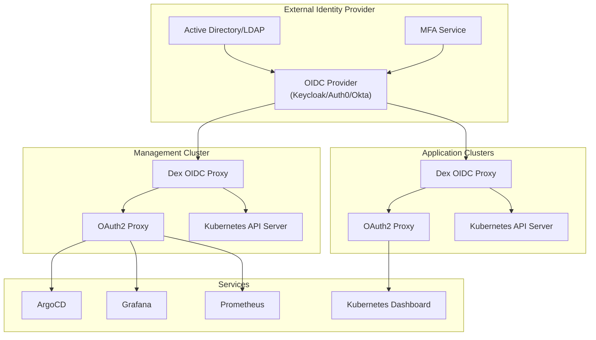

# Identity and Access Management (IAM) Strategy

## Overview
This document outlines the comprehensive Identity and Access Management (IAM) strategy for the RH OVE multi-cluster ecosystem, implementing authentication and authorization using OpenID Connect (OIDC) providers with enterprise-grade security controls.

## Executive Summary

The IAM strategy for the RH OVE multi-cluster ecosystem provides enterprise-grade identity and access management through a comprehensive OIDC-based approach that ensures security, compliance, and operational efficiency across all clusters and services.

### Key Components

#### 1. **Architecture Components**
- **Mermaid diagram** showing OIDC provider integration across management and application clusters
- **Identity Provider selection** with Keycloak as the recommended solution (Red Hat SSO)
- **Service integration** with ArgoCD, Grafana, Prometheus, and Kubernetes Dashboard
- **Dex OIDC Proxy** deployment for centralized authentication

#### 2. **Authentication Implementation**
- **OpenShift OAuth configuration** with native OIDC integration
- **Dex OIDC Proxy** for service-to-service authentication
- **Multi-Factor Authentication** using Keycloak authentication flows with mandatory MFA for admin accounts
- **JWT token management** with proper security controls and time-limited tokens
- **Single Sign-On (SSO)** seamless access across all clusters and services

#### 3. **Authorization Implementation**
- **Kubernetes RBAC integration** with OIDC groups mapping
- **ArgoCD RBAC configuration** for GitOps access control with application-specific permissions
- **Service Account token management** with time-limited tokens and projected volumes
- **Namespace-scoped permissions** aligned with application teams and business units
- **Role-Based Access Control** with predefined organizational roles

#### 4. **User Lifecycle Management**
- **SCIM integration** for automated user provisioning and deprovisioning
- **Group-based access control** with predefined roles (platform-admins, web-developers, database-admins, security-auditors)
- **Python automation examples** for user management workflows
- **Self-service capabilities** for password reset and account recovery

#### 5. **Security Controls**
- **Token security** with JWT validation rules and proper expiration policies
- **Network security** policies for authentication services with ingress/egress controls
- **Encryption and key management** with AES-256 and regular key rotation
- **Zero Trust Principles** implementation with least-privilege access patterns

#### 6. **Monitoring and Audit**
- **Prometheus metrics** for authentication monitoring and alerting
- **Grafana dashboards** for IAM visibility and operational insights
- **Kubernetes audit policies** for compliance logging and security tracking
- **Automated access reviews** and compliance reporting for SOC 2, GDPR, HIPAA
- **Failed authentication tracking** and security incident response

#### 7. **Disaster Recovery**
- **Identity provider backup** strategies with automated daily backups
- **Multi-region failover** configuration for high availability
- **High availability** for authentication services with automated health checks

### Technical Implementation Highlights

- **OIDC Provider Integration**: Keycloak (Red Hat SSO) as primary, with Auth0/Okta alternatives
- **Multi-Factor Authentication**: Mandatory for administrative accounts with TOTP/SMS support
- **Service Account Automation**: Time-limited tokens (15min-2hours) with proper lifecycle management
- **Audit and Compliance**: Complete alignment with SOC 2, GDPR, and HIPAA requirements
- **Enterprise Integration**: LDAP/Active Directory federation for existing identity infrastructure

### Business Benefits

- **Enhanced Security Posture**: Zero trust principles with identity-aware access controls
- **Operational Efficiency**: Centralized identity management across all clusters and services
- **Compliance Readiness**: Automated audit trails and regulatory framework alignment
- **Developer Experience**: Single sign-on with self-service capabilities
- **Cost Optimization**: Reduced operational overhead through automation

### Implementation Phases

1. **Phase 1**: Design and Planning (Identity provider selection, architecture design)
2. **Phase 2**: Deployment and Configuration (OIDC integration, RBAC implementation)
3. **Phase 3**: Testing and Validation (Security testing, SSO validation, user acceptance)
4. **Phase 4**: Monitoring and Maintenance (Metrics setup, audit automation, user training)

This IAM strategy ensures robust and flexible identity management, leveraging existing enterprise IAM solutions for seamless integration and compliance within the RH OVE multi-cluster ecosystem while providing a foundation for future growth and regulatory requirements.

## Architecture Components

### OIDC Provider Integration



### Identity Provider Selection

#### Recommended: Keycloak (Red Hat SSO)
- **Advantages**: Open source, Red Hat supported, full OIDC compliance
- **Features**: User federation, social login, fine-grained authorization
- **Integration**: Native OpenShift integration, Kubernetes RBAC mapping

#### Alternative: Enterprise Solutions
- **Auth0**: SaaS solution with extensive integrations
- **Okta**: Enterprise-grade with advanced security features
- **Azure AD**: Microsoft ecosystem integration

## Authentication Implementation

### OpenShift OAuth Configuration

```yaml
apiVersion: config.openshift.io/v1
kind: OAuth
metadata:
  name: cluster
spec:
  identityProviders:
  - name: keycloak-oidc
    mappingMethod: claim
    type: OpenID
    openID:
      clientID: openshift-cluster
      clientSecret:
        name: oidc-client-secret
      issuer: https://keycloak.company.com/auth/realms/openshift
      claims:
        preferredUsername:
        - preferred_username
        name:
        - name
        email:
        - email
        groups:
        - groups
```

### Dex OIDC Proxy Configuration

```yaml
apiVersion: v1
kind: ConfigMap
metadata:
  name: dex-config
  namespace: auth-system
data:
  config.yaml: |
    issuer: https://dex.company.com
    storage:
      type: kubernetes
      config:
        inCluster: true
    web:
      https: 0.0.0.0:5556
      tlsCert: /etc/dex/tls/tls.crt
      tlsKey: /etc/dex/tls/tls.key
    connectors:
    - type: oidc
      id: keycloak
      name: Keycloak
      config:
        issuer: https://keycloak.company.com/auth/realms/company
        clientID: dex-client
        clientSecret: $DEX_CLIENT_SECRET
        redirectURI: https://dex.company.com/callback
        scopes:
        - openid
        - profile
        - email
        - groups
    staticClients:
    - id: kubernetes
      redirectURIs:
      - https://kubectl.company.com/callback
      name: 'Kubernetes CLI'
      secret: $KUBERNETES_CLIENT_SECRET
    - id: argocd
      redirectURIs:
      - https://argocd.company.com/auth/callback
      name: 'ArgoCD'
      secret: $ARGOCD_CLIENT_SECRET
```

### Multi-Factor Authentication

```yaml
# Keycloak Authentication Flow
authenticationFlows:
  - alias: "browser-with-mfa"
    description: "Browser flow with mandatory MFA"
    providerId: "basic-flow"
    topLevel: true
    builtIn: false
    authenticationExecutions:
      - authenticator: "auth-cookie"
        requirement: "ALTERNATIVE"
      - authenticator: "auth-spnego"
        requirement: "DISABLED"
      - authenticator: "identity-provider-redirector"
        requirement: "ALTERNATIVE"
      - flowAlias: "forms"
        requirement: "ALTERNATIVE"
  - alias: "forms"
    description: "Username, password, otp and other auth forms."
    providerId: "basic-flow"
    topLevel: false
    builtIn: false
    authenticationExecutions:
      - authenticator: "auth-username-password-form"
        requirement: "REQUIRED"
      - authenticator: "auth-otp-form"
        requirement: "REQUIRED"
```

## Authorization Implementation

### Kubernetes RBAC Integration

```yaml
# ClusterRole for Platform Administrators
apiVersion: rbac.authorization.k8s.io/v1
kind: ClusterRole
metadata:
  name: platform-admin
rules:
- apiGroups: ["*"]
  resources: ["*"]
  verbs: ["*"]
---
# ClusterRoleBinding with OIDC Groups
apiVersion: rbac.authorization.k8s.io/v1
kind: ClusterRoleBinding
metadata:
  name: platform-admin-binding
subjects:
- kind: Group
  name: "platform-admins"
  apiGroup: rbac.authorization.k8s.io
roleRef:
  kind: ClusterRole
  name: platform-admin
  apiGroup: rbac.authorization.k8s.io
---
# Namespace-scoped Role for Application Teams
apiVersion: rbac.authorization.k8s.io/v1
kind: Role
metadata:
  namespace: app-web-prod
  name: app-developer
rules:
- apiGroups: [""]
  resources: ["pods", "services", "configmaps", "secrets"]
  verbs: ["get", "list", "create", "update", "patch", "delete"]
- apiGroups: ["apps"]
  resources: ["deployments", "replicasets"]
  verbs: ["get", "list", "create", "update", "patch", "delete"]
- apiGroups: ["kubevirt.io"]
  resources: ["virtualmachines", "virtualmachineinstances"]
  verbs: ["get", "list", "create", "update", "patch", "delete"]
---
# RoleBinding with OIDC Groups
apiVersion: rbac.authorization.k8s.io/v1
kind: RoleBinding
metadata:
  name: app-developer-binding
  namespace: app-web-prod
subjects:
- kind: Group
  name: "web-developers"
  apiGroup: rbac.authorization.k8s.io
roleRef:
  kind: Role
  name: app-developer
  apiGroup: rbac.authorization.k8s.io
```

### ArgoCD RBAC Integration

```yaml
apiVersion: v1
kind: ConfigMap
metadata:
  name: argocd-rbac-cm
  namespace: argocd
data:
  policy.default: role:readonly
  policy.csv: |
    # Platform Administrators
    g, platform-admins, role:admin
    
    # Application Teams
    g, web-developers, role:web-app-admin
    g, database-admins, role:database-admin
    
    # Custom Roles
    role:web-app-admin, applications, *, app-web-*/*, allow
    role:web-app-admin, repositories, *, *, allow
    role:web-app-admin, certificates, *, *, deny
    
    role:database-admin, applications, *, app-database-*/*, allow
    role:database-admin, repositories, *, *, allow
    role:database-admin, certificates, *, *, deny
```

### Service Account Token Management

```yaml
# Time-limited Service Account Tokens
apiVersion: v1
kind: Secret
metadata:
  name: build-robot-secret
  annotations:
    kubernetes.io/service-account.name: build-robot
    kubernetes.io/service-account.token-ttl: "3600"  # 1 hour
type: kubernetes.io/service-account-token
---
# Projected Service Account Token (Preferred)
apiVersion: v1
kind: Pod
metadata:
  name: nginx
spec:
  serviceAccountName: build-robot
  containers:
  - image: nginx
    name: nginx
    volumeMounts:
    - mountPath: /var/run/secrets/tokens
      name: vault-token
  volumes:
  - name: vault-token
    projected:
      sources:
      - serviceAccountToken:
          path: vault-token
          expirationSeconds: 7200  # 2 hours
          audience: vault
```

## User Lifecycle Management

### Automated User Provisioning

```python
# SCIM Integration Example
class SCIMUserProvisioning:
    def __init__(self, keycloak_client, kubernetes_client):
        self.keycloak = keycloak_client
        self.k8s = kubernetes_client
    
    def provision_user(self, user_data):
        # Create user in Keycloak
        user = self.keycloak.create_user({
            "username": user_data["username"],
            "email": user_data["email"],
            "firstName": user_data["firstName"],
            "lastName": user_data["lastName"],
            "enabled": True,
            "groups": user_data["groups"]
        })
        
        # Assign groups based on role
        for group in user_data["groups"]:
            self.keycloak.assign_group_to_user(user["id"], group)
        
        # Create ServiceAccount if needed
        if user_data.get("service_account"):
            self.create_service_account(user_data["username"])
    
    def deprovision_user(self, username):
        # Remove from Keycloak
        user = self.keycloak.get_user_by_username(username)
        self.keycloak.delete_user(user["id"])
        
        # Clean up Kubernetes resources
        self.cleanup_user_resources(username)
```

### Group-Based Access Control

```yaml
# Keycloak Group Configuration
groups:
  - name: "platform-admins"
    description: "Platform administrators with full cluster access"
    attributes:
      kubernetes-role: ["cluster-admin"]
      argocd-role: ["admin"]
  
  - name: "web-developers"
    description: "Web application developers"
    attributes:
      kubernetes-role: ["app-developer"]
      kubernetes-namespaces: ["app-web-prod", "app-web-staging", "app-web-dev"]
      argocd-role: ["web-app-admin"]
  
  - name: "database-admins"
    description: "Database administrators"
    attributes:
      kubernetes-role: ["app-developer"]
      kubernetes-namespaces: ["app-database-prod", "app-database-staging"]
      argocd-role: ["database-admin"]
  
  - name: "security-auditors"
    description: "Security team with read-only access"
    attributes:
      kubernetes-role: ["view"]
      argocd-role: ["readonly"]
```

## Security Controls

### Token Security

```yaml
# JWT Token Configuration
jwtPolicy:
  issuer: "https://keycloak.company.com/auth/realms/company"
  audiences:
    - "kubernetes"
    - "argocd"
    - "grafana"
  jwksUri: "https://keycloak.company.com/auth/realms/company/protocol/openid_connect/certs"
  
# Token Validation Rules
tokenValidation:
  expiration:
    accessToken: 900   # 15 minutes
    refreshToken: 3600 # 1 hour
    idToken: 300       # 5 minutes
  
  claims:
    required:
      - "iss"
      - "aud"
      - "exp"
      - "iat"
      - "sub"
    groups: "groups"
    email: "email"
    name: "name"
```

### Network Security

```yaml
# Network Policy for Auth Services
apiVersion: networking.k8s.io/v1
kind: NetworkPolicy
metadata:
  name: auth-system-netpol
  namespace: auth-system
spec:
  podSelector:
    matchLabels:
      app: dex
  policyTypes:
  - Ingress
  - Egress
  ingress:
  - from:
    - namespaceSelector:
        matchLabels:
          name: ingress-nginx
    ports:
    - protocol: TCP
      port: 5556
  egress:
  - to: []
    ports:
    - protocol: TCP
      port: 443  # HTTPS to external OIDC provider
  - to:
    - namespaceSelector:
        matchLabels:
          name: kube-system
    ports:
    - protocol: TCP
      port: 443  # Kubernetes API
```

## Monitoring and Audit

### Authentication Metrics

```yaml
# Prometheus ServiceMonitor for Dex
apiVersion: monitoring.coreos.com/v1
kind: ServiceMonitor
metadata:
  name: dex-metrics
  namespace: auth-system
spec:
  selector:
    matchLabels:
      app: dex
  endpoints:
  - port: metrics
    interval: 30s
    path: /metrics
---
# Grafana Dashboard Configuration
dashboard:
  title: "IAM Authentication Metrics"
  panels:
    - title: "Authentication Requests"
      type: "graph"
      targets:
        - expr: "rate(dex_requests_total[5m])"
          legendFormat: "{{method}} {{code}}"
    
    - title: "Active Sessions"
      type: "stat"
      targets:
        - expr: "dex_sessions_active"
    
    - title: "Failed Logins"
      type: "graph"
      targets:
        - expr: "rate(dex_requests_total{code!~"2.."}[5m])"
          legendFormat: "Failed Authentications"
```

### Audit Logging

```yaml
# Kubernetes Audit Policy
apiVersion: audit.k8s.io/v1
kind: Policy
rules:
# Log authentication events
- level: Request
  namespaces: ["kube-system", "auth-system"]
  verbs: ["create", "update", "delete"]
  resources:
  - group: ""
    resources: ["secrets", "serviceaccounts"]
  - group: "rbac.authorization.k8s.io"
    resources: ["roles", "rolebindings", "clusterroles", "clusterrolebindings"]

# Log user actions in application namespaces
- level: Metadata
  namespaces: ["app-web-prod", "app-database-prod"]
  verbs: ["create", "update", "delete"]
  users: ["system:serviceaccount:*"]
  omitStages:
  - RequestReceived
```

### Compliance Reporting

```python
# Automated Access Review
class AccessReviewAutomation:
    def __init__(self, k8s_client, keycloak_client):
        self.k8s = k8s_client
        self.keycloak = keycloak_client
    
    def generate_access_report(self):
        report = {
            "timestamp": datetime.now().isoformat(),
            "users": [],
            "service_accounts": [],
            "orphaned_resources": []
        }
        
        # Get all users from Keycloak
        keycloak_users = self.keycloak.get_all_users()
        
        for user in keycloak_users:
            user_report = {
                "username": user["username"],
                "email": user["email"],
                "groups": self.keycloak.get_user_groups(user["id"]),
                "last_login": user.get("lastAccess"),
                "kubernetes_access": self.get_k8s_user_access(user["username"])
            }
            report["users"].append(user_report)
        
        return report
    
    def get_k8s_user_access(self, username):
        # Get user's effective permissions
        access = []
        
        # Check ClusterRoleBindings
        cluster_bindings = self.k8s.list_cluster_role_binding()
        for binding in cluster_bindings.items:
            if self.user_in_binding(username, binding):
                access.append({
                    "type": "cluster",
                    "role": binding.role_ref.name,
                    "binding": binding.metadata.name
                })
        
        # Check RoleBindings per namespace
        for namespace in self.get_user_namespaces(username):
            role_bindings = self.k8s.list_namespaced_role_binding(namespace)
            for binding in role_bindings.items:
                if self.user_in_binding(username, binding):
                    access.append({
                        "type": "namespace",
                        "namespace": namespace,
                        "role": binding.role_ref.name,
                        "binding": binding.metadata.name
                    })
        
        return access
```

## Disaster Recovery

### Identity Provider Backup

```yaml
# Keycloak Backup Configuration
apiVersion: batch/v1
kind: CronJob
metadata:
  name: keycloak-backup
  namespace: auth-system
spec:
  schedule: "0 2 * * *"  # Daily at 2 AM
  jobTemplate:
    spec:
      template:
        spec:
          containers:
          - name: backup
            image: postgres:13
            command:
            - /bin/bash
            - -c
            - |
              pg_dump -h keycloak-db -U keycloak keycloak > /backup/keycloak-$(date +%Y%m%d).sql
              aws s3 cp /backup/keycloak-$(date +%Y%m%d).sql s3://iam-backups/
            env:
            - name: PGPASSWORD
              valueFrom:
                secretKeyRef:
                  name: keycloak-db-secret
                  key: password
            volumeMounts:
            - name: backup-volume
              mountPath: /backup
          volumes:
          - name: backup-volume
            emptyDir: {}
          restartPolicy: OnFailure
```

### Failover Configuration

```yaml
# Multi-Region OIDC Provider Setup
regions:
  primary:
    region: "us-east-1"
    keycloak_url: "https://keycloak-primary.company.com"
    dex_url: "https://dex-primary.company.com"
  
  secondary:
    region: "us-west-2"
    keycloak_url: "https://keycloak-secondary.company.com"
    dex_url: "https://dex-secondary.company.com"

# Automated Failover Logic
failover:
  health_check_interval: 30s
  failure_threshold: 3
  recovery_threshold: 2
  dns_ttl: 60  # Low TTL for quick failover
```

This comprehensive IAM strategy provides enterprise-grade identity and access management for the RH OVE multi-cluster ecosystem, ensuring security, compliance, and operational efficiency through OIDC-based authentication and Kubernetes-native authorization.
