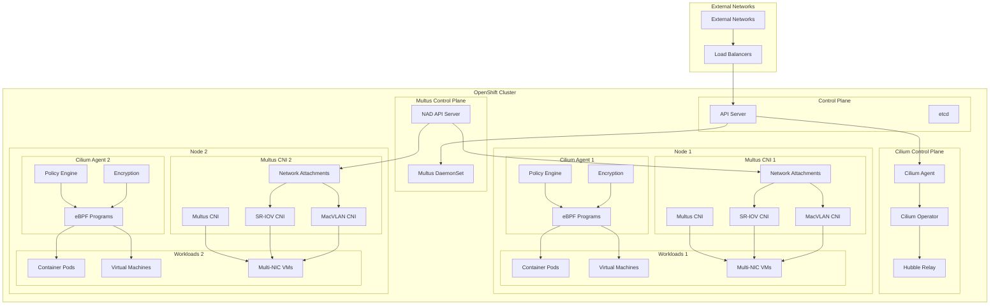
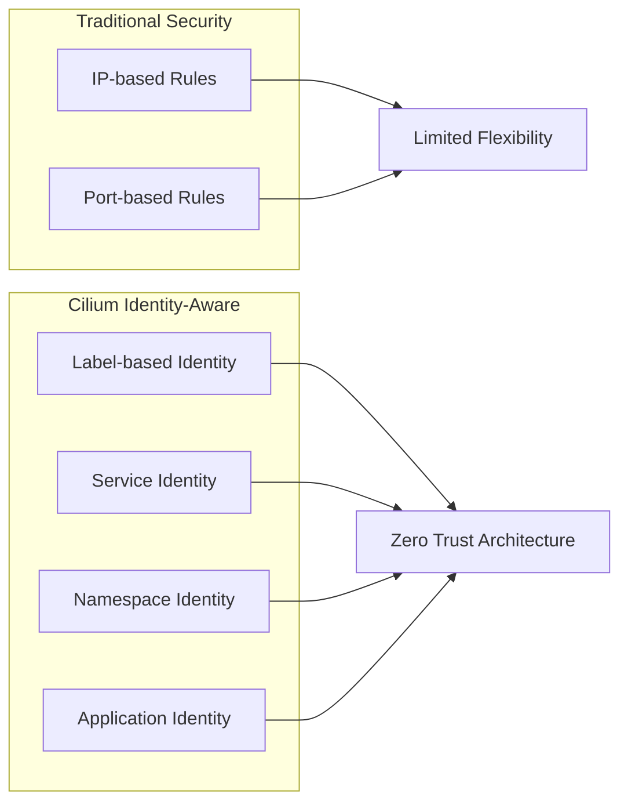
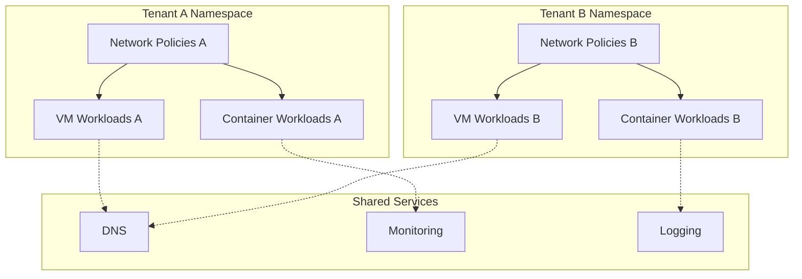
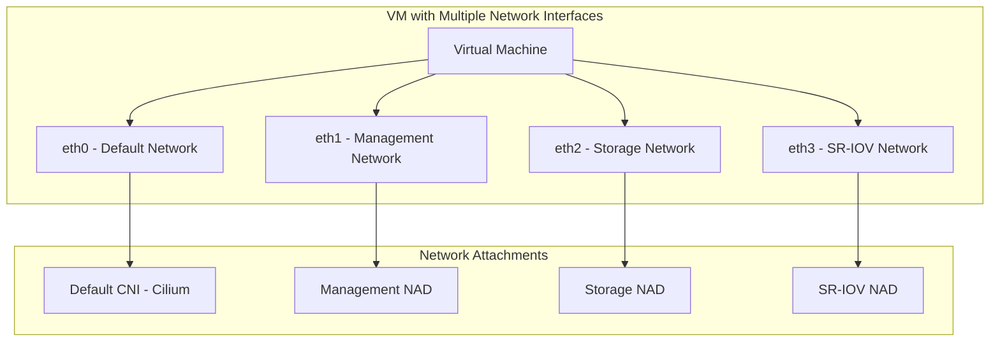
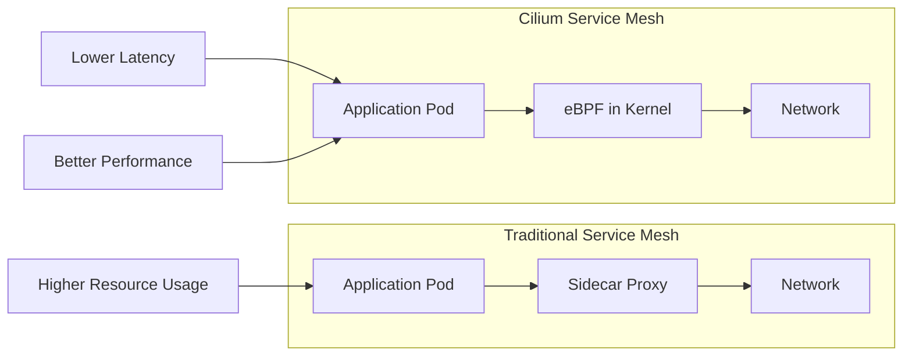
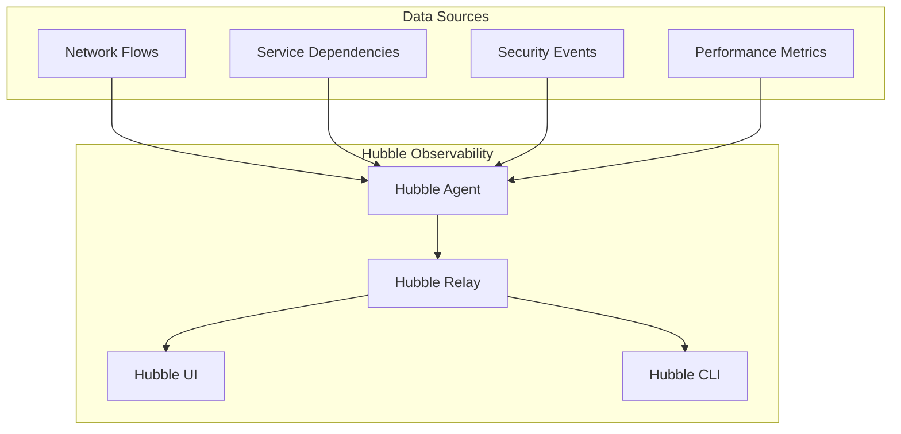

# Network Architecture

## Overview

The RH OVE network architecture leverages Cilium CNI for enhanced security and observability, providing advanced network capabilities through eBPF technology for both container and VM workloads.

## Cilium CNI Integration

Based on our research, using Cilium for RH OVE is widely regarded as a strong, future-proof approach with several key advantages:

### Benefits

- **Red Hat Certification**: Cilium is a certified CNI plugin for OpenShift
- **eBPF-Powered Enforcement**: Advanced security, visibility, and traffic control
- **Multi-platform Support**: Works for both containers and VMs in hybrid environments
- **High Performance**: Superior performance compared to traditional iptables-based CNIs
- **Service Mesh Capabilities**: L7 security and observability without sidecar proxies

## Network Architecture Diagram



## Network Security Features

### Identity-Aware Security



### Network Policies

#### Basic Network Policy for VMs

```yaml
apiVersion: cilium.io/v2
kind: CiliumNetworkPolicy
metadata:
  name: vm-web-policy
  namespace: app-web-prod
spec:
  endpointSelector:
    matchLabels:
      app: web-vm
  ingress:
  - fromEndpoints:
    - matchLabels:
        app: api-gateway
    toPorts:
    - ports:
      - port: "80"
        protocol: TCP
      - port: "443"
        protocol: TCP
  egress:
  - toEndpoints:
    - matchLabels:
        app: database-vm
    toPorts:
    - ports:
      - port: "5432"
        protocol: TCP
```

#### L7 HTTP Policy

```yaml
apiVersion: cilium.io/v2
kind: CiliumNetworkPolicy
metadata:
  name: l7-http-policy
spec:
  endpointSelector:
    matchLabels:
      app: web-api
  ingress:
  - fromEndpoints:
    - matchLabels:
        app: frontend
    toPorts:
    - ports:
      - port: "80"
        protocol: TCP
      rules:
        http:
        - method: "GET"
          path: "/api/v1/.*"
        - method: "POST"
          path: "/api/v1/users"
```

## Multi-Tenant Networking

### Namespace Isolation



### NetworkAttachmentDefinition for VMs

```yaml
apiVersion: k8s.cni.cncf.io/v1
kind: NetworkAttachmentDefinition
metadata:
  name: vm-network
  namespace: app-database-prod
spec:
  config: |
    {
      "cniVersion": "0.3.1",
      "name": "vm-network",
      "type": "cilium-cni",
      "ipam": {
        "type": "cilium"
      }
    }
```

## Multus Multi-Network Configuration

### Overview

Multus CNI enables attaching multiple network interfaces to pods and VMs, allowing for complex networking scenarios such as:
- Separation of management and data traffic
- VLAN-based network segmentation
- High-performance networking with SR-IOV
- Legacy application networking requirements



### Multus Installation

Multus is typically installed as part of OpenShift Container Platform:

```bash
# Verify Multus is installed
oc get network.operator.openshift.io cluster -o yaml

# Check Multus DaemonSet
oc get ds multus -n openshift-multus
```

### Network Attachment Definitions (NADs)

#### Management Network NAD

```yaml
apiVersion: k8s.cni.cncf.io/v1
kind: NetworkAttachmentDefinition
metadata:
  name: management-network
  namespace: vm-infrastructure
spec:
  config: |
    {
      "cniVersion": "0.3.1",
      "name": "management-network",
      "type": "macvlan",
      "master": "ens192",
      "mode": "bridge",
      "ipam": {
        "type": "static",
        "addresses": [
          {
            "address": "192.168.100.0/24",
            "gateway": "192.168.100.1"
          }
        ],
        "dns": {
          "nameservers": ["192.168.100.10", "8.8.8.8"]
        }
      }
    }
```

#### Storage Network NAD

```yaml
apiVersion: k8s.cni.cncf.io/v1
kind: NetworkAttachmentDefinition
metadata:
  name: storage-network
  namespace: vm-infrastructure
spec:
  config: |
    {
      "cniVersion": "0.3.1",
      "name": "storage-network",
      "type": "macvlan",
      "master": "ens224",
      "mode": "bridge",
      "ipam": {
        "type": "static",
        "addresses": [
          {
            "address": "10.0.200.0/24"
          }
        ]
      }
    }
```

#### VLAN-based Network NAD

```yaml
apiVersion: k8s.cni.cncf.io/v1
kind: NetworkAttachmentDefinition
metadata:
  name: vlan-100-network
  namespace: vm-production
spec:
  config: |
    {
      "cniVersion": "0.3.1",
      "name": "vlan-100-network",
      "type": "macvlan",
      "master": "ens192.100",
      "mode": "bridge",
      "ipam": {
        "type": "dhcp"
      }
    }
```

#### SR-IOV Network NAD

```yaml
apiVersion: k8s.cni.cncf.io/v1
kind: NetworkAttachmentDefinition
metadata:
  name: sriov-high-performance
  namespace: vm-production
spec:
  config: |
    {
      "cniVersion": "0.3.1",
      "name": "sriov-high-performance",
      "type": "sriov",
      "deviceID": "1017",
      "vf": 0,
      "ipam": {
        "type": "static",
        "addresses": [
          {
            "address": "10.0.50.0/24"
          }
        ]
      }
    }
```

### VM Configuration with Multiple Network Cards

#### VM with Multiple Interfaces

```yaml
apiVersion: kubevirt.io/v1
kind: VirtualMachine
metadata:
  name: multi-network-vm
  namespace: vm-infrastructure
  annotations:
    k8s.v1.cni.cncf.io/networks: |
      [
        {
          "name": "management-network",
          "ips": ["192.168.100.50/24"]
        },
        {
          "name": "storage-network",
          "ips": ["10.0.200.50/24"]
        },
        {
          "name": "vlan-100-network"
        }
      ]
spec:
  running: true
  template:
    metadata:
      labels:
        app: multi-network-app
    spec:
      domain:
        cpu:
          cores: 4
        memory:
          guest: 8Gi
        devices:
          interfaces:
          - name: default
            masquerade: {}
          - name: management
            bridge: {}
          - name: storage
            bridge: {}
          - name: vlan-network
            bridge: {}
          disks:
          - name: rootdisk
            disk:
              bus: virtio
        resources:
          requests:
            cpu: 4
            memory: 8Gi
      networks:
      - name: default
        pod: {}
      - name: management
        multus:
          networkName: management-network
      - name: storage
        multus:
          networkName: storage-network
      - name: vlan-network
        multus:
          networkName: vlan-100-network
      volumes:
      - name: rootdisk
        dataVolume:
          name: multi-network-vm-root
```

#### High-Performance VM with SR-IOV

```yaml
apiVersion: kubevirt.io/v1
kind: VirtualMachine
metadata:
  name: high-perf-vm
  namespace: vm-production
  annotations:
    k8s.v1.cni.cncf.io/networks: |
      [
        {
          "name": "management-network",
          "ips": ["192.168.100.100/24"]
        },
        {
          "name": "sriov-high-performance",
          "ips": ["10.0.50.100/24"]
        }
      ]
spec:
  running: true
  template:
    metadata:
      labels:
        app: high-performance-app
    spec:
      domain:
        cpu:
          cores: 8
          dedicatedCpuPlacement: true
        memory:
          guest: 16Gi
          hugepages:
            pageSize: 1Gi
        devices:
          interfaces:
          - name: default
            masquerade: {}
          - name: management
            bridge: {}
          - name: sriov-net
            sriov: {}
          disks:
          - name: rootdisk
            disk:
              bus: virtio
        resources:
          requests:
            cpu: 8
            memory: 16Gi
            hugepages-1Gi: 16Gi
      networks:
      - name: default
        pod: {}
      - name: management
        multus:
          networkName: management-network
      - name: sriov-net
        multus:
          networkName: sriov-high-performance
      volumes:
      - name: rootdisk
        dataVolume:
          name: high-perf-vm-root
```

### Advanced Multus Configurations

#### Bond Network Interface

```yaml
apiVersion: k8s.cni.cncf.io/v1
kind: NetworkAttachmentDefinition
metadata:
  name: bond-network
  namespace: vm-infrastructure
spec:
  config: |
    {
      "cniVersion": "0.3.1",
      "name": "bond-network",
      "type": "bond",
      "mode": "active-backup",
      "miimon": "100",
      "links": [
        {"name": "ens192"},
        {"name": "ens224"}
      ],
      "ipam": {
        "type": "static",
        "addresses": [
          {
            "address": "10.0.100.0/24",
            "gateway": "10.0.100.1"
          }
        ]
      }
    }
```

#### OVS Bridge Network

```yaml
apiVersion: k8s.cni.cncf.io/v1
kind: NetworkAttachmentDefinition
metadata:
  name: ovs-bridge-network
  namespace: vm-infrastructure
spec:
  config: |
    {
      "cniVersion": "0.3.1",
      "name": "ovs-bridge-network",
      "type": "ovs",
      "bridge": "br-data",
      "vlan": 200,
      "ipam": {
        "type": "static",
        "addresses": [
          {
            "address": "10.0.200.0/24"
          }
        ]
      }
    }
```

## Encryption and Security

### Transparent Encryption

Cilium supports both IPsec and WireGuard for transparent encryption:

```yaml
# Cilium ConfigMap for WireGuard encryption
apiVersion: v1
kind: ConfigMap
metadata:
  name: cilium-config
  namespace: kube-system
data:
  enable-wireguard: "true"
  wireguard-userspace-fallback: "true"
```

### Service Mesh without Sidecars



## Observability with Hubble

### Network Visibility



### Hubble Configuration

```yaml
apiVersion: v1
kind: ConfigMap
metadata:
  name: cilium-config
  namespace: kube-system
data:
  enable-hubble: "true"
  hubble-listen-address: ":4244"
  hubble-socket-path: "/var/run/cilium/hubble.sock"
  hubble-metrics-server: ":9091"
  hubble-metrics: >-
    dns:query;ignoreAAAA
    drop
    tcp
    flow
    icmp
    http
```

## VM-Specific Networking

### VM Network Integration

```yaml
apiVersion: kubevirt.io/v1
kind: VirtualMachine
metadata:
  name: database-vm
  namespace: app-database-prod
spec:
  template:
    spec:
      networks:
      - name: default
        pod: {}
      - name: vm-network
        multus:
          networkName: vm-network
      domain:
        devices:
          interfaces:
          - name: default
            masquerade: {}
          - name: vm-network
            bridge: {}
```

## Performance Optimization

### eBPF Performance Benefits

1. **Bypass iptables overhead**: Direct kernel-space processing
2. **Reduced context switches**: Fewer user-space to kernel-space transitions
3. **Optimized packet processing**: Custom eBPF programs for specific workloads
4. **Hardware acceleration**: Support for XDP (eXpress Data Path)

### Network Performance Tuning

```yaml
# Cilium DaemonSet configuration for performance
apiVersion: apps/v1
kind: DaemonSet
metadata:
  name: cilium
spec:
  template:
    spec:
      containers:
      - name: cilium-agent
        args:
        - --enable-bandwidth-manager=true
        - --enable-local-redirect-policy=true
        - --kube-proxy-replacement=strict
        resources:
          requests:
            cpu: 100m
            memory: 128Mi
          limits:
            cpu: 500m
            memory: 512Mi
```

## Integration with External Systems

### Load Balancer Integration

```yaml
apiVersion: cilium.io/v2alpha1
kind: CiliumLoadBalancerIPPool
metadata:
  name: vm-pool
spec:
  cidrs:
  - cidr: "10.100.0.0/24"
---
apiVersion: v1
kind: Service
metadata:
  name: vm-web-service
  annotations:
    io.cilium/lb-ipam-ips: "10.100.0.10"
spec:
  type: LoadBalancer
  selector:
    app: web-vm
  ports:
  - port: 80
    targetPort: 8080
```

## Troubleshooting and Monitoring

### Network Flow Monitoring

```bash
# Monitor network flows
hubble observe --namespace app-web-prod

# Check policy violations
hubble observe --verdict DENIED

# Monitor specific VM traffic
hubble observe --pod vm-database-vm-xxx
```

### Performance Metrics

Key metrics to monitor:
- Network throughput per VM/pod
- Policy enforcement latency
- eBPF program execution time
- Hubble flow processing rate

This network architecture provides enterprise-grade security, performance, and observability for mixed VM and container workloads in the RH OVE environment.
