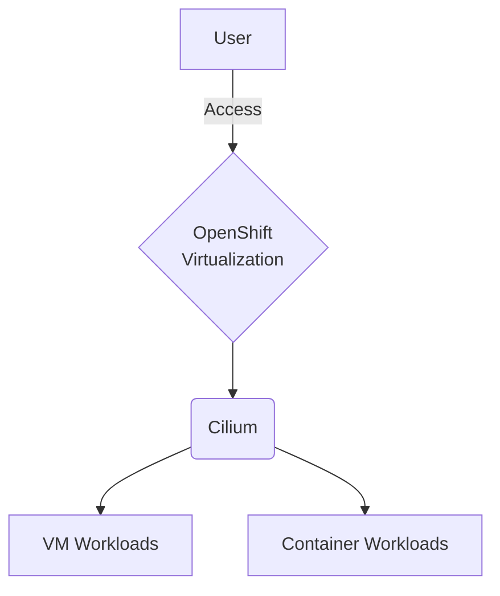

# RH OVE Solution Design and Architecture

## Overview
This document provides an overview of the RH OVE solution, detailing the architecture, deployment, and management strategies.

## Design Principles
- Utilize a namespace-based topology for isolation and security.
- Implement Cilium for network security using eBPF.
- Integrate multiplex workloads to optimize resource utilization.

## Network Architecture
Mermaid diagram for network architecture:

## Storage Architecture
Include storage considerations and architecture here.

