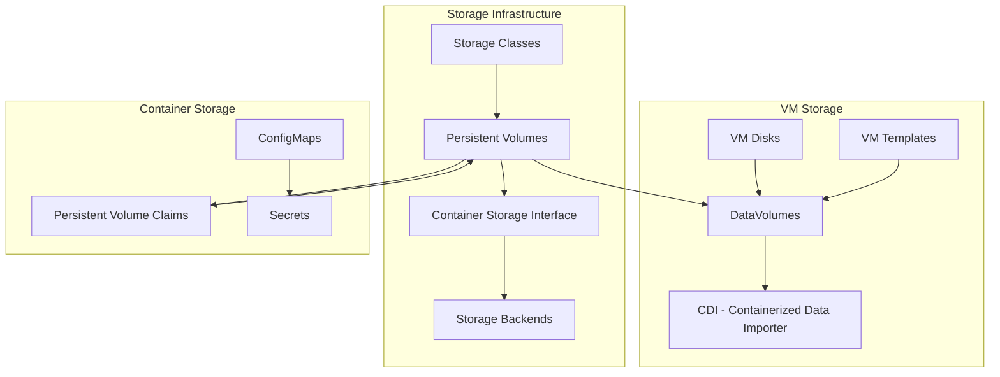
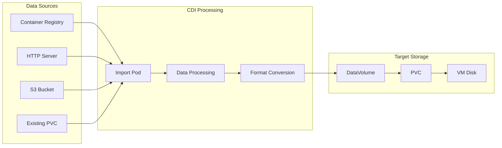
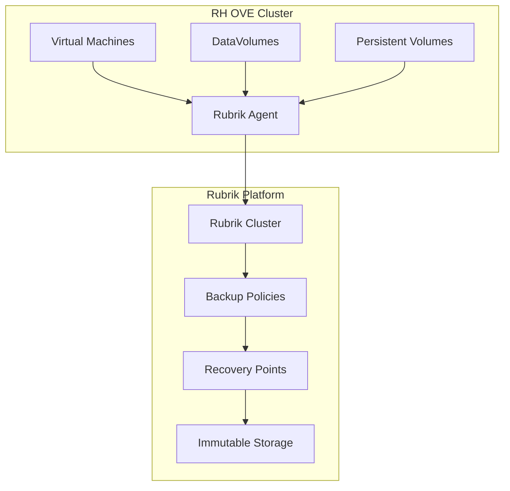
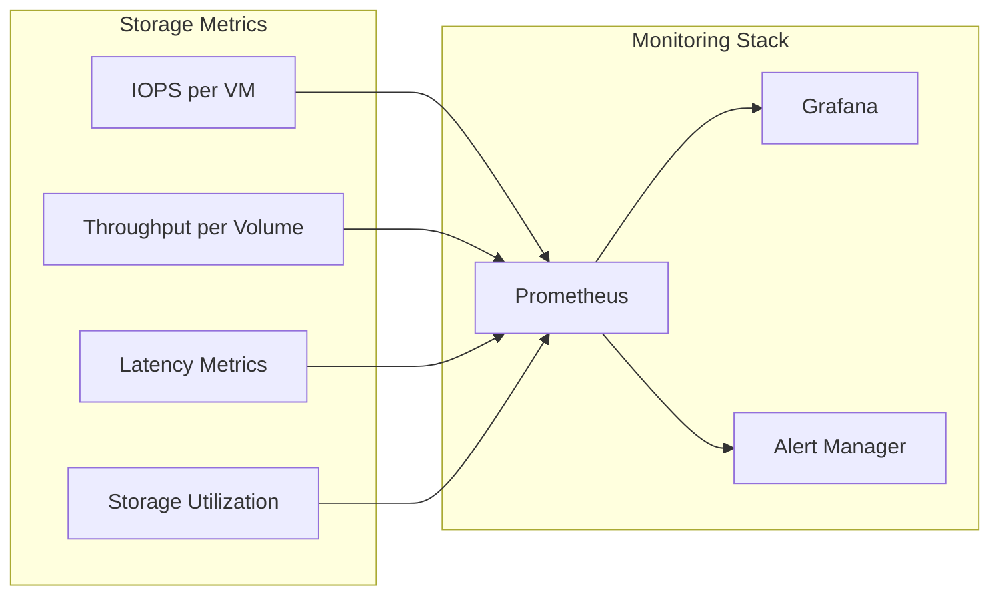

# Storage Architecture

## Overview

The RH OVE storage architecture provides unified storage management for both container and VM workloads, leveraging Kubernetes-native storage concepts while supporting traditional VM storage requirements.

## Storage Components



## DataVolume Management

### DataVolume CRD

DataVolumes are the primary mechanism for managing VM storage in RH OVE:

```yaml
apiVersion: cdi.kubevirt.io/v1beta1
kind: DataVolume
metadata:
  name: web-vm-disk
  namespace: app-web-prod
spec:
  pvc:
    accessModes:
    - ReadWriteOnce
    resources:
      requests:
        storage: 50Gi
    storageClassName: fast-ssd
  source:
    registry:
      url: "docker://registry.redhat.io/rhel8/rhel:latest"
```

### Storage Import Patterns



## Storage Classes and Performance Tiers

### Performance Tiers

```yaml
# High Performance SSD Storage Class
apiVersion: storage.k8s.io/v1
kind: StorageClass
metadata:
  name: high-performance-ssd
provisioner: kubernetes.io/no-provisioner
parameters:
  type: ssd
  iops: "10000"
  throughput: "500Mi"
reclaimPolicy: Delete
volumeBindingMode: WaitForFirstConsumer
---
# Standard HDD Storage Class
apiVersion: storage.k8s.io/v1
kind: StorageClass
metadata:
  name: standard-hdd
provisioner: kubernetes.io/no-provisioner
parameters:
  type: hdd
  iops: "1000"
  throughput: "100Mi"
reclaimPolicy: Retain
volumeBindingMode: WaitForFirstConsumer
---
# Archive Storage Class
apiVersion: storage.k8s.io/v1
kind: StorageClass
metadata:
  name: archive-storage
provisioner: kubernetes.io/no-provisioner
parameters:
  type: archive
  iops: "100"
  throughput: "50Mi"
reclaimPolicy: Retain
volumeBindingMode: WaitForFirstConsumer
```

## VM Disk Configuration

### VM with Multiple Disks

```yaml
apiVersion: kubevirt.io/v1
kind: VirtualMachine
metadata:
  name: database-vm
  namespace: app-database-prod
spec:
  template:
    spec:
      domain:
        devices:
          disks:
          - name: rootdisk
            disk:
              bus: virtio
          - name: datadisk
            disk:
              bus: virtio
          - name: logdisk
            disk:
              bus: virtio
        resources:
          requests:
            memory: 8Gi
            cpu: 4
      volumes:
      - name: rootdisk
        dataVolume:
          name: db-vm-root
      - name: datadisk
        dataVolume:
          name: db-vm-data
      - name: logdisk
        dataVolume:
          name: db-vm-logs
```

### DataVolume for Different Use Cases

```yaml
# Boot disk from registry
apiVersion: cdi.kubevirt.io/v1beta1
kind: DataVolume
metadata:
  name: db-vm-root
spec:
  pvc:
    accessModes: [ReadWriteOnce]
    resources:
      requests:
        storage: 30Gi
    storageClassName: high-performance-ssd
  source:
    registry:
      url: "docker://registry.access.redhat.com/rhel8/rhel:latest"
---
# Data disk - blank
apiVersion: cdi.kubevirt.io/v1beta1
kind: DataVolume
metadata:
  name: db-vm-data
spec:
  pvc:
    accessModes: [ReadWriteOnce]
    resources:
      requests:
        storage: 500Gi
    storageClassName: standard-hdd
  source:
    blank: {}
---
# Log disk - blank
apiVersion: cdi.kubevirt.io/v1beta1
kind: DataVolume
metadata:
  name: db-vm-logs
spec:
  pvc:
    accessModes: [ReadWriteOnce]
    resources:
      requests:
        storage: 100Gi
    storageClassName: standard-hdd
  source:
    blank: {}
```

## Storage Backup Integration

### Rubrik Integration for VM Storage

Based on our research, Rubrik provides certified integration with RH OVE for VM backup:



### Backup Policy Configuration

```yaml
apiVersion: v1
kind: ConfigMap
metadata:
  name: rubrik-backup-policy
  namespace: app-database-prod
data:
  policy.yaml: |
    vm_backup_policy:
      name: "database-vm-backup"
      frequency: "daily"
      retention: "30d"
      snapshot_consistency: "crash-consistent"
      backup_window: "02:00-06:00"
      exclude_disks:
        - "temp-disk"
        - "swap-disk"
```

## Storage Monitoring and Performance

### Storage Metrics

Key storage metrics to monitor:

```yaml
apiVersion: monitoring.coreos.com/v1
kind: ServiceMonitor
metadata:
  name: storage-metrics
spec:
  selector:
    matchLabels:
      app: cdi-controller
  endpoints:
  - port: metrics
    interval: 30s
    path: /metrics
```

### Performance Monitoring



## Storage Operations

### Volume Expansion

```yaml
# Expand a DataVolume
apiVersion: cdi.kubevirt.io/v1beta1
kind: DataVolume
metadata:
  name: web-vm-disk
  namespace: app-web-prod
spec:
  pvc:
    accessModes: [ReadWriteOnce]
    resources:
      requests:
        storage: 100Gi  # Increased from 50Gi
    storageClassName: fast-ssd
  source:
    pvc:
      name: web-vm-disk
      namespace: app-web-prod
```

### Volume Cloning

```yaml
# Clone a DataVolume for VM template
apiVersion: cdi.kubevirt.io/v1beta1
kind: DataVolume
metadata:
  name: web-vm-template-clone
  namespace: vm-templates
spec:
  pvc:
    accessModes: [ReadWriteOnce]
    resources:
      requests:
        storage: 50Gi
    storageClassName: fast-ssd
  source:
    pvc:
      name: web-vm-golden-image
      namespace: vm-templates
```

### Snapshot Management

```yaml
apiVersion: snapshot.storage.k8s.io/v1
kind: VolumeSnapshot
metadata:
  name: db-vm-snapshot-pre-upgrade
  namespace: app-database-prod
spec:
  volumeSnapshotClassName: csi-snapshotter
  source:
    persistentVolumeClaimName: db-vm-data
```

## Storage Security

### Encryption at Rest

```yaml
apiVersion: storage.k8s.io/v1
kind: StorageClass
metadata:
  name: encrypted-storage
provisioner: ebs.csi.aws.com
parameters:
  type: gp3
  encrypted: "true"
  kmsKeyId: "arn:aws:kms:region:account:key/key-id"
reclaimPolicy: Delete
volumeBindingMode: WaitForFirstConsumer
```

### Access Control

```yaml
apiVersion: rbac.authorization.k8s.io/v1
kind: Role
metadata:
  namespace: app-database-prod
  name: storage-admin
rules:
- apiGroups: [""]
  resources: ["persistentvolumeclaims"]
  verbs: ["get", "list", "create", "update", "patch", "delete"]
- apiGroups: ["cdi.kubevirt.io"]
  resources: ["datavolumes"]
  verbs: ["get", "list", "create", "update", "patch", "delete"]
- apiGroups: ["snapshot.storage.k8s.io"]
  resources: ["volumesnapshots"]
  verbs: ["get", "list", "create", "delete"]
```

## Best Practices

### Storage Planning
1. **Right-size storage**: Match storage performance to workload requirements
2. **Use appropriate storage classes**: Different tiers for different use cases
3. **Plan for growth**: Consider volume expansion capabilities
4. **Backup strategy**: Regular snapshots and external backups

### Performance Optimization
1. **Use SSD for high-IOPS workloads**: Database and application storage
2. **Separate storage by function**: OS, data, logs, and temp on different volumes
3. **Monitor storage metrics**: Track IOPS, throughput, and latency
4. **Implement storage quotas**: Prevent storage exhaustion

### Security Considerations
1. **Enable encryption at rest**: For sensitive data storage
2. **Implement access controls**: RBAC for storage resources
3. **Regular security scanning**: Check for storage-related vulnerabilities
4. **Audit storage access**: Monitor who accesses what storage

This storage architecture ensures reliable, performant, and secure storage management for the hybrid VM and container workloads in the RH OVE environment.
