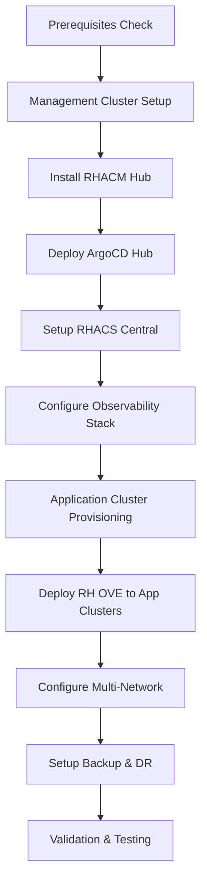

# Installation Guide

## Overview

This installation guide provides step-by-step instructions to deploy the RH OVE ecosystem using a multi-cluster architecture. The deployment follows a hub-and-spoke pattern with one management cluster and multiple application clusters for different environments (production, staging, development).

## Multi-Cluster Architecture

The RH OVE ecosystem consists of:

- **1 Management Cluster**: Centralized control plane for governance, policy, monitoring, and GitOps

- **N Application Clusters**: Dedicated workload execution environments for virtual machines and containers

## Installation Flow



## Core Component Installation

### OpenShift Cluster Setup

1. **Install OpenShift**
   - Follow [OpenShift Installation Docs](https://docs.openshift.com/) to set up the cluster.
   - Choose between IPI or UPI depending on your infrastructure.

2. **Verify Cluster Health**
   ```bash
   oc get nodes
   oc get pods -n openshift-apiserver
   ```

### Virtualization Operator

1. **Install OpenShift Virtualization**
   ```bash
   oc apply -f https://path/to/virtualization-operator.yaml
   ```

2. **Verify Installation**
   ```bash
   oc get pods -n openshift-cnv
   oc get kubevirt.kubevirt.io/kubevirt -n openshift-cnv
   ```

### Cilium CNI

1. **Install Cilium**
   ```bash
   helm repo add cilium https://helm.cilium.io/
   helm install cilium cilium/cilium --namespace kube-system
   ```

2. **Verify Cilium Status**
   ```bash
   cilium status
   ```

### Kyverno Policy Engine

1. **Install Kyverno**
   ```bash
   kubectl create -f https://github.com/kyverno/kyverno/releases/download/v1.5.2/install.yaml
   ```

2. **Apply Policies**
   ```bash
   kubectl apply -f /path/to/policy-files
   ```

## Monitoring Setup

### Dynatrace Integration

1. **Install Dynatrace Operator**
   ```bash
   oc apply -f https://path/to/dynatrace-operator.yaml
   ```

2. **Configure DynaKube**
   ```bash
   oc apply -f /path/to/dynakube-config.yaml
   ```

3. **Verify Monitoring**
   ```bash
   oc get pods -n dynatrace
   ```

### Prometheus and Grafana

1. **Install Prometheus Operator**
   ```bash
   oc apply -f https://path/to/prometheus-operator.yaml
   ```

2. **Setup Grafana**
   ```bash
   oc apply -f https://path/to/grafana-deployment.yaml
   ```

## Backup Configuration

### Rubrik Integration

1. **Install Rubrik Operator**
   ```bash
   oc apply -f https://path/to/rubrik-operator.yaml
   ```

2. **Verify Backup**
   ```bash
   oc get pods -n rubrik
   ```

## GitOps Setup

### Argo CD Installation

1. **Install Argo CD**
   ```bash
   oc apply -n argocd -f https://path/to/argocd-install.yaml
   ```

2. **Access Argo CD UI**
   - Forward Argo CD API server port:
     ```bash
     oc port-forward svc/argocd-server -n argocd 8080:443
     ```

3. **Login to Argo CD**
   - Open [https://localhost:8080](https://localhost:8080) in your browser.

4. **Deploy Applications**
   ```bash
   argocd app create my-app --repo https://git.example.com/my-app --path ./
   argocd app sync my-app
   ```

## Security Hardening

1. **Configure RBAC**
   ```bash
   oc apply -f /path/to/rbac-config.yaml
   ```

2. **Enable Pod Security**
   ```bash
   oc apply -f /path/to/pod-security.yaml
   ```

3. **Firewall Adjustments**
   - Ensure only necessary ports are open (refer to [prerequisites](prerequisites.md)).

## Validation Steps

### Verify All Deployments

```bash
oc get all --all-namespaces
```

### Check Monitoring Dashboards

- Confirm metrics collection in Grafana and Dynatrace.

## Post-Installation Tasks

### Documentation

- Update [MkDocs](../mkdocs.yml) with new components.

### Backup Verification

- Test Rubrik backups for VM and container data.

## Conclusion

This guide ensures a smooth installation process for RH OVE, covering all critical steps and components necessary for successful deployment and operation. Follow each section carefully to complete the installation.

