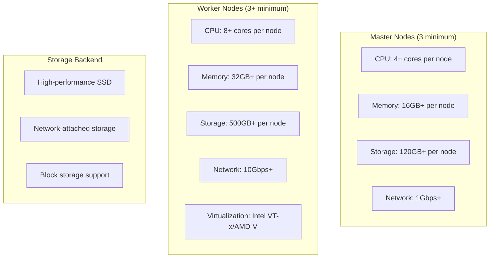
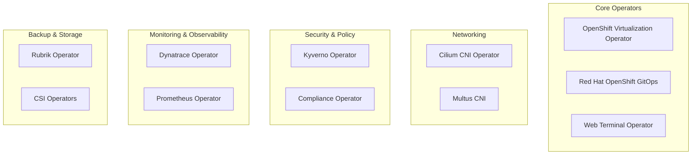
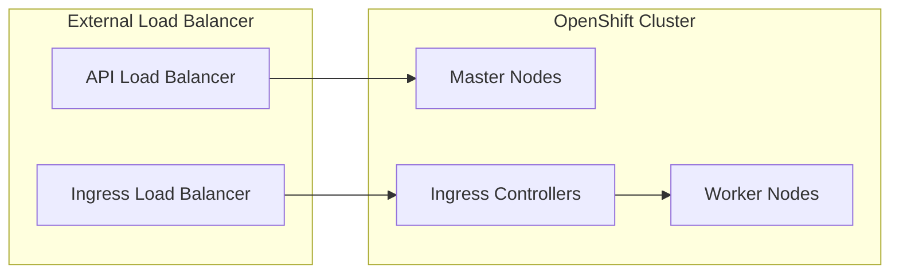
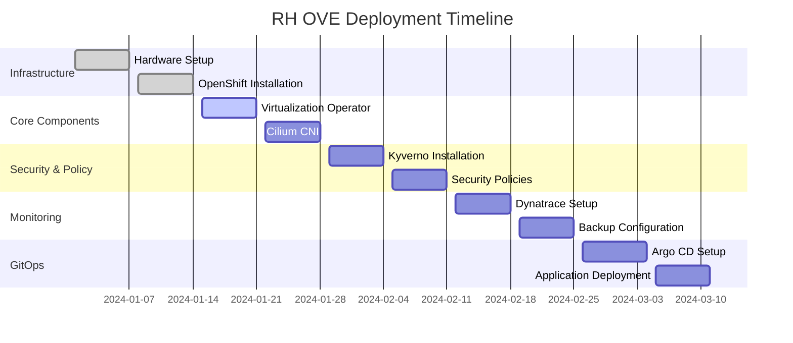

# Prerequisites

## Overview

This document outlines the prerequisites for deploying the RH OVE ecosystem, including infrastructure requirements, software dependencies, and configuration prerequisites.

## Infrastructure Requirements

### Hardware Requirements



### Virtualization Support

Ensure hardware virtualization is enabled:

```bash
# Check for Intel VT-x
grep -E "(vmx|svm)" /proc/cpuinfo

# Check if virtualization is enabled in BIOS
lscpu | grep Virtualization

# Verify KVM modules are loaded
lsmod | grep kvm
```

### Network Requirements

- **Cluster Network**: Internal cluster communication
- **Service Network**: Service-to-service communication  
- **Pod Network**: Pod-to-pod communication
- **External Access**: Load balancer and ingress traffic

```yaml
# Network configuration example
cluster_network:
  cidr: "10.128.0.0/14"
  host_prefix: 23

service_network:
  - "172.30.0.0/16"

machine_networks:
  - cidr: "192.168.1.0/24"
```

## Software Prerequisites

### OpenShift Container Platform

- **Version**: OpenShift 4.12+ (recommended 4.14+)
- **Installation Method**: IPI (Installer Provisioned Infrastructure) or UPI (User Provisioned Infrastructure)
- **Cluster Admin Access**: Required for operator installation

### Required Operators



### Storage Requirements

#### Container Storage Interface (CSI) Drivers

```yaml
# Example CSI StorageClass
apiVersion: storage.k8s.io/v1
kind: StorageClass
metadata:
  name: rh-ove-ssd
provisioner: ebs.csi.aws.com
parameters:
  type: gp3
  encrypted: "true"
reclaimPolicy: Delete
volumeBindingMode: WaitForFirstConsumer
allowVolumeExpansion: true
```

#### Storage Classes Required

- **Fast SSD**: For VM boot disks and high-IOPS workloads
- **Standard HDD**: For data storage and backup
- **Archive**: For long-term storage and compliance

## Network Prerequisites

### DNS Configuration

```yaml
# DNS configuration for cluster
dns:
  base_domain: "ove.example.com"
  cluster_domain: "cluster.local"
metadata:
  name: "rh-ove-cluster"
```

### Load Balancer Configuration



### Firewall Rules

Required ports for RH OVE:

| Port Range | Protocol | Purpose |
|------------|----------|---------|
| 6443 | TCP | Kubernetes API server |
| 22623 | TCP | Machine config server |
| 80/443 | TCP | HTTP/HTTPS ingress |
| 9000-9999 | TCP | Host level services |
| 10250-10259 | TCP | Kubernetes node ports |
| 30000-32767 | TCP | NodePort services |

## Security Prerequisites

### Certificate Management

```yaml
# TLS certificate configuration
tls:
  ca_cert: |
    -----BEGIN CERTIFICATE-----
    # CA certificate content
    -----END CERTIFICATE-----
  
  api_cert: |
    -----BEGIN CERTIFICATE-----
    # API server certificate
    -----END CERTIFICATE-----
```

### RBAC Configuration

Prepare service accounts and roles:

```yaml
apiVersion: v1
kind: ServiceAccount
metadata:
  name: rh-ove-admin
  namespace: openshift-cnv
---
apiVersion: rbac.authorization.k8s.io/v1
kind: ClusterRoleBinding
metadata:
  name: rh-ove-admin-binding
roleRef:
  apiGroup: rbac.authorization.k8s.io
  kind: ClusterRole
  name: cluster-admin
subjects:
- kind: ServiceAccount
  name: rh-ove-admin
  namespace: openshift-cnv
```

## External System Prerequisites

### Git Repository Setup

For GitOps implementation:

```bash
# Create GitOps repository structure
mkdir -p rh-ove-gitops/{applications,infrastructure,policies}

# Initialize Git repository
cd rh-ove-gitops
git init
git remote add origin https://git.example.com/rh-ove-gitops.git
```

### Rubrik Backup System

Prerequisites for Rubrik integration:

- **Rubrik cluster**: Version 5.0+
- **Network connectivity**: Cluster to Rubrik management network
- **Service account**: With backup and restore permissions
- **API access**: Rubrik REST API credentials

```yaml
# Rubrik connection configuration
apiVersion: v1
kind: Secret
metadata:
  name: rubrik-credentials
  namespace: rubrik-system
type: Opaque
stringData:
  username: "rubrik-service-account"
  password: "secure-password"
  cluster-address: "rubrik.example.com"
```

### Dynatrace Monitoring

Prerequisites for Dynatrace integration:

- **Dynatrace tenant**: SaaS or Managed
- **API tokens**: With required permissions
- **Network access**: Cluster to Dynatrace endpoints

```yaml
# Dynatrace API token secret
apiVersion: v1
kind: Secret
metadata:
  name: dynakube
  namespace: dynatrace
type: Opaque
stringData:
  apiToken: "dt0c01.xxxxx"
  dataIngestToken: "dt0c01.yyyyy"
```

### ServiceNow CMDB

For CMDB integration:

- **ServiceNow instance**: With CMDB module
- **Service account**: With CMDB read/write permissions
- **API access**: REST API and webhooks configured

## Validation Checklist

### Pre-Installation Checks

```yaml
# Validation script example
apiVersion: v1
kind: ConfigMap
metadata:
  name: pre-install-checks
data:
  validate.sh: |
    #!/bin/bash
    
    # Check OpenShift version
    oc version
    
    # Verify cluster resources
    oc get nodes
    oc get storageclass
    
    # Check virtualization support
    oc get nodes -o json | jq '.items[].status.allocatable'
    
    # Validate network connectivity
    curl -k https://registry.redhat.io/health
```

### Resource Verification

```bash
# Check available resources
oc adm top nodes

# Verify storage classes
oc get storageclass

# Check network plugins
oc get network.config/cluster -o yaml

# Validate image registry access
oc get imagestreams -n openshift
```

## Installation Timeline



This comprehensive prerequisites guide ensures all necessary components and configurations are in place before beginning the RH OVE deployment process.
