# RH OVE Ecosystem Design and Management

Welcome to the comprehensive guide for designing, deploying, and managing the multi-cluster RH OVE ecosystem.

## Solution Overview

This documentation covers a complete multi-cluster RH OVE implementation consisting of:

- **1 Management Cluster**: Centralized control plane for governance, policy, monitoring, and GitOps
- **N Application Clusters**: Dedicated workload execution environments for virtual machines and containers

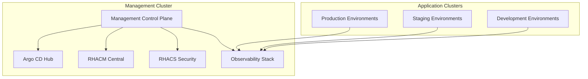

## Key Features

### 1. Design Phase
- **Multi-cluster topology** for separation of management and workloads
- **Centralized governance** through the management cluster
- **Consistent security** using RHACS and Kyverno policies

### 2. Deployment Phase
- **Rubrik integration** for enterprise backup and recovery
- **Dynatrace monitoring** for comprehensive observability
- **GitOps methodology** using Argo CD for declarative management

### 3. Management Phase
- **Enhanced admission control** with OpenShift defaults plus Kyverno policies
- **CRD-based management** leveraging KubeVirt resources
- **Event-driven integrations** with CMDB systems

### 4. Best Practices
- Resource management and multi-tenancy
- Security and isolation enforcement
- Continuous improvement through monitoring

### 5. References
Comprehensive product documentation and URIs for all integrated components.

## Getting Started

1. Review the [Architecture Overview](architecture/overview.md)
2. Follow the [Installation Guide](deployment/installation.md)
3. Configure [Admission Control](management/admission-control.md)
4. Set up [Monitoring](management/monitoring.md)

## Architecture Diagram

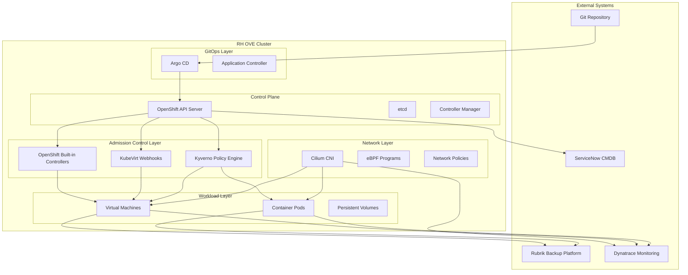

This solution provides a modern, secure, and scalable approach to managing virtualized workloads alongside containerized applications in a unified OpenShift platform.


\newpage

# RH OVE Ecosystem Context Diagram

## Overview

This context diagram provides a high-level view of the RH OVE (Red Hat OpenShift Virtualization Engine) ecosystem within the broader enterprise environment. It illustrates the system boundaries, external entities, data flows, and key integrations that define how the RH OVE ecosystem interacts with users, external systems, and enterprise services.

## Executive Summary

The RH OVE ecosystem represents a strategic modernization initiative that transforms enterprise virtualization infrastructure while preserving existing investments. This platform enables organizations to migrate from traditional virtualization (VMware) to a cloud-native, Kubernetes-based solution that supports both virtual machines and containers on a unified platform.

### High-Level Business Context

```mermaid
graph TB
    subgraph "Business Drivers"
        COST[Cost Optimization]
        AGILITY[Business Agility]
        INNOVATION[Digital Innovation]
        COMPLIANCE[Regulatory Compliance]
    end
    
    subgraph "Current State - Legacy Infrastructure"
        VMWARE_OLD[VMware vSphere]
        LEGACY_APPS[Legacy Applications]
        SILOS[Infrastructure Silos]
        MANUAL[Manual Operations]
    end
    
    subgraph "RH OVE Ecosystem - Target State"
        direction TB
        UNIFIED[Unified Platform]
        AUTOMATION[Automated Operations]
        MODERN[Modern Workloads]
        HYBRID[Hybrid Capabilities]
    end
    
    subgraph "Business Outcomes"
        TCO[Reduced TCO]
        TTM[Faster Time-to-Market]
        SCALE[Improved Scalability]
        RISK[Reduced Risk]
    end
    
    subgraph "Enterprise Integration"
        IDENTITY[Enterprise Identity]
        SECURITY[Security Systems]
        MONITORING[Enterprise Monitoring]
        BACKUP[Data Protection]
    end
    
    %% Business Flow
    COST --> UNIFIED
    AGILITY --> AUTOMATION
    INNOVATION --> MODERN
    COMPLIANCE --> SECURITY
    
    %% Transformation Flow
    VMWARE_OLD -.-> UNIFIED
    LEGACY_APPS -.-> MODERN
    SILOS -.-> HYBRID
    MANUAL -.-> AUTOMATION
    
    %% Integration
    UNIFIED --> IDENTITY
    AUTOMATION --> MONITORING
    MODERN --> SECURITY
    HYBRID --> BACKUP
    
    %% Outcomes
    UNIFIED --> TCO
    AUTOMATION --> TTM
    MODERN --> SCALE
    HYBRID --> RISK
    
    %% Styling
    classDef businessClass fill:#e3f2fd,stroke:#1565c0,stroke-width:3px
    classDef legacyClass fill:#fff3e0,stroke:#f57c00,stroke-width:2px
    classDef targetClass fill:#e8f5e8,stroke:#2e7d32,stroke-width:3px
    classDef outcomeClass fill:#f3e5f5,stroke:#7b1fa2,stroke-width:3px
    classDef integrationClass fill:#fce4ec,stroke:#c2185b,stroke-width:2px
    
    class COST,AGILITY,INNOVATION,COMPLIANCE businessClass
    class VMWARE_OLD,LEGACY_APPS,SILOS,MANUAL legacyClass
    class UNIFIED,AUTOMATION,MODERN,HYBRID targetClass
    class TCO,TTM,SCALE,RISK outcomeClass
    class IDENTITY,SECURITY,MONITORING,BACKUP integrationClass
```

### Strategic Value Proposition

#### **Modernization Without Disruption**
- Migrate from VMware to cloud-native platform while maintaining existing VM workloads
- Gradual transformation path that minimizes business risk
- Unified platform for both virtual machines and containers

#### **Cost Optimization**
- Eliminate VMware licensing costs and vendor lock-in
- Reduce infrastructure complexity and operational overhead
- Optimize resource utilization through intelligent workload placement

#### **Enhanced Agility**
- GitOps-driven automation for rapid deployment and scaling
- Self-service capabilities for development teams
- Faster time-to-market for new applications and services

#### **Enterprise-Grade Security and Compliance**
- Zero-trust architecture with micro-segmentation
- Integrated security scanning and policy enforcement
- Comprehensive audit trails and compliance reporting

## System Context

The RH OVE ecosystem operates as a comprehensive multi-cluster virtualization platform that bridges traditional virtualization workloads with modern cloud-native operations, providing seamless integration with enterprise infrastructure and services.

## Context Diagram

```mermaid
graph LR
    %% External Users and Roles
    subgraph "Enterprise Users"
        DEV[Developers]
        OPS[Operations Teams]
        SEC[Security Teams]
        BIZ[Business Users]
        ADM[Platform Administrators]
    end
    
    %% External Enterprise Systems
    subgraph "Enterprise Identity & Access"
        AD[Active Directory/LDAP]
        SSO[Enterprise SSO/OIDC]
        PAM[Privileged Access Management]
    end
    
    subgraph "Enterprise Management"
        CMDB[Configuration Management Database]
        ITSM[IT Service Management]
        SIEM[Security Information Event Management]
        ASSET[Asset Management Systems]
    end
    
    subgraph "Enterprise Infrastructure"
        DNS[Enterprise DNS]
        NTP[Network Time Protocol]
        PKI[Public Key Infrastructure]
        PROXY[Enterprise Proxy/Firewall]
        LB[Load Balancers]
        IPAM[IP Address Management]
    end
    
    subgraph "Data Center Infrastructure"
        COMPUTE[Physical/Virtual Compute]
        STORAGE[Enterprise Storage Systems]
        NETWORK[Enterprise Network Infrastructure]
        BACKUP[Enterprise Backup Systems]
    end
    
    subgraph "External Services"
        REGISTRY[Container Registries]
        REPOS[Git Repositories]
        MONITOR[External Monitoring]
        CLOUD[Public Cloud Services]
    end
    
    %% RH OVE Ecosystem - Main System
    subgraph "RH OVE Ecosystem" 
        direction TB
        
        subgraph "Management Plane"
            MGMT[Management Cluster]
            GITOPS[GitOps Platform - ArgoCD]
            POLICY[Policy Management - Kyverno]
            SECURITY[Security - RHACS]
            OBSERV[Observability Stack]
            CLUSTER_MGMT[Multi-Cluster Management - RHACM]
        end
        
        subgraph "Application Planes"
            PROD[Production Clusters]
            STAGING[Staging Clusters]
            DEV_CLUSTER[Development Clusters]
            EDGE[Edge Clusters]
        end
        
        subgraph "Virtualization Layer"
            KUBEVIRT[KubeVirt Engine]
            VM_WORKLOADS[Virtual Machine Workloads]
            CONTAINER_WORKLOADS[Container Workloads]
        end
        
        subgraph "Infrastructure Services"
            CNI[Cilium CNI]
            CSI[Storage CSI Drivers]
            MULTUS[Multi-Network - Multus]
            BACKUP_AGENT[Backup Agents]
        end
    end
    
    %% Legacy Systems Integration
    subgraph "Legacy Infrastructure"
        VMWARE[VMware Infrastructure]
        LEGACY_APP[Legacy Applications]
        MAINFRAME[Mainframe Systems]
        PHYSICAL[Physical Servers]
    end
    
    %% External Connections - Users
    DEV --> MGMT
    OPS --> MGMT
    SEC --> SECURITY
    BIZ --> VM_WORKLOADS
    ADM --> CLUSTER_MGMT
    
    %% External Connections - Identity
    AD --> MGMT
    SSO --> MGMT
    PAM --> MGMT
    
    %% External Connections - Management
    MGMT --> CMDB
    MGMT --> ITSM
    SECURITY --> SIEM
    OBSERV --> MONITOR
    MGMT --> ASSET
    
    %% External Connections - Infrastructure
    MGMT --> DNS
    MGMT --> NTP
    MGMT --> PKI
    MGMT --> PROXY
    LB --> MGMT
    MULTUS -.-> IPAM
    CNI -.-> DNS
    CSI -.-> PKI
    
    %% External Connections - Data Center
    KUBEVIRT --> COMPUTE
    CSI -.-> STORAGE
    CNI -.-> NETWORK
    MULTUS -.-> NETWORK
    BACKUP_AGENT -.-> BACKUP
    
    %% External Connections - Services
    GITOPS --> REPOS
    MGMT --> REGISTRY
    OBSERV --> MONITOR
    MGMT --> CLOUD
    
    %% Legacy Integration
    KUBEVIRT --> VMWARE
    VM_WORKLOADS --> LEGACY_APP
    KUBEVIRT --> PHYSICAL
    
    %% Internal Connections
    MGMT --> PROD
    MGMT --> STAGING
    MGMT --> DEV_CLUSTER
    MGMT --> EDGE
    
    GITOPS --> PROD
    GITOPS --> STAGING
    GITOPS --> DEV_CLUSTER
    
    POLICY --> PROD
    POLICY --> STAGING
    POLICY --> DEV_CLUSTER
    
    SECURITY --> PROD
    SECURITY --> STAGING
    SECURITY --> DEV_CLUSTER
    
    OBSERV --> PROD
    OBSERV --> STAGING
    OBSERV --> DEV_CLUSTER
    
    %% Styling
    classDef userClass fill:#e1f5fe,stroke:#01579b,stroke-width:2px
    classDef enterpriseClass fill:#f3e5f5,stroke:#4a148c,stroke-width:2px
    classDef coreClass fill:#e8f5e8,stroke:#1b5e20,stroke-width:2px
    classDef legacyClass fill:#fff3e0,stroke:#e65100,stroke-width:2px
    classDef infraClass fill:#fce4ec,stroke:#880e4f,stroke-width:2px
    
    class DEV,OPS,SEC,BIZ,ADM userClass
    class AD,SSO,PAM,CMDB,ITSM,SIEM,ASSET,DNS,NTP,PKI,PROXY,LB,IPAM enterpriseClass
    class MGMT,GITOPS,POLICY,SECURITY,OBSERV,CLUSTER_MGMT,PROD,STAGING,DEV_CLUSTER,EDGE,KUBEVIRT coreClass
    class VMWARE,LEGACY_APP,MAINFRAME,PHYSICAL legacyClass
    class COMPUTE,STORAGE,NETWORK,BACKUP,REGISTRY,REPOS,MONITOR,CLOUD infraClass
```

## System Boundaries and Responsibilities

### RH OVE Ecosystem Core
The central system encompasses:
- **Management Plane**: Centralized governance, policy, and operations control
- **Application Planes**: Multiple clusters for different environments and purposes
- **Virtualization Layer**: KubeVirt-based VM and container workload execution
- **Infrastructure Services**: Networking, storage, and backup integration

### Key External Integrations

#### Identity and Access Management
- **Active Directory/LDAP**: Enterprise user directory integration
- **Enterprise SSO/OIDC**: Single sign-on and OAuth/OIDC authentication
- **Privileged Access Management**: Elevated access control and auditing

#### Enterprise Management Systems
- **CMDB**: Configuration item tracking and relationship mapping
- **ITSM**: Service request and incident management integration
- **SIEM**: Security event correlation and threat detection
- **Asset Management**: Hardware and software asset tracking

#### Infrastructure Dependencies
- **Enterprise DNS**: Name resolution services
- **NTP**: Time synchronization across all components
- **PKI**: Certificate management and trust establishment
- **IPAM**: IP Address Management for network planning and allocation
- **Network Infrastructure**: Physical and virtual networking
- **Storage Systems**: Persistent storage for VMs and containers
- **Backup Systems**: Data protection and recovery services

#### Development and Operations
- **Git Repositories**: Source code and configuration management
- **Container Registries**: Image storage and distribution
- **External Monitoring**: Enterprise monitoring system integration
- **Public Cloud Services**: Hybrid and multi-cloud connectivity

### Legacy System Integration

The RH OVE ecosystem provides migration paths and integration capabilities for:
- **VMware Infrastructure**: VM migration and workload transformation
- **Legacy Applications**: Containerization and modernization support
- **Physical Servers**: Bare metal integration and management
- **Mainframe Systems**: API integration and data exchange

## Data Flow Patterns

### Inbound Data Flows
- **User Authentication**: From enterprise identity systems
- **Configuration Data**: From Git repositories and CMDB
- **Monitoring Metrics**: To enterprise monitoring systems
- **Security Events**: To SIEM platforms
- **Backup Data**: From enterprise backup systems

### Outbound Data Flows
- **Audit Logs**: To compliance and logging systems
- **Performance Metrics**: To enterprise dashboards
- **Security Alerts**: To security operations centers
- **Configuration Changes**: To change management systems
- **Service Status**: To IT service management platforms

### Bidirectional Integration
- **Identity Federation**: Continuous authentication and authorization
- **Policy Synchronization**: Enterprise policy distribution and compliance
- **Asset Discovery**: Dynamic configuration item updates
- **Network Connectivity**: Secure communication channels

## Security Boundaries

### Trust Zones
1. **Management Zone**: High-security administrative functions
2. **Production Zone**: Business-critical workload execution
3. **Development Zone**: Lower-trust development activities
4. **DMZ**: External-facing services and integrations

### Security Controls
- **Network Segmentation**: Micro-segmentation with Cilium
- **Zero Trust Architecture**: Identity-based access controls
- **Encryption**: End-to-end data protection
- **Audit Logging**: Comprehensive activity tracking

## Scalability and Growth

The context diagram illustrates the ecosystem's ability to:
- **Horizontal Scaling**: Add application clusters as needed
- **Geographic Distribution**: Deploy across multiple data centers
- **Hybrid Integration**: Seamlessly connect on-premises and cloud resources
- **Legacy Modernization**: Gradual transformation of existing systems

## Operational Model

### Day-1 Operations (Deployment)
- Initial cluster provisioning and configuration
- Integration with enterprise systems
- Security policy establishment
- Baseline monitoring setup

### Day-2 Operations (Management)
- Ongoing cluster lifecycle management
- Policy updates and compliance monitoring
- Performance optimization and scaling
- Security incident response

This context diagram serves as the foundation for understanding how the RH OVE ecosystem integrates with and enhances existing enterprise infrastructure while providing a modern, scalable platform for virtualization and containerization workloads.


\newpage

# Global Architecture Overview

## Overview

The RH OVE ecosystem is designed as a multi-cluster architecture that separates concerns between management operations and application workloads. This design provides scalability, security, and operational efficiency by dedicating specialized clusters for different purposes while maintaining centralized governance and oversight.

## Architecture Principles

### Separation of Concerns

- **Management Cluster**: Centralized control plane for governance, policy, monitoring, and operations

- **Application Clusters**: Dedicated workload execution environments for virtual machines and containers

- **Clear Boundaries**: Well-defined interfaces and responsibilities between cluster types

### Scalability and Growth

- **Horizontal Scaling**: Add application clusters as demand grows

- **Regional Distribution**: Deploy clusters across different geographic locations

- **Resource Optimization**: Right-size clusters based on workload requirements

### Security and Compliance

- **Zero Trust Architecture**: Network-level security between clusters

- **Centralized Policy Management**: Consistent security policies across all clusters

- **Compliance Monitoring**: Unified compliance reporting and auditing

## Multi-Cluster Topology

```mermaid
graph TB
    subgraph "Management Cluster"
        subgraph "GitOps Platform"
            ARGO[ArgoCD Hub]
            GIT[Git Repositories]
        end
        
        subgraph "Policy & Security"
            RHACS[Red Hat Advanced Cluster Security]
            POL[Policy Engine - Kyverno]
        end
        
        subgraph "Multi-Cluster Management"
            RHACM[Red Hat Advanced Cluster Management]
            FLEET[Fleet Management]
        end
        
        subgraph "Observability Stack"
            PROM[Prometheus Federation]
            GRAF[Grafana Central]
            ALERT[AlertManager]
            LOG[Logging Aggregation]
        end
        
        subgraph "Backup & DR"
            RUBRIK[Rubrik Management]
            BACKUP[Backup Policies]
        end
    end
    
    subgraph "Application Cluster 1 - Production"
        subgraph "Virtualization Stack 1"
            OVE1[OpenShift Virtualization]
            VM1[Virtual Machines]
            CDI1[Containerized Data Importer]
        end
        
        subgraph "Networking 1"
            CIL1[Cilium CNI]
            MULT1[Multus Multi-Network]
            SRIOV1[SR-IOV Networks]
        end
        
        subgraph "Storage 1"
            CSI1[CSI Drivers]
            PV1[Persistent Volumes]
        end
        
        subgraph "Local Agents"
            ARGO1[ArgoCD Agent]
            RHACS1[RHACS Agent]
            MON1[Monitoring Agents]
        end
    end
    
    subgraph "Application Cluster 2 - Staging"
        subgraph "Virtualization Stack 2"
            OVE2[OpenShift Virtualization]
            VM2[Virtual Machines]
            CDI2[Containerized Data Importer]
        end
        
        subgraph "Networking 2"
            CIL2[Cilium CNI]
            MULT2[Multus Multi-Network]
            SRIOV2[SR-IOV Networks]
        end
        
        subgraph "Storage 2"
            CSI2[CSI Drivers]
            PV2[Persistent Volumes]
        end
        
        subgraph "Local Agents"
            ARGO2[ArgoCD Agent]
            RHACS2[RHACS Agent]
            MON2[Monitoring Agents]
        end
    end
    
    subgraph "Application Cluster N - Development"
        subgraph "Virtualization Stack N"
            OVEN[OpenShift Virtualization]
            VMN[Virtual Machines]
            CDIN[Containerized Data Importer]
        end
        
        subgraph "Networking N"
            CILN[Cilium CNI]
            MULTN[Multus Multi-Network]
            SRIOVN[SR-IOV Networks]
        end
        
        subgraph "Storage N"
            CSIN[CSI Drivers]
            PVN[Persistent Volumes]
        end
        
        subgraph "Local Agents"
            ARGON[ArgoCD Agent]
            RHACSN[RHACS Agent]
            MONN[Monitoring Agents]
        end
    end
    
    %% Management to Application Connections
    ARGO --> ARGO1
    ARGO --> ARGO2
    ARGO --> ARGON
    
    RHACM --> ARGO1
    RHACM --> ARGO2
    RHACM --> ARGON
    
    RHACS --> RHACS1
    RHACS --> RHACS2
    RHACS --> RHACSN
    
    PROM --> MON1
    PROM --> MON2
    PROM --> MONN
    
    RUBRIK --> PV1
    RUBRIK --> PV2
    RUBRIK --> PVN
    
    %% Git to ArgoCD
    GIT --> ARGO
    
    %% Policy Distribution
    POL --> RHACS1
    POL --> RHACS2
    POL --> RHACSN
```

## Management Cluster Components

### Core Management Services

#### Red Hat Advanced Cluster Management (RHACM)

```yaml
apiVersion: operator.open-cluster-management.io/v1
kind: MultiClusterHub
metadata:
  name: multiclusterhub
  namespace: open-cluster-management
spec:
  availabilityConfig: High
  enableClusterBackup: true
  overrides:
    components:
    - name: multicluster-observability-operator
      enabled: true
    - name: cluster-lifecycle
      enabled: true
    - name: cluster-permission
      enabled: true
```

**Responsibilities:**
- Cluster lifecycle management
- Policy distribution and compliance
- Application deployment coordination
- Resource optimization across clusters

#### ArgoCD Hub Configuration

```yaml
apiVersion: argoproj.io/v1alpha1
kind: ArgoCD
metadata:
  name: argocd-hub
  namespace: argocd
spec:
  server:
    route:
      enabled: true
      tls:
        termination: reencrypt
    replicas: 3
  controller:
    resources:
      requests:
        cpu: 500m
        memory: 1Gi
      limits:
        cpu: 2
        memory: 4Gi
  dex:
    openShiftOAuth: true
  ha:
    enabled: true
  rbac:
    defaultPolicy: 'role:readonly'
    policy: |
      p, role:admin, applications, *, */*, allow
      p, role:admin, clusters, *, *, allow
      p, role:admin, repositories, *, *, allow
      g, argocd-admins, role:admin
```

**Responsibilities:**
- GitOps workflow orchestration
- Application deployment to target clusters
- Configuration drift detection and remediation
- Multi-cluster application synchronization

### Security and Compliance

#### Red Hat Advanced Cluster Security (RHACS)

```yaml
apiVersion: platform.stackrox.io/v1alpha1
kind: Central
metadata:
  name: stackrox-central-services
  namespace: stackrox
spec:
  central:
    exposure:
      loadBalancer:
        enabled: true
    persistence:
      persistentVolumeClaim:
        claimName: central-db
    resources:
      requests:
        cpu: 1500m
        memory: 4Gi
      limits:
        cpu: 4000m
        memory: 8Gi
  scanner:
    resources:
      requests:
        cpu: 200m
        memory: 200Mi
      limits:
        cpu: 2000m
        memory: 4Gi
```

**Responsibilities:**
- Centralized security policy management
- Vulnerability scanning across clusters
- Runtime threat detection
- Compliance reporting and audit trails

#### Policy Engine (Kyverno)

```yaml
apiVersion: kyverno.io/v1
kind: ClusterPolicy
metadata:
  name: multi-cluster-vm-policy
spec:
  validationFailureAction: enforce
  background: true
  rules:
  - name: require-vm-labels
    match:
      any:
      - resources:
          kinds:
          - VirtualMachine
    validate:
      message: "VMs must have required labels: environment, owner, backup-policy"
      pattern:
        metadata:
          labels:
            environment: "?*"
            owner: "?*"
            backup-policy: "?*"
```

### Observability and Monitoring

#### Federated Prometheus Configuration

```yaml
apiVersion: monitoring.coreos.com/v1
kind: Prometheus
metadata:
  name: prometheus-federation
  namespace: monitoring
spec:
  replicas: 3
  retention: 30d
  storage:
    volumeClaimTemplate:
      spec:
        accessModes: ["ReadWriteOnce"]
        resources:
          requests:
            storage: 500Gi
  serviceAccountName: prometheus
  serviceMonitorSelector:
    matchLabels:
      prometheus: federation
  additionalScrapeConfigs:
    name: additional-scrape-configs
    key: prometheus-additional.yaml
```

**Federation Configuration:**
```yaml
- job_name: 'federate-app-clusters'
  scrape_interval: 15s
  honor_labels: true
  metrics_path: '/federate'
  params:
    'match[]':
      - '{job=~"kubernetes-.*"}'
      - '{job=~"node-.*"}'
      - '{job=~"kubevirt-.*"}'
  static_configs:
    - targets:
      - 'prometheus-app-cluster-1.monitoring.svc.cluster.local:9090'
      - 'prometheus-app-cluster-2.monitoring.svc.cluster.local:9090'
      - 'prometheus-app-cluster-n.monitoring.svc.cluster.local:9090'
```

#### Centralized Logging

```yaml
apiVersion: logging.openshift.io/v1
kind: ClusterLogForwarder
metadata:
  name: central-log-forwarder
  namespace: openshift-logging
spec:
  outputs:
  - name: central-elasticsearch
    type: elasticsearch
    url: https://elasticsearch-central.logging.svc.cluster.local:9200
    secret:
      name: elasticsearch-central-secret
  pipelines:
  - name: forward-app-logs
    inputRefs:
    - application
    - infrastructure
    - audit
    outputRefs:
    - central-elasticsearch
```

## Application Cluster Architecture

### Cluster Sizing and Resource Allocation

#### Production Cluster Profile

```yaml
apiVersion: v1
kind: ConfigMap
metadata:
  name: cluster-profile-production
data:
  profile: |
    cluster_type: production
    node_count: 12
    master_nodes: 3
    worker_nodes: 9
    storage_nodes: 3
    
    node_specifications:
      master:
        cpu: 16
        memory: 64Gi
        storage: 500Gi SSD
      worker:
        cpu: 32
        memory: 128Gi
        storage: 1Ti NVMe
      storage:
        cpu: 8
        memory: 32Gi
        storage: 4Ti SSD
    
    network_configuration:
      cni: cilium
      multi_network: multus
      sr_iov: enabled
      encryption: wireguard
    
    virtualization:
      kubevirt_version: "v1.1.0"
      nested_virtualization: true
      hugepages: 1Gi
      cpu_pinning: enabled
```

#### Staging/Development Cluster Profile

```yaml
apiVersion: v1
kind: ConfigMap
metadata:
  name: cluster-profile-staging
data:
  profile: |
    cluster_type: staging
    node_count: 6
    master_nodes: 3
    worker_nodes: 3
    
    node_specifications:
      master:
        cpu: 8
        memory: 32Gi
        storage: 200Gi SSD
      worker:
        cpu: 16
        memory: 64Gi
        storage: 500Gi SSD
    
    network_configuration:
      cni: cilium
      multi_network: multus
      sr_iov: optional
      encryption: ipsec
    
    virtualization:
      kubevirt_version: "v1.1.0"
      nested_virtualization: false
      hugepages: optional
      cpu_pinning: disabled
```

### Virtualization Stack Configuration

#### OpenShift Virtualization Deployment

```yaml
apiVersion: hco.kubevirt.io/v1beta1
kind: HyperConverged
metadata:
  name: kubevirt-hyperconverged
  namespace: openshift-cnv
spec:
  infra:
    nodePlacement:
      nodeSelector:
        node-role.kubernetes.io/worker: ""
  workloads:
    nodePlacement:
      nodeSelector:
        node-role.kubernetes.io/worker: ""
  featureGates:
    enableCommonBootImageImport: true
    deployTektonTaskResources: true
    enableApplicationAwareQuota: true
  configuration:
    network:
      networkBinding:
        plugins:
          macvtap: {}
          passt: {}
    virtualMachineOptions:
      disableFreePageReporting: false
      disableSerialConsoleLog: false
```

### Multi-Network Configuration

#### Network Attachment Definitions for Different Environments

```yaml
# Production Network Configuration
apiVersion: k8s.cni.cncf.io/v1
kind: NetworkAttachmentDefinition
metadata:
  name: prod-management-network
  namespace: vm-production
spec:
  config: |
    {
      "cniVersion": "0.3.1",
      "name": "prod-management-network",
      "type": "macvlan",
      "master": "ens192",
      "mode": "bridge",
      "ipam": {
        "type": "static"
      }
    }
---
# Staging Network Configuration
apiVersion: k8s.cni.cncf.io/v1
kind: NetworkAttachmentDefinition
metadata:
  name: staging-management-network
  namespace: vm-staging
spec:
  config: |
    {
      "cniVersion": "0.3.1",
      "name": "staging-management-network",
      "type": "macvlan",
      "master": "ens192",
      "mode": "bridge",
      "vlan": 100,
      "ipam": {
        "type": "dhcp"
      }
    }
```

## Cluster Lifecycle Management

### Cluster Provisioning Workflow

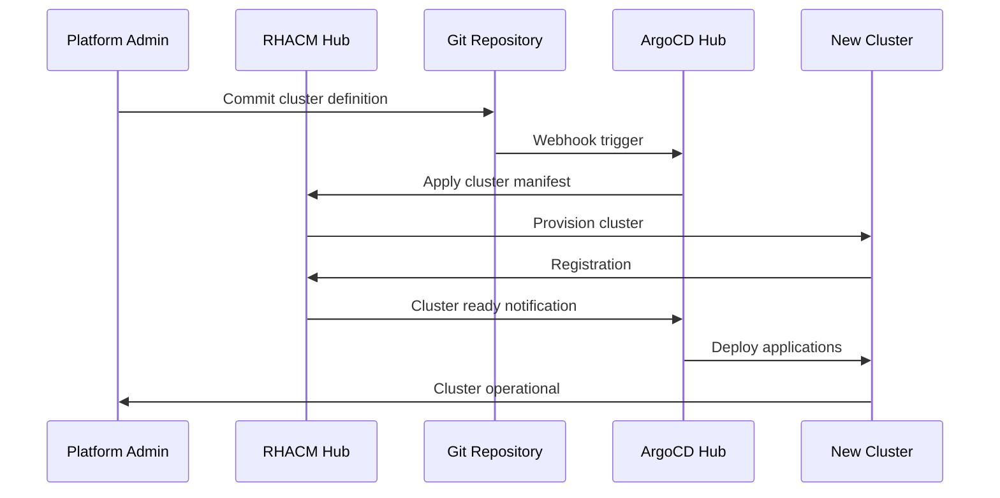

### Cluster Template

```yaml
apiVersion: cluster.open-cluster-management.io/v1
kind: ManagedCluster
metadata:
  name: app-cluster-{{ .Values.environment }}-{{ .Values.region }}
  labels:
    environment: {{ .Values.environment }}
    region: {{ .Values.region }}
    cluster.open-cluster-management.io/clusterset: {{ .Values.clusterset }}
spec:
  hubAcceptsClient: true
  leaseDurationSeconds: 60
---
apiVersion: agent.open-cluster-management.io/v1
kind: KlusterletAddonConfig
metadata:
  name: app-cluster-{{ .Values.environment }}-{{ .Values.region }}
  namespace: app-cluster-{{ .Values.environment }}-{{ .Values.region }}
spec:
  clusterName: app-cluster-{{ .Values.environment }}-{{ .Values.region }}
  clusterNamespace: app-cluster-{{ .Values.environment }}-{{ .Values.region }}
  clusterLabels:
    environment: {{ .Values.environment }}
    region: {{ .Values.region }}
  applicationManager:
    enabled: true
  policyController:
    enabled: true
  searchCollector:
    enabled: true
  certPolicyController:
    enabled: true
```

## Multi-Cluster Networking

### Cluster Network Isolation

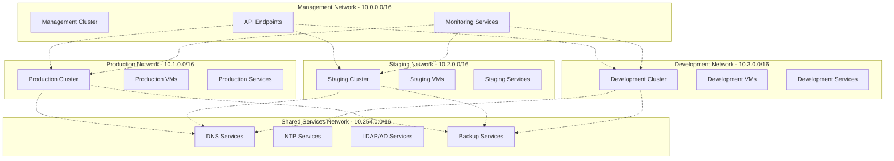

### Service Mesh Integration

```yaml
apiVersion: networking.istio.io/v1beta1
kind: VirtualService
metadata:
  name: cross-cluster-vm-service
spec:
  hosts:
  - vm-service.production.svc.cluster.local
  gateways:
  - mesh
  - cross-cluster-gateway
  http:
  - match:
    - headers:
        cluster:
          exact: staging
    route:
    - destination:
        host: vm-service.staging.svc.cluster.local
  - route:
    - destination:
        host: vm-service.production.svc.cluster.local
```

## Disaster Recovery and Business Continuity

### Multi-Cluster Backup Strategy

```yaml
apiVersion: velero.io/v1
kind: Schedule
metadata:
  name: multi-cluster-backup
  namespace: velero
spec:
  schedule: "0 2 * * *"  # Daily at 2 AM
  template:
    includedNamespaces:
    - vm-production
    - vm-staging
    - openshift-cnv
    excludedResources:
    - pods
    - replicasets
    snapshotVolumes: true
    ttl: 720h  # 30 days
    hooks:
      resources:
      - name: vm-backup-hook
        includedNamespaces:
        - vm-production
        - vm-staging
        labelSelector:
          matchLabels:
            backup.kubevirt.io/enable: "true"
        pre:
        - exec:
            container: virt-launcher
            command:
            - /bin/bash
            - -c
            - "virtctl freeze --namespace $NAMESPACE $VM_NAME"
        post:
        - exec:
            container: virt-launcher
            command:
            - /bin/bash
            - -c
            - "virtctl unfreeze --namespace $NAMESPACE $VM_NAME"
```

### Cross-Cluster Failover

```yaml
apiVersion: cluster.open-cluster-management.io/v1beta1
kind: Placement
metadata:
  name: vm-workload-placement
  namespace: vm-production
spec:
  predicates:
  - requiredClusterSelector:
      labelSelector:
        matchLabels:
          environment: production
          region: primary
  - requiredClusterSelector:
      labelSelector:
        matchLabels:
          environment: production
          region: secondary
  numberOfClusters: 2
  prioritizerPolicy:
    mode: Additive
    configurations:
    - scoreCoordinate:
        type: BuiltIn
        builtIn: Steady
      weight: 1
    - scoreCoordinate:
        type: BuiltIn
        builtIn: ResourceAllocatableCPU
      weight: 1
```

## Scalability and Performance

### Cluster Auto-Scaling

```yaml
apiVersion: machine.openshift.io/v1beta1
kind: MachineAutoscaler
metadata:
  name: worker-autoscaler
  namespace: openshift-machine-api
spec:
  minReplicas: 3
  maxReplicas: 20
  scaleTargetRef:
    apiVersion: machine.openshift.io/v1beta1
    kind: MachineSet
    name: worker-machineset
---
apiVersion: autoscaling.openshift.io/v1
kind: ClusterAutoscaler
metadata:
  name: default
spec:
  podPriorityThreshold: -10
  resourceLimits:
    maxNodesTotal: 50
    cores:
      min: 16
      max: 1000
    memory:
      min: 64Gi
      max: 4000Gi
  scaleDown:
    enabled: true
    delayAfterAdd: 10m
    delayAfterDelete: 10s
    delayAfterFailure: 30s
    unneededTime: 60s
```

### VM Resource Management

```yaml
apiVersion: kubevirt.io/v1
kind: VirtualMachine
metadata:
  name: scalable-vm-template
  namespace: vm-production
spec:
  template:
    spec:
      domain:
        cpu:
          cores: 4
          sockets: 1
          threads: 1
        memory:
          guest: 8Gi
        resources:
          requests:
            cpu: 2
            memory: 4Gi
          limits:
            cpu: 4
            memory: 8Gi
        devices:
          autoattachPodInterface: false
          autoattachSerialConsole: true
          autoattachGraphicsDevice: true
      evictionStrategy: LiveMigrate
      terminationGracePeriodSeconds: 180
      nodeSelector:
        node-role.kubernetes.io/worker: ""
        vm-workload: "true"
      affinity:
        podAntiAffinity:
          preferredDuringSchedulingIgnoredDuringExecution:
          - weight: 100
            podAffinityTerm:
              labelSelector:
                matchExpressions:
                - key: vm.kubevirt.io/name
                  operator: Exists
              topologyKey: kubernetes.io/hostname
```

## Operational Procedures

### Day-2 Operations Workflow

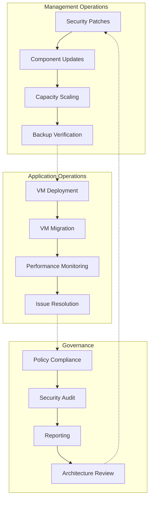

### Monitoring and Alerting

```yaml
apiVersion: monitoring.coreos.com/v1
kind: PrometheusRule
metadata:
  name: multi-cluster-alerts
  namespace: monitoring
spec:
  groups:
  - name: cluster.health
    rules:
    - alert: ClusterDown
      expr: up{job="kubernetes-apiservers"} == 0
      for: 5m
      labels:
        severity: critical
      annotations:
        summary: "Cluster {{ $labels.cluster }} is down"
        description: "Cluster {{ $labels.cluster }} has been down for more than 5 minutes"
    
    - alert: VMHighMemory
      expr: kubevirt_vm_memory_usage_bytes / kubevirt_vm_memory_available_bytes > 0.9
      for: 10m
      labels:
        severity: warning
      annotations:
        summary: "VM {{ $labels.name }} high memory usage"
        description: "VM {{ $labels.name }} in cluster {{ $labels.cluster }} has high memory usage"
    
    - alert: VMMigrationFailed
      expr: increase(kubevirt_vm_migration_failed_total[5m]) > 0
      labels:
        severity: critical
      annotations:
        summary: "VM migration failed"
        description: "VM migration failed in cluster {{ $labels.cluster }}"
```

## Best Practices and Recommendations

### Cluster Design Guidelines

1. **Resource Planning**
   - Size clusters based on workload requirements
   - Plan for 20-30% overhead for system components
   - Consider NUMA topology for high-performance VMs

2. **Network Segmentation**
   - Isolate management and data plane traffic
   - Use VLANs for multi-tenant environments
   - Implement east-west encryption

3. **Storage Strategy**
   - Use local storage for high-performance workloads
   - Implement storage classes for different performance tiers
   - Plan for backup and disaster recovery

4. **Security Architecture**
   - Implement pod security standards
   - Use network policies for microsegmentation
   - Regular security scanning and compliance checks

### Operational Excellence

1. **GitOps Workflow**
   - All changes through version control
   - Automated testing and validation
   - Rollback capabilities

2. **Monitoring Strategy**
   - Proactive alerting and monitoring
   - Centralized logging and metrics
   - Regular performance reviews

3. **Disaster Recovery**
   - Regular backup testing
   - Cross-region replication
   - Documented recovery procedures

This global architecture overview provides a comprehensive foundation for understanding how the RH OVE ecosystem scales across multiple clusters while maintaining centralized governance, security, and operational efficiency. The architecture supports growth from small deployments to large-scale multi-region installations while preserving consistent management and security practices.


\newpage

# RH OVE Solution Design and Architecture

## Overview
This document provides an overview of the RH OVE solution, detailing the architecture, deployment, and management strategies.

## Design Principles
- Utilize a namespace-based topology for isolation and security.
- Implement Cilium for network security using eBPF.
- Integrate multiplex workloads to optimize resource utilization.

## Network Architecture
Mermaid diagram for network architecture:

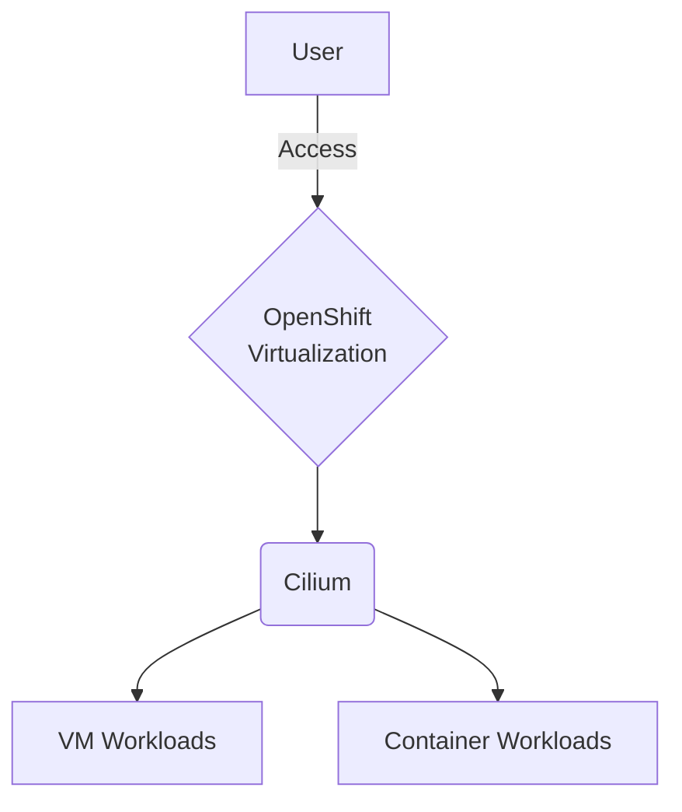

## Storage Architecture
Include storage considerations and architecture here.


\newpage

# Design Principles

## Overview

The RH OVE solution is built on fundamental design principles that ensure scalability, security, and operational efficiency for hybrid container and VM workloads.

## Core Principles

### 1. Application Namespace-Based Topology

Based on the analysis from our research, using an application namespace-based topology is considered a best practice for RH OVE clusters.

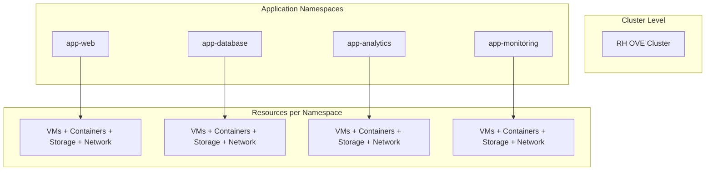

**Benefits:**
- **Isolation and Security**: Strong RBAC and network policy enforcement
- **Operational Efficiency**: Simplified management and troubleshooting
- **Network Segregation**: Namespace-scoped NetworkAttachmentDefinitions
- **Scalability**: Prevents resource clutter and performance bottlenecks
- **Policy Management**: Granular security policies and quotas

**Implementation:**
- Group related VMs and Kubernetes resources by application or business domain
- Apply consistent labeling for automation and cost management
- Combine with network policies and RBAC rules
- Designate separate namespaces for dev, test, and prod environments

### 2. Mixed Workload Strategy

Multiplexing Kubernetes container workloads and VM workloads on the same RH OVE cluster is highly advantageous:

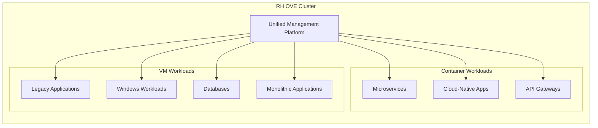

**Advantages:**
- **Unified Management**: Same Kubernetes-native interface for all workloads
- **Resource Optimization**: Better hardware consolidation
- **Flexibility**: Gradual modernization path for legacy applications
- **Streamlined DevOps**: Integrated CI/CD pipelines for all workload types
- **Advanced Platform Features**: HA, storage provisioning, monitoring for all

### 3. Security-First Design

Implement defense-in-depth security across all layers:

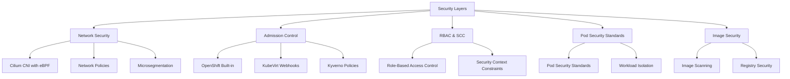

### 4. GitOps-Driven Operations

Implement infrastructure and application management through GitOps principles:

**Benefits:**
- **Single Source of Truth**: All configurations version-controlled in Git
- **Declarative Management**: Infrastructure as Code for VMs and containers
- **Automation**: Reduced human error through automated deployments
- **Auditability**: Complete change tracking and rollback capabilities
- **Collaboration**: Peer review through pull requests

### 5. Observability and Monitoring

Comprehensive monitoring strategy across all workload types:

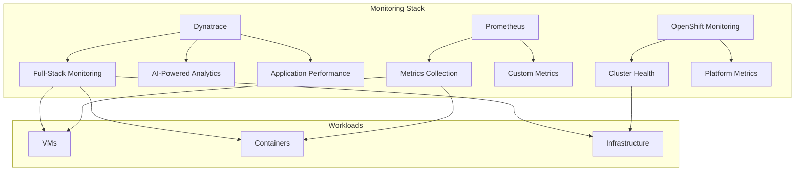

## Implementation Guidelines

### Namespace Design

```yaml
# Example namespace structure
apiVersion: v1
kind: Namespace
metadata:
  name: app-web-prod
  labels:
    app: web
    environment: production
    tier: frontend
  annotations:
    network-policy: strict
    backup-policy: daily
```

### Resource Quotas

```yaml
apiVersion: v1
kind: ResourceQuota
metadata:
  name: compute-quota
  namespace: app-web-prod
spec:
  hard:
    requests.cpu: "10"
    requests.memory: 20Gi
    limits.cpu: "20"
    limits.memory: 40Gi
    persistentvolumeclaims: "10"
```

### Network Policies

```yaml
apiVersion: networking.k8s.io/v1
kind: NetworkPolicy
metadata:
  name: app-web-netpol
  namespace: app-web-prod
spec:
  podSelector:
    matchLabels:
      app: web
  policyTypes:
  - Ingress
  - Egress
  ingress:
  - from:
    - namespaceSelector:
        matchLabels:
          name: app-gateway-prod
```

## Best Practices

### Design Decisions
1. **Plan namespace strategy early**: Define naming conventions and access hierarchies
2. **Implement least privilege**: Use RBAC and network policies consistently
3. **Design for scale**: Consider resource limits and node capacity planning
4. **Plan for disaster recovery**: Include backup and restoration strategies

### Operational Considerations
1. **Monitor resource utilization**: Prevent resource contention between workload types
2. **Implement proper logging**: Centralized logging for both VMs and containers
3. **Regular security assessments**: Continuous compliance and vulnerability management
4. **Performance testing**: Regular load testing for mixed workload scenarios

These design principles ensure that the RH OVE solution provides a robust, secure, and scalable platform for modern hybrid workloads while supporting organizational transformation initiatives.


\newpage

# Network Architecture

## Overview

The RH OVE network architecture leverages Cilium CNI for enhanced security and observability, providing advanced network capabilities through eBPF technology for both container and VM workloads.

## Cilium CNI Integration

Based on our research, using Cilium for RH OVE is widely regarded as a strong, future-proof approach with several key advantages:

### Benefits

- **Red Hat Certification**: Cilium is a certified CNI plugin for OpenShift
- **eBPF-Powered Enforcement**: Advanced security, visibility, and traffic control
- **Multi-platform Support**: Works for both containers and VMs in hybrid environments
- **High Performance**: Superior performance compared to traditional iptables-based CNIs
- **Service Mesh Capabilities**: L7 security and observability without sidecar proxies

## Network Architecture Diagram

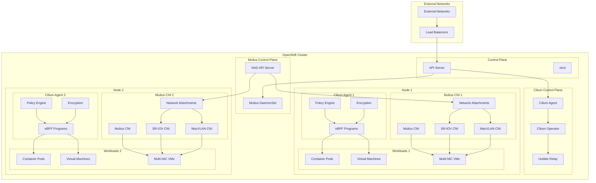

## Network Security Features

### Identity-Aware Security

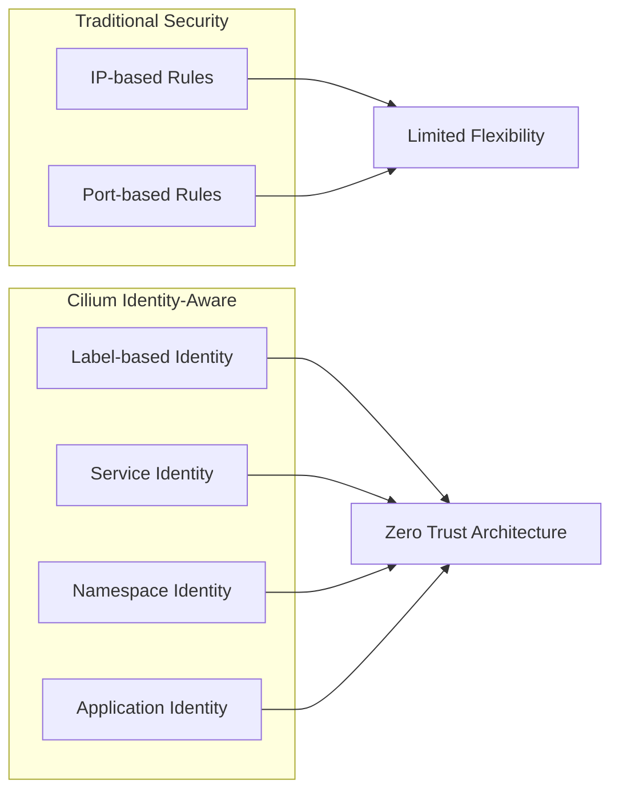

### Network Policies

#### Basic Network Policy for VMs

```yaml
apiVersion: cilium.io/v2
kind: CiliumNetworkPolicy
metadata:
  name: vm-web-policy
  namespace: app-web-prod
spec:
  endpointSelector:
    matchLabels:
      app: web-vm
  ingress:
  - fromEndpoints:
    - matchLabels:
        app: api-gateway
    toPorts:
    - ports:
      - port: "80"
        protocol: TCP
      - port: "443"
        protocol: TCP
  egress:
  - toEndpoints:
    - matchLabels:
        app: database-vm
    toPorts:
    - ports:
      - port: "5432"
        protocol: TCP
```

#### L7 HTTP Policy

```yaml
apiVersion: cilium.io/v2
kind: CiliumNetworkPolicy
metadata:
  name: l7-http-policy
spec:
  endpointSelector:
    matchLabels:
      app: web-api
  ingress:
  - fromEndpoints:
    - matchLabels:
        app: frontend
    toPorts:
    - ports:
      - port: "80"
        protocol: TCP
      rules:
        http:
        - method: "GET"
          path: "/api/v1/.*"
        - method: "POST"
          path: "/api/v1/users"
```

## Multi-Tenant Networking

### Namespace Isolation

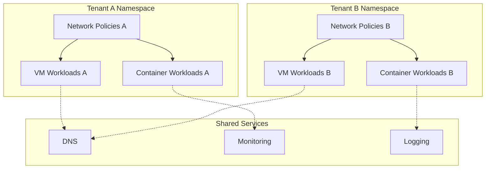

### NetworkAttachmentDefinition for VMs

```yaml
apiVersion: k8s.cni.cncf.io/v1
kind: NetworkAttachmentDefinition
metadata:
  name: vm-network
  namespace: app-database-prod
spec:
  config: |
    {
      "cniVersion": "0.3.1",
      "name": "vm-network",
      "type": "cilium-cni",
      "ipam": {
        "type": "cilium"
      }
    }
```

## Multus Multi-Network Configuration

### Overview

Multus CNI enables attaching multiple network interfaces to pods and VMs, allowing for complex networking scenarios such as:
- Separation of management and data traffic
- VLAN-based network segmentation
- High-performance networking with SR-IOV
- Legacy application networking requirements

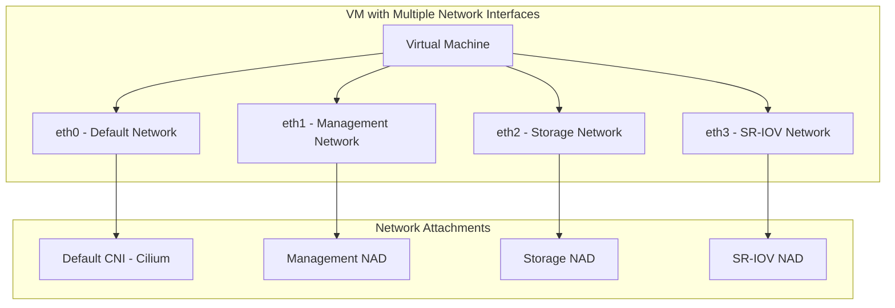

### Multus Installation

Multus is typically installed as part of OpenShift Container Platform:

```bash
# Verify Multus is installed
oc get network.operator.openshift.io cluster -o yaml

# Check Multus DaemonSet
oc get ds multus -n openshift-multus
```

### Network Attachment Definitions (NADs)

#### Management Network NAD

```yaml
apiVersion: k8s.cni.cncf.io/v1
kind: NetworkAttachmentDefinition
metadata:
  name: management-network
  namespace: vm-infrastructure
spec:
  config: |
    {
      "cniVersion": "0.3.1",
      "name": "management-network",
      "type": "macvlan",
      "master": "ens192",
      "mode": "bridge",
      "ipam": {
        "type": "static",
        "addresses": [
          {
            "address": "192.168.100.0/24",
            "gateway": "192.168.100.1"
          }
        ],
        "dns": {
          "nameservers": ["192.168.100.10", "8.8.8.8"]
        }
      }
    }
```

#### Storage Network NAD

```yaml
apiVersion: k8s.cni.cncf.io/v1
kind: NetworkAttachmentDefinition
metadata:
  name: storage-network
  namespace: vm-infrastructure
spec:
  config: |
    {
      "cniVersion": "0.3.1",
      "name": "storage-network",
      "type": "macvlan",
      "master": "ens224",
      "mode": "bridge",
      "ipam": {
        "type": "static",
        "addresses": [
          {
            "address": "10.0.200.0/24"
          }
        ]
      }
    }
```

#### VLAN-based Network NAD

```yaml
apiVersion: k8s.cni.cncf.io/v1
kind: NetworkAttachmentDefinition
metadata:
  name: vlan-100-network
  namespace: vm-production
spec:
  config: |
    {
      "cniVersion": "0.3.1",
      "name": "vlan-100-network",
      "type": "macvlan",
      "master": "ens192.100",
      "mode": "bridge",
      "ipam": {
        "type": "dhcp"
      }
    }
```

#### SR-IOV Network NAD

```yaml
apiVersion: k8s.cni.cncf.io/v1
kind: NetworkAttachmentDefinition
metadata:
  name: sriov-high-performance
  namespace: vm-production
spec:
  config: |
    {
      "cniVersion": "0.3.1",
      "name": "sriov-high-performance",
      "type": "sriov",
      "deviceID": "1017",
      "vf": 0,
      "ipam": {
        "type": "static",
        "addresses": [
          {
            "address": "10.0.50.0/24"
          }
        ]
      }
    }
```

### VM Configuration with Multiple Network Cards

#### VM with Multiple Interfaces

```yaml
apiVersion: kubevirt.io/v1
kind: VirtualMachine
metadata:
  name: multi-network-vm
  namespace: vm-infrastructure
  annotations:
    k8s.v1.cni.cncf.io/networks: |
      [
        {
          "name": "management-network",
          "ips": ["192.168.100.50/24"]
        },
        {
          "name": "storage-network",
          "ips": ["10.0.200.50/24"]
        },
        {
          "name": "vlan-100-network"
        }
      ]
spec:
  running: true
  template:
    metadata:
      labels:
        app: multi-network-app
    spec:
      domain:
        cpu:
          cores: 4
        memory:
          guest: 8Gi
        devices:
          interfaces:
          - name: default
            masquerade: {}
          - name: management
            bridge: {}
          - name: storage
            bridge: {}
          - name: vlan-network
            bridge: {}
          disks:
          - name: rootdisk
            disk:
              bus: virtio
        resources:
          requests:
            cpu: 4
            memory: 8Gi
      networks:
      - name: default
        pod: {}
      - name: management
        multus:
          networkName: management-network
      - name: storage
        multus:
          networkName: storage-network
      - name: vlan-network
        multus:
          networkName: vlan-100-network
      volumes:
      - name: rootdisk
        dataVolume:
          name: multi-network-vm-root
```

#### High-Performance VM with SR-IOV

```yaml
apiVersion: kubevirt.io/v1
kind: VirtualMachine
metadata:
  name: high-perf-vm
  namespace: vm-production
  annotations:
    k8s.v1.cni.cncf.io/networks: |
      [
        {
          "name": "management-network",
          "ips": ["192.168.100.100/24"]
        },
        {
          "name": "sriov-high-performance",
          "ips": ["10.0.50.100/24"]
        }
      ]
spec:
  running: true
  template:
    metadata:
      labels:
        app: high-performance-app
    spec:
      domain:
        cpu:
          cores: 8
          dedicatedCpuPlacement: true
        memory:
          guest: 16Gi
          hugepages:
            pageSize: 1Gi
        devices:
          interfaces:
          - name: default
            masquerade: {}
          - name: management
            bridge: {}
          - name: sriov-net
            sriov: {}
          disks:
          - name: rootdisk
            disk:
              bus: virtio
        resources:
          requests:
            cpu: 8
            memory: 16Gi
            hugepages-1Gi: 16Gi
      networks:
      - name: default
        pod: {}
      - name: management
        multus:
          networkName: management-network
      - name: sriov-net
        multus:
          networkName: sriov-high-performance
      volumes:
      - name: rootdisk
        dataVolume:
          name: high-perf-vm-root
```

### Advanced Multus Configurations

#### Bond Network Interface

```yaml
apiVersion: k8s.cni.cncf.io/v1
kind: NetworkAttachmentDefinition
metadata:
  name: bond-network
  namespace: vm-infrastructure
spec:
  config: |
    {
      "cniVersion": "0.3.1",
      "name": "bond-network",
      "type": "bond",
      "mode": "active-backup",
      "miimon": "100",
      "links": [
        {"name": "ens192"},
        {"name": "ens224"}
      ],
      "ipam": {
        "type": "static",
        "addresses": [
          {
            "address": "10.0.100.0/24",
            "gateway": "10.0.100.1"
          }
        ]
      }
    }
```

#### OVS Bridge Network

```yaml
apiVersion: k8s.cni.cncf.io/v1
kind: NetworkAttachmentDefinition
metadata:
  name: ovs-bridge-network
  namespace: vm-infrastructure
spec:
  config: |
    {
      "cniVersion": "0.3.1",
      "name": "ovs-bridge-network",
      "type": "ovs",
      "bridge": "br-data",
      "vlan": 200,
      "ipam": {
        "type": "static",
        "addresses": [
          {
            "address": "10.0.200.0/24"
          }
        ]
      }
    }
```

## Encryption and Security

### Transparent Encryption

Cilium supports both IPsec and WireGuard for transparent encryption:

```yaml
# Cilium ConfigMap for WireGuard encryption
apiVersion: v1
kind: ConfigMap
metadata:
  name: cilium-config
  namespace: kube-system
data:
  enable-wireguard: "true"
  wireguard-userspace-fallback: "true"
```

### Service Mesh without Sidecars

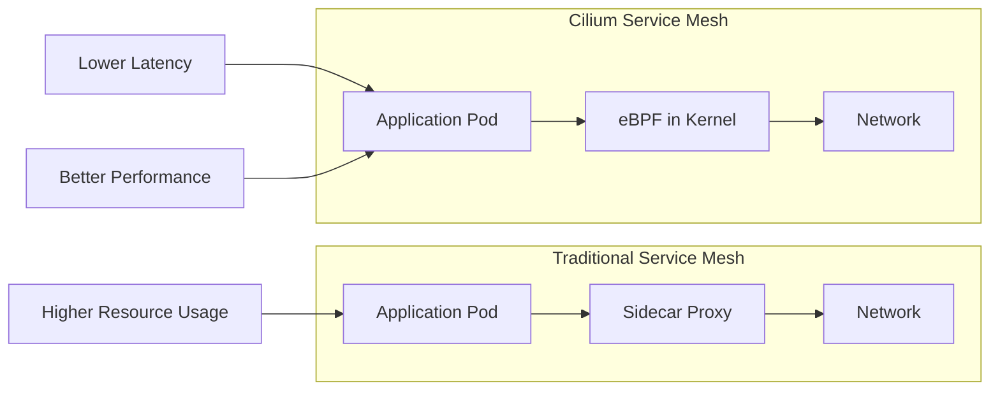

## Observability with Hubble

### Network Visibility

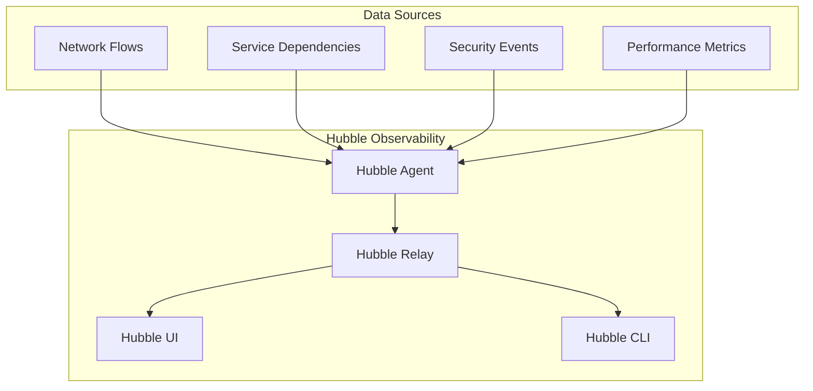

### Hubble Configuration

```yaml
apiVersion: v1
kind: ConfigMap
metadata:
  name: cilium-config
  namespace: kube-system
data:
  enable-hubble: "true"
  hubble-listen-address: ":4244"
  hubble-socket-path: "/var/run/cilium/hubble.sock"
  hubble-metrics-server: ":9091"
  hubble-metrics: >-
    dns:query;ignoreAAAA
    drop
    tcp
    flow
    icmp
    http
```

## VM-Specific Networking

### VM Network Integration

```yaml
apiVersion: kubevirt.io/v1
kind: VirtualMachine
metadata:
  name: database-vm
  namespace: app-database-prod
spec:
  template:
    spec:
      networks:
      - name: default
        pod: {}
      - name: vm-network
        multus:
          networkName: vm-network
      domain:
        devices:
          interfaces:
          - name: default
            masquerade: {}
          - name: vm-network
            bridge: {}
```

## Performance Optimization

### eBPF Performance Benefits

1. **Bypass iptables overhead**: Direct kernel-space processing
2. **Reduced context switches**: Fewer user-space to kernel-space transitions
3. **Optimized packet processing**: Custom eBPF programs for specific workloads
4. **Hardware acceleration**: Support for XDP (eXpress Data Path)

### Network Performance Tuning

```yaml
# Cilium DaemonSet configuration for performance
apiVersion: apps/v1
kind: DaemonSet
metadata:
  name: cilium
spec:
  template:
    spec:
      containers:
      - name: cilium-agent
        args:
        - --enable-bandwidth-manager=true
        - --enable-local-redirect-policy=true
        - --kube-proxy-replacement=strict
        resources:
          requests:
            cpu: 100m
            memory: 128Mi
          limits:
            cpu: 500m
            memory: 512Mi
```

## Integration with External Systems

### Load Balancer Integration

```yaml
apiVersion: cilium.io/v2alpha1
kind: CiliumLoadBalancerIPPool
metadata:
  name: vm-pool
spec:
  cidrs:
  - cidr: "10.100.0.0/24"
---
apiVersion: v1
kind: Service
metadata:
  name: vm-web-service
  annotations:
    io.cilium/lb-ipam-ips: "10.100.0.10"
spec:
  type: LoadBalancer
  selector:
    app: web-vm
  ports:
  - port: 80
    targetPort: 8080
```

## Troubleshooting and Monitoring

### Network Flow Monitoring

```bash
# Monitor network flows
hubble observe --namespace app-web-prod

# Check policy violations
hubble observe --verdict DENIED

# Monitor specific VM traffic
hubble observe --pod vm-database-vm-xxx
```

### Performance Metrics

Key metrics to monitor:
- Network throughput per VM/pod
- Policy enforcement latency
- eBPF program execution time
- Hubble flow processing rate

This network architecture provides enterprise-grade security, performance, and observability for mixed VM and container workloads in the RH OVE environment.


\newpage

# Storage Architecture

## Overview

The RH OVE storage architecture provides unified storage management for both container and VM workloads, leveraging Kubernetes-native storage concepts while supporting traditional VM storage requirements.

## Storage Components

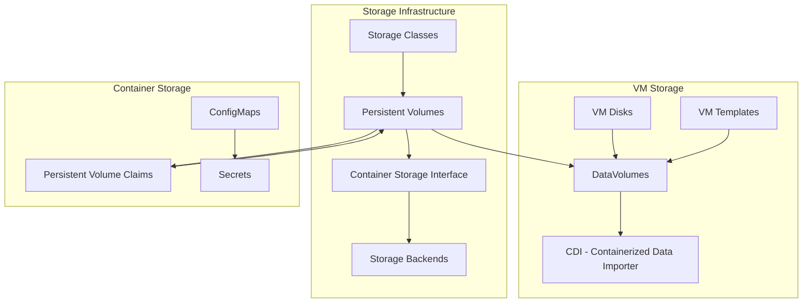

## DataVolume Management

### DataVolume CRD

DataVolumes are the primary mechanism for managing VM storage in RH OVE:

```yaml
apiVersion: cdi.kubevirt.io/v1beta1
kind: DataVolume
metadata:
  name: web-vm-disk
  namespace: app-web-prod
spec:
  pvc:
    accessModes:
    - ReadWriteOnce
    resources:
      requests:
        storage: 50Gi
    storageClassName: fast-ssd
  source:
    registry:
      url: "docker://registry.redhat.io/rhel8/rhel:latest"
```

### Storage Import Patterns

```mermaid
graph LR
    subgraph "Data Sources"
        A[Container Registry]
        B[HTTP Server]
        C[S3 Bucket]
        D[Existing PVC]
    end
    
    subgraph "CDI Processing"
        E[Import Pod]
        F[Data Processing]
        G[Format Conversion]
    end
    
    subgraph "Target Storage"
        H[DataVolume]
        I[PVC]
        J[VM Disk]
    end
    
    A --> E
    B --> E
    C --> E
    D --> E
    
    E --> F
    F --> G
    G --> H
    H --> I
    I --> J
```

## Storage Classes and Performance Tiers

### Performance Tiers

```yaml
# High Performance SSD Storage Class
apiVersion: storage.k8s.io/v1
kind: StorageClass
metadata:
  name: high-performance-ssd
provisioner: kubernetes.io/no-provisioner
parameters:
  type: ssd
  iops: "10000"
  throughput: "500Mi"
reclaimPolicy: Delete
volumeBindingMode: WaitForFirstConsumer
---
# Standard HDD Storage Class
apiVersion: storage.k8s.io/v1
kind: StorageClass
metadata:
  name: standard-hdd
provisioner: kubernetes.io/no-provisioner
parameters:
  type: hdd
  iops: "1000"
  throughput: "100Mi"
reclaimPolicy: Retain
volumeBindingMode: WaitForFirstConsumer
---
# Archive Storage Class
apiVersion: storage.k8s.io/v1
kind: StorageClass
metadata:
  name: archive-storage
provisioner: kubernetes.io/no-provisioner
parameters:
  type: archive
  iops: "100"
  throughput: "50Mi"
reclaimPolicy: Retain
volumeBindingMode: WaitForFirstConsumer
```

## VM Disk Configuration

### VM with Multiple Disks

```yaml
apiVersion: kubevirt.io/v1
kind: VirtualMachine
metadata:
  name: database-vm
  namespace: app-database-prod
spec:
  template:
    spec:
      domain:
        devices:
          disks:
          - name: rootdisk
            disk:
              bus: virtio
          - name: datadisk
            disk:
              bus: virtio
          - name: logdisk
            disk:
              bus: virtio
        resources:
          requests:
            memory: 8Gi
            cpu: 4
      volumes:
      - name: rootdisk
        dataVolume:
          name: db-vm-root
      - name: datadisk
        dataVolume:
          name: db-vm-data
      - name: logdisk
        dataVolume:
          name: db-vm-logs
```

### DataVolume for Different Use Cases

```yaml
# Boot disk from registry
apiVersion: cdi.kubevirt.io/v1beta1
kind: DataVolume
metadata:
  name: db-vm-root
spec:
  pvc:
    accessModes: [ReadWriteOnce]
    resources:
      requests:
        storage: 30Gi
    storageClassName: high-performance-ssd
  source:
    registry:
      url: "docker://registry.access.redhat.com/rhel8/rhel:latest"
---
# Data disk - blank
apiVersion: cdi.kubevirt.io/v1beta1
kind: DataVolume
metadata:
  name: db-vm-data
spec:
  pvc:
    accessModes: [ReadWriteOnce]
    resources:
      requests:
        storage: 500Gi
    storageClassName: standard-hdd
  source:
    blank: {}
---
# Log disk - blank
apiVersion: cdi.kubevirt.io/v1beta1
kind: DataVolume
metadata:
  name: db-vm-logs
spec:
  pvc:
    accessModes: [ReadWriteOnce]
    resources:
      requests:
        storage: 100Gi
    storageClassName: standard-hdd
  source:
    blank: {}
```

## Storage Backup Integration

### Rubrik Integration for VM Storage

Based on our research, Rubrik provides certified integration with RH OVE for VM backup:

```mermaid
graph TB
    subgraph "RH OVE Cluster"
        A[Virtual Machines]
        B[DataVolumes]
        C[Persistent Volumes]
        D[Rubrik Agent]
    end
    
    subgraph "Rubrik Platform"
        E[Rubrik Cluster]
        F[Backup Policies]
        G[Recovery Points]
        H[Immutable Storage]
    end
    
    A --> D
    B --> D
    C --> D
    D --> E
    E --> F
    F --> G
    G --> H
```

### Backup Policy Configuration

```yaml
apiVersion: v1
kind: ConfigMap
metadata:
  name: rubrik-backup-policy
  namespace: app-database-prod
data:
  policy.yaml: |
    vm_backup_policy:
      name: "database-vm-backup"
      frequency: "daily"
      retention: "30d"
      snapshot_consistency: "crash-consistent"
      backup_window: "02:00-06:00"
      exclude_disks:
        - "temp-disk"
        - "swap-disk"
```

## Storage Monitoring and Performance

### Storage Metrics

Key storage metrics to monitor:

```yaml
apiVersion: monitoring.coreos.com/v1
kind: ServiceMonitor
metadata:
  name: storage-metrics
spec:
  selector:
    matchLabels:
      app: cdi-controller
  endpoints:
  - port: metrics
    interval: 30s
    path: /metrics
```

### Performance Monitoring

```mermaid
graph LR
    subgraph "Storage Metrics"
        A[IOPS per VM]
        B[Throughput per Volume]
        C[Latency Metrics]
        D[Storage Utilization]
    end
    
    subgraph "Monitoring Stack"
        E[Prometheus]
        F[Grafana]
        G[Alert Manager]
    end
    
    A --> E
    B --> E
    C --> E
    D --> E
    
    E --> F
    E --> G
```

## Storage Operations

### Volume Expansion

```yaml
# Expand a DataVolume
apiVersion: cdi.kubevirt.io/v1beta1
kind: DataVolume
metadata:
  name: web-vm-disk
  namespace: app-web-prod
spec:
  pvc:
    accessModes: [ReadWriteOnce]
    resources:
      requests:
        storage: 100Gi  # Increased from 50Gi
    storageClassName: fast-ssd
  source:
    pvc:
      name: web-vm-disk
      namespace: app-web-prod
```

### Volume Cloning

```yaml
# Clone a DataVolume for VM template
apiVersion: cdi.kubevirt.io/v1beta1
kind: DataVolume
metadata:
  name: web-vm-template-clone
  namespace: vm-templates
spec:
  pvc:
    accessModes: [ReadWriteOnce]
    resources:
      requests:
        storage: 50Gi
    storageClassName: fast-ssd
  source:
    pvc:
      name: web-vm-golden-image
      namespace: vm-templates
```

### Snapshot Management

```yaml
apiVersion: snapshot.storage.k8s.io/v1
kind: VolumeSnapshot
metadata:
  name: db-vm-snapshot-pre-upgrade
  namespace: app-database-prod
spec:
  volumeSnapshotClassName: csi-snapshotter
  source:
    persistentVolumeClaimName: db-vm-data
```

## Storage Security

### Encryption at Rest

```yaml
apiVersion: storage.k8s.io/v1
kind: StorageClass
metadata:
  name: encrypted-storage
provisioner: ebs.csi.aws.com
parameters:
  type: gp3
  encrypted: "true"
  kmsKeyId: "arn:aws:kms:region:account:key/key-id"
reclaimPolicy: Delete
volumeBindingMode: WaitForFirstConsumer
```

### Access Control

```yaml
apiVersion: rbac.authorization.k8s.io/v1
kind: Role
metadata:
  namespace: app-database-prod
  name: storage-admin
rules:
- apiGroups: [""]
  resources: ["persistentvolumeclaims"]
  verbs: ["get", "list", "create", "update", "patch", "delete"]
- apiGroups: ["cdi.kubevirt.io"]
  resources: ["datavolumes"]
  verbs: ["get", "list", "create", "update", "patch", "delete"]
- apiGroups: ["snapshot.storage.k8s.io"]
  resources: ["volumesnapshots"]
  verbs: ["get", "list", "create", "delete"]
```

## Best Practices

### Storage Planning
1. **Right-size storage**: Match storage performance to workload requirements
2. **Use appropriate storage classes**: Different tiers for different use cases
3. **Plan for growth**: Consider volume expansion capabilities
4. **Backup strategy**: Regular snapshots and external backups

### Performance Optimization
1. **Use SSD for high-IOPS workloads**: Database and application storage
2. **Separate storage by function**: OS, data, logs, and temp on different volumes
3. **Monitor storage metrics**: Track IOPS, throughput, and latency
4. **Implement storage quotas**: Prevent storage exhaustion

### Security Considerations
1. **Enable encryption at rest**: For sensitive data storage
2. **Implement access controls**: RBAC for storage resources
3. **Regular security scanning**: Check for storage-related vulnerabilities
4. **Audit storage access**: Monitor who accesses what storage

This storage architecture ensures reliable, performant, and secure storage management for the hybrid VM and container workloads in the RH OVE environment.


\newpage

# Identity and Access Management (IAM) Strategy

## Overview
This document outlines the comprehensive Identity and Access Management (IAM) strategy for the RH OVE multi-cluster ecosystem, implementing authentication and authorization using OpenID Connect (OIDC) providers with enterprise-grade security controls.

## Executive Summary

The IAM strategy for the RH OVE multi-cluster ecosystem provides enterprise-grade identity and access management through a comprehensive OIDC-based approach that ensures security, compliance, and operational efficiency across all clusters and services.

### Key Components

#### 1. **Architecture Components**
- **Mermaid diagram** showing OIDC provider integration across management and application clusters
- **Identity Provider selection** with Keycloak as the recommended solution (Red Hat SSO)
- **Service integration** with ArgoCD, Grafana, Prometheus, and Kubernetes Dashboard
- **Dex OIDC Proxy** deployment for centralized authentication

#### 2. **Authentication Implementation**
- **OpenShift OAuth configuration** with native OIDC integration
- **Dex OIDC Proxy** for service-to-service authentication
- **Multi-Factor Authentication** using Keycloak authentication flows with mandatory MFA for admin accounts
- **JWT token management** with proper security controls and time-limited tokens
- **Single Sign-On (SSO)** seamless access across all clusters and services

#### 3. **Authorization Implementation**
- **Kubernetes RBAC integration** with OIDC groups mapping
- **ArgoCD RBAC configuration** for GitOps access control with application-specific permissions
- **Service Account token management** with time-limited tokens and projected volumes
- **Namespace-scoped permissions** aligned with application teams and business units
- **Role-Based Access Control** with predefined organizational roles

#### 4. **User Lifecycle Management**
- **SCIM integration** for automated user provisioning and deprovisioning
- **Group-based access control** with predefined roles (platform-admins, web-developers, database-admins, security-auditors)
- **Python automation examples** for user management workflows
- **Self-service capabilities** for password reset and account recovery

#### 5. **Security Controls**
- **Token security** with JWT validation rules and proper expiration policies
- **Network security** policies for authentication services with ingress/egress controls
- **Encryption and key management** with AES-256 and regular key rotation
- **Zero Trust Principles** implementation with least-privilege access patterns

#### 6. **Monitoring and Audit**
- **Prometheus metrics** for authentication monitoring and alerting
- **Grafana dashboards** for IAM visibility and operational insights
- **Kubernetes audit policies** for compliance logging and security tracking
- **Automated access reviews** and compliance reporting for SOC 2, GDPR, HIPAA
- **Failed authentication tracking** and security incident response

#### 7. **Disaster Recovery**
- **Identity provider backup** strategies with automated daily backups
- **Multi-region failover** configuration for high availability
- **High availability** for authentication services with automated health checks

### Technical Implementation Highlights

- **OIDC Provider Integration**: Keycloak (Red Hat SSO) as primary, with Auth0/Okta alternatives
- **Multi-Factor Authentication**: Mandatory for administrative accounts with TOTP/SMS support
- **Service Account Automation**: Time-limited tokens (15min-2hours) with proper lifecycle management
- **Audit and Compliance**: Complete alignment with SOC 2, GDPR, and HIPAA requirements
- **Enterprise Integration**: LDAP/Active Directory federation for existing identity infrastructure

### Business Benefits

- **Enhanced Security Posture**: Zero trust principles with identity-aware access controls
- **Operational Efficiency**: Centralized identity management across all clusters and services
- **Compliance Readiness**: Automated audit trails and regulatory framework alignment
- **Developer Experience**: Single sign-on with self-service capabilities
- **Cost Optimization**: Reduced operational overhead through automation

### Implementation Phases

1. **Phase 1**: Design and Planning (Identity provider selection, architecture design)
2. **Phase 2**: Deployment and Configuration (OIDC integration, RBAC implementation)
3. **Phase 3**: Testing and Validation (Security testing, SSO validation, user acceptance)
4. **Phase 4**: Monitoring and Maintenance (Metrics setup, audit automation, user training)

This IAM strategy ensures robust and flexible identity management, leveraging existing enterprise IAM solutions for seamless integration and compliance within the RH OVE multi-cluster ecosystem while providing a foundation for future growth and regulatory requirements.

## Architecture Components

### OIDC Provider Integration

```mermaid
graph TB
    subgraph "External Identity Provider"
        OIDC["OIDC Provider<br/>(Keycloak/Auth0/Okta)"]
        AD["Active Directory/LDAP"]
        MFA["MFA Service"]
    end
    
    subgraph "Management Cluster"
        DEXM["Dex OIDC Proxy"]
        OAUTHM["OAuth2 Proxy"]
        APIM["Kubernetes API Server"]
    end
    
    subgraph "Application Clusters"
        DEXA["Dex OIDC Proxy"]
        OAUTHA["OAuth2 Proxy"]
        APIA["Kubernetes API Server"]
    end
    
    subgraph "Services"
        ARGO["ArgoCD"]
        GRAF["Grafana"]
        PROM["Prometheus"]
        KUBE["Kubernetes Dashboard"]
    end
    
    OIDC --> DEXM
    OIDC --> DEXA
    AD --> OIDC
    MFA --> OIDC
    
    DEXM --> APIM
    DEXM --> OAUTHM
    DEXA --> APIA
    DEXA --> OAUTHA
    
    OAUTHM --> ARGO
    OAUTHM --> GRAF
    OAUTHM --> PROM
    OAUTHA --> KUBE
```

### Identity Provider Selection

#### Recommended: Keycloak (Red Hat SSO)
- **Advantages**: Open source, Red Hat supported, full OIDC compliance
- **Features**: User federation, social login, fine-grained authorization
- **Integration**: Native OpenShift integration, Kubernetes RBAC mapping

#### Alternative: Enterprise Solutions
- **Auth0**: SaaS solution with extensive integrations
- **Okta**: Enterprise-grade with advanced security features
- **Azure AD**: Microsoft ecosystem integration

## Authentication Implementation

### OpenShift OAuth Configuration

```yaml
apiVersion: config.openshift.io/v1
kind: OAuth
metadata:
  name: cluster
spec:
  identityProviders:
  - name: keycloak-oidc
    mappingMethod: claim
    type: OpenID
    openID:
      clientID: openshift-cluster
      clientSecret:
        name: oidc-client-secret
      issuer: https://keycloak.company.com/auth/realms/openshift
      claims:
        preferredUsername:
        - preferred_username
        name:
        - name
        email:
        - email
        groups:
        - groups
```

### Dex OIDC Proxy Configuration

```yaml
apiVersion: v1
kind: ConfigMap
metadata:
  name: dex-config
  namespace: auth-system
data:
  config.yaml: |
    issuer: https://dex.company.com
    storage:
      type: kubernetes
      config:
        inCluster: true
    web:
      https: 0.0.0.0:5556
      tlsCert: /etc/dex/tls/tls.crt
      tlsKey: /etc/dex/tls/tls.key
    connectors:
    - type: oidc
      id: keycloak
      name: Keycloak
      config:
        issuer: https://keycloak.company.com/auth/realms/company
        clientID: dex-client
        clientSecret: $DEX_CLIENT_SECRET
        redirectURI: https://dex.company.com/callback
        scopes:
        - openid
        - profile
        - email
        - groups
    staticClients:
    - id: kubernetes
      redirectURIs:
      - https://kubectl.company.com/callback
      name: 'Kubernetes CLI'
      secret: $KUBERNETES_CLIENT_SECRET
    - id: argocd
      redirectURIs:
      - https://argocd.company.com/auth/callback
      name: 'ArgoCD'
      secret: $ARGOCD_CLIENT_SECRET
```

### Multi-Factor Authentication

```yaml
# Keycloak Authentication Flow
authenticationFlows:
  - alias: "browser-with-mfa"
    description: "Browser flow with mandatory MFA"
    providerId: "basic-flow"
    topLevel: true
    builtIn: false
    authenticationExecutions:
      - authenticator: "auth-cookie"
        requirement: "ALTERNATIVE"
      - authenticator: "auth-spnego"
        requirement: "DISABLED"
      - authenticator: "identity-provider-redirector"
        requirement: "ALTERNATIVE"
      - flowAlias: "forms"
        requirement: "ALTERNATIVE"
  - alias: "forms"
    description: "Username, password, otp and other auth forms."
    providerId: "basic-flow"
    topLevel: false
    builtIn: false
    authenticationExecutions:
      - authenticator: "auth-username-password-form"
        requirement: "REQUIRED"
      - authenticator: "auth-otp-form"
        requirement: "REQUIRED"
```

## Authorization Implementation

### Kubernetes RBAC Integration

```yaml
# ClusterRole for Platform Administrators
apiVersion: rbac.authorization.k8s.io/v1
kind: ClusterRole
metadata:
  name: platform-admin
rules:
- apiGroups: ["*"]
  resources: ["*"]
  verbs: ["*"]
---
# ClusterRoleBinding with OIDC Groups
apiVersion: rbac.authorization.k8s.io/v1
kind: ClusterRoleBinding
metadata:
  name: platform-admin-binding
subjects:
- kind: Group
  name: "platform-admins"
  apiGroup: rbac.authorization.k8s.io
roleRef:
  kind: ClusterRole
  name: platform-admin
  apiGroup: rbac.authorization.k8s.io
---
# Namespace-scoped Role for Application Teams
apiVersion: rbac.authorization.k8s.io/v1
kind: Role
metadata:
  namespace: app-web-prod
  name: app-developer
rules:
- apiGroups: [""]
  resources: ["pods", "services", "configmaps", "secrets"]
  verbs: ["get", "list", "create", "update", "patch", "delete"]
- apiGroups: ["apps"]
  resources: ["deployments", "replicasets"]
  verbs: ["get", "list", "create", "update", "patch", "delete"]
- apiGroups: ["kubevirt.io"]
  resources: ["virtualmachines", "virtualmachineinstances"]
  verbs: ["get", "list", "create", "update", "patch", "delete"]
---
# RoleBinding with OIDC Groups
apiVersion: rbac.authorization.k8s.io/v1
kind: RoleBinding
metadata:
  name: app-developer-binding
  namespace: app-web-prod
subjects:
- kind: Group
  name: "web-developers"
  apiGroup: rbac.authorization.k8s.io
roleRef:
  kind: Role
  name: app-developer
  apiGroup: rbac.authorization.k8s.io
```

### ArgoCD RBAC Integration

```yaml
apiVersion: v1
kind: ConfigMap
metadata:
  name: argocd-rbac-cm
  namespace: argocd
data:
  policy.default: role:readonly
  policy.csv: |
    # Platform Administrators
    g, platform-admins, role:admin
    
    # Application Teams
    g, web-developers, role:web-app-admin
    g, database-admins, role:database-admin
    
    # Custom Roles
    role:web-app-admin, applications, *, app-web-*/*, allow
    role:web-app-admin, repositories, *, *, allow
    role:web-app-admin, certificates, *, *, deny
    
    role:database-admin, applications, *, app-database-*/*, allow
    role:database-admin, repositories, *, *, allow
    role:database-admin, certificates, *, *, deny
```

### Service Account Token Management

```yaml
# Time-limited Service Account Tokens
apiVersion: v1
kind: Secret
metadata:
  name: build-robot-secret
  annotations:
    kubernetes.io/service-account.name: build-robot
    kubernetes.io/service-account.token-ttl: "3600"  # 1 hour
type: kubernetes.io/service-account-token
---
# Projected Service Account Token (Preferred)
apiVersion: v1
kind: Pod
metadata:
  name: nginx
spec:
  serviceAccountName: build-robot
  containers:
  - image: nginx
    name: nginx
    volumeMounts:
    - mountPath: /var/run/secrets/tokens
      name: vault-token
  volumes:
  - name: vault-token
    projected:
      sources:
      - serviceAccountToken:
          path: vault-token
          expirationSeconds: 7200  # 2 hours
          audience: vault
```

## User Lifecycle Management

### Automated User Provisioning

```python
# SCIM Integration Example
class SCIMUserProvisioning:
    def __init__(self, keycloak_client, kubernetes_client):
        self.keycloak = keycloak_client
        self.k8s = kubernetes_client
    
    def provision_user(self, user_data):
        # Create user in Keycloak
        user = self.keycloak.create_user({
            "username": user_data["username"],
            "email": user_data["email"],
            "firstName": user_data["firstName"],
            "lastName": user_data["lastName"],
            "enabled": True,
            "groups": user_data["groups"]
        })
        
        # Assign groups based on role
        for group in user_data["groups"]:
            self.keycloak.assign_group_to_user(user["id"], group)
        
        # Create ServiceAccount if needed
        if user_data.get("service_account"):
            self.create_service_account(user_data["username"])
    
    def deprovision_user(self, username):
        # Remove from Keycloak
        user = self.keycloak.get_user_by_username(username)
        self.keycloak.delete_user(user["id"])
        
        # Clean up Kubernetes resources
        self.cleanup_user_resources(username)
```

### Group-Based Access Control

```yaml
# Keycloak Group Configuration
groups:
  - name: "platform-admins"
    description: "Platform administrators with full cluster access"
    attributes:
      kubernetes-role: ["cluster-admin"]
      argocd-role: ["admin"]
  
  - name: "web-developers"
    description: "Web application developers"
    attributes:
      kubernetes-role: ["app-developer"]
      kubernetes-namespaces: ["app-web-prod", "app-web-staging", "app-web-dev"]
      argocd-role: ["web-app-admin"]
  
  - name: "database-admins"
    description: "Database administrators"
    attributes:
      kubernetes-role: ["app-developer"]
      kubernetes-namespaces: ["app-database-prod", "app-database-staging"]
      argocd-role: ["database-admin"]
  
  - name: "security-auditors"
    description: "Security team with read-only access"
    attributes:
      kubernetes-role: ["view"]
      argocd-role: ["readonly"]
```

## Security Controls

### Token Security

```yaml
# JWT Token Configuration
jwtPolicy:
  issuer: "https://keycloak.company.com/auth/realms/company"
  audiences:
    - "kubernetes"
    - "argocd"
    - "grafana"
  jwksUri: "https://keycloak.company.com/auth/realms/company/protocol/openid_connect/certs"
  
# Token Validation Rules
tokenValidation:
  expiration:
    accessToken: 900   # 15 minutes
    refreshToken: 3600 # 1 hour
    idToken: 300       # 5 minutes
  
  claims:
    required:
      - "iss"
      - "aud"
      - "exp"
      - "iat"
      - "sub"
    groups: "groups"
    email: "email"
    name: "name"
```

### Network Security

```yaml
# Network Policy for Auth Services
apiVersion: networking.k8s.io/v1
kind: NetworkPolicy
metadata:
  name: auth-system-netpol
  namespace: auth-system
spec:
  podSelector:
    matchLabels:
      app: dex
  policyTypes:
  - Ingress
  - Egress
  ingress:
  - from:
    - namespaceSelector:
        matchLabels:
          name: ingress-nginx
    ports:
    - protocol: TCP
      port: 5556
  egress:
  - to: []
    ports:
    - protocol: TCP
      port: 443  # HTTPS to external OIDC provider
  - to:
    - namespaceSelector:
        matchLabels:
          name: kube-system
    ports:
    - protocol: TCP
      port: 443  # Kubernetes API
```

## Monitoring and Audit

### Authentication Metrics

```yaml
# Prometheus ServiceMonitor for Dex
apiVersion: monitoring.coreos.com/v1
kind: ServiceMonitor
metadata:
  name: dex-metrics
  namespace: auth-system
spec:
  selector:
    matchLabels:
      app: dex
  endpoints:
  - port: metrics
    interval: 30s
    path: /metrics
---
# Grafana Dashboard Configuration
dashboard:
  title: "IAM Authentication Metrics"
  panels:
    - title: "Authentication Requests"
      type: "graph"
      targets:
        - expr: "rate(dex_requests_total[5m])"
          legendFormat: "{{method}} {{code}}"
    
    - title: "Active Sessions"
      type: "stat"
      targets:
        - expr: "dex_sessions_active"
    
    - title: "Failed Logins"
      type: "graph"
      targets:
        - expr: "rate(dex_requests_total{code!~"2.."}[5m])"
          legendFormat: "Failed Authentications"
```

### Audit Logging

```yaml
# Kubernetes Audit Policy
apiVersion: audit.k8s.io/v1
kind: Policy
rules:
# Log authentication events
- level: Request
  namespaces: ["kube-system", "auth-system"]
  verbs: ["create", "update", "delete"]
  resources:
  - group: ""
    resources: ["secrets", "serviceaccounts"]
  - group: "rbac.authorization.k8s.io"
    resources: ["roles", "rolebindings", "clusterroles", "clusterrolebindings"]

# Log user actions in application namespaces
- level: Metadata
  namespaces: ["app-web-prod", "app-database-prod"]
  verbs: ["create", "update", "delete"]
  users: ["system:serviceaccount:*"]
  omitStages:
  - RequestReceived
```

### Compliance Reporting

```python
# Automated Access Review
class AccessReviewAutomation:
    def __init__(self, k8s_client, keycloak_client):
        self.k8s = k8s_client
        self.keycloak = keycloak_client
    
    def generate_access_report(self):
        report = {
            "timestamp": datetime.now().isoformat(),
            "users": [],
            "service_accounts": [],
            "orphaned_resources": []
        }
        
        # Get all users from Keycloak
        keycloak_users = self.keycloak.get_all_users()
        
        for user in keycloak_users:
            user_report = {
                "username": user["username"],
                "email": user["email"],
                "groups": self.keycloak.get_user_groups(user["id"]),
                "last_login": user.get("lastAccess"),
                "kubernetes_access": self.get_k8s_user_access(user["username"])
            }
            report["users"].append(user_report)
        
        return report
    
    def get_k8s_user_access(self, username):
        # Get user's effective permissions
        access = []
        
        # Check ClusterRoleBindings
        cluster_bindings = self.k8s.list_cluster_role_binding()
        for binding in cluster_bindings.items:
            if self.user_in_binding(username, binding):
                access.append({
                    "type": "cluster",
                    "role": binding.role_ref.name,
                    "binding": binding.metadata.name
                })
        
        # Check RoleBindings per namespace
        for namespace in self.get_user_namespaces(username):
            role_bindings = self.k8s.list_namespaced_role_binding(namespace)
            for binding in role_bindings.items:
                if self.user_in_binding(username, binding):
                    access.append({
                        "type": "namespace",
                        "namespace": namespace,
                        "role": binding.role_ref.name,
                        "binding": binding.metadata.name
                    })
        
        return access
```

## Disaster Recovery

### Identity Provider Backup

```yaml
# Keycloak Backup Configuration
apiVersion: batch/v1
kind: CronJob
metadata:
  name: keycloak-backup
  namespace: auth-system
spec:
  schedule: "0 2 * * *"  # Daily at 2 AM
  jobTemplate:
    spec:
      template:
        spec:
          containers:
          - name: backup
            image: postgres:13
            command:
            - /bin/bash
            - -c
            - |
              pg_dump -h keycloak-db -U keycloak keycloak > /backup/keycloak-$(date +%Y%m%d).sql
              aws s3 cp /backup/keycloak-$(date +%Y%m%d).sql s3://iam-backups/
            env:
            - name: PGPASSWORD
              valueFrom:
                secretKeyRef:
                  name: keycloak-db-secret
                  key: password
            volumeMounts:
            - name: backup-volume
              mountPath: /backup
          volumes:
          - name: backup-volume
            emptyDir: {}
          restartPolicy: OnFailure
```

### Failover Configuration

```yaml
# Multi-Region OIDC Provider Setup
regions:
  primary:
    region: "us-east-1"
    keycloak_url: "https://keycloak-primary.company.com"
    dex_url: "https://dex-primary.company.com"
  
  secondary:
    region: "us-west-2"
    keycloak_url: "https://keycloak-secondary.company.com"
    dex_url: "https://dex-secondary.company.com"

# Automated Failover Logic
failover:
  health_check_interval: 30s
  failure_threshold: 3
  recovery_threshold: 2
  dns_ttl: 60  # Low TTL for quick failover
```

This comprehensive IAM strategy provides enterprise-grade identity and access management for the RH OVE multi-cluster ecosystem, ensuring security, compliance, and operational efficiency through OIDC-based authentication and Kubernetes-native authorization.


\newpage

# Architecture Decision Records (ADR) Table

This document provides a comprehensive overview of all architectural decisions made for the RH OVE multi-cluster ecosystem.

## ADR Summary Table

| ADR | Title | Status | Date | Context | Decision |
|-----|-------|--------|------|---------|----------|
| [ADR-001](adr-001-multi-cluster-pattern.md) | Multi-Cluster Architecture Pattern | Accepted | 2024-12-01 | Need to support multiple environments with centralized governance and scalable infrastructure | Implement multi-cluster pattern with one management cluster and multiple application clusters |
| [ADR-002](adr-002-gitops-argocd.md) | GitOps with ArgoCD Hub Architecture | Accepted | 2024-12-01 | Require consistent, auditable, scalable deployment approach across multiple clusters | Implement GitOps using ArgoCD in hub-spoke pattern with Git-based configuration |
| [ADR-003](adr-003-cluster-topology.md) | Namespace-Based Cluster Topology | Accepted | 2024-12-01 | Need efficient organizational strategy for mixed VM and container workloads with isolation and security | Implement application namespace-based topology organized by business application |
| [ADR-004](adr-004-admission-controller.md) | Admission Controller Strategy | Accepted | 2024-12-01 | Require flexible, secure, policy-driven approach for resource admission and validation | Implement layered admission control using OpenShift built-in controllers, KubeVirt webhooks, and Kyverno policies |
| [ADR-005](adr-005-network-cni.md) | Cilium CNI with Multus Multi-Network Strategy | Accepted | 2024-12-01 | Need advanced networking for container and VM workloads with enterprise-grade security and performance | Implement Cilium as primary CNI with Multus for multi-network support using eBPF-powered networking |
| [ADR-006](adr-006-backup-strategy.md) | Backup Strategy for RH OVE Ecosystem | Accepted | 2024-12-01 | Ensure data protection and recovery across multi-cluster environment with business continuity requirements | Adopt centralized backup strategy using Rubrik for VM and containerized workloads |
| [ADR-007](adr-007-monitoring-strategy.md) | Monitoring Strategy for RH OVE Ecosystem | Accepted | 2024-12-01 | Need comprehensive monitoring for operational visibility, performance management, and incident response | Implement integrated monitoring using Prometheus/Grafana, Dynatrace, and Hubble |
| [ADR-008](adr-008-iam-strategy.md) | Identity and Access Management (IAM) Strategy | Accepted | 2024-12-01 | Need enterprise-grade identity and access management across multi-cluster ecosystem | Implement comprehensive IAM using OIDC providers with Keycloak, integrated with Kubernetes RBAC |

## Detailed ADR Information

### ADR-001: Multi-Cluster Architecture Pattern

**Key Components:**
- **Management Cluster**: RHACM, ArgoCD Hub, RHACS, Federated Prometheus, Centralized logging, Rubrik backup management
- **Application Clusters**: Production (HA, performance-optimized), Staging (production-like), Development (resource-optimized)
- **Network Architecture**: Dedicated segments per cluster, VPN/private connectivity, zero-trust principles

**Benefits:** Separation of concerns, horizontal scalability, security isolation, operational efficiency, fault isolation, resource optimization

**Trade-offs:** Increased network complexity, additional operational overhead, potential data sync challenges

---

### ADR-002: GitOps with ArgoCD Hub Architecture

**Key Components:**
- **ArgoCD Hub**: Centralized instance in management cluster with HA (3 replicas)
- **ArgoCD Agents**: Lightweight agents in application clusters
- **Repository Structure**: Clusters, applications (base/overlays), infrastructure (networking/storage/monitoring)
- **Application of Applications Pattern**: Root ArgoCD app manages cluster-specific applications

**Benefits:** Declarative configuration, complete audit trail, pull-based security, consistency, easy rollbacks, self-healing

**Trade-offs:** Learning curve for GitOps workflows, Git repository complexity, network dependencies, secret management complexity

---

### ADR-003: Namespace-Based Cluster Topology

**Key Components:**
- **Naming Convention**: `{app-name}-{environment}` (e.g., app-web-prod, app-database-staging)
- **Standard Templates**: Namespace with labels, ResourceQuota, LimitRange, NetworkPolicies
- **Cross-Namespace Communication**: Controlled via NetworkPolicies with explicit allow rules
- **RBAC Integration**: Namespace-level roles aligned with application teams

**Benefits:** Strong isolation, simplified RBAC, clear resource attribution, network microsegmentation, operational clarity, compliance alignment

**Trade-offs:** Initial complexity in planning boundaries, cross-app dependency management, shared services challenges

---

### ADR-004: Admission Controller Strategy

**Key Components:**
- **OpenShift Built-in**: Security Context Constraints, RBAC enforcement, quotas and limits
- **KubeVirt Webhooks**: Validation and mutation webhooks for VM specifications
- **Kyverno Policies**: Configuration validation, resource constraints, dynamic policy application

**Benefits:** Centralized policy management, dynamic policy application, security enforcement, misconfiguration prevention, extensibility

**Trade-offs:** Complex rule management, performance overhead, learning curve for policy authors

---

### ADR-005: Cilium CNI with Multus Multi-Network Strategy

**Key Components:**
- **Cilium Features**: eBPF performance, identity-aware security, L7 security, service mesh capabilities, WireGuard encryption
- **Multus Integration**: Multi-network support, legacy network integration, SR-IOV for high performance, network segmentation
- **Hubble Observability**: Network flow monitoring, policy violation detection, security auditing
- **NetworkAttachmentDefinitions**: Management, storage, and data networks with VLAN support

**Benefits:** Superior eBPF performance (10-100x better than iptables), identity-aware policies, L7 security without sidecars, deep observability, multi-network support

**Trade-offs:** Learning curve for eBPF concepts, debugging complexity, higher memory usage, potential compatibility issues

---

### ADR-006: Backup Strategy for RH OVE Ecosystem

**Key Components:**
- **Rubrik Management**: Centralized in management cluster with unified policy management
- **Backup Architecture**: Management cluster (Rubrik node), Application clusters (Edge devices, agents), Cloud archive (long-term retention)
- **Policy Configuration**: Daily backups (24h RPO), weekly full with daily incrementals, AES-256 encryption, cloud replication
- **Compliance**: GDPR, HIPAA, SOC 2 alignment with audit trails and access control

**Benefits:** Unified management, policy-driven, deduplication/compression, cloud integration, application consistency

**Trade-offs:** Higher upfront costs than open-source alternatives, training requirements for administrators

---

### ADR-007: Monitoring Strategy for RH OVE Ecosystem

**Key Components:**
- **Prometheus/Grafana**: Scalable metrics collection, customizable dashboards, real-time metrics, integrated alerting
- **Dynatrace**: Full-stack monitoring, AI-powered analytics, cloud-native support, unified observability
- **Hubble**: eBPF-powered network insights, high throughput flow capture, Cilium integration
- **Integration**: Federated Prometheus (3 replicas, 500Gi storage), OAuth SSO, automated tagging

**Benefits:** Operational efficiency with reduced MTTR, proactive performance management, unified observability across clusters

**Trade-offs:** Integration complexity, resource overhead, training requirements for multiple tools

---

### ADR-008: Identity and Access Management (IAM) Strategy

**Key Components:**
- **Keycloak (Red Hat SSO)**: Primary OIDC provider with LDAP/AD integration, MFA support, group-based access control
- **Dex OIDC Proxy**: Service authentication across clusters with static client configuration
- **OpenShift OAuth Integration**: Native cluster authentication with OIDC claims mapping
- **RBAC Integration**: Kubernetes-native authorization with group-based role assignments
- **Service Account Management**: Time-limited tokens with projected volumes and automated lifecycle

**Benefits:** Centralized identity management, single sign-on across all services, enterprise LDAP/AD integration, MFA enforcement, zero trust security, complete audit trails, compliance ready (SOC 2, GDPR, HIPAA)

**Trade-offs:** Initial setup complexity, additional infrastructure dependencies, OIDC/Keycloak learning curve, identity provider availability critical, token lifecycle management complexity

## Cross-ADR Dependencies

```mermaid
graph TD
    ADR001[ADR-001: Multi-Cluster] --> ADR002[ADR-002: GitOps ArgoCD]
    ADR001 --> ADR003[ADR-003: Namespace Topology]
    ADR001 --> ADR006[ADR-006: Backup Strategy]
    ADR001 --> ADR007[ADR-007: Monitoring]
    ADR001 --> ADR008[ADR-008: IAM Strategy]
    
    ADR003 --> ADR004[ADR-004: Admission Control]
    ADR003 --> ADR005[ADR-005: Network CNI]
    ADR003 --> ADR008
    
    ADR008 --> ADR002
    ADR008 --> ADR004
    ADR008 --> ADR007
    
    ADR005 --> ADR007
    ADR002 --> ADR004
    
    style ADR001 fill:#ff9999
    style ADR002 fill:#99ccff
    style ADR003 fill:#99ff99
    style ADR004 fill:#ffcc99
    style ADR005 fill:#cc99ff
    style ADR006 fill:#ffff99
    style ADR007 fill:#ff99cc
    style ADR008 fill:#99ffcc
```

## Implementation Timeline

| Phase | ADRs | Duration | Dependencies | Key Deliverables |
|-------|------|----------|-------------|------------------|
| **Phase 1: Foundation** | ADR-001, ADR-003 | 4-6 weeks | Infrastructure setup | Multi-cluster setup, namespace topology |
| **Phase 2: Identity & Access** | ADR-008 | 3-4 weeks | Foundation complete | Keycloak deployment, OIDC integration, MFA setup |
| **Phase 3: GitOps & Policy** | ADR-002, ADR-004 | 3-4 weeks | Foundation + IAM complete | ArgoCD hub with OIDC auth, admission controllers |
| **Phase 4: Networking** | ADR-005 | 2-3 weeks | Foundation complete | Cilium CNI, Multus, network policies |
| **Phase 5: Operations** | ADR-006, ADR-007 | 4-5 weeks | All previous phases | Backup strategy, monitoring with IAM integration |

### Detailed Phase Dependencies

```mermaid
gantt
    title ADR Implementation Timeline
    dateFormat  YYYY-MM-DD
    section Phase 1: Foundation
    ADR-001 Multi-Cluster     :done, foundation1, 2024-01-01, 4w
    ADR-003 Namespace Topology :done, foundation2, 2024-01-15, 3w
    
    section Phase 2: Identity
    ADR-008 IAM Strategy       :active, iam, after foundation1, 4w
    
    section Phase 3: GitOps
    ADR-002 GitOps ArgoCD      :gitops, after iam, 3w
    ADR-004 Admission Control  :admission, after iam, 3w
    
    section Phase 4: Network
    ADR-005 Network CNI        :network, after foundation2, 3w
    
    section Phase 5: Operations
    ADR-006 Backup Strategy    :backup, after gitops, 4w
    ADR-007 Monitoring         :monitoring, after network, 4w
```

### Critical Path Analysis

**Critical Dependencies:**
- **ADR-008 (IAM)** must be completed before GitOps and Admission Control implementation
- **ADR-003 (Namespace Topology)** enables proper RBAC integration with IAM
- **ADR-007 (Monitoring)** requires IAM integration for authentication and authorization
- **ADR-002 (GitOps)** requires IAM for secure access control and audit trails

**Parallel Implementation Opportunities:**
- ADR-005 (Network CNI) can be implemented in parallel with IAM setup
- ADR-006 (Backup) and ADR-007 (Monitoring) can be implemented concurrently in final phase

This comprehensive table provides a complete overview of all architectural decisions, their relationships, and implementation considerations for the RH OVE multi-cluster ecosystem.


\newpage

# ADR-001: Multi-Cluster Architecture Pattern

## Status
Accepted

## Date
2024-12-01

## Context
The RH OVE ecosystem needs to support multiple environments (production, staging, development) while maintaining centralized governance, security, and operational oversight. The organization requires scalable infrastructure that can grow horizontally and support geographic distribution.

## Decision
We will implement a multi-cluster architecture pattern with:
- **One Management Cluster**: Centralized control plane for governance, GitOps, security, and monitoring
- **Multiple Application Clusters**: Dedicated workload execution environments per environment type

## Rationale

### Advantages
1. **Separation of Concerns**: Clear boundaries between management and workload execution
2. **Scalability**: Horizontal scaling by adding application clusters as needed
3. **Security**: Network-level isolation between environments
4. **Operational Efficiency**: Centralized management reduces operational overhead
5. **Fault Isolation**: Issues in one cluster don't affect others
6. **Resource Optimization**: Right-size clusters based on workload requirements

### Alternatives Considered
1. **Single Large Cluster**: Rejected due to blast radius and resource contention
2. **Completely Separate Clusters**: Rejected due to operational complexity and lack of centralized governance
3. **Namespace-based Multi-tenancy**: Rejected due to insufficient isolation for production workloads

## Implementation Details

### Management Cluster Components
- Red Hat Advanced Cluster Management (RHACM)
- ArgoCD Hub for GitOps
- Red Hat Advanced Cluster Security (RHACS)
- Federated Prometheus for monitoring
- Centralized logging aggregation
- Rubrik backup management

### Application Cluster Types
- **Production**: High-availability, performance-optimized
- **Staging**: Production-like for testing
- **Development**: Resource-optimized for development workflows

### Network Architecture
- Dedicated network segments per cluster type
- VPN/Private connectivity between management and application clusters
- Zero-trust network principles

## Consequences

### Positive
- Improved security posture through cluster-level isolation
- Simplified compliance and audit processes
- Better resource utilization and cost optimization
- Enhanced disaster recovery capabilities
- Reduced blast radius for security incidents

### Negative
- Increased network complexity
- Additional operational overhead for cluster lifecycle management
- Potential data synchronization challenges
- Learning curve for multi-cluster operations

## Compliance Considerations
- Meets enterprise security requirements for environment isolation
- Supports regulatory compliance through audit trail separation
- Enables data residency requirements through geographic cluster placement

## Monitoring and Observability
- Centralized metrics collection via Prometheus federation
- Unified logging through log forwarding to management cluster
- Cross-cluster distributed tracing capabilities
- Centralized alerting and incident management


\newpage

# ADR-002: GitOps with ArgoCD Hub Architecture

## Status
Accepted

## Date
2024-12-01

## Context
The multi-cluster RH OVE ecosystem requires a consistent, auditable, and scalable approach to application deployment and configuration management across multiple clusters. Traditional CI/CD approaches with push-based deployments create security concerns and operational complexity in multi-cluster environments.

## Decision
We will implement GitOps using ArgoCD in a hub-spoke pattern:
- **ArgoCD Hub**: Centralized ArgoCD instance in the management cluster
- **ArgoCD Agents**: Lightweight agents in each application cluster
- **Git-based Configuration**: All infrastructure and application configurations stored in Git repositories

## Rationale

### Advantages
1. **Declarative Configuration**: Infrastructure and applications defined as code
2. **Audit Trail**: Complete Git history of all changes
3. **Security**: Pull-based model eliminates need for external access to clusters
4. **Consistency**: Identical deployment processes across all environments
5. **Rollback Capability**: Easy rollback using Git revert operations
6. **Self-Healing**: Automatic drift correction and reconciliation

### Alternatives Considered
1. **Jenkins-based CI/CD**: Rejected due to security concerns with push-based deployments
2. **Tekton Pipelines**: Rejected due to complexity in multi-cluster scenarios
3. **Fleet by Rancher**: Rejected due to vendor lock-in concerns
4. **Flux**: Rejected due to preference for ArgoCD's UI and workflow capabilities

## Implementation Details

### ArgoCD Hub Configuration
```yaml
apiVersion: argoproj.io/v1alpha1
kind: ArgoCD
metadata:
  name: argocd-hub
  namespace: argocd
spec:
  server:
    replicas: 3
    route:
      enabled: true
      tls:
        termination: reencrypt
  ha:
    enabled: true
  dex:
    openShiftOAuth: true
  rbac:
    defaultPolicy: 'role:readonly'
```

### Repository Structure
```
gitops-repo/
├── clusters/
│   ├── management/
│   ├── production/
│   ├── staging/
│   └── development/
├── applications/
│   ├── base/
│   └── overlays/
└── infrastructure/
    ├── networking/
    ├── storage/
    └── monitoring/
```

### Application of Applications Pattern
- Root ArgoCD Application manages cluster-specific applications
- Environment-specific overlays using Kustomize
- Automated sync policies for non-production environments
- Manual sync for production deployments

## Consequences

### Positive
- **Enhanced Security**: No direct cluster access required for deployments
- **Improved Compliance**: Complete audit trail through Git history
- **Reduced Operational Overhead**: Automated deployment and drift correction
- **Better Collaboration**: Git-based workflows familiar to development teams
- **Disaster Recovery**: Easy recreation of cluster state from Git

### Negative
- **Learning Curve**: Teams need to adapt to GitOps workflows
- **Git Repository Complexity**: Large repositories can become difficult to manage
- **Network Dependencies**: Requires reliable connectivity to Git repositories
- **Secret Management**: Additional complexity for managing sensitive data

## Security Considerations
- ArgoCD service accounts use minimal required permissions
- Private Git repositories with SSH key authentication
- RBAC integration with OpenShift OAuth
- Secret management through External Secrets Operator
- Network policies restrict ArgoCD communication

## Monitoring and Alerting
- ArgoCD application health monitoring
- Git repository sync status tracking
- Deployment success/failure notifications
- Performance metrics for sync operations
- Custom dashboards for GitOps workflows

## Migration Strategy
1. **Phase 1**: Deploy ArgoCD hub in management cluster
2. **Phase 2**: Migrate existing applications to Git repositories
3. **Phase 3**: Configure ArgoCD applications for each cluster
4. **Phase 4**: Implement automated sync for non-production
5. **Phase 5**: Train teams on GitOps workflows


\newpage

# ADR-003: Namespace-Based Cluster Topology

## Status
Accepted

## Date
2024-12-01

## Context
The RH OVE ecosystem requires an efficient organizational strategy for managing mixed VM and container workloads within clusters. We need to balance isolation, security, resource management, and operational simplicity while supporting multi-tenant use cases.

## Decision
We will implement an **application namespace-based topology** where resources are organized by business application or domain rather than by resource type or technology stack.

### Topology Structure
```
Cluster
├── app-web-prod (namespace)
│   ├── VMs (web servers)
│   ├── Containers (microservices)
│   ├── Storage (PVCs, DataVolumes)
│   └── Network (NetworkPolicies, NADs)
├── app-database-prod (namespace)
│   ├── VMs (database servers)
│   ├── Containers (database operators)
│   ├── Storage (high-performance storage)
│   └── Network (isolated database networks)
└── app-monitoring-prod (namespace)
    ├── VMs (legacy monitoring tools)
    ├── Containers (modern observability stack)
    ├── Storage (metrics and logs storage)
    └── Network (monitoring networks)
```

## Rationale

### Advantages
1. **Strong Isolation**: Each application has its own security boundary
2. **Simplified RBAC**: Teams get namespace-level access aligned with their applications
3. **Clear Resource Attribution**: Easy to track costs and resource usage per application
4. **Network Microsegmentation**: Network policies can be application-specific
5. **Operational Clarity**: Troubleshooting and maintenance scoped to business context
6. **Compliance Alignment**: Audit boundaries match business applications

### Alternatives Considered

#### 1. Technology-Based Topology
- **Structure**: Separate namespaces for VMs vs containers
- **Rejected**: Creates artificial barriers between related workloads
- **Issues**: Complex cross-namespace communication, unclear ownership

#### 2. Environment-Based Topology Only
- **Structure**: Single namespace per environment (prod, staging, dev)
- **Rejected**: Poor isolation between different applications
- **Issues**: Resource contention, security boundary concerns

#### 3. Team-Based Topology
- **Structure**: Namespaces per team/department
- **Rejected**: Teams often work on multiple applications
- **Issues**: Unclear application boundaries, resource conflicts

## Implementation Details

### Namespace Naming Convention
```yaml
# Pattern: {app-name}-{environment}
# Examples:
- app-web-prod
- app-web-staging  
- app-web-dev
- app-database-prod
- app-analytics-prod
- shared-monitoring-prod
- shared-storage-prod
```

### Standard Namespace Template
```yaml
apiVersion: v1
kind: Namespace
metadata:
  name: app-web-prod
  labels:
    application: web
    environment: production
    tier: frontend
    cost-center: "12345"
    owner: web-team
  annotations:
    backup-policy: "daily"
    monitoring-enabled: "true"
    network-policy: "strict"
    compliance-level: "high"
spec:
  finalizers:
  - kubernetes
---
# Resource Quota per namespace
apiVersion: v1
kind: ResourceQuota
metadata:
  name: compute-quota
  namespace: app-web-prod
spec:
  hard:
    requests.cpu: "20"
    requests.memory: 40Gi
    limits.cpu: "40"
    limits.memory: 80Gi
    persistentvolumeclaims: "20"
    services: "10"
    secrets: "20"
    configmaps: "20"
---
# Limit Range per namespace
apiVersion: v1
kind: LimitRange
metadata:
  name: resource-limits
  namespace: app-web-prod
spec:
  limits:
  - default:
      cpu: "2"
      memory: 4Gi
    defaultRequest:
      cpu: 100m
      memory: 128Mi
    type: Container
  - default:
      cpu: "8"
      memory: 16Gi
    defaultRequest:
      cpu: "2"
      memory: 4Gi
    type: PersistentVolumeClaim
```

### Cross-Namespace Communication Policy
```yaml
apiVersion: networking.k8s.io/v1
kind: NetworkPolicy
metadata:
  name: allow-app-communication
  namespace: app-web-prod
spec:
  podSelector: {}
  policyTypes:
  - Ingress
  - Egress
  ingress:
  # Allow ingress from gateway namespace
  - from:
    - namespaceSelector:
        matchLabels:
          name: shared-gateway-prod
  egress:
  # Allow egress to database namespace
  - to:
    - namespaceSelector:
        matchLabels:
          application: database
          environment: production
    ports:
    - protocol: TCP
      port: 5432
  # Allow egress to shared services
  - to:
    - namespaceSelector:
        matchLabels:
          tier: shared-services
```

## Governance and Management

### Namespace Lifecycle Management
```yaml
apiVersion: argoproj.io/v1alpha1
kind: Application
metadata:
  name: namespace-manager
  namespace: argocd
spec:
  project: infrastructure
  source:
    repoURL: https://git.company.com/infrastructure/namespaces
    targetRevision: HEAD
    path: namespaces
  destination:
    server: https://kubernetes.default.svc
  syncPolicy:
    automated:
      prune: false
      selfHeal: true
    syncOptions:
    - CreateNamespace=true
```

### RBAC Template per Namespace
```yaml
apiVersion: rbac.authorization.k8s.io/v1
kind: Role
metadata:
  namespace: app-web-prod
  name: app-admin
rules:
- apiGroups: [""]
  resources: ["*"]
  verbs: ["*"]
- apiGroups: ["apps", "extensions"]
  resources: ["*"]
  verbs: ["*"]
- apiGroups: ["kubevirt.io"]
  resources: ["*"]
  verbs: ["*"]
- apiGroups: ["cdi.kubevirt.io"]
  resources: ["*"]
  verbs: ["*"]
---
apiVersion: rbac.authorization.k8s.io/v1
kind: RoleBinding
metadata:
  name: app-admin-binding
  namespace: app-web-prod
subjects:
- kind: Group
  name: web-team
  apiGroup: rbac.authorization.k8s.io
roleRef:
  kind: Role
  name: app-admin
  apiGroup: rbac.authorization.k8s.io
```

## Consequences

### Positive
- **Clear Ownership**: Each namespace has a clear business owner
- **Improved Security**: Strong isolation boundaries between applications
- **Simplified Operations**: Easier to manage, monitor, and troubleshoot
- **Better Resource Management**: Clear resource attribution and quota management
- **Compliance Ready**: Audit boundaries align with business applications

### Negative
- **Initial Complexity**: Requires careful planning of namespace boundaries
- **Cross-App Dependencies**: Need clear policies for inter-namespace communication
- **Shared Services Challenge**: Need strategy for common services (monitoring, logging)
- **Learning Curve**: Teams need to understand namespace-based organization

## Migration Strategy

### Phase 1: Planning and Design
1. Inventory existing applications and their dependencies
2. Define namespace naming conventions and standards
3. Create RBAC and network policy templates

### Phase 2: Shared Services Migration
1. Create shared services namespaces (monitoring, logging, gateway)
2. Migrate common infrastructure components
3. Establish cross-namespace communication patterns

### Phase 3: Application Migration
1. Start with least critical applications
2. Create application-specific namespaces with proper quotas and policies
3. Migrate workloads and validate functionality

### Phase 4: Governance Implementation
1. Implement automated namespace provisioning
2. Enable monitoring and alerting per namespace
3. Create operational runbooks for namespace management

## Monitoring and Compliance

### Namespace-Level Metrics
- Resource utilization per namespace
- Cost attribution per application
- Security policy violations
- Cross-namespace communication patterns

### Compliance Reporting
- Resource usage reports per business unit
- Security posture per application
- Audit logs scoped to business context
- Data residency compliance per namespace

This topology provides a solid foundation for managing complex multi-tenant RH OVE environments while maintaining security, operational clarity, and business alignment.


\newpage

# ADR-004: Admission Controller Strategy

## Status
Accepted

## Date
2024-12-01

## Context
The RH OVE ecosystem requires a flexible, secure, and policy-driven approach for managing resource admission and validation within clusters. Implementing appropriate admission control policies ensures compliance, security, and operational consistency.

## Decision
We will implement a layered admission control strategy utilizing OpenShift's built-in admission controllers, KubeVirt webhooks, Kyverno policies, and OIDC-integrated RBAC enforcement via Keycloak.

## Rationale

### Advantages
1. **Centralized Policy Management**: Simplify governance with cluster-wide policies
2. **Dynamic Policy Application**: Adjust policies without redeploying cluster components
3. **Security Enforcement**: Validate resource configurations before persistence
4. **Prevention of Misconfiguration**: Guard against policy violations
5. **Identity-based Access Management**: Integration with OIDC providers for enhanced user identity verification
6. **Extensibility**: Easy to introduce new policies as needs evolve

### Alternatives Considered
1. **Legacy Admission Controllers**: Rejected due to limited flexibility and poor integration
2. **Custom Webhooks**: Rejected due to complexity in management and maintenance
3. **Third-Party Solutions**: Rejected due to integration difficulties and vendor lock-in

## Implementation Details

### OpenShift Built-in Admission
- **Security Context Constraints**: Default and custom SCCs for VM and container workloads
- **RBAC Enforcements**: Actionable role- and label-based access controls
- **Quotas and Limit Ranges**: Ensuring fair resource allocation per team

### KubeVirt Webhooks
- **Validation Webhooks**: Enforce configuration standards for VM specs
- **Mutation Webhooks**: Apply defaults and constraints to VM definitions

### Kyverno Policies
- **Configuration Validation**: Ensure compliance with organization best practices
- **Resource Constraints**: Limit what configurations may be used / deployed
- **Dynamic Policies**: Automate policy reapplication based on changes

## Compliance Considerations
- **Auditability**: Policy applications and violation logging
- **Policy-as-Code**: Centralized version control and history of policy changes
- **Enforcement vs Warning**: Progressive policy application based on audit

## Consequences

### Positive
- **Improved Security Posture**: Clusters protected from non-compliant configurations
- **Enhanced Compliance Auditability**: Documentation and reporting of policy compliance
- **Reduced Operational Risk**: Guard against human error and unsafe configurations

### Negative
- **Complex Rule Management**: Need mature processes to handle policy lifecycle
- **Performance Overhead**: May introduce latency to resource creation/update
- **Learning Curve**: Required training for policy authors

## Implementation Plan

### Phase 1: Planning
1. Identify key compliance and security requirements
2. Design initial policy set and test environment
3. Engage stakeholders to define policy boundaries

### Phase 2: Rollout
1. Deploy core admission controllers with policy-as-code principles, leveraging IAM for authentication and authorization
2. Begin enforcement in non-production environments
3. Gradually extend to production with monitoring and logging

### Phase 3: Monitoring and Adjustment
1. Enable continuous policy evaluation and audit logging
2. Conduct regular policy reviews and updates
3. Train teams on policy creation and maintenance

## Compliance and Observability

### Monitoring
- Policy applicability and compliance dashboards
- Alerts for policy violations and enforcement actions

### Logging and Reporting
- Centralized logging of admission requests and results
- Automated compliance reports tied to policy adherence


\newpage

# ADR-005: Cilium CNI with Multus Multi-Network Strategy

## Status
Accepted

## Date
2024-12-01

## Context
The RH OVE ecosystem requires advanced networking capabilities to support both container and VM workloads with enterprise-grade security, performance, and observability. Traditional iptables-based CNI solutions lack the performance and security features needed for modern hybrid workloads.

## Decision
We will implement **Cilium as the primary CNI** with **Multus for multi-network support**, providing eBPF-powered networking with advanced security and observability capabilities.

## Rationale

### Advantages of Cilium
1. **eBPF Performance**: Superior performance compared to iptables-based solutions
2. **Identity-Aware Security**: Security policies based on workload identity, not IP addresses
3. **L7 Security**: Application-layer security without sidecar proxies
4. **Service Mesh Capabilities**: Built-in service mesh functionality
5. **Red Hat Certification**: Certified CNI plugin for OpenShift
6. **Hubble Observability**: Deep network visibility and monitoring
7. **Transparent Encryption**: Built-in WireGuard and IPsec support

### Advantages of Multus Integration
1. **Multi-Network Support**: Attach multiple network interfaces to VMs
2. **Legacy Network Integration**: Support for existing VLAN-based networks
3. **Performance Networks**: SR-IOV for high-performance workloads
4. **Network Segmentation**: Separate management, storage, and data networks

### Alternatives Considered

#### 1. OVN-Kubernetes (OpenShift Default)
- **Pros**: Native OpenShift integration, mature
- **Cons**: Limited eBPF features, performance overhead
- **Rejected**: Cilium provides superior performance and security

#### 2. Calico
- **Pros**: Strong network policies, eBPF support
- **Cons**: No built-in service mesh, complex multi-network setup
- **Rejected**: Cilium offers better integrated solution

#### 3. Flannel
- **Pros**: Simple, lightweight
- **Cons**: Limited security features, no eBPF support
- **Rejected**: Insufficient for enterprise requirements

## Implementation Details

### Cilium Configuration
```yaml
apiVersion: v1
kind: ConfigMap
metadata:
  name: cilium-config
  namespace: kube-system
data:
  # Enable Cilium features
  enable-ipv4: "true"
  enable-ipv6: "false"
  
  # eBPF configuration
  enable-bpf-masquerade: "true"
  enable-host-reachable-services: "true"
  
  # Security features
  enable-l7-proxy: "true"
  enable-policy: "default"
  policy-enforcement-mode: "default"
  
  # Service mesh capabilities
  enable-envoy-config: "true"
  
  # Encryption
  enable-wireguard: "true"
  wireguard-userspace-fallback: "true"
  
  # Observability
  enable-hubble: "true"
  hubble-listen-address: ":4244"
  hubble-metrics-server: ":9091"
  hubble-metrics: |
    dns:query;ignoreAAAA
    drop
    tcp
    flow
    icmp
    http
  
  # Performance optimizations
  enable-bandwidth-manager: "true"
  enable-local-redirect-policy: "true"
  kube-proxy-replacement: "strict"
```

### Multus Installation
```yaml
apiVersion: operator.openshift.io/v1
kind: Network
metadata:
  name: cluster
spec:
  additionalNetworks:
  - name: management-network
    namespace: default
    type: Raw
    rawCNIConfig: |
      {
        "cniVersion": "0.3.1",
        "name": "management-network",
        "type": "macvlan",
        "master": "ens192",
        "mode": "bridge",
        "ipam": {
          "type": "static"
        }
      }
```

### Network Attachment Definitions
```yaml
# Management Network
apiVersion: k8s.cni.cncf.io/v1
kind: NetworkAttachmentDefinition
metadata:
  name: management-net
  namespace: vm-infrastructure
spec:
  config: |
    {
      "cniVersion": "0.3.1",
      "name": "management-net",
      "type": "macvlan",
      "master": "ens192",
      "mode": "bridge",
      "ipam": {
        "type": "static",
        "addresses": [
          {
            "address": "192.168.100.0/24",
            "gateway": "192.168.100.1"
          }
        ]
      }
    }
---
# High-Performance SR-IOV Network
apiVersion: k8s.cni.cncf.io/v1
kind: NetworkAttachmentDefinition
metadata:
  name: sriov-net
  namespace: vm-production
spec:
  config: |
    {
      "cniVersion": "0.3.1",
      "name": "sriov-net",
      "type": "sriov",
      "deviceID": "1017",
      "vf": 0,
      "ipam": {
        "type": "static"
      }
    }
```

### Identity-Aware Network Policies
```yaml
apiVersion: cilium.io/v2
kind: CiliumNetworkPolicy
metadata:
  name: web-to-database-policy
  namespace: app-web-prod
spec:
  endpointSelector:
    matchLabels:
      app: web-frontend
  egress:
  - toEndpoints:
    - matchLabels:
        app: database
        environment: production
    toPorts:
    - ports:
      - port: "5432"
        protocol: TCP
      rules:
        http:
        - method: "GET"
          path: "/health"
```

### L7 Security Policies
```yaml
apiVersion: cilium.io/v2
kind: CiliumNetworkPolicy
metadata:
  name: api-security-policy
  namespace: app-api-prod
spec:
  endpointSelector:
    matchLabels:
      app: api-server
  ingress:
  - fromEndpoints:
    - matchLabels:
        app: web-frontend
    toPorts:
    - ports:
      - port: "8080"
        protocol: TCP
      rules:
        http:
        - method: "GET"
          path: "/api/v1/.*"
        - method: "POST"
          path: "/api/v1/users"
          headers:
          - "Content-Type: application/json"
```

### VM Multi-Network Configuration
```yaml
apiVersion: kubevirt.io/v1
kind: VirtualMachine
metadata:
  name: multi-network-vm
  namespace: vm-infrastructure
  annotations:
    k8s.v1.cni.cncf.io/networks: |
      [
        {
          "name": "management-net",
          "ips": ["192.168.100.10/24"]
        },
        {
          "name": "storage-net",
          "ips": ["10.0.1.10/24"]
        }
      ]
spec:
  running: true
  template:
    spec:
      domain:
        devices:
          interfaces:
          - name: default
            masquerade: {}
          - name: management
            bridge: {}
          - name: storage
            bridge: {}
      networks:
      - name: default
        pod: {}
      - name: management
        multus:
          networkName: management-net
      - name: storage
        multus:
          networkName: storage-net
```

## Security Implementation

### Transparent Encryption
```yaml
# WireGuard encryption configuration
apiVersion: v1
kind: ConfigMap
metadata:
  name: cilium-config
  namespace: kube-system
data:
  enable-wireguard: "true"
  wireguard-userspace-fallback: "true"
  encryption-node: "true"
```

### Zero Trust Network Policies
```yaml
apiVersion: cilium.io/v2
kind: CiliumNetworkPolicy
metadata:
  name: default-deny-all
  namespace: app-web-prod
spec:
  endpointSelector: {}
  ingress: []
  egress:
  # Allow DNS
  - toEndpoints:
    - matchLabels:
        k8s:io.kubernetes.pod.namespace: kube-system
        k8s:k8s-app: kube-dns
    toPorts:
    - ports:
      - port: "53"
        protocol: UDP
```

## Observability with Hubble

### Hubble Relay Configuration
```yaml
apiVersion: v1
kind: ConfigMap
metadata:
  name: hubble-config
  namespace: kube-system
data:
  config.yaml: |
    server:
      address: 0.0.0.0:4245
    relay:
      address: hubble-relay.kube-system.svc.cluster.local:80
    tls:
      enabled: false
```

### Network Flow Monitoring
```bash
# Monitor network flows
hubble observe --namespace app-web-prod

# Check policy violations
hubble observe --verdict DENIED

# Monitor specific VM traffic
hubble observe --pod vm-database-xxx
```

## Performance Optimization

### eBPF Host Routing
```yaml
apiVersion: v1
kind: ConfigMap
metadata:
  name: cilium-config
  namespace: kube-system
data:
  enable-host-routing: "true"
  enable-external-ips: "true"
  enable-node-port: "true"
  enable-host-port: "true"
```

### Bandwidth Management
```yaml
apiVersion: cilium.io/v2
kind: CiliumBandwidthPolicy
metadata:
  name: bandwidth-limit
  namespace: app-web-prod
spec:
  endpointSelector:
    matchLabels:
      app: web-frontend
  egress:
  - bandwidth: "100M"
  - bandwidth: "1G"
    dscp: 46  # High priority traffic
```

## Consequences

### Positive
- **Superior Performance**: eBPF provides 10-100x better performance than iptables
- **Enhanced Security**: Identity-aware policies and L7 security without sidecars
- **Deep Observability**: Hubble provides comprehensive network visibility
- **Future-Proof**: eBPF is the future of Linux networking
- **Multi-Network Support**: Seamless integration with legacy and high-performance networks

### Negative
- **Learning Curve**: Teams need to learn eBPF concepts and Cilium specifics
- **Debugging Complexity**: eBPF programs can be harder to debug than traditional networking
- **Resource Requirements**: Higher memory usage compared to simpler CNI solutions
- **Compatibility Concerns**: Some legacy applications may need network policy adjustments

## Migration Strategy

### Phase 1: Preparation
1. Audit existing network policies and requirements
2. Set up test clusters with Cilium/Multus
3. Train operations team on eBPF and Cilium concepts

### Phase 2: Non-Production Deployment
1. Deploy Cilium in development and staging clusters
2. Migrate network policies to Cilium format
3. Implement Hubble monitoring and alerting

### Phase 3: Production Migration
1. Schedule maintenance window for CNI migration
2. Deploy Cilium with careful monitoring
3. Gradually enable advanced features (encryption, L7 policies)

### Phase 4: Advanced Features
1. Enable service mesh capabilities
2. Implement advanced security policies
3. Optimize performance settings based on workload patterns

## Monitoring and Alerting

### Key Metrics
- Network throughput per namespace/pod
- Policy enforcement latency
- eBPF program load and execution time
- Hubble flow processing rate
- Encryption overhead metrics

### Alerting Rules
```yaml
groups:
- name: cilium-alerts
  rules:
  - alert: CiliumAgentDown
    expr: up{job="cilium-agent"} == 0
    for: 5m
    labels:
      severity: critical
  - alert: NetworkPolicyViolation
    expr: increase(cilium_policy_verdicts_total{verdict="DENIED"}[5m]) > 10
    labels:
      severity: warning
```

This network architecture provides enterprise-grade performance, security, and observability for the RH OVE ecosystem while supporting both modern cloud-native applications and traditional VM workloads.


\newpage

# ADR-006: Backup Strategy for RH OVE Ecosystem

## Status
Accepted

## Date
2024-12-01

## Context
Ensuring data protection and recovery is crucial for the RH OVE multi-cluster environment. The solution must support frequent, secure, and efficient backups across clusters, aligning with business continuity and compliance requirements.

## Decision
Adopt a centralized backup strategy using **Rubrik** for VM and containerized workloads, providing consistency, compliance, and ease of management.

## Rationale

### Advantages
1. **Unified Management**: Single pane of glass for managing backups across clusters
2. **Policy-Driven**: Flexibility in configuring backup policies per application/business need
3. **Deduplication and Compression**: Reduce storage costs by minimizing redundant data
4. **Cloud Integration**: Support for hybrid cloud scenarios and long-term data retention
5. **Application Consistency**: Automated application-aware snapshot management

### Alternatives Considered
1. **Velero**: Open-source alternative
   - **Pros**: Strong integration with Kubernetes ecosystems
   - **Cons**: Complexity in VM integration and limited cloud support
   - **Rejected**: Difficulties in ensuring VM workload consistency and enterprise support

2. **DIY Scripting Solutions**: Custom in-house scripts
   - **Pros**: Potentially customizable
   - **Cons**: Highly error-prone, difficult to manage at scale
   - **Rejected**: Lack of enterprise features, consistency guarantees, and support

## Implementation Details

### Backup Policy Design
- **Daily Backups**: RPO of 24 hours for critical workloads
- **Weekly Full Backup with Daily Incrementals**: Optimizes storage usage
- **Data Encryption**: Both in transit and at rest using AES-256

### Backup Architecture
```
Backup Architecture
├── Management Cluster
│   ├── Rubrik Management Node
│   └── Centralized Backup Policy Management
├── Application Clusters
│   ├── Rubrik Edge Devices
│   ├── Local Snapshot Agents
│   └── Data Replica Agents
└── Cloud Archive
    ├── Long Term Retention Storage
    └── Cross-Region DR Copies
```

### Configuration Example
```yaml
apiVersion: backup.rubrik.com/v1alpha1
kind: BackupPolicy
metadata:
  name: application-backup-policy
  namespace: backup
spec:
  frequency: "24h"
  retention:
    local: "30d"
    cloud: "365d"
  snapshotConsistency: "crash-consistent"
  includeVolumes: "all"
  excludeVolumes:
  - "scratch"
  encryption: enabled
  replication:
    target: cloud-archive
    frequency: "12h"
```

## Security and Compliance Considerations
- **Data Encryption**: All backup data encrypted with AES-256
- **Access Control**: Role-based access for backup management and retrieval
- **Audit Trails**: Detailed logging of backup and restore operations
- **Compliance Alignment**: Meets GDPR, HIPAA, and SOC 2 requirements

## Consequences

### Positive
- **Reduced Risk**: Comprehensive DR strategy minimizes impact of data loss events
- **Operational Visibility**: Centralized monitoring and alerting of backup status
- **Strategic Flexibility**: Support for hybrid cloud and multi-region deployments

### Negative
- **Cost Considerations**: Could incur higher upfront Costa than open-source alternatives
- **Training Requirement**: Backup administrators require training in Rubrik solutions

## Migration Strategy

### Phase 1: Planning
1. Define business-critical systems and RPO/RTO requirements
2. Design initial backup policy and architecture
3. Identify data sovereignty and compliance requirements

### Phase 2: Non-Production Deployment
1. Pilot Rubrik deployment in development environment
2. Test backup and restore operations thoroughly
3. Validate compliance alignment with internal and external audits

### Phase 3: Production Rollout
1. Deploy Rubrik management in the production environment
2. Migrate to production backup policies with minimal downtime
3. Enable monitoring and alerting on backup status

### Phase 4: Continuous Improvement
1. Regular policy reviews to adapt to changing business needs
2. Leverage Rubrik analytics for optimizations and reporting
3. Update DR plans based on lessons learned and testing

## Monitoring and Metrics

### Key Monitoring Metrics
- Backup success/failure rates
- Storage consumption over time
- Deduplication and compression efficiency
- RPO and RTO performance

### Alerting Setup
```yaml
groups:
- name: backup-alerts
  rules:
  - alert: BackupFailure
    expr: rubrik_backup_failed{job="rubrik-agent"}  0
    for: 10m
    labels:
      severity: critical
  - alert: RPOViolation
    expr: rubrik_backup_rpo{target="24h"} =r 24 * 60 * 60
    labels:
      severity: warning
```

This comprehensive backup strategy ensures that RH OVE can achieve high data availability, integrity, and compliance, aligning with enterprise best practices for data protection and disaster recovery.


\newpage

# ADR-007: Monitoring Strategy for RH OVE Ecosystem

## Status
Accepted

## Date
2024-12-01

## Context
For the RH OVE multi-cluster setup, a comprehensive monitoring solution is necessary to ensure operational visibility, performance management, and incident response capability for both containerized and VM-based workloads.

## Decision
Implement an integrated monitoring solution using **Prometheus and Grafana** for metrics collection and visualization, enhanced by **Dynatrace** for application performance monitoring and **Hubble** for network observability.

## Rationale

### Prometheus & Grafana
1. **Scalability**: Native Kubernetes support, able to scale for large environments
2. **Flexibility**: Customizable dashboards and extensibility with plugins
3. **Community Support**: Active ecosystem with numerous exporters and integrations
4. **Real-time Metrics**: Capable of handling thousands of unique time-series metrics
5. **Alerting**: Integrated alert management with Prometheus Alertmanager

### Dynatrace
1. **Full-Stack Monitoring**: Covers both infrastructure and application layers
2. **AI-Powered Analytics**: Automated anomaly detection and root cause analysis
3. **Cloud-Native Support**: Strong support for Kubernetes and container environments
4. **Unified Observability**: Centralized insights across microservices and legacy apps

### Hubble
1. **eBPF-powered Network Insights**: Detailed flow visibility and security audits
2. **High Throughput**: Capable of capturing thousands of network flows per second
3. **Deployment Simplicity**: Out-of-the-box integration with Cilium

### Alternatives Considered
1. **OpenShift Monitoring Stack**
   - **Pros**: Native solution, well-integrated
   - **Cons**: Lacks depth in application performance monitoring
   - **Rejected**: Chosen instead for basic cluster health visibility

2. **Elastic Stack**
   - **Pros**: Full-text search capabilities
   - **Cons**: Complexity and resource consumption
   - **Rejected**: Simplified requirements focused on metrics

3. **DataDog**
   - **Pros**: Comprehensive feature set, SaaS model
   - **Cons**: Cost concerns for large-scale deployment
   - **Rejected**: Cost prohibitive compared to chosen solutions

## Implementation Details

### Prometheus Configuration
```yaml
apiVersion: monitoring.coreos.com/v1
kind: Prometheus
metadata:
  name: global-prometheus
  namespace: monitoring
spec:
  replicas: 3
  serviceAccountName: prometheus
  serviceMonitorSelector:
    matchLabels:
      team: observability
  storage:
    volumeClaimTemplate:
      spec:
        accessModes:
          - ReadWriteOnce
        resources:
          requests:
            storage: 500Gi
```

### Grafana Setup
- **Dashboards**: Pre-configured dashboards for cluster health, application performance, VM metrics
- **Themes**: Custom theming for alignment with corporate branding
- **User Access Control**: Integrated with OAuth for SSO

### Dynatrace Integration
- Deployment of OneAgent across clusters for full-stack visibility
- Integration with CI/CD pipelines for real-time performance feedback
- Automated tagging for dynamic cloud workloads

### Hubble Configuration
- Enable flow aggregation and analysis for detailed network observability
- Real-time flow filtering and visualization of network policies

## Security and Compliance Considerations
- **Data Encryption**: All telemetry data encrypted in transit
- **Role-Based Access Control**: Segmented access to monitoring data
- **Compliance Monitoring**: Automated checks for regulatory compliance
- **Audit Logging**: Capture all configuration and access attempts

## Consequences

### Positive
- **Operational Efficiency**: Reduce MTTR with real-time insights and alerting
- **Proactive Performance Management**: Identify and resolve issues before impacting users
- **Unified Observability**: Single-pane monitoring across clusters and applications

### Negative
- **Complexity of Integration**: Requires coordination across multiple tools
- **Resource Overhead**: Higher costs in terms of storage and compute resources
- **Training Requirements**: Teams need to become familiar with monitoring tools

## Migration Strategy

### Phase 1: Initial Setup and Configuration
1. Deploy base Prometheus and Grafana setup in the management cluster
2. Establish Dynatrace integration for application monitoring
3. Enable Hubble for network flow visibility

### Phase 2: Metrics and Dashboard Customization
1. Design and implement custom dashboards for key performance indicators
2. Configure alerting thresholds and incident response playbooks
3. Integrate monitoring data with existing ITSM tools

### Phase 3: Continuous Optimization
1. Conduct regular review of metrics and dashboards for continuous improvement
2. Leverage Dynatrace AI insights for proactive tuning and capacity planning
3. Regularly assess network flow policies for efficiency and security

## Monitoring and Metrics

### Key Performance Indicators
- CPU, memory, and storage utilization
- Network latency and throughput
- Application response times and error rates
- VM and container health

### Alerting Rules
- Resource exhaustion (CPU, Memory, Storage)
- Network policy violations
- Anomalous application behavior

This robust monitoring strategy ensures RH OVE achieves operational excellence, rapid issue resolution, and strategic insight into both infrastructure performance and applications across the multi-cluster environment.


\newpage

# ADR-008: Identity and Access Management (IAM) Strategy

## Status
Accepted

## Date
2024-12-01

## Context
The RH OVE multi-cluster ecosystem requires enterprise-grade identity and access management to ensure secure authentication and authorization across all clusters and services. Traditional cluster-specific authentication creates operational complexity and security risks in multi-cluster environments.

## Decision
We will implement a comprehensive IAM strategy using OpenID Connect (OIDC) providers with Keycloak as the primary identity provider, integrated with Kubernetes-native RBAC and service mesh authentication.

## Rationale

### Advantages
1. **Centralized Identity Management**: Single source of truth for user identities across all clusters
2. **Single Sign-On (SSO)**: Seamless authentication across all services and clusters
3. **Enterprise Integration**: Native integration with existing LDAP/Active Directory infrastructure
4. **Multi-Factor Authentication**: Enhanced security with mandatory MFA for administrative accounts
5. **Audit and Compliance**: Complete audit trail for SOC 2, GDPR, and HIPAA compliance
6. **Zero Trust Security**: Identity-aware access controls with least-privilege principles
7. **Scalability**: Supports horizontal scaling across multiple clusters and regions

### Alternatives Considered

#### 1. Basic Kubernetes ServiceAccount Authentication
- **Pros**: Simple, native Kubernetes integration
- **Cons**: No centralized management, limited audit capabilities, poor user experience
- **Rejected**: Insufficient for enterprise requirements

#### 2. LDAP Direct Integration
- **Pros**: Direct integration with existing directory services
- **Cons**: No OIDC compliance, limited multi-cluster support, poor web service integration
- **Rejected**: Limited modern authentication capabilities

#### 3. Commercial Solutions (Auth0, Okta)
- **Pros**: Feature-rich, managed service
- **Cons**: Vendor lock-in, higher costs, limited customization
- **Alternative**: Considered for specific use cases but Keycloak preferred for primary solution

## Implementation Details

### Core Components

#### Identity Provider: Keycloak (Red Hat SSO)
```yaml
# Keycloak Deployment Configuration
apiVersion: apps/v1
kind: Deployment
metadata:
  name: keycloak
  namespace: auth-system
spec:
  replicas: 3
  selector:
    matchLabels:
      app: keycloak
  template:
    spec:
      containers:
      - name: keycloak
        image: quay.io/keycloak/keycloak:20.0
        env:
        - name: KC_DB
          value: postgres
        - name: KC_DB_URL
          value: jdbc:postgresql://postgres:5432/keycloak
        - name: KC_HOSTNAME_STRICT
          value: "false"
        - name: KC_HTTP_ENABLED
          value: "true"
        - name: KC_PROXY
          value: edge
```

#### OIDC Integration with OpenShift
```yaml
apiVersion: config.openshift.io/v1
kind: OAuth
metadata:
  name: cluster
spec:
  identityProviders:
  - name: keycloak-oidc
    mappingMethod: claim
    type: OpenID
    openID:
      clientID: openshift-cluster
      clientSecret:
        name: oidc-client-secret
      issuer: https://keycloak.company.com/auth/realms/openshift
      claims:
        preferredUsername: [preferred_username]
        name: [name]
        email: [email]
        groups: [groups]
```

#### Dex OIDC Proxy for Service Authentication
```yaml
apiVersion: v1
kind: ConfigMap
metadata:
  name: dex-config
  namespace: auth-system
data:
  config.yaml: |
    issuer: https://dex.company.com
    storage:
      type: kubernetes
      config:
        inCluster: true
    connectors:
    - type: oidc
      id: keycloak
      name: Keycloak
      config:
        issuer: https://keycloak.company.com/auth/realms/company
        clientID: dex-client
        clientSecret: $DEX_CLIENT_SECRET
        scopes: [openid, profile, email, groups]
```

### Authentication Flow

```mermaid
sequenceDiagram
    participant User
    participant Browser
    participant Dex
    participant Keycloak
    participant K8s API
    participant ArgoCD

    User->>Browser: Access ArgoCD
    Browser->>ArgoCD: Request access
    ArgoCD->>Dex: Redirect to OIDC
    Dex->>Keycloak: Authentication request
    Keycloak->>User: MFA challenge
    User->>Keycloak: Credentials + MFA
    Keycloak->>Dex: ID Token + Access Token
    Dex->>ArgoCD: Authorization code
    ArgoCD->>Dex: Exchange for tokens
    ArgoCD->>K8s API: API calls with user context
    K8s API->>ArgoCD: Authorized response
    ArgoCD->>Browser: Application access granted
```

### Authorization Model

#### Group-Based RBAC
```yaml
# Keycloak Groups mapped to Kubernetes RBAC
groups:
  platform-admins:
    kubernetes-role: cluster-admin
    argocd-role: admin
  web-developers:
    kubernetes-role: developer
    kubernetes-namespaces: [app-web-prod, app-web-staging, app-web-dev]
    argocd-role: web-app-admin
  database-admins:
    kubernetes-role: developer
    kubernetes-namespaces: [app-database-prod, app-database-staging]
    argocd-role: database-admin
  security-auditors:
    kubernetes-role: view
    argocd-role: readonly
```

#### Kubernetes RBAC Integration
```yaml
apiVersion: rbac.authorization.k8s.io/v1
kind: ClusterRoleBinding
metadata:
  name: platform-admin-binding
subjects:
- kind: Group
  name: "platform-admins"
  apiGroup: rbac.authorization.k8s.io
roleRef:
  kind: ClusterRole
  name: cluster-admin
  apiGroup: rbac.authorization.k8s.io
```

### Security Controls

#### Token Management
- **Access Tokens**: 15-minute expiration
- **Refresh Tokens**: 1-hour expiration
- **ID Tokens**: 5-minute expiration
- **Service Account Tokens**: 2-hour expiration with projected volumes

#### Multi-Factor Authentication
```yaml
# Mandatory MFA Flow in Keycloak
authenticationFlows:
  - alias: "browser-with-mfa"
    description: "Browser flow with mandatory MFA"
    authenticationExecutions:
      - authenticator: "auth-username-password-form"
        requirement: "REQUIRED"
      - authenticator: "auth-otp-form"
        requirement: "REQUIRED"
```

#### Network Security
- Network policies restricting authentication service communication
- TLS 1.3 encryption for all authentication traffic
- Certificate-based mutual TLS for service-to-service communication

## User Lifecycle Management

### Automated Provisioning
- SCIM integration for user provisioning/deprovisioning
- Automated group assignment based on organizational roles
- ServiceAccount creation for automated systems

### Self-Service Capabilities
- Password reset and account recovery
- MFA device management
- Access request workflows

## Monitoring and Audit

### Metrics and Monitoring
```yaml
# Prometheus ServiceMonitor for Authentication Metrics
apiVersion: monitoring.coreos.com/v1
kind: ServiceMonitor
metadata:
  name: dex-metrics
  namespace: auth-system
spec:
  selector:
    matchLabels:
      app: dex
  endpoints:
  - port: metrics
    interval: 30s
```

### Audit Logging
- Complete authentication audit trail
- RBAC change tracking
- Failed authentication monitoring
- Compliance reporting automation

### Key Metrics
- Authentication success/failure rates
- Active user sessions
- Token expiration and renewal rates
- MFA adoption rates
- Policy violation incidents

## Disaster Recovery

### High Availability
- Multi-replica Keycloak deployment with database clustering
- Cross-region identity provider replication
- Automated failover with health checks

### Backup Strategy
```yaml
# Daily Keycloak Database Backup
apiVersion: batch/v1
kind: CronJob
metadata:
  name: keycloak-backup
  namespace: auth-system
spec:
  schedule: "0 2 * * *"
  jobTemplate:
    spec:
      template:
        spec:
          containers:
          - name: backup
            image: postgres:13
            command: ["/bin/bash", "-c"]
            args:
            - pg_dump -h keycloak-db -U keycloak keycloak > /backup/keycloak-$(date +%Y%m%d).sql && aws s3 cp /backup/keycloak-$(date +%Y%m%d).sql s3://iam-backups/
```

## Consequences

### Positive
- **Enhanced Security**: Zero trust identity-aware access controls
- **Operational Efficiency**: Centralized identity management reduces operational overhead
- **Compliance Ready**: Built-in audit trails and regulatory framework alignment
- **Developer Experience**: Single sign-on with self-service capabilities
- **Scalability**: Supports multi-cluster and multi-region deployments
- **Cost Optimization**: Reduced manual identity management tasks

### Negative
- **Initial Complexity**: Setup and configuration require specialized knowledge
- **Dependencies**: Additional infrastructure components to manage and monitor
- **Learning Curve**: Teams need training on OIDC and Keycloak administration
- **Single Point of Failure**: Identity provider availability critical for system access
- **Token Management**: Requires careful handling of token lifecycle and security

## Migration Strategy

### Phase 1: Infrastructure Setup (2-3 weeks)
1. Deploy Keycloak in management cluster with HA configuration
2. Configure LDAP/AD integration and user federation
3. Set up Dex OIDC proxy in all clusters
4. Implement network policies and security controls

### Phase 2: Service Integration (3-4 weeks)
1. Configure OpenShift OAuth with OIDC
2. Integrate ArgoCD with OIDC authentication
3. Configure Grafana and Prometheus with OIDC
4. Set up RBAC mappings and group assignments

### Phase 3: User Migration (2-3 weeks)
1. Migrate existing users to new identity system
2. Configure MFA for all administrative accounts
3. Test authentication flows and access controls
4. Train users on new authentication experience

### Phase 4: Monitoring and Optimization (1-2 weeks)
1. Deploy monitoring and alerting for authentication services
2. Configure audit logging and compliance reporting
3. Optimize token lifecycle and security policies
4. Document operational procedures and runbooks

## Compliance Considerations

### Regulatory Alignment
- **SOC 2 Type II**: Automated audit trails and access controls
- **GDPR**: Right to be forgotten and data minimization
- **HIPAA**: PHI access controls and audit logging
- **SOX**: Financial system access controls and separation of duties

### Audit Requirements
- All authentication events logged with timestamps
- RBAC changes tracked with user attribution
- Failed authentication attempts monitored and alerted
- Regular access reviews automated with reporting

This IAM strategy provides enterprise-grade identity and access management for the RH OVE multi-cluster ecosystem, ensuring security, compliance, and operational efficiency through modern OIDC-based authentication and Kubernetes-native authorization.


\newpage

# Requirements Summary Table

This document provides a comprehensive overview of all functional and non-functional requirements for the RH OVE multi-cluster ecosystem.

## Functional Requirements Summary

| Requirement ID | Category | Title | ADR Reference | Acceptance Criteria Summary |
|----------------|----------|-------|---------------|----------------------------|
| [FR-001.1](fr.md#fr-0011-cluster-topology-management) | Multi-Cluster Management | Cluster Topology Management | ADR-003 | Namespace patterns `{app-name}-{environment}`, cross-namespace policies, resource quotas |
| [FR-001.2](fr.md#fr-0012-multi-cluster-governance) | Multi-Cluster Management | Multi-Cluster Governance | ADR-001 | RHACM cluster lifecycle, centralized policies, monitoring aggregation |
| [FR-002.1](fr.md#fr-0021-argocd-hub-architecture) | GitOps Integration | ArgoCD Hub Architecture | ADR-002 | HA ArgoCD Hub, Application of Applications, automated/manual sync |
| [FR-002.2](fr.md#fr-0022-configuration-management) | GitOps Integration | Configuration Management | ADR-002 | Git-based config, Kustomize overlays, drift detection |
| [FR-003.1](fr.md#fr-0031-layered-admission-control) | Policy Management | Layered Admission Control | ADR-004 | Kyverno, Security Context Constraints, policy-as-code |
| [FR-003.2](fr.md#fr-0032-security-policy-enforcement) | Policy Management | Security Policy Enforcement | ADR-004 | Blocking/warning modes, violation reporting, exemption workflows |
| [FR-004.1](fr.md#fr-0041-cilium-cni-implementation) | Networking | Cilium CNI Implementation | ADR-005 | Cilium with Hubble, identity-aware policies, WireGuard encryption |
| [FR-004.2](fr.md#fr-0042-multi-network-support) | Networking | Multi-Network Support | ADR-005 | Multus NADs, multiple VM interfaces, VLAN segmentation, SR-IOV |
| [FR-004.3](fr.md#fr-0043-zero-trust-security) | Networking | Zero Trust Security | ADR-005 | Default-deny policies, L7 enforcement, flow monitoring |
| [FR-005.1](fr.md#fr-0051-centralized-backup-management) | Backup & DR | Centralized Backup Management | ADR-006 | Rubrik management, policy-driven scheduling, VM snapshots |
| [FR-005.2](fr.md#fr-0052-disaster-recovery-capabilities) | Backup & DR | Disaster Recovery Capabilities | ADR-006 | Cloud replication, point-in-time recovery, cross-cluster failover |
| [FR-006.1](fr.md#fr-0061-integrated-monitoring-stack) | Monitoring | Integrated Monitoring Stack | ADR-007 | Federated Prometheus, Grafana, Dynatrace, Hubble integration |
| [FR-006.2](fr.md#fr-0062-proactive-monitoring-and-alerting) | Monitoring | Proactive Monitoring and Alerting | ADR-007 | Threshold/anomaly detection, ITSM integration, runbook automation |
| [FR-007.1](fr.md#fr-0071-vm-lifecycle-management) | VM Management | VM Lifecycle Management | KubeVirt | VM CRUD operations, live migration, template management |
| [FR-007.2](fr.md#fr-0072-storage-management) | VM Management | Storage Management | KubeVirt | Multiple storage classes, volume expansion, image import |
| [FR-008.1](fr.md#fr-0081-identity-and-access-management) | Security | Identity and Access Management | ADR-008 | Keycloak OIDC, LDAP/AD federation, SSO, Dex proxy, OAuth integration, RBAC |
| [FR-008.2](fr.md#fr-0082-multi-factor-authentication-and-security-controls) | Security | Multi-Factor Authentication and Security Controls | ADR-008 | Mandatory MFA, token security, TLS 1.3, mutual TLS, SCIM automation |
| [FR-008.3](fr.md#fr-0083-compliance-management) | Security | Compliance Management | ADR-008 | SOC 2/GDPR/HIPAA with IAM, automated access reviews, incident tracking |
| [FR-009.1](fr.md#fr-0091-self-service-capabilities) | Developer Experience | Self-Service Capabilities | DevEx | Web interfaces, CLI tools, template provisioning |
| [FR-009.2](fr.md#fr-0092-cicd-integration) | Developer Experience | CI/CD Integration | DevOps | Git webhooks, image building, deployment strategies |

## Non-Functional Requirements Summary

### Performance Requirements

| Requirement ID | Category | Metric | Target Value | Rationale |
|----------------|----------|--------|--------------|-----------|
| FR-NFR-001 | Latency | API Response Time | < 200ms (95th percentile) | User experience optimization |
| FR-NFR-002 | Latency | Cross-Cluster Communication | < 50ms | Real-time data synchronization |
| FR-NFR-003 | Latency | VM Startup Time | < 60 seconds | Rapid workload provisioning |
| FR-NFR-004 | Throughput | VM Deployment Rate | 100+ VMs/hour/cluster | Support for scaling events |
| FR-NFR-005 | Throughput | Monitoring Metrics | 10,000+ metrics/second | Comprehensive observability |
| FR-NFR-006 | Throughput | Log Processing | 1GB+ logs/hour | Adequate logging capacity |
| FR-NFR-007 | Resource Utilization | CPU Usage | ≤ 80% under normal load | Performance headroom |
| FR-NFR-008 | Resource Utilization | Memory Usage | ≤ 85% under normal load | Stability margin |
| FR-NFR-009 | Resource Utilization | Storage Usage | ≤ 90% capacity | Growth accommodation |

### Availability Requirements

| Requirement ID | Category | Metric | Target Value | Business Impact |
|----------------|----------|--------|--------------|-----------------|
| FR-NFR-010 | Uptime | Production Clusters | 99.9% (< 8.77 hours/year downtime) | Business continuity |
| FR-NFR-011 | Uptime | Management Cluster | 99.95% (< 4.38 hours/year downtime) | Central control availability |
| FR-NFR-012 | Failover | Critical Services | < 30 seconds failover time | Minimal service disruption |
| FR-NFR-013 | Disaster Recovery | RPO (Recovery Point Objective) | < 4 hours | Data loss tolerance |
| FR-NFR-014 | Disaster Recovery | RTO (Recovery Time Objective) | < 8 hours | Recovery time tolerance |
| FR-NFR-015 | Disaster Recovery | Cross-Region Failover | < 15 minutes | Geographic resilience |

### Scalability Requirements

| Requirement ID | Category | Metric | Target Value | Scalability Dimension |
|----------------|----------|--------|--------------|----------------------|
| FR-NFR-016 | Horizontal Scaling | Application Clusters | Minimum 10 clusters | Multi-environment support |
| FR-NFR-017 | Horizontal Scaling | Pods per Cluster | 1000+ pods | Workload density |
| FR-NFR-018 | Horizontal Scaling | Total Containers | 50,000+ across all clusters | Enterprise scale |
| FR-NFR-019 | Vertical Scaling | VM Resources | Up to 64 vCPUs, 512GB RAM | Large workload support |
| FR-NFR-020 | Vertical Scaling | Storage Volumes | Up to 100TB per volume | Big data capabilities |
| FR-NFR-021 | Vertical Scaling | Network Bandwidth | Up to 25Gbps per node | High-performance networking |

### Security Requirements

| Requirement ID | Category | Requirement | Implementation | Compliance Impact |
|----------------|----------|-------------|----------------|-------------------|
| FR-NFR-022 | Authentication | Multi-Factor Authentication | All API access | Enhanced security posture |
| FR-NFR-023 | Authorization | RBAC Enforcement | All cluster components | Access control consistency |
| FR-NFR-024 | Authentication | Service Account Tokens | Time-limited tokens | Reduced credential exposure |
| FR-NFR-025 | Data Protection | Encryption in Transit | TLS 1.3+ | Data confidentiality |
| FR-NFR-026 | Data Protection | Encryption at Rest | AES-256 | Data protection compliance |
| FR-NFR-027 | Key Management | Key Rotation | Every 90 days | Security best practices |
| FR-NFR-028 | Network Security | Inter-Cluster Encryption | All communications | End-to-end security |
| FR-NFR-029 | Network Security | Network Policies | Deny by default | Zero trust implementation |
| FR-NFR-030 | Network Security | Environment Isolation | Network segmentation | Security boundaries |
| FR-NFR-031 | Compliance | SOC 2 Compliance | Type II certification | Regulatory adherence |
| FR-NFR-032 | Audit | Log Retention | 7 years | Compliance requirements |
| FR-NFR-033 | Security | Vulnerability Scanning | Daily scans | Proactive security |

### Reliability Requirements

| Requirement ID | Category | Requirement | Target | Reliability Impact |
|----------------|----------|-------------|--------|-------------------|
| FR-NFR-034 | Fault Tolerance | Single Node Failure | No service interruption | High availability |
| FR-NFR-035 | Fault Tolerance | Single AZ Failure | Continued operation | Geographic resilience |
| FR-NFR-036 | Data Replication | Minimum Replicas | 3 nodes | Data durability |
| FR-NFR-037 | Error Handling | Error Logging | All errors with severity | Operational visibility |
| FR-NFR-038 | Error Handling | Retry Logic | Exponential backoff | Resilient operations |
| FR-NFR-039 | Error Handling | Critical Error Alerting | Automated notifications | Rapid incident response |
| FR-NFR-040 | Monitoring | Health Coverage | 99% system coverage | Comprehensive monitoring |
| FR-NFR-041 | Monitoring | Metrics Retention | Minimum 1 year | Historical analysis |
| FR-NFR-042 | Observability | Distributed Tracing | All services | End-to-end visibility |

### Maintainability Requirements

| Requirement ID | Category | Requirement | Implementation | Operational Impact |
|----------------|----------|-------------|----------------|-------------------|
| FR-NFR-043 | Deployment | Zero-Downtime Updates | Rolling deployments | Service continuity |
| FR-NFR-044 | Deployment | Rollback Capability | < 5 minutes | Rapid recovery |
| FR-NFR-045 | Testing | Automated Test Coverage | 90%+ functionality | Quality assurance |
| FR-NFR-046 | Configuration | Version Control | All configuration | Change management |
| FR-NFR-047 | Configuration | Change Auditability | All changes tracked | Compliance and debugging |
| FR-NFR-048 | Infrastructure | Infrastructure as Code | All deployments | Consistency and repeatability |
| FR-NFR-049 | Documentation | API Specifications | OpenAPI for all APIs | Developer experience |
| FR-NFR-050 | Documentation | Operational Runbooks | All procedures | Operational consistency |
| FR-NFR-051 | Documentation | Architecture Decisions | ADR documentation | Knowledge management |

### Usability Requirements

| Requirement ID | Category | Requirement | Standard/Implementation | User Impact |
|----------------|----------|-------------|------------------------|-------------|
| FR-NFR-052 | User Interface | Responsive Design | Mobile-friendly web UI | Multi-device access |
| FR-NFR-053 | API Design | RESTful Principles | Standard REST API | Developer experience |
| FR-NFR-054 | CLI Tools | Help Documentation | Comprehensive help | User self-service |
| FR-NFR-055 | Accessibility | WCAG Compliance | 2.1 AA standards | Inclusive design |
| FR-NFR-056 | Localization | Multi-Language Support | International users | Global accessibility |
| FR-NFR-057 | Accessibility | High Contrast Mode | Visual accessibility | Enhanced usability |

### Capacity Requirements

| Requirement ID | Category | Resource | Minimum Capacity | Scaling Consideration |
|----------------|----------|----------|------------------|----------------------|
| FR-NFR-058 | Storage | Usable Storage | 100TB per production cluster | Data growth accommodation |
| FR-NFR-059 | Storage | IOPS Performance | 10,000+ IOPS per cluster | High-performance workloads |
| FR-NFR-060 | Storage | Backup Retention | 5 years | Compliance and recovery |
| FR-NFR-061 | Network | Inter-Cluster Connectivity | 10Gbps minimum | High-bandwidth applications |
| FR-NFR-062 | Network | Intra-Cluster Latency | ≤ 5ms maximum | Real-time applications |
| FR-NFR-063 | Network | MTU Support | 9000 bytes (jumbo frames) | Network optimization |
| FR-NFR-064 | Compute | CPU Capacity | 1000 vCPUs per production cluster | Computational workloads |
| FR-NFR-065 | Compute | Memory Capacity | 4TB RAM per production cluster | Memory-intensive applications |
| FR-NFR-066 | Compute | GPU Support | 8+ GPUs per cluster | AI/ML workloads |

### Compliance & Regulatory Requirements

| Requirement ID | Category | Requirement | Implementation | Regulatory Framework |
|----------------|----------|-------------|----------------|---------------------|
| FR-NFR-067 | Data Governance | Data Classification | Automated labeling | Privacy regulations |
| FR-NFR-068 | Data Protection | PII Handling | Encryption and access control | GDPR, HIPAA |
| FR-NFR-069 | Data Governance | Retention Policies | Automated enforcement | Legal requirements |
| FR-NFR-070 | Audit | Administrative Logging | All admin actions | SOX, SOC 2 |
| FR-NFR-071 | Audit | Log Integrity | Tamper-proof, timestamped | Legal evidence |
| FR-NFR-072 | Compliance | Automated Reporting | Compliance dashboards | Regulatory reporting |
| FR-NFR-073 | Privacy | Right to be Forgotten | Data deletion capability | GDPR Article 17 |
| FR-NFR-074 | Privacy | Data Minimization | Principle enforcement | Privacy by design |
| FR-NFR-075 | Privacy | Privacy by Design | Built-in privacy controls | Proactive compliance |

## Requirements Traceability Matrix

### ADR to Requirements Mapping

| ADR | Related Functional Requirements | Related Non-Functional Requirements |
|-----|--------------------------------|-------------------------------------|
| ADR-001: Multi-Cluster Pattern | FR-001.1, FR-001.2 | FR-NFR-010, FR-NFR-011, FR-NFR-016, FR-NFR-034, FR-NFR-035 |
| ADR-002: GitOps ArgoCD | FR-002.1, FR-002.2 | FR-NFR-043, FR-NFR-044, FR-NFR-046, FR-NFR-047, FR-NFR-048 |
| ADR-003: Namespace Topology | FR-001.1, FR-008.1 | FR-NFR-023, FR-NFR-030, FR-NFR-067, FR-NFR-068 |
| ADR-004: Admission Controller | FR-003.1, FR-003.2 | FR-NFR-022, FR-NFR-023, FR-NFR-031, FR-NFR-037, FR-NFR-070 |
| ADR-005: Cilium CNI | FR-004.1, FR-004.2, FR-004.3 | FR-NFR-002, FR-NFR-021, FR-NFR-028, FR-NFR-029, FR-NFR-061, FR-NFR-062 |
| ADR-006: Backup Strategy | FR-005.1, FR-005.2 | FR-NFR-013, FR-NFR-014, FR-NFR-015, FR-NFR-032, FR-NFR-060 |
| ADR-007: Monitoring Strategy | FR-006.1, FR-006.2 | FR-NFR-005, FR-NFR-040, FR-NFR-041, FR-NFR-042, FR-NFR-072 |
| ADR-008: IAM Strategy | FR-008.1, FR-008.2, FR-008.3 | FR-NFR-022, FR-NFR-023, FR-NFR-024, FR-NFR-025, FR-NFR-031, FR-NFR-070, FR-NFR-073 |

### Requirements Coverage Analysis

| Category | Total Requirements | Critical Requirements | Implementation Status |
|----------|-------------------|----------------------|----------------------|
| Functional Requirements | 19 sub-requirements | 12 critical | Architecture defined |
| Performance Requirements | 9 requirements | 6 critical | Targets established |
| Availability Requirements | 6 requirements | 6 critical | SLAs defined |
| Scalability Requirements | 6 requirements | 4 critical | Capacity planned |
| Security Requirements | 12 requirements | 12 critical | Controls specified |
| Reliability Requirements | 9 requirements | 6 critical | Patterns established |
| Maintainability Requirements | 9 requirements | 5 critical | Processes defined |
| Usability Requirements | 6 requirements | 2 critical | Standards adopted |
| Capacity Requirements | 9 requirements | 6 critical | Minimums established |
| Compliance Requirements | 9 requirements | 9 critical | Frameworks aligned |

## Requirements Validation Criteria

### Functional Requirements Validation
- **FR Validation Method**: Acceptance criteria testing, integration testing, user acceptance testing
- **FR Success Metrics**: All acceptance criteria met, integration tests pass, user stories completed
- **FR Review Frequency**: Sprint reviews, milestone assessments, release validation

### Non-Functional Requirements Validation
- **NFR Validation Method**: Performance testing, load testing, security testing, compliance auditing
- **NFR Success Metrics**: All targets met or exceeded, benchmarks achieved, compliance verified
- **NFR Review Frequency**: Continuous monitoring, quarterly assessments, annual compliance reviews

This comprehensive requirements table provides complete traceability from high-level business needs through detailed technical requirements, enabling effective validation and implementation tracking for the RH OVE multi-cluster ecosystem.


\newpage

# Functional Requirements

## Overview
This document outlines the functional requirements for the RH OVE multi-cluster ecosystem, derived from the architectural decisions documented in our ADRs.

## FR-001: Multi-Cluster Management

### FR-001.1: Cluster Topology Management
- **Requirement**: The system must implement application namespace-based topology for workload organization
- **Rationale**: Based on ADR-003, ensures strong isolation, simplified RBAC, and clear resource attribution
- **Acceptance Criteria**:
  - Support namespace patterns: `{app-name}-{environment}`
  - Implement cross-namespace communication policies
  - Enable namespace-level resource quotas and limits

### FR-001.2: Multi-Cluster Governance
- **Requirement**: The system must support centralized governance across multiple application clusters from a management cluster
- **Rationale**: Based on ADR-001, provides separation of concerns and operational efficiency
- **Acceptance Criteria**:
  - Deploy and manage policies from management cluster to application clusters
  - Support cluster lifecycle management through RHACM
  - Enable centralized monitoring and logging aggregation

## FR-002: GitOps Integration

### FR-002.1: ArgoCD Hub Architecture
- **Requirement**: The system must implement GitOps using ArgoCD in a hub-spoke pattern
- **Rationale**: Based on ADR-002, provides declarative configuration and audit trails
- **Acceptance Criteria**:
  - Deploy ArgoCD Hub in management cluster with high availability
  - Support Application of Applications pattern
  - Enable automated sync for non-production, manual sync for production
  - Integrate with Git repositories for all infrastructure and application configurations

### FR-002.2: Configuration Management
- **Requirement**: All infrastructure and application configurations must be stored in Git repositories
- **Rationale**: Ensures version control, auditability, and rollback capabilities
- **Acceptance Criteria**:
  - Support environment-specific overlays using Kustomize
  - Enable automated deployment pipeline with proper approval workflows
  - Provide drift detection and automatic remediation

## FR-003: Admission Control and Policy Management

### FR-003.1: Layered Admission Control
- **Requirement**: The system must implement layered admission control using OpenShift built-in controllers, KubeVirt webhooks, and Kyverno policies
- **Rationale**: Based on ADR-004, provides flexible, secure, and policy-driven resource validation
- **Acceptance Criteria**:
  - Deploy Kyverno for custom policy management
  - Implement Security Context Constraints for VM and container workloads
  - Support policy-as-code with version control and automated deployment

### FR-003.2: Security Policy Enforcement
- **Requirement**: The system must validate and enforce security policies before resource persistence
- **Rationale**: Prevents misconfiguration and ensures compliance
- **Acceptance Criteria**:
  - Support both blocking and warning policy modes
  - Provide detailed policy violation reporting
  - Enable policy exemptions with proper approval workflows

## FR-004: Networking and Connectivity

### FR-004.1: Cilium CNI Implementation
- **Requirement**: The system must use Cilium as the primary CNI with eBPF-powered networking
- **Rationale**: Based on ADR-005, provides superior performance, identity-aware security, and L7 capabilities
- **Acceptance Criteria**:
  - Deploy Cilium with Hubble for network observability
  - Implement identity-aware network policies
  - Support transparent encryption using WireGuard
  - Enable service mesh capabilities without sidecar proxies

### FR-004.2: Multi-Network Support
- **Requirement**: The system must support Multus for multi-network configurations
- **Rationale**: Enables legacy network integration, SR-IOV, and network segmentation
- **Acceptance Criteria**:
  - Support NetworkAttachmentDefinitions for management, storage, and data networks
  - Enable multiple network interfaces for VMs
  - Support VLAN-based network segmentation
  - Provide high-performance networking with SR-IOV

### FR-004.3: Zero Trust Security
- **Requirement**: The system must implement zero trust network principles
- **Rationale**: Ensures security by default with explicit allow policies
- **Acceptance Criteria**:
  - Implement default-deny network policies
  - Support L7 HTTP/HTTPS policy enforcement
  - Enable network flow monitoring and policy violation alerting

## FR-005: Backup and Disaster Recovery

### FR-005.1: Centralized Backup Management
- **Requirement**: The system must implement centralized backup using Rubrik for unified VM and container workload protection
- **Rationale**: Based on ADR-006, provides consistency, compliance, and operational efficiency
- **Acceptance Criteria**:
  - Deploy Rubrik management in management cluster
  - Support policy-driven backup scheduling and retention
  - Enable application-consistent snapshots for VMs
  - Provide deduplication and compression for storage optimization

### FR-005.2: Disaster Recovery Capabilities
- **Requirement**: The system must support cross-region disaster recovery and failover
- **Rationale**: Ensures business continuity and meets compliance requirements
- **Acceptance Criteria**:
  - Support automated backup replication to cloud storage
  - Enable point-in-time recovery for critical workloads
  - Provide recovery testing and validation capabilities
  - Support cross-cluster failover scenarios

## FR-006: Monitoring and Observability

### FR-006.1: Integrated Monitoring Stack
- **Requirement**: The system must implement integrated monitoring using Prometheus, Grafana, Dynatrace, and Hubble
- **Rationale**: Based on ADR-007, provides comprehensive observability across infrastructure and applications
- **Acceptance Criteria**:
  - Deploy federated Prometheus for metrics collection across clusters
  - Implement custom Grafana dashboards for infrastructure and application metrics
  - Integrate Dynatrace for full-stack application performance monitoring
  - Enable Hubble for network flow visibility and security monitoring

### FR-006.2: Proactive Monitoring and Alerting
- **Requirement**: The system must provide proactive monitoring with intelligent alerting
- **Rationale**: Enables early detection and resolution of issues
- **Acceptance Criteria**:
  - Support threshold-based and anomaly detection alerting
  - Integrate with incident management systems
  - Provide runbook automation for common issues
  - Enable custom alerting rules per application namespace

## FR-007: Virtual Machine Management

### FR-007.1: VM Lifecycle Management
- **Requirement**: The system must support complete VM lifecycle management using KubeVirt
- **Rationale**: Provides unified management of VMs and containers
- **Acceptance Criteria**:
  - Support VM creation, scaling, and termination
  - Enable VM live migration for maintenance
  - Provide VM template management and cloning
  - Support both Windows and Linux guest operating systems

### FR-007.2: Storage Management
- **Requirement**: The system must provide flexible storage management for VMs using DataVolumes and CDI
- **Rationale**: Enables efficient storage provisioning and management
- **Acceptance Criteria**:
  - Support multiple storage classes for different performance tiers
  - Enable volume expansion and snapshotting
  - Provide image import from registries, HTTP, and S3 sources
  - Support persistent volume cloning for template workflows

## FR-008: Security and Compliance

### FR-008.1: Identity and Access Management
- **Requirement**: The system must integrate with enterprise identity providers using OIDC for centralized authentication and authorization
- **Rationale**: Based on ADR-008, ensures consistent security policies, audit trails, and enterprise integration
- **Acceptance Criteria**:
  - Deploy Keycloak (Red Hat SSO) as primary OIDC provider with HA configuration
  - Support LDAP/Active Directory federation for existing user directories
  - Implement Single Sign-On (SSO) across all clusters and services
  - Deploy Dex OIDC proxy for service authentication
  - Integrate OpenShift OAuth with OIDC claims mapping
  - Implement namespace-based RBAC with OIDC group delegation
  - Enable service account automation with time-limited tokens (15min-2hours)
  - Provide comprehensive audit logging for all authentication and authorization events

### FR-008.2: Multi-Factor Authentication and Security Controls
- **Requirement**: The system must enforce multi-factor authentication and implement comprehensive security controls
- **Rationale**: Based on ADR-008, ensures zero trust security principles and enhanced threat protection
- **Acceptance Criteria**:
  - Enforce mandatory MFA for all administrative accounts using TOTP/SMS
  - Implement token security with proper expiration policies (access: 15min, refresh: 1hour, ID: 5min)
  - Deploy network policies restricting authentication service communication
  - Support TLS 1.3 encryption for all authentication traffic
  - Enable certificate-based mutual TLS for service-to-service communication
  - Implement automated user provisioning/deprovisioning via SCIM integration
  - Support self-service password reset and MFA device management

### FR-008.3: Compliance Management
- **Requirement**: The system must support automated compliance checking and reporting with IAM integration
- **Rationale**: Ensures adherence to regulatory requirements with comprehensive identity audit trails
- **Acceptance Criteria**:
  - Support SOC 2, GDPR, and HIPAA compliance frameworks with identity-aware controls
  - Enable automated compliance scanning and reporting with authentication metrics
  - Provide policy violation tracking and remediation workflows
  - Support data classification and handling policies
  - Generate automated access review reports with RBAC analysis
  - Track failed authentication attempts and security incidents
  - Support "right to be forgotten" with automated user data deletion

## FR-009: Developer Experience

### FR-009.1: Self-Service Capabilities
- **Requirement**: The system must provide self-service capabilities for development teams
- **Rationale**: Improves developer productivity and reduces operational overhead
- **Acceptance Criteria**:
  - Provide web-based interfaces for resource management
  - Support CLI tools for automation and scripting
  - Enable template-based resource provisioning
  - Provide comprehensive documentation and tutorials

### FR-009.2: CI/CD Integration
- **Requirement**: The system must integrate with existing CI/CD pipelines
- **Rationale**: Enables automated testing and deployment workflows
- **Acceptance Criteria**:
  - Support webhook integration with Git repositories
  - Enable automated image building and scanning
  - Provide integration with popular CI/CD tools (Jenkins, GitLab CI, etc.)
  - Support blue-green and canary deployment strategies


\newpage

# Non-Functional Requirements

## Overview
This document outlines the non-functional requirements for the RH OVE multi-cluster ecosystem, defining quality attributes and constraints.

## Performance Requirements

### Latency
- **FR-NFR-001**: API response time must be < 200ms for 95% of requests
- **FR-NFR-002**: Cross-cluster communication latency must be < 50ms
- **FR-NFR-003**: VM startup time must be < 60 seconds for standard workloads

### Throughput
- **FR-NFR-004**: System must support deployment of 100+ VMs per hour per cluster
- **FR-NFR-005**: Monitoring system must handle 10,000+ metrics per second
- **FR-NFR-006**: Log aggregation must process 1GB+ of logs per hour

### Resource Utilization
- **FR-NFR-007**: CPU utilization must not exceed 80% under normal load
- **FR-NFR-008**: Memory utilization must not exceed 85% under normal load
- **FR-NFR-009**: Storage utilization must not exceed 90% capacity

## Availability Requirements

### Uptime
- **FR-NFR-010**: Production clusters must achieve 99.9% uptime (< 8.77 hours downtime/year)
- **FR-NFR-011**: Management cluster must achieve 99.95% uptime (< 4.38 hours downtime/year)
- **FR-NFR-012**: Critical services must have < 30 seconds failover time

### Disaster Recovery
- **FR-NFR-013**: RPO (Recovery Point Objective) must be < 4 hours
- **FR-NFR-014**: RTO (Recovery Time Objective) must be < 8 hours
- **FR-NFR-015**: Cross-region failover must complete within 15 minutes

## Scalability Requirements

### Horizontal Scaling
- **FR-NFR-016**: System must support minimum 10 application clusters
- **FR-NFR-017**: Each cluster must support 1000+ pods
- **FR-NFR-018**: System must scale to 50,000+ containers across all clusters

### Vertical Scaling
- **FR-NFR-019**: Individual VMs must scale up to 64 vCPUs and 512GB RAM
- **FR-NFR-020**: Storage volumes must scale up to 100TB per volume
- **FR-NFR-021**: Network bandwidth must scale to 25Gbps per node

## Security Requirements

### Authentication & Authorization
- **FR-NFR-022**: All API access must use multi-factor authentication
- **FR-NFR-023**: RBAC must be enforced across all cluster components
- **FR-NFR-024**: Service accounts must use time-limited tokens

### Data Protection
- **FR-NFR-025**: All data in transit must be encrypted (TLS 1.3+)
- **FR-NFR-026**: All data at rest must be encrypted (AES-256)
- **FR-NFR-027**: Encryption keys must be rotated every 90 days

### Network Security
- **FR-NFR-028**: All inter-cluster communication must be encrypted
- **FR-NFR-029**: Network policies must deny by default
- **FR-NFR-030**: Network segmentation must isolate environments

### Compliance
- **FR-NFR-031**: System must maintain SOC 2 Type II compliance
- **FR-NFR-032**: Audit logs must be retained for 7 years
- **FR-NFR-033**: Security scanning must occur daily

## Reliability Requirements

### Fault Tolerance
- **FR-NFR-034**: System must survive single node failures without service interruption
- **FR-NFR-035**: System must survive single AZ failures in multi-AZ deployments
- **FR-NFR-036**: Data must be replicated across minimum 3 nodes

### Error Handling
- **FR-NFR-037**: All errors must be logged with appropriate severity levels
- **FR-NFR-038**: Transient errors must be retried with exponential backoff
- **FR-NFR-039**: Critical errors must trigger automated alerting

### Monitoring & Observability
- **FR-NFR-040**: System health must be monitored with 99% coverage
- **FR-NFR-041**: Metrics retention must be minimum 1 year
- **FR-NFR-042**: Distributed tracing must be enabled for all services

## Maintainability Requirements

### Deployment & Updates
- **FR-NFR-043**: Zero-downtime deployments must be supported
- **FR-NFR-044**: Rollback capability must be available within 5 minutes
- **FR-NFR-045**: Automated testing must cover 90%+ of functionality

### Configuration Management
- **FR-NFR-046**: All configuration must be version controlled
- **FR-NFR-047**: Configuration changes must be auditable
- **FR-NFR-048**: Infrastructure as Code must be used for all deployments

### Documentation
- **FR-NFR-049**: All APIs must have OpenAPI specifications
- **FR-NFR-050**: Runbooks must be available for all operational procedures
- **FR-NFR-051**: Architecture decisions must be documented in ADRs

## Usability Requirements

### User Interface
- **FR-NFR-052**: Web UI must be responsive and mobile-friendly
- **FR-NFR-053**: API must follow RESTful design principles
- **FR-NFR-054**: CLI tools must provide comprehensive help documentation

### Accessibility
- **FR-NFR-055**: Web interfaces must meet WCAG 2.1 AA standards
- **FR-NFR-056**: Multi-language support must be available
- **FR-NFR-057**: High contrast mode must be supported

## Capacity Requirements

### Storage
- **FR-NFR-058**: Minimum 100TB usable storage per production cluster
- **FR-NFR-059**: Storage must support 10,000+ IOPS per cluster
- **FR-NFR-060**: Backup storage must retain data for 5 years

### Network
- **FR-NFR-061**: Minimum 10Gbps connectivity between clusters
- **FR-NFR-062**: Maximum 5ms latency within cluster networks
- **FR-NFR-063**: Network must support jumbo frames (9000 MTU)

### Compute
- **FR-NFR-064**: Minimum 1000 vCPUs available per production cluster
- **FR-NFR-065**: Minimum 4TB RAM available per production cluster
- **FR-NFR-066**: Support for GPU workloads (minimum 8 GPUs per cluster)

## Compliance & Regulatory Requirements

### Data Governance
- **FR-NFR-067**: Data must be classified and labeled appropriately
- **FR-NFR-068**: PII data must be encrypted and access-controlled
- **FR-NFR-069**: Data retention policies must be automatically enforced

### Audit & Logging
- **FR-NFR-070**: All administrative actions must be logged
- **FR-NFR-071**: Logs must be tamper-proof and timestamped
- **FR-NFR-072**: Compliance reports must be generated automatically

### Privacy
- **FR-NFR-073**: Right to be forgotten must be supported
- **FR-NFR-074**: Data minimization principles must be enforced
- **FR-NFR-075**: Privacy by design must be implemented


\newpage

# Prerequisites

## Overview

This document outlines the prerequisites for deploying the RH OVE ecosystem, including infrastructure requirements, software dependencies, and configuration prerequisites.

## Infrastructure Requirements

### Hardware Requirements

```mermaid
graph TB
    subgraph "Master Nodes (3 minimum)"
        A[CPU: 4+ cores per node]
        B[Memory: 16GB+ per node]
        C[Storage: 120GB+ per node]
        D[Network: 1Gbps+]
    end
    
    subgraph "Worker Nodes (3+ minimum)"
        E[CPU: 8+ cores per node]
        F[Memory: 32GB+ per node]
        G[Storage: 500GB+ per node]
        H[Network: 10Gbps+]
        I[Virtualization: Intel VT-x/AMD-V]
    end
    
    subgraph "Storage Backend"
        J[High-performance SSD]
        K[Network-attached storage]
        L[Block storage support]
    end
```

### Virtualization Support

Ensure hardware virtualization is enabled:

```bash
# Check for Intel VT-x
grep -E "(vmx|svm)" /proc/cpuinfo

# Check if virtualization is enabled in BIOS
lscpu | grep Virtualization

# Verify KVM modules are loaded
lsmod | grep kvm
```

### Network Requirements

- **Cluster Network**: Internal cluster communication
- **Service Network**: Service-to-service communication  
- **Pod Network**: Pod-to-pod communication
- **External Access**: Load balancer and ingress traffic

```yaml
# Network configuration example
cluster_network:
  cidr: "10.128.0.0/14"
  host_prefix: 23

service_network:
  - "172.30.0.0/16"

machine_networks:
  - cidr: "192.168.1.0/24"
```

## Software Prerequisites

### OpenShift Container Platform

- **Version**: OpenShift 4.12+ (recommended 4.14+)
- **Installation Method**: IPI (Installer Provisioned Infrastructure) or UPI (User Provisioned Infrastructure)
- **Cluster Admin Access**: Required for operator installation

### Required Operators

```mermaid
graph TB
    subgraph "Core Operators"
        A[OpenShift Virtualization Operator]
        B[Red Hat OpenShift GitOps]
        C[Web Terminal Operator]
    end
    
    subgraph "Networking"
        D[Cilium CNI Operator]
        E[Multus CNI]
    end
    
    subgraph "Security & Policy"
        F[Kyverno Operator]
        G[Compliance Operator]
    end
    
    subgraph "Monitoring & Observability"
        H[Dynatrace Operator]
        I[Prometheus Operator]
    end
    
    subgraph "Backup & Storage"
        J[Rubrik Operator]
        K[CSI Operators]
    end
```

### Storage Requirements

#### Container Storage Interface (CSI) Drivers

```yaml
# Example CSI StorageClass
apiVersion: storage.k8s.io/v1
kind: StorageClass
metadata:
  name: rh-ove-ssd
provisioner: ebs.csi.aws.com
parameters:
  type: gp3
  encrypted: "true"
reclaimPolicy: Delete
volumeBindingMode: WaitForFirstConsumer
allowVolumeExpansion: true
```

#### Storage Classes Required

- **Fast SSD**: For VM boot disks and high-IOPS workloads
- **Standard HDD**: For data storage and backup
- **Archive**: For long-term storage and compliance

## Network Prerequisites

### DNS Configuration

```yaml
# DNS configuration for cluster
dns:
  base_domain: "ove.example.com"
  cluster_domain: "cluster.local"
metadata:
  name: "rh-ove-cluster"
```

### Load Balancer Configuration

```mermaid
graph LR
    subgraph "External Load Balancer"
        A[API Load Balancer]
        B[Ingress Load Balancer]
    end
    
    subgraph "OpenShift Cluster"
        C[Master Nodes]
        D[Worker Nodes]
        E[Ingress Controllers]
    end
    
    A --> C
    B --> E
    E --> D
```

### Firewall Rules

Required ports for RH OVE:

| Port Range | Protocol | Purpose |
|------------|----------|---------|
| 6443 | TCP | Kubernetes API server |
| 22623 | TCP | Machine config server |
| 80/443 | TCP | HTTP/HTTPS ingress |
| 9000-9999 | TCP | Host level services |
| 10250-10259 | TCP | Kubernetes node ports |
| 30000-32767 | TCP | NodePort services |

## Security Prerequisites

### Certificate Management

```yaml
# TLS certificate configuration
tls:
  ca_cert: |
    -----BEGIN CERTIFICATE-----
    # CA certificate content
    -----END CERTIFICATE-----
  
  api_cert: |
    -----BEGIN CERTIFICATE-----
    # API server certificate
    -----END CERTIFICATE-----
```

### RBAC Configuration

Prepare service accounts and roles:

```yaml
apiVersion: v1
kind: ServiceAccount
metadata:
  name: rh-ove-admin
  namespace: openshift-cnv
---
apiVersion: rbac.authorization.k8s.io/v1
kind: ClusterRoleBinding
metadata:
  name: rh-ove-admin-binding
roleRef:
  apiGroup: rbac.authorization.k8s.io
  kind: ClusterRole
  name: cluster-admin
subjects:
- kind: ServiceAccount
  name: rh-ove-admin
  namespace: openshift-cnv
```

## External System Prerequisites

### Git Repository Setup

For GitOps implementation:

```bash
# Create GitOps repository structure
mkdir -p rh-ove-gitops/{applications,infrastructure,policies}

# Initialize Git repository
cd rh-ove-gitops
git init
git remote add origin https://git.example.com/rh-ove-gitops.git
```

### Rubrik Backup System

Prerequisites for Rubrik integration:

- **Rubrik cluster**: Version 5.0+
- **Network connectivity**: Cluster to Rubrik management network
- **Service account**: With backup and restore permissions
- **API access**: Rubrik REST API credentials

```yaml
# Rubrik connection configuration
apiVersion: v1
kind: Secret
metadata:
  name: rubrik-credentials
  namespace: rubrik-system
type: Opaque
stringData:
  username: "rubrik-service-account"
  password: "secure-password"
  cluster-address: "rubrik.example.com"
```

### Dynatrace Monitoring

Prerequisites for Dynatrace integration:

- **Dynatrace tenant**: SaaS or Managed
- **API tokens**: With required permissions
- **Network access**: Cluster to Dynatrace endpoints

```yaml
# Dynatrace API token secret
apiVersion: v1
kind: Secret
metadata:
  name: dynakube
  namespace: dynatrace
type: Opaque
stringData:
  apiToken: "dt0c01.xxxxx"
  dataIngestToken: "dt0c01.yyyyy"
```

### ServiceNow CMDB

For CMDB integration:

- **ServiceNow instance**: With CMDB module
- **Service account**: With CMDB read/write permissions
- **API access**: REST API and webhooks configured

## Validation Checklist

### Pre-Installation Checks

```yaml
# Validation script example
apiVersion: v1
kind: ConfigMap
metadata:
  name: pre-install-checks
data:
  validate.sh: |
    #!/bin/bash
    
    # Check OpenShift version
    oc version
    
    # Verify cluster resources
    oc get nodes
    oc get storageclass
    
    # Check virtualization support
    oc get nodes -o json | jq '.items[].status.allocatable'
    
    # Validate network connectivity
    curl -k https://registry.redhat.io/health
```

### Resource Verification

```bash
# Check available resources
oc adm top nodes

# Verify storage classes
oc get storageclass

# Check network plugins
oc get network.config/cluster -o yaml

# Validate image registry access
oc get imagestreams -n openshift
```

## Installation Timeline

```mermaid
gantt
    title RH OVE Deployment Timeline
    dateFormat  YYYY-MM-DD
    section Infrastructure
    Hardware Setup           :done, infra1, 2024-01-01, 2024-01-07
    OpenShift Installation   :done, infra2, 2024-01-08, 2024-01-14
    
    section Core Components
    Virtualization Operator  :active, core1, 2024-01-15, 2024-01-21
    Cilium CNI               :core2, 2024-01-22, 2024-01-28
    
    section Security & Policy
    Kyverno Installation     :policy1, 2024-01-29, 2024-02-04
    Security Policies        :policy2, 2024-02-05, 2024-02-11
    
    section Monitoring
    Dynatrace Setup          :monitor1, 2024-02-12, 2024-02-18
    Backup Configuration     :backup1, 2024-02-19, 2024-02-25
    
    section GitOps
    Argo CD Setup           :gitops1, 2024-02-26, 2024-03-04
    Application Deployment  :gitops2, 2024-03-05, 2024-03-11
```

This comprehensive prerequisites guide ensures all necessary components and configurations are in place before beginning the RH OVE deployment process.


\newpage

# Installation Guide

## Overview

This installation guide provides step-by-step instructions to deploy the RH OVE ecosystem using a multi-cluster architecture. The deployment follows a hub-and-spoke pattern with one management cluster and multiple application clusters for different environments (production, staging, development).

## Multi-Cluster Architecture

The RH OVE ecosystem consists of:

- **1 Management Cluster**: Centralized control plane for governance, policy, monitoring, and GitOps

- **N Application Clusters**: Dedicated workload execution environments for virtual machines and containers

## Installation Flow

```mermaid
graph TD
    A[Prerequisites Check] --> B[Management Cluster Setup]
    B --> C[Install RHACM Hub]
    C --> D[Deploy ArgoCD Hub]
    D --> E[Setup RHACS Central]
    E --> F[Configure Observability Stack]
    F --> G[Application Cluster Provisioning]
    G --> H[Deploy RH OVE to App Clusters]
    H --> I[Configure Multi-Network]
    I --> J[Setup Backup & DR]
    J --> K[Validation & Testing]
```

## Core Component Installation

### OpenShift Cluster Setup

1. **Install OpenShift**
   - Follow [OpenShift Installation Docs](https://docs.openshift.com/) to set up the cluster.
   - Choose between IPI or UPI depending on your infrastructure.

2. **Verify Cluster Health**
   ```bash
   oc get nodes
   oc get pods -n openshift-apiserver
   ```

### Virtualization Operator

1. **Install OpenShift Virtualization**
   ```bash
   oc apply -f https://path/to/virtualization-operator.yaml
   ```

2. **Verify Installation**
   ```bash
   oc get pods -n openshift-cnv
   oc get kubevirt.kubevirt.io/kubevirt -n openshift-cnv
   ```

### Cilium CNI

1. **Install Cilium**
   ```bash
   helm repo add cilium https://helm.cilium.io/
   helm install cilium cilium/cilium --namespace kube-system
   ```

2. **Verify Cilium Status**
   ```bash
   cilium status
   ```

### Kyverno Policy Engine

1. **Install Kyverno**
   ```bash
   kubectl create -f https://github.com/kyverno/kyverno/releases/download/v1.5.2/install.yaml
   ```

2. **Apply Policies**
   ```bash
   kubectl apply -f /path/to/policy-files
   ```

## Monitoring Setup

### Dynatrace Integration

1. **Install Dynatrace Operator**
   ```bash
   oc apply -f https://path/to/dynatrace-operator.yaml
   ```

2. **Configure DynaKube**
   ```bash
   oc apply -f /path/to/dynakube-config.yaml
   ```

3. **Verify Monitoring**
   ```bash
   oc get pods -n dynatrace
   ```

### Prometheus and Grafana

1. **Install Prometheus Operator**
   ```bash
   oc apply -f https://path/to/prometheus-operator.yaml
   ```

2. **Setup Grafana**
   ```bash
   oc apply -f https://path/to/grafana-deployment.yaml
   ```

## Backup Configuration

### Rubrik Integration

1. **Install Rubrik Operator**
   ```bash
   oc apply -f https://path/to/rubrik-operator.yaml
   ```

2. **Verify Backup**
   ```bash
   oc get pods -n rubrik
   ```

## GitOps Setup

### Argo CD Installation

1. **Install Argo CD**
   ```bash
   oc apply -n argocd -f https://path/to/argocd-install.yaml
   ```

2. **Access Argo CD UI**
   - Forward Argo CD API server port:
     ```bash
     oc port-forward svc/argocd-server -n argocd 8080:443
     ```

3. **Login to Argo CD**
   - Open [https://localhost:8080](https://localhost:8080) in your browser.

4. **Deploy Applications**
   ```bash
   argocd app create my-app --repo https://git.example.com/my-app --path ./
   argocd app sync my-app
   ```

## Security Hardening

1. **Configure RBAC**
   ```bash
   oc apply -f /path/to/rbac-config.yaml
   ```

2. **Enable Pod Security**
   ```bash
   oc apply -f /path/to/pod-security.yaml
   ```

3. **Firewall Adjustments**
   - Ensure only necessary ports are open (refer to [prerequisites](prerequisites.md)).

## Validation Steps

### Verify All Deployments

```bash
oc get all --all-namespaces
```

### Check Monitoring Dashboards

- Confirm metrics collection in Grafana and Dynatrace.

## Post-Installation Tasks

### Documentation

- Update [MkDocs](../mkdocs.yml) with new components.

### Backup Verification

- Test Rubrik backups for VM and container data.

## Conclusion

This guide ensures a smooth installation process for RH OVE, covering all critical steps and components necessary for successful deployment and operation. Follow each section carefully to complete the installation.


\newpage

# Deployment Configuration

## Overview

This document provides configuration guidelines for the RH OVE deployment, focusing on customization and parameters essential for adapting the solution to your specific environment.

## OpenShift Configuration

### Cluster Configuration

Customize your OpenShift cluster with the necessary configurations to optimize performance and security:

```yaml
apiVersion: config.openshift.io/v1
kind: ClusterVersion
metadata:
  name: version
spec:
  channel: stable
  upstream: https://api.openshift.com/api/upgrades_info/v1/graph

# Customization to networking
apiVersion: operator.openshift.io/v1
kind: Network
metadata:
  name: cluster
spec:
  clusterNetwork:
  - cidr: 10.128.0.0/14
    hostPrefix: 23
  serviceNetwork:
  - 172.30.0.0/16
```

### Node Configuration

Optimize your nodes for workload management:

```yaml
apiVersion: machineconfiguration.openshift.io/v1
kind: MachineConfigPool
metadata:
  name: worker
spec:
  machineConfigSelector:
    matchExpressions:
    - key: machineconfiguration.openshift.io/role
      operator: In
      values:
      - worker
  nodeSelector:
    matchLabels:
      node-role.kubernetes.io/worker: ""

# Taints to manage workloads effectively.
apiVersion: v1
kind: Node
metadata:
  name: node-1
spec:
  taints:
  - key: app
    value: high-performing
    effect: NoSchedule
```

## Network Configuration

Customize your Cilium CNI settings:

```yaml
apiVersion: cilium.io/v2
kind: CiliumNetworkConfig
metadata:
  name: cilium-config
spec:
  endpointRoutes: true
  devices:
  - eth0
  autoDirectNodeRoutes: true

# Policy for specific namespace isolation requirements
apiVersion: cilium.io/v2
kind: CiliumNetworkPolicy
metadata:
  name: namespace-isolation-policy
  namespace: critical-apps
spec:
  endpointSelector:
    matchLabels:
      app: critical-environment
  ingress:
    fromEndpoints:
    - matchLabels:
        access: dedicated
```

## Storage Configuration

Manage your storage setups efficiently:

```yaml
apiVersion: storage.k8s.io/v1
kind: StorageClass
metadata:
  name: performance-storage
provisioner: ebs.csi.aws.com
parameters:
  type: io1
  iopsPerGB: "50"
  encrypted: "true"
reclaimPolicy: Retain
volumeBindingMode: WaitForFirstConsumer

# PVC for critical workloads needing high IOPS
apiVersion: v1
kind: PersistentVolumeClaim
metadata:
  name: critical-workload-pvc
spec:
  accessModes:
  - ReadWriteOnce
  resources:
    requests:
      storage: 100Gi
  storageClassName: performance-storage
```

## Security Configuration

Strengthen the security of your deployment:

```yaml
# Role-based access control
apiVersion: rbac.authorization.k8s.io/v1
kind: Role
metadata:
  namespace: secure-namespace
  name: critical-role
rules:
- apiGroups:
  - ""
  resources:
  - pods
  - services
  verbs:
  - get
  - list
  - watch

# Pod Security Policies
apiVersion: policy/v1beta1
kind: PodSecurityPolicy
metadata:
  name: restricted-psp
spec:
  privileged: false
  allowPrivilegeEscalation: false
  requiredDropCapabilities:
  - ALL
  volumes:
  - 'configMap'
  - 'emptyDir'
  - 'persistentVolumeClaim'
```

## Conclusion

By properly configuring these parameters, you can ensure that your RH OVE deployment is optimized for performance, security, and operational effectiveness. Adjust configurations based on specific organizational policies and workload demands.


\newpage

# Admission Control Strategy

## Overview

The RH OVE solution implements a comprehensive admission control strategy that combines OpenShift's built-in controllers with KubeVirt-specific webhooks and Kyverno policy engine for enhanced security and governance.

## Architecture

```mermaid
graph TD
    A[API Request] --> B{Admission Control Pipeline}
    B --> C[OpenShift Built-in Controllers]
    B --> D[KubeVirt Webhooks]
    B --> E[Kyverno Policy Engine]
    
    C --> F[Mutating Admission]
    D --> F
    E --> F
    
    F --> G[Validating Admission]
    C --> G
    D --> G
    E --> G
    
    G --> H[etcd Storage]
    G --> I[Denied Request]
```

## Default OpenShift Admission Controllers

RH OVE inherits all standard OpenShift admission controllers including:

- **LimitRanger**: Enforces resource limits and requests
- **ServiceAccount**: Manages service account tokens
- **PodNodeSelector**: Controls node placement
- **SecurityContextConstraint (SCC)**: Enforces security policies
- **ResourceQuota**: Manages namespace-level resource limits
- **MutatingAdmissionWebhook**: Allows custom mutation logic
- **ValidatingAdmissionWebhook**: Allows custom validation logic

## KubeVirt-Specific Admission Webhooks

KubeVirt automatically registers webhooks for virtualization resources:

- **VirtualMachine validation**: Ensures VM configurations are valid
- **VirtualMachineInstance validation**: Validates running VM instances
- **DataVolume validation**: Verifies storage configurations
- **Migration validation**: Checks migration prerequisites

## Kyverno Policy Engine Integration

### Installation

Deploy Kyverno via Helm or manifests:

```yaml
apiVersion: v1
kind: Namespace
metadata:
  name: kyverno
---
apiVersion: apps/v1
kind: Deployment
metadata:
  name: kyverno
  namespace: kyverno
spec:
  replicas: 1
  selector:
    matchLabels:
      app: kyverno
  template:
    metadata:
      labels:
        app: kyverno
    spec:
      containers:
      - name: kyverno
        image: ghcr.io/kyverno/kyverno:latest
```

### VM-Specific Policies

#### Resource Limits Policy

```yaml
apiVersion: kyverno.io/v1
kind: ClusterPolicy
metadata:
  name: vm-resource-limits
spec:
  validationFailureAction: enforce
  background: true
  rules:
  - name: require-vm-resource-limits
    match:
      any:
      - resources:
          kinds:
          - VirtualMachine
    validate:
      message: "VirtualMachine must have CPU and memory limits defined"
      pattern:
        spec:
          template:
            spec:
              domain:
                cpu:
                  cores: ">0"
                memory:
                  guest: ">0"
```

#### VM Security Policy

```yaml
apiVersion: kyverno.io/v1
kind: ClusterPolicy
metadata:
  name: vm-security-policy
spec:
  validationFailureAction: enforce
  rules:
  - name: disallow-privileged-vms
    match:
      any:
      - resources:
          kinds:
          - VirtualMachine
    validate:
      message: "Privileged VMs are not allowed"
      pattern:
        spec:
          template:
            spec:
              domain:
                features:
                  smm:
                    enabled: "false"
```

#### Namespace Isolation Policy

```yaml
apiVersion: kyverno.io/v1
kind: ClusterPolicy
metadata:
  name: vm-namespace-isolation
spec:
  validationFailureAction: enforce
  rules:
  - name: require-namespace-labels
    match:
      any:
      - resources:
          kinds:
          - VirtualMachine
    validate:
      message: "VirtualMachines must be in properly labeled namespaces"
      pattern:
        metadata:
          namespace: "!default"
```

### Multi-Tenant Policies

#### Application-Based Namespace Policy

```yaml
apiVersion: kyverno.io/v1
kind: ClusterPolicy
metadata:
  name: application-namespace-policy
spec:
  validationFailureAction: enforce
  rules:
  - name: enforce-app-namespace-pattern
    match:
      any:
      - resources:
          kinds:
          - VirtualMachine
          - VirtualMachineInstance
    validate:
      message: "VMs must be deployed in application-specific namespaces"
      pattern:
        metadata:
          namespace: "app-*"
```

## Policy Enforcement Flow

```mermaid
sequenceDiagram
    participant User
    participant API as OpenShift API
    participant OSA as OpenShift Admission
    participant KVA as KubeVirt Admission
    participant KYV as Kyverno
    participant etcd

    User->>API: Create VirtualMachine
    API->>OSA: Mutating Admission
    OSA->>KVA: KubeVirt Mutations
    KVA->>KYV: Kyverno Mutations
    KYV->>OSA: Validating Admission
    OSA->>KVA: KubeVirt Validation
    KVA->>KYV: Kyverno Validation
    KYV->>etcd: Store Resource
    etcd->>User: Success Response
```

## Best Practices

### Policy Development
1. **Start with monitoring mode**: Use `validationFailureAction: audit` initially
2. **Test thoroughly**: Validate policies in non-production environments
3. **Use exceptions sparingly**: Avoid broad policy exceptions
4. **Version control**: Store policies in Git repositories

### Performance Considerations
1. **Optimize policy matching**: Use specific resource selectors
2. **Minimize policy overlap**: Avoid redundant validation rules
3. **Monitor admission latency**: Track policy evaluation performance
4. **Use background processing**: Enable background validation where appropriate

### Monitoring and Troubleshooting

#### Policy Violations Dashboard

Monitor policy violations using Prometheus metrics:

```yaml
apiVersion: v1
kind: ServiceMonitor
metadata:
  name: kyverno-metrics
spec:
  selector:
    matchLabels:
      app: kyverno
  endpoints:
  - port: metrics
```

#### Common Troubleshooting

1. **Policy not applying**: Check policy syntax and matching criteria
2. **Performance issues**: Review policy complexity and scope
3. **Conflicts**: Examine interaction between different admission controllers
4. **Debugging**: Use `kubectl describe` to view admission controller events

## Integration with GitOps

Store all policies in Git and deploy via Argo CD:

```yaml
apiVersion: argoproj.io/v1alpha1
kind: Application
metadata:
  name: kyverno-policies
spec:
  source:
    repoURL: https://git.example.com/rh-ove-policies
    path: policies/
    targetRevision: main
  destination:
    server: https://kubernetes.default.svc
  syncPolicy:
    automated:
      prune: true
      selfHeal: true
```

This comprehensive admission control strategy ensures that all workloads, both containers and VMs, comply with organizational security and operational policies while maintaining the flexibility needed for modern application development.


\newpage

# GitOps Operations

## Overview

This document outlines the GitOps approach for managing the multi-cluster RH OVE ecosystem, providing guidelines for implementing Infrastructure as Code (IaC) and application deployment through Git-based workflows across management and application clusters.

## Multi-Cluster GitOps Principles

The RH OVE ecosystem implements GitOps across a hub-and-spoke architecture:

- **Centralized Control**: ArgoCD Hub manages deployments to multiple application clusters
- **Single Source of Truth**: All cluster and VM configurations stored in Git repositories
- **Declarative Management**: Infrastructure as Code for clusters, VMs, and containers
- **Multi-Environment Support**: Separate overlays for production, staging, and development clusters
- **Policy Distribution**: Centralized policy management with cluster-specific enforcement
- **Automated Rollbacks**: Complete change tracking and rollback capabilities across clusters

## Multi-Cluster Architecture

```mermaid
graph TB
    subgraph "Git Repository"
        A[Application Manifests]
        B[VM Templates]
        C[Infrastructure Config]
        D[Policies]
    end
    
    subgraph "GitOps Engine"
        E[Argo CD]
        F[Application Controller]
        G[Sync Engine]
    end
    
    subgraph "RH OVE Cluster"
        H[Virtual Machines]
        I[Container Workloads]
        J[Storage Resources]
        K[Network Policies]
    end
    
    A --> E
    B --> E
    C --> E
    D --> E
    
    E --> F
    F --> G
    G --> H
    G --> I
    G --> J
    G --> K
```

## Repository Structure

### Recommended Git Repository Layout

```
rh-ove-gitops/
├── applications/
│   ├── web-app/
│   │   ├── base/
│   │   │   ├── kustomization.yaml
│   │   │   ├── deployment.yaml
│   │   │   └── service.yaml
│   │   └── overlays/
│   │       ├── dev/
│   │       ├── staging/
│   │       └── prod/
│   └── database-vm/
│       ├── vm-definition.yaml
│       ├── datavolume.yaml
│       └── service.yaml
├── infrastructure/
│   ├── storage-classes/
│   ├── network-policies/
│   └── rbac/
├── vm-templates/
│   ├── rhel8-template.yaml
│   ├── windows-template.yaml
│   └── ubuntu-template.yaml
└── policies/
    ├── kyverno/
    └── gatekeeper/
```

## Argo CD Configuration

### Application Definition

```yaml
apiVersion: argoproj.io/v1alpha1
kind: Application
metadata:
  name: database-vm-app
  namespace: argocd
spec:
  project: default
  source:
    repoURL: https://git.example.com/rh-ove-gitops
    targetRevision: main
    path: applications/database-vm
  destination:
    server: https://kubernetes.default.svc
    namespace: app-database-prod
  syncPolicy:
    automated:
      prune: true
      selfHeal: true
    syncOptions:
    - CreateNamespace=true
```

### AppProject for VM Workloads

```yaml
apiVersion: argoproj.io/v1alpha1
kind: AppProject
metadata:
  name: vm-workloads
  namespace: argocd
spec:
  description: Project for VM-based applications
  sourceRepos:
  - https://git.example.com/rh-ove-gitops
  destinations:
  - namespace: 'app-*'
    server: https://kubernetes.default.svc
  clusterResourceWhitelist:
  - group: ''
    kind: Namespace
  - group: 'kubevirt.io'
    kind: VirtualMachine
  - group: 'cdi.kubevirt.io'
    kind: DataVolume
  namespaceResourceWhitelist:
  - group: ''
    kind: Service
  - group: ''
    kind: ConfigMap
  - group: ''
    kind: Secret
```

## VM Management through GitOps

### Virtual Machine Definition

```yaml
apiVersion: kubevirt.io/v1
kind: VirtualMachine
metadata:
  name: web-server-vm
  namespace: app-web-prod
  labels:
    app: web-server
    managed-by: argocd
spec:
  running: true
  template:
    metadata:
      labels:
        app: web-server
        version: v1.2.0
    spec:
      domain:
        cpu:
          cores: 2
        memory:
          guest: 4Gi
        devices:
          disks:
          - name: rootdisk
            disk:
              bus: virtio
          - name: datadisk
            disk:
              bus: virtio
          interfaces:
          - name: default
            masquerade: {}
      networks:
      - name: default
        pod: {}
      volumes:
      - name: rootdisk
        dataVolume:
          name: web-server-root
      - name: datadisk
        dataVolume:
          name: web-server-data
```

### DataVolume Configuration

```yaml
apiVersion: cdi.kubevirt.io/v1beta1
kind: DataVolume
metadata:
  name: web-server-root
  namespace: app-web-prod
spec:
  pvc:
    accessModes:
    - ReadWriteOnce
    resources:
      requests:
        storage: 30Gi
    storageClassName: fast-ssd
  source:
    registry:
      url: "docker://registry.redhat.io/rhel8/rhel:latest"
---
apiVersion: cdi.kubevirt.io/v1beta1
kind: DataVolume
metadata:
  name: web-server-data
  namespace: app-web-prod
spec:
  pvc:
    accessModes:
    - ReadWriteOnce
    resources:
      requests:
        storage: 100Gi
    storageClassName: standard-hdd
  source:
    blank: {}
```

## Multi-Environment Management

### Environment-Specific Overlays

```yaml
# overlays/prod/kustomization.yaml
apiVersion: kustomize.config.k8s.io/v1beta1
kind: Kustomization

resources:
- ../../base

patchesStrategicMerge:
- vm-resources.yaml
- storage-config.yaml

patches:
- target:
    kind: VirtualMachine
    name: web-server-vm
  patch: |-
    - op: replace
      path: /spec/template/spec/domain/cpu/cores
      value: 4
    - op: replace
      path: /spec/template/spec/domain/memory/guest
      value: 8Gi
```

### Environment Promotion Workflow

```mermaid
sequenceDiagram
    participant Dev as Developer
    participant Git as Git Repository
    participant ArgoCD as Argo CD
    participant DevCluster as Dev Cluster
    participant ProdCluster as Prod Cluster

    Dev->>Git: Push changes to dev branch
    Git->>ArgoCD: Webhook triggers sync
    ArgoCD->>DevCluster: Deploy to dev environment
    Dev->>Git: Create PR to main branch
    Git->>ArgoCD: Merge triggers prod sync
    ArgoCD->>ProdCluster: Deploy to production
```

## CI/CD Integration

### GitLab CI Pipeline

```yaml
# .gitlab-ci.yml
stages:
  - validate
  - test
  - deploy

validate-manifests:
  stage: validate
  script:
    - kubeval manifests/*.yaml
    - kustomize build overlays/dev | kubeval

vm-integration-test:
  stage: test
  script:
    - kubectl apply --dry-run=client -f vm-definitions/
    - virtctl validate vm-definitions/

deploy-to-dev:
  stage: deploy
  script:
    - argocd app sync dev-environment
  only:
    - develop

deploy-to-prod:
  stage: deploy
  script:
    - argocd app sync prod-environment
  only:
    - main
```

## Security and Compliance

### Policy as Code

```yaml
# policies/kyverno/vm-security-policy.yaml
apiVersion: kyverno.io/v1
kind: ClusterPolicy
metadata:
  name: vm-security-standards
spec:
  validationFailureAction: enforce
  background: true
  rules:
  - name: require-vm-labels
    match:
      any:
      - resources:
          kinds:
          - VirtualMachine
    validate:
      message: "VMs must have required labels"
      pattern:
        metadata:
          labels:
            app: "?*"
            version: "?*"
            managed-by: "argocd"
```

### RBAC for GitOps

```yaml
apiVersion: rbac.authorization.k8s.io/v1
kind: ClusterRole
metadata:
  name: argocd-application-controller
rules:
- apiGroups:
  - ""
  resources:
  - "*"
  verbs:
  - "*"
- apiGroups:
  - "kubevirt.io"
  resources:
  - "*"
  verbs:
  - "*"
- apiGroups:
  - "cdi.kubevirt.io"
  resources:
  - "*"
  verbs:
  - "*"
```

## Monitoring and Observability

### GitOps Metrics

Key metrics to monitor:
- Sync success rate
- Deployment frequency
- Mean time to recovery
- Application health status

### Dashboard Configuration

```yaml
apiVersion: v1
kind: ConfigMap
metadata:
  name: argocd-cm
data:
  url: https://argocd.example.com
  statusbadge.enabled: "true"
  application.instanceLabelKey: argocd.argoproj.io/instance
```

## Disaster Recovery

### Backup Strategy

```yaml
apiVersion: v1
kind: ConfigMap
metadata:
  name: backup-config
data:
  backup-strategy.yaml: |
    applications:
      - name: critical-vms
        backup_frequency: "daily"
        retention: "30d"
        git_ref: "backup/$(date +%Y%m%d)"
    
    infrastructure:
      - name: cluster-config
        backup_frequency: "weekly"
        retention: "12w"
```

### Recovery Procedures

1. **Application Recovery**
   ```bash
   # Restore from specific commit
   argocd app set myapp --revision abc123
   argocd app sync myapp
   ```

2. **Full Environment Recovery**
   ```bash
   # Deploy entire environment from Git
   argocd app create disaster-recovery \
     --repo https://git.example.com/rh-ove-gitops \
     --path recovery/full-environment \
     --dest-server https://kubernetes.default.svc
   ```

## Best Practices

### Development Workflow
1. **Feature branches**: Use feature branches for new VM deployments
2. **Pull requests**: Require peer review for all changes
3. **Automated testing**: Validate manifests before merge
4. **Progressive deployment**: Use staging environments before production

### Operational Guidelines
1. **Secrets management**: Use external secret management (e.g., Vault)
2. **Resource limits**: Define appropriate CPU/memory limits for VMs
3. **Monitoring**: Implement comprehensive monitoring for all deployments
4. **Documentation**: Keep README files updated in each application directory

This GitOps approach ensures consistent, auditable, and automated management of VM and container workloads in the RH OVE environment.


\newpage

# Monitoring and Observability

## Overview

This document provides comprehensive monitoring and observability strategies for the RH OVE ecosystem, covering infrastructure, virtual machines, containers, and application performance monitoring using Dynatrace and other monitoring tools.

## Monitoring Architecture

```mermaid
graph TB
    subgraph "Data Sources"
        A[Virtual Machines]
        B[Container Workloads]
        C[OpenShift Platform]
        D[Cilium Network]
        E[Storage Systems]
    end
    
    subgraph "Collection Layer"
        F[Dynatrace OneAgent]
        G[Prometheus]
        H[Node Exporter]
        I[Hubble]
        J[QEMU Guest Agent]
    end
    
    subgraph "Processing & Storage"
        K[Dynatrace Platform]
        L[Prometheus Server]
        M[Alert Manager]
    end
    
    subgraph "Visualization & Alerting"
        N[Dynatrace Dashboard]
        O[Grafana]
        P[OpenShift Console]
        Q[Alert Notifications]
    end
    
    A --> F
    A --> J
    B --> F
    C --> G
    C --> H
    D --> I
    E --> G
    
    F --> K
    G --> L
    H --> L
    I --> L
    J --> G
    
    K --> N
    L --> O
    L --> M
    M --> Q
    N --> Q
```

## Dynatrace Integration

Based on our research, integrating RH OVE monitoring stack with Dynatrace provides comprehensive visibility for VMs and Kubernetes workloads.

### Dynatrace Operator Installation

```yaml
apiVersion: dynatrace.com/v1beta1
kind: DynaKube
metadata:
  name: dynakube
  namespace: dynatrace
spec:
  apiUrl: https://your-environment-id.live.dynatrace.com/api
  oneAgent:
    classicFullStack:
      tolerations:
      - key: node-role.kubernetes.io/master
        operator: Exists
        effect: NoSchedule
      resources:
        requests:
          cpu: 100m
          memory: 512Mi
        limits:
          cpu: 300m
          memory: 1Gi
  activeGate:
    capabilities:
    - kubernetes-monitoring
    - routing
    resources:
      requests:
        cpu: 150m
        memory: 512Mi
      limits:
        cpu: 500m
        memory: 1Gi
```

### VM-Specific Monitoring Configuration

```yaml
apiVersion: kubevirt.io/v1
kind: VirtualMachine
metadata:
  name: monitored-vm
  namespace: app-prod
  annotations:
    dynatrace.com/inject: "true"
    dynatrace.com/vm-monitoring: "enabled"
spec:
  template:
    metadata:
      labels:
        app: web-server
        monitoring: enabled
    spec:
      domain:
        devices:
          interfaces:
          - name: default
            masquerade: {}
        resources:
          requests:
            memory: 4Gi
            cpu: 2
      volumes:
      - name: qemu-guest-agent
        serviceAccount:
          serviceAccountName: qemu-guest-agent
```

## Prometheus Configuration

### ServiceMonitor for VM Metrics

```yaml
apiVersion: monitoring.coreos.com/v1
kind: ServiceMonitor
metadata:
  name: vm-metrics
  namespace: monitoring
spec:
  selector:
    matchLabels:
      app: kubevirt-prometheus-metrics
  endpoints:
  - port: metrics
    interval: 30s
    path: /metrics
```

### Custom Metrics for VMs

```yaml
apiVersion: monitoring.coreos.com/v1
kind: PrometheusRule
metadata:
  name: vm-monitoring-rules
  namespace: monitoring
spec:
  groups:
  - name: vm.rules
    rules:
    - alert: VMHighCPUUsage
      expr: kubevirt_vm_cpu_usage_percentage > 80
      for: 5m
      labels:
        severity: warning
      annotations:
        summary: "VM {{ $labels.name }} has high CPU usage"
        description: "VM {{ $labels.name }} in namespace {{ $labels.namespace }} has CPU usage above 80% for more than 5 minutes."
    
    - alert: VMHighMemoryUsage
      expr: kubevirt_vm_memory_usage_percentage > 85
      for: 5m
      labels:
        severity: warning
      annotations:
        summary: "VM {{ $labels.name }} has high memory usage"
        description: "VM {{ $labels.name }} in namespace {{ $labels.namespace }} has memory usage above 85% for more than 5 minutes."
```

## Network Monitoring with Hubble

### Hubble Configuration

```yaml
apiVersion: v1
kind: ConfigMap
metadata:
  name: cilium-config
  namespace: kube-system
data:
  enable-hubble: "true"
  hubble-listen-address: ":4244"
  hubble-metrics-server: ":9091"
  hubble-metrics: |
    dns:query;ignoreAAAA
    drop
    tcp
    flow
    icmp
    http
```

### Network Flow Monitoring

```yaml
apiVersion: monitoring.coreos.com/v1
kind: ServiceMonitor
metadata:
  name: hubble-metrics
spec:
  selector:
    matchLabels:
      k8s-app: hubble
  endpoints:
  - port: hubble-metrics
    interval: 30s
```

## Storage Monitoring

### CDI and Storage Metrics

```yaml
apiVersion: monitoring.coreos.com/v1
kind: ServiceMonitor
metadata:
  name: cdi-controller-metrics
spec:
  selector:
    matchLabels:
      app: cdi-controller
  endpoints:
  - port: metrics
    interval: 30s
    path: /metrics
```

### Storage Performance Alerts

```yaml
apiVersion: monitoring.coreos.com/v1
kind: PrometheusRule
metadata:
  name: storage-monitoring-rules
spec:
  groups:
  - name: storage.rules
    rules:
    - alert: HighStorageLatency
      expr: kubelet_volume_stats_available_bytes / kubelet_volume_stats_capacity_bytes < 0.1
      for: 5m
      labels:
        severity: critical
      annotations:
        summary: "Storage volume {{ $labels.persistentvolumeclaim }} is running out of space"
    
    - alert: DataVolumeImportFailed
      expr: increase(cdi_import_progress_total{phase="Failed"}[5m]) > 0
      labels:
        severity: warning
      annotations:
        summary: "DataVolume import failed"
```

## Application Performance Monitoring

### Guest Agent Installation

For enhanced VM monitoring, install QEMU Guest Agent:

```bash
# Inside RHEL/CentOS VM
sudo yum install qemu-guest-agent
sudo systemctl enable qemu-guest-agent
sudo systemctl start qemu-guest-agent

# Inside Ubuntu VM
sudo apt-get install qemu-guest-agent
sudo systemctl enable qemu-guest-agent
sudo systemctl start qemu-guest-agent

# Inside Windows VM
# Download and install virtio-win guest tools
```

### Node Exporter for VM Guests

```yaml
apiVersion: apps/v1
kind: DaemonSet
metadata:
  name: node-exporter-vm
spec:
  selector:
    matchLabels:
      app: node-exporter-vm
  template:
    metadata:
      labels:
        app: node-exporter-vm
    spec:
      containers:
      - name: node-exporter
        image: prom/node-exporter:latest
        ports:
        - containerPort: 9100
        volumeMounts:
        - name: proc
          mountPath: /host/proc
          readOnly: true
        - name: sys
          mountPath: /host/sys
          readOnly: true
      volumes:
      - name: proc
        hostPath:
          path: /proc
      - name: sys
        hostPath:
          path: /sys
```

## Dashboard Configuration

### Grafana Dashboard for VMs

```json
{
  "dashboard": {
    "title": "RH OVE Virtual Machine Monitoring",
    "panels": [
      {
        "title": "VM CPU Usage",
        "type": "graph",
        "targets": [
          {
            "expr": "kubevirt_vm_cpu_usage_percentage",
            "legendFormat": "{{name}}"
          }
        ]
      },
      {
        "title": "VM Memory Usage",
        "type": "graph",
        "targets": [
          {
            "expr": "kubevirt_vm_memory_usage_percentage",
            "legendFormat": "{{name}}"
          }
        ]
      },
      {
        "title": "VM Network I/O",
        "type": "graph",
        "targets": [
          {
            "expr": "rate(kubevirt_vm_network_receive_bytes_total[5m])",
            "legendFormat": "{{name}} - RX"
          },
          {
            "expr": "rate(kubevirt_vm_network_transmit_bytes_total[5m])",
            "legendFormat": "{{name}} - TX"
          }
        ]
      }
    ]
  }
}
```

### Dynatrace Dashboard Configuration

```yaml
apiVersion: v1
kind: ConfigMap
metadata:
  name: dynatrace-dashboard-config
data:
  vm-overview.json: |
    {
      "dashboardMetadata": {
        "name": "RH OVE VM Overview",
        "shared": true,
        "tags": ["rh-ove", "virtualization"]
      },
      "tiles": [
        {
          "name": "VM Performance",
          "tileType": "CUSTOM_CHARTING",
          "configured": true,
          "queries": [
            {
              "metric": "builtin:host.cpu.usage",
              "aggregation": {
                "type": "AVG"
              },
              "filterBy": {
                "neType": "HOST",
                "tags": ["vm:kubevirt"]
              }
            }
          ]
        }
      ]
    }
```

## Alerting Strategy

### Alert Routing Configuration

```yaml
apiVersion: v1
kind: ConfigMap
metadata:
  name: alertmanager-config
data:
  alertmanager.yml: |
    global:
      smtp_smarthost: 'smtp.example.com:587'
      smtp_from: 'alerts@example.com'
    
    route:
      group_by: ['alertname', 'cluster', 'service']
      group_wait: 10s
      group_interval: 10s
      repeat_interval: 1h
      receiver: 'web.hook'
      routes:
      - match:
          severity: critical
        receiver: 'critical-alerts'
      - match:
          service: vm
        receiver: 'vm-alerts'
    
    receivers:
    - name: 'web.hook'
      webhook_configs:
      - url: 'http://webhook.example.com/alerts'
    
    - name: 'critical-alerts'
      email_configs:
      - to: 'oncall@example.com'
        subject: 'CRITICAL: {{ .GroupLabels.alertname }}'
        body: |
          {{ range .Alerts }}
          Alert: {{ .Annotations.summary }}
          Description: {{ .Annotations.description }}
          {{ end }}
    
    - name: 'vm-alerts'
      slack_configs:
      - api_url: 'https://hooks.slack.com/services/...'
        channel: '#vm-alerts'
        title: 'VM Alert: {{ .GroupLabels.alertname }}'
```

## Logging Strategy

### Centralized Logging for VMs

```yaml
apiVersion: logging.coreos.com/v1
kind: ClusterLogForwarder
metadata:
  name: vm-logs
  namespace: openshift-logging
spec:
  outputs:
  - name: vm-logs-output
    type: elasticsearch
    url: https://elasticsearch.example.com:9200
    elasticsearch:
      index: vm-logs-{.log_type}-{.@timestamp.YYYY.MM.dd}
  pipelines:
  - name: vm-logs-pipeline
    inputRefs:
    - application
    filterRefs:
    - vm-log-filter
    outputRefs:
    - vm-logs-output
```

## Performance Optimization

### Monitoring Resource Optimization

```yaml
apiVersion: v1
kind: ResourceQuota
metadata:
  name: monitoring-quota
  namespace: monitoring
spec:
  hard:
    requests.cpu: "2"
    requests.memory: 4Gi
    limits.cpu: "4"
    limits.memory: 8Gi
    persistentvolumeclaims: "5"
```

### Metrics Retention Policy

```yaml
apiVersion: v1
kind: ConfigMap
metadata:
  name: prometheus-config
data:
  prometheus.yml: |
    global:
      scrape_interval: 30s
      evaluation_interval: 30s
      external_labels:
        cluster: 'rh-ove-cluster'
    
    rule_files:
    - "vm-monitoring-rules.yml"
    
    scrape_configs:
    - job_name: 'kubevirt-vms'
      kubernetes_sd_configs:
      - role: pod
      relabel_configs:
      - source_labels: [__meta_kubernetes_pod_label_kubevirt_io]
        target_label: vm_name
```

## Troubleshooting Monitoring

### Common Issues and Solutions

1. **OneAgent not reporting VM data**
   ```bash
   # Check OneAgent status
   oc get pods -n dynatrace
   oc describe pod dynatrace-oneagent-xxx
   
   # Verify VM annotations
   oc get vm -o yaml | grep -A5 annotations
   ```

2. **Missing VM metrics in Prometheus**
   ```bash
   # Check ServiceMonitor configuration
   oc get servicemonitor -n monitoring
   
   # Verify metrics endpoint
   oc port-forward svc/kubevirt-prometheus-metrics 8080:8080
   curl localhost:8080/metrics
   ```

3. **Network flow data not appearing**
   ```bash
   # Check Hubble status
   cilium status
   hubble status
   
   # Verify Hubble configuration
   oc get configmap cilium-config -n kube-system -o yaml
   ```

This comprehensive monitoring strategy ensures full visibility into the RH OVE ecosystem, covering infrastructure, virtual machines, containers, and application performance.


\newpage

# Backup & Recovery

## Overview

This document outlines the backup and recovery strategies for the RH OVE ecosystem. It highlights the integration with Rubrik, detailing how to efficiently back up and restore both VM and container data.

## Backup Strategy

### Rubrik Integration

Utilize Rubrik's capabilities to ensure robust data protection:

- **Certified Integration**: Rubrik is certified for RH OVE, providing seamless data protection.
- **Immutable Backups**: Ensure data safety with air-gapped, tamper-proof backups.
- **Policy-Driven**: Simplify backup management with declarative policies for VM workloads.

### Backup Configuration

```yaml
apiVersion: v1
kind: ConfigMap
metadata:
  name: rubrik-backup-config
  namespace: rubrik-system
data:
  backupPolicy.yaml: |
    policies:
      - name: daily-VM-backup
        frequency: daily
        retention: 30d
        exclude: 'temp-volumes'

    schedules:
      - name: nightly-backup
        time: '02:00'
        days:
          - Monday
          - Wednesday
          - Friday
```

### Data Volume Backup

Backup specific DataVolumes using Rubrik advanced features:

```yaml
apiVersion: rubrik.com/v1
kind: DataProtectionPolicy
metadata:
  name: data-volume-backup
spec:
  dataprotection:
    enable: true
  rubrikCluster:
    name: rubrik-cluster1
  snapshot:
    schedule: nightly
    retention: 31
datavolume:
  selector:
    matchLabels:
      app: production
```

## Recovery Strategy

### Rubrik Recovery

Rubrik’s high-speed recovery ensures minimal downtime for critical workloads:

1. **Instant Restore**: Quickly recover VMs from snapshots directly on RH OVE.
2. **File-Level Restore**: Execute rapid recovery at the file level for broad access needs.
3. **Automated Recovery Paths**: Simplify recovery workflows through automation.

### Recovery Plan

Define a detailed recovery plan to access Rubrik’s capability.

```yaml
apiVersion: v1
kind: ConfigMap
metadata:
  name: recovery-plan
  namespace: recovery
spec:
  paths:
    critical-apps:
    - name: app1
      vm: app1-vm
      backup: latest
      action: restore
    - name: app2
      vm: app2-vm
      backup: nightly
      action: restore
  hooks:
    preRestore:
      - /scripts/pre-restore.sh
    postRestore:
      - /scripts/post-restore.sh
```

## Testing and Validation

### Backup Verification

Regularly test backups to ensure integrity and reliability:

- **Backup Verification Schedules**: Conduct routine checks on backup snapshots for quality assurance.
- **Periodic Restore Drills**: Simulate restore scenarios to assess recovery time objectives.

### Recovery Assurance

Ensure recovery processes are validated and documented:

- **Recovery Testing**: Periodically execute recovery processes within a non-production environment.
- **Documentation**: Maintain up-to-date recovery documentation with steps, tools, and responsible parties.

## Monitoring and Alerts

Utilize monitoring tools to track backup and restore activities:

- **Alerting Policies**: Implement alerts for failed backups, missed schedules, or data integrity issues.
- **Monitoring Dashboards**: Use dashboards to visualize backup/recovery activities and efficiency metrics.

## Conclusion

By following these backup and recovery strategies, organizations can ensure the safety, integrity, and availability of their critical data within the RH OVE ecosystem. Taking advantage of Rubrik’s robust integration further enhances data resilience, minimizing risks associated with data loss.


\newpage

# Day-2 Operations

## Overview

This document covers day-2 operational activities essential for maintaining the multi-cluster RH OVE ecosystem. It includes guidelines for managing the management cluster and multiple application clusters, covering ongoing maintenance, upgrades, performance tuning, and operational tasks across the entire fleet.

## Maintenance Tasks

### Regular Cluster Health Checks

- **Node Status Monitoring**: Regularly check node health and availability.
  ```bash
  oc get nodes -o wide
  ```

- **Resource Usage Monitoring**: Monitor CPU, memory, and storage utilization.
  ```bash
  oc adm top nodes
  oc adm top pods --all-namespaces
  ```

### Backup Management

- **Review Backup Logs**: Ensure completion and verify logs for any anomalies.
  ```bash
  oc logs -n rubrik rubrik-agent-
  ```

- **Data Integrity Checks**: Periodically verify backup integrity and accessibility.

## Upgrades

### OpenShift Cluster Upgrades

- **Plan Your Upgrade**: Evaluate impact, and schedule during maintenance windows.
  - Review [OpenShift Upgrade Guide](https://docs.openshift.com/upgrade/)

- **In-place Upgrades**: Use OpenShift's upgrade capabilities to update cluster components.
  ```bash
  oc adm upgrade
  ```

### Component Upgrades

- **Operator Lifecycle Management (OLM)**: Upgrade operators using OLM.
  ```oc
  oc get clusterserviceversions -n openshift-operators
  ```

- **KubeVirt Upgrades**: Follow the KubeVirt upgrade process for virtualization components.
  - Refer to [KubeVirt Upgrade Guide](https://kubevirt.io/upgrade-guide/)

## Performance Tuning

### Resource Balancing

- **Node Selector and Affinity Rules**: Ensure workloads are distributed evenly.
  ```yaml
  apiVersion: v1
  kind: Pod
  metadata:
    name: example-pod
  spec:
    affinity:
      nodeAffinity:
        requiredDuringSchedulingIgnoredDuringExecution:
          nodeSelectorTerms:
          - matchExpressions:
            - key: disktype
              operator: In
              values:
              - ssd
  ```

- **Vertical and Horizontal Scaling**: Utilize HPA and VPA for scaling applications.

### Network Optimization

- **Cilium Policy Management**: Optimize and tune Cilium network policies for performance.
  ```yaml
  apiVersion: cilium.io/v2
  kind: CiliumNetworkPolicy
  metadata:
    name: optimized-policy
  spec:
    endpointSelector:
      matchLabels:
        app: myapp
    ingress:
    - fromEndpoints:
      - matchLabels:
          app: trusted
  ```

## Security and Compliance

### Regular Security Audits

- **Policy Compliance**: Ensure adherence to Kyverno policies and security standards.
  ```bash
  kubectl get cpol -o yaml
  ```

- **Vulnerability Scans**: Run regular vulnerability assessments on container images and hosts.

## Documentation and Reporting

### Keeping Documentation Up-to-Date

- **Change Logs**: Maintain a changelog for all configurations and updates.
  
- **Operational Runbooks**: Create and update runbooks for standard operations.

### Performance and Utilization Reports

- **Utilize Metrics Dashboards**: Use Grafana and Prometheus to generate reports.
  
## Conclusion

Following these day-2 operation guidelines helps maintain a stable, secure, and efficient RH OVE environment. Regular monitoring, updates, optimizations, and documentation ensure long-term success and reliability of the platform.


\newpage

# Troubleshooting Guide

## Overview

This comprehensive troubleshooting guide addresses common issues in the RH OVE ecosystem, providing systematic approaches to diagnose and resolve problems across virtualization, networking, storage, and monitoring components.

## General Troubleshooting Approach

### Diagnostic Flow

```mermaid
graph TD
    A[Issue Identified] --> B[Gather Information]
    B --> C[Check Logs]
    C --> D[Verify Configuration]
    D --> E[Test Components]
    E --> F{Issue Resolved?}
    F -->|No| G[Escalate/Deep Dive]
    F -->|Yes| H[Document Solution]
    G --> I[Advanced Diagnostics]
    I --> J[Vendor Support]
```

### Essential Commands

```bash
# Cluster overview
oc get nodes
oc get pods --all-namespaces
oc get events --all-namespaces --sort-by='.lastTimestamp'

# Resource utilization
oc adm top nodes
oc adm top pods --all-namespaces

# Detailed investigation
oc describe node <node-name>
oc logs -f <pod-name> -n <namespace>
```

## Virtual Machine Issues

### VM Won't Start

#### Symptoms
- VM remains in "Pending" or "Scheduling" state
- VM fails to boot or crashes during startup

#### Troubleshooting Steps

1. **Check VM Definition**
   ```bash
   oc get vm <vm-name> -o yaml
   oc describe vm <vm-name>
   ```

2. **Verify Node Resources**
   ```bash
   oc describe nodes
   oc adm top nodes
   ```

3. **Check DataVolume Status**
   ```bash
   oc get datavolume
   oc describe datavolume <dv-name>
   ```

4. **Review Events**
   ```bash
   oc get events --field-selector involvedObject.name=<vm-name>
   ```

#### Common Solutions

- **Insufficient Resources**: Scale cluster or adjust VM specs
- **DataVolume Issues**: Check CDI logs and storage classes
- **Node Affinity**: Verify node selector and affinity rules

### VM Performance Issues

#### Symptoms
- Slow VM performance
- High CPU/memory usage
- Network latency

#### Troubleshooting Steps

1. **Check VM Resource Allocation**
   ```bash
   oc get vm <vm-name> -o jsonpath='{.spec.template.spec.domain.resources}'
   ```

2. **Monitor VM Metrics**
   ```bash
   # Use virtctl to access VM console
   virtctl console <vm-name>
   
   # Check VM performance inside guest
   top
   iostat
   iftop
   ```

3. **Verify Host Resources**
   ```bash
   oc adm top node <node-name>
   oc describe node <node-name>
   ```

#### Solutions

- Adjust VM CPU/memory allocation
- Enable CPU pinning for critical VMs
- Check storage performance and IOPS limits

## Networking Issues

### Cilium Network Problems

#### Symptoms
- Pods cannot communicate
- Network policies not working
- DNS resolution failures

#### Troubleshooting Steps

1. **Check Cilium Status**
   ```bash
   cilium status
   cilium connectivity test
   ```

2. **Verify Network Policies**
   ```bash
   oc get cnp
   oc describe cnp <policy-name>
   ```

3. **Monitor Network Flows**
   ```bash
   hubble observe --pod <pod-name>
   hubble observe --verdict DENIED
   ```

#### Common Solutions

```yaml
# Debug network connectivity
apiVersion: v1
kind: Pod
metadata:
  name: network-debug
spec:
  containers:
  - name: debug
    image: nicolaka/netshoot
    command: ['sleep', '3600']
```

### VM Network Connectivity

#### Symptoms
- VM cannot reach external networks
- Inter-VM communication failures
- Service discovery issues

#### Troubleshooting Steps

1. **Check VM Network Configuration**
   ```bash
   oc get vm <vm-name> -o yaml | grep -A 10 networks
   ```

2. **Verify Service Configuration**
   ```bash
   oc get svc
   oc describe svc <service-name>
   ```

3. **Test Connectivity from VM**
   ```bash
   virtctl console <vm-name>
   # Inside VM:
   ping <target-ip>
   nslookup <service-name>
   ```

## Storage Issues

### DataVolume Problems

#### Symptoms
- DataVolume stuck in "Pending" state
- Import/clone operations failing
- Storage quota exceeded

#### Troubleshooting Steps

1. **Check DataVolume Status**
   ```bash
   oc get datavolume
   oc describe datavolume <dv-name>
   ```

2. **Review CDI Logs**
   ```bash
   oc logs -n cdi deployment/cdi-controller
   oc logs -n cdi deployment/cdi-operator
   ```

3. **Verify Storage Classes**
   ```bash
   oc get storageclass
   oc describe storageclass <sc-name>
   ```

#### Solutions

```yaml
# Debug DataVolume with verbose logging
apiVersion: cdi.kubevirt.io/v1beta1
kind: DataVolume
metadata:
  name: debug-dv
  annotations:
    cdi.kubevirt.io/debug: "true"
spec:
  pvc:
    accessModes: [ReadWriteOnce]
    resources:
      requests:
        storage: 10Gi
  source:
    blank: {}
```

### Storage Performance Issues

#### Symptoms
- Slow disk I/O
- High storage latency
- VM disk full errors

#### Troubleshooting Steps

1. **Check Storage Metrics**
   ```bash
   # Prometheus queries
   kubectl port-forward -n monitoring svc/prometheus 9090:9090
   # Query: kubelet_volume_stats_used_bytes
   ```

2. **Verify PVC Usage**
   ```bash
   oc get pvc
   oc describe pvc <pvc-name>
   ```

3. **Monitor Storage Node Performance**
   ```bash
   oc adm top nodes
   iostat -x 1
   ```

## Monitoring Issues

### Dynatrace Agent Problems

#### Symptoms
- Missing VM metrics in Dynatrace
- OneAgent not reporting data
- High resource usage by monitoring

#### Troubleshooting Steps

1. **Check OneAgent Status**
   ```bash
   oc get pods -n dynatrace
   oc describe pod <oneagent-pod>
   ```

2. **Verify VM Annotations**
   ```bash
   oc get vm -o yaml | grep -A5 annotations
   ```

3. **Review Dynatrace Logs**
   ```bash
   oc logs -n dynatrace <oneagent-pod>
   ```

### Prometheus Metrics Missing

#### Symptoms
- Missing metrics in Grafana
- ServiceMonitor not working
- Prometheus targets down

#### Troubleshooting Steps

1. **Check ServiceMonitor Configuration**
   ```bash
   oc get servicemonitor
   oc describe servicemonitor <sm-name>
   ```

2. **Verify Metrics Endpoints**
   ```bash
   oc port-forward svc/<service-name> 8080:8080
   curl localhost:8080/metrics
   ```

3. **Check Prometheus Targets**
   ```bash
   # Access Prometheus UI
   oc port-forward -n monitoring svc/prometheus 9090:9090
   # Go to Status -> Targets
   ```

## GitOps and Argo CD Issues

### Application Sync Failures

#### Symptoms
- Applications stuck in "OutOfSync" state
- Sync operations failing
- Resource conflicts

#### Troubleshooting Steps

1. **Check Application Status**
   ```bash
   argocd app get <app-name>
   argocd app logs <app-name>
   ```

2. **Verify Git Repository Access**
   ```bash
   argocd repo list
   argocd repo get <repo-url>
   ```

3. **Review Resource Conflicts**
   ```bash
   oc get <resource-type> <resource-name> -o yaml
   ```

#### Solutions

```bash
# Force refresh and sync
argocd app refresh <app-name>
argocd app sync <app-name> --force

# Reset application state
argocd app actions run <app-name> restart --kind Deployment
```

## Performance Issues

### Cluster Resource Exhaustion

#### Symptoms
- High CPU/memory usage
- Pod evictions
- Slow response times

#### Troubleshooting Steps

1. **Identify Resource Consumers**
   ```bash
   oc adm top pods --all-namespaces --sort-by=cpu
   oc adm top pods --all-namespaces --sort-by=memory
   ```

2. **Check Node Capacity**
   ```bash
   oc describe nodes | grep -A5 "Allocated resources"
   ```

3. **Review Resource Quotas**
   ```bash
   oc get resourcequota --all-namespaces
   oc describe resourcequota <quota-name>
   ```

### VM Live Migration Issues

#### Symptoms
- Migration fails or takes too long
- VM downtime during migration
- Network connectivity loss

#### Troubleshooting Steps

1. **Check Migration Status**
   ```bash
   oc get vmi
   oc describe virtualmachinmigration <migration-name>
   ```

2. **Verify Node Compatibility**
   ```bash
   oc get nodes -o wide
   oc describe node <target-node>
   ```

3. **Monitor Migration Progress**
   ```bash
   oc get events --field-selector reason=LiveMigration
   ```

## Emergency Procedures

### Cluster Recovery

#### When Multiple Nodes Are Down

1. **Check etcd Health**
   ```bash
   oc get etcd -o yaml
   oc logs -n openshift-etcd <etcd-pod>
   ```

2. **Restore from Backup**
   ```bash
   # Follow OpenShift disaster recovery procedures
   oc adm restore-cluster
   ```

### VM Emergency Access

#### When VM Console Is Unresponsive

1. **Use virtctl**
   ```bash
   virtctl console <vm-name>
   virtctl vnc <vm-name>
   ```

2. **Force VM Restart**
   ```bash
   virtctl restart <vm-name>
   virtctl stop <vm-name> --force
   ```

## Advanced Diagnostics

### Debug Pod Creation

```yaml
apiVersion: v1
kind: Pod
metadata:
  name: debug-tools
spec:
  containers:
  - name: debug
    image: registry.redhat.io/ubi8/ubi:latest
    command: ['sleep', '3600']
    securityContext:
      privileged: true
    volumeMounts:
    - name: host
      mountPath: /host
  volumes:
  - name: host
    hostPath:
      path: /
  nodeSelector:
    kubernetes.io/hostname: <node-name>
```

### Log Collection Script

```bash
#!/bin/bash
# Comprehensive log collection script

NAMESPACE=${1:-default}
OUTPUT_DIR="troubleshooting-$(date +%Y%m%d-%H%M%S)"

mkdir -p $OUTPUT_DIR

# Cluster information
oc cluster-info > $OUTPUT_DIR/cluster-info.txt
oc get nodes -o wide > $OUTPUT_DIR/nodes.txt
oc get pods --all-namespaces > $OUTPUT_DIR/all-pods.txt

# VM specific information
oc get vm --all-namespaces -o yaml > $OUTPUT_DIR/vms.yaml
oc get vmi --all-namespaces -o yaml > $OUTPUT_DIR/vmis.yaml
oc get datavolume --all-namespaces -o yaml > $OUTPUT_DIR/datavolumes.yaml

# Events
oc get events --all-namespaces --sort-by='.lastTimestamp' > $OUTPUT_DIR/events.txt

# Logs from key components
oc logs -n openshift-cnv deployment/virt-controller > $OUTPUT_DIR/virt-controller.log
oc logs -n openshift-cnv deployment/virt-api > $OUTPUT_DIR/virt-api.log
oc logs -n cdi deployment/cdi-controller > $OUTPUT_DIR/cdi-controller.log

echo "Logs collected in $OUTPUT_DIR"
tar -czf $OUTPUT_DIR.tar.gz $OUTPUT_DIR
```

## Support and Escalation

### When to Escalate

- Hardware failures
- Data corruption issues
- Security breaches
- Performance degradation > 50%
- Multiple component failures

### Information to Gather

1. **Environment Details**
   - OpenShift version
   - KubeVirt version
   - Cluster size and configuration

2. **Problem Description**
   - Timeline of events
   - Error messages
   - Impact assessment

3. **Diagnostic Data**
   - Logs (sanitized)
   - Configuration files
   - Resource utilization data

### Support Contacts

- **Red Hat Support**: [https://access.redhat.com/support/](https://access.redhat.com/support/)
- **Community Forums**: [https://commons.openshift.org/](https://commons.openshift.org/)
- **KubeVirt Community**: [https://kubevirt.io/community/](https://kubevirt.io/community/)

This troubleshooting guide provides systematic approaches to resolve common issues in the RH OVE ecosystem. Regular review and updates of this guide ensure it remains current with evolving technologies and operational experiences.


\newpage

# Performance Tuning

## Overview

This document provides comprehensive performance tuning guidelines for the RH OVE ecosystem, covering optimization strategies for virtual machines, networking, storage, and cluster-wide performance enhancements.

## Performance Optimization Strategy

### Performance Monitoring Approach

```mermaid
graph TB
    A[Baseline Metrics] --> B[Identify Bottlenecks]
    B --> C[Apply Optimizations]
    C --> D[Measure Impact]
    D --> E{Performance Improved?}
    E -->|Yes| F[Document Changes]
    E -->|No| G[Try Alternative Approach]
    G --> C
    F --> H[Continuous Monitoring]
```

### Key Performance Indicators (KPIs)

- **VM Performance**: CPU utilization, memory usage, disk I/O, network throughput
- **Cluster Performance**: Node utilization, pod scheduling latency, API response times
- **Network Performance**: Latency, packet loss, bandwidth utilization
- **Storage Performance**: IOPS, throughput, latency

## Virtual Machine Performance Tuning

### CPU Optimization

#### CPU Pinning for High-Performance VMs

```yaml
apiVersion: kubevirt.io/v1
kind: VirtualMachine
metadata:
  name: high-performance-vm
spec:
  template:
    spec:
      domain:
        cpu:
          cores: 4
          dedicatedCpuPlacement: true
          isolateEmulatorThread: true
        resources:
          requests:
            cpu: 4
            memory: 8Gi
          limits:
            cpu: 4
            memory: 8Gi
      nodeSelector:
        node-role.kubernetes.io/worker: ""
        cpumanager: "true"
```

#### CPU Manager Configuration

```yaml
apiVersion: machineconfiguration.openshift.io/v1
kind: KubeletConfig
metadata:
  name: cpumanager-enabled
spec:
  machineConfigPoolSelector:
    matchLabels:
      pools.operator.machineconfiguration.openshift.io/worker: ""
  kubeletConfig:
    cpuManagerPolicy: static
    cpuManagerReconcilePeriod: 5s
    reservedSystemCPUs: "0,1"
```

#### NUMA Topology Awareness

```yaml
apiVersion: kubevirt.io/v1
kind: VirtualMachine
metadata:
  name: numa-optimized-vm
spec:
  template:
    spec:
      domain:
        cpu:
          cores: 8
          numa:
            guestMappingPassthrough: {}
        memory:
          guest: 16Gi
          hugepages:
            pageSize: 1Gi
```

### Memory Optimization

#### Hugepages Configuration

```yaml
# Node configuration for hugepages
apiVersion: machineconfiguration.openshift.io/v1
kind: MachineConfig
metadata:
  name: hugepages-worker
  labels:
    machineconfiguration.openshift.io/role: worker
spec:
  config:
    ignition:
      version: 3.2.0
    systemd:
      units:
      - name: hugepages-1gi.service
        enabled: true
        contents: |
          [Unit]
          Description=Configure 1Gi hugepages
          [Service]
          Type=oneshot
          ExecStart=/bin/bash -c 'echo 8 > /sys/kernel/mm/hugepages/hugepages-1048576kB/nr_hugepages'
          [Install]
          WantedBy=multi-user.target
```

#### VM Memory Configuration with Hugepages

```yaml
apiVersion: kubevirt.io/v1
kind: VirtualMachine
metadata:
  name: memory-optimized-vm
spec:
  template:
    spec:
      domain:
        memory:
          guest: 8Gi
          hugepages:
            pageSize: 1Gi
        resources:
          requests:
            memory: 8Gi
            hugepages-1Gi: 8Gi
          limits:
            memory: 8Gi
            hugepages-1Gi: 8Gi
```

### Storage Performance Optimization

#### High-Performance Storage Configuration

```yaml
apiVersion: storage.k8s.io/v1
kind: StorageClass
metadata:
  name: high-performance-ssd
provisioner: kubernetes.io/no-provisioner
parameters:
  type: ssd
  fsType: ext4
  # Optimize for performance
  mountOptions: "noatime,nodiratime"
reclaimPolicy: Delete
volumeBindingMode: WaitForFirstConsumer
```

#### VM Disk Performance Tuning

```yaml
apiVersion: kubevirt.io/v1
kind: VirtualMachine
metadata:
  name: storage-optimized-vm
spec:
  template:
    spec:
      domain:
        devices:
          disks:
          - name: rootdisk
            disk:
              bus: virtio
              # Enable disk cache for better performance
              cache: writeback
          - name: datadisk
            disk:
              bus: virtio
              cache: none
              # Use native I/O for better performance
              io: native
        resources:
          requests:
            cpu: 2
            memory: 4Gi
      volumes:
      - name: rootdisk
        dataVolume:
          name: vm-root-disk
      - name: datadisk
        dataVolume:
          name: vm-data-disk
```

#### Storage I/O Optimization

```yaml
apiVersion: cdi.kubevirt.io/v1beta1
kind: DataVolume
metadata:
  name: optimized-datavolume
spec:
  pvc:
    accessModes:
    - ReadWriteOnce
    resources:
      requests:
        storage: 100Gi
    storageClassName: high-performance-ssd
    # Optimize volume for performance
    volumeMode: Block
  source:
    blank: {}
```

## Network Performance Tuning

### Cilium Performance Optimization

#### eBPF Optimization Configuration

```yaml
apiVersion: v1
kind: ConfigMap
metadata:
  name: cilium-config
  namespace: kube-system
data:
  # Enable bandwidth manager for better QoS
  enable-bandwidth-manager: "true"
  
  # Enable local redirect policy for better performance
  enable-local-redirect-policy: "true"
  
  # Optimize datapath
  datapath-mode: "veth"
  
  # Enable XDP acceleration where supported
  enable-xdp-acceleration: "true"
  
  # kube-proxy replacement for better performance
  kube-proxy-replacement: "strict"
  
  # Optimize for performance
  enable-cilium-endpoint-slice: "true"
```

#### Network Device Optimization

```yaml
apiVersion: v1
kind: ConfigMap
metadata:
  name: cilium-config
  namespace: kube-system
data:
  # Specify devices for optimal performance
  devices: "eth0"
  
  # Enable auto direct node routes
  auto-direct-node-routes: "true"
  
  # Optimize tunnel protocol
  tunnel: "disabled"
  
  # Use native routing when possible
  enable-ipv4-masquerade: "false"
  enable-ipv6-masquerade: "false"
```

### VM Network Performance

#### SR-IOV Configuration for High-Performance Networking

```yaml
apiVersion: sriovnetwork.openshift.io/v1
kind: SriovNetworkNodePolicy
metadata:
  name: high-performance-network
  namespace: openshift-sriov-network-operator
spec:
  nodeSelector:
    feature.node.kubernetes.io/network-sriov.capable: "true"
  nicSelector:
    vendor: "15b3"
    deviceID: "1017"
  numVfs: 8
  priority: 99
  resourceName: "high_perf_nic"
```

#### VM with SR-IOV Network Attachment

```yaml
apiVersion: kubevirt.io/v1
kind: VirtualMachine
metadata:
  name: sriov-vm
spec:
  template:
    spec:
      domain:
        devices:
          interfaces:
          - name: default
            masquerade: {}
          - name: sriov-network
            sriov: {}
        resources:
          requests:
            cpu: 4
            memory: 8Gi
      networks:
      - name: default
        pod: {}
      - name: sriov-network
        multus:
          networkName: high-performance-network
```

### Multi-Network Performance with Multus

#### Dedicated Network Interfaces for Different Traffic Types

```yaml
apiVersion: kubevirt.io/v1
kind: VirtualMachine
metadata:
  name: multi-interface-performance-vm
  namespace: high-performance-workloads
  annotations:
    k8s.v1.cni.cncf.io/networks: |
      [
        {
          "name": "management-network",
          "ips": ["192.168.1.5/24"]
        },
        {
          "name": "storage-network",
          "ips": ["192.168.2.5/24"]
        },
        {
          "name": "sriov-data-network",
          "ips": ["10.0.0.5/24"]
        }
      ]
spec:
  running: true
  template:
    spec:
      domain:
        cpu:
          cores: 16
          dedicatedCpuPlacement: true
          isolateEmulatorThread: true
        memory:
          guest: 32Gi
          hugepages:
            pageSize: 1Gi
        devices:
          interfaces:
          - name: default
            masquerade: {}
          - name: management
            bridge:
              port: []
          - name: storage
            bridge:
              port: []
          - name: sriov-data
            sriov: {}
          disks:
          - name: rootdisk
            disk:
              bus: virtio
              cache: writeback
        resources:
          requests:
            cpu: 16
            memory: 32Gi
            hugepages-1Gi: 32Gi
          limits:
            cpu: 16
            memory: 32Gi
            hugepages-1Gi: 32Gi
      networks:
      - name: default
        pod: {}
      - name: management
        multus:
          networkName: management-network
      - name: storage
        multus:
          networkName: storage-network
      - name: sriov-data
        multus:
          networkName: sriov-data-network
      volumes:
      - name: rootdisk
        dataVolume:
          name: multi-interface-vm-root
```

#### High-Performance NAD Configurations

```yaml
# High-performance management network
apiVersion: k8s.cni.cncf.io/v1
kind: NetworkAttachmentDefinition
metadata:
  name: management-network
  namespace: high-performance-workloads
spec:
  config: |
    {
      "cniVersion": "0.3.1",
      "name": "management-network",
      "type": "macvlan",
      "master": "ens192",
      "mode": "bridge",
      "capabilities": {
        "ips": true
      },
      "ipam": {
        "type": "static"
      }
    }
---
# Dedicated storage network with optimized MTU
apiVersion: k8s.cni.cncf.io/v1
kind: NetworkAttachmentDefinition
metadata:
  name: storage-network
  namespace: high-performance-workloads
spec:
  config: |
    {
      "cniVersion": "0.3.1",
      "name": "storage-network",
      "type": "macvlan",
      "master": "ens224",
      "mode": "bridge",
      "mtu": 9000,
      "capabilities": {
        "ips": true
      },
      "ipam": {
        "type": "static"
      }
    }
---
# SR-IOV high-performance data network
apiVersion: k8s.cni.cncf.io/v1
kind: NetworkAttachmentDefinition
metadata:
  name: sriov-data-network
  namespace: high-performance-workloads
spec:
  config: |
    {
      "cniVersion": "0.3.1",
      "name": "sriov-data-network",
      "type": "sriov",
      "deviceID": "1017",
      "vf": 0,
      "spoofchk": "off",
      "trust": "on",
      "capabilities": {
        "ips": true
      },
      "ipam": {
        "type": "static"
      }
    }
```

#### Bond Network for High Availability

```yaml
apiVersion: k8s.cni.cncf.io/v1
kind: NetworkAttachmentDefinition
metadata:
  name: bond-ha-network
  namespace: high-performance-workloads
spec:
  config: |
    {
      "cniVersion": "0.3.1",
      "name": "bond-ha-network",
      "type": "bond",
      "mode": "802.3ad",
      "miimon": "100",
      "updelay": "200",
      "downdelay": "200",
      "links": [
        {
          "name": "ens256"
        },
        {
          "name": "ens257"
        }
      ],
      "ipam": {
        "type": "static"
      }
    }
```

## Cluster Performance Optimization

### Node-Level Optimizations

#### Performance Profile for Worker Nodes

```yaml
apiVersion: performance.openshift.io/v2
kind: PerformanceProfile
metadata:
  name: high-performance-worker
spec:
  cpu:
    isolated: "2-47"
    reserved: "0-1"
  hugepages:
    defaultHugepagesSize: 1G
    pages:
    - count: 16
      size: 1G
  nodeSelector:
    node-role.kubernetes.io/worker-rt: ""
  realTimeKernel:
    enabled: true
  numa:
    topologyPolicy: "single-numa-node"
```

#### Machine Config for Kernel Tuning

```yaml
apiVersion: machineconfiguration.openshift.io/v1
kind: MachineConfig
metadata:
  name: performance-tuning
  labels:
    machineconfiguration.openshift.io/role: worker
spec:
  config:
    ignition:
      version: 3.2.0
    storage:
      files:
      - path: /etc/sysctl.d/99-performance.conf
        mode: 0644
        contents:
          inline: |
            # Network performance tuning
            net.core.rmem_max = 268435456
            net.core.wmem_max = 268435456
            net.ipv4.tcp_rmem = 4096 131072 268435456
            net.ipv4.tcp_wmem = 4096 65536 268435456
            
            # Virtual memory tuning
            vm.swappiness = 1
            vm.dirty_ratio = 15
            vm.dirty_background_ratio = 5
            
            # CPU scheduler tuning
            kernel.sched_migration_cost_ns = 5000000
```

### Resource Management Optimization

#### Cluster Resource Allocation

```yaml
apiVersion: v1
kind: ResourceQuota
metadata:
  name: performance-quota
  namespace: high-performance-workloads
spec:
  hard:
    requests.cpu: "100"
    requests.memory: 200Gi
    limits.cpu: "200"
    limits.memory: 400Gi
    hugepages-1Gi: 64Gi
    persistentvolumeclaims: "50"
```

#### Priority Classes for Critical Workloads

```yaml
apiVersion: scheduling.k8s.io/v1
kind: PriorityClass
metadata:
  name: high-performance-priority
value: 1000
globalDefault: false
description: "Priority class for high-performance VMs"
---
apiVersion: kubevirt.io/v1
kind: VirtualMachine
metadata:
  name: critical-vm
spec:
  template:
    spec:
      priorityClassName: high-performance-priority
      domain:
        cpu:
          cores: 8
        memory:
          guest: 16Gi
```

## Monitoring Performance Optimizations

### Efficient Metrics Collection

```yaml
apiVersion: monitoring.coreos.com/v1
kind: ServiceMonitor
metadata:
  name: performance-metrics
spec:
  selector:
    matchLabels:
      app: high-performance-app
  endpoints:
  - port: metrics
    interval: 15s  # Reduced interval for better granularity
    scrapeTimeout: 10s
    path: /metrics
    metricRelabelings:
    - sourceLabels: [__name__]
      regex: 'go_.*|process_.*'
      action: drop  # Drop unnecessary metrics
```

### Performance Dashboard Configuration

```yaml
apiVersion: v1
kind: ConfigMap
metadata:
  name: performance-dashboard
data:
  dashboard.json: |
    {
      "dashboard": {
        "title": "RH OVE Performance Dashboard",
        "panels": [
          {
            "title": "VM CPU Usage",
            "type": "graph",
            "targets": [
              {
                "expr": "rate(kubevirt_vm_cpu_usage_seconds_total[5m]) * 100",
                "legendFormat": "{{name}} CPU %"
              }
            ]
          },
          {
            "title": "VM Memory Usage",
            "type": "graph",
            "targets": [
              {
                "expr": "kubevirt_vm_memory_usage_bytes / kubevirt_vm_memory_available_bytes * 100",
                "legendFormat": "{{name}} Memory %"
              }
            ]
          }
        ]
      }
    }
```

## Performance Testing and Benchmarking

### VM Performance Testing

```bash
#!/bin/bash
# VM Performance Test Script

VM_NAME="performance-test-vm"
NAMESPACE="testing"

# CPU Performance Test
virtctl console $VM_NAME << EOF
# Install and run CPU benchmark
yum install -y stress-ng
stress-ng --cpu 0 --timeout 60s --metrics-brief
EOF

# Memory Performance Test
virtctl console $VM_NAME << EOF
# Memory bandwidth test
stress-ng --vm 1 --vm-bytes 4G --timeout 60s --metrics-brief
EOF

# Disk I/O Performance Test
virtctl console $VM_NAME << EOF
# Disk performance test
dd if=/dev/zero of=/tmp/testfile bs=1G count=1 oflag=direct
dd if=/tmp/testfile of=/dev/null bs=1G count=1 iflag=direct
rm /tmp/testfile
EOF
```

### Network Performance Testing

```yaml
apiVersion: v1
kind: Pod
metadata:
  name: network-performance-test
spec:
  containers:
  - name: iperf-server
    image: networkstatic/iperf3
    command: ['iperf3', '-s']
    ports:
    - containerPort: 5201
  - name: iperf-client
    image: networkstatic/iperf3
    command: ['sleep', '3600']
```

## Performance Troubleshooting

### Common Performance Issues

#### High CPU Usage

```bash
# Identify CPU-intensive processes
oc adm top pods --all-namespaces --sort-by=cpu

# Check node CPU utilization
oc adm top nodes

# Analyze CPU usage patterns
virtctl console <vm-name>
top -p 1
```

#### Memory Pressure

```bash
# Check memory usage
oc adm top pods --all-namespaces --sort-by=memory

# Verify hugepages allocation
oc get nodes -o custom-columns=NAME:.metadata.name,HUGEPAGES:.status.allocatable.hugepages-1Gi

# Check for memory leaks in VM
virtctl console <vm-name>
free -h
cat /proc/meminfo
```

#### Storage Performance Issues

```bash
# Check storage performance metrics
oc get pvc
oc describe pvc <pvc-name>

# Monitor I/O patterns
virtctl console <vm-name>
iostat -x 1

# Check storage backend performance
oc get nodes -o wide
```

## Best Practices Summary

### VM Performance Best Practices

1. **CPU Optimization**
   - Use CPU pinning for latency-sensitive workloads
   - Enable NUMA topology awareness
   - Configure appropriate CPU limits and requests

2. **Memory Optimization**
   - Use hugepages for memory-intensive applications
   - Configure appropriate memory ballooning
   - Monitor memory usage patterns

3. **Storage Optimization**
   - Use high-performance storage classes for critical workloads
   - Optimize disk cache settings
   - Consider using block storage for high I/O workloads

4. **Network Optimization**
   - Use SR-IOV for high-bandwidth applications
   - Optimize Cilium configuration for performance
   - Consider DPDK for packet processing workloads

### Monitoring and Maintenance

1. **Regular Performance Reviews**
   - Monitor KPIs continuously
   - Perform regular performance testing
   - Document performance baselines

2. **Capacity Planning**
   - Plan for growth and scaling
   - Monitor resource utilization trends
   - Implement proper resource quotas

3. **Optimization Cycles**
   - Regular performance tuning reviews
   - Test optimizations in non-production environments
   - Document all performance changes

This performance tuning guide provides comprehensive strategies for optimizing the RH OVE ecosystem. Regular application of these practices ensures optimal performance for virtualized workloads while maintaining system stability and reliability.


\newpage

# RH OVE Use Cases Overview

## Introduction
This section provides comprehensive use cases for the Red Hat OpenShift Virtualization Engine (RH OVE) multi-cluster ecosystem, demonstrating real-world scenarios and implementation patterns.

## 📊 [Complete Use Cases Summary Table](use-cases-table.md)

For a comprehensive overview of all use cases with complexity ratings, implementation timelines, and prerequisites, see our [Use Cases Summary Table](use-cases-table.md).

## Use Case Categories

### 1. VM Lifecycle Management
- **VM Import and Migration**: Importing existing VMs from various sources
- **VM Template Management**: Creating and managing VM templates
- **VM Scaling and Performance**: Dynamic resource allocation and optimization
- **VM Backup and Recovery**: Data protection strategies for virtual machines

### 2. Hybrid Application Deployment
- **VM + Container Integration**: Running legacy VMs alongside containerized services
- **Multi-Tier Applications**: Web, application, and database tiers across different deployment models
- **Service Mesh Integration**: Connecting VMs and containers through service mesh
- **Data Sharing**: Persistent storage sharing between VMs and containers

### 3. Platform-as-a-Service (PaaS) Integration
- **Database Services**: Running databases as VMs with containerized management
- **Middleware Platforms**: Message queues, application servers, and integration platforms
- **Development Environments**: Self-service development platforms
- **CI/CD Pipeline Integration**: Automated deployment across VM and container workloads

### 4. Enterprise Integration Scenarios
- **Legacy Application Modernization**: Gradual migration strategies
- **Disaster Recovery**: Cross-cluster failover and recovery procedures
- **Multi-Cloud Deployment**: Hybrid cloud scenarios with on-premises integration
- **Compliance and Security**: Meeting enterprise security and regulatory requirements

## Architecture Patterns

### Hub and Spoke Pattern
- Management cluster orchestrates multiple application clusters
- Centralized policy and governance with distributed execution
- GitOps-driven configuration management

### Network Integration
- Cilium CNI with Multus multi-network support
- VLAN integration for legacy systems
- Service mesh connectivity between VMs and containers

### Identity and Access Management
- OIDC-based authentication with Keycloak
- RBAC integration across VM and container environments
- Multi-factor authentication for administrative access

## Use Case Implementation Guide

### Prerequisites
- OpenShift 4.12+ clusters with KubeVirt enabled
- Sufficient compute, memory, and storage resources
- Network connectivity between clusters
- Identity provider integration (Keycloak/LDAP/AD)

### Common Patterns
1. **Resource Provisioning**: Using CDI for VM disk management
2. **Network Configuration**: Multi-network setup with Multus
3. **Storage Management**: Persistent volume strategies for VMs
4. **Monitoring Integration**: Unified monitoring for VMs and containers
5. **Backup Strategies**: Integrated backup solutions for hybrid workloads

## Getting Started

1. Review the specific use case documentation
2. Understand the architectural requirements
3. Prepare the environment according to prerequisites
4. Follow the step-by-step implementation guide
5. Validate the deployment and test functionality
6. Monitor and maintain the solution

Each use case provides:
- **Business Context**: Why this pattern is needed
- **Technical Requirements**: Infrastructure and software requirements
- **Implementation Steps**: Detailed configuration procedures
- **Validation Procedures**: Testing and verification steps
- **Troubleshooting Guide**: Common issues and solutions
- **Best Practices**: Recommendations for production deployment


\newpage

## Use Cases Dependencies Graph

This diagram shows the logical dependencies and recommended implementation flow between various use cases within the RH OVE ecosystem. The graph illustrates prerequisite relationships - arrows point from foundational capabilities to dependent advanced features.

### Color Legend
- 🔵 **VM Lifecycle** (Light Blue): Core virtualization capabilities
- 🟣 **Observability** (Purple): Monitoring and insights
- 🟢 **Application Deployment** (Green): Application management and deployment
- 🟠 **Security** (Orange): Security and protection services  
- 🔴 **Enterprise Integration** (Pink): Enterprise systems integration
- 🟡 **PaaS Services** (Light Green): Platform-as-a-Service offerings

```mermaid
graph TD
    %% VM Lifecycle Foundation
    VMImport[VM Import and Migration]
    VMTemplate[VM Template Management]
    VMScale[VM Scaling and Performance]
    VMBackup[VM Backup and Recovery]
    
    %% Observability Foundation
    Observability[End-to-End Observability]
    
    %% Application and Platform Services
    HybridApps[Hybrid Applications]
    DatabasePaaS[Database Services as PaaS]
    MultiEnv[Multi-Environment Application Setup]
    
    %% Security
    WAF[WAF and Firewalling]
    
    %% Enterprise Integration
    EventPublish[Event Publishing to CMDB/SIEM]
    DisasterRecovery[Disaster Recovery]
    LegacyMod[Legacy Application Modernization]
    
    %% VM Lifecycle Dependencies
    VMImport --> VMTemplate
    VMTemplate --> VMScale
    VMTemplate --> VMBackup
    VMScale --> DisasterRecovery
    VMBackup --> DisasterRecovery
    
    %% Platform Dependencies
    VMTemplate --> MultiEnv
    VMScale --> HybridApps
    VMBackup --> HybridApps
    
    %% Observability Dependencies
    VMScale --> Observability
    HybridApps --> Observability
    Observability --> WAF
    Observability --> EventPublish
    
    %% Advanced Services Dependencies
    HybridApps --> DatabasePaaS
    MultiEnv --> DatabasePaaS
    Observability --> DatabasePaaS
    
    %% Enterprise Integration Dependencies
    DisasterRecovery --> EventPublish
    DatabasePaaS --> EventPublish
    
    %% Legacy Modernization Dependencies
    HybridApps --> LegacyMod
    DatabasePaaS --> LegacyMod
    EventPublish --> LegacyMod
    DisasterRecovery --> LegacyMod
    
    %% Styling by Category and Complexity
    classDef vmLifecycle fill:#e1f5fe,stroke:#01579b,stroke-width:2px,color:#000
    classDef observability fill:#f3e5f5,stroke:#4a148c,stroke-width:2px,color:#000
    classDef application fill:#e8f5e8,stroke:#1b5e20,stroke-width:2px,color:#000
    classDef security fill:#fff3e0,stroke:#e65100,stroke-width:2px,color:#000
    classDef enterprise fill:#fce4ec,stroke:#880e4f,stroke-width:2px,color:#000
    classDef paas fill:#f1f8e9,stroke:#33691e,stroke-width:2px,color:#000
    
    class VMImport,VMTemplate,VMScale,VMBackup vmLifecycle
    class Observability observability
    class HybridApps,MultiEnv application
    class WAF security
    class DisasterRecovery,EventPublish,LegacyMod enterprise
    class DatabasePaaS paas
```

# Use Cases Summary Table

## Overview

This table provides a comprehensive overview of all use cases documented for the Red Hat OpenShift Virtualization Engine (RH OVE) ecosystem.

## Use Cases Matrix

| Use Case | Category | Complexity | Key Technologies | Business Value | Implementation Time | Prerequisites |
|----------|----------|------------|------------------|----------------|-------------------|---------------|
| [VM Import and Migration](vm-importation.md) | VM Lifecycle | Medium | KubeVirt, CDI, MTV | Legacy system modernization | 2-4 weeks | OpenShift 4.12+, Source VM access |
| [VM Template Management](vm-template-management.md) | VM Lifecycle | Low | KubeVirt, CDI | Standardized deployments | 1-2 weeks | OpenShift 4.12+, Template storage |
| [VM Scaling and Performance](vm-scaling-performance.md) | VM Lifecycle | High | HPA, VPA, KubeVirt | Resource optimization | 3-6 weeks | Metrics server, Monitoring stack |
| [VM Backup and Recovery](vm-backup-recovery.md) | VM Lifecycle | Medium | Rubrik CDM, Polaris | Data protection | 2-4 weeks | Rubrik infrastructure |
| [Hybrid Applications](hybrid-applications.md) | Application Deployment | High | Cilium, Service Mesh | Modernization flexibility | 4-8 weeks | Multi-network setup |
| [Database Services as PaaS](database-services-paas.md) | PaaS Integration | High | DB Operators, Helm | Self-service databases | 6-10 weeks | Persistent storage, Operators |
| [Legacy Application Modernization](legacy-modernization.md) | Enterprise Integration | Very High | MTA, Service Mesh, Tekton | Digital transformation | 12-24 weeks | Application analysis |
| [Disaster Recovery](disaster-recovery.md) | Enterprise Integration | High | RHACM, Storage replication | Business continuity | 8-12 weeks | Multi-site infrastructure |
| [End-to-End Observability](end-to-end-observability.md) | Observability | Medium | Prometheus, Jaeger, Dynatrace | Operational insights | 3-6 weeks | Monitoring infrastructure |
| [WAF and Firewalling](waf-firewalling.md) | Security | Medium | Cilium L4-L7, F5 BigIP | Application security | 2-4 weeks | F5 BigIP appliance |
| [Event Publishing to CMDB/SIEM](publishing-events-to-cmdb-siem.md) | Integration | High | Event Bus, Adapters | Enterprise integration | 4-8 weeks | CMDB/SIEM connectivity |
| [Multi-Environment Application Setup](setup-multi-env-application.md) | Application Deployment | Medium | RHACM, ArgoCD, Namespaces | Development workflow | 2-4 weeks | Multi-cluster setup |

## Complexity Levels

| Level | Description | Skills Required | Timeline |
|-------|-------------|----------------|-----------|
| **Low** | Basic configuration with standard components | Platform administrator | 1-2 weeks |
| **Medium** | Integration of multiple components with custom configuration | Senior platform engineer | 2-6 weeks |
| **High** | Complex multi-component solutions requiring custom development | Solution architect + team | 4-12 weeks |
| **Very High** | Enterprise-wide transformation requiring extensive planning | Enterprise architect + multiple teams | 12+ weeks |

## Category Breakdown

### VM Lifecycle Management
- **Purpose**: Managing virtual machine operations and lifecycle
- **Use Cases**: 4 use cases covering import, templates, scaling, and backup
- **Key Benefits**: Infrastructure consolidation, operational efficiency

### Application Deployment
- **Purpose**: Deploying and managing hybrid application architectures
- **Use Cases**: 1 comprehensive use case for hybrid applications
- **Key Benefits**: Application modernization, deployment flexibility

### PaaS Integration
- **Purpose**: Providing platform services for development teams
- **Use Cases**: 1 comprehensive database services platform
- **Key Benefits**: Developer productivity, service standardization

### Enterprise Integration
- **Purpose**: Integrating with existing enterprise systems and processes
- **Use Cases**: 2 use cases covering modernization and disaster recovery
- **Key Benefits**: Risk mitigation, business continuity

### Observability
- **Purpose**: Monitoring and understanding system behavior
- **Use Cases**: 1 comprehensive observability solution
- **Key Benefits**: Operational visibility, proactive issue resolution

### Security
- **Purpose**: Protecting applications and infrastructure
- **Use Cases**: 1 WAF and firewalling solution
- **Key Benefits**: Security compliance, threat protection

### Integration
- **Purpose**: Connecting with external enterprise systems
- **Use Cases**: 1 event publishing integration
- **Key Benefits**: Enterprise integration, compliance reporting

## Implementation Priority Matrix

### Phase 1: Foundation (Weeks 1-8)
1. VM Template Management
2. VM Import and Migration
3. End-to-End Observability

### Phase 2: Core Services (Weeks 9-20)
4. VM Scaling and Performance
5. VM Backup and Recovery
6. WAF and Firewalling

### Phase 3: Advanced Integration (Weeks 21-36)
7. Hybrid Applications
8. Database Services as PaaS
9. Event Publishing to CMDB/SIEM

### Phase 4: Enterprise Transformation (Weeks 37+)
10. Legacy Application Modernization
11. Disaster Recovery

## Prerequisites Summary

### Common Prerequisites
- OpenShift 4.12+ with KubeVirt enabled
- Sufficient compute, memory, and storage resources
- Network connectivity between components
- Identity provider integration

### Specialized Prerequisites
- **Rubrik Infrastructure**: For VM backup and recovery
- **F5 BigIP**: For advanced WAF capabilities
- **External Systems**: CMDB, SIEM, legacy systems for integration use cases
- **Multi-site Setup**: For disaster recovery scenarios

## Success Metrics

| Use Case Category | Key Performance Indicators |
|-------------------|----------------------------|
| VM Lifecycle | VM provisioning time, resource utilization, backup success rate |
| Application Deployment | Deployment frequency, rollback rate, application performance |
| PaaS Integration | Service provisioning time, developer satisfaction, service availability |
| Enterprise Integration | Integration success rate, compliance score, incident response time |
| Observability | Mean time to detection (MTTD), alert accuracy, dashboard usage |
| Security | Security incident reduction, compliance pass rate, threat detection rate |

## Getting Started

1. **Assessment**: Review your current infrastructure and identify priority use cases
2. **Planning**: Create implementation roadmap based on complexity and business value
3. **Prerequisites**: Ensure all required infrastructure and tools are available
4. **Pilot**: Start with low-complexity use cases to build expertise
5. **Scale**: Gradually implement more complex use cases as team capabilities grow

For detailed implementation guidance, refer to the individual use case documentation linked in the table above.


\newpage

# Use Case: VM Importation and Migration

## Business Context

Organizations often need to migrate existing virtual machines from various virtualization platforms (VMware vSphere, Red Hat Virtualization, Hyper-V, or KVM) to OpenShift Virtualization. This use case demonstrates how to import VMs while maintaining data integrity, minimizing downtime, and ensuring seamless operation in the new environment.

## Technical Requirements

### Infrastructure Requirements
- OpenShift 4.12+ cluster with KubeVirt enabled
- Container Data Importer (CDI) operator installed
- Sufficient storage capacity for VM disk images
- Network connectivity to source virtualization platform
- Migration Toolkit for Virtualization (MTV) operator (optional)

### Resource Requirements
- **CPU**: 2+ cores per VM being imported
- **Memory**: 4GB+ RAM per VM being imported
- **Storage**: 2x the source VM disk size (for staging and final storage)
- **Network**: High-bandwidth connection for large VM transfers

## Implementation Architecture

```mermaid
graph TB
    subgraph "Source Environment"
        VS[VMware vSphere]
        RHV[Red Hat Virtualization]
        HV[Hyper-V]
        KVM[KVM/QEMU]
    end
    
    subgraph "OpenShift Cluster"
        MTV[Migration Toolkit for Virtualization]
        CDI[Container Data Importer]
        PVC[PersistentVolumeClaim]
        DV[DataVolume]
        VM[VirtualMachine]
    end
    
    subgraph "Storage"
        SC[StorageClass]
        PV[PersistentVolume]
        CSI[CSI Driver]
    end
    
    VS --> MTV
    RHV --> MTV
    HV --> MTV
    KVM --> CDI
    
    MTV --> DV
    CDI --> DV
    DV --> PVC
    PVC --> PV
    PV --> CSI
    
    DV --> VM
    
    style MTV fill:#99ccff
    style CDI fill:#99ffcc
    style VM fill:#ff99cc
```

## Implementation Steps

### Step 1: Prepare the Source Environment

#### For VMware vSphere
```bash
# Create a service account for MTV
# In vSphere Client:
# 1. Create a dedicated user account
# 2. Assign minimal required permissions:
#    - Datastore > Browse datastore
#    - Virtual machine > Snapshot management
#    - Virtual machine > Provisioning
```

#### For KVM/QEMU Direct Import
```bash
# Prepare VM disk images
qemu-img convert -f qcow2 -O qcow2 /path/to/source.qcow2 /path/to/optimized.qcow2

# Compress for faster transfer
gzip /path/to/optimized.qcow2
```

### Step 2: Install Migration Tools

#### Install Migration Toolkit for Virtualization
```yaml
apiVersion: operators.coreos.com/v1alpha1
kind: Subscription
metadata:
  name: mtv-operator
  namespace: openshift-mtv
spec:
  channel: release-v2.4
  installPlanApproval: Automatic
  name: mtv-operator
  source: redhat-operators
  sourceNamespace: openshift-marketplace
---
apiVersion: v1
kind: Namespace
metadata:
  name: openshift-mtv
```

#### Install Container Data Importer
```yaml
apiVersion: operators.coreos.com/v1alpha1
kind: Subscription
metadata:
  name: containerized-data-importer
  namespace: openshift-cnv
spec:
  channel: stable
  installPlanApproval: Automatic
  name: containerized-data-importer
  source: redhat-operators
  sourceNamespace: openshift-marketplace
```

### Step 3: Configure Source Provider (MTV)

```yaml
apiVersion: forklift.konveyor.io/v1beta1
kind: Provider
metadata:
  name: vmware-source
  namespace: openshift-mtv
spec:
  type: vsphere
  url: https://vcenter.example.com/sdk
  secret:
    name: vmware-credentials
    namespace: openshift-mtv
---
apiVersion: v1
kind: Secret
metadata:
  name: vmware-credentials
  namespace: openshift-mtv
type: Opaque
stringData:
  user: migration-user@vsphere.local
  password: "your-secure-password"
  thumbprint: "AA:BB:CC:DD:EE:FF:00:11:22:33:44:55:66:77:88:99:AA:BB:CC:DD"
```

### Step 4: Create Migration Plan

```yaml
apiVersion: forklift.konveyor.io/v1beta1
kind: Plan
metadata:
  name: webapp-migration-plan
  namespace: openshift-mtv
spec:
  provider:
    source:
      name: vmware-source
      namespace: openshift-mtv
    destination:
      name: host
      namespace: openshift-mtv
  targetNamespace: app-web-prod
  vms:
  - id: vm-12345
    name: web-server-01
  - id: vm-12346
    name: app-server-01
  map:
    network:
    - source:
        name: "VM Network"
      destination:
        name: default
        type: pod
    - source:
        name: "Storage Network"
      destination:
        name: storage-net
        type: multus
    storage:
    - source:
        name: "datastore1"
      destination:
        storageClass: ocs-storagecluster-ceph-rbd
    - source:
        name: "datastore2"
      destination:
        storageClass: ocs-storagecluster-cephfs
```

### Step 5: Direct Import Using CDI (Alternative Method)

#### Import from HTTP/HTTPS Source
```yaml
apiVersion: cdi.kubevirt.io/v1beta1
kind: DataVolume
metadata:
  name: imported-vm-disk
  namespace: app-web-prod
spec:
  source:
    http:
      url: "https://storage.example.com/vm-images/web-server.qcow2"
      secretRef: "image-pull-secret"
  storage:
    accessModes:
    - ReadWriteOnce
    resources:
      requests:
        storage: 50Gi
    storageClassName: ocs-storagecluster-ceph-rbd
---
apiVersion: v1
kind: Secret
metadata:
  name: image-pull-secret
  namespace: app-web-prod
type: kubernetes.io/basic-auth
stringData:
  username: "storage-user"
  password: "storage-password"
```

#### Import from Registry
```yaml
apiVersion: cdi.kubevirt.io/v1beta1
kind: DataVolume
metadata:
  name: registry-imported-vm
  namespace: app-web-prod
spec:
  source:
    registry:
      url: "docker://quay.io/example/vm-images:web-server-v1.0"
      pullMethod: pod
      secretRef: "registry-credentials"
  storage:
    accessModes:
    - ReadWriteOnce
    resources:
      requests:
        storage: 30Gi
    storageClassName: ocs-storagecluster-ceph-rbd
```

### Step 6: Create Virtual Machine Definition

```yaml
apiVersion: kubevirt.io/v1
kind: VirtualMachine
metadata:
  name: imported-web-server
  namespace: app-web-prod
  labels:
    app: web-server
    tier: frontend
    environment: production
  annotations:
    description: "Imported web server from VMware vSphere"
spec:
  running: false
  template:
    metadata:
      labels:
        kubevirt.io/vm: imported-web-server
    spec:
      domain:
        cpu:
          cores: 4
          sockets: 1
          threads: 1
        memory:
          guest: 8Gi
        devices:
          disks:
          - name: rootdisk
            disk:
              bus: virtio
          - name: cloudinitdisk
            disk:
              bus: virtio
          interfaces:
          - name: default
            masquerade: {}
          - name: storage-network
            bridge: {}
        machine:
          type: pc-q35-rhel8.6.0
        resources:
          requests:
            memory: 8Gi
            cpu: 4
      networks:
      - name: default
        pod: {}
      - name: storage-network
        multus:
          networkName: storage-net
      volumes:
      - name: rootdisk
        dataVolume:
          name: imported-vm-disk
      - name: cloudinitdisk
        cloudInitNoCloud:
          userData: |
            #cloud-config
            user: admin
            password: changeme
            chpasswd: { expire: False }
            ssh_pwauth: True
            package_upgrade: true
            packages:
              - qemu-guest-agent
            runcmd:
              - systemctl enable qemu-guest-agent
              - systemctl start qemu-guest-agent
```

### Step 7: Execute Migration

#### Start Migration Plan
```bash
# Apply the migration plan
oc apply -f migration-plan.yaml

# Monitor migration progress
oc get migration -n openshift-mtv -w

# Check migration status
oc describe migration webapp-migration -n openshift-mtv
```

#### Monitor Import Progress (CDI)
```bash
# Check DataVolume status
oc get dv imported-vm-disk -n app-web-prod

# Monitor import progress
oc describe dv imported-vm-disk -n app-web-prod

# Check PVC status
oc get pvc imported-vm-disk -n app-web-prod
```

### Step 8: Post-Migration Validation

#### Start and Validate VM
```bash
# Start the imported VM
oc patch vm imported-web-server -n app-web-prod --type merge -p '{"spec":{"running":true}}'

# Check VM status
oc get vm imported-web-server -n app-web-prod

# Check VMI status
oc get vmi imported-web-server -n app-web-prod

# Access VM console
virtctl console imported-web-server -n app-web-prod
```

#### Network Connectivity Test
```bash
# Test pod network connectivity
oc exec -it deployment/test-client -- ping $(oc get vmi imported-web-server -n app-web-prod -o jsonpath='{.status.interfaces[0].ipAddress}')

# Test multus network connectivity
oc exec -it deployment/storage-client -- ping $(oc get vmi imported-web-server -n app-web-prod -o jsonpath='{.status.interfaces[1].ipAddress}')
```

## Troubleshooting Guide

### Common Issues and Solutions

#### 1. Import Fails with "Insufficient Storage"
```bash
# Check available storage
oc get pv | grep Available

# Check storage class
oc describe storageclass ocs-storagecluster-ceph-rbd

# Solution: Request smaller disk or add more storage capacity
```

#### 2. Network Import Timeout
```yaml
# Increase timeout in DataVolume
apiVersion: cdi.kubevirt.io/v1beta1
kind: DataVolume
metadata:
  name: imported-vm-disk
  annotations:
    cdi.kubevirt.io/storage.pod.restarts: "10"
    cdi.kubevirt.io/storage.pod.retries: "4"
spec:
  # ... rest of spec
```

#### 3. VM Boot Issues After Import
```bash
# Check VM events
oc describe vm imported-web-server -n app-web-prod

# Common fixes:
# 1. Update machine type
# 2. Install virtio drivers
# 3. Adjust memory/CPU allocation
```

#### 4. Performance Issues
```yaml
# Optimize disk performance
spec:
  domain:
    devices:
      disks:
      - name: rootdisk
        disk:
          bus: virtio
        cache: writethrough  # Add cache policy
        io: native          # Add I/O policy
```

## Best Practices

### Pre-Migration
1. **Inventory Assessment**: Document all VMs, their dependencies, and resource requirements
2. **Network Planning**: Map source networks to destination networks
3. **Storage Planning**: Choose appropriate storage classes for different workload types
4. **Security Review**: Ensure imported VMs meet security standards

### During Migration
1. **Batch Processing**: Migrate VMs in small batches to manage resources
2. **Monitoring**: Continuously monitor migration progress and resource utilization
3. **Validation**: Test each migrated VM before proceeding to the next batch
4. **Documentation**: Keep detailed logs of the migration process

### Post-Migration
1. **Performance Tuning**: Optimize VM configurations for the new environment
2. **Security Hardening**: Apply security policies and configurations
3. **Backup Configuration**: Set up backup strategies for migrated VMs
4. **Monitoring Setup**: Configure monitoring and alerting for new VMs

### Production Considerations
1. **Resource Quotas**: Implement appropriate resource quotas per namespace
2. **Network Policies**: Apply network segmentation policies
3. **Storage Policies**: Use appropriate storage classes for different tiers
4. **Disaster Recovery**: Plan for cross-cluster failover scenarios

## Integration with RH OVE Ecosystem

### GitOps Integration
```yaml
# ArgoCD Application for VM management
apiVersion: argoproj.io/v1alpha1
kind: Application
metadata:
  name: imported-vms
  namespace: argocd
spec:
  project: production
  source:
    repoURL: https://git.company.com/rh-ove/vm-configs
    targetRevision: HEAD
    path: imported-vms
  destination:
    server: https://kubernetes.default.svc
    namespace: app-web-prod
  syncPolicy:
    automated:
      prune: false
      selfHeal: true
```

### Monitoring Integration
```yaml
# ServiceMonitor for VM metrics
apiVersion: monitoring.coreos.com/v1
kind: ServiceMonitor
metadata:
  name: vm-metrics
  namespace: app-web-prod
spec:
  selector:
    matchLabels:
      app: kubevirt-vm
  endpoints:
  - port: metrics
    interval: 30s
    path: /metrics
```

This comprehensive guide provides everything needed to successfully import and migrate VMs into the RH OVE multi-cluster ecosystem while maintaining enterprise-grade security, monitoring, and operational standards.


\newpage

# Use Case: VM Template Management

## Business Context

Efficient VM template management is crucial for maintaining consistency, reducing deployment times, and ensuring that VMs adhere to organizational standards. By leveraging templates, organizations can streamline the creation of VMs with predefined configurations that meet specific operational, security, and compliance requirements.

## Technical Requirements

### Infrastructure Requirements
- OpenShift 4.12+ with KubeVirt enabled
- Storage solutions for template images (e.g., OpenShift Data Foundation)
- Network connectivity between clusters for template distribution

### Resource Requirements
- **Storage**: Adequate space for storing multiple VM templates
- **Network**: Fast connectivity for template distribution and deployment

## Architecture Overview

```mermaid
graph TD
    TEMPLATE_STORE["Template Storage"] -- Distributes --> CLUSTER1["OpenShift Cluster 1"]
    TEMPLATE_STORE -- Distributes --> CLUSTER2["OpenShift Cluster 2"]
    CLUSTER1 -- Deploys --> VM1["VM Instances"]
    CLUSTER2 -- Deploys --> VM2["VM Instances"]

    style TEMPLATE_STORE fill:#f9f,stroke:#333
```

## Implementation Steps

### Step 1: Create VM Templates

#### Define Template Specification
```yaml
apiVersion: kubevirt.io/v1alpha3
kind: VirtualMachineTemplate
metadata:
  name: webserver-template
spec:
  domain:
    cpu:
      cores: 2
    devices:
      disks:
      - name: rootdisk
        disk:
          bus: virtio
    memory:
      guest: 4Gi
  volumes:
  - name: rootdisk
    containerDisk:
      image: kubevirt/cirros-registry-disk-demo
```

### Step 2: Store Templates

#### Upload Template to Storage
- Use OpenShift Data Foundation or another persistent storage solution to store VM templates.

### Step 3: Distribute Templates

#### Sync Templates Across Clusters
- Ensure templates are replicated to all relevant clusters using synchronized storage.

### Step 4: Deploy VMs Using Templates

#### Create VMs from Templates
```yaml
apiVersion: kubevirt.io/v1alpha3
kind: VirtualMachine
metadata:
  name: new-webserver
spec:
  running: false
  template:
    metadata:
      labels:
        vm.kubevirt.io/template: webserver-template
    spec:
      domain:
        cpu:
          cores: 2
        devices:
          disks:
          - disk:
              bus: virtio
            name: rootdisk
        memory:
          guest: 4Gi
```

## Troubleshooting Guide

### Common Issues and Solutions

#### Template Sync Issues
- Verify storage connectivity and check log files for errors.

#### Deployment Failures
- Ensure templates are properly defined and contain all necessary configurations.

## Best Practices

- **Template Versioning**: Keep versions of templates to track changes and rollback if necessary.
- **Regular Audits**: Periodically review and update templates to ensure they meet current security and compliance standards.
- **Backup Templates**: Ensure templates are backed up to prevent loss in case of storage failures.

## Integration with RH OVE Ecosystem

### Monitoring Integration
- Set up monitoring for template storage systems to detect and resolve issues promptly.

This guide provides the necessary steps and best practices for efficient VM template management within an RH OVE environment, facilitating faster and more consistent VM deployments.


\newpage

# Use Case: VM Scaling and Performance Optimization

## Business Context

Dynamic scaling and performance optimization are essential for maintaining optimal VM performance while managing resource costs. This use case demonstrates how to implement auto-scaling, resource optimization, and performance monitoring for virtual machines in the RH OVE ecosystem.

## Technical Requirements

### Infrastructure Requirements
- OpenShift 4.12+ with KubeVirt enabled
- Horizontal Pod Autoscaler (HPA) support
- Metrics server and custom metrics API
- Persistent storage with performance monitoring capabilities
- CPU and memory monitoring tools (Prometheus/Grafana)

### Resource Requirements
- **CPU**: Variable based on workload demands
- **Memory**: Dynamic allocation based on usage patterns
- **Storage**: High-performance storage with IOPS monitoring
- **Network**: Low-latency network for performance-sensitive applications

## Architecture Overview

```mermaid
graph TD
    subgraph "Monitoring Stack"
        PROMETHEUS["Prometheus"]
        GRAFANA["Grafana"]
        ALERTMANAGER["AlertManager"]
    end
    
    subgraph "Scaling Infrastructure"
        HPA["Horizontal Pod Autoscaler"]
        VPA["Vertical Pod Autoscaler"]
        METRICS["Metrics Server"]
    end
    
    subgraph "VM Workloads"
        VM1["VM Instance 1"]
        VM2["VM Instance 2"]
        VM3["VM Instance 3"]
    end
    
    PROMETHEUS --> ALERTMANAGER
    GRAFANA --> PROMETHEUS
    METRICS --> HPA
    METRICS --> VPA
    HPA --> VM1
    HPA --> VM2
    VPA --> VM3
    
    VM1 --> PROMETHEUS
    VM2 --> PROMETHEUS
    VM3 --> PROMETHEUS

    style PROMETHEUS fill:#f9f,stroke:#333
    style HPA fill:#ff9,stroke:#333
```

## Implementation Steps

### Step 1: Enable VM Performance Monitoring

#### Deploy VM with Performance Monitoring
```yaml
apiVersion: kubevirt.io/v1
kind: VirtualMachine
metadata:
  name: performance-vm
  namespace: vm-workloads
spec:
  running: true
  template:
    metadata:
      labels:
        app: performance-vm
        monitoring: "enabled"
    spec:
      domain:
        cpu:
          cores: 2
          model: host-passthrough
        devices:
          disks:
          - disk:
              bus: virtio
            name: rootdisk
          interfaces:
          - name: default
            bridge: {}
        memory:
          guest: 4Gi
        resources:
          requests:
            memory: 4Gi
            cpu: 2
          limits:
            memory: 8Gi
            cpu: 4
      networks:
      - name: default
        pod: {}
      volumes:
      - dataVolume:
          name: performance-vm-dv
        name: rootdisk
---
apiVersion: cdi.kubevirt.io/v1beta1
kind: DataVolume
metadata:
  name: performance-vm-dv
  namespace: vm-workloads
spec:
  source:
    http:
      url: "https://vm-images.example.com/performance-vm.img"
  pvc:
    accessModes:
    - ReadWriteOnce
    resources:
      requests:
        storage: 50Gi
    storageClassName: fast-ssd
```

### Step 2: Configure Horizontal Pod Autoscaler for VMs

#### HPA Configuration
```yaml
apiVersion: autoscaling/v2
kind: HorizontalPodAutoscaler
metadata:
  name: vm-hpa
  namespace: vm-workloads
spec:
  scaleTargetRef:
    apiVersion: kubevirt.io/v1
    kind: VirtualMachine
    name: performance-vm
  minReplicas: 1
  maxReplicas: 5
  metrics:
  - type: Resource
    resource:
      name: cpu
      target:
        type: Utilization
        averageUtilization: 70
  - type: Resource
    resource:
      name: memory
      target:
        type: Utilization
        averageUtilization: 80
  behavior:
    scaleUp:
      stabilizationWindowSeconds: 60
      policies:
      - type: Percent
        value: 50
        periodSeconds: 60
    scaleDown:
      stabilizationWindowSeconds: 300
      policies:
      - type: Percent
        value: 25
        periodSeconds: 60
```

### Step 3: Implement Vertical Pod Autoscaler

#### VPA Configuration
```yaml
apiVersion: autoscaling.k8s.io/v1
kind: VerticalPodAutoscaler
metadata:
  name: vm-vpa
  namespace: vm-workloads
spec:
  targetRef:
    apiVersion: kubevirt.io/v1
    kind: VirtualMachine
    name: performance-vm
  updatePolicy:
    updateMode: "Auto"
  resourcePolicy:
    containerPolicies:
    - containerName: compute
      minAllowed:
        cpu: 100m
        memory: 1Gi
      maxAllowed:
        cpu: 8
        memory: 16Gi
      controlledResources: ["cpu", "memory"]
```

### Step 4: Performance Monitoring and Alerting

#### ServiceMonitor for VM Metrics
```yaml
apiVersion: monitoring.coreos.com/v1
kind: ServiceMonitor
metadata:
  name: vm-performance-monitor
  namespace: vm-workloads
  labels:
    app: vm-monitor
spec:
  selector:
    matchLabels:
      monitoring: "enabled"
  endpoints:
  - port: metrics
    interval: 30s
    path: /metrics
    honorLabels: true
```

#### Performance Alerting Rules
```yaml
apiVersion: monitoring.coreos.com/v1
kind: PrometheusRule
metadata:
  name: vm-performance-alerts
  namespace: vm-workloads
spec:
  groups:
  - name: vm.performance
    rules:
    - alert: VMHighCPUUsage
      expr: kubevirt_vm_cpu_usage > 0.8
      for: 5m
      labels:
        severity: warning
      annotations:
        summary: "VM {{ $labels.name }} has high CPU usage"
        description: "VM {{ $labels.name }} CPU usage is above 80% for more than 5 minutes."
    
    - alert: VMHighMemoryUsage
      expr: kubevirt_vm_memory_usage > 0.9
      for: 5m
      labels:
        severity: critical
      annotations:
        summary: "VM {{ $labels.name }} has high memory usage"
        description: "VM {{ $labels.name }} memory usage is above 90% for more than 5 minutes."
    
    - alert: VMDiskIOHigh
      expr: kubevirt_vm_disk_iops > 1000
      for: 10m
      labels:
        severity: warning
      annotations:
        summary: "VM {{ $labels.name }} has high disk I/O"
        description: "VM {{ $labels.name }} disk IOPS is above 1000 for more than 10 minutes."
```

### Step 5: Performance Optimization Strategies

#### CPU Pinning for Performance-Critical VMs
```yaml
apiVersion: kubevirt.io/v1
kind: VirtualMachine
metadata:
  name: high-performance-vm
  namespace: vm-workloads
spec:
  running: true
  template:
    metadata:
      annotations:
        cpu-load-balancing.crio.io: "disable"
        cpu-quota.crio.io: "disable"
        irq-load-balancing.crio.io: "disable"
    spec:
      domain:
        cpu:
          cores: 4
          sockets: 1
          threads: 1
          dedicatedCpuPlacement: true
          isolateEmulatorThread: true
          model: host-passthrough
        devices:
          disks:
          - disk:
              bus: virtio
            name: rootdisk
        memory:
          guest: 8Gi
          hugepages:
            pageSize: 1Gi
        resources:
          requests:
            memory: 8Gi
            cpu: 4
          limits:
            memory: 8Gi
            cpu: 4
      nodeSelector:
        node-role.kubernetes.io/worker: ""
        performance-node: "true"
      volumes:
      - dataVolume:
          name: high-performance-vm-dv
        name: rootdisk
```

### Step 6: Storage Performance Optimization

#### High-Performance Storage Configuration
```yaml
apiVersion: storage.k8s.io/v1
kind: StorageClass
metadata:
  name: high-performance-ssd
provisioner: kubernetes.io/csi-driver
parameters:
  type: gp3
  iops: "3000"
  throughput: "125"
  fsType: ext4
reclaimPolicy: Delete
allowVolumeExpansion: true
volumeBindingMode: WaitForFirstConsumer
```

## Troubleshooting Guide

### Common Issues and Solutions

#### Scaling Not Triggering
- **Issue**: HPA/VPA not scaling VMs as expected
- **Solution**: 
  - Check metrics server functionality: `kubectl top nodes`
  - Verify resource requests are set properly
  - Check HPA status: `kubectl describe hpa vm-hpa`

#### Performance Degradation
- **Issue**: VM performance is not meeting expectations
- **Solution**:
  - Review CPU pinning configuration
  - Check for resource contention on nodes
  - Verify storage performance metrics
  - Analyze network latency and throughput

#### Memory Issues
- **Issue**: Out of memory errors or high memory pressure
- **Solution**:
  - Increase memory limits in VM specification
  - Enable hugepages for better memory performance
  - Check for memory leaks in applications

## Best Practices

### Resource Management
- **Right-sizing**: Start with conservative resource allocations and scale based on monitoring data
- **Resource Limits**: Always set both requests and limits to prevent resource starvation
- **Node Selection**: Use node selectors and taints to ensure VMs are scheduled on appropriate nodes

### Performance Tuning
- **CPU Optimization**: Use CPU pinning for performance-critical workloads
- **Memory Optimization**: Configure hugepages for memory-intensive applications
- **Storage Optimization**: Use high-performance storage classes for I/O intensive workloads
- **Network Optimization**: Configure SR-IOV for network-intensive applications

### Monitoring and Alerting
- **Proactive Monitoring**: Set up comprehensive monitoring for all performance metrics
- **Alert Thresholds**: Configure appropriate alert thresholds to prevent performance issues
- **Capacity Planning**: Use historical data for capacity planning and resource allocation

## Integration with RH OVE Ecosystem

### GitOps Integration
```yaml
apiVersion: argoproj.io/v1alpha1
kind: Application
metadata:
  name: vm-performance
  namespace: argocd
spec:
  project: default
  source:
    repoURL: https://git.example.com/vm-performance-config
    targetRevision: HEAD
    path: performance
  destination:
    server: https://kubernetes.default.svc
    namespace: vm-workloads
  syncPolicy:
    automated:
      prune: false
      selfHeal: true
    syncOptions:
    - CreateNamespace=true
```

### Multi-Cluster Performance Management
- **Centralized Monitoring**: Aggregate performance metrics across multiple clusters
- **Cross-Cluster Scaling**: Implement scaling policies that consider cluster resource availability
- **Performance Benchmarking**: Establish performance baselines across different cluster configurations

This comprehensive guide provides the tools and strategies needed to implement effective VM scaling and performance optimization within the RH OVE ecosystem, ensuring optimal resource utilization and application performance.


\newpage

# Use Case: VM Backup and Recovery

## Business Context

Ensuring data integrity and availability requires effective VM backup and recovery strategies. This use case explores how to implement comprehensive backup solutions and recovery processes to protect critical VM workloads, ensuring minimal downtime and data loss.

## Technical Requirements

### Infrastructure Requirements
- OpenShift 4.12+ with KubeVirt enabled
- Rubrik Cloud Data Management for comprehensive backup and recovery
- Network connectivity for Rubrik management and data transfer

### Resource Requirements
- **Storage**: Adequate space for backup snapshots and archival
- **Network**: Sufficient bandwidth for backup data transfer

## Architecture Overview

```mermaid
graph TD
    subgraph "OpenShift Cluster"
        VM1["VM Instance 1"]
        VM2["VM Instance 2"]
        VM3["VM Instance 3"]
    end
    
    subgraph "Rubrik Ecosystem"
        RUBRIK_CDM["Rubrik CDM"]
        RUBRIK_POLARIS["Rubrik Polaris"]
        SLA_DOMAINS["SLA Domains"]
    end
    
    subgraph "Storage & Replication"
        LOCAL_STORAGE["Local Rubrik Storage"]
        REMOTE_RUBRIK["Remote Rubrik Cluster"]
        CLOUD_ARCHIVE["Cloud Archive (AWS/Azure)"]
    end
    
    VM1 --> RUBRIK_CDM
    VM2 --> RUBRIK_CDM
    VM3 --> RUBRIK_CDM
    
    RUBRIK_CDM --> SLA_DOMAINS
    RUBRIK_CDM --> LOCAL_STORAGE
    LOCAL_STORAGE --> REMOTE_RUBRIK
    LOCAL_STORAGE --> CLOUD_ARCHIVE
    
    RUBRIK_POLARIS --> RUBRIK_CDM
    RUBRIK_POLARIS --> REMOTE_RUBRIK

    style RUBRIK_CDM fill:#f9f,stroke:#333
    style RUBRIK_POLARIS fill:#ff9,stroke:#333
    style SLA_DOMAINS fill:#9ff,stroke:#333
```

## Implementation Steps

### Step 1: Setup Backup Infrastructure

#### Deploy Rubrik Kubernetes Connector
```yaml
apiVersion: apps/v1
kind: Deployment
metadata:
  name: rubrik-connector
  namespace: rubrik-system
spec:
  replicas: 1
  selector:
    matchLabels:
      app: rubrik-connector
  template:
    metadata:
      labels:
        app: rubrik-connector
    spec:
      containers:
      - name: connector
        image: rubrik/kubernetes-connector:latest
        env:
        - name: RUBRIK_CDM_URL
          valueFrom:
            secretKeyRef:
              name: rubrik-credentials
              key: cdm-url
        - name: RUBRIK_USERNAME
          valueFrom:
            secretKeyRef:
              name: rubrik-credentials
              key: username
        - name: RUBRIK_PASSWORD
          valueFrom:
            secretKeyRef:
              name: rubrik-credentials
              key: password
        ports:
        - containerPort: 8080
        volumeMounts:
        - name: kubeconfig
          mountPath: /etc/kubeconfig
          readOnly: true
      volumes:
      - name: kubeconfig
        secret:
          secretName: rubrik-kubeconfig
---
apiVersion: v1
kind: Secret
metadata:
  name: rubrik-credentials
  namespace: rubrik-system
type: Opaque
data:
  cdm-url: <base64-encoded-rubrik-cdm-url>
  username: <base64-encoded-username>
  password: <base64-encoded-password>
```

#### Configure Rubrik SLA Domains
```yaml
# Rubrik SLA Domain Configuration
apiVersion: rubrik.com/v1
kind: SLADomain
metadata:
  name: vm-backup-sla
  namespace: vm-workloads
spec:
  name: "VM Production Backup"
  frequencies:
  - timeUnit: "Daily"
    frequency: 1
    retention: 30  # days
  - timeUnit: "Weekly"
    frequency: 1
    retention: 12  # weeks
  - timeUnit: "Monthly"
    frequency: 1
    retention: 12  # months
  archivalSpecs:
  - locationId: "cloud-archive-location"
    archivalThreshold: 7  # days
  replicationSpecs:
  - locationId: "remote-rubrik-cluster"
    retentionLimit: 90  # days
```

### Step 2: Configure VM Backup Policies

#### Assign VMs to SLA Domains
```yaml
apiVersion: rubrik.com/v1
kind: VMBackupPolicy
metadata:
  name: vm-backup-policy
  namespace: vm-workloads
spec:
  selector:
    matchLabels:
      backup: "enabled"
  slaRef:
    name: vm-backup-sla
  backupOptions:
    consistencyType: "application-consistent"
    excludedDisks: []
    includeIndexing: true
---
# Apply backup policy to specific VMs
apiVersion: kubevirt.io/v1
kind: VirtualMachine
metadata:
  name: critical-app-vm
  namespace: vm-workloads
  labels:
    backup: "enabled"
    tier: "production"
spec:
  running: true
  template:
    metadata:
      labels:
        backup: "enabled"
    spec:
      domain:
        devices:
          disks:
          - disk:
              bus: virtio
            name: rootdisk
        memory:
          guest: 8Gi
        cpu:
          cores: 4
      volumes:
      - dataVolume:
          name: critical-app-vm-dv
        name: rootdisk
```

#### On-Demand Backup Configuration
```bash
# Trigger immediate backup using Rubrik CLI
rubrik backup vm --vm-name "critical-app-vm" --namespace "vm-workloads" --sla "VM Production Backup"

# Schedule backup using Rubrik API
curl -X POST "https://rubrik-cdm.example.com/api/internal/vmware/vm/{vm-id}/snapshot" \
  -H "Authorization: Bearer ${RUBRIK_TOKEN}" \
  -H "Content-Type: application/json" \
  -d '{
    "slaId": "vm-backup-sla-id",
    "archivalPolicy": {
      "locationId": "cloud-archive-location",
      "retentionDays": 2555
    }
  }'
```

### Step 3: Configure Backup Storage and Replication

#### Cloud Archive Configuration
```yaml
apiVersion: rubrik.com/v1
kind: CloudArchive
metadata:
  name: aws-s3-archive
  namespace: rubrik-system
spec:
  provider: "AWS"
  bucketName: "rubrik-vm-backups"
  region: "us-west-2"
  encryptionType: "AWS_KMS"
  credentials:
    secretRef:
      name: aws-credentials
      namespace: rubrik-system
  storageClass: "GLACIER"
  retentionLock: true
  retentionLockDurationDays: 2555  # 7 years
---
apiVersion: v1
kind: Secret
metadata:
  name: aws-credentials
  namespace: rubrik-system
type: Opaque
data:
  access-key-id: <base64-encoded-access-key>
  secret-access-key: <base64-encoded-secret-key>
```

#### Replication Target Configuration
```yaml
apiVersion: rubrik.com/v1
kind: ReplicationTarget
metadata:
  name: dr-site-rubrik
  namespace: rubrik-system
spec:
  targetClusterAddress: "rubrik-dr.example.com"
  credentials:
    secretRef:
      name: dr-rubrik-credentials
  replicationBandwidth: "100 Mbps"
  encryptionInTransit: true
  retentionOnTarget: 90  # days
```

### Step 4: Implement Recovery Procedures

#### Instant Recovery Configuration
```yaml
apiVersion: rubrik.com/v1
kind: VMRecovery
metadata:
  name: vm-instant-recovery
  namespace: vm-workloads
spec:
  sourceVM:
    name: "critical-app-vm"
    namespace: "vm-workloads"
  recoveryPoint:
    snapshotId: "snapshot-id-from-rubrik"
    # or use timestamp
    # timestamp: "2024-01-15T10:30:00Z"
  recoveryOptions:
    type: "instant"  # instant, full, or export
    targetNamespace: "vm-recovery"
    targetVMName: "critical-app-vm-recovered"
    powerOn: true
    preserveMAC: false
  networkMapping:
  - sourceNetwork: "production-network"
    targetNetwork: "recovery-network"
---
# Alternative: Full VM Recovery
apiVersion: rubrik.com/v1
kind: VMRecovery
metadata:
  name: vm-full-recovery
  namespace: vm-workloads
spec:
  sourceVM:
    name: "critical-app-vm"
    namespace: "vm-workloads"
  recoveryPoint:
    snapshotId: "latest"
  recoveryOptions:
    type: "full"
    targetNamespace: "vm-workloads"
    targetVMName: "critical-app-vm"
    powerOn: false
    overwriteExisting: true
```

#### Granular File Recovery
```bash
# Mount VM snapshot for file-level recovery
rubrik vm mount --vm-name "critical-app-vm" \
  --snapshot-id "snapshot-id" \
  --mount-path "/mnt/recovery" \
  --read-only

# Extract specific files
cp /mnt/recovery/important-file.txt /recovery/destination/

# Unmount when recovery is complete
rubrik vm unmount --mount-id "mount-id"
```

#### Cross-Platform Recovery
```yaml
# Export VM to different platform (e.g., VMware to KubeVirt)
apiVersion: rubrik.com/v1
kind: VMExport
metadata:
  name: vm-cross-platform-recovery
  namespace: vm-workloads
spec:
  sourceVM:
    name: "legacy-vmware-vm"
    platform: "vmware"
  exportOptions:
    targetPlatform: "kubevirt"
    targetNamespace: "migrated-workloads"
    format: "ova"
    targetStorage:
      storageClass: "fast-ssd"
      size: "100Gi"
  conversionOptions:
    optimizeForKubernetes: true
    removeVMwareTools: true
    installKubernetesAgents: true
```

## Troubleshooting Guide

### Common Issues and Solutions

#### Rubrik Connector Issues
- **Issue**: Rubrik connector cannot communicate with CDM
- **Solution**: 
  - Verify network connectivity between OpenShift cluster and Rubrik CDM
  - Check Rubrik credentials in the secret
  - Ensure proper RBAC permissions for the connector service account

#### Backup Failures
- **Issue**: VM backups failing or incomplete
- **Solution**:
  - Check VM quiesce settings and ensure VM tools are installed
  - Verify SLA domain configuration and policies
  - Monitor Rubrik cluster storage capacity
  - Review backup logs in Rubrik Polaris dashboard

#### Recovery Performance Issues
- **Issue**: Slow recovery or instant recovery not working
- **Solution**:
  - Verify network bandwidth between Rubrik and OpenShift cluster
  - Check storage performance on target environment
  - Use Rubrik's storage optimization features
  - Consider using local recovery points for faster access

#### Replication and Archive Issues
- **Issue**: Replication to remote site or cloud archive failing
- **Solution**:
  - Verify bandwidth allocation and network policies
  - Check cloud credentials and permissions
  - Review replication target configuration
  - Monitor Rubrik cluster bandwidth utilization

## Best Practices

- **Regular Backups**: Schedule regular backups and snapshots for critical VMs.
- **Test Recovery**: Regularly test recovery procedures using Rubrik capabilities to ensure data integrity.
- **Security and Compliance**: Leverage Rubrik's built-in encryption and compliance features.

## Integration with RH OVE Ecosystem

### Monitoring and Alerting Integration
```yaml
# Rubrik Metrics ServiceMonitor
apiVersion: monitoring.coreos.com/v1
kind: ServiceMonitor
metadata:
  name: rubrik-metrics
  namespace: rubrik-system
spec:
  selector:
    matchLabels:
      app: rubrik-connector
  endpoints:
  - port: metrics
    interval: 30s
    path: /metrics
---
# Rubrik Backup Alerts
apiVersion: monitoring.coreos.com/v1
kind: PrometheusRule
metadata:
  name: rubrik-backup-alerts
  namespace: rubrik-system
spec:
  groups:
  - name: rubrik.backup
    rules:
    - alert: RubrikBackupFailure
      expr: rubrik_backup_failures_total > 0
      for: 5m
      labels:
        severity: critical
      annotations:
        summary: "Rubrik backup failure detected"
        description: "VM backup has failed for {{ $labels.vm_name }}"
    
    - alert: RubrikClusterCapacity
      expr: rubrik_cluster_used_capacity_percentage > 85
      for: 10m
      labels:
        severity: warning
      annotations:
        summary: "Rubrik cluster capacity high"
        description: "Rubrik cluster is {{ $value }}% full"
    
    - alert: RubrikReplicationDelay
      expr: rubrik_replication_lag_minutes > 60
      for: 15m
      labels:
        severity: warning
      annotations:
        summary: "Rubrik replication lag detected"
        description: "Replication is {{ $value }} minutes behind"
```

### GitOps Integration
```yaml
apiVersion: argoproj.io/v1alpha1
kind: Application
metadata:
  name: rubrik-backup-policies
  namespace: argocd
spec:
  project: platform-services
  source:
    repoURL: https://git.example.com/rubrik-backup-config
    targetRevision: HEAD
    path: policies/production
  destination:
    server: https://kubernetes.default.svc
    namespace: vm-workloads
  syncPolicy:
    automated:
      prune: false
      selfHeal: true
    syncOptions:
    - CreateNamespace=true
```

### Multi-Cluster Backup Management
- **Centralized Management**: Use Rubrik Polaris to manage backup policies across multiple OpenShift clusters
- **Cross-Cluster Recovery**: Implement recovery procedures that can restore VMs to different clusters
- **Global SLA Management**: Define consistent backup policies across the entire RH OVE ecosystem

This guide provides the necessary steps and best practices for implementing VM backup and recovery processes in the RH OVE environment, ensuring data resilience and availability for enterprise workloads.


\newpage

# Use Case: Hybrid Application Deployment (VMs, Containers, and PaaS)

## Business Context

Organizations increasingly adopt hybrid application models involving VMs, containers, and Platform-as-a-Service (PaaS) solutions to streamline operations and leverage the cloud. This use case demonstrates how to integrate these diverse technologies within the RH OVE multi-cluster ecosystem, maximizing flexibility and efficiency.

## Technical Requirements

### Infrastructure Requirements
- OpenShift 4.12+ with OpenShift Virtualization enabled
- KubeVirt for VM support
- Cilium CNI with service mesh capabilities
- Persistent storage solution (e.g., OpenShift Data Foundation)
- Multus for multi-network support

### Resource Requirements
- **CPU**: 2+ cores per microservice or VM
- **Memory**: 4GB+ RAM per microservice or VM
- **Storage**: 20GB+ per microservice, scalable as needed
- **Network**: High throughput, low latency network configuration

## Architecture Overview

```mermaid
graph TD
    subgraph "OpenShift Cluster"
        VM["Virtual Machines"]
        POD["Containers"]
        PAS["PaaS Services"]
    end

    subgraph "Service Mesh"
        CILIUM_GATEWAY["Cilium Gateway"]
        CILIUM_PROXY["Cilium L7 Proxy"]
    end

    subgraph "Persistent Storage"
        PVS["PersistentVolume"]
        PVCs["PersistentVolumeClaim"]
        ODF["OpenShift Data Foundation"]
    end

    VM -->|run| POD
    POD --- PAS
    POD -->|L7 Policy| CILIUM_PROXY
    CILIUM_PROXY -->|Monitor| POD
    CILIUM_GATEWAY -->|Ingress| POD
    VM -->|Storage| ODF
    POD -->|Storage| PVCs
    PVCs --> PVS

    style ODF fill:#f9f,stroke:#333
    style CILIUM_GATEWAY fill:#ff9,stroke:#333
```

## Implementation Steps

### Step 1: VM Integration

#### Provision Virtual Machines
```yaml
apiVersion: kubevirt.io/v1
kind: VirtualMachine
metadata:
  name: app-vm
  namespace: hybrid-app
spec:
  running: true
  template:
    spec:
      domain:
        devices:
          disks:
          - disk:
              bus: virtio
            name: rootdisk
      networks:
      - networkName: default
        pod: {}
      volumes:
      - dataVolume:
          name: app-vm-dv
        name: rootdisk
---
apiVersion: cdi.kubevirt.io/v1beta1
kind: DataVolume
metadata:
  name: app-vm-dv
  namespace: hybrid-app
spec:
  source:
    http:
      url: "https://vm-images.example.com/app-vm.img"
  pvc:
    accessModes:
    - ReadWriteOnce
    resources:
      requests:
        storage: 50Gi
```

### Step 2: Container Integration

#### Deploy Containerized Services
```yaml
apiVersion: apps/v1
kind: Deployment
metadata:
  name: app-container
  namespace: hybrid-app
spec:
  replicas: 3
  selector:
    matchLabels:
      app: app-container
  template:
    metadata:
      labels:
        app: app-container
    spec:
      containers:
      - name: app
        image: quay.io/example/app-image:latest
        ports:
        - containerPort: 8080
      volumes:
      - name: app-storage
        persistentVolumeClaim:
          claimName: app-pvc
---
apiVersion: v1
kind: PersistentVolumeClaim
metadata:
  name: app-pvc
  namespace: hybrid-app
spec:
  accessModes:
  - ReadWriteMany
  resources:
    requests:
      storage: 100Gi
```

### Step 3: Service Mesh Enablement

#### Configure Cilium Gateway API and L7 Policies
```yaml
apiVersion: gateway.networking.k8s.io/v1beta1
kind: Gateway
metadata:
  name: app-gateway
  namespace: hybrid-app
spec:
  gatewayClassName: cilium
  listeners:
  - name: http
    port: 80
    protocol: HTTP
    hostname: "app.example.com"
---
apiVersion: gateway.networking.k8s.io/v1beta1
kind: HTTPRoute
metadata:
  name: app-routing
  namespace: hybrid-app
spec:
  parentRefs:
  - name: app-gateway
  hostnames:
  - "app.example.com"
  rules:
  - matches:
    - path:
        type: PathPrefix
        value: "/"
    backendRefs:
    - name: app-container
      port: 8080
---
apiVersion: "cilium.io/v2"
kind: CiliumNetworkPolicy
metadata:
  name: app-l7-policy
  namespace: hybrid-app
spec:
  endpointSelector:
    matchLabels:
      app: app-container
  ingress:
  - fromEndpoints:
    - matchLabels:
        "k8s:io.cilium.k8s.policy.cluster": "default"
    toPorts:
    - ports:
      - port: "8080"
        protocol: TCP
      rules:
        http:
        - method: "GET"
        - method: "POST"
        - method: "PUT"
        - method: "DELETE"

### Step 4: PaaS Integration

#### Deploy Middleware and Database Services
```yaml
apiVersion: apps/v1
kind: Deployment
metadata:
  name: middleware
  namespace: hybrid-app
spec:
  replicas: 2
  selector:
    matchLabels:
      app: middleware
  template:
    metadata:
      labels:
        app: middleware
    spec:
      containers:
      - name: middleware
        image: quay.io/example/middleware-image:latest
        env:
        - name: DB_HOST
          value: db.example.com
        - name: DB_USER
          valueFrom:
            secretKeyRef:
              name: db-secrets
              key: username
---
apiVersion: v1
kind: Service
metadata:
  name: middleware-service
  namespace: hybrid-app
spec:
  selector:
    app: middleware
  ports:
  - protocol: TCP
    port: 8080
    targetPort: 8080
  type: ClusterIP
```

### Step 5: Continuous Integration/Continuous Deployment (CI/CD)

#### Integrate with ArgoCD
```yaml
apiVersion: argoproj.io/v1alpha1
kind: Application
metadata:
  name: hybrid-app
  namespace: argocd
spec:
  project: default
  source:
    repoURL: https://git.example.com/hybrid-app-config
    targetRevision: HEAD
    path: hybrid
  destination:
    server: https://kubernetes.default.svc
    namespace: hybrid-app
  syncPolicy:
    automated:
      prune: false
      selfHeal: true
```

## Troubleshooting Guide

### Common Issues and Solutions

#### VM Performance Degradation
- Check resource allocation and adjust CPU/RAM as needed.
- Ensure the underlying storage is not a bottleneck.

#### Service Mesh Connectivity Issues
- Validate Cilium Gateway API configurations and ensure L7 policies are applied.
- Check Cilium network policies and ensure proper endpoint selection.

#### Storage Access Issues
- Verify PVC binding and ensure correct storage class is applied.
- Check application logs for connectivity and permission errors.

## Best Practices

- **Resource Management**: Dynamic scaling policies for both VMs and containers.
- **Network Policies**: Zero-trust approach with Cilium network policies for clear segmentation.
- **Security Hardening**: Apply security best practices for VM and container images with Cilium L7 policies.
- **Monitoring and Logging**: Unified logging solutions using Fluentd or Logstash with direct integration to Prometheus and Cilium Hubble for network observability.

## Integration with RH OVE Ecosystem

### Monitoring Integration
```yaml
# Monitoring and alerting configuration
apiVersion: monitoring.coreos.com/v1
kind: ServiceMonitor
metadata:
  name: hybrid-app-monitor
  namespace: hybrid-app
spec:
  selector:
    matchLabels:
      app: app-container
  endpoints:
  - port: metrics
    interval: 30s
    path: /metrics
```

This comprehensive guide provides everything needed to deploy and manage hybrid applications within the RH OVE multi-cluster ecosystem while adhering to enterprise-grade security, monitoring, and operational standards.


\newpage

# Use Case: Setup a New Application with 3 Environments (Dev, Lat, Prod)

## Business Context

Setting up distinct environments for development, testing (LAT - User Acceptance Testing level), and production is crucial for ensuring software quality and stability. This use case demonstrates deploying applications across multiple clusters and namespaces, with development running on a separate cluster for enhanced isolation, while LAT and production environments share a cluster but use different namespaces.

**Key Focus: Label-Based Application Management**
This use case emphasizes the strategic use of Kubernetes labels for effective application lifecycle management, environment identification, resource organization, and automated operations across multi-cluster deployments.

## Label Management Strategy

### Core Labeling Standards

This implementation follows a comprehensive labeling strategy for consistent resource management:

#### Standard Label Schema
```yaml
# Application identification labels
app.kubernetes.io/name: <application-name>           # Application name
app.kubernetes.io/version: <version>                 # Application version
app.kubernetes.io/component: <component>             # Component type (frontend, backend, database)
app.kubernetes.io/part-of: <system>                  # Higher-level application/system
app.kubernetes.io/managed-by: <tool>                # Management tool (argocd, helm, etc.)

# Environment and deployment labels
environment: <env>                                   # Environment (dev, lat, prod) 
tier: <tier>                                        # Tier (production, non-production)
cluster: <cluster-name>                             # Target cluster identifier
region: <region>                                    # Geographic region

# Operational labels
owner: <team>                                       # Owning team
cost-center: <code>                                 # Cost allocation
monitoring: <enabled/disabled>                     # Monitoring status
backup: <policy>                                    # Backup policy
```

#### Label Selection and Filtering Examples
```bash
# Select all resources for a specific application
kubectl get all -l app.kubernetes.io/name=sample-app

# Select resources by environment
kubectl get pods -l environment=prod

# Select resources by cluster and environment
kubectl get deployments -l cluster=prod-cluster,environment=lat

# Select all production tier resources
kubectl get services -l tier=production

# Select resources managed by ArgoCD
kubectl get all -l app.kubernetes.io/managed-by=argocd
```

## Technical Requirements

### Infrastructure Requirements
- **Development Cluster**: Dedicated OpenShift 4.12+ cluster for development workloads
- **Production Cluster**: OpenShift 4.12+ cluster hosting LAT and Production environments
- Red Hat Advanced Cluster Management (RHACM) for multi-cluster management
- Network connectivity between clusters for GitOps and management operations
- Shared container registry accessible by both clusters

### Resource Requirements

#### Development Cluster
- **CPU**: 4-8 cores for development workloads
- **Memory**: 16-32GB RAM for development environments
- **Storage**: Fast local storage for rapid development cycles
- **Network**: Internal network access, limited external exposure

#### Production Cluster
- **CPU**: 16-32 cores for LAT and Production workloads
- **Memory**: 64-128GB RAM for production-grade environments
- **Storage**: Enterprise-grade persistent storage with backup capabilities
- **Network**: Full production network access with security controls

## Architecture Overview

```mermaid
graph TD
    subgraph "Development Cluster"
        DEV_NS["Development Namespace"]
        DEV_APP["Application: v1.0.0-dev"]
        DEV_CONFIG["Dev ConfigMaps/Secrets"]
        DEV_STORAGE["Dev Storage"]
    end

    subgraph "Production Cluster"
        subgraph "LAT Environment"
            LAT_NS["LAT Namespace"]
            LAT_APP["Application: v1.0.0-rc"]
            LAT_CONFIG["LAT ConfigMaps/Secrets"]
            LAT_STORAGE["LAT Storage"]
        end
        
        subgraph "Production Environment"
            PROD_NS["Production Namespace"]
            PROD_APP["Application: v1.0.0"]
            PROD_CONFIG["Prod ConfigMaps/Secrets"]
            PROD_STORAGE["Prod Storage"]
        end
    end

    subgraph "Shared Infrastructure"
        REGISTRY["Container Registry"]
        RHACM["Red Hat ACM"]
        GITOPS["GitOps (ArgoCD)"]
    end

    DEV_NS --> DEV_APP
    DEV_APP --> DEV_CONFIG
    DEV_APP --> DEV_STORAGE
    
    LAT_NS --> LAT_APP
    LAT_APP --> LAT_CONFIG
    LAT_APP --> LAT_STORAGE
    
    PROD_NS --> PROD_APP
    PROD_APP --> PROD_CONFIG
    PROD_APP --> PROD_STORAGE

    REGISTRY --> DEV_APP
    REGISTRY --> LAT_APP
    REGISTRY --> PROD_APP
    
    RHACM --> DEV_NS
    RHACM --> LAT_NS
    RHACM --> PROD_NS
    
    GITOPS --> DEV_NS
    GITOPS --> LAT_NS
    GITOPS --> PROD_NS

    style DEV_NS fill:#ddf,stroke:#333
    style LAT_NS fill:#ffd,stroke:#333
    style PROD_NS fill:#fdd,stroke:#333
    style REGISTRY fill:#f9f,stroke:#333
    style RHACM fill:#9ff,stroke:#333
```

## Implementation Steps

### Step 1: Setup Multi-Cluster Management with RHACM

#### Deploy RHACM Hub Cluster
```yaml
apiVersion: operator.open-cluster-management.io/v1
kind: MultiClusterHub
metadata:
  name: multiclusterhub
  namespace: open-cluster-management
spec:
  availabilityConfig: High
  enableClusterBackup: true
  imagePullSecret: multiclusterhub-operator-pull-secret
```

#### Register Development Cluster as Managed Cluster
```yaml
apiVersion: cluster.open-cluster-management.io/v1
kind: ManagedCluster
metadata:
  name: dev-cluster
  labels:
    # Cluster identification labels
    cloud: auto-detect
    vendor: OpenShift
    environment: development
    cluster-role: development
    # Management labels
    managed-by: rhacm
    region: us-east-1
    tier: non-production
    # Operational labels
    monitoring: enabled
    cost-center: dev-ops
    owner: platform-team
spec:
  hubAcceptsClient: true
---
apiVersion: agent.open-cluster-management.io/v1
kind: KlusterletAddonConfig
metadata:
  name: dev-cluster
  namespace: dev-cluster
spec:
  clusterName: dev-cluster
  clusterNamespace: dev-cluster
  clusterLabels:
    cloud: auto-detect
    vendor: OpenShift
    environment: development
    cluster-role: development
    tier: non-production
    region: us-east-1
  applicationManager:
    enabled: true
  policyController:
    enabled: true
  searchCollector:
    enabled: true
  certPolicyController:
    enabled: true
  iamPolicyController:
    enabled: true
```

### Step 2: Create Namespaces Across Clusters

#### Development Cluster - Namespace Configuration
```yaml
# Apply to Development Cluster
apiVersion: v1
kind: Namespace
metadata:
  name: development
  labels:
    # Standard Kubernetes labels
    name: development
    app.kubernetes.io/name: sample-app
    app.kubernetes.io/part-of: sample-system
    app.kubernetes.io/managed-by: argocd
    
    # Environment and deployment labels
    environment: dev
    tier: non-production
    cluster: dev-cluster
    region: us-east-1
    
    # Operational labels
    owner: dev-team
    cost-center: engineering
    monitoring: enabled
    backup: daily
    
    # Feature flags for this environment
    feature.experimental: "true"
    feature.debug: "true"
  annotations:
    openshift.io/description: "Development environment for sample application"
    openshift.io/display-name: "Sample App - Development"
    cluster.open-cluster-management.io/managedCluster: "dev-cluster"
    # Label management annotations
    label-policy.io/required: "environment,tier,owner"
    label-policy.io/validation: "strict"
```

#### Production Cluster - LAT and Production Namespaces
```yaml
# Apply to Production Cluster
apiVersion: v1
kind: Namespace
metadata:
  name: lat
  labels:
    # Standard Kubernetes labels
    name: lat
    app.kubernetes.io/name: sample-app
    app.kubernetes.io/part-of: sample-system
    app.kubernetes.io/managed-by: argocd
    
    # Environment and deployment labels
    environment: lat
    tier: non-production
    cluster: prod-cluster
    region: us-east-1
    
    # Operational labels
    owner: qa-team
    cost-center: quality-assurance
    monitoring: enabled
    backup: weekly
    
    # Feature flags for LAT environment
    feature.experimental: "false"
    feature.debug: "false"
    feature.performance-testing: "true"
  annotations:
    openshift.io/description: "LAT/UAT environment for sample application"
    openshift.io/display-name: "Sample App - LAT"
    cluster.open-cluster-management.io/managedCluster: "prod-cluster"
    label-policy.io/required: "environment,tier,owner"
    label-policy.io/validation: "strict"
---
apiVersion: v1
kind: Namespace
metadata:
  name: production
  labels:
    # Standard Kubernetes labels
    name: production
    app.kubernetes.io/name: sample-app
    app.kubernetes.io/part-of: sample-system
    app.kubernetes.io/managed-by: argocd
    
    # Environment and deployment labels
    environment: prod
    tier: production
    cluster: prod-cluster
    region: us-east-1
    
    # Operational labels
    owner: platform-team
    cost-center: production-ops
    monitoring: enhanced
    backup: continuous
    
    # Production-specific feature flags
    feature.experimental: "false"
    feature.debug: "false"
    feature.high-availability: "true"
    feature.auto-scaling: "true"
  annotations:
    openshift.io/description: "Production environment for sample application"
    openshift.io/display-name: "Sample App - Production"
    cluster.open-cluster-management.io/managedCluster: "prod-cluster"
    label-policy.io/required: "environment,tier,owner,backup"
    label-policy.io/validation: "strict"
```

### Step 3: Configure Cross-Cluster GitOps with ArgoCD

#### ArgoCD ApplicationSet for Multi-Cluster Deployment with Label-Based Selection
```yaml
apiVersion: argoproj.io/v1alpha1
kind: ApplicationSet
metadata:
  name: sample-app-multi-env
  namespace: argocd
  labels:
    # ApplicationSet identification
    app.kubernetes.io/name: sample-app
    app.kubernetes.io/component: applicationset
    app.kubernetes.io/managed-by: argocd
    app.kubernetes.io/part-of: sample-system
    # Management labels
    owner: platform-team
    deployment-strategy: multi-cluster
spec:
  generators:
  # Development cluster selector
  - clusters:
      selector:
        matchLabels:
          environment: development
          tier: non-production
      values:
        environment: development
        namespace: development
        imageTag: "1.0.0-dev"
        replicas: "2"
        resources: "small"
        cluster_type: "development"
  # LAT environment selector (on production cluster)
  - clusters:
      selector:
        matchLabels:
          cluster-role: production
          tier: production
      values:
        environment: lat
        namespace: lat
        imageTag: "1.0.0-rc"
        replicas: "2"
        resources: "medium"
        cluster_type: "production"
  # Production environment selector
  - clusters:
      selector:
        matchLabels:
          cluster-role: production
          tier: production
      values:
        environment: production
        namespace: production
        imageTag: "1.0.0"
        replicas: "5"
        resources: "large"
        cluster_type: "production"
  template:
    metadata:
      name: 'sample-app-{{values.environment}}'
      labels:
        # Application labels for ArgoCD application
        app.kubernetes.io/name: sample-app
        app.kubernetes.io/component: application
        app.kubernetes.io/managed-by: argocd
        environment: '{{values.environment}}'
        cluster-type: '{{values.cluster_type}}'
    spec:
      project: default
      source:
        repoURL: https://git.example.com/sample-app-config
        targetRevision: HEAD
        path: overlays/{{values.environment}}
        helm:
          parameters:
          - name: image.tag
            value: '{{values.imageTag}}'
          - name: replicaCount
            value: '{{values.replicas}}'
          - name: resources.profile
            value: '{{values.resources}}'
          - name: environment
            value: '{{values.environment}}'
          - name: cluster_type
            value: '{{values.cluster_type}}'
      destination:
        server: '{{server}}'
        namespace: '{{values.namespace}}'
      syncPolicy:
        automated:
          prune: true
          selfHeal: true
        syncOptions:
        - CreateNamespace=true
        - RespectIgnoreDifferences=true
```

### Step 4: Configure RBAC and Service Accounts

#### Development Cluster Service Account with Enhanced Labels
```yaml
# Apply to Development Cluster
apiVersion: v1
kind: ServiceAccount
metadata:
  name: sample-app-sa
  namespace: development
  labels:
    # Standard Kubernetes labels
    app.kubernetes.io/name: sample-app
    app.kubernetes.io/component: serviceaccount
    app.kubernetes.io/managed-by: kubectl
    app.kubernetes.io/part-of: sample-system
    
    # Environment and deployment labels
    app: sample-app
    environment: dev
    cluster: dev-cluster
    tier: non-production
    
    # RBAC and security labels
    security.io/rbac: enabled
    security.io/scope: namespace
    
    # Operational labels
    owner: dev-team
    managed-by: platform-team
---
apiVersion: rbac.authorization.k8s.io/v1
kind: Role
metadata:
  name: sample-app-role
  namespace: development
rules:
- apiGroups: [""]
  resources: ["configmaps", "secrets", "pods", "services"]
  verbs: ["get", "list", "watch"]
- apiGroups: ["apps"]
  resources: ["deployments", "replicasets"]
  verbs: ["get", "list", "watch"]
---
apiVersion: rbac.authorization.k8s.io/v1
kind: RoleBinding
metadata:
  name: sample-app-rolebinding
  namespace: development
subjects:
- kind: ServiceAccount
  name: sample-app-sa
  namespace: development
roleRef:
  kind: Role
  name: sample-app-role
  apiGroup: rbac.authorization.k8s.io
```

#### Production Cluster Service Accounts with Enhanced Labels
```yaml
# Apply to Production Cluster - LAT Environment
apiVersion: v1
kind: ServiceAccount
metadata:
  name: sample-app-sa
  namespace: lat
  labels:
    # Standard Kubernetes labels
    app.kubernetes.io/name: sample-app
    app.kubernetes.io/component: serviceaccount
    app.kubernetes.io/managed-by: kubectl
    app.kubernetes.io/part-of: sample-system
    
    # Environment and deployment labels
    app: sample-app
    environment: lat
    cluster: prod-cluster
    tier: non-production
    
    # RBAC and security labels
    security.io/rbac: enabled
    security.io/scope: namespace
    security.io/audit: enabled
    
    # Operational labels
    owner: qa-team
    managed-by: platform-team
---
# Apply to Production Cluster - Production Environment
apiVersion: v1
kind: ServiceAccount
metadata:
  name: sample-app-sa
  namespace: production
  labels:
    # Standard Kubernetes labels
    app.kubernetes.io/name: sample-app
    app.kubernetes.io/component: serviceaccount
    app.kubernetes.io/managed-by: kubectl
    app.kubernetes.io/part-of: sample-system
    
    # Environment and deployment labels
    app: sample-app
    environment: prod
    cluster: prod-cluster
    tier: production
    
    # RBAC and security labels
    security.io/rbac: enabled
    security.io/scope: namespace
    security.io/audit: enhanced
    security.io/compliance: required
    
    # Operational labels
    owner: platform-team
    managed-by: platform-team
    criticality: high
```

### Step 5: Configure Environment Specific Resources

#### Development Environment Configuration (Apply to Development Cluster)
```yaml
apiVersion: v1
kind: ConfigMap
metadata:
  name: app-config
  namespace: development
  labels:
    app: sample-app
    environment: dev
    cluster: dev-cluster
    app.kubernetes.io/name: sample-app
    app.kubernetes.io/component: config
data:
  APP_ENV: "development"
  LOG_LEVEL: "debug"
  DATABASE_HOST: "dev-postgres.development.svc.cluster.local"
  DATABASE_PORT: "5432"
  DATABASE_NAME: "sampleapp_dev"
  REDIS_HOST: "dev-redis.development.svc.cluster.local"
  REDIS_PORT: "6379"
  API_BASE_URL: "https://api-dev.example.com"
  FEATURE_FLAGS: "new-ui:true,beta-features:true"
  MAX_CONNECTIONS: "10"
  CACHE_TTL: "300"
  CLUSTER_NAME: "dev-cluster"
---
apiVersion: v1
kind: Secret
metadata:
  name: app-secrets
  namespace: development
  labels:
    app: sample-app
    environment: dev
    app.kubernetes.io/name: sample-app
    app.kubernetes.io/component: secrets
type: Opaque
stringData:
  DATABASE_PASSWORD: "dev_password_123"
  REDIS_PASSWORD: "dev_redis_password"
  JWT_SECRET: "dev_jwt_secret_key"
  API_KEY: "dev_api_key_12345"
  ENCRYPTION_KEY: "dev_encryption_key"
---
# LAT Environment Configuration (Apply to Production Cluster)
apiVersion: v1
kind: ConfigMap
metadata:
  name: app-config
  namespace: lat
  labels:
    app: sample-app
    environment: lat
    cluster: prod-cluster
    app.kubernetes.io/name: sample-app
    app.kubernetes.io/component: config
data:
  APP_ENV: "lat"
  LOG_LEVEL: "info"
  DATABASE_HOST: "lat-postgres.lat.svc.cluster.local"
  DATABASE_PORT: "5432"
  DATABASE_NAME: "sampleapp_lat"
  REDIS_HOST: "lat-redis.lat.svc.cluster.local"
  REDIS_PORT: "6379"
  API_BASE_URL: "https://api-lat.example.com"
  FEATURE_FLAGS: "new-ui:true,beta-features:false"
  MAX_CONNECTIONS: "20"
  CACHE_TTL: "600"
  CLUSTER_NAME: "prod-cluster"
---
apiVersion: v1
kind: Secret
metadata:
  name: app-secrets
  namespace: lat
  labels:
    app: sample-app
    environment: lat
    app.kubernetes.io/name: sample-app
    app.kubernetes.io/component: secrets
type: Opaque
stringData:
  DATABASE_PASSWORD: "lat_password_456"
  REDIS_PASSWORD: "lat_redis_password"
  JWT_SECRET: "lat_jwt_secret_key"
  API_KEY: "lat_api_key_67890"
  ENCRYPTION_KEY: "lat_encryption_key"
---
# Production Environment Configuration (Apply to Production Cluster)
apiVersion: v1
kind: ConfigMap
metadata:
  name: app-config
  namespace: production
  labels:
    app: sample-app
    environment: prod
    cluster: prod-cluster
    app.kubernetes.io/name: sample-app
    app.kubernetes.io/component: config
data:
  APP_ENV: "production"
  LOG_LEVEL: "warn"
  DATABASE_HOST: "prod-postgres.production.svc.cluster.local"
  DATABASE_PORT: "5432"
  DATABASE_NAME: "sampleapp_prod"
  REDIS_HOST: "prod-redis.production.svc.cluster.local"
  REDIS_PORT: "6379"
  API_BASE_URL: "https://api.example.com"
  FEATURE_FLAGS: "new-ui:false,beta-features:false"
  MAX_CONNECTIONS: "50"
  CACHE_TTL: "3600"
  CLUSTER_NAME: "prod-cluster"
---
apiVersion: v1
kind: Secret
metadata:
  name: app-secrets
  namespace: production
  labels:
    app: sample-app
    environment: prod
    app.kubernetes.io/name: sample-app
    app.kubernetes.io/component: secrets
type: Opaque
stringData:
  DATABASE_PASSWORD: "prod_secure_password_789"
  REDIS_PASSWORD: "prod_redis_secure_password"
  JWT_SECRET: "prod_jwt_secret_key_secure"
  API_KEY: "prod_api_key_secure_abcdef"
  ENCRYPTION_KEY: "prod_encryption_key_secure"
```

### Step 6: Deploy Application Across Clusters and Environments

#### Development Environment Deployment (Apply to Development Cluster)
```yaml
apiVersion: apps/v1
kind: Deployment
metadata:
  name: sample-app
  namespace: development
  labels:
    app: sample-app
    environment: dev
    cluster: dev-cluster
    app.kubernetes.io/name: sample-app
    app.kubernetes.io/version: "1.0.0"
    app.kubernetes.io/component: application
spec:
  replicas: 2
  strategy:
    type: RollingUpdate
    rollingUpdate:
      maxUnavailable: 1
      maxSurge: 1
  selector:
    matchLabels:
      app: sample-app
      environment: dev
  template:
    metadata:
      labels:
        app: sample-app
        environment: dev
        app.kubernetes.io/name: sample-app
        app.kubernetes.io/version: "1.0.0"
    spec:
      serviceAccountName: sample-app-sa
      containers:
      - name: sample-app
        image: quay.io/example/sample-app:1.0.0-dev
        imagePullPolicy: Always
        ports:
        - containerPort: 8080
          name: http
          protocol: TCP
        envFrom:
        - configMapRef:
            name: app-config
        - secretRef:
            name: app-secrets
        resources:
          requests:
            memory: "256Mi"
            cpu: "100m"
          limits:
            memory: "512Mi"
            cpu: "200m"
        livenessProbe:
          httpGet:
            path: /health/live
            port: 8080
          initialDelaySeconds: 30
          periodSeconds: 10
          timeoutSeconds: 5
          failureThreshold: 3
        readinessProbe:
          httpGet:
            path: /health/ready
            port: 8080
          initialDelaySeconds: 5
          periodSeconds: 5
          timeoutSeconds: 3
          failureThreshold: 3
        volumeMounts:
        - name: app-data
          mountPath: /data
        - name: temp-storage
          mountPath: /tmp
      volumes:
      - name: app-data
        persistentVolumeClaim:
          claimName: sample-app-data
      - name: temp-storage
        emptyDir: {}
---
apiVersion: v1
kind: Service
metadata:
  name: sample-app-service
  namespace: development
  labels:
    app: sample-app
    environment: dev
spec:
  selector:
    app: sample-app
    environment: dev
  ports:
  - name: http
    port: 80
    targetPort: 8080
    protocol: TCP
  type: ClusterIP
---
# LAT Environment Deployment
apiVersion: apps/v1
kind: Deployment
metadata:
  name: sample-app
  namespace: lat
  labels:
    app: sample-app
    environment: lat
    app.kubernetes.io/name: sample-app
    app.kubernetes.io/version: "1.0.0"
    app.kubernetes.io/component: application
spec:
  replicas: 2
  strategy:
    type: RollingUpdate
    rollingUpdate:
      maxUnavailable: 0
      maxSurge: 1
  selector:
    matchLabels:
      app: sample-app
      environment: lat
  template:
    metadata:
      labels:
        app: sample-app
        environment: lat
        app.kubernetes.io/name: sample-app
        app.kubernetes.io/version: "1.0.0"
    spec:
      serviceAccountName: sample-app-sa
      containers:
      - name: sample-app
        image: quay.io/example/sample-app:1.0.0-rc
        imagePullPolicy: IfNotPresent
        ports:
        - containerPort: 8080
          name: http
          protocol: TCP
        envFrom:
        - configMapRef:
            name: app-config
        - secretRef:
            name: app-secrets
        resources:
          requests:
            memory: "512Mi"
            cpu: "250m"
          limits:
            memory: "1Gi"
            cpu: "500m"
        livenessProbe:
          httpGet:
            path: /health/live
            port: 8080
          initialDelaySeconds: 30
          periodSeconds: 10
          timeoutSeconds: 5
          failureThreshold: 3
        readinessProbe:
          httpGet:
            path: /health/ready
            port: 8080
          initialDelaySeconds: 5
          periodSeconds: 5
          timeoutSeconds: 3
          failureThreshold: 3
        volumeMounts:
        - name: app-data
          mountPath: /data
        - name: temp-storage
          mountPath: /tmp
      volumes:
      - name: app-data
        persistentVolumeClaim:
          claimName: sample-app-data
      - name: temp-storage
        emptyDir: {}
---
# Production Environment Deployment
apiVersion: apps/v1
kind: Deployment
metadata:
  name: sample-app
  namespace: production
  labels:
    app: sample-app
    environment: prod
    app.kubernetes.io/name: sample-app
    app.kubernetes.io/version: "1.0.0"
    app.kubernetes.io/component: application
spec:
  replicas: 5
  strategy:
    type: RollingUpdate
    rollingUpdate:
      maxUnavailable: 1
      maxSurge: 2
  selector:
    matchLabels:
      app: sample-app
      environment: prod
  template:
    metadata:
      labels:
        app: sample-app
        environment: prod
        app.kubernetes.io/name: sample-app
        app.kubernetes.io/version: "1.0.0"
    spec:
      serviceAccountName: sample-app-sa
      containers:
      - name: sample-app
        image: quay.io/example/sample-app:1.0.0
        imagePullPolicy: IfNotPresent
        ports:
        - containerPort: 8080
          name: http
          protocol: TCP
        envFrom:
        - configMapRef:
            name: app-config
        - secretRef:
            name: app-secrets
        resources:
          requests:
            memory: "1Gi"
            cpu: "500m"
          limits:
            memory: "2Gi"
            cpu: "1"
        livenessProbe:
          httpGet:
            path: /health/live
            port: 8080
          initialDelaySeconds: 60
          periodSeconds: 10
          timeoutSeconds: 5
          failureThreshold: 3
        readinessProbe:
          httpGet:
            path: /health/ready
            port: 8080
          initialDelaySeconds: 10
          periodSeconds: 5
          timeoutSeconds: 3
          failureThreshold: 3
        volumeMounts:
        - name: app-data
          mountPath: /data
        - name: temp-storage
          mountPath: /tmp
      volumes:
      - name: app-data
        persistentVolumeClaim:
          claimName: sample-app-data
      - name: temp-storage
        emptyDir: {}
      affinity:
        podAntiAffinity:
          preferredDuringSchedulingIgnoredDuringExecution:
          - weight: 100
            podAffinityTerm:
              labelSelector:
                matchExpressions:
                - key: app
                  operator: In
                  values:
                  - sample-app
              topologyKey: kubernetes.io/hostname
```

### Step 5: Configure Persistent Storage

#### PersistentVolumeClaims for Each Environment
```yaml
apiVersion: v1
kind: PersistentVolumeClaim
metadata:
  name: sample-app-data
  namespace: development
  labels:
    app: sample-app
    environment: dev
spec:
  accessModes:
    - ReadWriteOnce
  resources:
    requests:
      storage: 5Gi
  storageClassName: ocs-storagecluster-ceph-rbd
---
apiVersion: v1
kind: PersistentVolumeClaim
metadata:
  name: sample-app-data
  namespace: lat
  labels:
    app: sample-app
    environment: lat
spec:
  accessModes:
    - ReadWriteOnce
  resources:
    requests:
      storage: 10Gi
  storageClassName: ocs-storagecluster-ceph-rbd
---
apiVersion: v1
kind: PersistentVolumeClaim
metadata:
  name: sample-app-data
  namespace: production
  labels:
    app: sample-app
    environment: prod
spec:
  accessModes:
    - ReadWriteOnce
  resources:
    requests:
      storage: 50Gi
  storageClassName: ocs-storagecluster-ceph-rbd
```

### Step 6: Configure Network and Resource Policies

#### Network Policies
```yaml
apiVersion: networking.k8s.io/v1
kind: NetworkPolicy
metadata:
  name: allow-specific
  namespace: development
spec:
  podSelector:
    matchLabels:
      app: sample-app
  policyTypes:
  - Ingress
  - Egress
  ingress:
  - from:
    - ipBlock:
        cidr: 10.0.0.0/8
  egress:
  - to:
    - ipBlock:
        cidr: 10.0.0.0/8
---
# Repeat for LAT and Prod with respective rules
```

#### Resource Quotas
```yaml
apiVersion: v1
kind: ResourceQuota
metadata:
  name: compute-resources
  namespace: development
spec:
  hard:
    requests.cpu: "2"
    requests.memory: 4Gi
    limits.cpu: "4"
    limits.memory: 8Gi
---
# Repeat for LAT and Prod with tailored allocations
```

### Validation and Testing

#### Validate Deployments
```shell
kubectl get deployments -n development
kubectl get pods -n development
kubectl get services -n development
```

- Verify that all resources are correctly deployed and running.

#### Test Application Functionality
- Ensure each environment functions as expected from development to LAT and into production.

### Label-Based Management Operations

#### Advanced Label Queries and Operations
```bash
# Application lifecycle management using labels

# Find all resources belonging to sample-app across all environments
kubectl get all --all-namespaces -l app.kubernetes.io/name=sample-app

# Get all production tier resources
kubectl get all --all-namespaces -l tier=production

# List all resources managed by ArgoCD
kubectl get all --all-namespaces -l app.kubernetes.io/managed-by=argocd

# Find resources by owner team
kubectl get all --all-namespaces -l owner=platform-team

# Get all development environment resources
kubectl get all --all-namespaces -l environment=dev

# Find all resources with backup enabled
kubectl get all --all-namespaces -l backup!=none

# Complex queries combining multiple labels
kubectl get deployments --all-namespaces -l 'app.kubernetes.io/name=sample-app,tier=production'

# Scale all deployments in development environment
kubectl scale deployments -l environment=dev --replicas=1 --all-namespaces

# Delete all test resources (be careful!)
kubectl delete all -l environment=test --all-namespaces
```

#### Label-Based Resource Policies
```yaml
# OPA Gatekeeper policy to enforce required labels
apiVersion: templates.gatekeeper.sh/v1beta1
kind: ConstraintTemplate
metadata:
  name: k8srequiredlabels
spec:
  crd:
    spec:
      names:
        kind: K8sRequiredLabels
      validation:
        type: object
        properties:
          labels:
            type: array
            items:
              type: string
  targets:
    - target: admission.k8s.gatekeeper.sh
      rego: |
        package k8srequiredlabels
        
        violation[{"msg": msg}] {
          required := input.parameters.labels
          provided := input.review.object.metadata.labels
          missing := required[_]
          not provided[missing]
          msg := sprintf("Missing required label: %v", [missing])
        }
---
apiVersion: constraints.gatekeeper.sh/v1beta1
kind: K8sRequiredLabels
metadata:
  name: must-have-environment
spec:
  match:
    kinds:
      - apiGroups: ["apps"]
        kinds: ["Deployment"]
      - apiGroups: [""]
        kinds: ["Service"]
  parameters:
    labels: ["environment", "owner", "app.kubernetes.io/name"]
```

### Best Practices for Label Management

#### Label Strategy Best Practices
- **Consistent Naming**: Use standardized label keys across all environments
- **Hierarchical Organization**: Implement app.kubernetes.io standard labels
- **Environment Identification**: Always include environment and tier labels
- **Ownership Tracking**: Include owner and cost-center labels for accountability
- **Automation Friendly**: Design labels for automated selection and management
- **Policy Enforcement**: Use admission controllers to enforce required labels

#### Configuration Management
- **Consistent Configuration Management**: Use ConfigMaps and Secrets effectively across environments.
- **Isolation**: Ensure namespaces are isolated to prevent cross-environment contamination.
- **Resource Management**: Tailor quotas and limits to reflect environment purposes.
- **Automation**: Implement CI/CD pipelines for streamlined deployments.
- **Monitoring**: Use Prometheus and Grafana for monitoring and alerts.

#### Label-Based Monitoring and Alerting
```yaml
# Prometheus monitoring rules using labels
apiVersion: monitoring.coreos.com/v1
kind: PrometheusRule
metadata:
  name: sample-app-alerts
  labels:
    app.kubernetes.io/name: sample-app
    monitoring: prometheus
spec:
  groups:
  - name: sample-app
    rules:
    - alert: ApplicationDown
      expr: up{app_kubernetes_io_name="sample-app"} == 0
      for: 5m
      labels:
        severity: critical
        environment: "{{ $labels.environment }}"
        owner: "{{ $labels.owner }}"
      annotations:
        summary: "Sample app is down in {{ $labels.environment }}"
        description: "Application {{ $labels.app_kubernetes_io_name }} in {{ $labels.environment }} environment has been down for more than 5 minutes."
```

## Integration with RH OVE Ecosystem

- **GitOps Integration**: Use ArgoCD for deploying and managing environment configurations.
- **Policy Automation**: Enforce standards and policies through OPA Gatekeeper.
- **Multi-Cluster Management**: Utilize RHACM for managing environments across multiple clusters.

This guide provides a clear pathway for setting up a robust, multi-environment application deployment workflow within RH OVE using Kubernetes namespaces, ensuring seamless transitions from development through to production.


\newpage

# Use Case: Database Services as Platform-as-a-Service (PaaS)

## Business Context

Organizations require flexible, scalable database solutions that can support various application needs while minimizing operational overhead. This use case demonstrates how to implement database services as Platform-as-a-Service (PaaS) offerings within the RH OVE ecosystem, providing self-service database provisioning, automated management, and seamless integration with application workloads.

## Technical Requirements

### Infrastructure Requirements
- OpenShift 4.12+ with KubeVirt enabled
- OpenShift Data Foundation for persistent storage
- Database operators (PostgreSQL, MySQL, MongoDB, Redis operators)
- Service mesh for secure communication (OpenShift Service Mesh)
- Monitoring and observability stack (Prometheus, Grafana)
- Backup and disaster recovery solutions (OADP/Velero/Rubrik)

### Resource Requirements
- **CPU**: Variable based on database workload (2-16 cores per instance)
- **Memory**: 4GB-64GB RAM per database instance
- **Storage**: High-performance persistent storage with snapshot capabilities
- **Network**: Low-latency networking for database replication and client connections

## Architecture Overview

```mermaid
graph TD
    subgraph "Database PaaS Control Plane"
        DB_OPERATOR["Database Operators"]
        SERVICE_CATALOG["Service Catalog"]
        PROVISIONING["Auto-Provisioning"]
        BACKUP_CONTROLLER["Backup Controller"]
    end
    
    subgraph "Database Instances"
        POSTGRES_CLUSTER["PostgreSQL Cluster"]
        MYSQL_CLUSTER["MySQL Cluster"]
        MONGO_CLUSTER["MongoDB Cluster"]
        REDIS_CLUSTER["Redis Cluster"]
    end
    
    subgraph "Application Layer"
        APP1["Application 1"]
        APP2["Application 2"]
        MICROSERVICES["Microservices"]
    end
    
    subgraph "Storage Layer"
        ODF["OpenShift Data Foundation"]
        SNAPSHOTS["Volume Snapshots"]
        BACKUPS["Backup Storage"]
    end
    
    SERVICE_CATALOG --> DB_OPERATOR
    DB_OPERATOR --> POSTGRES_CLUSTER
    DB_OPERATOR --> MYSQL_CLUSTER
    DB_OPERATOR --> MONGO_CLUSTER
    DB_OPERATOR --> REDIS_CLUSTER
    
    APP1 --> POSTGRES_CLUSTER
    APP2 --> MYSQL_CLUSTER
    MICROSERVICES --> REDIS_CLUSTER
    
    POSTGRES_CLUSTER --> ODF
    MYSQL_CLUSTER --> ODF
    MONGO_CLUSTER --> ODF
    REDIS_CLUSTER --> ODF
    
    BACKUP_CONTROLLER --> SNAPSHOTS
    SNAPSHOTS --> BACKUPS

    style DB_OPERATOR fill:#f9f,stroke:#333
    style SERVICE_CATALOG fill:#ff9,stroke:#333
    style ODF fill:#9ff,stroke:#333
```

## Implementation Steps

### Step 1: Install Database Operators

#### PostgreSQL Operator Deployment
```yaml
apiVersion: operators.coreos.com/v1alpha1
kind: Subscription
metadata:
  name: postgresql-operator
  namespace: database-operators
spec:
  channel: stable
  name: postgresql-operator
  source: certified-operators
  sourceNamespace: openshift-marketplace
---
apiVersion: v1
kind: Namespace
metadata:
  name: database-operators
  labels:
    openshift.io/cluster-monitoring: "true"
```

#### MySQL Operator Deployment
```yaml
apiVersion: operators.coreos.com/v1alpha1
kind: Subscription
metadata:
  name: mysql-operator
  namespace: database-operators
spec:
  channel: stable
  name: mysql-operator
  source: certified-operators
  sourceNamespace: openshift-marketplace
```

### Step 2: Create Database Service Templates

#### PostgreSQL Service Template
```yaml
apiVersion: postgresql.cnpg.io/v1
kind: Cluster
metadata:
  name: postgres-template
  namespace: database-services
spec:
  instances: 3
  
  postgresql:
    parameters:
      max_connections: "200"
      shared_buffers: "256MB"
      effective_cache_size: "1GB"
      work_mem: "4MB"
      maintenance_work_mem: "64MB"
  
  bootstrap:
    initdb:
      database: app_db
      owner: app_user
      secret:
        name: postgres-credentials
  
  storage:
    size: 100Gi
    storageClass: fast-ssd
  
  resources:
    requests:
      memory: "2Gi"
      cpu: "1"
    limits:
      memory: "4Gi"
      cpu: "2"
  
  monitoring:
    enabled: true
    customQueriesConfigMap:
    - name: postgres-monitoring
      key: custom-queries.yaml
  
  backup:
    barmanObjectStore:
      destinationPath: s3://db-backups/postgres
      s3Credentials:
        accessKeyId:
          name: backup-credentials
          key: ACCESS_KEY_ID
        secretAccessKey:
          name: backup-credentials
          key: SECRET_ACCESS_KEY
      wal:
        retention: "7d"
      data:
        retention: "30d"
```

#### MySQL Service Template
```yaml
apiVersion: mysql.oracle.com/v2
kind: InnoDBCluster
metadata:
  name: mysql-template
  namespace: database-services
spec:
  secretName: mysql-credentials
  tlsUseSelfSigned: true
  instances: 3
  router:
    instances: 2
  
  datadirVolumeClaimTemplate:
    accessModes:
    - ReadWriteOnce
    resources:
      requests:
        storage: 100Gi
    storageClassName: fast-ssd
  
  mycnf: |
    [mysqld]
    max_connections = 500
    innodb_buffer_pool_size = 2G
    innodb_log_file_size = 256M
    binlog_expire_logs_seconds = 604800
  
  resources:
    requests:
      memory: "2Gi"
      cpu: "1"
    limits:
      memory: "4Gi"
      cpu: "2"
  
  backupProfiles:
  - name: daily-backup
    dumpInstance:
      dumpOptions:
        users: true
        excludeSchemas: ["information_schema", "performance_schema"]
    schedule: "0 2 * * *"
    backupRetentionDays: 30
```

### Step 3: Implement Self-Service Provisioning

#### Service Catalog Integration
```yaml
apiVersion: servicecatalog.k8s.io/v1beta1
kind: ServiceClass
metadata:
  name: postgresql-service
spec:
  clusterServiceBrokerName: database-service-broker
  externalName: postgresql
  description: "Managed PostgreSQL Database Service"
  externalMetadata:
    displayName: "PostgreSQL Database"
    imageUrl: "https://example.com/postgresql-icon.png"
    longDescription: "High-availability PostgreSQL database with automated backups and monitoring"
    providerDisplayName: "Database Team"
    supportUrl: "https://example.com/support"
  plans:
  - name: small
    externalID: postgres-small
    description: "Small PostgreSQL instance (2 CPU, 4GB RAM, 100GB storage)"
    free: false
    externalMetadata:
      displayName: "Small"
      bullets:
      - "2 CPU cores"
      - "4GB RAM"
      - "100GB storage"
      - "Daily backups"
  - name: medium
    externalID: postgres-medium
    description: "Medium PostgreSQL instance (4 CPU, 8GB RAM, 500GB storage)"
    free: false
    externalMetadata:
      displayName: "Medium"
      bullets:
      - "4 CPU cores"
      - "8GB RAM"
      - "500GB storage"
      - "Daily backups"
      - "Read replicas"
```

#### Database Provisioning Operator
```yaml
apiVersion: apps/v1
kind: Deployment
metadata:
  name: database-provisioning-operator
  namespace: database-operators
spec:
  replicas: 1
  selector:
    matchLabels:
      app: database-provisioning-operator
  template:
    metadata:
      labels:
        app: database-provisioning-operator
    spec:
      containers:
      - name: operator
        image: quay.io/example/database-provisioning-operator:latest
        env:
        - name: WATCH_NAMESPACE
          value: ""
        - name: POD_NAME
          valueFrom:
            fieldRef:
              fieldPath: metadata.name
        - name: OPERATOR_NAME
          value: "database-provisioning-operator"
        ports:
        - containerPort: 8080
          name: metrics
        - containerPort: 8081
          name: health
        livenessProbe:
          httpGet:
            path: /healthz
            port: 8081
          initialDelaySeconds: 15
          periodSeconds: 20
        readinessProbe:
          httpGet:
            path: /readyz
            port: 8081
          initialDelaySeconds: 5
          periodSeconds: 10
        resources:
          limits:
            cpu: 200m
            memory: 256Mi
          requests:
            cpu: 100m
            memory: 128Mi
```

### Step 4: Configure Automated Backup and Recovery

#### Backup Schedule Configuration
```yaml
apiVersion: batch/v1
kind: CronJob
metadata:
  name: database-backup-scheduler
  namespace: database-services
spec:
  schedule: "0 2 * * *"  # Daily at 2 AM
  jobTemplate:
    spec:
      template:
        spec:
          containers:
          - name: backup-job
            image: quay.io/example/database-backup:latest
            env:
            - name: BACKUP_TYPE
              value: "full"
            - name: RETENTION_DAYS
              value: "30"
            - name: S3_BUCKET
              value: "database-backups"
            - name: AWS_ACCESS_KEY_ID
              valueFrom:
                secretKeyRef:
                  name: backup-credentials
                  key: access-key-id
            - name: AWS_SECRET_ACCESS_KEY
              valueFrom:
                secretKeyRef:
                  name: backup-credentials
                  key: secret-access-key
            command:
            - /bin/bash
            - -c
            - |
              #!/bin/bash
              set -e
              
              # Discover all database instances
              for db in $(kubectl get postgresql,mysql,mongodb -o name --all-namespaces); do
                echo "Backing up $db"
                backup-database.sh "$db"
              done
          restartPolicy: OnFailure
```

### Step 5: Implement Monitoring and Alerting

#### Database Monitoring Configuration
```yaml
apiVersion: monitoring.coreos.com/v1
kind: ServiceMonitor
metadata:
  name: database-services-monitor
  namespace: database-services
  labels:
    monitoring: database-services
spec:
  selector:
    matchLabels:
      monitoring: enabled
  endpoints:
  - port: metrics
    interval: 30s
    path: /metrics
    honorLabels: true
---
apiVersion: monitoring.coreos.com/v1
kind: PrometheusRule
metadata:
  name: database-services-alerts
  namespace: database-services
spec:
  groups:
  - name: database.alerts
    rules:
    - alert: DatabaseInstanceDown
      expr: up{job="database-services"} == 0
      for: 5m
      labels:
        severity: critical
      annotations:
        summary: "Database instance {{ $labels.instance }} is down"
        description: "Database instance {{ $labels.instance }} has been down for more than 5 minutes."
    
    - alert: DatabaseHighConnections
      expr: database_connections_active / database_connections_max > 0.8
      for: 10m
      labels:
        severity: warning
      annotations:
        summary: "Database {{ $labels.instance }} has high connection usage"
        description: "Database {{ $labels.instance }} is using {{ $value | humanizePercentage }} of available connections."
    
    - alert: DatabaseSlowQueries
      expr: rate(database_slow_queries_total[5m]) > 10
      for: 5m
      labels:
        severity: warning
      annotations:
        summary: "Database {{ $labels.instance }} has high slow query rate"
        description: "Database {{ $labels.instance }} has {{ $value }} slow queries per second."
    
    - alert: DatabaseBackupFailed
      expr: database_backup_last_success_timestamp < (time() - 86400)
      for: 1m
      labels:
        severity: critical
      annotations:
        summary: "Database backup failed for {{ $labels.instance }}"
        description: "Database backup for {{ $labels.instance }} has not succeeded in the last 24 hours."
```

### Step 6: Implement Database Security

#### Network Policies for Database Isolation
```yaml
apiVersion: networking.k8s.io/v1
kind: NetworkPolicy
metadata:
  name: database-isolation
  namespace: database-services
spec:
  podSelector:
    matchLabels:
      tier: database
  policyTypes:
  - Ingress
  - Egress
  ingress:
  - from:
    - namespaceSelector:
        matchLabels:
          name: application-services
    - podSelector:
        matchLabels:
          tier: application
    ports:
    - protocol: TCP
      port: 5432  # PostgreSQL
    - protocol: TCP
      port: 3306  # MySQL
    - protocol: TCP
      port: 27017 # MongoDB
    - protocol: TCP
      port: 6379  # Redis
  egress:
  - to: []
    ports:
    - protocol: TCP
      port: 53   # DNS
    - protocol: UDP
      port: 53   # DNS
  - to:
    - namespaceSelector:
        matchLabels:
          name: backup-services
    ports:
    - protocol: TCP
      port: 443  # HTTPS for backup storage
```

#### Database Secret Management
```yaml
apiVersion: external-secrets.io/v1beta1
kind: SecretStore
metadata:
  name: database-secret-store
  namespace: database-services
spec:
  provider:
    vault:
      server: "https://vault.example.com"
      path: "secret"
      version: "v2"
      auth:
        kubernetes:
          mountPath: "kubernetes"
          role: "database-secrets"
---
apiVersion: external-secrets.io/v1beta1
kind: ExternalSecret
metadata:
  name: postgres-credentials
  namespace: database-services
spec:
  refreshInterval: 1h
  secretStoreRef:
    name: database-secret-store
    kind: SecretStore
  target:
    name: postgres-credentials
    creationPolicy: Owner
    template:
      type: Opaque
      data:
        username: "{{ .username }}"
        password: "{{ .password }}"
        database: "{{ .database }}"
  data:
  - secretKey: username
    remoteRef:
      key: database/postgres
      property: username
  - secretKey: password
    remoteRef:
      key: database/postgres
      property: password
  - secretKey: database
    remoteRef:
      key: database/postgres
      property: database
```

## Application Integration Examples

### Spring Boot Application Configuration
```yaml
apiVersion: apps/v1
kind: Deployment
metadata:
  name: spring-app
  namespace: application-services
spec:
  replicas: 3
  selector:
    matchLabels:
      app: spring-app
  template:
    metadata:
      labels:
        app: spring-app
        tier: application
    spec:
      containers:
      - name: app
        image: quay.io/example/spring-app:latest
        env:
        - name: SPRING_DATASOURCE_URL
          value: "jdbc:postgresql://postgres-service.database-services.svc.cluster.local:5432/app_db"
        - name: SPRING_DATASOURCE_USERNAME
          valueFrom:
            secretKeyRef:
              name: app-db-credentials
              key: username
        - name: SPRING_DATASOURCE_PASSWORD
          valueFrom:
            secretKeyRef:
              name: app-db-credentials
              key: password
        - name: SPRING_JPA_HIBERNATE_DDL_AUTO
          value: "validate"
        ports:
        - containerPort: 8080
        livenessProbe:
          httpGet:
            path: /actuator/health
            port: 8080
          initialDelaySeconds: 60
          periodSeconds: 30
        readinessProbe:
          httpGet:
            path: /actuator/health/readiness
            port: 8080
          initialDelaySeconds: 30
          periodSeconds: 10
```

## Troubleshooting Guide

### Common Issues and Solutions

#### Database Connection Issues
- **Issue**: Applications cannot connect to database services
- **Solution**:
  - Verify network policies allow traffic between application and database namespaces
  - Check service discovery and DNS resolution
  - Validate database credentials and authentication

#### Performance Issues
- **Issue**: Slow database queries and high latency
- **Solution**:
  - Review database configuration parameters
  - Analyze slow query logs and optimize indexes
  - Scale database resources (CPU, memory, storage IOPS)
  - Implement connection pooling

#### Backup and Recovery Failures
- **Issue**: Database backups failing or restoration issues
- **Solution**:
  - Verify backup storage credentials and permissions
  - Check backup retention policies and storage quotas
  - Test backup restoration procedures regularly
  - Monitor backup job logs for errors

#### Resource Constraints
- **Issue**: Database instances running out of resources
- **Solution**:
  - Implement resource monitoring and alerting
  - Configure horizontal and vertical scaling policies
  - Optimize database configuration for workload patterns
  - Consider database sharding for large datasets

## Best Practices

### Database Design and Configuration
- **Resource Planning**: Size database instances based on expected workload patterns
- **Configuration Tuning**: Optimize database parameters for specific use cases
- **Connection Management**: Implement connection pooling and limit concurrent connections
- **Index Strategy**: Create appropriate indexes for query performance

### Security and Compliance
- **Encryption**: Enable encryption at rest and in transit for all database communications
- **Access Control**: Implement least-privilege access using RBAC and network policies
- **Audit Logging**: Enable database audit logging for compliance requirements
- **Secret Rotation**: Implement automated secret rotation for database credentials

### Operations and Maintenance
- **Monitoring**: Implement comprehensive monitoring for performance, availability, and capacity
- **Backup Strategy**: Implement automated backups with tested restoration procedures
- **Disaster Recovery**: Plan and test disaster recovery procedures regularly
- **Maintenance Windows**: Schedule regular maintenance windows for updates and optimizations

## Integration with RH OVE Ecosystem

### GitOps Integration
```yaml
apiVersion: argoproj.io/v1alpha1
kind: Application
metadata:
  name: database-services
  namespace: argocd
spec:
  project: platform-services
  source:
    repoURL: https://git.example.com/database-services-config
    targetRevision: HEAD
    path: overlays/production
  destination:
    server: https://kubernetes.default.svc
    namespace: database-services
  syncPolicy:
    automated:
      prune: false
      selfHeal: true
    syncOptions:
    - CreateNamespace=true
```

### Multi-Cluster Database Federation
- **Cross-Cluster Replication**: Implement database replication across multiple clusters
- **Global Load Balancing**: Use global load balancers for database read replicas
- **Disaster Recovery**: Maintain database replicas in different geographical regions

This comprehensive guide provides everything needed to implement Database Services as PaaS within the RH OVE ecosystem, enabling self-service database provisioning, automated management, and seamless integration with application workloads while maintaining enterprise-grade security, performance, and reliability.


\newpage

# Use Case: Legacy Application Modernization

## Business Context

Legacy application modernization is critical for organizations looking to leverage modern cloud-native technologies while preserving existing business logic and data. This use case demonstrates a phased approach to modernizing legacy applications using the RH OVE ecosystem, enabling gradual transformation with minimal business disruption.

## Technical Requirements

### Infrastructure Requirements
- OpenShift 4.12+ with KubeVirt enabled
- Application migration tools (Migration Toolkit for Applications - MTA)
- Service mesh for hybrid connectivity (OpenShift Service Mesh/Istio)
- CI/CD pipelines (OpenShift Pipelines/Tekton)
- Container registry (Quay.io or OpenShift integrated registry)

### Resource Requirements
- **Compute**: Sufficient resources for both legacy and modernized components during transition
- **Storage**: Persistent storage for data migration and synchronization
- **Network**: High-bandwidth connectivity for data replication and service communication

## Architecture Overview

```mermaid
graph TD
    subgraph "Legacy Environment"
        LEGACY_APP["Legacy Application"]
        LEGACY_DB["Legacy Database"]
        LEGACY_FILES["File System"]
    end
    
    subgraph "Modernization Platform"
        VM_LAYER["VM Layer (Lift & Shift)"]
        CONTAINER_LAYER["Container Layer"]
        MICROSERVICES["Microservices"]
        MODERN_DB["Modern Database"]
    end
    
    subgraph "Integration Layer"
        SERVICE_MESH["Service Mesh"]
        API_GATEWAY["API Gateway"]
        MESSAGE_QUEUE["Message Queue"]
    end
    
    LEGACY_APP --> VM_LAYER
    VM_LAYER --> CONTAINER_LAYER
    CONTAINER_LAYER --> MICROSERVICES
    LEGACY_DB --> MODERN_DB
    
    SERVICE_MESH --> VM_LAYER
    SERVICE_MESH --> CONTAINER_LAYER
    SERVICE_MESH --> MICROSERVICES
    
    API_GATEWAY --> SERVICE_MESH
    MESSAGE_QUEUE --> SERVICE_MESH

    style LEGACY_APP fill:#faa,stroke:#333
    style MICROSERVICES fill:#afa,stroke:#333
    style SERVICE_MESH fill:#aaf,stroke:#333
```

## Implementation Steps

### Phase 1: Assessment and Planning

#### Application Discovery
```yaml
# MTA Configuration for Application Analysis
apiVersion: tackle.konveyor.io/v1alpha1
kind: Application
metadata:
  name: legacy-app-analysis
  namespace: konveyor-tackle
spec:
  name: "Legacy ERP System"
  description: "Monolithic ERP application requiring modernization"
  repository:
    kind: git
    url: "https://git.example.com/legacy-erp"
  binary: "erp-application.war"
```

#### Migration Assessment
```bash
# Run application analysis using MTA CLI
konveyor-cli analyze \
  --input /path/to/legacy-app \
  --output /path/to/analysis-results \
  --target cloud-readiness \
  --target containers
```

### Phase 2: Lift and Shift (VM Migration)

#### VM-based Legacy Application Deployment
```yaml
apiVersion: kubevirt.io/v1
kind: VirtualMachine
metadata:
  name: legacy-erp-vm
  namespace: modernization
spec:
  running: true
  template:
    metadata:
      labels:
        app: legacy-erp
        tier: application
        phase: lift-shift
    spec:
      domain:
        cpu:
          cores: 4
        devices:
          disks:
          - disk:
              bus: virtio
            name: rootdisk
          - disk:
              bus: virtio
            name: datadisk
          interfaces:
          - name: default
            bridge: {}
        memory:
          guest: 8Gi
        resources:
          requests:
            memory: 8Gi
            cpu: 4
      networks:
      - name: default
        pod: {}
      volumes:
      - dataVolume:
          name: legacy-erp-root
        name: rootdisk
      - dataVolume:
          name: legacy-erp-data
        name: datadisk
---
apiVersion: cdi.kubevirt.io/v1beta1
kind: DataVolume
metadata:
  name: legacy-erp-root
  namespace: modernization
spec:
  source:
    http:
      url: "https://vm-images.example.com/legacy-erp-root.img"
  pvc:
    accessModes:
    - ReadWriteOnce
    resources:
      requests:
        storage: 100Gi
---
apiVersion: cdi.kubevirt.io/v1beta1
kind: DataVolume
metadata:
  name: legacy-erp-data
  namespace: modernization
spec:
  source:
    http:
      url: "https://vm-images.example.com/legacy-erp-data.img"
  pvc:
    accessModes:
    - ReadWriteOnce
    resources:
      requests:
        storage: 500Gi
```

### Phase 3: Containerization

#### Legacy Application Container Deployment
```yaml
apiVersion: apps/v1
kind: Deployment
metadata:
  name: legacy-erp-container
  namespace: modernization
spec:
  replicas: 2
  selector:
    matchLabels:
      app: legacy-erp
      tier: application
      phase: containerized
  template:
    metadata:
      labels:
        app: legacy-erp
        tier: application
        phase: containerized
    spec:
      containers:
      - name: erp-app
        image: quay.io/example/legacy-erp:containerized
        ports:
        - containerPort: 8080
          name: http
        - containerPort: 8443
          name: https
        env:
        - name: DB_HOST
          value: "legacy-database-service"
        - name: DB_PORT
          value: "5432"
        - name: DB_NAME
          valueFrom:
            secretKeyRef:
              name: db-credentials
              key: database
        - name: DB_USER
          valueFrom:
            secretKeyRef:
              name: db-credentials
              key: username
        - name: DB_PASSWORD
          valueFrom:
            secretKeyRef:
              name: db-credentials
              key: password
        volumeMounts:
        - name: app-data
          mountPath: /opt/erp/data
        - name: app-config
          mountPath: /opt/erp/config
      volumes:
      - name: app-data
        persistentVolumeClaim:
          claimName: erp-data-pvc
      - name: app-config
        configMap:
          name: erp-config
```

### Phase 4: Service Decomposition

#### Extract User Management Service
```yaml
apiVersion: apps/v1
kind: Deployment
metadata:
  name: user-management-service
  namespace: modernization
spec:
  replicas: 3
  selector:
    matchLabels:
      app: user-management
      tier: microservice
  template:
    metadata:
      labels:
        app: user-management
        tier: microservice
        version: v1
    spec:
      containers:
      - name: user-management
        image: quay.io/example/user-management:v1.0.0
        ports:
        - containerPort: 8080
          name: http
        env:
        - name: DATABASE_URL
          valueFrom:
            secretKeyRef:
              name: user-db-credentials
              key: url
        - name: REDIS_URL
          valueFrom:
            secretKeyRef:
              name: redis-credentials
              key: url
        livenessProbe:
          httpGet:
            path: /health
            port: 8080
          initialDelaySeconds: 30
          periodSeconds: 10
        readinessProbe:
          httpGet:
            path: /ready
            port: 8080
          initialDelaySeconds: 5
          periodSeconds: 5
---
apiVersion: v1
kind: Service
metadata:
  name: user-management-service
  namespace: modernization
spec:
  selector:
    app: user-management
  ports:
  - name: http
    port: 80
    targetPort: 8080
  type: ClusterIP
```

### Phase 5: Service Mesh Integration

#### Istio Service Mesh Configuration
```yaml
apiVersion: networking.istio.io/v1beta1
kind: VirtualService
metadata:
  name: legacy-erp-routing
  namespace: modernization
spec:
  hosts:
  - erp.example.com
  http:
  - match:
    - uri:
        prefix: /api/users
    route:
    - destination:
        host: user-management-service
        port:
          number: 80
      weight: 100
  - match:
    - uri:
        prefix: /
    route:
    - destination:
        host: legacy-erp-container
        port:
          number: 8080
      weight: 90
    - destination:
        host: legacy-erp-vm
        port:
          number: 8080
      weight: 10
---
apiVersion: networking.istio.io/v1beta1
kind: DestinationRule
metadata:
  name: legacy-erp-destination
  namespace: modernization
spec:
  host: legacy-erp-container
  trafficPolicy:
    circuitBreaker:
      consecutive5xxErrors: 3
      interval: 30s
      baseEjectionTime: 30s
```

### Phase 6: Data Migration Strategy

#### Database Migration Pipeline
```yaml
apiVersion: tekton.dev/v1beta1
kind: Pipeline
metadata:
  name: data-migration-pipeline
  namespace: modernization
spec:
  params:
  - name: source-db-url
    description: Source database connection URL
  - name: target-db-url
    description: Target database connection URL
  - name: migration-batch-size
    default: "1000"
    description: Number of records to migrate per batch
  
  tasks:
  - name: validate-source
    taskRef:
      name: database-validation
    params:
    - name: db-url
      value: $(params.source-db-url)
  
  - name: create-target-schema
    taskRef:
      name: schema-creation
    params:
    - name: db-url
      value: $(params.target-db-url)
    runAfter:
    - validate-source
  
  - name: migrate-data
    taskRef:
      name: data-migration
    params:
    - name: source-db-url
      value: $(params.source-db-url)
    - name: target-db-url
      value: $(params.target-db-url)
    - name: batch-size
      value: $(params.migration-batch-size)
    runAfter:
    - create-target-schema
  
  - name: validate-migration
    taskRef:
      name: migration-validation
    params:
    - name: source-db-url
      value: $(params.source-db-url)
    - name: target-db-url
      value: $(params.target-db-url)
    runAfter:
    - migrate-data
```

### Phase 7: Progressive Traffic Migration

#### Canary Deployment Strategy
```yaml
apiVersion: argoproj.io/v1alpha1
kind: Rollout
metadata:
  name: legacy-erp-rollout
  namespace: modernization
spec:
  replicas: 5
  strategy:
    canary:
      steps:
      - setWeight: 10
      - pause: {duration: 300s}
      - setWeight: 25
      - pause: {duration: 300s}
      - setWeight: 50
      - pause: {duration: 300s}
      - setWeight: 75
      - pause: {duration: 300s}
      canaryService: legacy-erp-canary
      stableService: legacy-erp-stable
      trafficRouting:
        istio:
          virtualService:
            name: legacy-erp-routing
            routes:
            - primary
  selector:
    matchLabels:
      app: legacy-erp
  template:
    metadata:
      labels:
        app: legacy-erp
    spec:
      containers:
      - name: erp-app
        image: quay.io/example/legacy-erp:modernized
        ports:
        - containerPort: 8080
```

## Monitoring and Observability

### Application Performance Monitoring
```yaml
apiVersion: monitoring.coreos.com/v1
kind: ServiceMonitor
metadata:
  name: modernization-monitoring
  namespace: modernization
spec:
  selector:
    matchLabels:
      monitoring: enabled
  endpoints:
  - port: metrics
    interval: 30s
    path: /metrics
---
apiVersion: monitoring.coreos.com/v1
kind: PrometheusRule
metadata:
  name: modernization-alerts
  namespace: modernization
spec:
  groups:
  - name: modernization.alerts
    rules:
    - alert: LegacyAppHighErrorRate
      expr: rate(http_requests_total{status=~"5.."}[5m]) > 0.1
      for: 5m
      labels:
        severity: warning
      annotations:
        summary: "High error rate in legacy application"
    
    - alert: MigrationDataInconsistency
      expr: migration_data_consistency_check != 1
      for: 1m
      labels:
        severity: critical
      annotations:
        summary: "Data inconsistency detected during migration"
```

## Troubleshooting Guide

### Common Issues and Solutions

#### Performance Degradation During Migration
- **Issue**: Application performance degrades during data migration
- **Solution**: 
  - Implement read replicas for database queries
  - Use incremental migration strategies
  - Schedule heavy migration tasks during off-peak hours

#### Service Communication Failures
- **Issue**: Communication failures between legacy and modern components
- **Solution**:
  - Verify service mesh configuration
  - Check network policies and firewall rules
  - Implement circuit breakers and retry mechanisms

#### Data Consistency Issues
- **Issue**: Data inconsistencies between old and new systems
- **Solution**:
  - Implement two-phase commit protocols
  - Use event sourcing for critical operations
  - Regular data validation and reconciliation

## Best Practices

### Migration Strategy
- **Incremental Approach**: Migrate functionality incrementally to reduce risk
- **Feature Toggles**: Use feature flags to control rollout of new functionality
- **Rollback Plans**: Always have rollback procedures for each migration phase

### Testing and Validation
- **Automated Testing**: Implement comprehensive test suites for both legacy and modern components
- **Performance Testing**: Conduct load testing throughout the migration process
- **Data Validation**: Implement automated data consistency checks

### Security Considerations
- **Zero-Trust Architecture**: Implement zero-trust principles across all components
- **Secrets Management**: Use proper secrets management for database credentials and API keys
- **Network Segmentation**: Implement proper network segmentation between components

## Integration with RH OVE Ecosystem

### GitOps Integration
```yaml
apiVersion: argoproj.io/v1alpha1
kind: Application
metadata:
  name: legacy-modernization
  namespace: argocd
spec:
  project: modernization
  source:
    repoURL: https://git.example.com/legacy-modernization-config
    targetRevision: HEAD
    path: environments/production
  destination:
    server: https://kubernetes.default.svc
    namespace: modernization
  syncPolicy:
    automated:
      prune: false
      selfHeal: true
    syncOptions:
    - CreateNamespace=true
```

### Multi-Cluster Deployment
- **Staging Environment**: Use separate clusters for testing and validation
- **Production Rollout**: Implement blue-green deployment across clusters
- **Disaster Recovery**: Maintain legacy systems as backup during transition

This comprehensive guide provides a structured approach to legacy application modernization within the RH OVE ecosystem, enabling organizations to gradually transform their applications while maintaining business continuity and reducing risk.


\newpage

# Use Case: Disaster Recovery

## Business Context

Disaster recovery is a crucial aspect of business continuity, ensuring that workloads can be swiftly restored following catastrophic events. This use case outlines strategies and tools for implementing effective disaster recovery plans within the RH OVE ecosystem.

## Technical Requirements

### Infrastructure Requirements
- OpenShift 4.12+ clusters with multi-cluster management enabled
- Cross-cluster networking with VPN or direct connectivity
- Data replication and backup solutions
- Disaster recovery orchestration tools (Red Hat Advanced Cluster Management - RHACM)

### Resource Requirements
- **Compute**: Sufficient capacity on recovery clusters
- **Storage**: Redundant storage solutions with replication
- **Network**: Reliable, high-speed connections between primary and secondary sites

## Architecture Overview

```mermaid
graph TD
    subgraph "Primary Cluster"
        VM1["VM 1"]
        VM2["VM 2"]
        PRIMARY_STORAGE["Primary Storage"]
    end
    
    subgraph "Disaster Recovery Cluster"
        DR_VM1["DR VM 1"]
        DR_VM2["DR VM 2"]
        DR_STORAGE["DR Storage"]
    end
    
    PRIMARY_STORAGE -- Replication --> DR_STORAGE
    VM1 -- Synchronization --> DR_VM1
    VM2 -- Synchronization --> DR_VM2
    
    style PRIMARY_STORAGE fill:#f99,stroke:#333
    style DR_STORAGE fill:#99f,stroke:#333
```

## Implementation Steps

### Step 1: Plan and Prepare

#### Define Disaster Recovery Objectives
- Identify RTO (Recovery Time Objective) and RPO (Recovery Point Objective)

#### Inventory Assessment
- Document existing resources and dependencies

### Step 2: Configure Data Replication

#### Persistent Storage Replication
- Configure synchronous or asynchronous replication between primary and DR sites.

```yaml
apiVersion: apps/v1
kind: StatefulSet
metadata:
  name: dr-replication-demo
  namespace: storage-replication
spec:
  selector:
    matchLabels:
      app: replication
  serviceName: "replication"
  replicas: 2
  template:
    metadata:
      labels:
        app: replication
    spec:
      containers:
      - name: replication-agent
        image: replication-agent:latest
        args:
        - --source-pvc
        - source-storage-pvc
        - --target-pvc
        - target-storage-pvc
```

### Step 3: Implement Cross-Cluster Networking

#### VPN Configuration for Cluster Connectivity
- Set up VPN tunnels or configure direct connectivity between cluster sites.

### Step 4: Deploy DR Orchestration Tools

#### RHACM Configuration
- Deploy Red Hat Advanced Cluster Management for cluster failover management.

```yaml
apiVersion: cluster.open-cluster-management.io/v1
kind: ManagedCluster
metadata:
  name: disaster-recovery-cluster
spec:
  hubAcceptsClient: true
  managedClusterClientConfigs:
  - url: https://api.dr-cluster.example.com:6443
```

### Step 5: Automate Failover and Recovery

#### Failover Scripts and Automation
- Develop scripts to automate the failover process based on RHACM policies.

```bash
#!/bin/bash
# Failover script for disaster recovery activation

# Scale down primary workloads
kubectl scale deployment --all --replicas=0 -n primary-workloads

# Scale up DR workloads
kubectl scale deployment --all --replicas=1 -n disaster-recovery-workloads

# Update DNS settings
update-dns --zone=example.com --record=*.example.com --new-ip=dr-cluster-ip
```

### Step 6: Testing and Validation

#### Disaster Recovery Drills
- Conduct regular DR drills to test and validate recovery procedures.

```bash
# Trigger disaster recovery drill
run-drill --cluster=disaster-recovery-cluster --scenario=full-cluster-failure
```

## Troubleshooting Guide

### Common Issues and Solutions

#### Replication Lag
- **Issue**: Data replication falls behind
- **Solution**: 
  - Increase network bandwidth
  - Optimize replication frequencies
  - Monitor replication service for bottlenecks

#### Failover Errors
- **Issue**: Failover task errors or delays
- **Solution**:
  - Verify failover scripts and automation procedures
  - Test DNS updates and propagation
  - Check cluster configuration consistency

#### Network Connectivity Issues
- **Issue**: VPN or network interruptions
- **Solution**:
  - Test alternate routes and consider multi-path routing
  - Verify firewall and security group configurations
  - Implement continuous network monitoring

## Best Practices

### Strategy and Planning
- **Comprehensive Planning**: Develop detailed DR plans aligned with business priorities
- **Periodic Reviews**: Regularly review DR strategies and update based on changes in infrastructure
- **Stakeholder Engagement**: Involve all relevant stakeholders in DR planning and testing

### Technology and Tools
- **Automation**: Leverage automation for failover processes to minimize human error
- **Monitoring and Alerts**: Implement monitoring and alerting for quick detection of failures
- **Compliance and Auditing**: Ensure DR plans meet compliance and regulatory requirements

## Integration with RH OVE Ecosystem

### Multi-Cluster Management
- Use RHACM for managing multiple clusters, facilitating disaster recovery coordination

### Environmental Parity
- Ensure consistency in configurations between primary and secondary environments

This guide provides the steps and best practices necessary to establish robust disaster recovery systems within the RH OVE ecosystem, ensuring business continuity and data availability even in the event of a major failure or disaster.


\newpage

# Use Case: End-to-End Application Observability in RH OVE

## Business Context

In the Red Hat OpenShift Virtualization Engine (RH OVE) ecosystem, comprehensive observability is essential for monitoring both containerized applications and virtual machines, understanding performance bottlenecks, troubleshooting issues, and ensuring optimal resource utilization across hybrid workloads. This use case demonstrates two complementary approaches: native OpenShift observability tools and integration with Dynatrace for enterprise-grade observability.

## What Developers Need to Expose

For effective end-to-end observability, developers must instrument their applications to expose:

### Required Metrics
- **Business Metrics**: Transaction counts, success rates, revenue metrics
- **Application Metrics**: Response times, error rates, throughput
- **Resource Metrics**: CPU, memory, disk I/O, network usage
- **Custom Metrics**: Domain-specific KPIs and performance indicators

### Required Traces
- **Request Traces**: End-to-end request flow across microservices
- **Database Traces**: SQL queries and database connection metrics
- **External Service Traces**: API calls to third-party services
- **Async Operations**: Message queue operations, background jobs

### Required Logs
- **Structured Logs**: JSON formatted with consistent fields
- **Error Logs**: Exception details with stack traces
- **Audit Logs**: Security and compliance events
- **Performance Logs**: Slow queries, long-running operations

### Health Endpoints
- **Liveness Probes**: `/health/live` - Application is running
- **Readiness Probes**: `/health/ready` - Application ready to serve traffic
- **Metrics Endpoint**: `/metrics` - Prometheus-formatted metrics
- **Info Endpoint**: `/info` - Application version and build information

## 1. Native OpenShift Observability

### Infrastructure Requirements
- OpenShift 4.12+ with built-in monitoring stack
- OpenShift Data Foundation for persistent storage
- Red Hat OpenShift Logging (based on Loki)
- Red Hat OpenShift distributed tracing (Jaeger)
- Cilium Hubble for network observability
- KubeVirt monitoring for VM workloads

### Architecture Overview

```mermaid
graph TD
    subgraph "RH OVE Application Layer"
        CONTAINER_APPS["Container Applications"]
        VM_WORKLOADS["VM Workloads"]
        HYBRID_APPS["Hybrid Applications"]
    end

    subgraph "OpenShift Native Observability Stack"
        OCP_PROMETHEUS["OpenShift Prometheus"]
        OCP_GRAFANA["OpenShift Console & Grafana"]
        OCP_JAEGER["Red Hat OpenShift distributed tracing"]
        OCP_LOKI["Red Hat OpenShift Logging"]
        CILIUM_HUBBLE["Cilium Hubble"]
        KUBEVIRT_METRICS["KubeVirt Metrics"]
    end

    subgraph "Storage & Processing"
        ODF_STORAGE["OpenShift Data Foundation"]
        ALERTMANAGER["AlertManager"]
    end

    CONTAINER_APPS --> OCP_PROMETHEUS
    VM_WORKLOADS --> KUBEVIRT_METRICS
    HYBRID_APPS --> OCP_PROMETHEUS
    
    CONTAINER_APPS --> OCP_JAEGER
    HYBRID_APPS --> OCP_JAEGER
    
    CONTAINER_APPS --> OCP_LOKI
    VM_WORKLOADS --> OCP_LOKI
    HYBRID_APPS --> OCP_LOKI
    
    CILIUM_HUBBLE --> OCP_PROMETHEUS
    KUBEVIRT_METRICS --> OCP_PROMETHEUS
    
    OCP_PROMETHEUS --> OCP_GRAFANA
    OCP_JAEGER --> OCP_GRAFANA
    OCP_LOKI --> OCP_GRAFANA
    
    OCP_PROMETHEUS --> ALERTMANAGER
    OCP_PROMETHEUS --> ODF_STORAGE
    OCP_LOKI --> ODF_STORAGE

    style OCP_PROMETHEUS fill:#f9f,stroke:#333
    style OCP_GRAFANA fill:#99f,stroke:#333
    style OCP_JAEGER fill:#9ff,stroke:#333
    style OCP_LOKI fill:#ff9,stroke:#333
    style CILIUM_HUBBLE fill:#f99,stroke:#333
```

### Implementation Steps

### Step 1: Enable OpenShift Built-in Monitoring

#### Configure User Workload Monitoring
```yaml
apiVersion: v1
kind: ConfigMap
metadata:
  name: cluster-monitoring-config
  namespace: openshift-monitoring
data:
  config.yaml: |
    enableUserWorkloadMonitoring: true
    prometheusK8s:
      retention: 30d
      volumeClaimTemplate:
        spec:
          storageClassName: ocs-storagecluster-ceph-rbd
          resources:
            requests:
              storage: 100Gi
```

### Step 2: Application Instrumentation for Container Applications

#### Comprehensive Metrics Configuration (Go Example)
```go
package main

import (
    "context"
    "net/http"
    "time"
    
    "github.com/prometheus/client_golang/prometheus"
    "github.com/prometheus/client_golang/prometheus/promauto"
    "github.com/prometheus/client_golang/prometheus/promhttp"
)

var (
    // Business metrics
    httpRequestsTotal = promauto.NewCounterVec(
        prometheus.CounterOpts{
            Name: "myapp_http_requests_total",
            Help: "Total number of HTTP requests by status code and method",
        },
        []string{"method", "status_code", "endpoint"},
    )
    
    // Performance metrics
    httpRequestDuration = promauto.NewHistogramVec(
        prometheus.HistogramOpts{
            Name: "myapp_http_request_duration_seconds",
            Help: "HTTP request duration in seconds",
            Buckets: prometheus.DefBuckets,
        },
        []string{"method", "endpoint"},
    )
    
    // Resource metrics
    activeConnections = promauto.NewGauge(
        prometheus.GaugeOpts{
            Name: "myapp_active_connections",
            Help: "Number of active connections",
        },
    )
    
    // Custom business metrics
    ordersProcessed = promauto.NewCounterVec(
        prometheus.CounterOpts{
            Name: "myapp_orders_processed_total",
            Help: "Total number of orders processed",
        },
        []string{"status"},
    )
)

func instrumentHandler(next http.HandlerFunc, endpoint string) http.HandlerFunc {
    return http.HandlerFunc(func(w http.ResponseWriter, r *http.Request) {
        start := time.Now()
        
        // Process request
        next.ServeHTTP(w, r)
        
        // Record metrics
        duration := time.Since(start).Seconds()
        httpRequestDuration.WithLabelValues(r.Method, endpoint).Observe(duration)
        httpRequestsTotal.WithLabelValues(r.Method, "200", endpoint).Inc()
    })
}

func main() {
    // Health endpoints
    http.HandleFunc("/health/live", func(w http.ResponseWriter, r *http.Request) {
        w.WriteHeader(http.StatusOK)
        w.Write([]byte("alive"))
    })
    
    http.HandleFunc("/health/ready", func(w http.ResponseWriter, r *http.Request) {
        // Check dependencies (DB, external services)
        w.WriteHeader(http.StatusOK)
        w.Write([]byte("ready"))
    })
    
    // Metrics endpoint
    http.Handle("/metrics", promhttp.Handler())
    
    // Business endpoints with instrumentation
    http.HandleFunc("/api/orders", instrumentHandler(ordersHandler, "/api/orders"))
    
    http.ListenAndServe(":8080", nil)
}
```

#### Distributed Tracing Configuration (Node.js Example)
```javascript
const { NodeSDK } = require('@opentelemetry/auto-instrumentations-node');
const { JaegerExporter } = require('@opentelemetry/exporter-jaeger');
const { Resource } = require('@opentelemetry/resources');
const { SemanticResourceAttributes } = require('@opentelemetry/semantic-conventions');

// Configure Jaeger exporter for OpenShift distributed tracing
const jaegerExporter = new JaegerExporter({
  endpoint: 'http://jaeger-collector.openshift-distributed-tracing-system.svc.cluster.local:14268/api/traces',
});

// Initialize OpenTelemetry SDK
const sdk = new NodeSDK({
  resource: new Resource({
    [SemanticResourceAttributes.SERVICE_NAME]: 'myapp-service',
    [SemanticResourceAttributes.SERVICE_VERSION]: process.env.APP_VERSION || '1.0.0',
    [SemanticResourceAttributes.DEPLOYMENT_ENVIRONMENT]: process.env.NODE_ENV || 'development',
  }),
  traceExporter: jaegerExporter,
});

sdk.start();

const express = require('express');
const { trace, context } = require('@opentelemetry/api');
const app = express();

// Custom tracing for business operations
app.get('/api/orders/:id', async (req, res) => {
  const tracer = trace.getTracer('myapp');
  
  await tracer.startActiveSpan('process_order', async (span) => {
    try {
      // Add custom attributes
      span.setAttributes({
        'order.id': req.params.id,
        'user.id': req.headers['user-id'],
        'operation.type': 'order_processing'
      });
      
      // Simulate database call with tracing
      await tracer.startActiveSpan('database_query', async (dbSpan) => {
        // Database operation
        dbSpan.setAttributes({
          'db.operation': 'SELECT',
          'db.table': 'orders'
        });
        dbSpan.end();
      });
      
      // Simulate external API call
      await tracer.startActiveSpan('external_api_call', async (apiSpan) => {
        apiSpan.setAttributes({
          'http.method': 'POST',
          'http.url': 'https://payment-service/process'
        });
        apiSpan.end();
      });
      
      res.json({ orderId: req.params.id, status: 'processed' });
    } catch (error) {
      span.recordException(error);
      span.setStatus({ code: trace.SpanStatusCode.ERROR, message: error.message });
      res.status(500).json({ error: 'Processing failed' });
    } finally {
      span.end();
    }
  });
});
```

#### Structured Logging Configuration
```python
# Python example with structured logging for OpenShift Logging
import logging
import json
import sys
from datetime import datetime

class StructuredLogger:
    def __init__(self, service_name):
        self.service_name = service_name
        self.logger = logging.getLogger(service_name)
        self.logger.setLevel(logging.INFO)
        
        # Configure JSON formatter for OpenShift Logging
        handler = logging.StreamHandler(sys.stdout)
        handler.setFormatter(self.JsonFormatter())
        self.logger.addHandler(handler)
    
    class JsonFormatter(logging.Formatter):
        def format(self, record):
            log_entry = {
                'timestamp': datetime.utcnow().isoformat() + 'Z',
                'level': record.levelname,
                'service': record.name,
                'message': record.getMessage(),
            }
            
            # Add custom fields if present
            if hasattr(record, 'user_id'):
                log_entry['user_id'] = record.user_id
            if hasattr(record, 'trace_id'):
                log_entry['trace_id'] = record.trace_id
            if hasattr(record, 'span_id'):
                log_entry['span_id'] = record.span_id
                
            return json.dumps(log_entry)
    
    def info(self, message, **kwargs):
        extra = {k: v for k, v in kwargs.items()}
        self.logger.info(message, extra=extra)
    
    def error(self, message, **kwargs):
        extra = {k: v for k, v in kwargs.items()}
        self.logger.error(message, extra=extra)

# Usage in application
logger = StructuredLogger('myapp-service')

def process_order(order_id, user_id):
    logger.info(
        "Processing order",
        user_id=user_id,
        order_id=order_id,
        operation='order_processing'
    )
    
    try:
        # Business logic
        result = do_business_logic()
        logger.info(
            "Order processed successfully",
            user_id=user_id,
            order_id=order_id,
            result=result
        )
    except Exception as e:
        logger.error(
            "Order processing failed",
            user_id=user_id,
            order_id=order_id,
            error=str(e),
            stack_trace=traceback.format_exc()
        )
        raise
```

### Step 3: Configure OpenShift Native Observability Components

#### Enable Red Hat OpenShift Logging
```yaml
apiVersion: logging.coreos.com/v1
kind: ClusterLogging
metadata:
  name: instance
  namespace: openshift-logging
spec:
  managementState: Managed
  logStore:
    type: lokistack
    lokistack:
      name: logging-loki
  collection:
    type: vector
    vector:
      resources:
        limits:
          memory: 1Gi
        requests:
          memory: 512Mi
  visualization:
    type: ocp-console
---
apiVersion: loki.grafana.com/v1
kind: LokiStack
metadata:
  name: logging-loki
  namespace: openshift-logging
spec:
  size: 1x.small
  storage:
    schemas:
    - version: v12
      effectiveDate: '2022-06-01'
    secret:
      name: logging-loki-s3
      type: s3
  storageClassName: ocs-storagecluster-ceph-rbd
  tenants:
    mode: openshift-logging
```

#### Deploy Red Hat OpenShift distributed tracing
```yaml
apiVersion: jaegertracing.io/v1
kind: Jaeger
metadata:
  name: jaeger-production
  namespace: openshift-distributed-tracing-system
spec:
  strategy: production
  storage:
    type: elasticsearch
    elasticsearch:
      nodeCount: 3
      storage:
        storageClassName: ocs-storagecluster-ceph-rbd
        size: 100Gi
      resources:
        requests:
          memory: 4Gi
          cpu: 1
        limits:
          memory: 4Gi
          cpu: 1
```

### Step 4: Configure Application Monitoring

#### ServiceMonitor for Application Metrics
```yaml
apiVersion: monitoring.coreos.com/v1
kind: ServiceMonitor
metadata:
  name: myapp-metrics
  namespace: myapp-namespace
  labels:
    app: myapp
spec:
  selector:
    matchLabels:
      app: myapp
  endpoints:
  - port: metrics
    interval: 30s
    path: /metrics
    honorLabels: true
---
apiVersion: v1
kind: Service
metadata:
  name: myapp-metrics
  namespace: myapp-namespace
  labels:
    app: myapp
spec:
  ports:
  - name: metrics
    port: 8080
    targetPort: 8080
  selector:
    app: myapp
```

#### PrometheusRule for Custom Alerts
```yaml
apiVersion: monitoring.coreos.com/v1
kind: PrometheusRule
metadata:
  name: myapp-alerts
  namespace: myapp-namespace
spec:
  groups:
  - name: myapp.rules
    rules:
    - alert: MyAppHighErrorRate
      expr: |
        (
          sum(rate(myapp_http_requests_total{status_code=~"5.."}[5m]))
          /
          sum(rate(myapp_http_requests_total[5m]))
        ) > 0.05
      for: 5m
      labels:
        severity: warning
      annotations:
        summary: "High error rate detected in MyApp"
        description: "Error rate is {{ $value | humanizePercentage }} for the last 5 minutes"
    
    - alert: MyAppHighLatency
      expr: |
        histogram_quantile(0.95, 
          sum(rate(myapp_http_request_duration_seconds_bucket[5m])) by (le)
        ) > 1.0
      for: 5m
      labels:
        severity: warning
      annotations:
        summary: "High latency detected in MyApp"
        description: "95th percentile latency is {{ $value }}s"
    
    - alert: MyAppPodCrashLooping
      expr: rate(kube_pod_container_status_restarts_total{namespace="myapp-namespace"}[15m]) > 0
      for: 5m
      labels:
        severity: critical
      annotations:
        summary: "MyApp pod is crash looping"
        description: "Pod {{ $labels.pod }} is restarting frequently"
```

### Step 5: VM Workload Monitoring

#### KubeVirt VM Monitoring
```yaml
apiVersion: monitoring.coreos.com/v1
kind: ServiceMonitor
metadata:
  name: kubevirt-vm-metrics
  namespace: kubevirt-system
spec:
  selector:
    matchLabels:
      prometheus.kubevirt.io: "true"
  endpoints:
  - port: metrics
    interval: 30s
    honorLabels: true
---
# VM-specific PrometheusRule
apiVersion: monitoring.coreos.com/v1
kind: PrometheusRule
metadata:
  name: vm-alerts
  namespace: vm-workloads
spec:
  groups:
  - name: vm.rules
    rules:
    - alert: VMHighCPUUsage
      expr: kubevirt_vmi_vcpu_seconds_total > 0.8
      for: 10m
      labels:
        severity: warning
      annotations:
        summary: "VM {{ $labels.name }} has high CPU usage"
    
    - alert: VMHighMemoryUsage
      expr: |
        (
          kubevirt_vmi_memory_resident_bytes
          /
          kubevirt_vmi_memory_maximum_bytes
        ) > 0.9
      for: 5m
      labels:
        severity: critical
      annotations:
        summary: "VM {{ $labels.name }} has high memory usage"
```

### Step 6: Network Observability with Cilium Hubble

#### Enable Cilium Hubble
```yaml
apiVersion: cilium.io/v2alpha1
kind: CiliumConfig
metadata:
  name: cilium-config
  namespace: cilium-system
spec:
  hubble:
    enabled: true
    metrics:
      enabled:
      - dns:query;ignoreAAAA
      - drop
      - tcp
      - flow
      - icmp
      - http
    relay:
      enabled: true
    ui:
      enabled: true
```

### Best Practices for Native Observability

- **Consistent Labeling**: Use standardized labels across all metrics (service, version, environment)
- **Cardinality Management**: Avoid high-cardinality labels that can overwhelm Prometheus
- **Sampling Strategy**: Implement trace sampling for high-traffic applications (1-10% sample rate)
- **Log Levels**: Use appropriate log levels and structured logging with consistent fields
- **Resource Limits**: Set appropriate resource limits for observability components
- **Retention Policies**: Configure appropriate retention for metrics (30d) and logs (7d for debug, 30d for info/error)
- **Alert Fatigue**: Create meaningful alerts with proper thresholds and runbooks

### 2. Observability with Dynatrace

## Infrastructure Requirements

- Dynatrace OneAgent deployed on OpenShift nodes
- Dynatrace SaaS or Managed account
- Network access to Dynatrace monitoring endpoints

## Architecture Overview

```mermaid
graph TD
    subgraph "Application Layer"
        APP1["Microservice Application"]
    end

    subgraph "Dynatrace Observability"
        ONEAGENT["Dynatrace OneAgent"]
        DT_SAAS["Dynatrace SaaS"]
    end

    APP1 -- data --> ONEAGENT
    ONEAGENT --> DT_SAAS

    style ONEAGENT fill:#f9f,stroke:#333
    style DT_SAAS fill:#99f,stroke:#333
```

## Implementation Steps

### Step 1: Deploy Dynatrace OneAgent

- Use Dynatrace Operator for OpenShift to deploy OneAgent.

```yaml
apiVersion: dynatrace.com/v1alpha1
kind: Dynakube
metadata:
  name: dynakube
  namespace: dynatrace
spec:
  oneAgent:
    classicFullStack: true
  apiUrl: "https://<environment-id>.live.dynatrace.com/api"
  tokens: "api-token"
```

### Step 2: Application Configuration

- No changes required for application code, as OneAgent will automatically instrument all services.

### Step 3: Monitor and Analyze

- Use Dynatrace dashboards for comprehensive observability and performance analysis.
- Implement AI-driven alerts for proactive issue detection.

### Best Practices

- **Ensure Network Connectivity**: Verify network connectivity to Dynatrace endpoints.
- **Optimize Resource Allocation**: Ensure sufficient resources for OneAgent processing.
- **Leverage Dynatrace AI**: Utilize Dynatrace's AI capabilities for automated root cause analysis.


This comprehensive guide provides both native and third-party observability solutions, enabling holistic insights into application performance and behavior within the RH OVE ecosystem.


\newpage

# Use Case: Web Application Firewall (WAF) Firewalling and Integration with F5 BigIP

## Business Context

As enterprises adopt cloud-native architectures, securing web applications becomes crucial for protecting sensitive data and maintaining business continuity. This use case demonstrates how to implement a robust Web Application Firewall (WAF) using native L4-L7 capabilities and integrate it with F5 BigIP for enhanced security management within the RH OVE ecosystem.

## Technical Requirements

### Infrastructure Requirements
- OpenShift 4.12+ cluster with Multus CNI enabled
- Cilium CNI for L4-L7 Policy Enforcement
- F5 BigIP for advanced traffic management and security policies
- Persistent storage solutions for logs and reports

### Resource Requirements
- **CPU**: Sufficient compute resources to support firewall processing
- **Memory**: Adequate memory allocation for traffic inspection and logs
- **Storage**: High-performance storage for log retention and reporting
- **Network**: Scalable network infrastructure for seamless traffic flow

## Architecture Overview

```mermaid
graph TD
    subgraph "Application Layer"
        APP1["Web Application 1"]
        APP2["Web Application 2"]
    end

    subgraph "Security Layer"
        CILIUM_WAF["Cilium L4-L7 WAF"]
        F5_BIGIP["F5 BigIP"]
    end

    subgraph "Infrastructure Layer"
        NETWORK["Network Infrastructure"]
        STORAGE["Persistent Storage"]
    end
    
    APP1 -->|request| CILIUM_WAF
    APP2 -->|request| CILIUM_WAF
    CILIUM_WAF -->|forward| F5_BIGIP
    F5_BIGIP -->|filter| NETWORK

    F5_BIGIP -->|logs| STORAGE
    CILIUM_WAF -->|metrics| STORAGE

    style CILIUM_WAF fill:#f9f,stroke:#333
    style F5_BIGIP fill:#9ff,stroke:#333
```

## Implementation Steps

### Step 1: Deploy Cilium L4-L7 Firewall

#### Cilium Configuration
```yaml
apiVersion: cilium.io/v2
kind: CiliumNetworkPolicy
metadata:
  name: web-app-waf-policy
  namespace: infrastructure
spec:
  endpointSelector:
    matchLabels:
      app.kubernetes.io/name: web
  ingress:
  - rules:
      http:
      - method: "POST"
        path: "/api"
      - method: "GET"
        path: "/"
  egress:
  - toEndpoints:
    - matchLabels:
        infrastructure: f5-bigip
```

### Step 2: Integrate with F5 BigIP

#### F5 BigIP Virtual Server Configuration
- Configure F5 virtual server to handle traffic directed from Cilium WAF.
- Implement F5 policies for SSL termination, traffic redirection, and detailed logging.

```bash
# Example F5 BigIP CLI configuration
create ltm virtual vs-web-app {
  destination 192.168.1.100:80
  ip-protocol tcp
  profiles add { http { context clientside } }
  pool my-web-app-pool
  rules { waf-inspection }  
}

# Associate WAF policies
create ltm policy waf-inspection {
  rules add {
    10 { conditions { tcp } actions { forward pool-member my-web-app-pool
    } }
  }
}
```

### Step 3: Advanced Traffic Monitoring and Logging

#### Persistent Storage Configuration
- Configure persistent volumes for log storage using Cilium and F5 BigIP integrations.

```yaml
apiVersion: v1
kind: PersistentVolumeClaim
metadata:
  name: storage-logs
  namespace: infrastructure
spec:
  accessModes:
  - ReadWriteOnce
  resources:
    requests:
      storage: 500Gi
  storageClassName: high-performance
```

### Step 4: Deploy Monitoring and Analytics Tools

#### Monitoring with Grafana and Prometheus
- Use Grafana dashboards to visualize traffic patterns and security metrics.
- Implement Prometheus alerting for suspicious activity detection.

```yaml
# Grafana Dashboard Configuration
apiVersion: integreatly.org/v1alpha1
kind: GrafanaDashboard
metadata:
  name: waf-dashboard
  namespace: monitoring
spec:
  json: |
    {
      "title": "Web Application Firewall Overview",
      "panels": [
        {
          "type": "graph",
          "title": "HTTP Requests",
          "targets": [
            { "expr": "sum(rate(http_requests_total[5m]))", "interval": ",5m" }
          ]
        }
      ]
    }
```

### Troubleshooting and Maintenance

#### Common Issues and Solutions

- **Policy Misconfiguration**: Verify Cilium and F5 policy configurations for errors.
- **Performance Degradation**: Ensure adequate resources for Cilium and F5 processing.
- **Logging Failures**: Check storage availability and permissions.

### Best Practices

- **Regular Audits**: Conduct regular audits of firewall rules and configurations.
- **Security Hardening**: Apply security patches to F5 BigIP and Cilium regularly.
- **Performance Monitoring**: Continuously monitor firewall performance and resource usage.

## Integration with RH OVE Ecosystem

- **Seamless Traffic Flow**: Ensure smooth integration of traffic between application components and security layers.
- **Consistent Policy Management**: Use GitOps practices to manage and version firewall rules.
- **Network Observability**: Leverage Cilium Hubble for enhanced network observability within the OpenShift clusters.

This comprehensive guide provides the steps and best practices required to deploy and manage an effective Web Application Firewall solution in combination with F5 BigIP, ensuring robust protection for your web applications while seamlessly integrating within the RH OVE multi-cluster ecosystem.


\newpage

# Use Case: Publishing Kubernetes Events to CMDB and SIEM Solutions

## Business Context

Enterprise IT environments require robust integration between Kubernetes events and existing IT service management and security incident management platforms. Integrating Kubernetes events with CMDB (such as ServiceNow or GLPI) and SIEM solutions enhances visibility, compliance, and proactive issue resolution. This use case focuses on using an event-bus to publish infrastructure changes, security issues, and admission control issues from Kubernetes to these platforms.

## Technical Requirements

### Infrastructure Requirements
- OpenShift 4.12+ cluster with event capture capabilities
- Event-bus solution such as NATS, Kafka, or RabbitMQ
- Connectivity to CMDB (e.g., ServiceNow, GLPI) and SIEM solutions
- Persistent storage for event retention and replay

### Resource Requirements
- **CPU**: Adequate resources for handling and processing events
- **Memory**: Sufficient memory for event processing and transformation
- **Storage**: Persistent storage for event logs and audit trails
- **Network**: Reliable connectivity to external platforms

## Event Categories and Sources

### Infrastructure Change Events
- **Node Events**: Node ready/not ready, resource pressure, kubelet issues
- **Pod Events**: Pod scheduling, image pulling, container creation/termination
- **Storage Events**: Volume mounting/unmounting, PVC binding issues
- **Network Events**: Service endpoint changes, ingress controller updates
- **Resource Events**: Deployment scaling, ConfigMap/Secret updates

### Security Events
- **RBAC Violations**: Unauthorized access attempts, permission denials
- **Pod Security Policy Violations**: SecurityContext violations, privileged access attempts
- **Image Security Events**: Image scanning failures, vulnerable image deployments
- **Network Policy Violations**: Blocked network connections, policy enforcement
- **Certificate Events**: TLS certificate expiration, rotation failures

### Admission Control Events
- **ValidatingAdmissionWebhook**: Policy violations, validation failures
- **MutatingAdmissionWebhook**: Resource mutations, injection failures
- **Resource Quota Violations**: Quota exceeded, resource limit breaches
- **LimitRange Violations**: Container resource limit violations

## Architecture Overview

```mermaid
graph TD
    subgraph "RH OVE Cluster"
        K8S_API["Kubernetes API Server"]
        FALCO["Falco Security Runtime"]
        OPA_GATEKEEPER["OPA Gatekeeper"]
        KUBE_EVENTS["Kubernetes Events"]
        AUDIT_LOGS["Audit Logs"]
    end

    subgraph "Event Processing Layer"
        KUBEWATCH["Kubewatch"]
        BOTKUBE["Botkube"]
        EVENT_EXPORTER["Event Exporter"]
        FLUENT_BIT["Fluent Bit"]
        CUSTOM_CONTROLLER["Custom Event Controller"]
    end

    subgraph "Event Bus"
        NATS["NATS JetStream"]
        KAFKA["Apache Kafka"]
        RED_HAT_AMQ["Red Hat AMQ Streams"]
    end

    subgraph "Integration Adapters"
        SERVICENOW_ADAPTER["ServiceNow Adapter"]
        GLPI_ADAPTER["GLPI Adapter"]
        SIEM_ADAPTER["SIEM Adapter"]
        WEBHOOK_ADAPTER["Webhook Adapter"]
    end

    subgraph "Target Systems"
        SERVICENOW["ServiceNow CMDB"]
        GLPI["GLPI ITSM"]
        SPLUNK["Splunk SIEM"]
        ELASTIC_SIEM["Elastic Security"]
        QRadar["IBM QRadar"]
    end

    K8S_API --> KUBE_EVENTS
    FALCO --> EVENT_EXPORTER
    OPA_GATEKEEPER --> KUBEWATCH
    AUDIT_LOGS --> FLUENT_BIT
    
    KUBE_EVENTS --> KUBEWATCH
    KUBE_EVENTS --> BOTKUBE
    KUBE_EVENTS --> EVENT_EXPORTER
    KUBE_EVENTS --> CUSTOM_CONTROLLER
    
    KUBEWATCH --> NATS
    BOTKUBE --> KAFKA
    EVENT_EXPORTER --> RED_HAT_AMQ
    FLUENT_BIT --> NATS
    CUSTOM_CONTROLLER --> KAFKA
    
    NATS --> SERVICENOW_ADAPTER
    KAFKA --> GLPI_ADAPTER
    RED_HAT_AMQ --> SIEM_ADAPTER
    NATS --> WEBHOOK_ADAPTER
    
    SERVICENOW_ADAPTER --> SERVICENOW
    GLPI_ADAPTER --> GLPI
    SIEM_ADAPTER --> SPLUNK
    SIEM_ADAPTER --> ELASTIC_SIEM
    SIEM_ADAPTER --> QRadar
    WEBHOOK_ADAPTER --> SERVICENOW
    WEBHOOK_ADAPTER --> GLPI

    style K8S_API fill:#f9f,stroke:#333
    style NATS fill:#ffa,stroke:#333
    style KAFKA fill:#aaf,stroke:#333
    style RED_HAT_AMQ fill:#afa,stroke:#333
```

## Implementation Steps

### Step 1: Deploy Event Bus Solution

#### Deploy NATS Streaming
```yaml
apiVersion: apps/v1
kind: Deployment
metadata:
  name: nats-streaming
  namespace: event-bus
spec:
  replicas: 3
  selector:
    matchLabels:
      app: nats-streaming
  template:
    metadata:
      labels:
        app: nats-streaming
    spec:
      containers:
      - name: nats
        image: nats-streaming:latest
        ports:
        - containerPort: 4222
        - containerPort: 8222
        resources:
          limits:
            memory: 512Mi
            cpu: 0.5
          requests:
            memory: 256Mi
            cpu: 0.25
```

### Step 2: Configure Event Processing Solutions

#### Option 1: Deploy Kubewatch for Event Monitoring

Kubewatch is a Kubernetes watcher that publishes notifications to various channels.

```yaml
apiVersion: apps/v1
kind: Deployment
metadata:
  name: kubewatch
  namespace: event-processing
spec:
  replicas: 1
  selector:
    matchLabels:
      app: kubewatch
  template:
    metadata:
      labels:
        app: kubewatch
    spec:
      serviceAccountName: kubewatch
      containers:
      - name: kubewatch
        image: bitnami/kubewatch:latest
        env:
        - name: KW_CONFIG
          value: /config/kubewatch-config.yaml
        volumeMounts:
        - name: config
          mountPath: /config
        resources:
          limits:
            memory: 256Mi
            cpu: 100m
          requests:
            memory: 128Mi
            cpu: 50m
      volumes:
      - name: config
        configMap:
          name: kubewatch-config
---
apiVersion: v1
kind: ConfigMap
metadata:
  name: kubewatch-config
  namespace: event-processing
data:
  kubewatch-config.yaml: |
    namespace: ""
    handler:
      webhook:
        url: "http://event-router.event-processing.svc.cluster.local:8080/webhook"
    resource:
      deployment: true
      replicationcontroller: false
      replicaset: false
      daemonset: true
      services: true
      pod: true
      job: true
      node: true
      clusterrole: false
      serviceaccount: false
      persistentvolume: true
      namespace: true
      secret: false
      configmap: false
      ingress: true
      event: true
---
apiVersion: v1
kind: ServiceAccount
metadata:
  name: kubewatch
  namespace: event-processing
---
apiVersion: rbac.authorization.k8s.io/v1
kind: ClusterRole
metadata:
  name: kubewatch
rules:
- apiGroups: [""]
  resources: ["pods", "nodes", "namespaces", "events", "services", "persistentvolumes"]
  verbs: ["list", "watch", "get"]
- apiGroups: ["apps"]
  resources: ["deployments", "daemonsets", "replicasets"]
  verbs: ["list", "watch", "get"]
- apiGroups: ["extensions"]
  resources: ["ingresses"]
  verbs: ["list", "watch", "get"]
- apiGroups: ["batch"]
  resources: ["jobs"]
  verbs: ["list", "watch", "get"]
---
apiVersion: rbac.authorization.k8s.io/v1
kind: ClusterRoleBinding
metadata:
  name: kubewatch
roleRef:
  apiGroup: rbac.authorization.k8s.io
  kind: ClusterRole
  name: kubewatch
subjects:
- kind: ServiceAccount
  name: kubewatch
  namespace: event-processing
```

#### Option 2: Deploy Botkube for Advanced Event Processing

Botkube provides intelligent event filtering and routing capabilities.

```yaml
apiVersion: v1
kind: ConfigMap
metadata:
  name: botkube-config
  namespace: event-processing
data:
  config.yaml: |
    settings:
      clustername: "rh-ove-cluster"
      kubectl:
        enabled: false
      configwatcher: true
      upgradenotifier: true
    
    communications:
      webhook:
        enabled: true
        url: "http://event-router.event-processing.svc.cluster.local:8080/botkube"
        
    resources:
    - name: "v1/pods"
      namespaces:
        include:
        - "default"
        - "kube-system"
        - "openshift-*"
      events:
      - create
      - delete
      - error
      updateSetting:
        includeDiff: true
        fields:
        - "spec.containers[*].image"
        - "status.phase"
        
    - name: "v1/services"
      namespaces:
        include:
        - "default"
      events:
      - create
      - delete
      - error
      
    - name: "v1/nodes"
      events:
      - create
      - delete
      - error
      
    - name: "v1/events"
      events:
      - error
      - warning
      filters:
        objectAnnotations:
          pattern: ".*"
        reason:
        - "FailedScheduling"
        - "Unhealthy"
        - "FailedMount"
        - "NetworkNotReady"
        - "NodeNotReady"
        - "Rebooted"
        - "SystemOOM"
---
apiVersion: apps/v1
kind: Deployment
metadata:
  name: botkube
  namespace: event-processing
spec:
  replicas: 1
  selector:
    matchLabels:
      app: botkube
  template:
    metadata:
      labels:
        app: botkube
    spec:
      serviceAccountName: botkube
      containers:
      - name: botkube
        image: infracloudio/botkube:latest
        env:
        - name: CONFIG_PATH
          value: "/tmp/config/"
        - name: LOG_LEVEL
          value: "info"
        volumeMounts:
        - name: config
          mountPath: "/tmp/config"
        resources:
          limits:
            memory: 256Mi
            cpu: 100m
          requests:
            memory: 128Mi
            cpu: 50m
      volumes:
      - name: config
        configMap:
          name: botkube-config
---
apiVersion: v1
kind: ServiceAccount
metadata:
  name: botkube
  namespace: event-processing
---
apiVersion: rbac.authorization.k8s.io/v1
kind: ClusterRole
metadata:
  name: botkube
rules:
- apiGroups: ["*"]
  resources: ["*"]
  verbs: ["get", "watch", "list"]
---
apiVersion: rbac.authorization.k8s.io/v1
kind: ClusterRoleBinding
metadata:
  name: botkube
roleRef:
  apiGroup: rbac.authorization.k8s.io
  kind: ClusterRole
  name: botkube
subjects:
- kind: ServiceAccount
  name: botkube
  namespace: event-processing
```

#### Option 3: Deploy Kubernetes Event Exporter

For more granular control over event processing and routing.

```yaml
apiVersion: apps/v1
kind: Deployment
metadata:
  name: event-exporter
  namespace: event-processing
spec:
  replicas: 1
  selector:
    matchLabels:
      app: event-exporter
  template:
    metadata:
      labels:
        app: event-exporter
    spec:
      serviceAccountName: event-exporter
      containers:
      - name: event-exporter
        image: giantswarm/event-exporter:latest
        args:
        - --config-file=/config/config.yaml
        - --logtostderr
        - --v=2
        volumeMounts:
        - name: config
          mountPath: /config
        resources:
          limits:
            memory: 256Mi
            cpu: 100m
          requests:
            memory: 128Mi
            cpu: 50m
      volumes:
      - name: config
        configMap:
          name: event-exporter-config
---
apiVersion: v1
kind: ConfigMap
metadata:
  name: event-exporter-config
  namespace: event-processing
data:
  config.yaml: |
    logLevel: 2
    logFormat: json
    receivers:
    - name: "webhook-receiver"
      webhook:
        endpoint: "http://event-router.event-processing.svc.cluster.local:8080/events"
        headers:
          X-Source: "kubernetes-events"
          Content-Type: "application/json"
    - name: "kafka-receiver"
      kafka:
        brokers:
        - "kafka.event-bus.svc.cluster.local:9092"
        topic: "kubernetes-events"
    
    route:
      routes:
      # Infrastructure change events
      - match:
        - receiver: "webhook-receiver"
          name: "infrastructure-changes"
        - receiver: "kafka-receiver"
          name: "infrastructure-changes"
        groupBy: ["namespace", "reason"]
        groupWait: 10s
        groupInterval: 30s
        repeatInterval: 1h
        routes:
        - match:
          - field: "reason"
            op: "in"
            values: ["Scheduled", "Pulled", "Created", "Started"]
          name: "pod-lifecycle"
        - match:
          - field: "reason"
            op: "in"
            values: ["NodeReady", "NodeNotReady", "Rebooted"]
          name: "node-events"
        - match:
          - field: "reason"
            op: "in"
            values: ["SuccessfulMount", "FailedMount"]
          name: "storage-events"
      
      # Security events
      - match:
        - receiver: "webhook-receiver"
          name: "security-events"
        groupBy: ["namespace", "reason", "involvedObject.kind"]
        routes:
        - match:
          - field: "reason"
            op: "in"
            values: ["Forbidden", "Unauthorized", "PolicyViolation"]
          name: "security-violations"
        - match:
          - field: "message"
            op: "re"
            values: [".*security.*", ".*violation.*", ".*denied.*"]
          name: "security-related"
      
      # Admission control events
      - match:
        - receiver: "kafka-receiver"
          name: "admission-control"
        routes:
        - match:
          - field: "reason"
            op: "in"
            values: ["FailedCreate", "AdmissionWebhookDenied"]
          name: "admission-denied"
---
apiVersion: v1
kind: ServiceAccount
metadata:
  name: event-exporter
  namespace: event-processing
---
apiVersion: rbac.authorization.k8s.io/v1
kind: ClusterRole
metadata:
  name: event-exporter
rules:
- apiGroups: [""]
  resources: ["events"]
  verbs: ["get", "watch", "list"]
---
apiVersion: rbac.authorization.k8s.io/v1
kind: ClusterRoleBinding
metadata:
  name: event-exporter
roleRef:
  apiGroup: rbac.authorization.k8s.io
  kind: ClusterRole
  name: event-exporter
subjects:
- kind: ServiceAccount
  name: event-exporter
  namespace: event-processing
```

#### Option 4: Custom Event Controller with Event Router

For maximum flexibility, deploy a custom event router that can transform and route events.

```yaml
apiVersion: apps/v1
kind: Deployment
metadata:
  name: event-router
  namespace: event-processing
spec:
  replicas: 2
  selector:
    matchLabels:
      app: event-router
  template:
    metadata:
      labels:
        app: event-router
    spec:
      containers:
      - name: event-router
        image: quay.io/example/event-router:latest
        ports:
        - containerPort: 8080
        env:
        - name: NATS_URL
          value: "nats://nats.event-bus.svc.cluster.local:4222"
        - name: KAFKA_BROKERS
          value: "kafka.event-bus.svc.cluster.local:9092"
        - name: LOG_LEVEL
          value: "info"
        resources:
          limits:
            memory: 512Mi
            cpu: 200m
          requests:
            memory: 256Mi
            cpu: 100m
        livenessProbe:
          httpGet:
            path: /health
            port: 8080
          initialDelaySeconds: 30
          periodSeconds: 10
        readinessProbe:
          httpGet:
            path: /ready
            port: 8080
          initialDelaySeconds: 5
          periodSeconds: 5
---
apiVersion: v1
kind: Service
metadata:
  name: event-router
  namespace: event-processing
spec:
  selector:
    app: event-router
  ports:
  - name: http
    port: 8080
    targetPort: 8080
  type: ClusterIP
```

### Step 3: Deploy Event Bus Solutions

#### Deploy Red Hat AMQ Streams (Kafka)

```yaml
apiVersion: kafka.strimzi.io/v1beta2
kind: Kafka
metadata:
  name: event-cluster
  namespace: event-bus
spec:
  kafka:
    version: 3.4.0
    replicas: 3
    listeners:
    - name: plain
      port: 9092
      type: internal
      tls: false
    - name: tls
      port: 9093
      type: internal
      tls: true
    config:
      offsets.topic.replication.factor: 3
      transaction.state.log.replication.factor: 3
      transaction.state.log.min.isr: 2
      default.replication.factor: 3
      min.insync.replicas: 2
      inter.broker.protocol.version: "3.4"
      log.retention.hours: 168  # 7 days
      log.segment.bytes: 1073741824  # 1GB
    storage:
      type: persistent-claim
      size: 100Gi
      class: ocs-storagecluster-ceph-rbd
    resources:
      requests:
        memory: 2Gi
        cpu: 500m
      limits:
        memory: 4Gi
        cpu: 1
  zookeeper:
    replicas: 3
    storage:
      type: persistent-claim
      size: 10Gi
      class: ocs-storagecluster-ceph-rbd
    resources:
      requests:
        memory: 1Gi
        cpu: 500m
      limits:
        memory: 2Gi
        cpu: 1
  entityOperator:
    topicOperator: {}
    userOperator: {}
---
apiVersion: kafka.strimzi.io/v1beta2
kind: KafkaTopic
metadata:
  name: kubernetes-events
  namespace: event-bus
  labels:
    strimzi.io/cluster: event-cluster
spec:
  partitions: 12
  replicas: 3
  config:
    retention.ms: 604800000  # 7 days
    segment.ms: 3600000      # 1 hour
---
apiVersion: kafka.strimzi.io/v1beta2
kind: KafkaTopic
metadata:
  name: security-events
  namespace: event-bus
  labels:
    strimzi.io/cluster: event-cluster
spec:
  partitions: 6
  replicas: 3
  config:
    retention.ms: 2592000000  # 30 days
    segment.ms: 3600000       # 1 hour
---
apiVersion: kafka.strimzi.io/v1beta2
kind: KafkaTopic
metadata:
  name: infrastructure-changes
  namespace: event-bus
  labels:
    strimzi.io/cluster: event-cluster
spec:
  partitions: 6
  replicas: 3
  config:
    retention.ms: 1209600000  # 14 days
    segment.ms: 3600000       # 1 hour
```

#### Deploy NATS JetStream

```yaml
apiVersion: apps/v1
kind: StatefulSet
metadata:
  name: nats
  namespace: event-bus
spec:
  serviceName: nats
  replicas: 3
  selector:
    matchLabels:
      app: nats
  template:
    metadata:
      labels:
        app: nats
    spec:
      containers:
      - name: nats
        image: nats:alpine
        ports:
        - containerPort: 4222
          name: client
        - containerPort: 7422
          name: leafnodes
        - containerPort: 6222
          name: cluster
        - containerPort: 8222
          name: monitor
        - containerPort: 7777
          name: metrics
        args:
        - --config
        - /etc/nats-config/nats.conf
        volumeMounts:
        - name: config-volume
          mountPath: /etc/nats-config
        - name: data
          mountPath: /data
        resources:
          requests:
            memory: 512Mi
            cpu: 200m
          limits:
            memory: 1Gi
            cpu: 500m
        livenessProbe:
          httpGet:
            path: /healthz
            port: 8222
          initialDelaySeconds: 10
          timeoutSeconds: 5
        readinessProbe:
          httpGet:
            path: /healthz
            port: 8222
          initialDelaySeconds: 10
          timeoutSeconds: 5
      volumes:
      - name: config-volume
        configMap:
          name: nats-config
  volumeClaimTemplates:
  - metadata:
      name: data
    spec:
      accessModes:
      - ReadWriteOnce
      resources:
        requests:
          storage: 10Gi
      storageClassName: ocs-storagecluster-ceph-rbd
---
apiVersion: v1
kind: ConfigMap
metadata:
  name: nats-config
  namespace: event-bus
data:
  nats.conf: |
    port: 4222
    http_port: 8222
    
    cluster {
      name: nats-cluster
      port: 6222
      routes = [
        nats://nats-0.nats.event-bus.svc.cluster.local:6222
        nats://nats-1.nats.event-bus.svc.cluster.local:6222
        nats://nats-2.nats.event-bus.svc.cluster.local:6222
      ]
    }
    
    jetstream {
      store_dir: "/data"
      max_memory_store: 256MB
      max_file_store: 2GB
    }
    
    accounts {
      $SYS { users = [ { user: "admin", pass: "password" } ] }
      events {
        jetstream: enabled
        users = [
          { user: "event-publisher", pass: "publisher-secret" }
          { user: "event-consumer", pass: "consumer-secret" }
        ]
      }
    }
---
apiVersion: v1
kind: Service
metadata:
  name: nats
  namespace: event-bus
spec:
  selector:
    app: nats
  clusterIP: None
  ports:
  - name: client
    port: 4222
  - name: cluster
    port: 6222
  - name: monitor
    port: 8222
```

### Step 4: Configure Integration Adapters

#### ServiceNow Integration Adapter

```yaml
apiVersion: apps/v1
kind: Deployment
metadata:
  name: servicenow-adapter
  namespace: integration
spec:
  replicas: 2
  selector:
    matchLabels:
      app: servicenow-adapter
  template:
    metadata:
      labels:
        app: servicenow-adapter
    spec:
      containers:
      - name: adapter
        image: quay.io/example/servicenow-adapter:latest
        env:
        - name: SERVICENOW_INSTANCE
          value: "https://dev12345.service-now.com"
        - name: SERVICENOW_USERNAME
          valueFrom:
            secretKeyRef:
              name: servicenow-credentials
              key: username
        - name: SERVICENOW_PASSWORD
          valueFrom:
            secretKeyRef:
              name: servicenow-credentials
              key: password
        - name: KAFKA_BROKERS
          value: "event-cluster-kafka-bootstrap.event-bus.svc.cluster.local:9092"
        - name: KAFKA_TOPICS
          value: "kubernetes-events,infrastructure-changes,security-events"
        - name: SERVICENOW_TABLE_MAPPING
          value: |
            {
              "kubernetes-events": "incident",
              "infrastructure-changes": "change_request",
              "security-events": "sn_si_incident"
            }
        resources:
          requests:
            memory: 256Mi
            cpu: 100m
          limits:
            memory: 512Mi
            cpu: 200m
        livenessProbe:
          httpGet:
            path: /health
            port: 8080
          initialDelaySeconds: 30
          periodSeconds: 10
        readinessProbe:
          httpGet:
            path: /ready
            port: 8080
          initialDelaySeconds: 5
          periodSeconds: 5
---
apiVersion: v1
kind: Secret
metadata:
  name: servicenow-credentials
  namespace: integration
type: Opaque
data:
  username: <base64-encoded-username>
  password: <base64-encoded-password>
---
apiVersion: v1
kind: ConfigMap
metadata:
  name: servicenow-field-mapping
  namespace: integration
data:
  mapping.json: |
    {
      "incident": {
        "short_description": "{{ .reason }}: {{ .message | truncate 100 }}",
        "description": "Kubernetes Event Details:\n\nNamespace: {{ .namespace }}\nObject: {{ .involvedObject.kind }}/{{ .involvedObject.name }}\nReason: {{ .reason }}\nMessage: {{ .message }}\nFirst Seen: {{ .firstTimestamp }}\nLast Seen: {{ .lastTimestamp }}\nCount: {{ .count }}",
        "category": "Software",
        "subcategory": "Kubernetes",
        "urgency": "{{ if eq .type \"Warning\" }}2{{ else }}3{{ end }}",
        "impact": "{{ if contains .reason \"Failed\" }}2{{ else }}3{{ end }}",
        "assignment_group": "Platform Engineering",
        "caller_id": "kubernetes-system",
        "u_kubernetes_cluster": "{{ .clusterName }}",
        "u_kubernetes_namespace": "{{ .namespace }}",
        "u_kubernetes_object": "{{ .involvedObject.kind }}/{{ .involvedObject.name }}"
      },
      "change_request": {
        "short_description": "Infrastructure Change: {{ .reason }}",
        "description": "{{ .message }}",
        "category": "Standard",
        "type": "Normal",
        "risk": "Low",
        "impact": "3",
        "priority": "4",
        "assignment_group": "Platform Engineering"
      }
    }
```

#### Publish Events to SIEM
- Configure integration using SIEM platform's ingress mechanisms.
- Example for Splunk:
```yaml
apiVersion: batch/v1beta1
kind: CronJob
metadata:
  name: publish-events-splunk
  namespace: integration
spec:
  schedule: "*/5 * * * *"
  jobTemplate:
    spec:
      template:
        spec:
          containers:
          - name: splunk-publisher
            image: splunk-integration:latest
            env:
            - name: SPLUNK_HEC_URL
              value: "https://splunk-hec.local/services/collector"
            - name: SPLUNK_TOKEN
              valueFrom:
                secretKeyRef:
                  name: splunk-credentials
                  key: hec_token
            command: ["publish", "--source=nats", "--target=splunk"]
```

### Step 4: Persistent Storage for Event Retention

#### Storage Configuration
- Use OpenShift Data Foundation for persistent storage.

```yaml
apiVersion: v1
kind: PersistentVolumeClaim
metadata:
  name: events-storage
  namespace: event-bus
spec:
  accessModes:
  - ReadWriteOnce
  resources:
    requests:
      storage: 100Gi
  storageClassName: ocs-storagecluster-ceph-rbd
```

### Troubleshooting

#### Common Issues and Solutions

- **Connectivity Issues**: Verify network policies and DNS resolution to external CMDB and SIEM platforms.
- **Event Capture Failures**: Ensure event-controller configurations are correct and have appropriate RBAC permissions.
- **Performance Bottlenecks**: Scale event-bus components and monitor resource utilization.

### Best Practices

- **Secure Integration**: Use secure channels (TLS) for communication with external platforms.
- **Scalable Event Processing**: Implement horizontal scaling for event-bus solutions.
- **Audit and Compliance**: Maintain detailed logs and audit trails for event processing.

## Integration with RH OVE Ecosystem

- **Automation and Policy Enforcement**: Use event-driven automation for rapid remediation and policy enforcement.
- **Proactive Monitoring**: Enhance monitoring and observability for real-time insights into infrastructure and application changes.

This use case guides implementing a scalable and flexible solution to publish vital Kubernetes events to enterprise IT management and security platforms, enhancing operational visibility and control.  


\newpage

# RH OVE Ecosystem Project Plan

## Executive Summary

This document outlines a comprehensive project plan for implementing the Red Hat OpenShift Virtualization Engine (RH OVE) Multi-Cluster Ecosystem. The project is divided into three strategic sub-projects, each focusing on specific aspects of the ecosystem implementation and operation.

## Project Structure Overview

The RH OVE Ecosystem implementation is organized into three complementary sub-projects:

1. **RH OVE Infrastructure Project** - Core platform setup and operations
2. **Use-Cases Implementation Project** - Application scenarios and demonstrations
3. **Migration Workload from VMware Project** - Legacy workload migration

---

## Sub-Project 1: RH OVE Infrastructure Project

### Scope
Focus on the complete lifecycle of infrastructure setup and operations, including study, High-Level Design (HLD), Low-Level Design (LLD), implementation, testing, and Day-2 operations for the core RH OVE multi-cluster infrastructure components.

### Documentation Areas Covered
- **Architecture**: 
  - Global Overview (`global-overview.md`)
  - Single Cluster Overview (`overview.md`)
  - Design Principles (`design-principles.md`)
  - Network Architecture (`network.md`)
  - Storage Architecture (`storage.md`)
  - IAM Strategy (`iam.md`)

- **Architecture Decision Records (ADRs)**:
  - Multi-cluster patterns
  - GitOps with ArgoCD
  - Cluster topology
  - Admission control strategies
  - Network CNI implementation
  - Backup strategies
  - Monitoring approaches
  - IAM implementation

- **Deployment**:
  - Prerequisites (`prerequisites.md`)
  - Installation procedures (`installation.md`)
  - Configuration management (`configuration.md`)

- **Management**:
  - Admission control (`admission-control.md`)
  - GitOps operations (`gitops.md`)
  - Monitoring systems (`monitoring.md`)
  - Backup and recovery (`backup.md`)

- **Operations**:
  - Day-2 operations (`day2-ops.md`)
  - Troubleshooting procedures (`troubleshooting.md`)
  - Performance tuning (`performance.md`)

### Work Phases
1. **Study Phase**: Detailed understanding of RH OVE architecture and components
2. **Design Phase**: Create and validate HLD and LLD documents
3. **Implementation Phase**: Deploy infrastructure components following established practices
4. **Testing Phase**: Verify infrastructure robustness, security, and performance
5. **Day-2 Operations Phase**: Establish ongoing monitoring, troubleshooting, and tuning

### Required Personas
- **Infrastructure Architect**: Designs overall infrastructure architecture and integration patterns
- **DevOps Engineer**: Implements automation, CI/CD pipelines, and GitOps workflows
- **System Administrator**: Manages day-to-day operations, monitoring, and maintenance
- **Security Engineer**: Ensures security compliance and implements security controls
- **Network Engineer**: Designs and implements network architecture and policies

---

## Sub-Project 2: Use-Cases Implementation Project

### Scope
Study, design, implement, test, and operate comprehensive use-cases demonstrating RH OVE capabilities for applications and services. Each use-case highlights unique features and integrations within RH OVE, showcasing multi-cluster deployment benefits.

### Documentation Areas Covered
- **Use Cases Overview**: Comprehensive introduction to all use-cases, relevance, and expected outcomes
- **VM Lifecycle Management**:
  - VM Import & Migration (`vm-importation.md`)
  - VM Template Management (`vm-template-management.md`)
  - VM Scaling & Performance (`vm-scaling-performance.md`)
  - VM Backup & Recovery (`vm-backup-recovery.md`)
- **Application Deployment**:
  - Hybrid Applications (`hybrid-applications.md`) - Integration of legacy VMs, containers, and microservices
  - Multi-Environment Setup (`setup-multi-env-application.md`) - Dev, staging, and production environments
- **PaaS Integration**:
  - Database Services (`database-services-paas.md`) - Multi-cloud deployment with automated backups
- **Enterprise Integration**:
  - Legacy Modernization (`legacy-modernization.md`) - Containerization and orchestration strategies
  - Disaster Recovery (`disaster-recovery.md`) - Comprehensive DR plans and procedures
- **Summary Table**:
  - Use-Cases Summary (`use-cases-table.md`) - Provides an overview of all use-cases
- **Observability**:
  - End-to-End Observability (`end-to-end-observability.md`) - Monitoring, tracing, and logging
- **Security**:
  - WAF \u0026 Firewalling (`waf-firewalling.md`) - Security controls and compliance
- **Integration**:
  - Events to CMDB/SIEM (`publishing-events-to-cmdb-siem.md`) - Enterprise integration patterns
- **References**: Best practices and glossary

### Work Phases
1. **Study Phase**: Gather requirements and analyze use-case scenarios specific to organizational goals
2. **Design Phase**: Develop HLD and LLD for each use-case, ensuring alignment with strategic objectives
3. **Implementation Phase**: Configure infrastructure and deploy components, including pipelines
4. **Testing Phase**: Perform functional and integration testing against business requirements
5. **Day-2 Operations Phase**: Create runbooks and SOPs for ongoing support and improvement

### Required Personas
- **Solution Architect**: Designs use-case architecture and ensures business alignment
- **Application Developer**: Implements code and configuration changes for each use-case
- **Testing Specialist**: Conducts rigorous testing to validate functionality
- **DevOps Engineer**: Automates deployment and integration processes
- **Security Specialist**: Ensures compliance and security measures
- **Business Analyst**: Defines requirements and validates business outcomes

---

## Sub-Project 3: Migration Workload from VMware Project

### Scope
Plan and execute migration of workloads from VMware environments to RH OVE, including study of current workloads, design of migration strategy, implementation, testing, and operation of migrated workloads.

### Documentation Areas Covered
- **VM Lifecycle Specific Documentation**:
  - VM importation procedures and best practices
  - VM template management and standardization
  - VM scaling and performance optimization
  - VM backup and recovery strategies
- **Migration-Specific ADRs**:
  - Migration strategy decisions
  - Compatibility and interoperability considerations
  - Performance and resource optimization
- **Migration Planning**:
  - Assessment and inventory procedures
  - Migration waves and prioritization
  - Risk mitigation strategies
  - Rollback procedures

### Work Phases
1. **Study Phase**: Inventory and analyze existing VMware workloads and requirements
2. **Design Phase**: Create migration strategies with comprehensive HLD and LLD documentation
3. **Implementation Phase**: Execute migration workflows, import VMs, configure templates
4. **Testing Phase**: Validate workload functionality and performance post-migration
5. **Day-2 Operations Phase**: Develop monitoring, backup, and disaster recovery procedures

### Required Personas
- **Migration Specialist**: Leads migration strategy and execution
- **VMware Administrator**: Provides expertise on source environment
- **RH OVE Engineer**: Implements target environment configurations
- **Application Owner**: Validates business functionality post-migration
- **Performance Engineer**: Ensures performance requirements are met
- **Backup Administrator**: Implements backup and recovery procedures

---

## Project Dependencies and Integration Points

### Inter-Project Dependencies
1. **Infrastructure → Use-Cases**: Core infrastructure must be operational before use-case implementation
2. **Infrastructure → Migration**: Target infrastructure must be ready before migration activities
3. **Use-Cases ↔ Migration**: Some use-cases may serve as migration validation scenarios

### Shared Resources
- **Documentation Standards**: Common templates and style guides
- **Testing Framework**: Shared testing methodologies and tools
- **Monitoring and Observability**: Common monitoring stack across all projects
- **Security Policies**: Unified security standards and compliance requirements

---

## Success Criteria

### Sub-Project 1: Infrastructure
- ✅ Multi-cluster RH OVE environment deployed and operational
- ✅ All ADRs implemented and validated
- ✅ Monitoring and alerting systems operational
- ✅ Backup and disaster recovery procedures tested
- ✅ Day-2 operations runbooks completed and validated

### Sub-Project 2: Use-Cases
- ✅ All documented use-cases successfully implemented
- ✅ Use-cases demonstrate business value and ROI
- ✅ Integration patterns validated and documented
- ✅ Performance benchmarks established
- ✅ Operational procedures for each use-case documented

### Sub-Project 3: Migration
- ✅ VMware workload inventory completed
- ✅ Migration strategy validated through pilot migrations
- ✅ Production workloads successfully migrated
- ✅ Performance parity or improvement achieved
- ✅ Decommissioning of legacy VMware infrastructure completed

---

## Risk Mitigation

### Technical Risks
- **Complexity Management**: Break down into smaller, manageable phases
- **Integration Challenges**: Early validation of integration points
- **Performance Issues**: Establish baseline metrics and continuous monitoring

### Operational Risks
- **Skill Gaps**: Training and knowledge transfer programs
- **Resource Constraints**: Phased approach with clear prioritization
- **Change Management**: Stakeholder alignment and communication plan

### Business Risks
- **Timeline Delays**: Buffer time and parallel execution where possible
- **Budget Overruns**: Regular cost monitoring and optimization
- **Business Continuity**: Comprehensive testing and rollback procedures

---

## Conclusion

This three-pronged approach ensures comprehensive implementation of the RH OVE ecosystem while maintaining focus on specific domains of expertise. Each sub-project can be executed with dedicated teams while maintaining coordination points for integration and shared components.

The phased approach within each sub-project allows for iterative improvement and validation, reducing overall project risk while ensuring alignment with business objectives and operational requirements.


\newpage

# RH OVE Ecosystem - Detailed Project Timeline

## Project Overview

This document provides detailed timelines, milestones, and dependencies for the three sub-projects within the RH OVE Ecosystem implementation.

**Project Duration**: 12-18 months  
**Start Date**: TBD  
**Target Completion**: TBD

---

## Timeline Summary

| Sub-Project | Duration | Dependencies | Key Deliverables |
|-------------|----------|--------------|------------------|
| **RH OVE Infrastructure** | 6-8 months | None (Foundation) | Multi-cluster platform, ADRs, Operations runbooks |
| **Use-Cases Implementation** | 8-10 months | Infrastructure 70% complete | Working use-cases, Integration patterns |
| **Migration from VMware** | 10-12 months | Infrastructure 80% complete | Migrated workloads, Decommissioned legacy |

---

## Project Timeline Visualization

```mermaid
gantt
    title RH OVE Ecosystem Project Timeline
    dateFormat YYYY-MM-DD
    axisFormat %m/%d
    
    section Infrastructure Project
    Study Phase           :inf-study, 2024-01-01, 28d
    Design Phase          :inf-design, after inf-study, 56d
    Implementation Phase  :inf-impl, after inf-design, 56d
    Testing Phase         :inf-test, after inf-impl, 28d
    Day-2 Operations      :inf-ops, after inf-test, 28d
    
    section Use-Cases Project  
    Study Phase           :uc-study, after inf-design, 28d
    Design Phase          :uc-design, after uc-study, 56d
    Implementation Phase  :uc-impl, after inf-impl, 84d
    Testing Phase         :uc-test, after uc-impl, 28d
    Day-2 Operations      :uc-ops, after uc-test, 28d
    
    section Migration Project
    Study Phase           :mig-study, after inf-impl, 56d
    Design Phase          :mig-design, after mig-study, 56d
    Implementation Phase  :mig-impl, after inf-test, 98d
    Testing Phase         :mig-test, after mig-impl, 28d
    Day-2 Operations      :mig-ops, after mig-test, 42d
```

### Timeline Dependencies Diagram

```mermaid
flowchart TD
    A[Project Start] --> B[Infrastructure Study]
    B --> C[Infrastructure Design]
    C --> D[Infrastructure Implementation]
    D --> E[Infrastructure Testing]
    E --> F[Infrastructure Day-2 Ops]
    
    C --> G[Use-Cases Study]
    G --> H[Use-Cases Design]
    D --> I[Use-Cases Implementation]
    I --> J[Use-Cases Testing]
    J --> K[Use-Cases Day-2 Ops]
    
    D --> L[Migration Study]
    L --> M[Migration Design]
    E --> N[Migration Implementation]
    N --> O[Migration Testing]
    O --> P[Migration Day-2 Ops]
    
    F --> Q[Project Complete]
    K --> Q
    P --> Q
    
    classDef infrastructure fill:#e1f5fe
    classDef usecases fill:#f3e5f5
    classDef migration fill:#e8f5e8
    classDef milestone fill:#fff3e0
    
    class B,C,D,E,F infrastructure
    class G,H,I,J,K usecases
    class L,M,N,O,P migration
    class A,Q milestone
```

### Resource Allocation Timeline

```mermaid
gantt
    title Detailed Resource Allocation by Phase
    dateFormat YYYY-MM-DD
    axisFormat %m/%d
    
    section Infrastructure Team
    Infrastructure Architect       :inf-arch, 2024-01-01, 84d
    Infrastructure Architect PT    :inf-arch-pt, 2024-03-25, 28d
    DevOps Engineers (2)           :inf-devops, 2024-01-29, 140d
    System Administrators (2)      :inf-sysadmin, 2024-03-25, 112d
    Security Engineer              :inf-security, 2024-01-29, 84d
    Network Engineer               :inf-network, 2024-01-01, 140d
    
    section Use-Cases Team
    Solution Architect             :uc-arch, 2024-03-25, 84d
    Application Developers (3)     :uc-dev, 2024-04-22, 140d
    Testing Specialist             :uc-test, 2024-08-12, 56d
    DevOps Engineer                :uc-devops, 2024-05-20, 168d
    Security Specialist            :uc-security, 2024-04-22, 112d
    Business Analyst               :uc-ba, 2024-03-25, 56d
    
    section Migration Team
    Migration Specialist           :mig-specialist, 2024-04-22, 308d
    VMware Administrators (2)      :mig-vmware, 2024-04-22, 196d
    RH OVE Engineers (2)           :mig-rhove, 2024-08-12, 196d
    Application Owners (2)         :mig-appowner, 2024-07-15, 182d
    Performance Engineer           :mig-perf, 2024-06-17, 210d
    Backup Administrator           :mig-backup, 2024-05-20, 280d
    
    section Critical Milestones
    Infrastructure 70% Complete   :milestone, 2024-06-17, 1d
    Infrastructure 80% Complete   :milestone, 2024-07-08, 1d
    All Projects Complete         :milestone, 2025-02-24, 1d
```

### Resource Allocation Notes

**Infrastructure Team Variable Allocation:**
- **Infrastructure Architect**: Full-time during Study/Design phases, part-time for consulting during implementation
- **DevOps Engineers**: Start during Design phase, continue through implementation and operations
- **System Administrators**: Join during Implementation phase, continue for Day-2 operations
- **Security Engineer**: Active during Design through Testing phases
- **Network Engineer**: Active from Study through Implementation phases

**Use-Cases Team Variable Allocation:**
- **Solution Architect**: Active during Study and Design phases primarily
- **Application Developers**: Core implementation team, active longest duration
- **Testing Specialist**: Primarily active during Testing phase with some overlap
- **DevOps Engineer**: Active during Implementation and operations phases
- **Security Specialist**: Active during Design, Implementation, and Testing phases
- **Business Analyst**: Active during Study and early Design phases

**Migration Team Variable Allocation:**
- **Migration Specialist**: Project-long involvement for strategy and coordination
- **VMware Administrators**: Active during Study through early Implementation
- **RH OVE Engineers**: Active during Implementation through Day-2 operations
- **Application Owners**: Active during Design, Implementation, and Testing phases
- **Performance Engineer**: Active during Testing and early Implementation phases
- **Backup Administrator**: Active during Implementation through Day-2 operations

---

## Sub-Project 1: RH OVE Infrastructure Project

### Phase 1: Study Phase (Weeks 1-4)
**Duration**: 4 weeks  
**Effort**: 3-4 FTEs

#### Milestones
- [ ] **Week 2**: Current state assessment completed
- [ ] **Week 3**: Gap analysis finalized
- [ ] **Week 4**: Requirements gathering complete

#### Deliverables
- Current infrastructure assessment report
- Gap analysis document
- Technical requirements specification
- Resource capacity planning

#### Key Activities
- Analyze existing infrastructure components
- Document current network, storage, and compute resources
- Identify skill gaps and training needs
- Define non-functional requirements (performance, security, scalability)

### Phase 2: Design Phase (Weeks 5-12)
**Duration**: 8 weeks  
**Effort**: 4-5 FTEs

#### Milestones
- [ ] **Week 7**: High-Level Design (HLD) approved
- [ ] **Week 10**: Low-Level Design (LLD) completed
- [ ] **Week 12**: ADRs finalized and approved

#### Deliverables
- High-Level Design document
- Low-Level Design document
- 8 Architecture Decision Records (ADRs)
- Security architecture design
- Network topology design

#### Key Activities
- Design multi-cluster architecture
- Define GitOps workflows with ArgoCD
- Plan Cilium CNI implementation
- Design backup and monitoring strategies
- Create security and IAM frameworks

### Phase 3: Implementation Phase (Weeks 13-20)
**Duration**: 8 weeks  
**Effort**: 5-6 FTEs

#### Milestones
- [ ] **Week 15**: Management cluster deployed
- [ ] **Week 17**: First workload cluster operational
- [ ] **Week 19**: GitOps pipeline functional
- [ ] **Week 20**: Monitoring and backup systems active

#### Deliverables
- Deployed multi-cluster RH OVE environment
- GitOps configuration and workflows
- Monitoring stack (Prometheus, Grafana, Dynatrace)
- Backup solution (Rubrik integration)
- Admission controllers configuration

#### Key Activities
- Deploy management and workload clusters
- Configure Cilium CNI and network policies
- Implement GitOps with ArgoCD
- Set up monitoring and alerting
- Configure backup and disaster recovery

### Phase 4: Testing Phase (Weeks 21-24)
**Duration**: 4 weeks  
**Effort**: 4-5 FTEs

#### Milestones
- [ ] **Week 22**: Security testing completed
- [ ] **Week 23**: Performance benchmarks established
- [ ] **Week 24**: Infrastructure acceptance testing passed

#### Deliverables
- Security assessment report
- Performance benchmark results
- Test execution reports
- Infrastructure acceptance criteria validation

#### Key Activities
- Conduct security penetration testing
- Perform load and stress testing
- Validate disaster recovery procedures
- Execute acceptance test scenarios

### Phase 5: Day-2 Operations (Weeks 25-28)
**Duration**: 4 weeks  
**Effort**: 3-4 FTEs

#### Milestones
- [ ] **Week 26**: Operations runbooks completed
- [ ] **Week 27**: Team training finished
- [ ] **Week 28**: Operations handover complete

#### Deliverables
- Day-2 operations runbooks
- Troubleshooting guides
- Performance tuning procedures
- Team training materials

---

## Sub-Project 2: Use-Cases Implementation Project

### Phase 1: Study Phase (Weeks 15-18)
**Duration**: 4 weeks  
**Effort**: 2-3 FTEs  
**Dependency**: Infrastructure Design Phase 75% complete

#### Milestones
- [ ] **Week 16**: Use-case requirements gathered
- [ ] **Week 17**: Business value assessment completed
- [ ] **Week 18**: Use-case prioritization finalized

#### Deliverables
- Use-case requirements specification
- Business value assessment
- Implementation priority matrix
- Resource allocation plan

### Phase 2: Design Phase (Weeks 19-26)
**Duration**: 8 weeks  
**Effort**: 3-4 FTEs

#### Milestones
- [ ] **Week 21**: VM lifecycle use-cases designed
- [ ] **Week 23**: Application deployment patterns defined
- [ ] **Week 25**: Enterprise integration patterns completed
- [ ] **Week 26**: All use-case designs approved

#### Deliverables
- Use-case HLD and LLD documents
- Integration architecture designs
- Security and compliance frameworks
- Performance and scalability specifications

### Phase 3: Implementation Phase (Weeks 27-38)
**Duration**: 12 weeks  
**Effort**: 4-6 FTEs  
**Dependency**: Infrastructure Implementation 80% complete

#### Milestones
- [ ] **Week 29**: VM lifecycle use-cases implemented
- [ ] **Week 32**: Hybrid applications deployed
- [ ] **Week 35**: Database services operational
- [ ] **Week 37**: Security and observability complete
- [ ] **Week 38**: All use-cases integrated

#### Deliverables
- Implemented use-cases with working demonstrations
- Configuration manifests and scripts
- Integration patterns and templates
- Security controls and policies

### Phase 4: Testing Phase (Weeks 39-42)
**Duration**: 4 weeks  
**Effort**: 3-4 FTEs

#### Milestones
- [ ] **Week 40**: Functional testing completed
- [ ] **Week 41**: Integration testing finished
- [ ] **Week 42**: Business validation approved

#### Deliverables
- Test execution reports
- Performance validation results
- Business outcome measurements
- User acceptance documentation

### Phase 5: Day-2 Operations (Weeks 43-46)
**Duration**: 4 weeks  
**Effort**: 2-3 FTEs

#### Milestones
- [ ] **Week 44**: Use-case runbooks completed
- [ ] **Week 45**: Monitoring dashboards operational
- [ ] **Week 46**: Knowledge transfer complete

#### Deliverables
- Use-case operational runbooks
- Monitoring and alerting configurations
- Best practices documentation
- Training materials

---

## Sub-Project 3: Migration Workload from VMware Project

### Phase 1: Study Phase (Weeks 21-28)
**Duration**: 8 weeks  
**Effort**: 3-4 FTEs  
**Dependency**: Infrastructure Implementation 60% complete

#### Milestones
- [ ] **Week 23**: VMware inventory completed
- [ ] **Week 25**: Workload assessment finished
- [ ] **Week 27**: Migration strategy approved
- [ ] **Week 28**: Migration waves defined

#### Deliverables
- Complete VMware workload inventory
- Workload assessment and compatibility analysis
- Migration strategy document
- Migration wave planning
- Risk assessment and mitigation plan

### Phase 2: Design Phase (Weeks 29-36)
**Duration**: 8 weeks  
**Effort**: 4-5 FTEs

#### Milestones
- [ ] **Week 31**: Migration architecture designed
- [ ] **Week 33**: VM templates standardized
- [ ] **Week 35**: Migration procedures documented
- [ ] **Week 36**: Pilot migration plan approved

#### Deliverables
- Migration architecture design
- VM template standards and configurations
- Migration procedure documentation
- Rollback and recovery procedures
- Pilot migration plan

### Phase 3: Implementation Phase (Weeks 37-50)
**Duration**: 14 weeks  
**Effort**: 5-7 FTEs  
**Dependency**: Infrastructure Testing 100% complete

#### Milestones
- [ ] **Week 39**: Pilot migration completed
- [ ] **Week 42**: Wave 1 migrations finished
- [ ] **Week 46**: Wave 2 migrations completed
- [ ] **Week 49**: Wave 3 migrations finished
- [ ] **Week 50**: All critical workloads migrated

#### Deliverables
- Migrated virtual machines and applications
- Updated VM templates and configurations
- Migration execution reports
- Performance optimization results
- Updated network and security configurations

### Phase 4: Testing Phase (Weeks 51-54)
**Duration**: 4 weeks  
**Effort**: 4-5 FTEs

#### Milestones
- [ ] **Week 52**: Application functionality validated
- [ ] **Week 53**: Performance benchmarks achieved
- [ ] **Week 54**: Business continuity confirmed

#### Deliverables
- Application validation reports
- Performance comparison analysis
- Business continuity test results
- User acceptance confirmation

### Phase 5: Day-2 Operations (Weeks 55-60)
**Duration**: 6 weeks  
**Effort**: 3-4 FTEs

#### Milestones
- [ ] **Week 57**: Migration runbooks completed
- [ ] **Week 58**: Legacy decommissioning planned
- [ ] **Week 60**: Operations transition complete

#### Deliverables
- Migration operations runbooks
- Legacy infrastructure decommissioning plan
- Post-migration monitoring procedures
- Lessons learned documentation

---

### Resource Planning

### Team Composition by Sub-Project

#### Infrastructure Project
- Infrastructure Architect: 1 FTE
- DevOps Engineers: 2 FTEs
- System Administrators: 2 FTEs
- Security Engineer: 1 FTE
- Network Engineer: 1 FTE

#### Use-Cases Implementation
- Solution Architect: 1 FTE
- Application Developers: 3 FTEs
- Testing Specialist: 1 FTE
- DevOps Engineer: 1 FTE
- Security Specialist: 1 FTE
- Business Analyst: 1 FTE

#### Migration Project
- Migration Specialist: 1 FTE
- VMware Administrators: 2 FTEs
- RH OVE Engineers: 2 FTEs
- Application Owners: 2 FTEs
- Performance Engineer: 1 FTE
- Backup Administrator: 1 FTE

### Cross-Project Coordination

#### Weekly Sync Meetings
- Architecture review board
- Technical coordination committee
- Risk and issue management
- Resource allocation review

#### Monthly Steering Committee
- Progress against milestones
- Budget and resource adjustments
- Risk escalation and mitigation
- Stakeholder communication

---

## Risk Management

### High-Risk Areas
1. **Resource Availability**: Specialized skills in RH OVE and VMware
2. **Technical Complexity**: Multi-cluster networking and storage
3. **Business Continuity**: Migration impact on critical workloads
4. **Timeline Dependencies**: Sequential phases with limited parallel execution

### Mitigation Strategies
1. **Cross-training**: Develop skills across multiple team members
2. **Proof of Concepts**: Validate technical approaches early
3. **Phased Migration**: Minimize business impact through careful wave planning
4. **Buffer Time**: Include 15-20% contingency in timeline estimates

---

## Success Metrics

### Infrastructure Project
- 99.9% infrastructure uptime SLA
- Security compliance audit pass rate: 100%
- Performance benchmarks met or exceeded
- Team satisfaction with operational procedures

### Use-Cases Project
- All documented use-cases successfully demonstrated
- Business value metrics achieved
- User adoption rates meet targets
- Documentation completeness and accuracy

### Migration Project
- 100% critical workload migration success
- Performance parity or improvement: 95% of workloads
- Business continuity maintained throughout migration
- Legacy infrastructure decommissioning completed on schedule


\newpage

# RH OVE Infrastructure Project Plan

## Executive Summary

This sub-project focuses on the comprehensive setup and operation of the RH OVE infrastructure, targeting the study, design, implementation, testing, and Day-2 operations of the multi-cluster environment.

## Scope

Ensure the complete lifecycle of infrastructure operation, from study to implementation and ongoing support. This includes designing and deploying core components, establishing monitoring and security protocols, and documenting operational procedures.

## Documentation Areas
- **Architecture**: Review and define the network, storage, and IAM strategies.
- **ADRs (Architecture Decision Records)**: Finalize key decisions including multi-cluster patterns and GitOps.
- **Deployment**: Identify prerequisites, and cover installation and configuration tasks.
- **Management**: Focus on admission control, GitOps, monitoring, and backup strategies.
- **Operations**: Develop detailed guidance for day-to-day operations, troubleshooting, and performance tuning.

## Work Phases
1. **Study Phase**
   - Gather comprehensive understanding of current and future needs.
   - Perform gap analysis on existing infrastructure.

2. **Design Phase**
   - Create High-Level Design (HLD) and Low-Level Design (LLD) documents.
   - Validate designs against organizational goals.

3. **Implementation Phase**
   - Deploy infrastructure components utilizing best practices.
   - Integrate security, monitoring, and backup systems.

4. **Testing Phase**
   - Conduct thorough infrastructure robustness, security, and performance tests.
   - Validate alignment with ADRs.

5. **Day-2 Operations Phase**
   - Establish ongoing monitoring.
   - Document troubleshooting and tuning procedures.

## Required Personas
- **Infrastructure Architect**: Define overarching infrastructure architecture.
- **DevOps Engineer**: Implement and automate delivery using CI/CD and GitOps.
- **System Administrator**: Oversee operations, ensuring stability and performance.
- **Security Engineer**: Ensure alignment with security protocols and compliance.
- **Network Engineer**: Design and implement network components and policies.

## Success Criteria
- Successful deployment of a robust, secure, and scalable infrastructure that supports RH OVE multi-cluster functionality.
- Full documentation of operational guidelines and procedures.
- Stakeholder satisfaction with alignment to strategic goals.


\newpage

# Use-Cases Implementation Project Plan

## Executive Summary

This sub-project focuses on implementing and showcasing various use-cases within the RH OVE ecosystem. The use-cases demonstrate the system's capabilities in multi-cluster environments, covering diverse application scenarios.

## Scope

Study, design, implement, test, and operate comprehensive use-cases showcasing RH OVE capabilities, including hybrid applications, database services, legacy modernization, and more.

## Documentation Areas
- **Use Cases**: Overview, multi-env setup, hybrid applications, database services, legacy modernization, disaster recovery, observability, security, integration.
- **References**: Best practices and glossary.

## Work Phases
1. **Study Phase**
   - Analyze use case requirements and their alignment with organizational goals.

2. **Design Phase**
   - Develop High-Level and Low-Level Designs for each use case.
   - Ensure designs support strategic objectives.

3. **Implementation Phase**
   - Build and deploy configurations, manifests, and scripts for each use case.

4. **Testing Phase**
   - Conduct functional and integration testing 
   - Validate business outcomes and performance benchmarks.

5. **Day-2 Operations Phase**
   - Develop runbooks and SOPs for operational support.
   - Ensure ongoing integration and optimization.

## Required Personas
- **Solution Architect**: Guide the architectural design of use-cases.
- **Application Developer**: Implement required code and configurations.
- **Testing Specialist**: Validate use-case functionality and integration.
- **DevOps Engineer**: Automate deployment processes.
- **Security Specialist**: Ensure security compliance and measures.
- **Business Analyst**: Define requirements and assess business value.

## Success Criteria
- Implementation of documented use-cases that align to strategic goals and demonstrate RH OVE's capabilities to stakeholders.
- Comprehensive documentation of each use-case, including lessons learned and best practices for replication.


\newpage

# Migration Workload from VMware Project Plan

## Executive Summary

This sub-project focuses on the migration of existing workloads from VMware environments to the RH OVE platform. The migration will ensure minimal downtime and optimal performance while maintaining functionality and business continuity.

## Scope

Plan and execute the migration of workloads from VMware environments to RH OVE, including assessment of current workloads, migration strategy development, testing, and operation of migrated components.

## Documentation Areas
- **VM Lifecycle**: VM importation, template management, scaling performance, and backup recovery strategies.
- **Migration-Specific ADRs**: Strategy decisions, compatibility considerations, and performance optimization.
- **Migration Planning**: Assessment procedures, migration waves, risk mitigation, and rollback procedures.

## Work Phases
1. **Study Phase**
   - Inventory and analyze existing VMware workloads and their requirements.
   - Identify dependencies and performance baselines.

2. **Design Phase**
   - Create migration strategies with comprehensive HLD and LLD documentation.
   - Define migration waves and prioritization.

3. **Implementation Phase**
   - Execute migration workflows.
   - Import VMs and configure templates in the new environment.

4. **Testing Phase**
   - Validate workload functionality and performance post-migration.
   - Ensure compliance with business requirements.

5. **Day-2 Operations Phase**
   - Develop monitoring, backup, and disaster recovery procedures for migrated workloads.
   - Document lessons learned and operational guidelines.

## Required Personas
- **Migration Specialist**: Lead migration strategy and execution.
- **VMware Administrator**: Provide expertise on source environment and legacy systems.
- **RH OVE Engineer**: Implement target environment configurations and optimization.
- **Application Owner**: Validate business functionality post-migration.
- **Performance Engineer**: Ensure performance requirements are met in the new environment.
- **Backup Administrator**: Implement backup and recovery procedures for migrated workloads.

## Success Criteria
- Successful migration of all critical workloads with minimal disruption to business operations.
- Achievement of performance parity or improvement post-migration.
- Complete decommissioning of legacy VMware infrastructure where applicable.
- Comprehensive documentation of migration procedures and operational guidelines.


\newpage

# Skills Matrix

This table outlines the key skills and expertise required for each persona involved in the RH OVE project.

| Persona                  | Key Skills and Expertise                                                   |
|--------------------------|-----------------------------------------------------------------------------|
| Infrastructure Architect | Cloud architecture, multi-cluster systems, strategic planning                 |
| DevOps Engineer          | CI/CD pipelines, automation tools, GitOps, ArgoCD                           |
| System Administrator     | Unix/Linux systems, network configurations, troubleshooting                  |
| Security Engineer        | Security protocols, penetration testing, compliance standards               |
| Network Engineer         | Network topology, load balancing, disaster recovery                         |
| Solution Architect       | Use-case design, systems integration, architectural patterns                |
| Application Developer    | Programming languages (Python, Java), application frameworks, microservices |
| Testing Specialist       | Test automation, QA processes, performance testing                          |
| Security Specialist      | Application security, vulnerability assessments, security audits            |
| Business Analyst         | Requirements gathering, stakeholder communication, problem-solving          |
| Migration Specialist     | Migration strategies, VMware expertise, project coordination                |
| VMware Administrator     | VMware infrastructure, virtualization techniques, backup/recovery           |
| RH OVE Engineer          | RH OVE management, infrastructure optimization, performance tuning          |
| Application Owner        | Business requirements alignment, post-migration validation                  |
| Performance Engineer     | Performance analysis, system benchmarking, tuning                          |
| Backup Administrator     | Backup management, data integrity, recovery processes                      |

---

# Persona Perspectives

## Infrastructure Project

**Infrastructure Architect**
- Defines the overarching architecture and integration patterns.
- Leads the High-Level and Low-Level design phases.
- Ensures strategic alignment with business objectives.

**DevOps Engineer**
- Implements automation and CI/CD pipelines.
- Oversees the setup of GitOps with ArgoCD.
- Manages ongoing system optimization and updates.

**System Administrator**
- Manages the day-to-day operations.
- Ensures system stability and performance.
- Handles system troubleshooting and maintenance.

**Security Engineer**
- Implements security protocols and compliance measures.
- Conducts regular security audits and vulnerability assessments.
- Designs and implements IAM policies.

**Network Engineer**
- Designs network architecture and policies.
- Oversees network configuration and optimization.
- Ensures robust connectivity and disaster recovery protocols.

## Use-Cases Implementation

**Solution Architect**
- Guides architectural design for use-cases.
- Aligns use-case requirements with system capabilities.
- Ensures solution scalability and performance efficiency.

**Application Developer**
- Develops application components as per designed specifications.
- Implements integration logic and application workflows.
- Collaborates on code reviews and deployment processes.

**Testing Specialist**
- Develops testing strategies for functional and integration testing.
- Executes test cases and validates use-case functionality.
- Provides recommendations for performance enhancements.

**Security Specialist**
- Designs use-case-specific security measures.
- Ensures compliance with relevant legislation and policies.
- Conducts security drills and audits.

**Business Analyst**
- Facilitates requirements gathering and prioritization.
- Defines business value of implemented use-cases.
- Liaises between technical teams and business stakeholders.

## Migration Workload from VMware

**Migration Specialist**
- Leads the strategy and execution of migration activities.
- Coordinates migration phases including assessment and validation.

**VMware Administrator**
- Provides expertise on source VMware environments.
- Ensures correct configuration and performance tuning.

**RH OVE Engineer**
- Manages RH OVE platform setup and optimization post-migration.
- Supports both the development and operation phases.

**Application Owner**
- Represents application requirements during migration.
- Validates business functionality and performance post-migration.

**Performance Engineer**
- Assesses and optimizes performance during and after migration.
- Establishes performance benchmarks and monitoring thresholds.

**Backup Administrator**
- Manages backup and recovery strategies during migration.
- Ensures data integrity and availability throughout the process.


\newpage

# RH OVE Ecosystem RACI Matrix

## Executive Summary
The RACI matrix defines the roles and responsibilities of team members across different phases and activities within each sub-project of the RH OVE Ecosystem. 

---

## RACI Guide
- **R (Responsible)**: Person(s) who perform the work
- **A (Accountable)**: Person who ensures task completion and has decision authority
- **C (Consulted)**: Person(s) who provide input and feedback
- **I (Informed)**: Person(s) who need to be informed of progress and outcomes

---

## RH OVE Infrastructure Project

| Task                           | Infrastructure Architect | DevOps Engineer | System Administrator | Security Engineer | Network Engineer |
|--------------------------------|--------------------------|-----------------|----------------------|-------------------|-----------------|
| Requirements Gathering         | R                        | I               | I                    | C                 | C               |
| HLD & LLD Design               | A                        | C               | C                    | C                 | C               |
| Cluster Deployment             | C                        | A, R            | R                    | I                 | C               |
| Network Configuration          | I                        | C               | I                    | C                 | A, R            |
| Security Implementation        | C                        | C               | C                    | A, R              | I               |
| GitOps Pipeline Setup          | C                        | A, R            | C                    | I                 | I               |
| System Monitoring Setup        | I                        | C               | A, R                 | C                 | C               |

---

## Use-Cases Implementation Project

| Task                           | Solution Architect | Application Developer | Testing Specialist | DevOps Engineer | Security Specialist | Business Analyst |
|--------------------------------|--------------------|-----------------------|-------------------|----------------|--------------------|----------------|
| Use-Case Requirements Analysis | R, A               | I                     | I                 | C              | I                  | C              |
| HLD & LLD for Use-Cases        | A                  | C                     | C                 | C              | C                  | I              |
| Application Deployment         | C                  | A, R                  | I                 | C              | C                  | I              |
| Integration Development        | C                  | A, R                  | C                 | R              | C                  | I              |
| Functional Testing             | I                  | C                     | A, R              | C              | C                  | I              |
| Security Compliance            | C                  | C                     | C                 | C              | A, R               | I              |
| Stakeholder Review             | A                  | I                     | C                 | I              | I                  | R              |

---

## Migration Workload from VMware Project

| Task                             | Migration Specialist | VMware Administrator | RH OVE Engineer | Application Owner | Performance Engineer | Backup Administrator |
|----------------------------------|----------------------|----------------------|-----------------|-------------------|----------------------|---------------------|
| Inventory & Analysis             | R, A                 | R                    | C               | C                 | I                    | I                   |
| Migration Strategy Development   | A                    | C                    | C               | C                 | C                    | C                   |
| Migration Execution              | C                    | C                    | A, R            | I                 | C                    | C                   |
| Performance Testing              | C                    | C                    | C               | C                 | A, R                 | I                   |
| Rollback & Recovery Planning     | C                    | C                    | A               | C                 | C                    | R                   |
| Business Continuity Verification | C                    | C                    | C               | R, A              | C                    | I                   |
| Post-Migration Monitoring        | C                    | I                    | A, R            | I                 | C                    | C                   |

---

## Conclusion
The RACI matrix provides a structured overview of responsibilities and accountabilities across the RH OVE Ecosystem implementation. It ensures clear communication and role clarity, contributing to project success.


\newpage

# RH OVE Ecosystem Risk Register

## Document Information
- **Document Version**: 1.0
- **Last Updated**: TBD
- **Risk Assessment Period**: Project Duration (12-18 months)

---

## Risk Assessment Scale

### Probability Scale
- **1 - Very Low** (0-10%): Risk unlikely to occur
- **2 - Low** (11-30%): Risk may occur in exceptional circumstances
- **3 - Medium** (31-50%): Risk may occur under certain conditions
- **4 - High** (51-80%): Risk likely to occur in most circumstances
- **5 - Very High** (81-100%): Risk almost certain to occur

### Impact Scale
- **1 - Very Low**: Minimal impact on project objectives
- **2 - Low**: Minor impact with easy workarounds
- **3 - Medium**: Moderate impact requiring management attention
- **4 - High**: Major impact requiring significant resources
- **5 - Very High**: Critical impact threatening project success

### Risk Score = Probability × Impact

---

## Infrastructure Project Risks

| Risk ID | Risk Description | Category | Probability | Impact | Risk Score | Owner | Mitigation Strategy | Status |
|---------|------------------|----------|-------------|--------|------------|-------|-------------------|--------|
| INF-001 | Resource contention with 2,000 VMs and 200 applications exceeding cluster capacity | Technical | 3 | 4 | 12 | Infrastructure Architect | Implement auto-scaling, capacity monitoring, and multi-cluster load balancing | Open |
| INF-002 | Network bottlenecks during peak usage with 40 Gbps requirement | Technical | 3 | 4 | 12 | Network Engineer | Design redundant network paths, implement QoS policies, traffic shaping | Open |
| INF-003 | Storage IOPS degradation with 200,000 IOPS requirement | Technical | 3 | 3 | 9 | System Administrator | Implement tiered storage, SSD caching, performance monitoring | Open |
| INF-004 | Cilium CNI configuration complexity in multi-cluster setup | Technical | 4 | 3 | 12 | DevOps Engineer | PoC validation, expert consultation, phased rollout | Open |
| INF-005 | Security vulnerabilities in multi-tenant environment | Security | 2 | 5 | 10 | Security Engineer | Regular security audits, penetration testing, network segmentation | Open |
| INF-006 | GitOps pipeline failures affecting deployment automation | Operational | 3 | 3 | 9 | DevOps Engineer | Implement pipeline monitoring, rollback procedures, backup deployment methods | Open |
| INF-007 | Backup system (Rubrik) integration issues with large dataset (1 PB) | Technical | 3 | 4 | 12 | System Administrator | Extensive testing, vendor support engagement, backup strategy validation | Open |
| INF-008 | Skills gap in RH OVE administration and troubleshooting | Resource | 4 | 3 | 12 | Project Manager | Training programs, knowledge transfer sessions, external consultant support | Open |
| INF-009 | Hardware procurement delays affecting project timeline | External | 3 | 4 | 12 | Infrastructure Architect | Early procurement planning, multiple vendor options, buffer time | Open |
| INF-010 | Monitoring system (Prometheus/Grafana) overload with 2,200 workloads | Technical | 3 | 3 | 9 | System Administrator | Distributed monitoring architecture, metric sampling, alert optimization | Open |

---

## Use-Cases Implementation Risks

| Risk ID | Risk Description | Category | Probability | Impact | Risk Score | Owner | Mitigation Strategy | Status |
|---------|------------------|----------|-------------|--------|------------|-------|-------------------|--------|
| UC-001 | Application compatibility issues with RH OVE platform (200 hybrid apps) | Technical | 3 | 4 | 12 | Solution Architect | Compatibility assessment, application inventory, testing framework | Open |
| UC-002 | Performance degradation in hybrid workload scenarios | Technical | 3 | 3 | 9 | Performance Engineer | Performance benchmarking, optimization guidelines, monitoring dashboards | Open |
| UC-003 | Integration complexity between containers, PaaS, and VMs | Technical | 4 | 3 | 12 | Solution Architect | Integration patterns, service mesh implementation, API gateway setup | Open |
| UC-004 | Business stakeholder availability for use-case validation | Business | 3 | 3 | 9 | Business Analyst | Early stakeholder engagement, flexible scheduling, clear communication plan | Open |
| UC-005 | Use-case dependencies causing implementation delays | Operational | 3 | 3 | 9 | Project Manager | Dependency mapping, parallel development tracks, modular implementation | Open |
| UC-006 | Security compliance requirements for PaaS services | Security | 2 | 4 | 8 | Security Specialist | Compliance framework development, security controls validation, audit preparation | Open |
| UC-007 | Data consistency issues in hybrid application scenarios | Technical | 2 | 4 | 8 | Application Developer | Data architecture design, consistency protocols, transaction management | Open |
| UC-008 | Observability gaps in complex multi-tier applications | Operational | 3 | 3 | 9 | DevOps Engineer | Distributed tracing implementation, log aggregation, custom metrics | Open |

---

## Migration Project Risks

| Risk ID | Risk Description | Category | Probability | Impact | Risk Score | Owner | Mitigation Strategy | Status |
|---------|------------------|----------|-------------|--------|------------|-------|-------------------|--------|
| MIG-001 | Data loss during migration of 500 TB across 1,000 VMs | Technical | 2 | 5 | 10 | Migration Specialist | Multiple backup strategies, checksum validation, pilot testing | Open |
| MIG-002 | Extended downtime exceeding 2-hour window per application | Business | 3 | 4 | 12 | Migration Specialist | Rehearsal migrations, optimized procedures, rollback planning | Open |
| MIG-003 | VMware licensing and dependency issues during transition | Legal/Technical | 3 | 3 | 9 | VMware Administrator | License audit, dependency mapping, phased decommissioning | Open |
| MIG-004 | Application performance degradation post-migration | Technical | 3 | 4 | 12 | Performance Engineer | Performance baselines, optimization procedures, monitoring setup | Open |
| MIG-005 | Network connectivity issues during migration waves | Technical | 3 | 3 | 9 | Network Engineer | Network planning, connectivity testing, backup communication paths | Open |
| MIG-006 | Resource contention during concurrent migrations (200 VMs per wave) | Technical | 4 | 3 | 12 | RH OVE Engineer | Resource planning, migration scheduling, capacity monitoring | Open |
| MIG-007 | Legacy application compatibility with new infrastructure | Technical | 4 | 4 | 16 | Application Owner | Compatibility testing, application modernization planning, fallback options | Open |
| MIG-008 | Staff resistance to new platform and procedures | Change Management | 3 | 3 | 9 | Project Manager | Change management program, training, communication strategy | Open |
| MIG-009 | Rollback complexity if migration fails | Operational | 2 | 4 | 8 | Migration Specialist | Detailed rollback procedures, automated rollback tools, testing protocols | Open |
| MIG-010 | Compliance and audit trail maintenance during migration | Regulatory | 2 | 4 | 8 | Backup Administrator | Audit procedures, compliance documentation, regulatory liaison | Open |

---

## Cross-Project Risks

| Risk ID | Risk Description | Category | Probability | Impact | Risk Score | Owner | Mitigation Strategy | Status |
|---------|------------------|----------|-------------|--------|------------|-------|-------------------|--------|
| CP-001 | Resource conflicts between concurrent sub-projects | Resource | 4 | 3 | 12 | Project Manager | Resource allocation matrix, coordination meetings, escalation procedures | Open |
| CP-002 | Timeline dependencies causing cascading delays | Schedule | 3 | 4 | 12 | Project Manager | Buffer time allocation, parallel execution planning, milestone monitoring | Open |
| CP-003 | Technical debt accumulation due to rapid deployment | Technical | 3 | 3 | 9 | Technical Architect | Code reviews, refactoring cycles, technical debt tracking | Open |
| CP-004 | Budget overruns due to scope creep and complexity | Financial | 3 | 4 | 12 | Project Manager | Budget monitoring, change control process, stakeholder communication | Open |
| CP-005 | Knowledge silos limiting cross-team collaboration | Organizational | 3 | 3 | 9 | Project Manager | Knowledge sharing sessions, documentation standards, cross-training | Open |
| CP-006 | Vendor support availability for critical issues | External | 2 | 4 | 8 | Project Manager | SLA agreements, escalation procedures, alternative support channels | Open |

---

## Risk Monitoring and Review

### Weekly Risk Review
- **Frequency**: Every Tuesday during project execution
- **Attendees**: Risk owners, project managers, technical leads
- **Agenda**: New risks, status updates, mitigation progress

### Monthly Risk Assessment
- **Frequency**: First Friday of each month
- **Attendees**: Steering committee, project sponsors
- **Agenda**: Risk trend analysis, escalation decisions, resource adjustments

### Risk Escalation Criteria
- **Immediate Escalation**: Risk score ≥ 15 (High probability + High impact)
- **Weekly Escalation**: Risk score ≥ 12
- **Monthly Review**: Risk score ≥ 9

---

## Risk Response Strategies

### High-Priority Risks (Score ≥ 12)
1. **MIG-007**: Legacy application compatibility - Requires immediate compatibility assessment
2. **CP-002**: Timeline dependencies - Needs buffer time implementation
3. **INF-001**: Resource contention - Auto-scaling implementation priority
4. **MIG-002**: Extended downtime - Rehearsal migration mandatory

### Medium-Priority Risks (Score 9-11)
- Regular monitoring and mitigation progress tracking
- Monthly review of mitigation effectiveness
- Proactive communication with stakeholders

### Low-Priority Risks (Score ≤ 8)
- Quarterly review and assessment
- Documentation of lessons learned
- Contingency planning development

---

## Success Metrics for Risk Management

### Target KPIs
- **Risk Closure Rate**: >80% of identified risks mitigated by project completion
- **Schedule Impact**: <5% schedule variance due to risk materialization
- **Budget Impact**: <10% budget variance due to risk management costs
- **Quality Impact**: Zero critical system failures due to unmanaged risks

### Risk Management Effectiveness
- Early identification of 90% of project risks
- Successful mitigation of all high-priority risks
- No project-threatening risks materialized
- Stakeholder satisfaction with risk communication and management


\newpage

# RH OVE Ecosystem Budget Estimate

## Executive Summary

This budget estimate outlines the financial requirements for the RH OVE Ecosystem implementation, considering infrastructure, use-cases, and migration workload projects.

---

## Budget Categories

1. **Infrastructure Costs**
2. **Migration Costs**
3. **Use-Cases Implementation Costs**
4. **Operational Costs**
5. **Contingency Fund**

---

## Detailed Budget Estimate

### 1. Infrastructure Costs

| Item                      | Estimated Cost (USD) |
|---------------------------|----------------------|
| Compute Resources         | $1,000,000           |
| Storage Solutions         | $500,000             |
| Networking Equipment      | $300,000             |
| Security Implementations  | $150,000             |
| Software Licenses         | $200,000             |
| Total Infrastructure Cost | **$2,150,000**       |

### 2. Migration Costs

| Item                    | Estimated Cost (USD) |
|-------------------------|----------------------|
| Migration Tools         | $200,000             |
| VMware Licenses         | $100,000             |
| Personnel Training      | $150,000             |
| Consulting Services     | $250,000             |
| Total Migration Cost    | **$700,000**         |

### 3. Use-Cases Implementation Costs

| Item                          | Estimated Cost (USD) |
|-------------------------------|----------------------|
| Application Development Tools | $300,000             |
| Testing Frameworks            | $100,000             |
| Security Compliance           | $150,000             |
| Monitoring Solutions          | $100,000             |
| Total Use-Cases Cost          | **$650,000**         |

### 4. Operational Costs

| Item                   | Estimated Cost (USD) |
|------------------------|----------------------|
| Personnel Salaries     | $1,200,000           |
| Maintenance Contracts  | $200,000             |
| Utilities and Overhead | $150,000             |
| Total Operational Cost | **$1,550,000**       |

### 5. Contingency Fund

- **10% of Total Estimated Cost**: Approx. $505,000

---

## Total Estimated Project Cost

- **Overall Total**: **$5,555,000**

---

## Notes:
- The costs provided are approximations based on industry standards and may vary based on final project requirements and vendor agreements.
- Contingency fund is reserved for unexpected expenses and scope changes.
- Regular financial reviews will be conducted to ensure budget compliance and adjust estimates as needed.


\newpage

# RH OVE Ecosystem Sizing Plan

## Executive Summary

This document outlines the sizing estimates for the RH OVE Ecosystem implementation. It addresses the expected capacity and complexity for each sub-project. The plan ensures that proper resource allocation and infrastructure setups are achieved to meet performance and scalability demands.

** TO BE REVIEW FOR NODE SIZING **
---

## Infrastructure Sizing

**Scope**: Support up to 200 hybrid applications (containerized, PaaS, and VMs) and 2,000 virtual machines.

### Key Metrics
- **Application Types**: Hybrid, combining containers, PaaS services, and virtual machines.
- **Maximum Applications**: 200
- **Maximum Virtual Machines**: 2,000
- **Expected Compute Resources**: 
  - CPUs: Approximately 10,000 vCPUs
  - Memory: Approximately 20 TB RAM
  - Storage: Approximately 1 PB (Petabyte)
- **Network Capacity**: High-throughput connectivity with redundant failover capabilities.
- **Security and Compliance**: Adherence to regulatory standards with IAM components and network policies.

### Resource Allocation

#### Node Size Options

To optimize resource allocation and cost efficiency, three node size configurations are proposed:

##### Option 1: Small Nodes (Recommended for Development/Testing)
- **Node Configuration**: 16 vCPUs, 64 GB RAM, 1 TB NVMe SSD
- **Number of Nodes**: 625 nodes
- **Use Case**: Development environments, testing workloads, small applications
- **Cost Efficiency**: Lower initial investment, flexible scaling
- **Pros**: 
  - Lower hardware costs per node
  - Better granular scaling
  - Reduced blast radius for failures
- **Cons**: 
  - Higher management overhead
  - More network complexity

##### Option 2: Medium Nodes (Recommended for Production)
- **Node Configuration**: 32 vCPUs, 128 GB RAM, 2 TB NVMe SSD
- **Number of Nodes**: 313 nodes
- **Use Case**: Production workloads, hybrid applications, medium-scale VMs
- **Cost Efficiency**: Balanced performance and cost
- **Pros**: 
  - Optimal resource density
  - Balanced management overhead
  - Good performance isolation
- **Cons**: 
  - Higher individual node cost
  - Less flexible for small workloads

##### Option 3: Large Nodes (Recommended for High-Performance Workloads)
- **Node Configuration**: 64 vCPUs, 256 GB RAM, 4 TB NVMe SSD
- **Number of Nodes**: 157 nodes
- **Use Case**: High-performance applications, large VMs, compute-intensive workloads
- **Cost Efficiency**: Best performance per dollar for large workloads
- **Pros**: 
  - Maximum resource density
  - Lower management overhead
  - Best for large workloads
- **Cons**: 
  - Higher blast radius
  - Less flexibility for smaller workloads
  - Higher individual node investment

#### Recommended Hybrid Approach

**Distribution across clusters**:
- **Management Cluster**: 6 Medium nodes (dedicated for cluster management)
- **Production Clusters**: 
  - 60% Medium nodes (188 nodes) - Primary production workloads
  - 30% Large nodes (47 nodes) - High-performance applications
  - 10% Small nodes (62 nodes) - Development and testing

**Total Node Count**: 303 nodes
**Total Resources**: ~10,000 vCPUs, ~20 TB RAM, ~600 TB Storage

#### Network and Storage Specifications
- **Network Bandwidth**: Up to 40 Gbps per cluster
- **Storage IOPS**: Minimum 200,000 IOPS aggregate
- **Network Architecture**: 
  - 25 Gbps per node connectivity
  - Redundant spine-leaf topology
  - Dedicated storage network (10 Gbps)


### Application Gabari Descriptions

To ensure compatibility and optimal performance, applications are categorized based on typical resource demands and architectural patterns:

#### 1. Microservices Applications
- **Configuration**: Typically small, scalable units with minimal resource needs per instance (1-2 vCPUs, 2-4 GB RAM)
- **Key Considerations**: Designed for high scalability, containerized deployments, and stateless architecture
- **Use Cases**: Web services, REST APIs, lightweight backend services

#### 2. Monolithic Applications
- **Configuration**: Larger resource footprint with robust processing needs (4-8 vCPUs, 16-32 GB RAM)
- **Key Considerations**: May not scale horizontally; benefits from vertical scaling
- **Use Cases**: Legacy applications, computational intensive tasks, single-platform systems

#### 3. Distributed Applications
- **Configuration**: Moderate resources per service, optimized for distributed workload (2-4 vCPUs, 8-16 GB RAM per node)
- **Key Considerations**: Requires synchronization across nodes, often benefits from microservices/design separation
- **Use Cases**: Databases, clustered applications, interconnected services

#### 4. Resource-Intensive Applications
- **Configuration**: High-performance requirements, large scale of resources (8-16 vCPUs, 32-64 GB RAM)
- **Key Considerations**: Compute-intensive, may need specific hardware accelerators (e.g., GPUs)
- **Use Cases**: Data analytics, machine learning workloads, scientific computing 

---

## Migration Sizing

**Scope**: Plan for the migration of 1,000 virtual machines and 100 applications.

### Key Metrics
- **Virtual Machines**: 1,000
  - VM Types: Includes various OS types and legacy configurations
  - Average VM size: 4 vCPUs, 16 GB RAM per VM
  - Storage per VM: 500 GB
- **Applications**: 100
  - Application Types: Legacy, modern monoliths, and distributed services
- **Data Migration Volume**: 500 TB

### Migration Planning
- **Migration Waves**: 5 waves, 200 VMs + 20 Applications per wave
- **Expected Downtime**: Max 2 hours per application
- **Risk Mitigation**:
  - Pilot migrations for high-risk workloads
  - Rollback strategies for failed migrations

---

## Strategic Considerations

### Infrastructure
1. **Scalability**: Design to accommodate future growth up to 300 applications and 3,000 VMs.
2. **Redundancy**: Implement failover and disaster recovery protocols.
3. **Monitoring and Logging**: Comprehensive observability with real-time analytics.

### Migration
1. **Compatibility**: Analyze application dependencies and compatibility early.
2. **Data Integrity**: Ensure lossless data transfer methods.
3. **Operational Support**: Equip teams with runbooks for migration phases.

---

## Appendices

### Sizing Assumptions
- Based on existing organizational usage patterns and vendor best practices.

### Dependencies
- Align sizing with strategic initiatives.
- Regular reviews to anticipate scaling needs and compliance demands.

### Risk Factors
- Sizing models subject to change with evolving requirements and emerging technologies.


\newpage

# Weekly Workload Breakdown by Persona and Project

## Overview

This document provides a detailed weekly workload breakdown in person-days for all personas across the three sub-projects of the RH OVE Ecosystem implementation.

**Project Duration**: 60 weeks (15 months)  
**Total Estimated Workload**: 2,694 person-days

---

## Persona Skill Levels and Availability

| Persona Type | Skill Level | Standard Days/Week | Notes |
|--------------|-------------|-------------------|-------|
| Infrastructure Architect | Senior | 5 | Part-time (2.5 days) during Implementation |
| Solution Architect | Senior | 5 | Full-time during active phases |
| Migration Specialist | Senior | 5 | Full-time throughout migration project |
| DevOps Engineer | Mid-Senior | 5 | Multiple resources (2x) |
| Security Engineer | Senior | 5 | Full-time during active phases |
| Network Engineer | Senior | 5 | Full-time during active phases |
| Security Specialist | Senior | 5 | Full-time during active phases |
| Application Owner | Mid-Senior | 5 | Multiple resources (2x) |
| Performance Engineer | Mid-Senior | 5 | Full-time during active phases |
| Business Analyst | Mid-Senior | 5 | Full-time during active phases |
| RH OVE Engineer | Mid-Senior | 5 | Multiple resources (2x) |
| Application Developer | Mid-Level | 5 | Multiple resources (3x) |
| System Administrator | Mid-Level | 5 | Multiple resources (2x) |
| Testing Specialist | Mid-Level | 5 | Full-time during active phases |
| VMware Administrator | Mid-Level | 5 | Multiple resources (2x) |
| Backup Administrator | Mid-Level | 5 | Full-time during active phases |

---

## Project 1: RH OVE Infrastructure

### Weekly Allocation by Phase (Person-Days)

| Week | Phase | Infrastructure Architect | DevOps Engineer (2x) | System Administrator (2x) | Security Engineer | Network Engineer | Weekly Total (Days) |
|------|-------|-------------------------|---------------------|--------------------------|------------------|------------------|--------------------|
| 1-4 | Study | 5 | 0 | 0 | 0 | 5 | 10 |
| 5-12 | Design | 5 | 10 | 0 | 5 | 5 | 25 |
| 13-20 | Implementation | 2.5 (PT) | 10 | 10 | 5 | 5 | 32.5 |
| 21-24 | Testing | 0 | 10 | 10 | 5 | 0 | 25 |
| 25-28 | Day-2 Ops | 0 | 10 | 10 | 0 | 0 | 20 |

**Infrastructure Project Total: 582.5 person-days**

### Phase-wise Workload Summary
- **Study Phase (Weeks 1-4)**: 40 person-days
- **Design Phase (Weeks 5-12)**: 200 person-days  
- **Implementation Phase (Weeks 13-20)**: 260 person-days
- **Testing Phase (Weeks 21-24)**: 100 person-days
- **Day-2 Operations (Weeks 25-28)**: 80 person-days

---

## Project 2: Use-Cases Implementation

### Weekly Allocation by Phase (Person-Days)

| Week | Phase | Solution Architect | Application Developer (3x) | Testing Specialist | DevOps Engineer | Security Specialist | Business Analyst | Weekly Total (Days) |
|------|-------|-------------------|---------------------------|-------------------|----------------|-------------------|------------------|--------------------|
| 15-18 | Study | 5 | 0 | 0 | 0 | 0 | 5 | 10 |
| 19-26 | Design | 5 | 0 | 0 | 0 | 5 | 5 | 15 |
| 27-38 | Implementation | 0 | 15 | 0 | 5 | 5 | 0 | 25 |
| 39-42 | Testing | 0 | 15 | 5 | 5 | 5 | 0 | 30 |
| 43-46 | Day-2 Ops | 0 | 0 | 0 | 5 | 0 | 0 | 5 |

**Use-Cases Project Total: 560 person-days**

### Phase-wise Workload Summary
- **Study Phase (Weeks 15-18)**: 40 person-days
- **Design Phase (Weeks 19-26)**: 120 person-days
- **Implementation Phase (Weeks 27-38)**: 300 person-days
- **Testing Phase (Weeks 39-42)**: 120 person-days
- **Day-2 Operations (Weeks 43-46)**: 20 person-days

---

## Project 3: Migration from VMware

### Weekly Allocation by Phase (Person-Days)

| Week | Phase | Migration Specialist | VMware Admin (2x) | RH OVE Engineer (2x) | Application Owner (2x) | Performance Engineer | Backup Administrator | Weekly Total (Days) |
|------|-------|---------------------|-------------------|---------------------|----------------------|-------------------|---------------------|------------------|
| 21-28 | Study | 5 | 10 | 0 | 0 | 0 | 0 | 15 |
| 29-36 | Design | 5 | 10 | 0 | 10 | 0 | 0 | 25 |
| 37-50 | Implementation | 5 | 10 | 10 | 10 | 5 | 5 | 45 |
| 51-54 | Testing | 5 | 0 | 10 | 10 | 5 | 5 | 35 |
| 55-60 | Day-2 Ops | 5 | 0 | 10 | 0 | 5 | 5 | 25 |

**Migration Project Total: 869 person-days**

### Phase-wise Workload Summary
- **Study Phase (Weeks 21-28)**: 120 person-days
- **Design Phase (Weeks 29-36)**: 200 person-days
- **Implementation Phase (Weeks 37-50)**: 630 person-days
- **Testing Phase (Weeks 51-54)**: 140 person-days
- **Day-2 Operations (Weeks 55-60)**: 150 person-days

---

## Summary by Sub-Project

| Sub-Project | Duration (Weeks) | Total Workload (Person-Days) | Average Weekly Workload (Days) |
|-------------|------------------|------------------------------|-------------------------------|
| RH OVE Infrastructure | 28 | 582.5 | 20.8 |
| Use-Cases Implementation | 32 | 560 | 17.5 |
| Migration from VMware | 40 | 869 | 21.7 |
| **Total** | **60** | **2,011.5** | **33.5** |

---

## Peak Resource Utilization

### Highest Workload Weeks

| Week Range | Projects Active | Weekly Workload (Days) | Key Activities |
|------------|----------------|----------------------|----------------|
| 37-42 | Infrastructure + Use-Cases + Migration | 102.5 | Implementation overlap |
| 43-46 | Use-Cases + Migration | 30 | Testing phases |
| 47-50 | Migration Implementation | 45 | Critical migration waves |

### Resource Overlap Analysis

**Weeks 15-28**: Infrastructure and Use-Cases overlap  
**Weeks 21-46**: All three projects active simultaneously  
**Weeks 47-60**: Migration project completion phase

---

## Workload Distribution by Persona Type

| Persona Type | Total Weeks Active | Total Workload (Days) | Percentage |
|-------------|-------------------|----------------------|------------|
| Migration Specialist | 40 | 200 | 9.9% |
| Application Developer (3x) | 16 | 240 | 11.9% |
| RH OVE Engineer (2x) | 24 | 240 | 11.9% |
| VMware Administrator (2x) | 28 | 280 | 13.9% |
| DevOps Engineer (2x) | 36 | 360 | 17.9% |
| Infrastructure Architect | 18.5 | 92.5 | 4.6% |
| System Administrator (2x) | 16 | 160 | 8.0% |
| Security Engineer | 16 | 80 | 4.0% |
| Network Engineer | 20 | 100 | 5.0% |
| Solution Architect | 12 | 60 | 3.0% |
| Testing Specialist | 4 | 20 | 1.0% |
| Security Specialist | 12 | 60 | 3.0% |
| Business Analyst | 4 | 20 | 1.0% |
| Application Owner (2x) | 26 | 260 | 12.9% |
| Performance Engineer | 18 | 90 | 4.5% |
| Backup Administrator | 30 | 150 | 7.5% |

---

## Notes

1. **Part-time allocation**: Infrastructure Architect works part-time (2.5 days/week) during Implementation phase
2. **Resource multiplication**: Numbers in parentheses (e.g., 2x, 3x) indicate multiple resources of the same type
3. **Phase overlap**: Some personas work across multiple phases with varying intensity
4. **Workload estimates**: Based on standard 5-day work weeks for full-time resources
5. **Flexibility**: Resource allocation can be adjusted based on project needs and availability

---

## Risk Factors Affecting Workload

1. **Skill scarcity**: Specialized RH OVE and migration expertise may require extended timelines
2. **Timeline compression**: Accelerated delivery may require additional parallel resources
3. **Scope changes**: Additional use-cases or migration complexity could increase workload
4. **Resource availability**: Team member availability and scheduling conflicts may impact timelines
5. **Learning curve**: New team members may require additional time for technology familiarization


\newpage

# Product URLs and References

## Overview

This document provides an exhaustive list of product URLs, documentation, and resources for all components used in the RH OVE ecosystem design and implementation.

## Core Platform Components

### Red Hat OpenShift

- **Product Homepage**: [https://www.redhat.com/en/technologies/cloud-computing/openshift](https://www.redhat.com/en/technologies/cloud-computing/openshift)
- **Documentation**: [https://docs.openshift.com/](https://docs.openshift.com/)
- **Container Platform Docs**: [https://docs.openshift.com/container-platform/latest/](https://docs.openshift.com/container-platform/latest/)
- **Installation Guide**: [https://docs.openshift.com/container-platform/latest/installing/](https://docs.openshift.com/container-platform/latest/installing/)
- **API Reference**: [https://docs.openshift.com/container-platform/latest/rest_api/](https://docs.openshift.com/container-platform/latest/rest_api/)
- **Red Hat Customer Portal**: [https://access.redhat.com/](https://access.redhat.com/)
- **OpenShift Blog**: [https://www.redhat.com/en/blog/channel/red-hat-openshift](https://www.redhat.com/en/blog/channel/red-hat-openshift)

### Red Hat OpenShift Virtualization Engine (RH OVE)

- **Product Page**: [https://www.redhat.com/en/technologies/cloud-computing/openshift/virtualization-engine](https://www.redhat.com/en/technologies/cloud-computing/openshift/virtualization-engine)
- **Datasheet**: [https://www.redhat.com/en/resources/red-hat-openshift-virtualization-engine-datasheet](https://www.redhat.com/en/resources/red-hat-openshift-virtualization-engine-datasheet)
- **Documentation**: [https://docs.redhat.com/en/documentation/openshift_container_platform/4.14/html-single/virtualization/](https://docs.redhat.com/en/documentation/openshift_container_platform/4.14/html-single/virtualization/)
- **Getting Started**: [https://docs.redhat.com/en/documentation/openshift_container_platform/4.15/html/virtualization/about](https://docs.redhat.com/en/documentation/openshift_container_platform/4.15/html/virtualization/about)
- **Reference Implementation**: [https://access.redhat.com/sites/default/files/attachments/openshift_virtualization_reference_implementation_guide.pdf](https://access.redhat.com/sites/default/files/attachments/openshift_virtualization_reference_implementation_guide.pdf)

### KubeVirt (Upstream)

- **Project Homepage**: [https://kubevirt.io/](https://kubevirt.io/)
- **GitHub Repository**: [https://github.com/kubevirt/kubevirt](https://github.com/kubevirt/kubevirt)
- **Documentation**: [https://kubevirt.io/user-guide/](https://kubevirt.io/user-guide/)
- **Architecture**: [https://kubevirt.io/user-guide/architecture/](https://kubevirt.io/user-guide/architecture/)
- **Installation**: [https://kubevirt.io/user-guide/cluster_admin/installation/](https://kubevirt.io/user-guide/cluster_admin/installation/)
- **API Validation**: [https://kubevirt.io/user-guide/cluster_admin/api_validation/](https://kubevirt.io/user-guide/cluster_admin/api_validation/)
- **GitOps Guide**: [https://kubevirt.io/user-guide/cluster_admin/gitops/](https://kubevirt.io/user-guide/cluster_admin/gitops/)

## Networking Components

### Cilium

- **Project Homepage**: [https://cilium.io/](https://cilium.io/)
- **Documentation**: [https://docs.cilium.io/](https://docs.cilium.io/)
- **GitHub Repository**: [https://github.com/cilium/cilium](https://github.com/cilium/cilium)
- **OpenShift Installation**: [https://docs.cilium.io/en/stable/installation/k8s-install-openshift-okd.html](https://docs.cilium.io/en/stable/installation/k8s-install-openshift-okd.html)
- **Blog**: [https://cilium.io/blog/](https://cilium.io/blog/)
- **OpenShift Certification**: [https://cilium.io/blog/2021/04/19/openshift-certification/](https://cilium.io/blog/2021/04/19/openshift-certification/)
- **Learning Hub**: [https://www.tigera.io/learn/guides/cilium-vs-calico/cilium/](https://www.tigera.io/learn/guides/cilium-vs-calico/cilium/)

### Hubble (Network Observability)

- **Documentation**: [https://docs.cilium.io/en/stable/gettingstarted/hubble/](https://docs.cilium.io/en/stable/gettingstarted/hubble/)
- **GitHub Repository**: [https://github.com/cilium/hubble](https://github.com/cilium/hubble)
- **UI Repository**: [https://github.com/cilium/hubble-ui](https://github.com/cilium/hubble-ui)

### Multus CNI (Multi-Network)

- **Project Homepage**: [https://github.com/k8snetworkplumbingwg/multus-cni](https://github.com/k8snetworkplumbingwg/multus-cni)
- **Documentation**: [https://github.com/k8snetworkplumbingwg/multus-cni/blob/master/docs/how-to-use.md](https://github.com/k8snetworkplumbingwg/multus-cni/blob/master/docs/how-to-use.md)
- **OpenShift Documentation**: [https://docs.openshift.com/container-platform/latest/networking/multiple_networks/understanding-multiple-networks.html](https://docs.openshift.com/container-platform/latest/networking/multiple_networks/understanding-multiple-networks.html)
- **Network Attachment Definitions**: [https://docs.openshift.com/container-platform/latest/networking/multiple_networks/configuring-additional-network-types.html](https://docs.openshift.com/container-platform/latest/networking/multiple_networks/configuring-additional-network-types.html)
- **SR-IOV Network Operator**: [https://docs.openshift.com/container-platform/latest/networking/hardware_networks/about-sriov.html](https://docs.openshift.com/container-platform/latest/networking/hardware_networks/about-sriov.html)
- **CNCF Landscape**: [https://landscape.cncf.io/card-mode?category=cni&grouping=category](https://landscape.cncf.io/card-mode?category=cni&grouping=category)
- **Kubernetes Network SIG**: [https://github.com/kubernetes/community/tree/master/sig-network](https://github.com/kubernetes/community/tree/master/sig-network)

### SR-IOV Network Operator

- **GitHub Repository**: [https://github.com/k8snetworkplumbingwg/sriov-network-operator](https://github.com/k8snetworkplumbingwg/sriov-network-operator)
- **OpenShift SR-IOV Documentation**: [https://docs.openshift.com/container-platform/latest/networking/hardware_networks/installing-sriov-operator.html](https://docs.openshift.com/container-platform/latest/networking/hardware_networks/installing-sriov-operator.html)
- **Configuration Guide**: [https://docs.openshift.com/container-platform/latest/networking/hardware_networks/configuring-sriov-device.html](https://docs.openshift.com/container-platform/latest/networking/hardware_networks/configuring-sriov-device.html)
- **Performance Tuning**: [https://docs.openshift.com/container-platform/latest/networking/hardware_networks/using-dpdk-and-rdma.html](https://docs.openshift.com/container-platform/latest/networking/hardware_networks/using-dpdk-and-rdma.html)

### Network Plumbing Working Group

- **GitHub Organization**: [https://github.com/k8snetworkplumbingwg](https://github.com/k8snetworkplumbingwg)
- **Community Meetings**: [https://github.com/k8snetworkplumbingwg/community](https://github.com/k8snetworkplumbingwg/community)
- **CNI Plugins**: [https://github.com/containernetworking/plugins](https://github.com/containernetworking/plugins)

## Policy and Security

### Kyverno

- **Project Homepage**: [https://kyverno.io/](https://kyverno.io/)
- **Documentation**: [https://kyverno.io/docs/](https://kyverno.io/docs/)
- **GitHub Repository**: [https://github.com/kyverno/kyverno](https://github.com/kyverno/kyverno)
- **Installation**: [https://kyverno.io/docs/installation/](https://kyverno.io/docs/installation/)
- **Policy Examples**: [https://kyverno.io/policies/](https://kyverno.io/policies/)
- **Admission Controllers Guide**: [https://kyverno.io/docs/introduction/admission-controllers/](https://kyverno.io/docs/introduction/admission-controllers/)
- **Helm Chart**: [https://github.com/kyverno/kyverno/tree/main/charts/kyverno](https://github.com/kyverno/kyverno/tree/main/charts/kyverno)

## GitOps and CI/CD

### Argo CD

- **Project Homepage**: [https://argoproj.github.io/argo-cd/](https://argoproj.github.io/argo-cd/)
- **Documentation**: [https://argo-cd.readthedocs.io/](https://argo-cd.readthedocs.io/)
- **GitHub Repository**: [https://github.com/argoproj/argo-cd](https://github.com/argoproj/argo-cd)
- **Getting Started**: [https://argo-cd.readthedocs.io/en/stable/getting_started/](https://argo-cd.readthedocs.io/en/stable/getting_started/)
- **OpenShift GitOps**: [https://docs.openshift.com/container-platform/latest/cicd/gitops/understanding-openshift-gitops.html](https://docs.openshift.com/container-platform/latest/cicd/gitops/understanding-openshift-gitops.html)

### Red Hat OpenShift GitOps

- **Product Page**: [https://www.redhat.com/en/technologies/cloud-computing/openshift/gitops](https://www.redhat.com/en/technologies/cloud-computing/openshift/gitops)
- **Documentation**: [https://docs.openshift.com/container-platform/latest/cicd/gitops/](https://docs.openshift.com/container-platform/latest/cicd/gitops/)
- **Operator Hub**: [https://operatorhub.io/operator/openshift-gitops-operator](https://operatorhub.io/operator/openshift-gitops-operator)

## Monitoring and Observability

### Dynatrace

- **Product Homepage**: [https://www.dynatrace.com/](https://www.dynatrace.com/)
- **Platform Documentation**: [https://docs.dynatrace.com/](https://docs.dynatrace.com/)
- **OpenShift Integration**: [https://docs.dynatrace.com/docs/ingest-from/setup-on-k8s/deployment/other/ocp-operator-hub](https://docs.dynatrace.com/docs/ingest-from/setup-on-k8s/deployment/other/ocp-operator-hub)
- **Kubernetes Monitoring**: [https://docs.dynatrace.com/docs/observe/infrastructure-monitoring/container-platform-monitoring/kubernetes-monitoring/](https://docs.dynatrace.com/docs/observe/infrastructure-monitoring/container-platform-monitoring/kubernetes-monitoring/)
- **Operator GitHub**: [https://github.com/Dynatrace/dynatrace-operator](https://github.com/Dynatrace/dynatrace-operator)
- **Red Hat Partner Page**: [https://www.dynatrace.com/hub/detail/red-hat-openshift/](https://www.dynatrace.com/hub/detail/red-hat-openshift/)
- **Blog**: [https://www.dynatrace.com/news/blog/](https://www.dynatrace.com/news/blog/)

### Prometheus

- **Project Homepage**: [https://prometheus.io/](https://prometheus.io/)
- **Documentation**: [https://prometheus.io/docs/](https://prometheus.io/docs/)
- **GitHub Repository**: [https://github.com/prometheus/prometheus](https://github.com/prometheus/prometheus)
- **OpenShift Monitoring**: [https://docs.openshift.com/container-platform/latest/monitoring/](https://docs.openshift.com/container-platform/latest/monitoring/)

### Grafana

- **Project Homepage**: [https://grafana.com/](https://grafana.com/)
- **Documentation**: [https://grafana.com/docs/](https://grafana.com/docs/)
- **GitHub Repository**: [https://github.com/grafana/grafana](https://github.com/grafana/grafana)

## Backup and Recovery

### Rubrik

- **Product Homepage**: [https://www.rubrik.com/](https://www.rubrik.com/)
- **OpenShift Solutions**: [https://www.rubrik.com/solutions/openshift](https://www.rubrik.com/solutions/openshift)
- **Kubernetes Solutions**: [https://www.rubrik.com/solutions/kubernetes](https://www.rubrik.com/solutions/kubernetes)
- **Documentation**: [https://docs.rubrik.com/](https://docs.rubrik.com/)
- **Compatibility Matrix**: [https://docs.rubrik.com/en-us/compat_matrix/index.html](https://docs.rubrik.com/en-us/compat_matrix/index.html)
- **Blog**: [https://www.rubrik.com/blog/](https://www.rubrik.com/blog/)
- **Red Hat Partnership**: [https://www.redhat.com/en/blog/red-hat-openshift-virtualization-and-rubrik](https://www.redhat.com/en/blog/red-hat-openshift-virtualization-and-rubrik)

## ITSM and CMDB Integration

### ServiceNow

- **Product Homepage**: [https://www.servicenow.com/](https://www.servicenow.com/)
- **CMDB Documentation**: [https://docs.servicenow.com/bundle/xanadu-servicenow-platform/page/product/configuration-management/](https://docs.servicenow.com/bundle/xanadu-servicenow-platform/page/product/configuration-management/)
- **Developer Documentation**: [https://developer.servicenow.com/](https://developer.servicenow.com/)
- **REST API Guide**: [https://docs.servicenow.com/bundle/xanadu-application-development/page/integrate/inbound-rest/concept/c_RESTAPI.html](https://docs.servicenow.com/bundle/xanadu-application-development/page/integrate/inbound-rest/concept/c_RESTAPI.html)
- **IntegrationHub**: [https://docs.servicenow.com/bundle/xanadu-servicenow-platform/page/administer/integrationhub/](https://docs.servicenow.com/bundle/xanadu-servicenow-platform/page/administer/integrationhub/)

## Storage Solutions

### Container Storage Interface (CSI)

- **CSI Specification**: [https://github.com/container-storage-interface/spec](https://github.com/container-storage-interface/spec)
- **Kubernetes CSI Documentation**: [https://kubernetes-csi.github.io/docs/](https://kubernetes-csi.github.io/docs/)
- **OpenShift Storage**: [https://docs.openshift.com/container-platform/latest/storage/](https://docs.openshift.com/container-platform/latest/storage/)

### Containerized Data Importer (CDI)

- **GitHub Repository**: [https://github.com/kubevirt/containerized-data-importer](https://github.com/kubevirt/containerized-data-importer)
- **Documentation**: [https://kubevirt.io/user-guide/storage/disks_and_volumes/](https://kubevirt.io/user-guide/storage/disks_and_volumes/)

## Additional Tools and Utilities

### virtctl

- **Documentation**: [https://kubevirt.io/user-guide/virtual_machines/accessing_virtual_machines/](https://kubevirt.io/user-guide/virtual_machines/accessing_virtual_machines/)
- **GitHub Repository**: [https://github.com/kubevirt/kubevirt/tree/main/cmd/virtctl](https://github.com/kubevirt/kubevirt/tree/main/cmd/virtctl)

### OpenShift CLI (oc)

- **Documentation**: [https://docs.openshift.com/container-platform/latest/cli_reference/openshift_cli/getting-started-cli.html](https://docs.openshift.com/container-platform/latest/cli_reference/openshift_cli/getting-started-cli.html)
- **Download**: [https://mirror.openshift.com/pub/openshift-v4/clients/ocp/](https://mirror.openshift.com/pub/openshift-v4/clients/ocp/)

## Community and Learning Resources

### Red Hat Learning

- **Red Hat Training**: [https://www.redhat.com/en/services/training](https://www.redhat.com/en/services/training)
- **OpenShift Learning Portal**: [https://learn.openshift.com/](https://learn.openshift.com/)
- **Red Hat Developer**: [https://developers.redhat.com/](https://developers.redhat.com/)

### Community Forums

- **Red Hat Customer Portal**: [https://access.redhat.com/discussions](https://access.redhat.com/discussions)
- **OpenShift Commons**: [https://commons.openshift.org/](https://commons.openshift.org/)
- **KubeVirt Community**: [https://kubevirt.io/community/](https://kubevirt.io/community/)
- **CNCF Slack**: [https://slack.cncf.io/](https://slack.cncf.io/)

### GitHub Organizations

- **Red Hat**: [https://github.com/redhat](https://github.com/redhat)
- **OpenShift**: [https://github.com/openshift](https://github.com/openshift)
- **KubeVirt**: [https://github.com/kubevirt](https://github.com/kubevirt)
- **Cilium**: [https://github.com/cilium](https://github.com/cilium)
- **Kyverno**: [https://github.com/kyverno](https://github.com/kyverno)
- **Argo Project**: [https://github.com/argoproj](https://github.com/argoproj)

## Professional Services and Support

### Red Hat Consulting

- **Services Overview**: [https://www.redhat.com/en/services/consulting](https://www.redhat.com/en/services/consulting)
- **OpenShift Consulting**: [https://www.redhat.com/en/services/consulting/openshift](https://www.redhat.com/en/services/consulting/openshift)

### Partner Ecosystem

- **Red Hat Partner Directory**: [https://connect.redhat.com/en/partner-directory](https://connect.redhat.com/en/partner-directory)
- **Certified Container Images**: [https://catalog.redhat.com/software/containers/explore](https://catalog.redhat.com/software/containers/explore)
- **Operator Hub**: [https://operatorhub.io/](https://operatorhub.io/)

This comprehensive list provides direct access to all the resources, documentation, and tools needed for implementing and managing the RH OVE ecosystem.


\newpage

# Best Practices

## Overview

This document outlines best practices for designing, deploying, and managing the multi-cluster RH OVE ecosystem, ensuring performance, security, and operational efficiency. This includes guidance on managing centralized services within the management cluster and distributing workloads across application clusters.

## Multi-Cluster Architecture Best Practices

### Cluster Design

- **Separation of Concerns**: Maintain clear separation between management and application clusters
- **Environment Isolation**: Use dedicated clusters for production, staging, and development
- **Resource Planning**: Size clusters appropriately for their intended workloads
- **Network Segmentation**: Implement proper network isolation between cluster environments

### Management Cluster

- **High Availability**: Deploy management services with HA configuration
- **Resource Allocation**: Dedicate sufficient resources for centralized services
- **Backup Strategy**: Implement comprehensive backup for management cluster state
- **Security Hardening**: Apply strict security controls as this cluster manages the entire fleet

### Application Clusters

- **Standardization**: Use consistent cluster configurations across environments
- **Agent Deployment**: Ensure proper deployment of management agents (ArgoCD, RHACS, monitoring)
- **Local Resources**: Optimize local resource allocation for workload requirements
- **Compliance**: Maintain consistent security and compliance postures

## Architecture Best Practices

### Namespace Design

- **Use Application Namespaces**: Segregate workloads by application or team-based namespaces for enhanced security and resource management
- **Environment Prefixes**: Use consistent naming conventions (e.g., prod-, staging-, dev-)
- **Label and Annotate**: Use consistent labeling and annotations for automation and policy application
- **Cross-Cluster Consistency**: Maintain similar namespace structures across clusters

### Multi-Tenancy

- **RBAC Implementation**: Apply Role-Based Access Control to enforce access restrictions
- **Network Policies**: Utilize Cilium to enforce strict network policies between tenants
- **Resource Quotas**: Implement appropriate resource quotas per tenant/namespace
- **Policy Distribution**: Use centralized policy management with cluster-specific enforcement

## Multi-Cluster GitOps Best Practices

### Repository Structure

- **Centralized Repositories**: Use centralized Git repositories for all cluster configurations
- **Environment Branching**: Implement proper branching strategies for different environments
- **Application Separation**: Separate application definitions from infrastructure configurations
- **Policy as Code**: Store all policies and governance rules in version control

### Deployment Strategies

- **Progressive Deployment**: Deploy to development, then staging, then production clusters
- **Automated Validation**: Implement automated testing and validation in CI/CD pipelines
- **Rollback Procedures**: Maintain clear rollback procedures for failed deployments
- **Change Management**: Implement proper change management processes for critical updates

## Deployment Best Practices

### Infrastructure Planning

- **Capacity Planning**: Assess resource needs well in advance and plan infrastructure accordingly
- **High Availability (HA)**: Configure HA for critical components and services
- **Cluster Sizing**: Right-size clusters based on workload requirements and growth projections
- **Geographic Distribution**: Consider geographic distribution for disaster recovery

### Configuration Management

- **Infrastructure as Code (IaC)**: Use GitOps and Argo CD for configuration management and deployment consistency
- **Version Control**: Ensure all configurations and manifests are version controlled
- **Template Management**: Use Helm charts or Kustomize for template management
- **Secret Management**: Implement proper secret management across clusters

## Security Best Practices

### Network Security

- **Zero Trust Network**: Implement zero trust principles using Cilium's microsegmentation and network policies.
- **Encryption**: Enforce encryption of data in transit and at rest.

### Container and VM Security

- **Security Contexts**: Apply security contexts to restrict container capabilities and privileges.
- **Image Scanning**: Regularly scan container and VM images for vulnerabilities.

## Operational Best Practices

### Monitoring and Alerts

- **Comprehensive Monitoring**: Utilize tools like Dynatrace and Prometheus for end-to-end monitoring.
- **Alerting Systems**: Set up robust alerting and notification systems for proactive issue resolution.

### Backup and Recovery

- **Regular Backups**: Schedule regular backups and test recovery procedures periodically.
- **Data Retention Policies**: Define and implement data retention and cleanup policies.

## Continuous Improvement

### Reviews and Audits

- **Performance Reviews**: Conduct regular performance reviews and optimizations.
- **Security Audits**: Perform periodic security audits and policy compliance checks.

### Community Engagement

- **Stay Updated**: Engage with the community via forums and contribute to open-source projects.
- **Professional Development**: Encourage ongoing learning and certification for team members.

### Documentation and Knowledge Sharing

- **Maintain Documentation**: Keep operational runbooks and architecture diagrams updated.
- **Knowledge Transfer**: Conduct regular training sessions and share lessons learned.

## Conclusion

Adhering to these best practices ensures a well-architected, secure, and efficient RH OVE ecosystem that can adapt and scale with changing business needs.


\newpage

# Software Bill of Materials (SBOM)

## Overview

This document provides a comprehensive Software Bill of Materials (SBOM) for the RH OVE Multi-Cluster Ecosystem, consolidating all required software components, versions, and dependencies needed for successful deployment and operation.

## Core Platform Components

### Red Hat OpenShift Container Platform

| Component | Version | License | Purpose | Source |
|-----------|---------|---------|---------|--------|
| OpenShift Container Platform | 4.12+ (recommended 4.14+) | Commercial | Kubernetes platform foundation | Red Hat |
| OpenShift CLI (oc) | Matches cluster version | Apache 2.0 | Command-line interface | Red Hat |
| OpenShift Web Console | Integrated with OCP | Commercial | Web-based management interface | Red Hat |

### Virtualization Stack

| Component | Version | License | Purpose | Source |
|-----------|---------|---------|---------|--------|
| OpenShift Virtualization Operator | 4.14+ | Commercial | VM management on OpenShift | Red Hat |
| KubeVirt | Latest (upstream) | Apache 2.0 | Kubernetes VM orchestration | KubeVirt Community |
| virtctl | Matches KubeVirt version | Apache 2.0 | VM command-line tool | KubeVirt Community |
| Containerized Data Importer (CDI) | Latest | Apache 2.0 | VM disk import/management | KubeVirt Community |
| libvirt | 7.0+ | LGPL 2.1+ | Virtualization API | Red Hat Enterprise Linux |
| QEMU/KVM | 6.0+ | GPL v2 | Hypervisor | Red Hat Enterprise Linux |

## Networking Components

### Container Network Interface (CNI)

| Component | Version | License | Purpose | Source |
|-----------|---------|---------|---------|--------|
| Cilium CNI | 1.12+ | Apache 2.0 | Primary network plugin with eBPF | Cilium |
| Cilium Operator | Matches Cilium version | Apache 2.0 | Cilium management operator | Cilium |
| Hubble | Integrated with Cilium | Apache 2.0 | Network observability | Cilium |
| Multus CNI | 3.8+ | Apache 2.0 | Multi-network support | Network Plumbing WG |
| SR-IOV Network Operator | 4.12+ | Apache 2.0 | High-performance networking | Red Hat |
| SR-IOV CNI | Latest | Apache 2.0 | SR-IOV network plugin | Network Plumbing WG |

### Network Tools

| Component | Version | License | Purpose | Source |
|-----------|---------|---------|---------|--------|
| iptables | 1.8+ | GPL v2 | Network filtering | Linux |
| eBPF | Kernel 4.14+ | GPL v2 | Network programming | Linux Kernel |
| OVS (Open vSwitch) | 2.15+ | Apache 2.0 | Virtual switching | Open vSwitch |

## Security and Policy Management

### Security Platforms

| Component | Version | License | Purpose | Source |
|-----------|---------|---------|---------|--------|
| Red Hat Advanced Cluster Security | Latest | Commercial | Security and compliance platform | Red Hat |
| Kyverno | 1.8+ | Apache 2.0 | Policy engine | Kyverno Community |
| Falco | 0.32+ | Apache 2.0 | Runtime security monitoring | CNCF |

### Certificate and Identity Management

| Component | Version | License | Purpose | Source |
|-----------|---------|---------|---------|--------|
| cert-manager | 1.10+ | Apache 2.0 | Certificate lifecycle management | CNCF |
| External Secrets Operator | 0.7+ | Apache 2.0 | Secret management | External Secrets |
| OpenShift OAuth | Integrated | Commercial | Authentication provider | Red Hat |

## GitOps and Continuous Deployment

### GitOps Platform

| Component | Version | License | Purpose | Source |
|-----------|---------|---------|---------|--------|
| Red Hat OpenShift GitOps | Latest | Commercial | GitOps platform based on Argo CD | Red Hat |
| Argo CD | 2.6+ | Apache 2.0 | GitOps continuous deployment | Argo Project |
| Argo Workflows | 3.4+ | Apache 2.0 | Workflow orchestration | Argo Project |
| Argo Rollouts | 1.4+ | Apache 2.0 | Progressive delivery | Argo Project |

### Source Control Integration

| Component | Version | License | Purpose | Source |
|-----------|---------|---------|---------|--------|
| Git | 2.30+ | GPL v2 | Version control system | Git Community |
| GitHub/GitLab Webhooks | API v4+ | Various | Repository integration | GitHub/GitLab |

## Monitoring and Observability

### Metrics and Monitoring

| Component | Version | License | Purpose | Source |
|-----------|---------|---------|---------|--------|
| Dynatrace Operator | Latest | Commercial | Full-stack observability platform | Dynatrace |
| Prometheus | 2.40+ | Apache 2.0 | Metrics collection and storage | CNCF |
| Grafana | 9.0+ | AGPL v3 | Metrics visualization | Grafana Labs |
| AlertManager | 0.25+ | Apache 2.0 | Alert management | Prometheus |
| Node Exporter | 1.5+ | Apache 2.0 | Node metrics collection | Prometheus |
| kube-state-metrics | 2.7+ | Apache 2.0 | Kubernetes metrics | Kubernetes |

### Logging

| Component | Version | License | Purpose | Source |
|-----------|---------|---------|---------|--------|
| OpenShift Logging | 5.6+ | Commercial | Log aggregation platform | Red Hat |
| Elasticsearch | 7.17+ | Elastic License | Log storage and search | Elastic |
| Fluentd | 1.15+ | Apache 2.0 | Log collection and forwarding | CNCF |
| Kibana | 7.17+ | Elastic License | Log visualization | Elastic |

### Distributed Tracing

| Component | Version | License | Purpose | Source |
|-----------|---------|---------|---------|--------|
| Jaeger | 1.40+ | Apache 2.0 | Distributed tracing | CNCF |
| OpenTelemetry Operator | 0.70+ | Apache 2.0 | Telemetry collection | CNCF |

## Storage Solutions

### Container Storage Interface (CSI)

| Component | Version | License | Purpose | Source |
|-----------|---------|---------|---------|--------|
| AWS EBS CSI Driver | 1.15+ | Apache 2.0 | Block storage for AWS | Kubernetes |
| Azure Disk CSI Driver | 1.25+ | Apache 2.0 | Block storage for Azure | Kubernetes |
| GCE Persistent Disk CSI | 1.10+ | Apache 2.0 | Block storage for GCP | Kubernetes |
| Ceph CSI | 3.8+ | Apache 2.0 | Distributed storage | Ceph |
| NetApp Trident | 22.10+ | Apache 2.0 | Enterprise storage | NetApp |
| Dell CSI Driver | 2.8+ | Apache 2.0 | Dell enterprise storage | Dell Technologies |

### Storage Management

| Component | Version | License | Purpose | Source |
|-----------|---------|---------|---------|--------|
| OpenShift Data Foundation | 4.12+ | Commercial | Software-defined storage | Red Hat |
| Local Storage Operator | 4.12+ | Apache 2.0 | Local storage management | Red Hat |

## Backup and Disaster Recovery

### Backup Solutions

| Component | Version | License | Purpose | Source |
|-----------|---------|---------|---------|--------|
| Rubrik | Latest | Commercial | Enterprise backup platform | Rubrik |
| Velero | 1.10+ | Apache 2.0 | Kubernetes backup | VMware |
| OADP (OpenShift API for Data Protection) | 1.1+ | Apache 2.0 | Backup operator | Red Hat |

## Multi-Cluster Management

### Cluster Management

| Component | Version | License | Purpose | Source |
|-----------|---------|---------|---------|--------|
| Red Hat Advanced Cluster Management | Latest | Commercial | Multi-cluster management | Red Hat |
| Karmada | 1.6+ | Apache 2.0 | Multi-cluster orchestration | Karmada Community |
| Skupper | 1.2+ | Apache 2.0 | Application connectivity | Red Hat |

## Development and Tooling

### Command Line Tools

| Component | Version | License | Purpose | Source |
|-----------|---------|---------|---------|--------|
| kubectl | Matches cluster version | Apache 2.0 | Kubernetes CLI | Kubernetes |
| helm | 3.10+ | Apache 2.0 | Package manager | CNCF |
| kustomize | 4.5+ | Apache 2.0 | Configuration management | Kubernetes |
| jq | 1.6+ | MIT | JSON processing | jq |
| yq | 4.30+ | MIT | YAML processing | yq |

### Container Tools

| Component | Version | License | Purpose | Source |
|-----------|---------|---------|---------|--------|
| Podman | 4.3+ | Apache 2.0 | Container management | Red Hat |
| Buildah | 1.28+ | Apache 2.0 | Container image building | Red Hat |
| Skopeo | 1.10+ | Apache 2.0 | Container image operations | Red Hat |

## Operating System Requirements

### Base Operating System

| Component | Version | License | Purpose | Source |
|-----------|---------|---------|---------|--------|
| Red Hat Enterprise Linux CoreOS | 4.12+ | Commercial | Container-optimized OS | Red Hat |
| Red Hat Enterprise Linux | 8.6+ or 9.0+ | Commercial | General-purpose OS | Red Hat |

### System Dependencies

| Component | Version | License | Purpose | Source |
|-----------|---------|---------|---------|--------|
| systemd | 239+ | LGPL 2.1+ | System and service manager | systemd |
| Docker/Podman | 4.0+ | Apache 2.0 | Container runtime | Various |
| CRI-O | 1.25+ | Apache 2.0 | Container runtime | CRI-O |
| runc | 1.1+ | Apache 2.0 | Container runtime | OCI |

## Integration and ITSM

### ITSM Integration

| Component | Version | License | Purpose | Source |
|-----------|---------|---------|---------|--------|
| ServiceNow | Latest | Commercial | ITSM platform | ServiceNow |
| ServiceNow MID Server | Latest | Commercial | Integration middleware | ServiceNow |

### Event Management

| Component | Version | License | Purpose | Source |
|-----------|---------|---------|---------|--------|
| Splunk | 8.2+ | Commercial | SIEM platform | Splunk |
| Elastic Security | 7.17+ | Elastic License | Security analytics | Elastic |

## Hardware Requirements

### Minimum Hardware Specifications

| Component | Requirement | Purpose |
|-----------|-------------|---------|
| CPU (Master Nodes) | 4+ cores per node | Control plane operations |
| Memory (Master Nodes) | 16GB+ per node | Control plane operations |
| Storage (Master Nodes) | 120GB+ per node | etcd and system data |
| CPU (Worker Nodes) | 8+ cores per node | Workload execution |
| Memory (Worker Nodes) | 32GB+ per node | VM and container workloads |
| Storage (Worker Nodes) | 500GB+ per node | Application data |
| Network | 10Gbps+ | High-performance networking |
| Virtualization | Intel VT-x/AMD-V | Hardware virtualization support |

## Network Requirements

### Port Requirements

| Port Range | Protocol | Purpose |
|------------|----------|---------|
| 6443 | TCP | Kubernetes API server |
| 22623 | TCP | Machine config server |
| 80/443 | TCP | HTTP/HTTPS ingress |
| 9000-9999 | TCP | Host level services |
| 10250-10259 | TCP | Kubernetes node ports |
| 30000-32767 | TCP | NodePort services |

## License Summary

### Commercial Licenses Required

- Red Hat OpenShift Container Platform
- OpenShift Virtualization
- Red Hat Advanced Cluster Security
- Red Hat Advanced Cluster Management
- Red Hat Enterprise Linux / CoreOS
- Dynatrace (monitoring platform)
- Rubrik (backup platform)
- ServiceNow (ITSM platform)

### Open Source Components

- KubeVirt and related components (Apache 2.0)
- Cilium networking (Apache 2.0)
- Argo CD and GitOps tools (Apache 2.0)
- Kyverno policy engine (Apache 2.0)
- Prometheus monitoring stack (Apache 2.0)
- Various Kubernetes ecosystem tools (Apache 2.0)

## Version Compatibility Matrix

### Supported OpenShift Versions

| OpenShift Version | KubeVirt | Cilium | RHACM | RHACS |
|-------------------|----------|---------|-------|-------|
| 4.12.x | 4.12+ | 1.12+ | 2.7+ | 4.2+ |
| 4.13.x | 4.13+ | 1.13+ | 2.8+ | 4.3+ |
| 4.14.x | 4.14+ | 1.14+ | 2.9+ | 4.4+ |
| 4.15.x | 4.15+ | 1.15+ | 2.10+ | 4.5+ |

## Security Considerations

### CVE Monitoring

All components should be regularly updated to address security vulnerabilities. Subscribe to security advisories from:

- Red Hat Security Advisories
- CNCF Security SIG
- Individual project security lists
- National Vulnerability Database (NVD)

### Supply Chain Security

- Verify image signatures for all container images
- Use Red Hat certified operators when available
- Implement image scanning in CI/CD pipelines
- Maintain software inventory and track dependencies

## Maintenance and Updates

### Update Frequency

- **Security patches**: As soon as available
- **Minor versions**: Monthly evaluation
- **Major versions**: Quarterly evaluation
- **OpenShift**: Follow Red Hat support lifecycle

### End-of-Life Planning

Track EOL dates for all components and plan migrations:

- OpenShift: 18-month support lifecycle per version
- Kubernetes: 12-month support window
- Third-party components: Vendor-specific lifecycles

---

**Document Version**: 1.0  
**Last Updated**: 2025-08-04  
**Next Review**: 2025-11-04

This SBOM should be reviewed and updated quarterly or whenever significant changes are made to the RH OVE ecosystem architecture.


\newpage

# Downloads and Exports

This page provides access to downloadable files and exports generated from the RH OVE Multi-Cluster Ecosystem documentation.

## Documentation Exports

### Complete Documentation
- **[RH OVE Complete Documentation with Rendered Diagrams (DOCX)](../export/RH_OVE_Complete_Documentation_Filtered.docx)** - Enhanced version with natively rendered Mermaid diagrams using pandoc-mermaid-filter

### Chapter-wise Documentation
- **[RH OVE Architecture Documentation (DOCX)](../export/RH_OVE_Architecture_Documentation.docx)** - Architecture-specific section
- **[RH OVE Home Documentation (DOCX)](../export/RH_OVE_Home_Documentation.docx)** - Home section overview
- **[RH OVE Deployment Documentation (DOCX)](../export/RH_OVE_Deployment_Documentation.docx)** - Deployment-related information
- **[RH OVE Management Documentation (DOCX)](../export/RH_OVE_Management_Documentation.docx)** - Management aspects
- **[RH OVE Operations Documentation (DOCX)](../export/RH_OVE_Operations_Documentation.docx)** - Operations and processes
- **[RH OVE Use Cases Documentation (DOCX)](../export/RH_OVE_Use-Cases_Documentation.docx)** - Collection of use cases
- **[RH OVE Project Plan Documentation (DOCX)](../export/RH_OVE_Project-Plan_Documentation.docx)** - Project planning details
- **[RH OVE References Documentation (DOCX)](../export/RH_OVE_References_Documentation.docx)** - Reference materials

### Project Management Files
- **[Weekly Workload Breakdown (XLSX)](../export/RH_OVE_Weekly_Workload_Breakdown.xlsx)** - Detailed project timeline and resource allocation spreadsheet
- **[Project Charges (CSV)](../export/project-charges.csv)** - Budget breakdown and cost analysis in CSV format

## Architecture Diagrams (Draw.io Format)

### Core Architecture
- **[Global Overview](../export/global-overview_advanced.drawio)** - Multi-cluster architecture overview
- **[Single Cluster Overview](../export/overview_advanced.drawio)** - Individual cluster architecture
- **[Design Principles](../export/design-principles_advanced.drawio)** - Architecture design principles and patterns
- **[Network Architecture](../export/network_advanced.drawio)** - Network topology and connectivity
- **[Storage Architecture](../export/storage_advanced.drawio)** - Storage solutions and data management
- **[IAM Strategy](../export/iam_advanced.drawio)** - Identity and access management

### ADR Diagrams
- **[ADR Table](../export/adr-table_advanced.drawio)** - Architecture decision records overview
- **[ADR-008 IAM Strategy](../export/adr-008-iam-strategy_advanced.drawio)** - IAM implementation decisions

### Deployment & Management
- **[Prerequisites](../export/prerequisites_advanced.drawio)** - Deployment prerequisites flowchart
- **[Installation Guide](../export/installation_advanced.drawio)** - Installation process workflow
- **[Admission Control](../export/admission-control_advanced.drawio)** - Security and admission control
- **[GitOps Operations](../export/gitops_advanced.drawio)** - GitOps workflow and processes
- **[Monitoring](../export/monitoring_advanced.drawio)** - Monitoring and observability architecture

### Operations
- **[Performance Tuning](../export/performance_advanced.drawio)** - Performance optimization strategies
- **[Troubleshooting](../export/troubleshooting_advanced.drawio)** - Troubleshooting workflows and decision trees

### Use Cases
- **[Use Cases Table](../export/use-cases-table_advanced.drawio)** - Use cases overview and mapping
- **[VM Import & Migration](../export/vm-importation_advanced.drawio)** - Virtual machine migration processes
- **[VM Template Management](../export/vm-template-management_advanced.drawio)** - VM template lifecycle
- **[VM Scaling & Performance](../export/vm-scaling-performance_advanced.drawio)** - VM performance optimization
- **[VM Backup & Recovery](../export/vm-backup-recovery_advanced.drawio)** - Backup and disaster recovery
- **[Hybrid Applications](../export/hybrid-applications_advanced.drawio)** - Hybrid application deployment
- **[Multi-Environment Setup](../export/setup-multi-env-application_advanced.drawio)** - Multi-environment application deployment
- **[Database Services](../export/database-services-paas_advanced.drawio)** - PaaS database services
- **[Legacy Modernization](../export/legacy-modernization_advanced.drawio)** - Legacy system modernization
- **[Disaster Recovery](../export/disaster-recovery_advanced.drawio)** - Enterprise disaster recovery
- **[End-to-End Observability](../export/end-to-end-observability_advanced.drawio)** - Comprehensive monitoring solution
- **[WAF & Firewalling](../export/waf-firewalling_advanced.drawio)** - Web application firewall and security
- **[Events to CMDB/SIEM](../export/publishing-events-to-cmdb-siem_advanced.drawio)** - Event integration workflows

### Project Planning
- **[Detailed Timeline](../export/detailed-project-timeline_advanced.drawio)** - Project timeline and milestones
- **[Home Page Diagram](../export/index_advanced.drawio)** - Main documentation overview

## File Formats and Usage

### DOCX Files
- **Purpose**: Complete documentation for offline reading, sharing, and printing
- **Software**: Microsoft Word, LibreOffice Writer, Google Docs
- **Best For**: Executive summaries, client presentations, offline documentation
- **Conversion Methods**:
  - Standard version: Docker-based mermaid-cli for diagram rendering
  - Filtered version: Native pandoc-mermaid-filter for enhanced diagram quality

### XLSX Files
- **Purpose**: Project management data, timelines, and resource planning
- **Software**: Microsoft Excel, LibreOffice Calc, Google Sheets
- **Best For**: Project tracking, budget analysis, resource allocation

### CSV Files  
- **Purpose**: Data interchange and analysis
- **Software**: Any spreadsheet application, data analysis tools
- **Best For**: Data import, cost analysis, reporting

### Draw.io Files (.drawio)
- **Purpose**: Editable architecture diagrams and flowcharts
- **Software**: [Draw.io](https://app.diagrams.net/), [Draw.io Desktop](https://github.com/jgraph/drawio-desktop)
- **Best For**: Diagram customization, architecture updates, visual documentation

## How to Use These Files

### Opening Draw.io Files
1. Visit [app.diagrams.net](https://app.diagrams.net/)
2. Click "Open Existing Diagram"
3. Upload the `.drawio` file from your downloads
4. Edit, customize, and export as needed

### Viewing Documentation
- DOCX files can be opened directly in most word processors
- Use the table of contents for easy navigation
- All diagrams are embedded as high-resolution images

### Project Management
- XLSX files contain detailed project timelines and resource allocations
- CSV files can be imported into project management tools
- Use filters and pivot tables for custom analysis

## Version Information

- **Generated**: 2025-08-04
- **Documentation Version**: 1.1.0
- **Last Updated**: Based on latest documentation changes
- **Export Methods**: 
  - Complete DOCX: `task scripts:convert-to-docx-filter`
  - Chapter-wise DOCX: `task scripts:convert-to-docx-by-chapter`
  - Workload XLSX: `task scripts:export-workload`

## Support

For questions about these exports or to request additional formats, please:
- Create an issue in the project repository
- Contact the documentation team
- Refer to the main documentation for detailed technical information

---

**Note**: All files are generated automatically from the source documentation. For the most up-to-date information, always refer to the online documentation.


\newpage

# RH OVE Ecosystem - Task Management

This document describes the task management system for the RH OVE Ecosystem project.

## Task Runner

This project uses Go's **Task** (gotask) as a task runner to simplify common development and maintenance tasks.

### Installing Task

If you don't have `task` installed:

```bash
# macOS
brew install go-task/tap/go-task

# Linux
sh -c "$(curl -ssL https://taskfile.dev/install.sh)"

# Or via Go
go install github.com/go-task/task/v3/cmd/task@latest

# Or download from releases
# https://github.com/go-task/task/releases
```

## Global Tasks (Project Root)

From the project root directory, run:

```bash
task --list
```

### Available Global Tasks

- `task setup` - Setup the entire project environment
- `task clean` - Clean all temporary files and caches
- `task export-workload` - Export workload data to XLSX
- `task docs:build` - Generate project documentation
- `task docs:serve` - Serve documentation locally
- `task health-check` - Run project health check
- `task update` - Update all dependencies
- `task status` - Show project status
- `task init` - Initialize a new development environment
- `task ci` - Run continuous integration checks

## Scripts-Specific Tasks

From the `scripts/` directory, run:

```bash
cd scripts
task --list
```

### Available Scripts Tasks

- `task setup` - Setup the scripts environment
- `task install` - Install dependencies
- `task add <dep>` - Add a new dependency (with prompt)
- `task export-workload` - Run the workload export script
- `task export-workload-py` - Run export script directly with Python
- `task check` - Check Python syntax
- `task format` - Format code
- `task lint` - Lint code
- `task test` - Run tests
- `task clean` - Clean Python cache files
- `task update` - Update dependencies
- `task info` - Show project information
- `task dev-setup` - Install development tools
- `task dev` - Run development workflow
- `task build` - Build/validate the project
- `task watch` - Watch for changes and run export
- `task validate` - Validate all aspects of the project

## Quick Start

1. **Initial Setup:**
   ```bash
   task init
   ```

2. **Export Workload Data:**
   ```bash
   task export-workload
   ```

3. **Check Project Health:**
   ```bash
   task health-check
   ```

4. **Development Workflow (from root):**
   ```bash
   task scripts:dev-setup
   task scripts:dev
   ```

5. **Watch for Changes (from root):**
   ```bash
   task scripts:watch
   ```

6. **Or work directly in scripts directory:**
   ```bash
   cd scripts
   task dev-setup
   task watch
   ```

## File Structure

```
.
├── Taskfile.yml         # Global task definitions
├── scripts/
│   ├── Taskfile.yml     # Scripts-specific task definitions
│   ├── pyproject.toml   # Python project configuration
│   └── *.py             # Python scripts
└── docs/
    └── export/          # Generated export files
```

## Advanced Features

### Task Dependencies

Tasks can depend on other tasks:

```yaml
tasks:
  build:
    deps:
      - check
      - lint
    cmds:
      - echo "Building..."
```

### File Watching

Task supports file watching with sources and generates:

```yaml
tasks:
  export-workload:
    sources:
      - "{{.SOURCE_FILE}}"
      - export_workload_to_xlsx.py
    generates:
      - "{{.EXPORT_FILE}}"
    cmds:
      - uv run export-workload
```

### Variables and Templating

Use variables for configuration:

```yaml
vars:
  PROJECT_NAME: RH OVE Ecosystem
  SCRIPTS_DIR: scripts

tasks:
  info:
    cmds:
      - echo "Project: {{.PROJECT_NAME}}"
```

## Adding New Tasks

To add new tasks, edit the appropriate `Taskfile.yml`:

- Global tasks: Edit `./Taskfile.yml`
- Scripts tasks: Edit `./scripts/Taskfile.yml`

### Example Task

```yaml
tasks:
  my-task:
    desc: Description of what the task does
    deps:
      - other-task
    sources:
      - src/**/*.py
    generates:
      - dist/output.txt
    cmds:
      - echo "Running task..."
      - command-to-run
      - echo "Task complete!"
```

## Dependencies

- `task` - Go-based task runner
- `uv` - Python package manager (for scripts)
- `mkdocs` - Documentation generator (optional)
- `watchexec` - File watcher (optional, for `task watch`)


\newpage

# Glossary

## Overview

This glossary provides definitions for key terms and concepts used throughout the RH OVE ecosystem documentation.

## A

**Admission Control**
: A Kubernetes mechanism that validates and mutates API requests before they are persisted to etcd. In RH OVE, this includes OpenShift built-in controllers, KubeVirt webhooks, and Kyverno policies.

**Ansible**
: An open-source, agentless IT automation tool used for configuration management, application deployment, orchestration, and task automation across multiple systems.

**Argo CD**
: A declarative GitOps continuous delivery tool for Kubernetes that automatically synchronizes applications with their desired state defined in Git repositories.

## B

**Backup Policy**
: A set of rules and schedules that define how, when, and what data should be backed up in the RH OVE environment, typically managed by Rubrik.

## C

**CDI (Containerized Data Importer)**
: A Kubernetes extension that provides facilities for enabling Persistent Volume Claims (PVCs) to be used as disks for KubeVirt VMs by importing, uploading, and cloning disk images.

**Cilium**
: An open-source software for providing and transparently securing network connectivity and load balancing between application workloads using eBPF technology.

**CMDB (Configuration Management Database)**
: A repository that acts as a data warehouse for IT installations, containing information about configuration items and their relationships, often integrated with ServiceNow.

**CNI (Container Network Interface)**
: A specification and libraries for writing plugins to configure network interfaces in Linux containers, with Cilium being the recommended CNI for RH OVE.

**CRD (Custom Resource Definition)**
: A Kubernetes extension mechanism that allows users to define custom resources that extend the Kubernetes API, extensively used in KubeVirt for VM management.

**CSI (Container Storage Interface)**
: A standard for exposing arbitrary block and file storage systems to containerized workloads on Kubernetes, enabling storage vendors to develop plugins that work across different container orchestration systems.

## D

**DataVolume**
: A KubeVirt CRD that provides a declarative way to import, upload, and clone data into PVCs, serving as the primary storage mechanism for VM disks.

**Day-2 Operations**
: Post-deployment operational activities including maintenance, monitoring, updates, scaling, and optimization of the RH OVE environment.

**Dynatrace**
: An application performance monitoring and observability platform that provides full-stack monitoring for RH OVE environments.

## E

**eBPF (extended Berkeley Packet Filter)**
: A kernel technology that allows programs to run in kernel space without changing kernel source code or loading kernel modules, used by Cilium for high-performance networking.

**etcd**
: A distributed, reliable key-value store used by Kubernetes to store all cluster data, providing a consistent and highly-available data store for cluster state.

## G

**GitOps**
: An operational framework that takes DevOps best practices used for application development and applies them to infrastructure automation, using Git as the single source of truth.

**Grafana**
: An open-source platform for monitoring and observability that enables visualization, alerting, and exploration of metrics from multiple data sources including Prometheus, Elasticsearch, and others.

## H

**Hugepages**
: Large memory pages that can improve performance for memory-intensive applications by reducing memory management overhead in virtual machines.

**Hubble**
: The network observability layer for Cilium that provides deep visibility into network flows, security policies, and performance metrics.

**Helm**
: A Kubernetes package manager that helps you manage Kubernetes applications through charts, which are packages of pre-configured Kubernetes resources.

**HyperConverged**
: A top-level CRD in OpenShift Virtualization that manages the deployment and configuration of all virtualization components.

## I

**Ingress**
: A Kubernetes API object that manages external access to services in a cluster, typically HTTP, providing load balancing, SSL termination, and name-based virtual hosting.

**Istio**
: An open-source service mesh that provides a uniform way to secure, connect, and monitor microservices, offering traffic management, security, and observability features.

## K

**KubeVirt**
: An open-source Kubernetes add-on that enables running virtual machines alongside containers in a Kubernetes cluster, forming the foundation of OpenShift Virtualization.

**Karmada**
: A Kubernetes management system that enables multi-cluster application management and provides centralized control plane for managing workloads across multiple Kubernetes clusters.

**Kyverno**
: A policy engine designed for Kubernetes that validates, mutates, and generates configurations using admission controller webhooks and background scans.

## M

**MacVLAN**
: A Linux networking driver that allows creating multiple virtual network interfaces with different MAC addresses on a single physical network interface, commonly used with Multus for VM networking.

**Multus CNI**
: A Container Network Interface (CNI) plugin that enables attachment of multiple network interfaces to pods and VMs in Kubernetes, allowing complex networking scenarios beyond single-network configurations.

## N

**NAD (Network Attachment Definition)**
: See NetworkAttachmentDefinition.

**NetworkAttachmentDefinition**
: A CRD used by Multus that defines additional network interfaces for pods and VMs, enabling multi-network configurations beyond the default cluster network.

**Network Plumbing Working Group**
: A Kubernetes community working group focused on developing networking enhancements, including Multus CNI and related multi-networking technologies.

**NUMA (Non-Uniform Memory Access)**
: A computer memory design used in multiprocessing where memory access time depends on the memory location relative to the processor, important for VM performance tuning.

## O

**OLM (Operator Lifecycle Manager)**
: A component of the Operator Framework that helps users install, update, and manage the lifecycle of Kubernetes operators and their associated services.

**OpenShift Virtualization**
: Red Hat's enterprise virtualization solution that allows running virtual machines alongside containers on the same OpenShift platform.

## P

**Prometheus**
: An open-source systems monitoring and alerting toolkit with a dimensional data model, flexible query language (PromQL), efficient time series database, and modern alerting approach.

**PVC (Persistent Volume Claim)**
: A request for storage by a user or application in Kubernetes, used extensively in RH OVE for VM disk storage.

## Q

**QEMU Guest Agent**
: A daemon that runs inside virtual machines to provide enhanced integration between the VM and the hypervisor, enabling better monitoring and management.

## R

**RBAC (Role-Based Access Control)**
: A method of restricting system access to authorized users based on their roles within an organization, fundamental to multi-tenant security in RH OVE.

**RH OVE (Red Hat OpenShift Virtualization Engine)**
: Red Hat's solution for running virtual machines on OpenShift, based on the upstream KubeVirt project.

**Rubrik**
: An enterprise data management platform that provides backup, recovery, and data protection services, certified for integration with RH OVE.

## S

**ServiceNow**
: An IT service management platform that provides CMDB functionality and can be integrated with RH OVE for automated configuration tracking.

**SR-IOV (Single Root I/O Virtualization)**
: A specification that allows efficient sharing of PCIe devices between virtual machines, enabling high-performance networking for VMs.

## T

**Tekton**
: A Kubernetes-native open-source framework for creating continuous integration and delivery (CI/CD) systems, allowing developers to build, test, and deploy applications.

**Terraform**
: An open-source infrastructure as code tool that allows users to define and provision data center infrastructure using a declarative configuration language.

## V

**VirtualMachine (VM)**
: A KubeVirt CRD that represents a virtual machine definition, including CPU, memory, storage, and network configurations.

**VirtualMachineInstance (VMI)**
: A KubeVirt CRD that represents a running virtual machine instance, showing the actual runtime state of a VM.

**VirtualMachineInstanceReplicaSet**
: A KubeVirt CRD that ensures a specified number of VMI replicas are running, similar to Kubernetes ReplicaSets for pods.

**virtctl**
: A command-line tool for managing KubeVirt virtual machines, providing functionality to start, stop, console access, and manage VMs.

**VLAN (Virtual Local Area Network)**
: A network configuration that enables the logical partitioning of a physical network into multiple broadcast domains, improving security and network management.

**VPC (Virtual Private Cloud)**
: A logically isolated section of a cloud provider's infrastructure where users can launch resources in a virtual network that they define.

## W

**WebAssembly (WASM)**
: A binary instruction format for a stack-based virtual machine that enables high-performance applications on web browsers and server environments, increasingly used for cloud-native applications.

## Common Acronyms

- **ADR**: Architecture Decision Record
- **API**: Application Programming Interface
- **CDI**: Containerized Data Importer
- **CI/CD**: Continuous Integration/Continuous Deployment
- **CMDB**: Configuration Management Database
- **CNI**: Container Network Interface
- **CPU**: Central Processing Unit
- **CRD**: Custom Resource Definition
- **CSI**: Container Storage Interface
- **DNS**: Domain Name System
- **HA**: High Availability
- **IAM**: Identity and Access Management
- **I/O**: Input/Output
- **IOPS**: Input/Output Operations Per Second
- **ITSM**: IT Service Management
- **JSON**: JavaScript Object Notation
- **LDAP**: Lightweight Directory Access Protocol
- **NFS**: Network File System
- **OAuth**: Open Authorization
- **OIDC**: OpenID Connect
- **OLM**: Operator Lifecycle Manager
- **RBAC**: Role-Based Access Control
- **REST**: Representational State Transfer
- **SAML**: Security Assertion Markup Language
- **SIEM**: Security Information and Event Management
- **SLA**: Service Level Agreement
- **SSD**: Solid State Drive
- **TLS**: Transport Layer Security
- **VLAN**: Virtual Local Area Network
- **VM**: Virtual Machine
- **VMI**: Virtual Machine Instance
- **VPC**: Virtual Private Cloud
- **WAF**: Web Application Firewall
- **WASM**: WebAssembly
- **YAML**: YAML Ain't Markup Language

This glossary provides essential terminology for understanding and working with the RH OVE ecosystem. Terms are regularly updated as the technology and documentation evolve.

