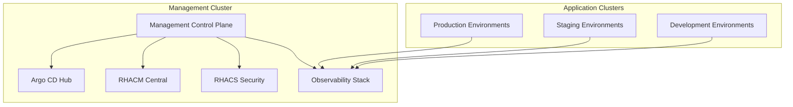
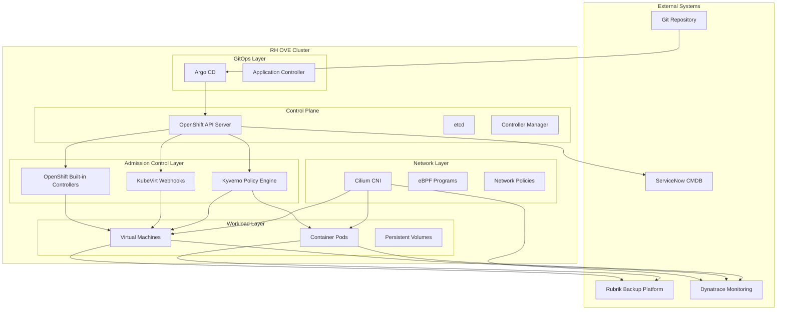

# RH OVE Ecosystem Design and Management

Welcome to the comprehensive guide for designing, deploying, and managing the multi-cluster RH OVE ecosystem.

## Solution Overview

This documentation covers a complete multi-cluster RH OVE implementation consisting of:

- **1 Management Cluster**: Centralized control plane for governance, policy, monitoring, and GitOps
- **N Application Clusters**: Dedicated workload execution environments for virtual machines and containers

## Key Features

### 1. Design Phase
- **Multi-cluster topology** for separation of management and workloads
- **Centralized governance** through the management cluster
- **Consistent security** using RHACS and Kyverno policies

### 2. Deployment Phase
- **Rubrik integration** for enterprise backup and recovery
- **Dynatrace monitoring** for comprehensive observability
- **GitOps methodology** using Argo CD for declarative management

### 3. Management Phase
- **Enhanced admission control** with OpenShift defaults plus Kyverno policies
- **CRD-based management** leveraging KubeVirt resources
- **Event-driven integrations** with CMDB systems

### 4. Best Practices
- Resource management and multi-tenancy
- Security and isolation enforcement
- Continuous improvement through monitoring

### 5. References
Comprehensive product documentation and URIs for all integrated components.

## Getting Started

1. Review the [Architecture Overview](architecture/overview.md)
2. Follow the [Installation Guide](deployment/installation.md)
3. Configure [Admission Control](management/admission-control.md)
4. Set up [Monitoring](management/monitoring.md)

## Architecture Diagram

This solution provides a modern, secure, and scalable approach to managing virtualized workloads alongside containerized applications in a unified OpenShift platform.
