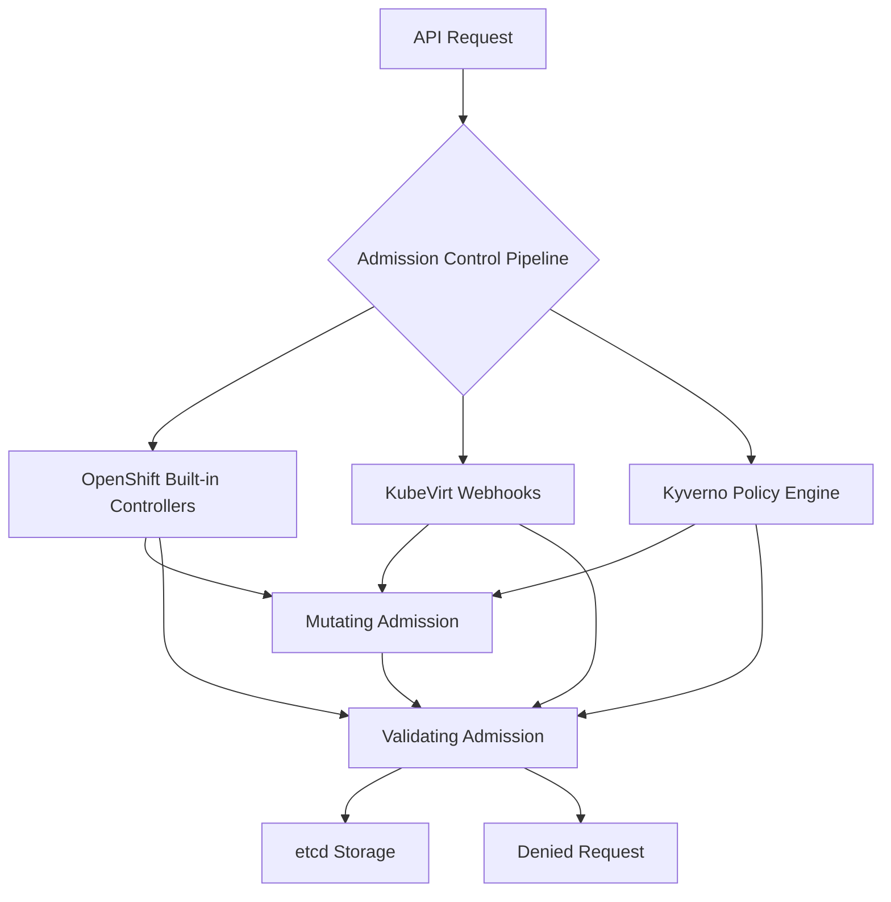
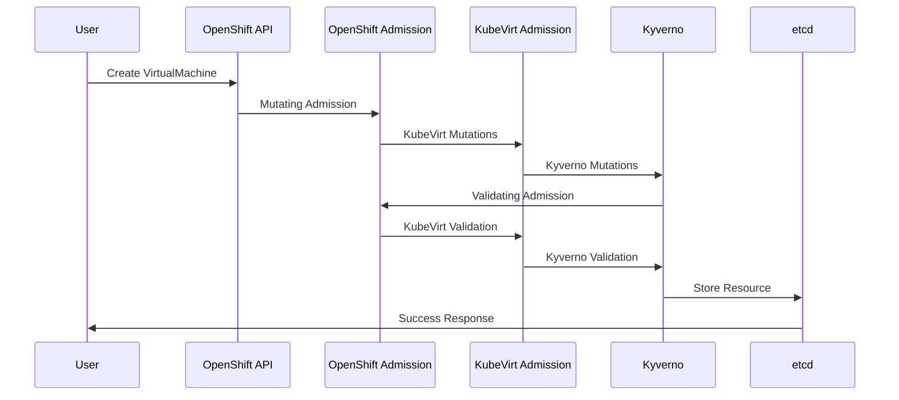

# Admission Control Strategy

## Overview

The RH OVE solution implements a comprehensive admission control strategy that combines OpenShift's built-in controllers with KubeVirt-specific webhooks and Kyverno policy engine for enhanced security and governance.

## Architecture



## Default OpenShift Admission Controllers

RH OVE inherits all standard OpenShift admission controllers including:

- **LimitRanger**: Enforces resource limits and requests
- **ServiceAccount**: Manages service account tokens
- **PodNodeSelector**: Controls node placement
- **SecurityContextConstraint (SCC)**: Enforces security policies
- **ResourceQuota**: Manages namespace-level resource limits
- **MutatingAdmissionWebhook**: Allows custom mutation logic
- **ValidatingAdmissionWebhook**: Allows custom validation logic

## KubeVirt-Specific Admission Webhooks

KubeVirt automatically registers webhooks for virtualization resources:

- **VirtualMachine validation**: Ensures VM configurations are valid
- **VirtualMachineInstance validation**: Validates running VM instances
- **DataVolume validation**: Verifies storage configurations
- **Migration validation**: Checks migration prerequisites

## Kyverno Policy Engine Integration

### Installation

Deploy Kyverno via Helm or manifests:

```yaml
apiVersion: v1
kind: Namespace
metadata:
  name: kyverno
---
apiVersion: apps/v1
kind: Deployment
metadata:
  name: kyverno
  namespace: kyverno
spec:
  replicas: 1
  selector:
    matchLabels:
      app: kyverno
  template:
    metadata:
      labels:
        app: kyverno
    spec:
      containers:
      - name: kyverno
        image: ghcr.io/kyverno/kyverno:latest
```

### VM-Specific Policies

#### Resource Limits Policy

```yaml
apiVersion: kyverno.io/v1
kind: ClusterPolicy
metadata:
  name: vm-resource-limits
spec:
  validationFailureAction: enforce
  background: true
  rules:
  - name: require-vm-resource-limits
    match:
      any:
      - resources:
          kinds:
          - VirtualMachine
    validate:
      message: "VirtualMachine must have CPU and memory limits defined"
      pattern:
        spec:
          template:
            spec:
              domain:
                cpu:
                  cores: ">0"
                memory:
                  guest: ">0"
```

#### VM Security Policy

```yaml
apiVersion: kyverno.io/v1
kind: ClusterPolicy
metadata:
  name: vm-security-policy
spec:
  validationFailureAction: enforce
  rules:
  - name: disallow-privileged-vms
    match:
      any:
      - resources:
          kinds:
          - VirtualMachine
    validate:
      message: "Privileged VMs are not allowed"
      pattern:
        spec:
          template:
            spec:
              domain:
                features:
                  smm:
                    enabled: "false"
```

#### Namespace Isolation Policy

```yaml
apiVersion: kyverno.io/v1
kind: ClusterPolicy
metadata:
  name: vm-namespace-isolation
spec:
  validationFailureAction: enforce
  rules:
  - name: require-namespace-labels
    match:
      any:
      - resources:
          kinds:
          - VirtualMachine
    validate:
      message: "VirtualMachines must be in properly labeled namespaces"
      pattern:
        metadata:
          namespace: "!default"
```

### Multi-Tenant Policies

#### Application-Based Namespace Policy

```yaml
apiVersion: kyverno.io/v1
kind: ClusterPolicy
metadata:
  name: application-namespace-policy
spec:
  validationFailureAction: enforce
  rules:
  - name: enforce-app-namespace-pattern
    match:
      any:
      - resources:
          kinds:
          - VirtualMachine
          - VirtualMachineInstance
    validate:
      message: "VMs must be deployed in application-specific namespaces"
      pattern:
        metadata:
          namespace: "app-*"
```

## Policy Enforcement Flow



## Best Practices

### Policy Development
1. **Start with monitoring mode**: Use `validationFailureAction: audit` initially
2. **Test thoroughly**: Validate policies in non-production environments
3. **Use exceptions sparingly**: Avoid broad policy exceptions
4. **Version control**: Store policies in Git repositories

### Performance Considerations
1. **Optimize policy matching**: Use specific resource selectors
2. **Minimize policy overlap**: Avoid redundant validation rules
3. **Monitor admission latency**: Track policy evaluation performance
4. **Use background processing**: Enable background validation where appropriate

### Monitoring and Troubleshooting

#### Policy Violations Dashboard

Monitor policy violations using Prometheus metrics:

```yaml
apiVersion: v1
kind: ServiceMonitor
metadata:
  name: kyverno-metrics
spec:
  selector:
    matchLabels:
      app: kyverno
  endpoints:
  - port: metrics
```

#### Common Troubleshooting

1. **Policy not applying**: Check policy syntax and matching criteria
2. **Performance issues**: Review policy complexity and scope
3. **Conflicts**: Examine interaction between different admission controllers
4. **Debugging**: Use `kubectl describe` to view admission controller events

## Integration with GitOps

Store all policies in Git and deploy via Argo CD:

```yaml
apiVersion: argoproj.io/v1alpha1
kind: Application
metadata:
  name: kyverno-policies
spec:
  source:
    repoURL: https://git.example.com/rh-ove-policies
    path: policies/
    targetRevision: main
  destination:
    server: https://kubernetes.default.svc
  syncPolicy:
    automated:
      prune: true
      selfHeal: true
```

This comprehensive admission control strategy ensures that all workloads, both containers and VMs, comply with organizational security and operational policies while maintaining the flexibility needed for modern application development.
