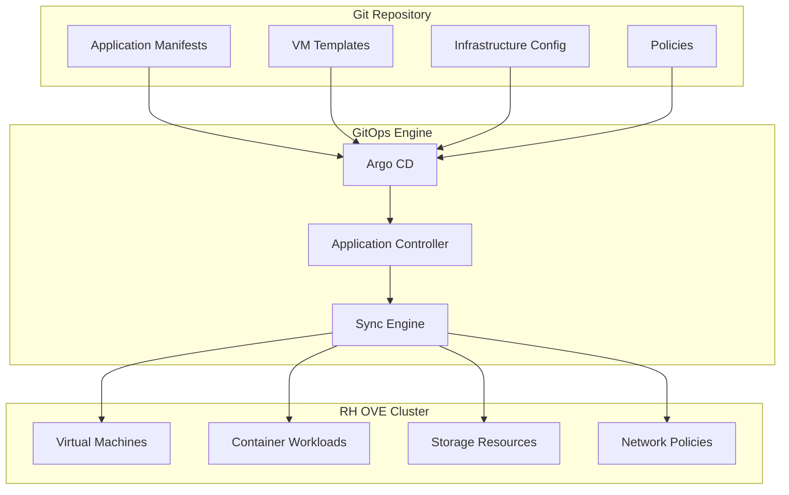
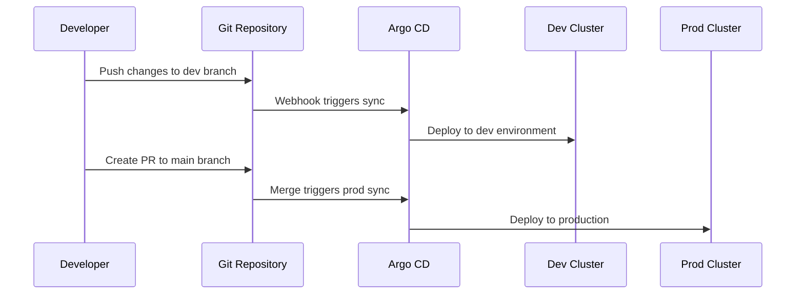

# GitOps Operations

## Overview

This document outlines the GitOps approach for managing RH OVE workloads, providing guidelines for implementing Infrastructure as Code (IaC) and application deployment through Git-based workflows.

## GitOps Principles

Based on our research, using GitOps for RH OVE is widely considered a good strategy with several key benefits:

- **Single Source of Truth**: All VM configurations and infrastructure stored in Git
- **Declarative Management**: Infrastructure as Code for VMs and containers
- **Automation**: Reduced human error through automated deployments
- **Auditability**: Complete change tracking and rollback capabilities
- **Collaboration**: Peer review through pull requests

## Architecture



## Repository Structure

### Recommended Git Repository Layout

```
rh-ove-gitops/
├── applications/
│   ├── web-app/
│   │   ├── base/
│   │   │   ├── kustomization.yaml
│   │   │   ├── deployment.yaml
│   │   │   └── service.yaml
│   │   └── overlays/
│   │       ├── dev/
│   │       ├── staging/
│   │       └── prod/
│   └── database-vm/
│       ├── vm-definition.yaml
│       ├── datavolume.yaml
│       └── service.yaml
├── infrastructure/
│   ├── storage-classes/
│   ├── network-policies/
│   └── rbac/
├── vm-templates/
│   ├── rhel8-template.yaml
│   ├── windows-template.yaml
│   └── ubuntu-template.yaml
└── policies/
    ├── kyverno/
    └── gatekeeper/
```

## Argo CD Configuration

### Application Definition

```yaml
apiVersion: argoproj.io/v1alpha1
kind: Application
metadata:
  name: database-vm-app
  namespace: argocd
spec:
  project: default
  source:
    repoURL: https://git.example.com/rh-ove-gitops
    targetRevision: main
    path: applications/database-vm
  destination:
    server: https://kubernetes.default.svc
    namespace: app-database-prod
  syncPolicy:
    automated:
      prune: true
      selfHeal: true
    syncOptions:
    - CreateNamespace=true
```

### AppProject for VM Workloads

```yaml
apiVersion: argoproj.io/v1alpha1
kind: AppProject
metadata:
  name: vm-workloads
  namespace: argocd
spec:
  description: Project for VM-based applications
  sourceRepos:
  - https://git.example.com/rh-ove-gitops
  destinations:
  - namespace: 'app-*'
    server: https://kubernetes.default.svc
  clusterResourceWhitelist:
  - group: ''
    kind: Namespace
  - group: 'kubevirt.io'
    kind: VirtualMachine
  - group: 'cdi.kubevirt.io'
    kind: DataVolume
  namespaceResourceWhitelist:
  - group: ''
    kind: Service
  - group: ''
    kind: ConfigMap
  - group: ''
    kind: Secret
```

## VM Management through GitOps

### Virtual Machine Definition

```yaml
apiVersion: kubevirt.io/v1
kind: VirtualMachine
metadata:
  name: web-server-vm
  namespace: app-web-prod
  labels:
    app: web-server
    managed-by: argocd
spec:
  running: true
  template:
    metadata:
      labels:
        app: web-server
        version: v1.2.0
    spec:
      domain:
        cpu:
          cores: 2
        memory:
          guest: 4Gi
        devices:
          disks:
          - name: rootdisk
            disk:
              bus: virtio
          - name: datadisk
            disk:
              bus: virtio
          interfaces:
          - name: default
            masquerade: {}
      networks:
      - name: default
        pod: {}
      volumes:
      - name: rootdisk
        dataVolume:
          name: web-server-root
      - name: datadisk
        dataVolume:
          name: web-server-data
```

### DataVolume Configuration

```yaml
apiVersion: cdi.kubevirt.io/v1beta1
kind: DataVolume
metadata:
  name: web-server-root
  namespace: app-web-prod
spec:
  pvc:
    accessModes:
    - ReadWriteOnce
    resources:
      requests:
        storage: 30Gi
    storageClassName: fast-ssd
  source:
    registry:
      url: "docker://registry.redhat.io/rhel8/rhel:latest"
---
apiVersion: cdi.kubevirt.io/v1beta1
kind: DataVolume
metadata:
  name: web-server-data
  namespace: app-web-prod
spec:
  pvc:
    accessModes:
    - ReadWriteOnce
    resources:
      requests:
        storage: 100Gi
    storageClassName: standard-hdd
  source:
    blank: {}
```

## Multi-Environment Management

### Environment-Specific Overlays

```yaml
# overlays/prod/kustomization.yaml
apiVersion: kustomize.config.k8s.io/v1beta1
kind: Kustomization

resources:
- ../../base

patchesStrategicMerge:
- vm-resources.yaml
- storage-config.yaml

patches:
- target:
    kind: VirtualMachine
    name: web-server-vm
  patch: |-
    - op: replace
      path: /spec/template/spec/domain/cpu/cores
      value: 4
    - op: replace
      path: /spec/template/spec/domain/memory/guest
      value: 8Gi
```

### Environment Promotion Workflow



## CI/CD Integration

### GitLab CI Pipeline

```yaml
# .gitlab-ci.yml
stages:
  - validate
  - test
  - deploy

validate-manifests:
  stage: validate
  script:
    - kubeval manifests/*.yaml
    - kustomize build overlays/dev | kubeval

vm-integration-test:
  stage: test
  script:
    - kubectl apply --dry-run=client -f vm-definitions/
    - virtctl validate vm-definitions/

deploy-to-dev:
  stage: deploy
  script:
    - argocd app sync dev-environment
  only:
    - develop

deploy-to-prod:
  stage: deploy
  script:
    - argocd app sync prod-environment
  only:
    - main
```

## Security and Compliance

### Policy as Code

```yaml
# policies/kyverno/vm-security-policy.yaml
apiVersion: kyverno.io/v1
kind: ClusterPolicy
metadata:
  name: vm-security-standards
spec:
  validationFailureAction: enforce
  background: true
  rules:
  - name: require-vm-labels
    match:
      any:
      - resources:
          kinds:
          - VirtualMachine
    validate:
      message: "VMs must have required labels"
      pattern:
        metadata:
          labels:
            app: "?*"
            version: "?*"
            managed-by: "argocd"
```

### RBAC for GitOps

```yaml
apiVersion: rbac.authorization.k8s.io/v1
kind: ClusterRole
metadata:
  name: argocd-application-controller
rules:
- apiGroups:
  - ""
  resources:
  - "*"
  verbs:
  - "*"
- apiGroups:
  - "kubevirt.io"
  resources:
  - "*"
  verbs:
  - "*"
- apiGroups:
  - "cdi.kubevirt.io"
  resources:
  - "*"
  verbs:
  - "*"
```

## Monitoring and Observability

### GitOps Metrics

Key metrics to monitor:
- Sync success rate
- Deployment frequency
- Mean time to recovery
- Application health status

### Dashboard Configuration

```yaml
apiVersion: v1
kind: ConfigMap
metadata:
  name: argocd-cm
data:
  url: https://argocd.example.com
  statusbadge.enabled: "true"
  application.instanceLabelKey: argocd.argoproj.io/instance
```

## Disaster Recovery

### Backup Strategy

```yaml
apiVersion: v1
kind: ConfigMap
metadata:
  name: backup-config
data:
  backup-strategy.yaml: |
    applications:
      - name: critical-vms
        backup_frequency: "daily"
        retention: "30d"
        git_ref: "backup/$(date +%Y%m%d)"
    
    infrastructure:
      - name: cluster-config
        backup_frequency: "weekly"
        retention: "12w"
```

### Recovery Procedures

1. **Application Recovery**
   ```bash
   # Restore from specific commit
   argocd app set myapp --revision abc123
   argocd app sync myapp
   ```

2. **Full Environment Recovery**
   ```bash
   # Deploy entire environment from Git
   argocd app create disaster-recovery \
     --repo https://git.example.com/rh-ove-gitops \
     --path recovery/full-environment \
     --dest-server https://kubernetes.default.svc
   ```

## Best Practices

### Development Workflow
1. **Feature branches**: Use feature branches for new VM deployments
2. **Pull requests**: Require peer review for all changes
3. **Automated testing**: Validate manifests before merge
4. **Progressive deployment**: Use staging environments before production

### Operational Guidelines
1. **Secrets management**: Use external secret management (e.g., Vault)
2. **Resource limits**: Define appropriate CPU/memory limits for VMs
3. **Monitoring**: Implement comprehensive monitoring for all deployments
4. **Documentation**: Keep README files updated in each application directory

This GitOps approach ensures consistent, auditable, and automated management of VM and container workloads in the RH OVE environment.
