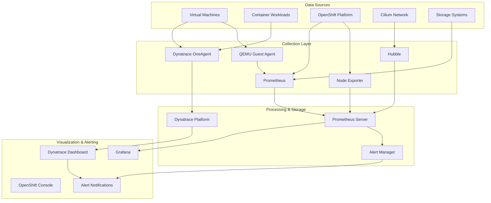

# Monitoring and Observability

## Overview

This document provides comprehensive monitoring and observability strategies for the RH OVE ecosystem, covering infrastructure, virtual machines, containers, and application performance monitoring using Dynatrace and other monitoring tools.

## Monitoring Architecture



## Dynatrace Integration

Based on our research, integrating RH OVE monitoring stack with Dynatrace provides comprehensive visibility for VMs and Kubernetes workloads.

### Dynatrace Operator Installation

```yaml
apiVersion: dynatrace.com/v1beta1
kind: DynaKube
metadata:
  name: dynakube
  namespace: dynatrace
spec:
  apiUrl: https://your-environment-id.live.dynatrace.com/api
  oneAgent:
    classicFullStack:
      tolerations:
      - key: node-role.kubernetes.io/master
        operator: Exists
        effect: NoSchedule
      resources:
        requests:
          cpu: 100m
          memory: 512Mi
        limits:
          cpu: 300m
          memory: 1Gi
  activeGate:
    capabilities:
    - kubernetes-monitoring
    - routing
    resources:
      requests:
        cpu: 150m
        memory: 512Mi
      limits:
        cpu: 500m
        memory: 1Gi
```

### VM-Specific Monitoring Configuration

```yaml
apiVersion: kubevirt.io/v1
kind: VirtualMachine
metadata:
  name: monitored-vm
  namespace: app-prod
  annotations:
    dynatrace.com/inject: "true"
    dynatrace.com/vm-monitoring: "enabled"
spec:
  template:
    metadata:
      labels:
        app: web-server
        monitoring: enabled
    spec:
      domain:
        devices:
          interfaces:
          - name: default
            masquerade: {}
        resources:
          requests:
            memory: 4Gi
            cpu: 2
      volumes:
      - name: qemu-guest-agent
        serviceAccount:
          serviceAccountName: qemu-guest-agent
```

## Prometheus Configuration

### ServiceMonitor for VM Metrics

```yaml
apiVersion: monitoring.coreos.com/v1
kind: ServiceMonitor
metadata:
  name: vm-metrics
  namespace: monitoring
spec:
  selector:
    matchLabels:
      app: kubevirt-prometheus-metrics
  endpoints:
  - port: metrics
    interval: 30s
    path: /metrics
```

### Custom Metrics for VMs

```yaml
apiVersion: monitoring.coreos.com/v1
kind: PrometheusRule
metadata:
  name: vm-monitoring-rules
  namespace: monitoring
spec:
  groups:
  - name: vm.rules
    rules:
    - alert: VMHighCPUUsage
      expr: kubevirt_vm_cpu_usage_percentage > 80
      for: 5m
      labels:
        severity: warning
      annotations:
        summary: "VM {{ $labels.name }} has high CPU usage"
        description: "VM {{ $labels.name }} in namespace {{ $labels.namespace }} has CPU usage above 80% for more than 5 minutes."
    
    - alert: VMHighMemoryUsage
      expr: kubevirt_vm_memory_usage_percentage > 85
      for: 5m
      labels:
        severity: warning
      annotations:
        summary: "VM {{ $labels.name }} has high memory usage"
        description: "VM {{ $labels.name }} in namespace {{ $labels.namespace }} has memory usage above 85% for more than 5 minutes."
```

## Network Monitoring with Hubble

### Hubble Configuration

```yaml
apiVersion: v1
kind: ConfigMap
metadata:
  name: cilium-config
  namespace: kube-system
data:
  enable-hubble: "true"
  hubble-listen-address: ":4244"
  hubble-metrics-server: ":9091"
  hubble-metrics: |
    dns:query;ignoreAAAA
    drop
    tcp
    flow
    icmp
    http
```

### Network Flow Monitoring

```yaml
apiVersion: monitoring.coreos.com/v1
kind: ServiceMonitor
metadata:
  name: hubble-metrics
spec:
  selector:
    matchLabels:
      k8s-app: hubble
  endpoints:
  - port: hubble-metrics
    interval: 30s
```

## Storage Monitoring

### CDI and Storage Metrics

```yaml
apiVersion: monitoring.coreos.com/v1
kind: ServiceMonitor
metadata:
  name: cdi-controller-metrics
spec:
  selector:
    matchLabels:
      app: cdi-controller
  endpoints:
  - port: metrics
    interval: 30s
    path: /metrics
```

### Storage Performance Alerts

```yaml
apiVersion: monitoring.coreos.com/v1
kind: PrometheusRule
metadata:
  name: storage-monitoring-rules
spec:
  groups:
  - name: storage.rules
    rules:
    - alert: HighStorageLatency
      expr: kubelet_volume_stats_available_bytes / kubelet_volume_stats_capacity_bytes < 0.1
      for: 5m
      labels:
        severity: critical
      annotations:
        summary: "Storage volume {{ $labels.persistentvolumeclaim }} is running out of space"
    
    - alert: DataVolumeImportFailed
      expr: increase(cdi_import_progress_total{phase="Failed"}[5m]) > 0
      labels:
        severity: warning
      annotations:
        summary: "DataVolume import failed"
```

## Application Performance Monitoring

### Guest Agent Installation

For enhanced VM monitoring, install QEMU Guest Agent:

```bash
# Inside RHEL/CentOS VM
sudo yum install qemu-guest-agent
sudo systemctl enable qemu-guest-agent
sudo systemctl start qemu-guest-agent

# Inside Ubuntu VM
sudo apt-get install qemu-guest-agent
sudo systemctl enable qemu-guest-agent
sudo systemctl start qemu-guest-agent

# Inside Windows VM
# Download and install virtio-win guest tools
```

### Node Exporter for VM Guests

```yaml
apiVersion: apps/v1
kind: DaemonSet
metadata:
  name: node-exporter-vm
spec:
  selector:
    matchLabels:
      app: node-exporter-vm
  template:
    metadata:
      labels:
        app: node-exporter-vm
    spec:
      containers:
      - name: node-exporter
        image: prom/node-exporter:latest
        ports:
        - containerPort: 9100
        volumeMounts:
        - name: proc
          mountPath: /host/proc
          readOnly: true
        - name: sys
          mountPath: /host/sys
          readOnly: true
      volumes:
      - name: proc
        hostPath:
          path: /proc
      - name: sys
        hostPath:
          path: /sys
```

## Dashboard Configuration

### Grafana Dashboard for VMs

```json
{
  "dashboard": {
    "title": "RH OVE Virtual Machine Monitoring",
    "panels": [
      {
        "title": "VM CPU Usage",
        "type": "graph",
        "targets": [
          {
            "expr": "kubevirt_vm_cpu_usage_percentage",
            "legendFormat": "{{name}}"
          }
        ]
      },
      {
        "title": "VM Memory Usage",
        "type": "graph",
        "targets": [
          {
            "expr": "kubevirt_vm_memory_usage_percentage",
            "legendFormat": "{{name}}"
          }
        ]
      },
      {
        "title": "VM Network I/O",
        "type": "graph",
        "targets": [
          {
            "expr": "rate(kubevirt_vm_network_receive_bytes_total[5m])",
            "legendFormat": "{{name}} - RX"
          },
          {
            "expr": "rate(kubevirt_vm_network_transmit_bytes_total[5m])",
            "legendFormat": "{{name}} - TX"
          }
        ]
      }
    ]
  }
}
```

### Dynatrace Dashboard Configuration

```yaml
apiVersion: v1
kind: ConfigMap
metadata:
  name: dynatrace-dashboard-config
data:
  vm-overview.json: |
    {
      "dashboardMetadata": {
        "name": "RH OVE VM Overview",
        "shared": true,
        "tags": ["rh-ove", "virtualization"]
      },
      "tiles": [
        {
          "name": "VM Performance",
          "tileType": "CUSTOM_CHARTING",
          "configured": true,
          "queries": [
            {
              "metric": "builtin:host.cpu.usage",
              "aggregation": {
                "type": "AVG"
              },
              "filterBy": {
                "neType": "HOST",
                "tags": ["vm:kubevirt"]
              }
            }
          ]
        }
      ]
    }
```

## Alerting Strategy

### Alert Routing Configuration

```yaml
apiVersion: v1
kind: ConfigMap
metadata:
  name: alertmanager-config
data:
  alertmanager.yml: |
    global:
      smtp_smarthost: 'smtp.example.com:587'
      smtp_from: 'alerts@example.com'
    
    route:
      group_by: ['alertname', 'cluster', 'service']
      group_wait: 10s
      group_interval: 10s
      repeat_interval: 1h
      receiver: 'web.hook'
      routes:
      - match:
          severity: critical
        receiver: 'critical-alerts'
      - match:
          service: vm
        receiver: 'vm-alerts'
    
    receivers:
    - name: 'web.hook'
      webhook_configs:
      - url: 'http://webhook.example.com/alerts'
    
    - name: 'critical-alerts'
      email_configs:
      - to: 'oncall@example.com'
        subject: 'CRITICAL: {{ .GroupLabels.alertname }}'
        body: |
          {{ range .Alerts }}
          Alert: {{ .Annotations.summary }}
          Description: {{ .Annotations.description }}
          {{ end }}
    
    - name: 'vm-alerts'
      slack_configs:
      - api_url: 'https://hooks.slack.com/services/...'
        channel: '#vm-alerts'
        title: 'VM Alert: {{ .GroupLabels.alertname }}'
```

## Logging Strategy

### Centralized Logging for VMs

```yaml
apiVersion: logging.coreos.com/v1
kind: ClusterLogForwarder
metadata:
  name: vm-logs
  namespace: openshift-logging
spec:
  outputs:
  - name: vm-logs-output
    type: elasticsearch
    url: https://elasticsearch.example.com:9200
    elasticsearch:
      index: vm-logs-{.log_type}-{.@timestamp.YYYY.MM.dd}
  pipelines:
  - name: vm-logs-pipeline
    inputRefs:
    - application
    filterRefs:
    - vm-log-filter
    outputRefs:
    - vm-logs-output
```

## Performance Optimization

### Monitoring Resource Optimization

```yaml
apiVersion: v1
kind: ResourceQuota
metadata:
  name: monitoring-quota
  namespace: monitoring
spec:
  hard:
    requests.cpu: "2"
    requests.memory: 4Gi
    limits.cpu: "4"
    limits.memory: 8Gi
    persistentvolumeclaims: "5"
```

### Metrics Retention Policy

```yaml
apiVersion: v1
kind: ConfigMap
metadata:
  name: prometheus-config
data:
  prometheus.yml: |
    global:
      scrape_interval: 30s
      evaluation_interval: 30s
      external_labels:
        cluster: 'rh-ove-cluster'
    
    rule_files:
    - "vm-monitoring-rules.yml"
    
    scrape_configs:
    - job_name: 'kubevirt-vms'
      kubernetes_sd_configs:
      - role: pod
      relabel_configs:
      - source_labels: [__meta_kubernetes_pod_label_kubevirt_io]
        target_label: vm_name
```

## Troubleshooting Monitoring

### Common Issues and Solutions

1. **OneAgent not reporting VM data**
   ```bash
   # Check OneAgent status
   oc get pods -n dynatrace
   oc describe pod dynatrace-oneagent-xxx
   
   # Verify VM annotations
   oc get vm -o yaml | grep -A5 annotations
   ```

2. **Missing VM metrics in Prometheus**
   ```bash
   # Check ServiceMonitor configuration
   oc get servicemonitor -n monitoring
   
   # Verify metrics endpoint
   oc port-forward svc/kubevirt-prometheus-metrics 8080:8080
   curl localhost:8080/metrics
   ```

3. **Network flow data not appearing**
   ```bash
   # Check Hubble status
   cilium status
   hubble status
   
   # Verify Hubble configuration
   oc get configmap cilium-config -n kube-system -o yaml
   ```

This comprehensive monitoring strategy ensures full visibility into the RH OVE ecosystem, covering infrastructure, virtual machines, containers, and application performance.
