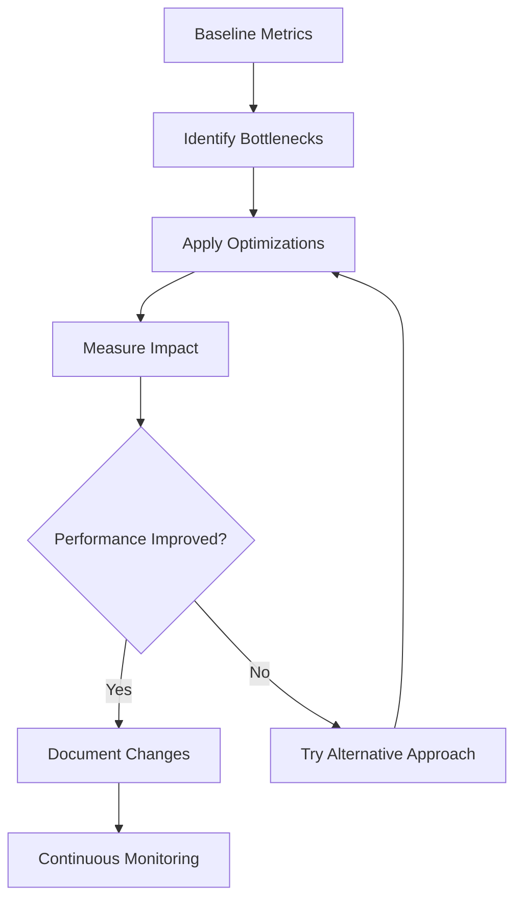

# Performance Tuning

## Overview

This document provides comprehensive performance tuning guidelines for the RH OVE ecosystem, covering optimization strategies for virtual machines, networking, storage, and cluster-wide performance enhancements.

## Performance Optimization Strategy

### Performance Monitoring Approach



### Key Performance Indicators (KPIs)

- **VM Performance**: CPU utilization, memory usage, disk I/O, network throughput
- **Cluster Performance**: Node utilization, pod scheduling latency, API response times
- **Network Performance**: Latency, packet loss, bandwidth utilization
- **Storage Performance**: IOPS, throughput, latency

## Virtual Machine Performance Tuning

### CPU Optimization

#### CPU Pinning for High-Performance VMs

```yaml
apiVersion: kubevirt.io/v1
kind: VirtualMachine
metadata:
  name: high-performance-vm
spec:
  template:
    spec:
      domain:
        cpu:
          cores: 4
          dedicatedCpuPlacement: true
          isolateEmulatorThread: true
        resources:
          requests:
            cpu: 4
            memory: 8Gi
          limits:
            cpu: 4
            memory: 8Gi
      nodeSelector:
        node-role.kubernetes.io/worker: ""
        cpumanager: "true"
```

#### CPU Manager Configuration

```yaml
apiVersion: machineconfiguration.openshift.io/v1
kind: KubeletConfig
metadata:
  name: cpumanager-enabled
spec:
  machineConfigPoolSelector:
    matchLabels:
      pools.operator.machineconfiguration.openshift.io/worker: ""
  kubeletConfig:
    cpuManagerPolicy: static
    cpuManagerReconcilePeriod: 5s
    reservedSystemCPUs: "0,1"
```

#### NUMA Topology Awareness

```yaml
apiVersion: kubevirt.io/v1
kind: VirtualMachine
metadata:
  name: numa-optimized-vm
spec:
  template:
    spec:
      domain:
        cpu:
          cores: 8
          numa:
            guestMappingPassthrough: {}
        memory:
          guest: 16Gi
          hugepages:
            pageSize: 1Gi
```

### Memory Optimization

#### Hugepages Configuration

```yaml
# Node configuration for hugepages
apiVersion: machineconfiguration.openshift.io/v1
kind: MachineConfig
metadata:
  name: hugepages-worker
  labels:
    machineconfiguration.openshift.io/role: worker
spec:
  config:
    ignition:
      version: 3.2.0
    systemd:
      units:
      - name: hugepages-1gi.service
        enabled: true
        contents: |
          [Unit]
          Description=Configure 1Gi hugepages
          [Service]
          Type=oneshot
          ExecStart=/bin/bash -c 'echo 8 > /sys/kernel/mm/hugepages/hugepages-1048576kB/nr_hugepages'
          [Install]
          WantedBy=multi-user.target
```

#### VM Memory Configuration with Hugepages

```yaml
apiVersion: kubevirt.io/v1
kind: VirtualMachine
metadata:
  name: memory-optimized-vm
spec:
  template:
    spec:
      domain:
        memory:
          guest: 8Gi
          hugepages:
            pageSize: 1Gi
        resources:
          requests:
            memory: 8Gi
            hugepages-1Gi: 8Gi
          limits:
            memory: 8Gi
            hugepages-1Gi: 8Gi
```

### Storage Performance Optimization

#### High-Performance Storage Configuration

```yaml
apiVersion: storage.k8s.io/v1
kind: StorageClass
metadata:
  name: high-performance-ssd
provisioner: kubernetes.io/no-provisioner
parameters:
  type: ssd
  fsType: ext4
  # Optimize for performance
  mountOptions: "noatime,nodiratime"
reclaimPolicy: Delete
volumeBindingMode: WaitForFirstConsumer
```

#### VM Disk Performance Tuning

```yaml
apiVersion: kubevirt.io/v1
kind: VirtualMachine
metadata:
  name: storage-optimized-vm
spec:
  template:
    spec:
      domain:
        devices:
          disks:
          - name: rootdisk
            disk:
              bus: virtio
              # Enable disk cache for better performance
              cache: writeback
          - name: datadisk
            disk:
              bus: virtio
              cache: none
              # Use native I/O for better performance
              io: native
        resources:
          requests:
            cpu: 2
            memory: 4Gi
      volumes:
      - name: rootdisk
        dataVolume:
          name: vm-root-disk
      - name: datadisk
        dataVolume:
          name: vm-data-disk
```

#### Storage I/O Optimization

```yaml
apiVersion: cdi.kubevirt.io/v1beta1
kind: DataVolume
metadata:
  name: optimized-datavolume
spec:
  pvc:
    accessModes:
    - ReadWriteOnce
    resources:
      requests:
        storage: 100Gi
    storageClassName: high-performance-ssd
    # Optimize volume for performance
    volumeMode: Block
  source:
    blank: {}
```

## Network Performance Tuning

### Cilium Performance Optimization

#### eBPF Optimization Configuration

```yaml
apiVersion: v1
kind: ConfigMap
metadata:
  name: cilium-config
  namespace: kube-system
data:
  # Enable bandwidth manager for better QoS
  enable-bandwidth-manager: "true"
  
  # Enable local redirect policy for better performance
  enable-local-redirect-policy: "true"
  
  # Optimize datapath
  datapath-mode: "veth"
  
  # Enable XDP acceleration where supported
  enable-xdp-acceleration: "true"
  
  # kube-proxy replacement for better performance
  kube-proxy-replacement: "strict"
  
  # Optimize for performance
  enable-cilium-endpoint-slice: "true"
```

#### Network Device Optimization

```yaml
apiVersion: v1
kind: ConfigMap
metadata:
  name: cilium-config
  namespace: kube-system
data:
  # Specify devices for optimal performance
  devices: "eth0"
  
  # Enable auto direct node routes
  auto-direct-node-routes: "true"
  
  # Optimize tunnel protocol
  tunnel: "disabled"
  
  # Use native routing when possible
  enable-ipv4-masquerade: "false"
  enable-ipv6-masquerade: "false"
```

### VM Network Performance

#### SR-IOV Configuration for High-Performance Networking

```yaml
apiVersion: sriovnetwork.openshift.io/v1
kind: SriovNetworkNodePolicy
metadata:
  name: high-performance-network
  namespace: openshift-sriov-network-operator
spec:
  nodeSelector:
    feature.node.kubernetes.io/network-sriov.capable: "true"
  nicSelector:
    vendor: "15b3"
    deviceID: "1017"
  numVfs: 8
  priority: 99
  resourceName: "high_perf_nic"
```

#### VM with SR-IOV Network Attachment

```yaml
apiVersion: kubevirt.io/v1
kind: VirtualMachine
metadata:
  name: sriov-vm
spec:
  template:
    spec:
      domain:
        devices:
          interfaces:
          - name: default
            masquerade: {}
          - name: sriov-network
            sriov: {}
        resources:
          requests:
            cpu: 4
            memory: 8Gi
      networks:
      - name: default
        pod: {}
      - name: sriov-network
        multus:
          networkName: high-performance-network
```

### Multi-Network Performance with Multus

#### Dedicated Network Interfaces for Different Traffic Types

```yaml
apiVersion: kubevirt.io/v1
kind: VirtualMachine
metadata:
  name: multi-interface-performance-vm
  namespace: high-performance-workloads
  annotations:
    k8s.v1.cni.cncf.io/networks: |
      [
        {
          "name": "management-network",
          "ips": ["192.168.1.5/24"]
        },
        {
          "name": "storage-network",
          "ips": ["192.168.2.5/24"]
        },
        {
          "name": "sriov-data-network",
          "ips": ["10.0.0.5/24"]
        }
      ]
spec:
  running: true
  template:
    spec:
      domain:
        cpu:
          cores: 16
          dedicatedCpuPlacement: true
          isolateEmulatorThread: true
        memory:
          guest: 32Gi
          hugepages:
            pageSize: 1Gi
        devices:
          interfaces:
          - name: default
            masquerade: {}
          - name: management
            bridge:
              port: []
          - name: storage
            bridge:
              port: []
          - name: sriov-data
            sriov: {}
          disks:
          - name: rootdisk
            disk:
              bus: virtio
              cache: writeback
        resources:
          requests:
            cpu: 16
            memory: 32Gi
            hugepages-1Gi: 32Gi
          limits:
            cpu: 16
            memory: 32Gi
            hugepages-1Gi: 32Gi
      networks:
      - name: default
        pod: {}
      - name: management
        multus:
          networkName: management-network
      - name: storage
        multus:
          networkName: storage-network
      - name: sriov-data
        multus:
          networkName: sriov-data-network
      volumes:
      - name: rootdisk
        dataVolume:
          name: multi-interface-vm-root
```

#### High-Performance NAD Configurations

```yaml
# High-performance management network
apiVersion: k8s.cni.cncf.io/v1
kind: NetworkAttachmentDefinition
metadata:
  name: management-network
  namespace: high-performance-workloads
spec:
  config: |
    {
      "cniVersion": "0.3.1",
      "name": "management-network",
      "type": "macvlan",
      "master": "ens192",
      "mode": "bridge",
      "capabilities": {
        "ips": true
      },
      "ipam": {
        "type": "static"
      }
    }
---
# Dedicated storage network with optimized MTU
apiVersion: k8s.cni.cncf.io/v1
kind: NetworkAttachmentDefinition
metadata:
  name: storage-network
  namespace: high-performance-workloads
spec:
  config: |
    {
      "cniVersion": "0.3.1",
      "name": "storage-network",
      "type": "macvlan",
      "master": "ens224",
      "mode": "bridge",
      "mtu": 9000,
      "capabilities": {
        "ips": true
      },
      "ipam": {
        "type": "static"
      }
    }
---
# SR-IOV high-performance data network
apiVersion: k8s.cni.cncf.io/v1
kind: NetworkAttachmentDefinition
metadata:
  name: sriov-data-network
  namespace: high-performance-workloads
spec:
  config: |
    {
      "cniVersion": "0.3.1",
      "name": "sriov-data-network",
      "type": "sriov",
      "deviceID": "1017",
      "vf": 0,
      "spoofchk": "off",
      "trust": "on",
      "capabilities": {
        "ips": true
      },
      "ipam": {
        "type": "static"
      }
    }
```

#### Bond Network for High Availability

```yaml
apiVersion: k8s.cni.cncf.io/v1
kind: NetworkAttachmentDefinition
metadata:
  name: bond-ha-network
  namespace: high-performance-workloads
spec:
  config: |
    {
      "cniVersion": "0.3.1",
      "name": "bond-ha-network",
      "type": "bond",
      "mode": "802.3ad",
      "miimon": "100",
      "updelay": "200",
      "downdelay": "200",
      "links": [
        {
          "name": "ens256"
        },
        {
          "name": "ens257"
        }
      ],
      "ipam": {
        "type": "static"
      }
    }
```

## Cluster Performance Optimization

### Node-Level Optimizations

#### Performance Profile for Worker Nodes

```yaml
apiVersion: performance.openshift.io/v2
kind: PerformanceProfile
metadata:
  name: high-performance-worker
spec:
  cpu:
    isolated: "2-47"
    reserved: "0-1"
  hugepages:
    defaultHugepagesSize: 1G
    pages:
    - count: 16
      size: 1G
  nodeSelector:
    node-role.kubernetes.io/worker-rt: ""
  realTimeKernel:
    enabled: true
  numa:
    topologyPolicy: "single-numa-node"
```

#### Machine Config for Kernel Tuning

```yaml
apiVersion: machineconfiguration.openshift.io/v1
kind: MachineConfig
metadata:
  name: performance-tuning
  labels:
    machineconfiguration.openshift.io/role: worker
spec:
  config:
    ignition:
      version: 3.2.0
    storage:
      files:
      - path: /etc/sysctl.d/99-performance.conf
        mode: 0644
        contents:
          inline: |
            # Network performance tuning
            net.core.rmem_max = 268435456
            net.core.wmem_max = 268435456
            net.ipv4.tcp_rmem = 4096 131072 268435456
            net.ipv4.tcp_wmem = 4096 65536 268435456
            
            # Virtual memory tuning
            vm.swappiness = 1
            vm.dirty_ratio = 15
            vm.dirty_background_ratio = 5
            
            # CPU scheduler tuning
            kernel.sched_migration_cost_ns = 5000000
```

### Resource Management Optimization

#### Cluster Resource Allocation

```yaml
apiVersion: v1
kind: ResourceQuota
metadata:
  name: performance-quota
  namespace: high-performance-workloads
spec:
  hard:
    requests.cpu: "100"
    requests.memory: 200Gi
    limits.cpu: "200"
    limits.memory: 400Gi
    hugepages-1Gi: 64Gi
    persistentvolumeclaims: "50"
```

#### Priority Classes for Critical Workloads

```yaml
apiVersion: scheduling.k8s.io/v1
kind: PriorityClass
metadata:
  name: high-performance-priority
value: 1000
globalDefault: false
description: "Priority class for high-performance VMs"
---
apiVersion: kubevirt.io/v1
kind: VirtualMachine
metadata:
  name: critical-vm
spec:
  template:
    spec:
      priorityClassName: high-performance-priority
      domain:
        cpu:
          cores: 8
        memory:
          guest: 16Gi
```

## Monitoring Performance Optimizations

### Efficient Metrics Collection

```yaml
apiVersion: monitoring.coreos.com/v1
kind: ServiceMonitor
metadata:
  name: performance-metrics
spec:
  selector:
    matchLabels:
      app: high-performance-app
  endpoints:
  - port: metrics
    interval: 15s  # Reduced interval for better granularity
    scrapeTimeout: 10s
    path: /metrics
    metricRelabelings:
    - sourceLabels: [__name__]
      regex: 'go_.*|process_.*'
      action: drop  # Drop unnecessary metrics
```

### Performance Dashboard Configuration

```yaml
apiVersion: v1
kind: ConfigMap
metadata:
  name: performance-dashboard
data:
  dashboard.json: |
    {
      "dashboard": {
        "title": "RH OVE Performance Dashboard",
        "panels": [
          {
            "title": "VM CPU Usage",
            "type": "graph",
            "targets": [
              {
                "expr": "rate(kubevirt_vm_cpu_usage_seconds_total[5m]) * 100",
                "legendFormat": "{{name}} CPU %"
              }
            ]
          },
          {
            "title": "VM Memory Usage",
            "type": "graph",
            "targets": [
              {
                "expr": "kubevirt_vm_memory_usage_bytes / kubevirt_vm_memory_available_bytes * 100",
                "legendFormat": "{{name}} Memory %"
              }
            ]
          }
        ]
      }
    }
```

## Performance Testing and Benchmarking

### VM Performance Testing

```bash
#!/bin/bash
# VM Performance Test Script

VM_NAME="performance-test-vm"
NAMESPACE="testing"

# CPU Performance Test
virtctl console $VM_NAME << EOF
# Install and run CPU benchmark
yum install -y stress-ng
stress-ng --cpu 0 --timeout 60s --metrics-brief
EOF

# Memory Performance Test
virtctl console $VM_NAME << EOF
# Memory bandwidth test
stress-ng --vm 1 --vm-bytes 4G --timeout 60s --metrics-brief
EOF

# Disk I/O Performance Test
virtctl console $VM_NAME << EOF
# Disk performance test
dd if=/dev/zero of=/tmp/testfile bs=1G count=1 oflag=direct
dd if=/tmp/testfile of=/dev/null bs=1G count=1 iflag=direct
rm /tmp/testfile
EOF
```

### Network Performance Testing

```yaml
apiVersion: v1
kind: Pod
metadata:
  name: network-performance-test
spec:
  containers:
  - name: iperf-server
    image: networkstatic/iperf3
    command: ['iperf3', '-s']
    ports:
    - containerPort: 5201
  - name: iperf-client
    image: networkstatic/iperf3
    command: ['sleep', '3600']
```

## Performance Troubleshooting

### Common Performance Issues

#### High CPU Usage

```bash
# Identify CPU-intensive processes
oc adm top pods --all-namespaces --sort-by=cpu

# Check node CPU utilization
oc adm top nodes

# Analyze CPU usage patterns
virtctl console <vm-name>
top -p 1
```

#### Memory Pressure

```bash
# Check memory usage
oc adm top pods --all-namespaces --sort-by=memory

# Verify hugepages allocation
oc get nodes -o custom-columns=NAME:.metadata.name,HUGEPAGES:.status.allocatable.hugepages-1Gi

# Check for memory leaks in VM
virtctl console <vm-name>
free -h
cat /proc/meminfo
```

#### Storage Performance Issues

```bash
# Check storage performance metrics
oc get pvc
oc describe pvc <pvc-name>

# Monitor I/O patterns
virtctl console <vm-name>
iostat -x 1

# Check storage backend performance
oc get nodes -o wide
```

## Best Practices Summary

### VM Performance Best Practices

1. **CPU Optimization**
   - Use CPU pinning for latency-sensitive workloads
   - Enable NUMA topology awareness
   - Configure appropriate CPU limits and requests

2. **Memory Optimization**
   - Use hugepages for memory-intensive applications
   - Configure appropriate memory ballooning
   - Monitor memory usage patterns

3. **Storage Optimization**
   - Use high-performance storage classes for critical workloads
   - Optimize disk cache settings
   - Consider using block storage for high I/O workloads

4. **Network Optimization**
   - Use SR-IOV for high-bandwidth applications
   - Optimize Cilium configuration for performance
   - Consider DPDK for packet processing workloads

### Monitoring and Maintenance

1. **Regular Performance Reviews**
   - Monitor KPIs continuously
   - Perform regular performance testing
   - Document performance baselines

2. **Capacity Planning**
   - Plan for growth and scaling
   - Monitor resource utilization trends
   - Implement proper resource quotas

3. **Optimization Cycles**
   - Regular performance tuning reviews
   - Test optimizations in non-production environments
   - Document all performance changes

This performance tuning guide provides comprehensive strategies for optimizing the RH OVE ecosystem. Regular application of these practices ensures optimal performance for virtualized workloads while maintaining system stability and reliability.
