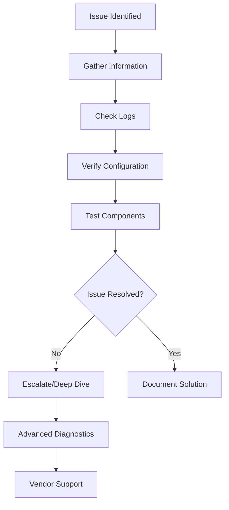

# Troubleshooting Guide

## Overview

This comprehensive troubleshooting guide addresses common issues in the RH OVE ecosystem, providing systematic approaches to diagnose and resolve problems across virtualization, networking, storage, and monitoring components.

## General Troubleshooting Approach

### Diagnostic Flow



### Essential Commands

```bash
# Cluster overview
oc get nodes
oc get pods --all-namespaces
oc get events --all-namespaces --sort-by='.lastTimestamp'

# Resource utilization
oc adm top nodes
oc adm top pods --all-namespaces

# Detailed investigation
oc describe node <node-name>
oc logs -f <pod-name> -n <namespace>
```

## Virtual Machine Issues

### VM Won't Start

#### Symptoms
- VM remains in "Pending" or "Scheduling" state
- VM fails to boot or crashes during startup

#### Troubleshooting Steps

1. **Check VM Definition**
   ```bash
   oc get vm <vm-name> -o yaml
   oc describe vm <vm-name>
   ```

2. **Verify Node Resources**
   ```bash
   oc describe nodes
   oc adm top nodes
   ```

3. **Check DataVolume Status**
   ```bash
   oc get datavolume
   oc describe datavolume <dv-name>
   ```

4. **Review Events**
   ```bash
   oc get events --field-selector involvedObject.name=<vm-name>
   ```

#### Common Solutions

- **Insufficient Resources**: Scale cluster or adjust VM specs
- **DataVolume Issues**: Check CDI logs and storage classes
- **Node Affinity**: Verify node selector and affinity rules

### VM Performance Issues

#### Symptoms
- Slow VM performance
- High CPU/memory usage
- Network latency

#### Troubleshooting Steps

1. **Check VM Resource Allocation**
   ```bash
   oc get vm <vm-name> -o jsonpath='{.spec.template.spec.domain.resources}'
   ```

2. **Monitor VM Metrics**
   ```bash
   # Use virtctl to access VM console
   virtctl console <vm-name>
   
   # Check VM performance inside guest
   top
   iostat
   iftop
   ```

3. **Verify Host Resources**
   ```bash
   oc adm top node <node-name>
   oc describe node <node-name>
   ```

#### Solutions

- Adjust VM CPU/memory allocation
- Enable CPU pinning for critical VMs
- Check storage performance and IOPS limits

## Networking Issues

### Cilium Network Problems

#### Symptoms
- Pods cannot communicate
- Network policies not working
- DNS resolution failures

#### Troubleshooting Steps

1. **Check Cilium Status**
   ```bash
   cilium status
   cilium connectivity test
   ```

2. **Verify Network Policies**
   ```bash
   oc get cnp
   oc describe cnp <policy-name>
   ```

3. **Monitor Network Flows**
   ```bash
   hubble observe --pod <pod-name>
   hubble observe --verdict DENIED
   ```

#### Common Solutions

```yaml
# Debug network connectivity
apiVersion: v1
kind: Pod
metadata:
  name: network-debug
spec:
  containers:
  - name: debug
    image: nicolaka/netshoot
    command: ['sleep', '3600']
```

### VM Network Connectivity

#### Symptoms
- VM cannot reach external networks
- Inter-VM communication failures
- Service discovery issues

#### Troubleshooting Steps

1. **Check VM Network Configuration**
   ```bash
   oc get vm <vm-name> -o yaml | grep -A 10 networks
   ```

2. **Verify Service Configuration**
   ```bash
   oc get svc
   oc describe svc <service-name>
   ```

3. **Test Connectivity from VM**
   ```bash
   virtctl console <vm-name>
   # Inside VM:
   ping <target-ip>
   nslookup <service-name>
   ```

## Storage Issues

### DataVolume Problems

#### Symptoms
- DataVolume stuck in "Pending" state
- Import/clone operations failing
- Storage quota exceeded

#### Troubleshooting Steps

1. **Check DataVolume Status**
   ```bash
   oc get datavolume
   oc describe datavolume <dv-name>
   ```

2. **Review CDI Logs**
   ```bash
   oc logs -n cdi deployment/cdi-controller
   oc logs -n cdi deployment/cdi-operator
   ```

3. **Verify Storage Classes**
   ```bash
   oc get storageclass
   oc describe storageclass <sc-name>
   ```

#### Solutions

```yaml
# Debug DataVolume with verbose logging
apiVersion: cdi.kubevirt.io/v1beta1
kind: DataVolume
metadata:
  name: debug-dv
  annotations:
    cdi.kubevirt.io/debug: "true"
spec:
  pvc:
    accessModes: [ReadWriteOnce]
    resources:
      requests:
        storage: 10Gi
  source:
    blank: {}
```

### Storage Performance Issues

#### Symptoms
- Slow disk I/O
- High storage latency
- VM disk full errors

#### Troubleshooting Steps

1. **Check Storage Metrics**
   ```bash
   # Prometheus queries
   kubectl port-forward -n monitoring svc/prometheus 9090:9090
   # Query: kubelet_volume_stats_used_bytes
   ```

2. **Verify PVC Usage**
   ```bash
   oc get pvc
   oc describe pvc <pvc-name>
   ```

3. **Monitor Storage Node Performance**
   ```bash
   oc adm top nodes
   iostat -x 1
   ```

## Monitoring Issues

### Dynatrace Agent Problems

#### Symptoms
- Missing VM metrics in Dynatrace
- OneAgent not reporting data
- High resource usage by monitoring

#### Troubleshooting Steps

1. **Check OneAgent Status**
   ```bash
   oc get pods -n dynatrace
   oc describe pod <oneagent-pod>
   ```

2. **Verify VM Annotations**
   ```bash
   oc get vm -o yaml | grep -A5 annotations
   ```

3. **Review Dynatrace Logs**
   ```bash
   oc logs -n dynatrace <oneagent-pod>
   ```

### Prometheus Metrics Missing

#### Symptoms
- Missing metrics in Grafana
- ServiceMonitor not working
- Prometheus targets down

#### Troubleshooting Steps

1. **Check ServiceMonitor Configuration**
   ```bash
   oc get servicemonitor
   oc describe servicemonitor <sm-name>
   ```

2. **Verify Metrics Endpoints**
   ```bash
   oc port-forward svc/<service-name> 8080:8080
   curl localhost:8080/metrics
   ```

3. **Check Prometheus Targets**
   ```bash
   # Access Prometheus UI
   oc port-forward -n monitoring svc/prometheus 9090:9090
   # Go to Status -> Targets
   ```

## GitOps and Argo CD Issues

### Application Sync Failures

#### Symptoms
- Applications stuck in "OutOfSync" state
- Sync operations failing
- Resource conflicts

#### Troubleshooting Steps

1. **Check Application Status**
   ```bash
   argocd app get <app-name>
   argocd app logs <app-name>
   ```

2. **Verify Git Repository Access**
   ```bash
   argocd repo list
   argocd repo get <repo-url>
   ```

3. **Review Resource Conflicts**
   ```bash
   oc get <resource-type> <resource-name> -o yaml
   ```

#### Solutions

```bash
# Force refresh and sync
argocd app refresh <app-name>
argocd app sync <app-name> --force

# Reset application state
argocd app actions run <app-name> restart --kind Deployment
```

## Performance Issues

### Cluster Resource Exhaustion

#### Symptoms
- High CPU/memory usage
- Pod evictions
- Slow response times

#### Troubleshooting Steps

1. **Identify Resource Consumers**
   ```bash
   oc adm top pods --all-namespaces --sort-by=cpu
   oc adm top pods --all-namespaces --sort-by=memory
   ```

2. **Check Node Capacity**
   ```bash
   oc describe nodes | grep -A5 "Allocated resources"
   ```

3. **Review Resource Quotas**
   ```bash
   oc get resourcequota --all-namespaces
   oc describe resourcequota <quota-name>
   ```

### VM Live Migration Issues

#### Symptoms
- Migration fails or takes too long
- VM downtime during migration
- Network connectivity loss

#### Troubleshooting Steps

1. **Check Migration Status**
   ```bash
   oc get vmi
   oc describe virtualmachinmigration <migration-name>
   ```

2. **Verify Node Compatibility**
   ```bash
   oc get nodes -o wide
   oc describe node <target-node>
   ```

3. **Monitor Migration Progress**
   ```bash
   oc get events --field-selector reason=LiveMigration
   ```

## Emergency Procedures

### Cluster Recovery

#### When Multiple Nodes Are Down

1. **Check etcd Health**
   ```bash
   oc get etcd -o yaml
   oc logs -n openshift-etcd <etcd-pod>
   ```

2. **Restore from Backup**
   ```bash
   # Follow OpenShift disaster recovery procedures
   oc adm restore-cluster
   ```

### VM Emergency Access

#### When VM Console Is Unresponsive

1. **Use virtctl**
   ```bash
   virtctl console <vm-name>
   virtctl vnc <vm-name>
   ```

2. **Force VM Restart**
   ```bash
   virtctl restart <vm-name>
   virtctl stop <vm-name> --force
   ```

## Advanced Diagnostics

### Debug Pod Creation

```yaml
apiVersion: v1
kind: Pod
metadata:
  name: debug-tools
spec:
  containers:
  - name: debug
    image: registry.redhat.io/ubi8/ubi:latest
    command: ['sleep', '3600']
    securityContext:
      privileged: true
    volumeMounts:
    - name: host
      mountPath: /host
  volumes:
  - name: host
    hostPath:
      path: /
  nodeSelector:
    kubernetes.io/hostname: <node-name>
```

### Log Collection Script

```bash
#!/bin/bash
# Comprehensive log collection script

NAMESPACE=${1:-default}
OUTPUT_DIR="troubleshooting-$(date +%Y%m%d-%H%M%S)"

mkdir -p $OUTPUT_DIR

# Cluster information
oc cluster-info > $OUTPUT_DIR/cluster-info.txt
oc get nodes -o wide > $OUTPUT_DIR/nodes.txt
oc get pods --all-namespaces > $OUTPUT_DIR/all-pods.txt

# VM specific information
oc get vm --all-namespaces -o yaml > $OUTPUT_DIR/vms.yaml
oc get vmi --all-namespaces -o yaml > $OUTPUT_DIR/vmis.yaml
oc get datavolume --all-namespaces -o yaml > $OUTPUT_DIR/datavolumes.yaml

# Events
oc get events --all-namespaces --sort-by='.lastTimestamp' > $OUTPUT_DIR/events.txt

# Logs from key components
oc logs -n openshift-cnv deployment/virt-controller > $OUTPUT_DIR/virt-controller.log
oc logs -n openshift-cnv deployment/virt-api > $OUTPUT_DIR/virt-api.log
oc logs -n cdi deployment/cdi-controller > $OUTPUT_DIR/cdi-controller.log

echo "Logs collected in $OUTPUT_DIR"
tar -czf $OUTPUT_DIR.tar.gz $OUTPUT_DIR
```

## Support and Escalation

### When to Escalate

- Hardware failures
- Data corruption issues
- Security breaches
- Performance degradation > 50%
- Multiple component failures

### Information to Gather

1. **Environment Details**
   - OpenShift version
   - KubeVirt version
   - Cluster size and configuration

2. **Problem Description**
   - Timeline of events
   - Error messages
   - Impact assessment

3. **Diagnostic Data**
   - Logs (sanitized)
   - Configuration files
   - Resource utilization data

### Support Contacts

- **Red Hat Support**: [https://access.redhat.com/support/](https://access.redhat.com/support/)
- **Community Forums**: [https://commons.openshift.org/](https://commons.openshift.org/)
- **KubeVirt Community**: [https://kubevirt.io/community/](https://kubevirt.io/community/)

This troubleshooting guide provides systematic approaches to resolve common issues in the RH OVE ecosystem. Regular review and updates of this guide ensure it remains current with evolving technologies and operational experiences.
