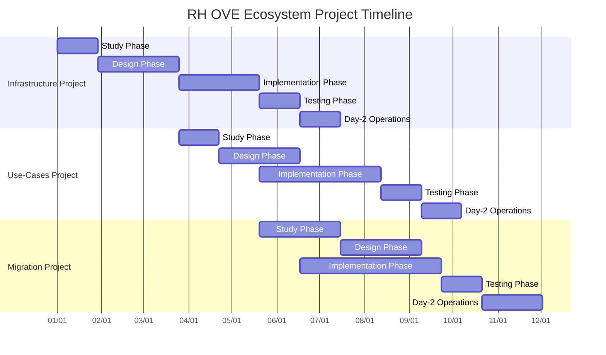
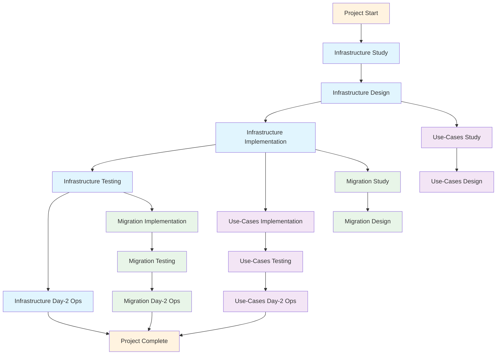
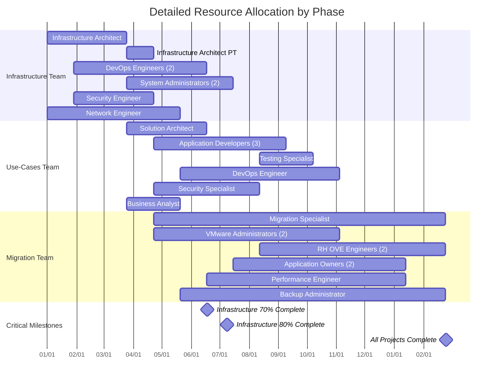

# RH OVE Ecosystem - Detailed Project Timeline

## Project Overview

This document provides detailed timelines, milestones, and dependencies for the three sub-projects within the RH OVE Ecosystem implementation.

**Project Duration**: 12-18 months  
**Start Date**: TBD  
**Target Completion**: TBD

---

## Timeline Summary

| Sub-Project | Duration | Dependencies | Key Deliverables |
|-------------|----------|--------------|------------------|
| **RH OVE Infrastructure** | 6-8 months | None (Foundation) | Multi-cluster platform, ADRs, Operations runbooks |
| **Use-Cases Implementation** | 8-10 months | Infrastructure 70% complete | Working use-cases, Integration patterns |
| **Migration from VMware** | 10-12 months | Infrastructure 80% complete | Migrated workloads, Decommissioned legacy |

---

## Project Timeline Visualization

### Timeline Dependencies Diagram

### Resource Allocation Timeline

### Resource Allocation Notes

**Infrastructure Team Variable Allocation:**
- **Infrastructure Architect**: Full-time during Study/Design phases, part-time for consulting during implementation
- **DevOps Engineers**: Start during Design phase, continue through implementation and operations
- **System Administrators**: Join during Implementation phase, continue for Day-2 operations
- **Security Engineer**: Active during Design through Testing phases
- **Network Engineer**: Active from Study through Implementation phases

**Use-Cases Team Variable Allocation:**
- **Solution Architect**: Active during Study and Design phases primarily
- **Application Developers**: Core implementation team, active longest duration
- **Testing Specialist**: Primarily active during Testing phase with some overlap
- **DevOps Engineer**: Active during Implementation and operations phases
- **Security Specialist**: Active during Design, Implementation, and Testing phases
- **Business Analyst**: Active during Study and early Design phases

**Migration Team Variable Allocation:**
- **Migration Specialist**: Project-long involvement for strategy and coordination
- **VMware Administrators**: Active during Study through early Implementation
- **RH OVE Engineers**: Active during Implementation through Day-2 operations
- **Application Owners**: Active during Design, Implementation, and Testing phases
- **Performance Engineer**: Active during Testing and early Implementation phases
- **Backup Administrator**: Active during Implementation through Day-2 operations

---

## Sub-Project 1: RH OVE Infrastructure Project

### Phase 1: Study Phase (Weeks 1-4)
**Duration**: 4 weeks  
**Effort**: 3-4 FTEs

#### Milestones
- [ ] **Week 2**: Current state assessment completed
- [ ] **Week 3**: Gap analysis finalized
- [ ] **Week 4**: Requirements gathering complete

#### Deliverables
- Current infrastructure assessment report
- Gap analysis document
- Technical requirements specification
- Resource capacity planning

#### Key Activities
- Analyze existing infrastructure components
- Document current network, storage, and compute resources
- Identify skill gaps and training needs
- Define non-functional requirements (performance, security, scalability)

### Phase 2: Design Phase (Weeks 5-12)
**Duration**: 8 weeks  
**Effort**: 4-5 FTEs

#### Milestones
- [ ] **Week 7**: High-Level Design (HLD) approved
- [ ] **Week 10**: Low-Level Design (LLD) completed
- [ ] **Week 12**: ADRs finalized and approved

#### Deliverables
- High-Level Design document
- Low-Level Design document
- 8 Architecture Decision Records (ADRs)
- Security architecture design
- Network topology design

#### Key Activities
- Design multi-cluster architecture
- Define GitOps workflows with ArgoCD
- Plan Cilium CNI implementation
- Design backup and monitoring strategies
- Create security and IAM frameworks

### Phase 3: Implementation Phase (Weeks 13-20)
**Duration**: 8 weeks  
**Effort**: 5-6 FTEs

#### Milestones
- [ ] **Week 15**: Management cluster deployed
- [ ] **Week 17**: First workload cluster operational
- [ ] **Week 19**: GitOps pipeline functional
- [ ] **Week 20**: Monitoring and backup systems active

#### Deliverables
- Deployed multi-cluster RH OVE environment
- GitOps configuration and workflows
- Monitoring stack (Prometheus, Grafana, Dynatrace)
- Backup solution (Rubrik integration)
- Admission controllers configuration

#### Key Activities
- Deploy management and workload clusters
- Configure Cilium CNI and network policies
- Implement GitOps with ArgoCD
- Set up monitoring and alerting
- Configure backup and disaster recovery

### Phase 4: Testing Phase (Weeks 21-24)
**Duration**: 4 weeks  
**Effort**: 4-5 FTEs

#### Milestones
- [ ] **Week 22**: Security testing completed
- [ ] **Week 23**: Performance benchmarks established
- [ ] **Week 24**: Infrastructure acceptance testing passed

#### Deliverables
- Security assessment report
- Performance benchmark results
- Test execution reports
- Infrastructure acceptance criteria validation

#### Key Activities
- Conduct security penetration testing
- Perform load and stress testing
- Validate disaster recovery procedures
- Execute acceptance test scenarios

### Phase 5: Day-2 Operations (Weeks 25-28)
**Duration**: 4 weeks  
**Effort**: 3-4 FTEs

#### Milestones
- [ ] **Week 26**: Operations runbooks completed
- [ ] **Week 27**: Team training finished
- [ ] **Week 28**: Operations handover complete

#### Deliverables
- Day-2 operations runbooks
- Troubleshooting guides
- Performance tuning procedures
- Team training materials

---

## Sub-Project 2: Use-Cases Implementation Project

### Phase 1: Study Phase (Weeks 15-18)
**Duration**: 4 weeks  
**Effort**: 2-3 FTEs  
**Dependency**: Infrastructure Design Phase 75% complete

#### Milestones
- [ ] **Week 16**: Use-case requirements gathered
- [ ] **Week 17**: Business value assessment completed
- [ ] **Week 18**: Use-case prioritization finalized

#### Deliverables
- Use-case requirements specification
- Business value assessment
- Implementation priority matrix
- Resource allocation plan

### Phase 2: Design Phase (Weeks 19-26)
**Duration**: 8 weeks  
**Effort**: 3-4 FTEs

#### Milestones
- [ ] **Week 21**: VM lifecycle use-cases designed
- [ ] **Week 23**: Application deployment patterns defined
- [ ] **Week 25**: Enterprise integration patterns completed
- [ ] **Week 26**: All use-case designs approved

#### Deliverables
- Use-case HLD and LLD documents
- Integration architecture designs
- Security and compliance frameworks
- Performance and scalability specifications

### Phase 3: Implementation Phase (Weeks 27-38)
**Duration**: 12 weeks  
**Effort**: 4-6 FTEs  
**Dependency**: Infrastructure Implementation 80% complete

#### Milestones
- [ ] **Week 29**: VM lifecycle use-cases implemented
- [ ] **Week 32**: Hybrid applications deployed
- [ ] **Week 35**: Database services operational
- [ ] **Week 37**: Security and observability complete
- [ ] **Week 38**: All use-cases integrated

#### Deliverables
- Implemented use-cases with working demonstrations
- Configuration manifests and scripts
- Integration patterns and templates
- Security controls and policies

### Phase 4: Testing Phase (Weeks 39-42)
**Duration**: 4 weeks  
**Effort**: 3-4 FTEs

#### Milestones
- [ ] **Week 40**: Functional testing completed
- [ ] **Week 41**: Integration testing finished
- [ ] **Week 42**: Business validation approved

#### Deliverables
- Test execution reports
- Performance validation results
- Business outcome measurements
- User acceptance documentation

### Phase 5: Day-2 Operations (Weeks 43-46)
**Duration**: 4 weeks  
**Effort**: 2-3 FTEs

#### Milestones
- [ ] **Week 44**: Use-case runbooks completed
- [ ] **Week 45**: Monitoring dashboards operational
- [ ] **Week 46**: Knowledge transfer complete

#### Deliverables
- Use-case operational runbooks
- Monitoring and alerting configurations
- Best practices documentation
- Training materials

---

## Sub-Project 3: Migration Workload from VMware Project

### Phase 1: Study Phase (Weeks 21-28)
**Duration**: 8 weeks  
**Effort**: 3-4 FTEs  
**Dependency**: Infrastructure Implementation 60% complete

#### Milestones
- [ ] **Week 23**: VMware inventory completed
- [ ] **Week 25**: Workload assessment finished
- [ ] **Week 27**: Migration strategy approved
- [ ] **Week 28**: Migration waves defined

#### Deliverables
- Complete VMware workload inventory
- Workload assessment and compatibility analysis
- Migration strategy document
- Migration wave planning
- Risk assessment and mitigation plan

### Phase 2: Design Phase (Weeks 29-36)
**Duration**: 8 weeks  
**Effort**: 4-5 FTEs

#### Milestones
- [ ] **Week 31**: Migration architecture designed
- [ ] **Week 33**: VM templates standardized
- [ ] **Week 35**: Migration procedures documented
- [ ] **Week 36**: Pilot migration plan approved

#### Deliverables
- Migration architecture design
- VM template standards and configurations
- Migration procedure documentation
- Rollback and recovery procedures
- Pilot migration plan

### Phase 3: Implementation Phase (Weeks 37-50)
**Duration**: 14 weeks  
**Effort**: 5-7 FTEs  
**Dependency**: Infrastructure Testing 100% complete

#### Milestones
- [ ] **Week 39**: Pilot migration completed
- [ ] **Week 42**: Wave 1 migrations finished
- [ ] **Week 46**: Wave 2 migrations completed
- [ ] **Week 49**: Wave 3 migrations finished
- [ ] **Week 50**: All critical workloads migrated

#### Deliverables
- Migrated virtual machines and applications
- Updated VM templates and configurations
- Migration execution reports
- Performance optimization results
- Updated network and security configurations

### Phase 4: Testing Phase (Weeks 51-54)
**Duration**: 4 weeks  
**Effort**: 4-5 FTEs

#### Milestones
- [ ] **Week 52**: Application functionality validated
- [ ] **Week 53**: Performance benchmarks achieved
- [ ] **Week 54**: Business continuity confirmed

#### Deliverables
- Application validation reports
- Performance comparison analysis
- Business continuity test results
- User acceptance confirmation

### Phase 5: Day-2 Operations (Weeks 55-60)
**Duration**: 6 weeks  
**Effort**: 3-4 FTEs

#### Milestones
- [ ] **Week 57**: Migration runbooks completed
- [ ] **Week 58**: Legacy decommissioning planned
- [ ] **Week 60**: Operations transition complete

#### Deliverables
- Migration operations runbooks
- Legacy infrastructure decommissioning plan
- Post-migration monitoring procedures
- Lessons learned documentation

---

### Resource Planning

### Team Composition by Sub-Project

#### Infrastructure Project
- Infrastructure Architect: 1 FTE
- DevOps Engineers: 2 FTEs
- System Administrators: 2 FTEs
- Security Engineer: 1 FTE
- Network Engineer: 1 FTE

#### Use-Cases Implementation
- Solution Architect: 1 FTE
- Application Developers: 3 FTEs
- Testing Specialist: 1 FTE
- DevOps Engineer: 1 FTE
- Security Specialist: 1 FTE
- Business Analyst: 1 FTE

#### Migration Project
- Migration Specialist: 1 FTE
- VMware Administrators: 2 FTEs
- RH OVE Engineers: 2 FTEs
- Application Owners: 2 FTEs
- Performance Engineer: 1 FTE
- Backup Administrator: 1 FTE

### Cross-Project Coordination

#### Weekly Sync Meetings
- Architecture review board
- Technical coordination committee
- Risk and issue management
- Resource allocation review

#### Monthly Steering Committee
- Progress against milestones
- Budget and resource adjustments
- Risk escalation and mitigation
- Stakeholder communication

---

## Risk Management

### High-Risk Areas
1. **Resource Availability**: Specialized skills in RH OVE and VMware
2. **Technical Complexity**: Multi-cluster networking and storage
3. **Business Continuity**: Migration impact on critical workloads
4. **Timeline Dependencies**: Sequential phases with limited parallel execution

### Mitigation Strategies
1. **Cross-training**: Develop skills across multiple team members
2. **Proof of Concepts**: Validate technical approaches early
3. **Phased Migration**: Minimize business impact through careful wave planning
4. **Buffer Time**: Include 15-20% contingency in timeline estimates

---

## Success Metrics

### Infrastructure Project
- 99.9% infrastructure uptime SLA
- Security compliance audit pass rate: 100%
- Performance benchmarks met or exceeded
- Team satisfaction with operational procedures

### Use-Cases Project
- All documented use-cases successfully demonstrated
- Business value metrics achieved
- User adoption rates meet targets
- Documentation completeness and accuracy

### Migration Project
- 100% critical workload migration success
- Performance parity or improvement: 95% of workloads
- Business continuity maintained throughout migration
- Legacy infrastructure decommissioning completed on schedule
