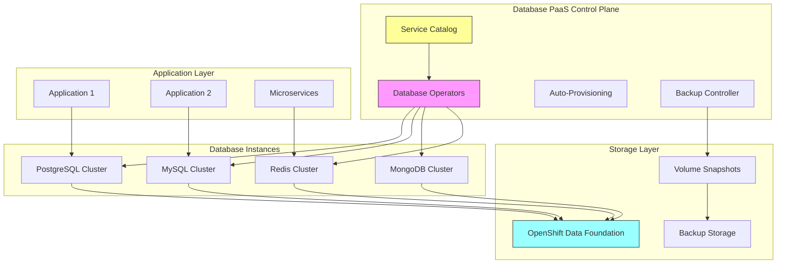

# Use Case: Database Services as Platform-as-a-Service (PaaS)

## Business Context

Organizations require flexible, scalable database solutions that can support various application needs while minimizing operational overhead. This use case demonstrates how to implement database services as Platform-as-a-Service (PaaS) offerings within the RH OVE ecosystem, providing self-service database provisioning, automated management, and seamless integration with application workloads.

## Technical Requirements

### Infrastructure Requirements
- OpenShift 4.12+ with KubeVirt enabled
- OpenShift Data Foundation for persistent storage
- Database operators (PostgreSQL, MySQL, MongoDB, Redis operators)
- Service mesh for secure communication (OpenShift Service Mesh)
- Monitoring and observability stack (Prometheus, Grafana)
- Backup and disaster recovery solutions (OADP/Velero/Rubrik)

### Resource Requirements
- **CPU**: Variable based on database workload (2-16 cores per instance)
- **Memory**: 4GB-64GB RAM per database instance
- **Storage**: High-performance persistent storage with snapshot capabilities
- **Network**: Low-latency networking for database replication and client connections

## Architecture Overview



## Implementation Steps

### Step 1: Install Database Operators

#### PostgreSQL Operator Deployment
```yaml
apiVersion: operators.coreos.com/v1alpha1
kind: Subscription
metadata:
  name: postgresql-operator
  namespace: database-operators
spec:
  channel: stable
  name: postgresql-operator
  source: certified-operators
  sourceNamespace: openshift-marketplace
---
apiVersion: v1
kind: Namespace
metadata:
  name: database-operators
  labels:
    openshift.io/cluster-monitoring: "true"
```

#### MySQL Operator Deployment
```yaml
apiVersion: operators.coreos.com/v1alpha1
kind: Subscription
metadata:
  name: mysql-operator
  namespace: database-operators
spec:
  channel: stable
  name: mysql-operator
  source: certified-operators
  sourceNamespace: openshift-marketplace
```

### Step 2: Create Database Service Templates

#### PostgreSQL Service Template
```yaml
apiVersion: postgresql.cnpg.io/v1
kind: Cluster
metadata:
  name: postgres-template
  namespace: database-services
spec:
  instances: 3
  
  postgresql:
    parameters:
      max_connections: "200"
      shared_buffers: "256MB"
      effective_cache_size: "1GB"
      work_mem: "4MB"
      maintenance_work_mem: "64MB"
  
  bootstrap:
    initdb:
      database: app_db
      owner: app_user
      secret:
        name: postgres-credentials
  
  storage:
    size: 100Gi
    storageClass: fast-ssd
  
  resources:
    requests:
      memory: "2Gi"
      cpu: "1"
    limits:
      memory: "4Gi"
      cpu: "2"
  
  monitoring:
    enabled: true
    customQueriesConfigMap:
    - name: postgres-monitoring
      key: custom-queries.yaml
  
  backup:
    barmanObjectStore:
      destinationPath: s3://db-backups/postgres
      s3Credentials:
        accessKeyId:
          name: backup-credentials
          key: ACCESS_KEY_ID
        secretAccessKey:
          name: backup-credentials
          key: SECRET_ACCESS_KEY
      wal:
        retention: "7d"
      data:
        retention: "30d"
```

#### MySQL Service Template
```yaml
apiVersion: mysql.oracle.com/v2
kind: InnoDBCluster
metadata:
  name: mysql-template
  namespace: database-services
spec:
  secretName: mysql-credentials
  tlsUseSelfSigned: true
  instances: 3
  router:
    instances: 2
  
  datadirVolumeClaimTemplate:
    accessModes:
    - ReadWriteOnce
    resources:
      requests:
        storage: 100Gi
    storageClassName: fast-ssd
  
  mycnf: |
    [mysqld]
    max_connections = 500
    innodb_buffer_pool_size = 2G
    innodb_log_file_size = 256M
    binlog_expire_logs_seconds = 604800
  
  resources:
    requests:
      memory: "2Gi"
      cpu: "1"
    limits:
      memory: "4Gi"
      cpu: "2"
  
  backupProfiles:
  - name: daily-backup
    dumpInstance:
      dumpOptions:
        users: true
        excludeSchemas: ["information_schema", "performance_schema"]
    schedule: "0 2 * * *"
    backupRetentionDays: 30
```

### Step 3: Implement Self-Service Provisioning

#### Service Catalog Integration
```yaml
apiVersion: servicecatalog.k8s.io/v1beta1
kind: ServiceClass
metadata:
  name: postgresql-service
spec:
  clusterServiceBrokerName: database-service-broker
  externalName: postgresql
  description: "Managed PostgreSQL Database Service"
  externalMetadata:
    displayName: "PostgreSQL Database"
    imageUrl: "https://example.com/postgresql-icon.png"
    longDescription: "High-availability PostgreSQL database with automated backups and monitoring"
    providerDisplayName: "Database Team"
    supportUrl: "https://example.com/support"
  plans:
  - name: small
    externalID: postgres-small
    description: "Small PostgreSQL instance (2 CPU, 4GB RAM, 100GB storage)"
    free: false
    externalMetadata:
      displayName: "Small"
      bullets:
      - "2 CPU cores"
      - "4GB RAM"
      - "100GB storage"
      - "Daily backups"
  - name: medium
    externalID: postgres-medium
    description: "Medium PostgreSQL instance (4 CPU, 8GB RAM, 500GB storage)"
    free: false
    externalMetadata:
      displayName: "Medium"
      bullets:
      - "4 CPU cores"
      - "8GB RAM"
      - "500GB storage"
      - "Daily backups"
      - "Read replicas"
```

#### Database Provisioning Operator
```yaml
apiVersion: apps/v1
kind: Deployment
metadata:
  name: database-provisioning-operator
  namespace: database-operators
spec:
  replicas: 1
  selector:
    matchLabels:
      app: database-provisioning-operator
  template:
    metadata:
      labels:
        app: database-provisioning-operator
    spec:
      containers:
      - name: operator
        image: quay.io/example/database-provisioning-operator:latest
        env:
        - name: WATCH_NAMESPACE
          value: ""
        - name: POD_NAME
          valueFrom:
            fieldRef:
              fieldPath: metadata.name
        - name: OPERATOR_NAME
          value: "database-provisioning-operator"
        ports:
        - containerPort: 8080
          name: metrics
        - containerPort: 8081
          name: health
        livenessProbe:
          httpGet:
            path: /healthz
            port: 8081
          initialDelaySeconds: 15
          periodSeconds: 20
        readinessProbe:
          httpGet:
            path: /readyz
            port: 8081
          initialDelaySeconds: 5
          periodSeconds: 10
        resources:
          limits:
            cpu: 200m
            memory: 256Mi
          requests:
            cpu: 100m
            memory: 128Mi
```

### Step 4: Configure Automated Backup and Recovery

#### Backup Schedule Configuration
```yaml
apiVersion: batch/v1
kind: CronJob
metadata:
  name: database-backup-scheduler
  namespace: database-services
spec:
  schedule: "0 2 * * *"  # Daily at 2 AM
  jobTemplate:
    spec:
      template:
        spec:
          containers:
          - name: backup-job
            image: quay.io/example/database-backup:latest
            env:
            - name: BACKUP_TYPE
              value: "full"
            - name: RETENTION_DAYS
              value: "30"
            - name: S3_BUCKET
              value: "database-backups"
            - name: AWS_ACCESS_KEY_ID
              valueFrom:
                secretKeyRef:
                  name: backup-credentials
                  key: access-key-id
            - name: AWS_SECRET_ACCESS_KEY
              valueFrom:
                secretKeyRef:
                  name: backup-credentials
                  key: secret-access-key
            command:
            - /bin/bash
            - -c
            - |
              #!/bin/bash
              set -e
              
              # Discover all database instances
              for db in $(kubectl get postgresql,mysql,mongodb -o name --all-namespaces); do
                echo "Backing up $db"
                backup-database.sh "$db"
              done
          restartPolicy: OnFailure
```

### Step 5: Implement Monitoring and Alerting

#### Database Monitoring Configuration
```yaml
apiVersion: monitoring.coreos.com/v1
kind: ServiceMonitor
metadata:
  name: database-services-monitor
  namespace: database-services
  labels:
    monitoring: database-services
spec:
  selector:
    matchLabels:
      monitoring: enabled
  endpoints:
  - port: metrics
    interval: 30s
    path: /metrics
    honorLabels: true
---
apiVersion: monitoring.coreos.com/v1
kind: PrometheusRule
metadata:
  name: database-services-alerts
  namespace: database-services
spec:
  groups:
  - name: database.alerts
    rules:
    - alert: DatabaseInstanceDown
      expr: up{job="database-services"} == 0
      for: 5m
      labels:
        severity: critical
      annotations:
        summary: "Database instance {{ $labels.instance }} is down"
        description: "Database instance {{ $labels.instance }} has been down for more than 5 minutes."
    
    - alert: DatabaseHighConnections
      expr: database_connections_active / database_connections_max > 0.8
      for: 10m
      labels:
        severity: warning
      annotations:
        summary: "Database {{ $labels.instance }} has high connection usage"
        description: "Database {{ $labels.instance }} is using {{ $value | humanizePercentage }} of available connections."
    
    - alert: DatabaseSlowQueries
      expr: rate(database_slow_queries_total[5m]) > 10
      for: 5m
      labels:
        severity: warning
      annotations:
        summary: "Database {{ $labels.instance }} has high slow query rate"
        description: "Database {{ $labels.instance }} has {{ $value }} slow queries per second."
    
    - alert: DatabaseBackupFailed
      expr: database_backup_last_success_timestamp < (time() - 86400)
      for: 1m
      labels:
        severity: critical
      annotations:
        summary: "Database backup failed for {{ $labels.instance }}"
        description: "Database backup for {{ $labels.instance }} has not succeeded in the last 24 hours."
```

### Step 6: Implement Database Security

#### Network Policies for Database Isolation
```yaml
apiVersion: networking.k8s.io/v1
kind: NetworkPolicy
metadata:
  name: database-isolation
  namespace: database-services
spec:
  podSelector:
    matchLabels:
      tier: database
  policyTypes:
  - Ingress
  - Egress
  ingress:
  - from:
    - namespaceSelector:
        matchLabels:
          name: application-services
    - podSelector:
        matchLabels:
          tier: application
    ports:
    - protocol: TCP
      port: 5432  # PostgreSQL
    - protocol: TCP
      port: 3306  # MySQL
    - protocol: TCP
      port: 27017 # MongoDB
    - protocol: TCP
      port: 6379  # Redis
  egress:
  - to: []
    ports:
    - protocol: TCP
      port: 53   # DNS
    - protocol: UDP
      port: 53   # DNS
  - to:
    - namespaceSelector:
        matchLabels:
          name: backup-services
    ports:
    - protocol: TCP
      port: 443  # HTTPS for backup storage
```

#### Database Secret Management
```yaml
apiVersion: external-secrets.io/v1beta1
kind: SecretStore
metadata:
  name: database-secret-store
  namespace: database-services
spec:
  provider:
    vault:
      server: "https://vault.example.com"
      path: "secret"
      version: "v2"
      auth:
        kubernetes:
          mountPath: "kubernetes"
          role: "database-secrets"
---
apiVersion: external-secrets.io/v1beta1
kind: ExternalSecret
metadata:
  name: postgres-credentials
  namespace: database-services
spec:
  refreshInterval: 1h
  secretStoreRef:
    name: database-secret-store
    kind: SecretStore
  target:
    name: postgres-credentials
    creationPolicy: Owner
    template:
      type: Opaque
      data:
        username: "{{ .username }}"
        password: "{{ .password }}"
        database: "{{ .database }}"
  data:
  - secretKey: username
    remoteRef:
      key: database/postgres
      property: username
  - secretKey: password
    remoteRef:
      key: database/postgres
      property: password
  - secretKey: database
    remoteRef:
      key: database/postgres
      property: database
```

## Application Integration Examples

### Spring Boot Application Configuration
```yaml
apiVersion: apps/v1
kind: Deployment
metadata:
  name: spring-app
  namespace: application-services
spec:
  replicas: 3
  selector:
    matchLabels:
      app: spring-app
  template:
    metadata:
      labels:
        app: spring-app
        tier: application
    spec:
      containers:
      - name: app
        image: quay.io/example/spring-app:latest
        env:
        - name: SPRING_DATASOURCE_URL
          value: "jdbc:postgresql://postgres-service.database-services.svc.cluster.local:5432/app_db"
        - name: SPRING_DATASOURCE_USERNAME
          valueFrom:
            secretKeyRef:
              name: app-db-credentials
              key: username
        - name: SPRING_DATASOURCE_PASSWORD
          valueFrom:
            secretKeyRef:
              name: app-db-credentials
              key: password
        - name: SPRING_JPA_HIBERNATE_DDL_AUTO
          value: "validate"
        ports:
        - containerPort: 8080
        livenessProbe:
          httpGet:
            path: /actuator/health
            port: 8080
          initialDelaySeconds: 60
          periodSeconds: 30
        readinessProbe:
          httpGet:
            path: /actuator/health/readiness
            port: 8080
          initialDelaySeconds: 30
          periodSeconds: 10
```

## Troubleshooting Guide

### Common Issues and Solutions

#### Database Connection Issues
- **Issue**: Applications cannot connect to database services
- **Solution**:
  - Verify network policies allow traffic between application and database namespaces
  - Check service discovery and DNS resolution
  - Validate database credentials and authentication

#### Performance Issues
- **Issue**: Slow database queries and high latency
- **Solution**:
  - Review database configuration parameters
  - Analyze slow query logs and optimize indexes
  - Scale database resources (CPU, memory, storage IOPS)
  - Implement connection pooling

#### Backup and Recovery Failures
- **Issue**: Database backups failing or restoration issues
- **Solution**:
  - Verify backup storage credentials and permissions
  - Check backup retention policies and storage quotas
  - Test backup restoration procedures regularly
  - Monitor backup job logs for errors

#### Resource Constraints
- **Issue**: Database instances running out of resources
- **Solution**:
  - Implement resource monitoring and alerting
  - Configure horizontal and vertical scaling policies
  - Optimize database configuration for workload patterns
  - Consider database sharding for large datasets

## Best Practices

### Database Design and Configuration
- **Resource Planning**: Size database instances based on expected workload patterns
- **Configuration Tuning**: Optimize database parameters for specific use cases
- **Connection Management**: Implement connection pooling and limit concurrent connections
- **Index Strategy**: Create appropriate indexes for query performance

### Security and Compliance
- **Encryption**: Enable encryption at rest and in transit for all database communications
- **Access Control**: Implement least-privilege access using RBAC and network policies
- **Audit Logging**: Enable database audit logging for compliance requirements
- **Secret Rotation**: Implement automated secret rotation for database credentials

### Operations and Maintenance
- **Monitoring**: Implement comprehensive monitoring for performance, availability, and capacity
- **Backup Strategy**: Implement automated backups with tested restoration procedures
- **Disaster Recovery**: Plan and test disaster recovery procedures regularly
- **Maintenance Windows**: Schedule regular maintenance windows for updates and optimizations

## Integration with RH OVE Ecosystem

### GitOps Integration
```yaml
apiVersion: argoproj.io/v1alpha1
kind: Application
metadata:
  name: database-services
  namespace: argocd
spec:
  project: platform-services
  source:
    repoURL: https://git.example.com/database-services-config
    targetRevision: HEAD
    path: overlays/production
  destination:
    server: https://kubernetes.default.svc
    namespace: database-services
  syncPolicy:
    automated:
      prune: false
      selfHeal: true
    syncOptions:
    - CreateNamespace=true
```

### Multi-Cluster Database Federation
- **Cross-Cluster Replication**: Implement database replication across multiple clusters
- **Global Load Balancing**: Use global load balancers for database read replicas
- **Disaster Recovery**: Maintain database replicas in different geographical regions

This comprehensive guide provides everything needed to implement Database Services as PaaS within the RH OVE ecosystem, enabling self-service database provisioning, automated management, and seamless integration with application workloads while maintaining enterprise-grade security, performance, and reliability.
