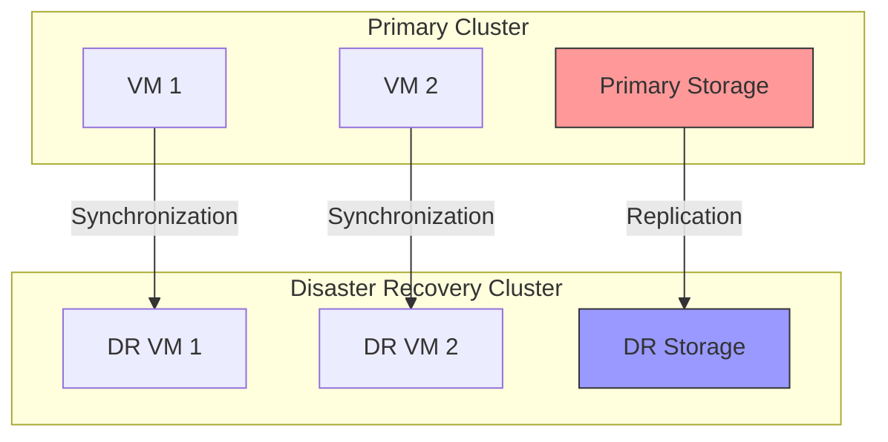

# Use Case: Disaster Recovery

## Business Context

Disaster recovery is a crucial aspect of business continuity, ensuring that workloads can be swiftly restored following catastrophic events. This use case outlines strategies and tools for implementing effective disaster recovery plans within the RH OVE ecosystem.

## Technical Requirements

### Infrastructure Requirements
- OpenShift 4.12+ clusters with multi-cluster management enabled
- Cross-cluster networking with VPN or direct connectivity
- Data replication and backup solutions
- Disaster recovery orchestration tools (Red Hat Advanced Cluster Management - RHACM)

### Resource Requirements
- **Compute**: Sufficient capacity on recovery clusters
- **Storage**: Redundant storage solutions with replication
- **Network**: Reliable, high-speed connections between primary and secondary sites

## Architecture Overview



## Implementation Steps

### Step 1: Plan and Prepare

#### Define Disaster Recovery Objectives
- Identify RTO (Recovery Time Objective) and RPO (Recovery Point Objective)

#### Inventory Assessment
- Document existing resources and dependencies

### Step 2: Configure Data Replication

#### Persistent Storage Replication
- Configure synchronous or asynchronous replication between primary and DR sites.

```yaml
apiVersion: apps/v1
kind: StatefulSet
metadata:
  name: dr-replication-demo
  namespace: storage-replication
spec:
  selector:
    matchLabels:
      app: replication
  serviceName: "replication"
  replicas: 2
  template:
    metadata:
      labels:
        app: replication
    spec:
      containers:
      - name: replication-agent
        image: replication-agent:latest
        args:
        - --source-pvc
        - source-storage-pvc
        - --target-pvc
        - target-storage-pvc
```

### Step 3: Implement Cross-Cluster Networking

#### VPN Configuration for Cluster Connectivity
- Set up VPN tunnels or configure direct connectivity between cluster sites.

### Step 4: Deploy DR Orchestration Tools

#### RHACM Configuration
- Deploy Red Hat Advanced Cluster Management for cluster failover management.

```yaml
apiVersion: cluster.open-cluster-management.io/v1
kind: ManagedCluster
metadata:
  name: disaster-recovery-cluster
spec:
  hubAcceptsClient: true
  managedClusterClientConfigs:
  - url: https://api.dr-cluster.example.com:6443
```

### Step 5: Automate Failover and Recovery

#### Failover Scripts and Automation
- Develop scripts to automate the failover process based on RHACM policies.

```bash
#!/bin/bash
# Failover script for disaster recovery activation

# Scale down primary workloads
kubectl scale deployment --all --replicas=0 -n primary-workloads

# Scale up DR workloads
kubectl scale deployment --all --replicas=1 -n disaster-recovery-workloads

# Update DNS settings
update-dns --zone=example.com --record=*.example.com --new-ip=dr-cluster-ip
```

### Step 6: Testing and Validation

#### Disaster Recovery Drills
- Conduct regular DR drills to test and validate recovery procedures.

```bash
# Trigger disaster recovery drill
run-drill --cluster=disaster-recovery-cluster --scenario=full-cluster-failure
```

## Troubleshooting Guide

### Common Issues and Solutions

#### Replication Lag
- **Issue**: Data replication falls behind
- **Solution**: 
  - Increase network bandwidth
  - Optimize replication frequencies
  - Monitor replication service for bottlenecks

#### Failover Errors
- **Issue**: Failover task errors or delays
- **Solution**:
  - Verify failover scripts and automation procedures
  - Test DNS updates and propagation
  - Check cluster configuration consistency

#### Network Connectivity Issues
- **Issue**: VPN or network interruptions
- **Solution**:
  - Test alternate routes and consider multi-path routing
  - Verify firewall and security group configurations
  - Implement continuous network monitoring

## Best Practices

### Strategy and Planning
- **Comprehensive Planning**: Develop detailed DR plans aligned with business priorities
- **Periodic Reviews**: Regularly review DR strategies and update based on changes in infrastructure
- **Stakeholder Engagement**: Involve all relevant stakeholders in DR planning and testing

### Technology and Tools
- **Automation**: Leverage automation for failover processes to minimize human error
- **Monitoring and Alerts**: Implement monitoring and alerting for quick detection of failures
- **Compliance and Auditing**: Ensure DR plans meet compliance and regulatory requirements

## Integration with RH OVE Ecosystem

### Multi-Cluster Management
- Use RHACM for managing multiple clusters, facilitating disaster recovery coordination

### Environmental Parity
- Ensure consistency in configurations between primary and secondary environments

This guide provides the steps and best practices necessary to establish robust disaster recovery systems within the RH OVE ecosystem, ensuring business continuity and data availability even in the event of a major failure or disaster.
