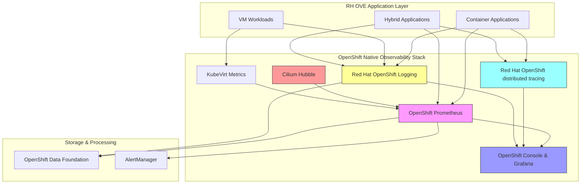
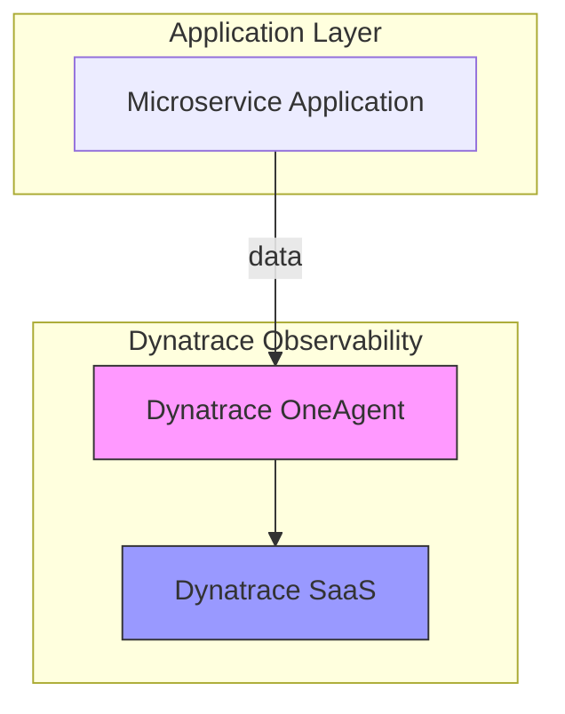

# Use Case: End-to-End Application Observability in RH OVE

## Business Context

In the Red Hat OpenShift Virtualization Engine (RH OVE) ecosystem, comprehensive observability is essential for monitoring both containerized applications and virtual machines, understanding performance bottlenecks, troubleshooting issues, and ensuring optimal resource utilization across hybrid workloads. This use case demonstrates two complementary approaches: native OpenShift observability tools and integration with Dynatrace for enterprise-grade observability.

## What Developers Need to Expose

For effective end-to-end observability, developers must instrument their applications to expose:

### Required Metrics
- **Business Metrics**: Transaction counts, success rates, revenue metrics
- **Application Metrics**: Response times, error rates, throughput
- **Resource Metrics**: CPU, memory, disk I/O, network usage
- **Custom Metrics**: Domain-specific KPIs and performance indicators

### Required Traces
- **Request Traces**: End-to-end request flow across microservices
- **Database Traces**: SQL queries and database connection metrics
- **External Service Traces**: API calls to third-party services
- **Async Operations**: Message queue operations, background jobs

### Required Logs
- **Structured Logs**: JSON formatted with consistent fields
- **Error Logs**: Exception details with stack traces
- **Audit Logs**: Security and compliance events
- **Performance Logs**: Slow queries, long-running operations

### Health Endpoints
- **Liveness Probes**: `/health/live` - Application is running
- **Readiness Probes**: `/health/ready` - Application ready to serve traffic
- **Metrics Endpoint**: `/metrics` - Prometheus-formatted metrics
- **Info Endpoint**: `/info` - Application version and build information

## 1. Native OpenShift Observability

### Infrastructure Requirements
- OpenShift 4.12+ with built-in monitoring stack
- OpenShift Data Foundation for persistent storage
- Red Hat OpenShift Logging (based on Loki)
- Red Hat OpenShift distributed tracing (Jaeger)
- Cilium Hubble for network observability
- KubeVirt monitoring for VM workloads

### Architecture Overview



### Implementation Steps

### Step 1: Enable OpenShift Built-in Monitoring

#### Configure User Workload Monitoring
```yaml
apiVersion: v1
kind: ConfigMap
metadata:
  name: cluster-monitoring-config
  namespace: openshift-monitoring
data:
  config.yaml: |
    enableUserWorkloadMonitoring: true
    prometheusK8s:
      retention: 30d
      volumeClaimTemplate:
        spec:
          storageClassName: ocs-storagecluster-ceph-rbd
          resources:
            requests:
              storage: 100Gi
```

### Step 2: Application Instrumentation for Container Applications

#### Comprehensive Metrics Configuration (Go Example)
```go
package main

import (
    "context"
    "net/http"
    "time"
    
    "github.com/prometheus/client_golang/prometheus"
    "github.com/prometheus/client_golang/prometheus/promauto"
    "github.com/prometheus/client_golang/prometheus/promhttp"
)

var (
    // Business metrics
    httpRequestsTotal = promauto.NewCounterVec(
        prometheus.CounterOpts{
            Name: "myapp_http_requests_total",
            Help: "Total number of HTTP requests by status code and method",
        },
        []string{"method", "status_code", "endpoint"},
    )
    
    // Performance metrics
    httpRequestDuration = promauto.NewHistogramVec(
        prometheus.HistogramOpts{
            Name: "myapp_http_request_duration_seconds",
            Help: "HTTP request duration in seconds",
            Buckets: prometheus.DefBuckets,
        },
        []string{"method", "endpoint"},
    )
    
    // Resource metrics
    activeConnections = promauto.NewGauge(
        prometheus.GaugeOpts{
            Name: "myapp_active_connections",
            Help: "Number of active connections",
        },
    )
    
    // Custom business metrics
    ordersProcessed = promauto.NewCounterVec(
        prometheus.CounterOpts{
            Name: "myapp_orders_processed_total",
            Help: "Total number of orders processed",
        },
        []string{"status"},
    )
)

func instrumentHandler(next http.HandlerFunc, endpoint string) http.HandlerFunc {
    return http.HandlerFunc(func(w http.ResponseWriter, r *http.Request) {
        start := time.Now()
        
        // Process request
        next.ServeHTTP(w, r)
        
        // Record metrics
        duration := time.Since(start).Seconds()
        httpRequestDuration.WithLabelValues(r.Method, endpoint).Observe(duration)
        httpRequestsTotal.WithLabelValues(r.Method, "200", endpoint).Inc()
    })
}

func main() {
    // Health endpoints
    http.HandleFunc("/health/live", func(w http.ResponseWriter, r *http.Request) {
        w.WriteHeader(http.StatusOK)
        w.Write([]byte("alive"))
    })
    
    http.HandleFunc("/health/ready", func(w http.ResponseWriter, r *http.Request) {
        // Check dependencies (DB, external services)
        w.WriteHeader(http.StatusOK)
        w.Write([]byte("ready"))
    })
    
    // Metrics endpoint
    http.Handle("/metrics", promhttp.Handler())
    
    // Business endpoints with instrumentation
    http.HandleFunc("/api/orders", instrumentHandler(ordersHandler, "/api/orders"))
    
    http.ListenAndServe(":8080", nil)
}
```

#### Distributed Tracing Configuration (Node.js Example)
```javascript
const { NodeSDK } = require('@opentelemetry/auto-instrumentations-node');
const { JaegerExporter } = require('@opentelemetry/exporter-jaeger');
const { Resource } = require('@opentelemetry/resources');
const { SemanticResourceAttributes } = require('@opentelemetry/semantic-conventions');

// Configure Jaeger exporter for OpenShift distributed tracing
const jaegerExporter = new JaegerExporter({
  endpoint: 'http://jaeger-collector.openshift-distributed-tracing-system.svc.cluster.local:14268/api/traces',
});

// Initialize OpenTelemetry SDK
const sdk = new NodeSDK({
  resource: new Resource({
    [SemanticResourceAttributes.SERVICE_NAME]: 'myapp-service',
    [SemanticResourceAttributes.SERVICE_VERSION]: process.env.APP_VERSION || '1.0.0',
    [SemanticResourceAttributes.DEPLOYMENT_ENVIRONMENT]: process.env.NODE_ENV || 'development',
  }),
  traceExporter: jaegerExporter,
});

sdk.start();

const express = require('express');
const { trace, context } = require('@opentelemetry/api');
const app = express();

// Custom tracing for business operations
app.get('/api/orders/:id', async (req, res) => {
  const tracer = trace.getTracer('myapp');
  
  await tracer.startActiveSpan('process_order', async (span) => {
    try {
      // Add custom attributes
      span.setAttributes({
        'order.id': req.params.id,
        'user.id': req.headers['user-id'],
        'operation.type': 'order_processing'
      });
      
      // Simulate database call with tracing
      await tracer.startActiveSpan('database_query', async (dbSpan) => {
        // Database operation
        dbSpan.setAttributes({
          'db.operation': 'SELECT',
          'db.table': 'orders'
        });
        dbSpan.end();
      });
      
      // Simulate external API call
      await tracer.startActiveSpan('external_api_call', async (apiSpan) => {
        apiSpan.setAttributes({
          'http.method': 'POST',
          'http.url': 'https://payment-service/process'
        });
        apiSpan.end();
      });
      
      res.json({ orderId: req.params.id, status: 'processed' });
    } catch (error) {
      span.recordException(error);
      span.setStatus({ code: trace.SpanStatusCode.ERROR, message: error.message });
      res.status(500).json({ error: 'Processing failed' });
    } finally {
      span.end();
    }
  });
});
```

#### Structured Logging Configuration
```python
# Python example with structured logging for OpenShift Logging
import logging
import json
import sys
from datetime import datetime

class StructuredLogger:
    def __init__(self, service_name):
        self.service_name = service_name
        self.logger = logging.getLogger(service_name)
        self.logger.setLevel(logging.INFO)
        
        # Configure JSON formatter for OpenShift Logging
        handler = logging.StreamHandler(sys.stdout)
        handler.setFormatter(self.JsonFormatter())
        self.logger.addHandler(handler)
    
    class JsonFormatter(logging.Formatter):
        def format(self, record):
            log_entry = {
                'timestamp': datetime.utcnow().isoformat() + 'Z',
                'level': record.levelname,
                'service': record.name,
                'message': record.getMessage(),
            }
            
            # Add custom fields if present
            if hasattr(record, 'user_id'):
                log_entry['user_id'] = record.user_id
            if hasattr(record, 'trace_id'):
                log_entry['trace_id'] = record.trace_id
            if hasattr(record, 'span_id'):
                log_entry['span_id'] = record.span_id
                
            return json.dumps(log_entry)
    
    def info(self, message, **kwargs):
        extra = {k: v for k, v in kwargs.items()}
        self.logger.info(message, extra=extra)
    
    def error(self, message, **kwargs):
        extra = {k: v for k, v in kwargs.items()}
        self.logger.error(message, extra=extra)

# Usage in application
logger = StructuredLogger('myapp-service')

def process_order(order_id, user_id):
    logger.info(
        "Processing order",
        user_id=user_id,
        order_id=order_id,
        operation='order_processing'
    )
    
    try:
        # Business logic
        result = do_business_logic()
        logger.info(
            "Order processed successfully",
            user_id=user_id,
            order_id=order_id,
            result=result
        )
    except Exception as e:
        logger.error(
            "Order processing failed",
            user_id=user_id,
            order_id=order_id,
            error=str(e),
            stack_trace=traceback.format_exc()
        )
        raise
```

### Step 3: Configure OpenShift Native Observability Components

#### Enable Red Hat OpenShift Logging
```yaml
apiVersion: logging.coreos.com/v1
kind: ClusterLogging
metadata:
  name: instance
  namespace: openshift-logging
spec:
  managementState: Managed
  logStore:
    type: lokistack
    lokistack:
      name: logging-loki
  collection:
    type: vector
    vector:
      resources:
        limits:
          memory: 1Gi
        requests:
          memory: 512Mi
  visualization:
    type: ocp-console
---
apiVersion: loki.grafana.com/v1
kind: LokiStack
metadata:
  name: logging-loki
  namespace: openshift-logging
spec:
  size: 1x.small
  storage:
    schemas:
    - version: v12
      effectiveDate: '2022-06-01'
    secret:
      name: logging-loki-s3
      type: s3
  storageClassName: ocs-storagecluster-ceph-rbd
  tenants:
    mode: openshift-logging
```

#### Deploy Red Hat OpenShift distributed tracing
```yaml
apiVersion: jaegertracing.io/v1
kind: Jaeger
metadata:
  name: jaeger-production
  namespace: openshift-distributed-tracing-system
spec:
  strategy: production
  storage:
    type: elasticsearch
    elasticsearch:
      nodeCount: 3
      storage:
        storageClassName: ocs-storagecluster-ceph-rbd
        size: 100Gi
      resources:
        requests:
          memory: 4Gi
          cpu: 1
        limits:
          memory: 4Gi
          cpu: 1
```

### Step 4: Configure Application Monitoring

#### ServiceMonitor for Application Metrics
```yaml
apiVersion: monitoring.coreos.com/v1
kind: ServiceMonitor
metadata:
  name: myapp-metrics
  namespace: myapp-namespace
  labels:
    app: myapp
spec:
  selector:
    matchLabels:
      app: myapp
  endpoints:
  - port: metrics
    interval: 30s
    path: /metrics
    honorLabels: true
---
apiVersion: v1
kind: Service
metadata:
  name: myapp-metrics
  namespace: myapp-namespace
  labels:
    app: myapp
spec:
  ports:
  - name: metrics
    port: 8080
    targetPort: 8080
  selector:
    app: myapp
```

#### PrometheusRule for Custom Alerts
```yaml
apiVersion: monitoring.coreos.com/v1
kind: PrometheusRule
metadata:
  name: myapp-alerts
  namespace: myapp-namespace
spec:
  groups:
  - name: myapp.rules
    rules:
    - alert: MyAppHighErrorRate
      expr: |
        (
          sum(rate(myapp_http_requests_total{status_code=~"5.."}[5m]))
          /
          sum(rate(myapp_http_requests_total[5m]))
        ) > 0.05
      for: 5m
      labels:
        severity: warning
      annotations:
        summary: "High error rate detected in MyApp"
        description: "Error rate is {{ $value | humanizePercentage }} for the last 5 minutes"
    
    - alert: MyAppHighLatency
      expr: |
        histogram_quantile(0.95, 
          sum(rate(myapp_http_request_duration_seconds_bucket[5m])) by (le)
        ) > 1.0
      for: 5m
      labels:
        severity: warning
      annotations:
        summary: "High latency detected in MyApp"
        description: "95th percentile latency is {{ $value }}s"
    
    - alert: MyAppPodCrashLooping
      expr: rate(kube_pod_container_status_restarts_total{namespace="myapp-namespace"}[15m]) > 0
      for: 5m
      labels:
        severity: critical
      annotations:
        summary: "MyApp pod is crash looping"
        description: "Pod {{ $labels.pod }} is restarting frequently"
```

### Step 5: VM Workload Monitoring

#### KubeVirt VM Monitoring
```yaml
apiVersion: monitoring.coreos.com/v1
kind: ServiceMonitor
metadata:
  name: kubevirt-vm-metrics
  namespace: kubevirt-system
spec:
  selector:
    matchLabels:
      prometheus.kubevirt.io: "true"
  endpoints:
  - port: metrics
    interval: 30s
    honorLabels: true
---
# VM-specific PrometheusRule
apiVersion: monitoring.coreos.com/v1
kind: PrometheusRule
metadata:
  name: vm-alerts
  namespace: vm-workloads
spec:
  groups:
  - name: vm.rules
    rules:
    - alert: VMHighCPUUsage
      expr: kubevirt_vmi_vcpu_seconds_total > 0.8
      for: 10m
      labels:
        severity: warning
      annotations:
        summary: "VM {{ $labels.name }} has high CPU usage"
    
    - alert: VMHighMemoryUsage
      expr: |
        (
          kubevirt_vmi_memory_resident_bytes
          /
          kubevirt_vmi_memory_maximum_bytes
        ) > 0.9
      for: 5m
      labels:
        severity: critical
      annotations:
        summary: "VM {{ $labels.name }} has high memory usage"
```

### Step 6: Network Observability with Cilium Hubble

#### Enable Cilium Hubble
```yaml
apiVersion: cilium.io/v2alpha1
kind: CiliumConfig
metadata:
  name: cilium-config
  namespace: cilium-system
spec:
  hubble:
    enabled: true
    metrics:
      enabled:
      - dns:query;ignoreAAAA
      - drop
      - tcp
      - flow
      - icmp
      - http
    relay:
      enabled: true
    ui:
      enabled: true
```

### Best Practices for Native Observability

- **Consistent Labeling**: Use standardized labels across all metrics (service, version, environment)
- **Cardinality Management**: Avoid high-cardinality labels that can overwhelm Prometheus
- **Sampling Strategy**: Implement trace sampling for high-traffic applications (1-10% sample rate)
- **Log Levels**: Use appropriate log levels and structured logging with consistent fields
- **Resource Limits**: Set appropriate resource limits for observability components
- **Retention Policies**: Configure appropriate retention for metrics (30d) and logs (7d for debug, 30d for info/error)
- **Alert Fatigue**: Create meaningful alerts with proper thresholds and runbooks

### 2. Observability with Dynatrace

## Infrastructure Requirements

- Dynatrace OneAgent deployed on OpenShift nodes
- Dynatrace SaaS or Managed account
- Network access to Dynatrace monitoring endpoints

## Architecture Overview



## Implementation Steps

### Step 1: Deploy Dynatrace OneAgent

- Use Dynatrace Operator for OpenShift to deploy OneAgent.

```yaml
apiVersion: dynatrace.com/v1alpha1
kind: Dynakube
metadata:
  name: dynakube
  namespace: dynatrace
spec:
  oneAgent:
    classicFullStack: true
  apiUrl: "https://<environment-id>.live.dynatrace.com/api"
  tokens: "api-token"
```

### Step 2: Application Configuration

- No changes required for application code, as OneAgent will automatically instrument all services.

### Step 3: Monitor and Analyze

- Use Dynatrace dashboards for comprehensive observability and performance analysis.
- Implement AI-driven alerts for proactive issue detection.

### Best Practices

- **Ensure Network Connectivity**: Verify network connectivity to Dynatrace endpoints.
- **Optimize Resource Allocation**: Ensure sufficient resources for OneAgent processing.
- **Leverage Dynatrace AI**: Utilize Dynatrace's AI capabilities for automated root cause analysis.


This comprehensive guide provides both native and third-party observability solutions, enabling holistic insights into application performance and behavior within the RH OVE ecosystem.
