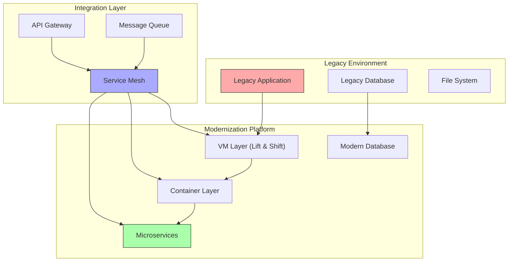

# Use Case: Legacy Application Modernization

## Business Context

Legacy application modernization is critical for organizations looking to leverage modern cloud-native technologies while preserving existing business logic and data. This use case demonstrates a phased approach to modernizing legacy applications using the RH OVE ecosystem, enabling gradual transformation with minimal business disruption.

## Technical Requirements

### Infrastructure Requirements
- OpenShift 4.12+ with KubeVirt enabled
- Application migration tools (Migration Toolkit for Applications - MTA)
- Service mesh for hybrid connectivity (OpenShift Service Mesh/Istio)
- CI/CD pipelines (OpenShift Pipelines/Tekton)
- Container registry (Quay.io or OpenShift integrated registry)

### Resource Requirements
- **Compute**: Sufficient resources for both legacy and modernized components during transition
- **Storage**: Persistent storage for data migration and synchronization
- **Network**: High-bandwidth connectivity for data replication and service communication

## Architecture Overview



## Implementation Steps

### Phase 1: Assessment and Planning

#### Application Discovery
```yaml
# MTA Configuration for Application Analysis
apiVersion: tackle.konveyor.io/v1alpha1
kind: Application
metadata:
  name: legacy-app-analysis
  namespace: konveyor-tackle
spec:
  name: "Legacy ERP System"
  description: "Monolithic ERP application requiring modernization"
  repository:
    kind: git
    url: "https://git.example.com/legacy-erp"
  binary: "erp-application.war"
```

#### Migration Assessment
```bash
# Run application analysis using MTA CLI
konveyor-cli analyze \
  --input /path/to/legacy-app \
  --output /path/to/analysis-results \
  --target cloud-readiness \
  --target containers
```

### Phase 2: Lift and Shift (VM Migration)

#### VM-based Legacy Application Deployment
```yaml
apiVersion: kubevirt.io/v1
kind: VirtualMachine
metadata:
  name: legacy-erp-vm
  namespace: modernization
spec:
  running: true
  template:
    metadata:
      labels:
        app: legacy-erp
        tier: application
        phase: lift-shift
    spec:
      domain:
        cpu:
          cores: 4
        devices:
          disks:
          - disk:
              bus: virtio
            name: rootdisk
          - disk:
              bus: virtio
            name: datadisk
          interfaces:
          - name: default
            bridge: {}
        memory:
          guest: 8Gi
        resources:
          requests:
            memory: 8Gi
            cpu: 4
      networks:
      - name: default
        pod: {}
      volumes:
      - dataVolume:
          name: legacy-erp-root
        name: rootdisk
      - dataVolume:
          name: legacy-erp-data
        name: datadisk
---
apiVersion: cdi.kubevirt.io/v1beta1
kind: DataVolume
metadata:
  name: legacy-erp-root
  namespace: modernization
spec:
  source:
    http:
      url: "https://vm-images.example.com/legacy-erp-root.img"
  pvc:
    accessModes:
    - ReadWriteOnce
    resources:
      requests:
        storage: 100Gi
---
apiVersion: cdi.kubevirt.io/v1beta1
kind: DataVolume
metadata:
  name: legacy-erp-data
  namespace: modernization
spec:
  source:
    http:
      url: "https://vm-images.example.com/legacy-erp-data.img"
  pvc:
    accessModes:
    - ReadWriteOnce
    resources:
      requests:
        storage: 500Gi
```

### Phase 3: Containerization

#### Legacy Application Container Deployment
```yaml
apiVersion: apps/v1
kind: Deployment
metadata:
  name: legacy-erp-container
  namespace: modernization
spec:
  replicas: 2
  selector:
    matchLabels:
      app: legacy-erp
      tier: application
      phase: containerized
  template:
    metadata:
      labels:
        app: legacy-erp
        tier: application
        phase: containerized
    spec:
      containers:
      - name: erp-app
        image: quay.io/example/legacy-erp:containerized
        ports:
        - containerPort: 8080
          name: http
        - containerPort: 8443
          name: https
        env:
        - name: DB_HOST
          value: "legacy-database-service"
        - name: DB_PORT
          value: "5432"
        - name: DB_NAME
          valueFrom:
            secretKeyRef:
              name: db-credentials
              key: database
        - name: DB_USER
          valueFrom:
            secretKeyRef:
              name: db-credentials
              key: username
        - name: DB_PASSWORD
          valueFrom:
            secretKeyRef:
              name: db-credentials
              key: password
        volumeMounts:
        - name: app-data
          mountPath: /opt/erp/data
        - name: app-config
          mountPath: /opt/erp/config
      volumes:
      - name: app-data
        persistentVolumeClaim:
          claimName: erp-data-pvc
      - name: app-config
        configMap:
          name: erp-config
```

### Phase 4: Service Decomposition

#### Extract User Management Service
```yaml
apiVersion: apps/v1
kind: Deployment
metadata:
  name: user-management-service
  namespace: modernization
spec:
  replicas: 3
  selector:
    matchLabels:
      app: user-management
      tier: microservice
  template:
    metadata:
      labels:
        app: user-management
        tier: microservice
        version: v1
    spec:
      containers:
      - name: user-management
        image: quay.io/example/user-management:v1.0.0
        ports:
        - containerPort: 8080
          name: http
        env:
        - name: DATABASE_URL
          valueFrom:
            secretKeyRef:
              name: user-db-credentials
              key: url
        - name: REDIS_URL
          valueFrom:
            secretKeyRef:
              name: redis-credentials
              key: url
        livenessProbe:
          httpGet:
            path: /health
            port: 8080
          initialDelaySeconds: 30
          periodSeconds: 10
        readinessProbe:
          httpGet:
            path: /ready
            port: 8080
          initialDelaySeconds: 5
          periodSeconds: 5
---
apiVersion: v1
kind: Service
metadata:
  name: user-management-service
  namespace: modernization
spec:
  selector:
    app: user-management
  ports:
  - name: http
    port: 80
    targetPort: 8080
  type: ClusterIP
```

### Phase 5: Service Mesh Integration

#### Istio Service Mesh Configuration
```yaml
apiVersion: networking.istio.io/v1beta1
kind: VirtualService
metadata:
  name: legacy-erp-routing
  namespace: modernization
spec:
  hosts:
  - erp.example.com
  http:
  - match:
    - uri:
        prefix: /api/users
    route:
    - destination:
        host: user-management-service
        port:
          number: 80
      weight: 100
  - match:
    - uri:
        prefix: /
    route:
    - destination:
        host: legacy-erp-container
        port:
          number: 8080
      weight: 90
    - destination:
        host: legacy-erp-vm
        port:
          number: 8080
      weight: 10
---
apiVersion: networking.istio.io/v1beta1
kind: DestinationRule
metadata:
  name: legacy-erp-destination
  namespace: modernization
spec:
  host: legacy-erp-container
  trafficPolicy:
    circuitBreaker:
      consecutive5xxErrors: 3
      interval: 30s
      baseEjectionTime: 30s
```

### Phase 6: Data Migration Strategy

#### Database Migration Pipeline
```yaml
apiVersion: tekton.dev/v1beta1
kind: Pipeline
metadata:
  name: data-migration-pipeline
  namespace: modernization
spec:
  params:
  - name: source-db-url
    description: Source database connection URL
  - name: target-db-url
    description: Target database connection URL
  - name: migration-batch-size
    default: "1000"
    description: Number of records to migrate per batch
  
  tasks:
  - name: validate-source
    taskRef:
      name: database-validation
    params:
    - name: db-url
      value: $(params.source-db-url)
  
  - name: create-target-schema
    taskRef:
      name: schema-creation
    params:
    - name: db-url
      value: $(params.target-db-url)
    runAfter:
    - validate-source
  
  - name: migrate-data
    taskRef:
      name: data-migration
    params:
    - name: source-db-url
      value: $(params.source-db-url)
    - name: target-db-url
      value: $(params.target-db-url)
    - name: batch-size
      value: $(params.migration-batch-size)
    runAfter:
    - create-target-schema
  
  - name: validate-migration
    taskRef:
      name: migration-validation
    params:
    - name: source-db-url
      value: $(params.source-db-url)
    - name: target-db-url
      value: $(params.target-db-url)
    runAfter:
    - migrate-data
```

### Phase 7: Progressive Traffic Migration

#### Canary Deployment Strategy
```yaml
apiVersion: argoproj.io/v1alpha1
kind: Rollout
metadata:
  name: legacy-erp-rollout
  namespace: modernization
spec:
  replicas: 5
  strategy:
    canary:
      steps:
      - setWeight: 10
      - pause: {duration: 300s}
      - setWeight: 25
      - pause: {duration: 300s}
      - setWeight: 50
      - pause: {duration: 300s}
      - setWeight: 75
      - pause: {duration: 300s}
      canaryService: legacy-erp-canary
      stableService: legacy-erp-stable
      trafficRouting:
        istio:
          virtualService:
            name: legacy-erp-routing
            routes:
            - primary
  selector:
    matchLabels:
      app: legacy-erp
  template:
    metadata:
      labels:
        app: legacy-erp
    spec:
      containers:
      - name: erp-app
        image: quay.io/example/legacy-erp:modernized
        ports:
        - containerPort: 8080
```

## Monitoring and Observability

### Application Performance Monitoring
```yaml
apiVersion: monitoring.coreos.com/v1
kind: ServiceMonitor
metadata:
  name: modernization-monitoring
  namespace: modernization
spec:
  selector:
    matchLabels:
      monitoring: enabled
  endpoints:
  - port: metrics
    interval: 30s
    path: /metrics
---
apiVersion: monitoring.coreos.com/v1
kind: PrometheusRule
metadata:
  name: modernization-alerts
  namespace: modernization
spec:
  groups:
  - name: modernization.alerts
    rules:
    - alert: LegacyAppHighErrorRate
      expr: rate(http_requests_total{status=~"5.."}[5m]) > 0.1
      for: 5m
      labels:
        severity: warning
      annotations:
        summary: "High error rate in legacy application"
    
    - alert: MigrationDataInconsistency
      expr: migration_data_consistency_check != 1
      for: 1m
      labels:
        severity: critical
      annotations:
        summary: "Data inconsistency detected during migration"
```

## Troubleshooting Guide

### Common Issues and Solutions

#### Performance Degradation During Migration
- **Issue**: Application performance degrades during data migration
- **Solution**: 
  - Implement read replicas for database queries
  - Use incremental migration strategies
  - Schedule heavy migration tasks during off-peak hours

#### Service Communication Failures
- **Issue**: Communication failures between legacy and modern components
- **Solution**:
  - Verify service mesh configuration
  - Check network policies and firewall rules
  - Implement circuit breakers and retry mechanisms

#### Data Consistency Issues
- **Issue**: Data inconsistencies between old and new systems
- **Solution**:
  - Implement two-phase commit protocols
  - Use event sourcing for critical operations
  - Regular data validation and reconciliation

## Best Practices

### Migration Strategy
- **Incremental Approach**: Migrate functionality incrementally to reduce risk
- **Feature Toggles**: Use feature flags to control rollout of new functionality
- **Rollback Plans**: Always have rollback procedures for each migration phase

### Testing and Validation
- **Automated Testing**: Implement comprehensive test suites for both legacy and modern components
- **Performance Testing**: Conduct load testing throughout the migration process
- **Data Validation**: Implement automated data consistency checks

### Security Considerations
- **Zero-Trust Architecture**: Implement zero-trust principles across all components
- **Secrets Management**: Use proper secrets management for database credentials and API keys
- **Network Segmentation**: Implement proper network segmentation between components

## Integration with RH OVE Ecosystem

### GitOps Integration
```yaml
apiVersion: argoproj.io/v1alpha1
kind: Application
metadata:
  name: legacy-modernization
  namespace: argocd
spec:
  project: modernization
  source:
    repoURL: https://git.example.com/legacy-modernization-config
    targetRevision: HEAD
    path: environments/production
  destination:
    server: https://kubernetes.default.svc
    namespace: modernization
  syncPolicy:
    automated:
      prune: false
      selfHeal: true
    syncOptions:
    - CreateNamespace=true
```

### Multi-Cluster Deployment
- **Staging Environment**: Use separate clusters for testing and validation
- **Production Rollout**: Implement blue-green deployment across clusters
- **Disaster Recovery**: Maintain legacy systems as backup during transition

This comprehensive guide provides a structured approach to legacy application modernization within the RH OVE ecosystem, enabling organizations to gradually transform their applications while maintaining business continuity and reducing risk.
