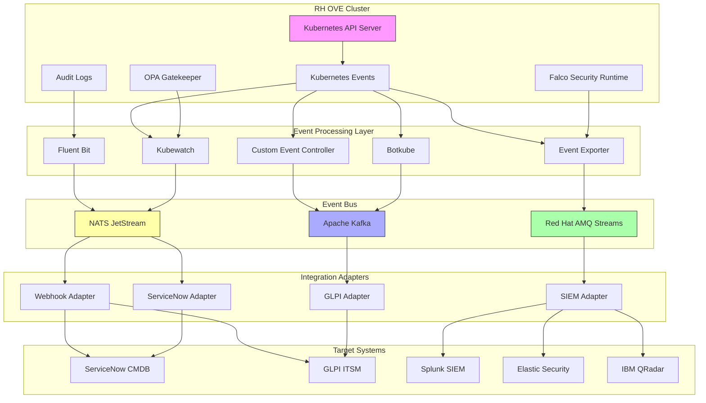

# Use Case: Publishing Kubernetes Events to CMDB and SIEM Solutions

## Business Context

Enterprise IT environments require robust integration between Kubernetes events and existing IT service management and security incident management platforms. Integrating Kubernetes events with CMDB (such as ServiceNow or GLPI) and SIEM solutions enhances visibility, compliance, and proactive issue resolution. This use case focuses on using an event-bus to publish infrastructure changes, security issues, and admission control issues from Kubernetes to these platforms.

## Technical Requirements

### Infrastructure Requirements
- OpenShift 4.12+ cluster with event capture capabilities
- Event-bus solution such as NATS, Kafka, or RabbitMQ
- Connectivity to CMDB (e.g., ServiceNow, GLPI) and SIEM solutions
- Persistent storage for event retention and replay

### Resource Requirements
- **CPU**: Adequate resources for handling and processing events
- **Memory**: Sufficient memory for event processing and transformation
- **Storage**: Persistent storage for event logs and audit trails
- **Network**: Reliable connectivity to external platforms

## Event Categories and Sources

### Infrastructure Change Events
- **Node Events**: Node ready/not ready, resource pressure, kubelet issues
- **Pod Events**: Pod scheduling, image pulling, container creation/termination
- **Storage Events**: Volume mounting/unmounting, PVC binding issues
- **Network Events**: Service endpoint changes, ingress controller updates
- **Resource Events**: Deployment scaling, ConfigMap/Secret updates

### Security Events
- **RBAC Violations**: Unauthorized access attempts, permission denials
- **Pod Security Policy Violations**: SecurityContext violations, privileged access attempts
- **Image Security Events**: Image scanning failures, vulnerable image deployments
- **Network Policy Violations**: Blocked network connections, policy enforcement
- **Certificate Events**: TLS certificate expiration, rotation failures

### Admission Control Events
- **ValidatingAdmissionWebhook**: Policy violations, validation failures
- **MutatingAdmissionWebhook**: Resource mutations, injection failures
- **Resource Quota Violations**: Quota exceeded, resource limit breaches
- **LimitRange Violations**: Container resource limit violations

## Architecture Overview



## Implementation Steps

### Step 1: Deploy Event Bus Solution

#### Deploy NATS Streaming
```yaml
apiVersion: apps/v1
kind: Deployment
metadata:
  name: nats-streaming
  namespace: event-bus
spec:
  replicas: 3
  selector:
    matchLabels:
      app: nats-streaming
  template:
    metadata:
      labels:
        app: nats-streaming
    spec:
      containers:
      - name: nats
        image: nats-streaming:latest
        ports:
        - containerPort: 4222
        - containerPort: 8222
        resources:
          limits:
            memory: 512Mi
            cpu: 0.5
          requests:
            memory: 256Mi
            cpu: 0.25
```

### Step 2: Configure Event Processing Solutions

#### Option 1: Deploy Kubewatch for Event Monitoring

Kubewatch is a Kubernetes watcher that publishes notifications to various channels.

```yaml
apiVersion: apps/v1
kind: Deployment
metadata:
  name: kubewatch
  namespace: event-processing
spec:
  replicas: 1
  selector:
    matchLabels:
      app: kubewatch
  template:
    metadata:
      labels:
        app: kubewatch
    spec:
      serviceAccountName: kubewatch
      containers:
      - name: kubewatch
        image: bitnami/kubewatch:latest
        env:
        - name: KW_CONFIG
          value: /config/kubewatch-config.yaml
        volumeMounts:
        - name: config
          mountPath: /config
        resources:
          limits:
            memory: 256Mi
            cpu: 100m
          requests:
            memory: 128Mi
            cpu: 50m
      volumes:
      - name: config
        configMap:
          name: kubewatch-config
---
apiVersion: v1
kind: ConfigMap
metadata:
  name: kubewatch-config
  namespace: event-processing
data:
  kubewatch-config.yaml: |
    namespace: ""
    handler:
      webhook:
        url: "http://event-router.event-processing.svc.cluster.local:8080/webhook"
    resource:
      deployment: true
      replicationcontroller: false
      replicaset: false
      daemonset: true
      services: true
      pod: true
      job: true
      node: true
      clusterrole: false
      serviceaccount: false
      persistentvolume: true
      namespace: true
      secret: false
      configmap: false
      ingress: true
      event: true
---
apiVersion: v1
kind: ServiceAccount
metadata:
  name: kubewatch
  namespace: event-processing
---
apiVersion: rbac.authorization.k8s.io/v1
kind: ClusterRole
metadata:
  name: kubewatch
rules:
- apiGroups: [""]
  resources: ["pods", "nodes", "namespaces", "events", "services", "persistentvolumes"]
  verbs: ["list", "watch", "get"]
- apiGroups: ["apps"]
  resources: ["deployments", "daemonsets", "replicasets"]
  verbs: ["list", "watch", "get"]
- apiGroups: ["extensions"]
  resources: ["ingresses"]
  verbs: ["list", "watch", "get"]
- apiGroups: ["batch"]
  resources: ["jobs"]
  verbs: ["list", "watch", "get"]
---
apiVersion: rbac.authorization.k8s.io/v1
kind: ClusterRoleBinding
metadata:
  name: kubewatch
roleRef:
  apiGroup: rbac.authorization.k8s.io
  kind: ClusterRole
  name: kubewatch
subjects:
- kind: ServiceAccount
  name: kubewatch
  namespace: event-processing
```

#### Option 2: Deploy Botkube for Advanced Event Processing

Botkube provides intelligent event filtering and routing capabilities.

```yaml
apiVersion: v1
kind: ConfigMap
metadata:
  name: botkube-config
  namespace: event-processing
data:
  config.yaml: |
    settings:
      clustername: "rh-ove-cluster"
      kubectl:
        enabled: false
      configwatcher: true
      upgradenotifier: true
    
    communications:
      webhook:
        enabled: true
        url: "http://event-router.event-processing.svc.cluster.local:8080/botkube"
        
    resources:
    - name: "v1/pods"
      namespaces:
        include:
        - "default"
        - "kube-system"
        - "openshift-*"
      events:
      - create
      - delete
      - error
      updateSetting:
        includeDiff: true
        fields:
        - "spec.containers[*].image"
        - "status.phase"
        
    - name: "v1/services"
      namespaces:
        include:
        - "default"
      events:
      - create
      - delete
      - error
      
    - name: "v1/nodes"
      events:
      - create
      - delete
      - error
      
    - name: "v1/events"
      events:
      - error
      - warning
      filters:
        objectAnnotations:
          pattern: ".*"
        reason:
        - "FailedScheduling"
        - "Unhealthy"
        - "FailedMount"
        - "NetworkNotReady"
        - "NodeNotReady"
        - "Rebooted"
        - "SystemOOM"
---
apiVersion: apps/v1
kind: Deployment
metadata:
  name: botkube
  namespace: event-processing
spec:
  replicas: 1
  selector:
    matchLabels:
      app: botkube
  template:
    metadata:
      labels:
        app: botkube
    spec:
      serviceAccountName: botkube
      containers:
      - name: botkube
        image: infracloudio/botkube:latest
        env:
        - name: CONFIG_PATH
          value: "/tmp/config/"
        - name: LOG_LEVEL
          value: "info"
        volumeMounts:
        - name: config
          mountPath: "/tmp/config"
        resources:
          limits:
            memory: 256Mi
            cpu: 100m
          requests:
            memory: 128Mi
            cpu: 50m
      volumes:
      - name: config
        configMap:
          name: botkube-config
---
apiVersion: v1
kind: ServiceAccount
metadata:
  name: botkube
  namespace: event-processing
---
apiVersion: rbac.authorization.k8s.io/v1
kind: ClusterRole
metadata:
  name: botkube
rules:
- apiGroups: ["*"]
  resources: ["*"]
  verbs: ["get", "watch", "list"]
---
apiVersion: rbac.authorization.k8s.io/v1
kind: ClusterRoleBinding
metadata:
  name: botkube
roleRef:
  apiGroup: rbac.authorization.k8s.io
  kind: ClusterRole
  name: botkube
subjects:
- kind: ServiceAccount
  name: botkube
  namespace: event-processing
```

#### Option 3: Deploy Kubernetes Event Exporter

For more granular control over event processing and routing.

```yaml
apiVersion: apps/v1
kind: Deployment
metadata:
  name: event-exporter
  namespace: event-processing
spec:
  replicas: 1
  selector:
    matchLabels:
      app: event-exporter
  template:
    metadata:
      labels:
        app: event-exporter
    spec:
      serviceAccountName: event-exporter
      containers:
      - name: event-exporter
        image: giantswarm/event-exporter:latest
        args:
        - --config-file=/config/config.yaml
        - --logtostderr
        - --v=2
        volumeMounts:
        - name: config
          mountPath: /config
        resources:
          limits:
            memory: 256Mi
            cpu: 100m
          requests:
            memory: 128Mi
            cpu: 50m
      volumes:
      - name: config
        configMap:
          name: event-exporter-config
---
apiVersion: v1
kind: ConfigMap
metadata:
  name: event-exporter-config
  namespace: event-processing
data:
  config.yaml: |
    logLevel: 2
    logFormat: json
    receivers:
    - name: "webhook-receiver"
      webhook:
        endpoint: "http://event-router.event-processing.svc.cluster.local:8080/events"
        headers:
          X-Source: "kubernetes-events"
          Content-Type: "application/json"
    - name: "kafka-receiver"
      kafka:
        brokers:
        - "kafka.event-bus.svc.cluster.local:9092"
        topic: "kubernetes-events"
    
    route:
      routes:
      # Infrastructure change events
      - match:
        - receiver: "webhook-receiver"
          name: "infrastructure-changes"
        - receiver: "kafka-receiver"
          name: "infrastructure-changes"
        groupBy: ["namespace", "reason"]
        groupWait: 10s
        groupInterval: 30s
        repeatInterval: 1h
        routes:
        - match:
          - field: "reason"
            op: "in"
            values: ["Scheduled", "Pulled", "Created", "Started"]
          name: "pod-lifecycle"
        - match:
          - field: "reason"
            op: "in"
            values: ["NodeReady", "NodeNotReady", "Rebooted"]
          name: "node-events"
        - match:
          - field: "reason"
            op: "in"
            values: ["SuccessfulMount", "FailedMount"]
          name: "storage-events"
      
      # Security events
      - match:
        - receiver: "webhook-receiver"
          name: "security-events"
        groupBy: ["namespace", "reason", "involvedObject.kind"]
        routes:
        - match:
          - field: "reason"
            op: "in"
            values: ["Forbidden", "Unauthorized", "PolicyViolation"]
          name: "security-violations"
        - match:
          - field: "message"
            op: "re"
            values: [".*security.*", ".*violation.*", ".*denied.*"]
          name: "security-related"
      
      # Admission control events
      - match:
        - receiver: "kafka-receiver"
          name: "admission-control"
        routes:
        - match:
          - field: "reason"
            op: "in"
            values: ["FailedCreate", "AdmissionWebhookDenied"]
          name: "admission-denied"
---
apiVersion: v1
kind: ServiceAccount
metadata:
  name: event-exporter
  namespace: event-processing
---
apiVersion: rbac.authorization.k8s.io/v1
kind: ClusterRole
metadata:
  name: event-exporter
rules:
- apiGroups: [""]
  resources: ["events"]
  verbs: ["get", "watch", "list"]
---
apiVersion: rbac.authorization.k8s.io/v1
kind: ClusterRoleBinding
metadata:
  name: event-exporter
roleRef:
  apiGroup: rbac.authorization.k8s.io
  kind: ClusterRole
  name: event-exporter
subjects:
- kind: ServiceAccount
  name: event-exporter
  namespace: event-processing
```

#### Option 4: Custom Event Controller with Event Router

For maximum flexibility, deploy a custom event router that can transform and route events.

```yaml
apiVersion: apps/v1
kind: Deployment
metadata:
  name: event-router
  namespace: event-processing
spec:
  replicas: 2
  selector:
    matchLabels:
      app: event-router
  template:
    metadata:
      labels:
        app: event-router
    spec:
      containers:
      - name: event-router
        image: quay.io/example/event-router:latest
        ports:
        - containerPort: 8080
        env:
        - name: NATS_URL
          value: "nats://nats.event-bus.svc.cluster.local:4222"
        - name: KAFKA_BROKERS
          value: "kafka.event-bus.svc.cluster.local:9092"
        - name: LOG_LEVEL
          value: "info"
        resources:
          limits:
            memory: 512Mi
            cpu: 200m
          requests:
            memory: 256Mi
            cpu: 100m
        livenessProbe:
          httpGet:
            path: /health
            port: 8080
          initialDelaySeconds: 30
          periodSeconds: 10
        readinessProbe:
          httpGet:
            path: /ready
            port: 8080
          initialDelaySeconds: 5
          periodSeconds: 5
---
apiVersion: v1
kind: Service
metadata:
  name: event-router
  namespace: event-processing
spec:
  selector:
    app: event-router
  ports:
  - name: http
    port: 8080
    targetPort: 8080
  type: ClusterIP
```

### Step 3: Deploy Event Bus Solutions

#### Deploy Red Hat AMQ Streams (Kafka)

```yaml
apiVersion: kafka.strimzi.io/v1beta2
kind: Kafka
metadata:
  name: event-cluster
  namespace: event-bus
spec:
  kafka:
    version: 3.4.0
    replicas: 3
    listeners:
    - name: plain
      port: 9092
      type: internal
      tls: false
    - name: tls
      port: 9093
      type: internal
      tls: true
    config:
      offsets.topic.replication.factor: 3
      transaction.state.log.replication.factor: 3
      transaction.state.log.min.isr: 2
      default.replication.factor: 3
      min.insync.replicas: 2
      inter.broker.protocol.version: "3.4"
      log.retention.hours: 168  # 7 days
      log.segment.bytes: 1073741824  # 1GB
    storage:
      type: persistent-claim
      size: 100Gi
      class: ocs-storagecluster-ceph-rbd
    resources:
      requests:
        memory: 2Gi
        cpu: 500m
      limits:
        memory: 4Gi
        cpu: 1
  zookeeper:
    replicas: 3
    storage:
      type: persistent-claim
      size: 10Gi
      class: ocs-storagecluster-ceph-rbd
    resources:
      requests:
        memory: 1Gi
        cpu: 500m
      limits:
        memory: 2Gi
        cpu: 1
  entityOperator:
    topicOperator: {}
    userOperator: {}
---
apiVersion: kafka.strimzi.io/v1beta2
kind: KafkaTopic
metadata:
  name: kubernetes-events
  namespace: event-bus
  labels:
    strimzi.io/cluster: event-cluster
spec:
  partitions: 12
  replicas: 3
  config:
    retention.ms: 604800000  # 7 days
    segment.ms: 3600000      # 1 hour
---
apiVersion: kafka.strimzi.io/v1beta2
kind: KafkaTopic
metadata:
  name: security-events
  namespace: event-bus
  labels:
    strimzi.io/cluster: event-cluster
spec:
  partitions: 6
  replicas: 3
  config:
    retention.ms: 2592000000  # 30 days
    segment.ms: 3600000       # 1 hour
---
apiVersion: kafka.strimzi.io/v1beta2
kind: KafkaTopic
metadata:
  name: infrastructure-changes
  namespace: event-bus
  labels:
    strimzi.io/cluster: event-cluster
spec:
  partitions: 6
  replicas: 3
  config:
    retention.ms: 1209600000  # 14 days
    segment.ms: 3600000       # 1 hour
```

#### Deploy NATS JetStream

```yaml
apiVersion: apps/v1
kind: StatefulSet
metadata:
  name: nats
  namespace: event-bus
spec:
  serviceName: nats
  replicas: 3
  selector:
    matchLabels:
      app: nats
  template:
    metadata:
      labels:
        app: nats
    spec:
      containers:
      - name: nats
        image: nats:alpine
        ports:
        - containerPort: 4222
          name: client
        - containerPort: 7422
          name: leafnodes
        - containerPort: 6222
          name: cluster
        - containerPort: 8222
          name: monitor
        - containerPort: 7777
          name: metrics
        args:
        - --config
        - /etc/nats-config/nats.conf
        volumeMounts:
        - name: config-volume
          mountPath: /etc/nats-config
        - name: data
          mountPath: /data
        resources:
          requests:
            memory: 512Mi
            cpu: 200m
          limits:
            memory: 1Gi
            cpu: 500m
        livenessProbe:
          httpGet:
            path: /healthz
            port: 8222
          initialDelaySeconds: 10
          timeoutSeconds: 5
        readinessProbe:
          httpGet:
            path: /healthz
            port: 8222
          initialDelaySeconds: 10
          timeoutSeconds: 5
      volumes:
      - name: config-volume
        configMap:
          name: nats-config
  volumeClaimTemplates:
  - metadata:
      name: data
    spec:
      accessModes:
      - ReadWriteOnce
      resources:
        requests:
          storage: 10Gi
      storageClassName: ocs-storagecluster-ceph-rbd
---
apiVersion: v1
kind: ConfigMap
metadata:
  name: nats-config
  namespace: event-bus
data:
  nats.conf: |
    port: 4222
    http_port: 8222
    
    cluster {
      name: nats-cluster
      port: 6222
      routes = [
        nats://nats-0.nats.event-bus.svc.cluster.local:6222
        nats://nats-1.nats.event-bus.svc.cluster.local:6222
        nats://nats-2.nats.event-bus.svc.cluster.local:6222
      ]
    }
    
    jetstream {
      store_dir: "/data"
      max_memory_store: 256MB
      max_file_store: 2GB
    }
    
    accounts {
      $SYS { users = [ { user: "admin", pass: "password" } ] }
      events {
        jetstream: enabled
        users = [
          { user: "event-publisher", pass: "publisher-secret" }
          { user: "event-consumer", pass: "consumer-secret" }
        ]
      }
    }
---
apiVersion: v1
kind: Service
metadata:
  name: nats
  namespace: event-bus
spec:
  selector:
    app: nats
  clusterIP: None
  ports:
  - name: client
    port: 4222
  - name: cluster
    port: 6222
  - name: monitor
    port: 8222
```

### Step 4: Configure Integration Adapters

#### ServiceNow Integration Adapter

```yaml
apiVersion: apps/v1
kind: Deployment
metadata:
  name: servicenow-adapter
  namespace: integration
spec:
  replicas: 2
  selector:
    matchLabels:
      app: servicenow-adapter
  template:
    metadata:
      labels:
        app: servicenow-adapter
    spec:
      containers:
      - name: adapter
        image: quay.io/example/servicenow-adapter:latest
        env:
        - name: SERVICENOW_INSTANCE
          value: "https://dev12345.service-now.com"
        - name: SERVICENOW_USERNAME
          valueFrom:
            secretKeyRef:
              name: servicenow-credentials
              key: username
        - name: SERVICENOW_PASSWORD
          valueFrom:
            secretKeyRef:
              name: servicenow-credentials
              key: password
        - name: KAFKA_BROKERS
          value: "event-cluster-kafka-bootstrap.event-bus.svc.cluster.local:9092"
        - name: KAFKA_TOPICS
          value: "kubernetes-events,infrastructure-changes,security-events"
        - name: SERVICENOW_TABLE_MAPPING
          value: |
            {
              "kubernetes-events": "incident",
              "infrastructure-changes": "change_request",
              "security-events": "sn_si_incident"
            }
        resources:
          requests:
            memory: 256Mi
            cpu: 100m
          limits:
            memory: 512Mi
            cpu: 200m
        livenessProbe:
          httpGet:
            path: /health
            port: 8080
          initialDelaySeconds: 30
          periodSeconds: 10
        readinessProbe:
          httpGet:
            path: /ready
            port: 8080
          initialDelaySeconds: 5
          periodSeconds: 5
---
apiVersion: v1
kind: Secret
metadata:
  name: servicenow-credentials
  namespace: integration
type: Opaque
data:
  username: <base64-encoded-username>
  password: <base64-encoded-password>
---
apiVersion: v1
kind: ConfigMap
metadata:
  name: servicenow-field-mapping
  namespace: integration
data:
  mapping.json: |
    {
      "incident": {
        "short_description": "{{ .reason }}: {{ .message | truncate 100 }}",
        "description": "Kubernetes Event Details:\n\nNamespace: {{ .namespace }}\nObject: {{ .involvedObject.kind }}/{{ .involvedObject.name }}\nReason: {{ .reason }}\nMessage: {{ .message }}\nFirst Seen: {{ .firstTimestamp }}\nLast Seen: {{ .lastTimestamp }}\nCount: {{ .count }}",
        "category": "Software",
        "subcategory": "Kubernetes",
        "urgency": "{{ if eq .type \"Warning\" }}2{{ else }}3{{ end }}",
        "impact": "{{ if contains .reason \"Failed\" }}2{{ else }}3{{ end }}",
        "assignment_group": "Platform Engineering",
        "caller_id": "kubernetes-system",
        "u_kubernetes_cluster": "{{ .clusterName }}",
        "u_kubernetes_namespace": "{{ .namespace }}",
        "u_kubernetes_object": "{{ .involvedObject.kind }}/{{ .involvedObject.name }}"
      },
      "change_request": {
        "short_description": "Infrastructure Change: {{ .reason }}",
        "description": "{{ .message }}",
        "category": "Standard",
        "type": "Normal",
        "risk": "Low",
        "impact": "3",
        "priority": "4",
        "assignment_group": "Platform Engineering"
      }
    }
```

#### Publish Events to SIEM
- Configure integration using SIEM platform's ingress mechanisms.
- Example for Splunk:
```yaml
apiVersion: batch/v1beta1
kind: CronJob
metadata:
  name: publish-events-splunk
  namespace: integration
spec:
  schedule: "*/5 * * * *"
  jobTemplate:
    spec:
      template:
        spec:
          containers:
          - name: splunk-publisher
            image: splunk-integration:latest
            env:
            - name: SPLUNK_HEC_URL
              value: "https://splunk-hec.local/services/collector"
            - name: SPLUNK_TOKEN
              valueFrom:
                secretKeyRef:
                  name: splunk-credentials
                  key: hec_token
            command: ["publish", "--source=nats", "--target=splunk"]
```

### Step 4: Persistent Storage for Event Retention

#### Storage Configuration
- Use OpenShift Data Foundation for persistent storage.

```yaml
apiVersion: v1
kind: PersistentVolumeClaim
metadata:
  name: events-storage
  namespace: event-bus
spec:
  accessModes:
  - ReadWriteOnce
  resources:
    requests:
      storage: 100Gi
  storageClassName: ocs-storagecluster-ceph-rbd
```

### Troubleshooting

#### Common Issues and Solutions

- **Connectivity Issues**: Verify network policies and DNS resolution to external CMDB and SIEM platforms.
- **Event Capture Failures**: Ensure event-controller configurations are correct and have appropriate RBAC permissions.
- **Performance Bottlenecks**: Scale event-bus components and monitor resource utilization.

### Best Practices

- **Secure Integration**: Use secure channels (TLS) for communication with external platforms.
- **Scalable Event Processing**: Implement horizontal scaling for event-bus solutions.
- **Audit and Compliance**: Maintain detailed logs and audit trails for event processing.

## Integration with RH OVE Ecosystem

- **Automation and Policy Enforcement**: Use event-driven automation for rapid remediation and policy enforcement.
- **Proactive Monitoring**: Enhance monitoring and observability for real-time insights into infrastructure and application changes.

This use case guides implementing a scalable and flexible solution to publish vital Kubernetes events to enterprise IT management and security platforms, enhancing operational visibility and control.  
