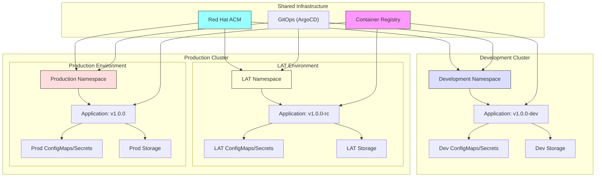

# Use Case: Setup a New Application with 3 Environments (Dev, Lat, Prod)

## Business Context

Setting up distinct environments for development, testing (LAT - User Acceptance Testing level), and production is crucial for ensuring software quality and stability. This use case demonstrates deploying applications across multiple clusters and namespaces, with development running on a separate cluster for enhanced isolation, while LAT and production environments share a cluster but use different namespaces.

**Key Focus: Label-Based Application Management**
This use case emphasizes the strategic use of Kubernetes labels for effective application lifecycle management, environment identification, resource organization, and automated operations across multi-cluster deployments.

## Label Management Strategy

### Core Labeling Standards

This implementation follows a comprehensive labeling strategy for consistent resource management:

#### Standard Label Schema
```yaml
# Application identification labels
app.kubernetes.io/name: <application-name>           # Application name
app.kubernetes.io/version: <version>                 # Application version
app.kubernetes.io/component: <component>             # Component type (frontend, backend, database)
app.kubernetes.io/part-of: <system>                  # Higher-level application/system
app.kubernetes.io/managed-by: <tool>                # Management tool (argocd, helm, etc.)

# Environment and deployment labels
environment: <env>                                   # Environment (dev, lat, prod) 
tier: <tier>                                        # Tier (production, non-production)
cluster: <cluster-name>                             # Target cluster identifier
region: <region>                                    # Geographic region

# Operational labels
owner: <team>                                       # Owning team
cost-center: <code>                                 # Cost allocation
monitoring: <enabled/disabled>                     # Monitoring status
backup: <policy>                                    # Backup policy
```

#### Label Selection and Filtering Examples
```bash
# Select all resources for a specific application
kubectl get all -l app.kubernetes.io/name=sample-app

# Select resources by environment
kubectl get pods -l environment=prod

# Select resources by cluster and environment
kubectl get deployments -l cluster=prod-cluster,environment=lat

# Select all production tier resources
kubectl get services -l tier=production

# Select resources managed by ArgoCD
kubectl get all -l app.kubernetes.io/managed-by=argocd
```

## Technical Requirements

### Infrastructure Requirements
- **Development Cluster**: Dedicated OpenShift 4.12+ cluster for development workloads
- **Production Cluster**: OpenShift 4.12+ cluster hosting LAT and Production environments
- Red Hat Advanced Cluster Management (RHACM) for multi-cluster management
- Network connectivity between clusters for GitOps and management operations
- Shared container registry accessible by both clusters

### Resource Requirements

#### Development Cluster
- **CPU**: 4-8 cores for development workloads
- **Memory**: 16-32GB RAM for development environments
- **Storage**: Fast local storage for rapid development cycles
- **Network**: Internal network access, limited external exposure

#### Production Cluster
- **CPU**: 16-32 cores for LAT and Production workloads
- **Memory**: 64-128GB RAM for production-grade environments
- **Storage**: Enterprise-grade persistent storage with backup capabilities
- **Network**: Full production network access with security controls

## Architecture Overview



## Implementation Steps

### Step 1: Setup Multi-Cluster Management with RHACM

#### Deploy RHACM Hub Cluster
```yaml
apiVersion: operator.open-cluster-management.io/v1
kind: MultiClusterHub
metadata:
  name: multiclusterhub
  namespace: open-cluster-management
spec:
  availabilityConfig: High
  enableClusterBackup: true
  imagePullSecret: multiclusterhub-operator-pull-secret
```

#### Register Development Cluster as Managed Cluster
```yaml
apiVersion: cluster.open-cluster-management.io/v1
kind: ManagedCluster
metadata:
  name: dev-cluster
  labels:
    # Cluster identification labels
    cloud: auto-detect
    vendor: OpenShift
    environment: development
    cluster-role: development
    # Management labels
    managed-by: rhacm
    region: us-east-1
    tier: non-production
    # Operational labels
    monitoring: enabled
    cost-center: dev-ops
    owner: platform-team
spec:
  hubAcceptsClient: true
---
apiVersion: agent.open-cluster-management.io/v1
kind: KlusterletAddonConfig
metadata:
  name: dev-cluster
  namespace: dev-cluster
spec:
  clusterName: dev-cluster
  clusterNamespace: dev-cluster
  clusterLabels:
    cloud: auto-detect
    vendor: OpenShift
    environment: development
    cluster-role: development
    tier: non-production
    region: us-east-1
  applicationManager:
    enabled: true
  policyController:
    enabled: true
  searchCollector:
    enabled: true
  certPolicyController:
    enabled: true
  iamPolicyController:
    enabled: true
```

### Step 2: Create Namespaces Across Clusters

#### Development Cluster - Namespace Configuration
```yaml
# Apply to Development Cluster
apiVersion: v1
kind: Namespace
metadata:
  name: development
  labels:
    # Standard Kubernetes labels
    name: development
    app.kubernetes.io/name: sample-app
    app.kubernetes.io/part-of: sample-system
    app.kubernetes.io/managed-by: argocd
    
    # Environment and deployment labels
    environment: dev
    tier: non-production
    cluster: dev-cluster
    region: us-east-1
    
    # Operational labels
    owner: dev-team
    cost-center: engineering
    monitoring: enabled
    backup: daily
    
    # Feature flags for this environment
    feature.experimental: "true"
    feature.debug: "true"
  annotations:
    openshift.io/description: "Development environment for sample application"
    openshift.io/display-name: "Sample App - Development"
    cluster.open-cluster-management.io/managedCluster: "dev-cluster"
    # Label management annotations
    label-policy.io/required: "environment,tier,owner"
    label-policy.io/validation: "strict"
```

#### Production Cluster - LAT and Production Namespaces
```yaml
# Apply to Production Cluster
apiVersion: v1
kind: Namespace
metadata:
  name: lat
  labels:
    # Standard Kubernetes labels
    name: lat
    app.kubernetes.io/name: sample-app
    app.kubernetes.io/part-of: sample-system
    app.kubernetes.io/managed-by: argocd
    
    # Environment and deployment labels
    environment: lat
    tier: non-production
    cluster: prod-cluster
    region: us-east-1
    
    # Operational labels
    owner: qa-team
    cost-center: quality-assurance
    monitoring: enabled
    backup: weekly
    
    # Feature flags for LAT environment
    feature.experimental: "false"
    feature.debug: "false"
    feature.performance-testing: "true"
  annotations:
    openshift.io/description: "LAT/UAT environment for sample application"
    openshift.io/display-name: "Sample App - LAT"
    cluster.open-cluster-management.io/managedCluster: "prod-cluster"
    label-policy.io/required: "environment,tier,owner"
    label-policy.io/validation: "strict"
---
apiVersion: v1
kind: Namespace
metadata:
  name: production
  labels:
    # Standard Kubernetes labels
    name: production
    app.kubernetes.io/name: sample-app
    app.kubernetes.io/part-of: sample-system
    app.kubernetes.io/managed-by: argocd
    
    # Environment and deployment labels
    environment: prod
    tier: production
    cluster: prod-cluster
    region: us-east-1
    
    # Operational labels
    owner: platform-team
    cost-center: production-ops
    monitoring: enhanced
    backup: continuous
    
    # Production-specific feature flags
    feature.experimental: "false"
    feature.debug: "false"
    feature.high-availability: "true"
    feature.auto-scaling: "true"
  annotations:
    openshift.io/description: "Production environment for sample application"
    openshift.io/display-name: "Sample App - Production"
    cluster.open-cluster-management.io/managedCluster: "prod-cluster"
    label-policy.io/required: "environment,tier,owner,backup"
    label-policy.io/validation: "strict"
```

### Step 3: Configure Cross-Cluster GitOps with ArgoCD

#### ArgoCD ApplicationSet for Multi-Cluster Deployment with Label-Based Selection
```yaml
apiVersion: argoproj.io/v1alpha1
kind: ApplicationSet
metadata:
  name: sample-app-multi-env
  namespace: argocd
  labels:
    # ApplicationSet identification
    app.kubernetes.io/name: sample-app
    app.kubernetes.io/component: applicationset
    app.kubernetes.io/managed-by: argocd
    app.kubernetes.io/part-of: sample-system
    # Management labels
    owner: platform-team
    deployment-strategy: multi-cluster
spec:
  generators:
  # Development cluster selector
  - clusters:
      selector:
        matchLabels:
          environment: development
          tier: non-production
      values:
        environment: development
        namespace: development
        imageTag: "1.0.0-dev"
        replicas: "2"
        resources: "small"
        cluster_type: "development"
  # LAT environment selector (on production cluster)
  - clusters:
      selector:
        matchLabels:
          cluster-role: production
          tier: production
      values:
        environment: lat
        namespace: lat
        imageTag: "1.0.0-rc"
        replicas: "2"
        resources: "medium"
        cluster_type: "production"
  # Production environment selector
  - clusters:
      selector:
        matchLabels:
          cluster-role: production
          tier: production
      values:
        environment: production
        namespace: production
        imageTag: "1.0.0"
        replicas: "5"
        resources: "large"
        cluster_type: "production"
  template:
    metadata:
      name: 'sample-app-{{values.environment}}'
      labels:
        # Application labels for ArgoCD application
        app.kubernetes.io/name: sample-app
        app.kubernetes.io/component: application
        app.kubernetes.io/managed-by: argocd
        environment: '{{values.environment}}'
        cluster-type: '{{values.cluster_type}}'
    spec:
      project: default
      source:
        repoURL: https://git.example.com/sample-app-config
        targetRevision: HEAD
        path: overlays/{{values.environment}}
        helm:
          parameters:
          - name: image.tag
            value: '{{values.imageTag}}'
          - name: replicaCount
            value: '{{values.replicas}}'
          - name: resources.profile
            value: '{{values.resources}}'
          - name: environment
            value: '{{values.environment}}'
          - name: cluster_type
            value: '{{values.cluster_type}}'
      destination:
        server: '{{server}}'
        namespace: '{{values.namespace}}'
      syncPolicy:
        automated:
          prune: true
          selfHeal: true
        syncOptions:
        - CreateNamespace=true
        - RespectIgnoreDifferences=true
```

### Step 4: Configure RBAC and Service Accounts

#### Development Cluster Service Account with Enhanced Labels
```yaml
# Apply to Development Cluster
apiVersion: v1
kind: ServiceAccount
metadata:
  name: sample-app-sa
  namespace: development
  labels:
    # Standard Kubernetes labels
    app.kubernetes.io/name: sample-app
    app.kubernetes.io/component: serviceaccount
    app.kubernetes.io/managed-by: kubectl
    app.kubernetes.io/part-of: sample-system
    
    # Environment and deployment labels
    app: sample-app
    environment: dev
    cluster: dev-cluster
    tier: non-production
    
    # RBAC and security labels
    security.io/rbac: enabled
    security.io/scope: namespace
    
    # Operational labels
    owner: dev-team
    managed-by: platform-team
---
apiVersion: rbac.authorization.k8s.io/v1
kind: Role
metadata:
  name: sample-app-role
  namespace: development
rules:
- apiGroups: [""]
  resources: ["configmaps", "secrets", "pods", "services"]
  verbs: ["get", "list", "watch"]
- apiGroups: ["apps"]
  resources: ["deployments", "replicasets"]
  verbs: ["get", "list", "watch"]
---
apiVersion: rbac.authorization.k8s.io/v1
kind: RoleBinding
metadata:
  name: sample-app-rolebinding
  namespace: development
subjects:
- kind: ServiceAccount
  name: sample-app-sa
  namespace: development
roleRef:
  kind: Role
  name: sample-app-role
  apiGroup: rbac.authorization.k8s.io
```

#### Production Cluster Service Accounts with Enhanced Labels
```yaml
# Apply to Production Cluster - LAT Environment
apiVersion: v1
kind: ServiceAccount
metadata:
  name: sample-app-sa
  namespace: lat
  labels:
    # Standard Kubernetes labels
    app.kubernetes.io/name: sample-app
    app.kubernetes.io/component: serviceaccount
    app.kubernetes.io/managed-by: kubectl
    app.kubernetes.io/part-of: sample-system
    
    # Environment and deployment labels
    app: sample-app
    environment: lat
    cluster: prod-cluster
    tier: non-production
    
    # RBAC and security labels
    security.io/rbac: enabled
    security.io/scope: namespace
    security.io/audit: enabled
    
    # Operational labels
    owner: qa-team
    managed-by: platform-team
---
# Apply to Production Cluster - Production Environment
apiVersion: v1
kind: ServiceAccount
metadata:
  name: sample-app-sa
  namespace: production
  labels:
    # Standard Kubernetes labels
    app.kubernetes.io/name: sample-app
    app.kubernetes.io/component: serviceaccount
    app.kubernetes.io/managed-by: kubectl
    app.kubernetes.io/part-of: sample-system
    
    # Environment and deployment labels
    app: sample-app
    environment: prod
    cluster: prod-cluster
    tier: production
    
    # RBAC and security labels
    security.io/rbac: enabled
    security.io/scope: namespace
    security.io/audit: enhanced
    security.io/compliance: required
    
    # Operational labels
    owner: platform-team
    managed-by: platform-team
    criticality: high
```

### Step 5: Configure Environment Specific Resources

#### Development Environment Configuration (Apply to Development Cluster)
```yaml
apiVersion: v1
kind: ConfigMap
metadata:
  name: app-config
  namespace: development
  labels:
    app: sample-app
    environment: dev
    cluster: dev-cluster
    app.kubernetes.io/name: sample-app
    app.kubernetes.io/component: config
data:
  APP_ENV: "development"
  LOG_LEVEL: "debug"
  DATABASE_HOST: "dev-postgres.development.svc.cluster.local"
  DATABASE_PORT: "5432"
  DATABASE_NAME: "sampleapp_dev"
  REDIS_HOST: "dev-redis.development.svc.cluster.local"
  REDIS_PORT: "6379"
  API_BASE_URL: "https://api-dev.example.com"
  FEATURE_FLAGS: "new-ui:true,beta-features:true"
  MAX_CONNECTIONS: "10"
  CACHE_TTL: "300"
  CLUSTER_NAME: "dev-cluster"
---
apiVersion: v1
kind: Secret
metadata:
  name: app-secrets
  namespace: development
  labels:
    app: sample-app
    environment: dev
    app.kubernetes.io/name: sample-app
    app.kubernetes.io/component: secrets
type: Opaque
stringData:
  DATABASE_PASSWORD: "dev_password_123"
  REDIS_PASSWORD: "dev_redis_password"
  JWT_SECRET: "dev_jwt_secret_key"
  API_KEY: "dev_api_key_12345"
  ENCRYPTION_KEY: "dev_encryption_key"
---
# LAT Environment Configuration (Apply to Production Cluster)
apiVersion: v1
kind: ConfigMap
metadata:
  name: app-config
  namespace: lat
  labels:
    app: sample-app
    environment: lat
    cluster: prod-cluster
    app.kubernetes.io/name: sample-app
    app.kubernetes.io/component: config
data:
  APP_ENV: "lat"
  LOG_LEVEL: "info"
  DATABASE_HOST: "lat-postgres.lat.svc.cluster.local"
  DATABASE_PORT: "5432"
  DATABASE_NAME: "sampleapp_lat"
  REDIS_HOST: "lat-redis.lat.svc.cluster.local"
  REDIS_PORT: "6379"
  API_BASE_URL: "https://api-lat.example.com"
  FEATURE_FLAGS: "new-ui:true,beta-features:false"
  MAX_CONNECTIONS: "20"
  CACHE_TTL: "600"
  CLUSTER_NAME: "prod-cluster"
---
apiVersion: v1
kind: Secret
metadata:
  name: app-secrets
  namespace: lat
  labels:
    app: sample-app
    environment: lat
    app.kubernetes.io/name: sample-app
    app.kubernetes.io/component: secrets
type: Opaque
stringData:
  DATABASE_PASSWORD: "lat_password_456"
  REDIS_PASSWORD: "lat_redis_password"
  JWT_SECRET: "lat_jwt_secret_key"
  API_KEY: "lat_api_key_67890"
  ENCRYPTION_KEY: "lat_encryption_key"
---
# Production Environment Configuration (Apply to Production Cluster)
apiVersion: v1
kind: ConfigMap
metadata:
  name: app-config
  namespace: production
  labels:
    app: sample-app
    environment: prod
    cluster: prod-cluster
    app.kubernetes.io/name: sample-app
    app.kubernetes.io/component: config
data:
  APP_ENV: "production"
  LOG_LEVEL: "warn"
  DATABASE_HOST: "prod-postgres.production.svc.cluster.local"
  DATABASE_PORT: "5432"
  DATABASE_NAME: "sampleapp_prod"
  REDIS_HOST: "prod-redis.production.svc.cluster.local"
  REDIS_PORT: "6379"
  API_BASE_URL: "https://api.example.com"
  FEATURE_FLAGS: "new-ui:false,beta-features:false"
  MAX_CONNECTIONS: "50"
  CACHE_TTL: "3600"
  CLUSTER_NAME: "prod-cluster"
---
apiVersion: v1
kind: Secret
metadata:
  name: app-secrets
  namespace: production
  labels:
    app: sample-app
    environment: prod
    app.kubernetes.io/name: sample-app
    app.kubernetes.io/component: secrets
type: Opaque
stringData:
  DATABASE_PASSWORD: "prod_secure_password_789"
  REDIS_PASSWORD: "prod_redis_secure_password"
  JWT_SECRET: "prod_jwt_secret_key_secure"
  API_KEY: "prod_api_key_secure_abcdef"
  ENCRYPTION_KEY: "prod_encryption_key_secure"
```

### Step 6: Deploy Application Across Clusters and Environments

#### Development Environment Deployment (Apply to Development Cluster)
```yaml
apiVersion: apps/v1
kind: Deployment
metadata:
  name: sample-app
  namespace: development
  labels:
    app: sample-app
    environment: dev
    cluster: dev-cluster
    app.kubernetes.io/name: sample-app
    app.kubernetes.io/version: "1.0.0"
    app.kubernetes.io/component: application
spec:
  replicas: 2
  strategy:
    type: RollingUpdate
    rollingUpdate:
      maxUnavailable: 1
      maxSurge: 1
  selector:
    matchLabels:
      app: sample-app
      environment: dev
  template:
    metadata:
      labels:
        app: sample-app
        environment: dev
        app.kubernetes.io/name: sample-app
        app.kubernetes.io/version: "1.0.0"
    spec:
      serviceAccountName: sample-app-sa
      containers:
      - name: sample-app
        image: quay.io/example/sample-app:1.0.0-dev
        imagePullPolicy: Always
        ports:
        - containerPort: 8080
          name: http
          protocol: TCP
        envFrom:
        - configMapRef:
            name: app-config
        - secretRef:
            name: app-secrets
        resources:
          requests:
            memory: "256Mi"
            cpu: "100m"
          limits:
            memory: "512Mi"
            cpu: "200m"
        livenessProbe:
          httpGet:
            path: /health/live
            port: 8080
          initialDelaySeconds: 30
          periodSeconds: 10
          timeoutSeconds: 5
          failureThreshold: 3
        readinessProbe:
          httpGet:
            path: /health/ready
            port: 8080
          initialDelaySeconds: 5
          periodSeconds: 5
          timeoutSeconds: 3
          failureThreshold: 3
        volumeMounts:
        - name: app-data
          mountPath: /data
        - name: temp-storage
          mountPath: /tmp
      volumes:
      - name: app-data
        persistentVolumeClaim:
          claimName: sample-app-data
      - name: temp-storage
        emptyDir: {}
---
apiVersion: v1
kind: Service
metadata:
  name: sample-app-service
  namespace: development
  labels:
    app: sample-app
    environment: dev
spec:
  selector:
    app: sample-app
    environment: dev
  ports:
  - name: http
    port: 80
    targetPort: 8080
    protocol: TCP
  type: ClusterIP
---
# LAT Environment Deployment
apiVersion: apps/v1
kind: Deployment
metadata:
  name: sample-app
  namespace: lat
  labels:
    app: sample-app
    environment: lat
    app.kubernetes.io/name: sample-app
    app.kubernetes.io/version: "1.0.0"
    app.kubernetes.io/component: application
spec:
  replicas: 2
  strategy:
    type: RollingUpdate
    rollingUpdate:
      maxUnavailable: 0
      maxSurge: 1
  selector:
    matchLabels:
      app: sample-app
      environment: lat
  template:
    metadata:
      labels:
        app: sample-app
        environment: lat
        app.kubernetes.io/name: sample-app
        app.kubernetes.io/version: "1.0.0"
    spec:
      serviceAccountName: sample-app-sa
      containers:
      - name: sample-app
        image: quay.io/example/sample-app:1.0.0-rc
        imagePullPolicy: IfNotPresent
        ports:
        - containerPort: 8080
          name: http
          protocol: TCP
        envFrom:
        - configMapRef:
            name: app-config
        - secretRef:
            name: app-secrets
        resources:
          requests:
            memory: "512Mi"
            cpu: "250m"
          limits:
            memory: "1Gi"
            cpu: "500m"
        livenessProbe:
          httpGet:
            path: /health/live
            port: 8080
          initialDelaySeconds: 30
          periodSeconds: 10
          timeoutSeconds: 5
          failureThreshold: 3
        readinessProbe:
          httpGet:
            path: /health/ready
            port: 8080
          initialDelaySeconds: 5
          periodSeconds: 5
          timeoutSeconds: 3
          failureThreshold: 3
        volumeMounts:
        - name: app-data
          mountPath: /data
        - name: temp-storage
          mountPath: /tmp
      volumes:
      - name: app-data
        persistentVolumeClaim:
          claimName: sample-app-data
      - name: temp-storage
        emptyDir: {}
---
# Production Environment Deployment
apiVersion: apps/v1
kind: Deployment
metadata:
  name: sample-app
  namespace: production
  labels:
    app: sample-app
    environment: prod
    app.kubernetes.io/name: sample-app
    app.kubernetes.io/version: "1.0.0"
    app.kubernetes.io/component: application
spec:
  replicas: 5
  strategy:
    type: RollingUpdate
    rollingUpdate:
      maxUnavailable: 1
      maxSurge: 2
  selector:
    matchLabels:
      app: sample-app
      environment: prod
  template:
    metadata:
      labels:
        app: sample-app
        environment: prod
        app.kubernetes.io/name: sample-app
        app.kubernetes.io/version: "1.0.0"
    spec:
      serviceAccountName: sample-app-sa
      containers:
      - name: sample-app
        image: quay.io/example/sample-app:1.0.0
        imagePullPolicy: IfNotPresent
        ports:
        - containerPort: 8080
          name: http
          protocol: TCP
        envFrom:
        - configMapRef:
            name: app-config
        - secretRef:
            name: app-secrets
        resources:
          requests:
            memory: "1Gi"
            cpu: "500m"
          limits:
            memory: "2Gi"
            cpu: "1"
        livenessProbe:
          httpGet:
            path: /health/live
            port: 8080
          initialDelaySeconds: 60
          periodSeconds: 10
          timeoutSeconds: 5
          failureThreshold: 3
        readinessProbe:
          httpGet:
            path: /health/ready
            port: 8080
          initialDelaySeconds: 10
          periodSeconds: 5
          timeoutSeconds: 3
          failureThreshold: 3
        volumeMounts:
        - name: app-data
          mountPath: /data
        - name: temp-storage
          mountPath: /tmp
      volumes:
      - name: app-data
        persistentVolumeClaim:
          claimName: sample-app-data
      - name: temp-storage
        emptyDir: {}
      affinity:
        podAntiAffinity:
          preferredDuringSchedulingIgnoredDuringExecution:
          - weight: 100
            podAffinityTerm:
              labelSelector:
                matchExpressions:
                - key: app
                  operator: In
                  values:
                  - sample-app
              topologyKey: kubernetes.io/hostname
```

### Step 5: Configure Persistent Storage

#### PersistentVolumeClaims for Each Environment
```yaml
apiVersion: v1
kind: PersistentVolumeClaim
metadata:
  name: sample-app-data
  namespace: development
  labels:
    app: sample-app
    environment: dev
spec:
  accessModes:
    - ReadWriteOnce
  resources:
    requests:
      storage: 5Gi
  storageClassName: ocs-storagecluster-ceph-rbd
---
apiVersion: v1
kind: PersistentVolumeClaim
metadata:
  name: sample-app-data
  namespace: lat
  labels:
    app: sample-app
    environment: lat
spec:
  accessModes:
    - ReadWriteOnce
  resources:
    requests:
      storage: 10Gi
  storageClassName: ocs-storagecluster-ceph-rbd
---
apiVersion: v1
kind: PersistentVolumeClaim
metadata:
  name: sample-app-data
  namespace: production
  labels:
    app: sample-app
    environment: prod
spec:
  accessModes:
    - ReadWriteOnce
  resources:
    requests:
      storage: 50Gi
  storageClassName: ocs-storagecluster-ceph-rbd
```

### Step 6: Configure Network and Resource Policies

#### Network Policies
```yaml
apiVersion: networking.k8s.io/v1
kind: NetworkPolicy
metadata:
  name: allow-specific
  namespace: development
spec:
  podSelector:
    matchLabels:
      app: sample-app
  policyTypes:
  - Ingress
  - Egress
  ingress:
  - from:
    - ipBlock:
        cidr: 10.0.0.0/8
  egress:
  - to:
    - ipBlock:
        cidr: 10.0.0.0/8
---
# Repeat for LAT and Prod with respective rules
```

#### Resource Quotas
```yaml
apiVersion: v1
kind: ResourceQuota
metadata:
  name: compute-resources
  namespace: development
spec:
  hard:
    requests.cpu: "2"
    requests.memory: 4Gi
    limits.cpu: "4"
    limits.memory: 8Gi
---
# Repeat for LAT and Prod with tailored allocations
```

### Validation and Testing

#### Validate Deployments
```shell
kubectl get deployments -n development
kubectl get pods -n development
kubectl get services -n development
```

- Verify that all resources are correctly deployed and running.

#### Test Application Functionality
- Ensure each environment functions as expected from development to LAT and into production.

### Label-Based Management Operations

#### Advanced Label Queries and Operations
```bash
# Application lifecycle management using labels

# Find all resources belonging to sample-app across all environments
kubectl get all --all-namespaces -l app.kubernetes.io/name=sample-app

# Get all production tier resources
kubectl get all --all-namespaces -l tier=production

# List all resources managed by ArgoCD
kubectl get all --all-namespaces -l app.kubernetes.io/managed-by=argocd

# Find resources by owner team
kubectl get all --all-namespaces -l owner=platform-team

# Get all development environment resources
kubectl get all --all-namespaces -l environment=dev

# Find all resources with backup enabled
kubectl get all --all-namespaces -l backup!=none

# Complex queries combining multiple labels
kubectl get deployments --all-namespaces -l 'app.kubernetes.io/name=sample-app,tier=production'

# Scale all deployments in development environment
kubectl scale deployments -l environment=dev --replicas=1 --all-namespaces

# Delete all test resources (be careful!)
kubectl delete all -l environment=test --all-namespaces
```

#### Label-Based Resource Policies
```yaml
# OPA Gatekeeper policy to enforce required labels
apiVersion: templates.gatekeeper.sh/v1beta1
kind: ConstraintTemplate
metadata:
  name: k8srequiredlabels
spec:
  crd:
    spec:
      names:
        kind: K8sRequiredLabels
      validation:
        type: object
        properties:
          labels:
            type: array
            items:
              type: string
  targets:
    - target: admission.k8s.gatekeeper.sh
      rego: |
        package k8srequiredlabels
        
        violation[{"msg": msg}] {
          required := input.parameters.labels
          provided := input.review.object.metadata.labels
          missing := required[_]
          not provided[missing]
          msg := sprintf("Missing required label: %v", [missing])
        }
---
apiVersion: constraints.gatekeeper.sh/v1beta1
kind: K8sRequiredLabels
metadata:
  name: must-have-environment
spec:
  match:
    kinds:
      - apiGroups: ["apps"]
        kinds: ["Deployment"]
      - apiGroups: [""]
        kinds: ["Service"]
  parameters:
    labels: ["environment", "owner", "app.kubernetes.io/name"]
```

### Best Practices for Label Management

#### Label Strategy Best Practices
- **Consistent Naming**: Use standardized label keys across all environments
- **Hierarchical Organization**: Implement app.kubernetes.io standard labels
- **Environment Identification**: Always include environment and tier labels
- **Ownership Tracking**: Include owner and cost-center labels for accountability
- **Automation Friendly**: Design labels for automated selection and management
- **Policy Enforcement**: Use admission controllers to enforce required labels

#### Configuration Management
- **Consistent Configuration Management**: Use ConfigMaps and Secrets effectively across environments.
- **Isolation**: Ensure namespaces are isolated to prevent cross-environment contamination.
- **Resource Management**: Tailor quotas and limits to reflect environment purposes.
- **Automation**: Implement CI/CD pipelines for streamlined deployments.
- **Monitoring**: Use Prometheus and Grafana for monitoring and alerts.

#### Label-Based Monitoring and Alerting
```yaml
# Prometheus monitoring rules using labels
apiVersion: monitoring.coreos.com/v1
kind: PrometheusRule
metadata:
  name: sample-app-alerts
  labels:
    app.kubernetes.io/name: sample-app
    monitoring: prometheus
spec:
  groups:
  - name: sample-app
    rules:
    - alert: ApplicationDown
      expr: up{app_kubernetes_io_name="sample-app"} == 0
      for: 5m
      labels:
        severity: critical
        environment: "{{ $labels.environment }}"
        owner: "{{ $labels.owner }}"
      annotations:
        summary: "Sample app is down in {{ $labels.environment }}"
        description: "Application {{ $labels.app_kubernetes_io_name }} in {{ $labels.environment }} environment has been down for more than 5 minutes."
```

## Integration with RH OVE Ecosystem

- **GitOps Integration**: Use ArgoCD for deploying and managing environment configurations.
- **Policy Automation**: Enforce standards and policies through OPA Gatekeeper.
- **Multi-Cluster Management**: Utilize RHACM for managing environments across multiple clusters.

This guide provides a clear pathway for setting up a robust, multi-environment application deployment workflow within RH OVE using Kubernetes namespaces, ensuring seamless transitions from development through to production.
