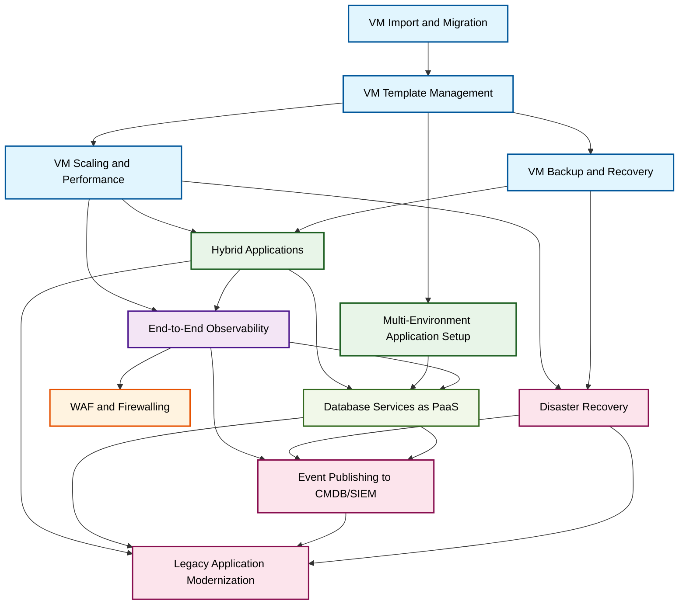

## Use Cases Dependencies Graph

This diagram shows the logical dependencies and recommended implementation flow between various use cases within the RH OVE ecosystem. The graph illustrates prerequisite relationships - arrows point from foundational capabilities to dependent advanced features.

### Color Legend
- 🔵 **VM Lifecycle** (Light Blue): Core virtualization capabilities
- 🟣 **Observability** (Purple): Monitoring and insights
- 🟢 **Application Deployment** (Green): Application management and deployment
- 🟠 **Security** (Orange): Security and protection services  
- 🔴 **Enterprise Integration** (Pink): Enterprise systems integration
- 🟡 **PaaS Services** (Light Green): Platform-as-a-Service offerings

# Use Cases Summary Table

## Overview

This table provides a comprehensive overview of all use cases documented for the Red Hat OpenShift Virtualization Engine (RH OVE) ecosystem.

## Use Cases Matrix

| Use Case | Category | Complexity | Key Technologies | Business Value | Implementation Time | Prerequisites |
|----------|----------|------------|------------------|----------------|-------------------|---------------|
| [VM Import and Migration](vm-importation.md) | VM Lifecycle | Medium | KubeVirt, CDI, MTV | Legacy system modernization | 2-4 weeks | OpenShift 4.12+, Source VM access |
| [VM Template Management](vm-template-management.md) | VM Lifecycle | Low | KubeVirt, CDI | Standardized deployments | 1-2 weeks | OpenShift 4.12+, Template storage |
| [VM Scaling and Performance](vm-scaling-performance.md) | VM Lifecycle | High | HPA, VPA, KubeVirt | Resource optimization | 3-6 weeks | Metrics server, Monitoring stack |
| [VM Backup and Recovery](vm-backup-recovery.md) | VM Lifecycle | Medium | Rubrik CDM, Polaris | Data protection | 2-4 weeks | Rubrik infrastructure |
| [Hybrid Applications](hybrid-applications.md) | Application Deployment | High | Cilium, Service Mesh | Modernization flexibility | 4-8 weeks | Multi-network setup |
| [Database Services as PaaS](database-services-paas.md) | PaaS Integration | High | DB Operators, Helm | Self-service databases | 6-10 weeks | Persistent storage, Operators |
| [Legacy Application Modernization](legacy-modernization.md) | Enterprise Integration | Very High | MTA, Service Mesh, Tekton | Digital transformation | 12-24 weeks | Application analysis |
| [Disaster Recovery](disaster-recovery.md) | Enterprise Integration | High | RHACM, Storage replication | Business continuity | 8-12 weeks | Multi-site infrastructure |
| [End-to-End Observability](end-to-end-observability.md) | Observability | Medium | Prometheus, Jaeger, Dynatrace | Operational insights | 3-6 weeks | Monitoring infrastructure |
| [WAF and Firewalling](waf-firewalling.md) | Security | Medium | Cilium L4-L7, F5 BigIP | Application security | 2-4 weeks | F5 BigIP appliance |
| [Event Publishing to CMDB/SIEM](publishing-events-to-cmdb-siem.md) | Integration | High | Event Bus, Adapters | Enterprise integration | 4-8 weeks | CMDB/SIEM connectivity |
| [Multi-Environment Application Setup](setup-multi-env-application.md) | Application Deployment | Medium | RHACM, ArgoCD, Namespaces | Development workflow | 2-4 weeks | Multi-cluster setup |

## Complexity Levels

| Level | Description | Skills Required | Timeline |
|-------|-------------|----------------|-----------|
| **Low** | Basic configuration with standard components | Platform administrator | 1-2 weeks |
| **Medium** | Integration of multiple components with custom configuration | Senior platform engineer | 2-6 weeks |
| **High** | Complex multi-component solutions requiring custom development | Solution architect + team | 4-12 weeks |
| **Very High** | Enterprise-wide transformation requiring extensive planning | Enterprise architect + multiple teams | 12+ weeks |

## Category Breakdown

### VM Lifecycle Management
- **Purpose**: Managing virtual machine operations and lifecycle
- **Use Cases**: 4 use cases covering import, templates, scaling, and backup
- **Key Benefits**: Infrastructure consolidation, operational efficiency

### Application Deployment
- **Purpose**: Deploying and managing hybrid application architectures
- **Use Cases**: 1 comprehensive use case for hybrid applications
- **Key Benefits**: Application modernization, deployment flexibility

### PaaS Integration
- **Purpose**: Providing platform services for development teams
- **Use Cases**: 1 comprehensive database services platform
- **Key Benefits**: Developer productivity, service standardization

### Enterprise Integration
- **Purpose**: Integrating with existing enterprise systems and processes
- **Use Cases**: 2 use cases covering modernization and disaster recovery
- **Key Benefits**: Risk mitigation, business continuity

### Observability
- **Purpose**: Monitoring and understanding system behavior
- **Use Cases**: 1 comprehensive observability solution
- **Key Benefits**: Operational visibility, proactive issue resolution

### Security
- **Purpose**: Protecting applications and infrastructure
- **Use Cases**: 1 WAF and firewalling solution
- **Key Benefits**: Security compliance, threat protection

### Integration
- **Purpose**: Connecting with external enterprise systems
- **Use Cases**: 1 event publishing integration
- **Key Benefits**: Enterprise integration, compliance reporting

## Implementation Priority Matrix

### Phase 1: Foundation (Weeks 1-8)
1. VM Template Management
2. VM Import and Migration
3. End-to-End Observability

### Phase 2: Core Services (Weeks 9-20)
4. VM Scaling and Performance
5. VM Backup and Recovery
6. WAF and Firewalling

### Phase 3: Advanced Integration (Weeks 21-36)
7. Hybrid Applications
8. Database Services as PaaS
9. Event Publishing to CMDB/SIEM

### Phase 4: Enterprise Transformation (Weeks 37+)
10. Legacy Application Modernization
11. Disaster Recovery

## Prerequisites Summary

### Common Prerequisites
- OpenShift 4.12+ with KubeVirt enabled
- Sufficient compute, memory, and storage resources
- Network connectivity between components
- Identity provider integration

### Specialized Prerequisites
- **Rubrik Infrastructure**: For VM backup and recovery
- **F5 BigIP**: For advanced WAF capabilities
- **External Systems**: CMDB, SIEM, legacy systems for integration use cases
- **Multi-site Setup**: For disaster recovery scenarios

## Success Metrics

| Use Case Category | Key Performance Indicators |
|-------------------|----------------------------|
| VM Lifecycle | VM provisioning time, resource utilization, backup success rate |
| Application Deployment | Deployment frequency, rollback rate, application performance |
| PaaS Integration | Service provisioning time, developer satisfaction, service availability |
| Enterprise Integration | Integration success rate, compliance score, incident response time |
| Observability | Mean time to detection (MTTD), alert accuracy, dashboard usage |
| Security | Security incident reduction, compliance pass rate, threat detection rate |

## Getting Started

1. **Assessment**: Review your current infrastructure and identify priority use cases
2. **Planning**: Create implementation roadmap based on complexity and business value
3. **Prerequisites**: Ensure all required infrastructure and tools are available
4. **Pilot**: Start with low-complexity use cases to build expertise
5. **Scale**: Gradually implement more complex use cases as team capabilities grow

For detailed implementation guidance, refer to the individual use case documentation linked in the table above.
