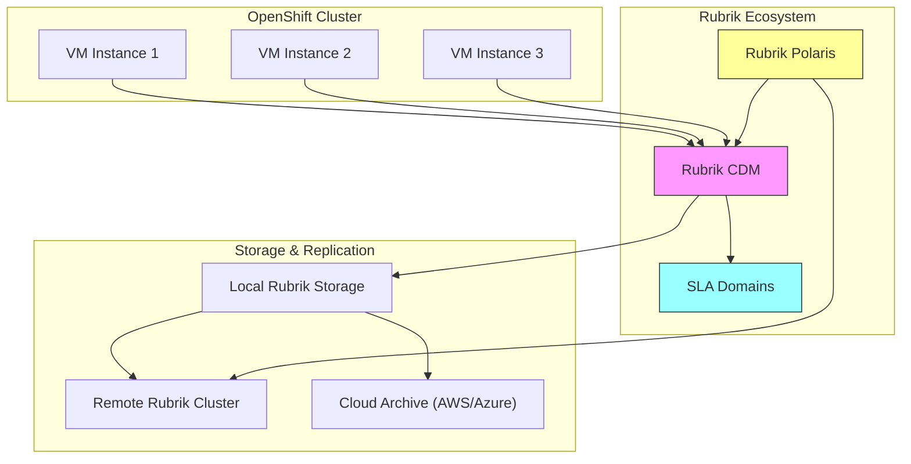

# Use Case: VM Backup and Recovery

## Business Context

Ensuring data integrity and availability requires effective VM backup and recovery strategies. This use case explores how to implement comprehensive backup solutions and recovery processes to protect critical VM workloads, ensuring minimal downtime and data loss.

## Technical Requirements

### Infrastructure Requirements
- OpenShift 4.12+ with KubeVirt enabled
- Rubrik Cloud Data Management for comprehensive backup and recovery
- Network connectivity for Rubrik management and data transfer

### Resource Requirements
- **Storage**: Adequate space for backup snapshots and archival
- **Network**: Sufficient bandwidth for backup data transfer

## Architecture Overview



## Implementation Steps

### Step 1: Setup Backup Infrastructure

#### Deploy Rubrik Kubernetes Connector
```yaml
apiVersion: apps/v1
kind: Deployment
metadata:
  name: rubrik-connector
  namespace: rubrik-system
spec:
  replicas: 1
  selector:
    matchLabels:
      app: rubrik-connector
  template:
    metadata:
      labels:
        app: rubrik-connector
    spec:
      containers:
      - name: connector
        image: rubrik/kubernetes-connector:latest
        env:
        - name: RUBRIK_CDM_URL
          valueFrom:
            secretKeyRef:
              name: rubrik-credentials
              key: cdm-url
        - name: RUBRIK_USERNAME
          valueFrom:
            secretKeyRef:
              name: rubrik-credentials
              key: username
        - name: RUBRIK_PASSWORD
          valueFrom:
            secretKeyRef:
              name: rubrik-credentials
              key: password
        ports:
        - containerPort: 8080
        volumeMounts:
        - name: kubeconfig
          mountPath: /etc/kubeconfig
          readOnly: true
      volumes:
      - name: kubeconfig
        secret:
          secretName: rubrik-kubeconfig
---
apiVersion: v1
kind: Secret
metadata:
  name: rubrik-credentials
  namespace: rubrik-system
type: Opaque
data:
  cdm-url: <base64-encoded-rubrik-cdm-url>
  username: <base64-encoded-username>
  password: <base64-encoded-password>
```

#### Configure Rubrik SLA Domains
```yaml
# Rubrik SLA Domain Configuration
apiVersion: rubrik.com/v1
kind: SLADomain
metadata:
  name: vm-backup-sla
  namespace: vm-workloads
spec:
  name: "VM Production Backup"
  frequencies:
  - timeUnit: "Daily"
    frequency: 1
    retention: 30  # days
  - timeUnit: "Weekly"
    frequency: 1
    retention: 12  # weeks
  - timeUnit: "Monthly"
    frequency: 1
    retention: 12  # months
  archivalSpecs:
  - locationId: "cloud-archive-location"
    archivalThreshold: 7  # days
  replicationSpecs:
  - locationId: "remote-rubrik-cluster"
    retentionLimit: 90  # days
```

### Step 2: Configure VM Backup Policies

#### Assign VMs to SLA Domains
```yaml
apiVersion: rubrik.com/v1
kind: VMBackupPolicy
metadata:
  name: vm-backup-policy
  namespace: vm-workloads
spec:
  selector:
    matchLabels:
      backup: "enabled"
  slaRef:
    name: vm-backup-sla
  backupOptions:
    consistencyType: "application-consistent"
    excludedDisks: []
    includeIndexing: true
---
# Apply backup policy to specific VMs
apiVersion: kubevirt.io/v1
kind: VirtualMachine
metadata:
  name: critical-app-vm
  namespace: vm-workloads
  labels:
    backup: "enabled"
    tier: "production"
spec:
  running: true
  template:
    metadata:
      labels:
        backup: "enabled"
    spec:
      domain:
        devices:
          disks:
          - disk:
              bus: virtio
            name: rootdisk
        memory:
          guest: 8Gi
        cpu:
          cores: 4
      volumes:
      - dataVolume:
          name: critical-app-vm-dv
        name: rootdisk
```

#### On-Demand Backup Configuration
```bash
# Trigger immediate backup using Rubrik CLI
rubrik backup vm --vm-name "critical-app-vm" --namespace "vm-workloads" --sla "VM Production Backup"

# Schedule backup using Rubrik API
curl -X POST "https://rubrik-cdm.example.com/api/internal/vmware/vm/{vm-id}/snapshot" \
  -H "Authorization: Bearer ${RUBRIK_TOKEN}" \
  -H "Content-Type: application/json" \
  -d '{
    "slaId": "vm-backup-sla-id",
    "archivalPolicy": {
      "locationId": "cloud-archive-location",
      "retentionDays": 2555
    }
  }'
```

### Step 3: Configure Backup Storage and Replication

#### Cloud Archive Configuration
```yaml
apiVersion: rubrik.com/v1
kind: CloudArchive
metadata:
  name: aws-s3-archive
  namespace: rubrik-system
spec:
  provider: "AWS"
  bucketName: "rubrik-vm-backups"
  region: "us-west-2"
  encryptionType: "AWS_KMS"
  credentials:
    secretRef:
      name: aws-credentials
      namespace: rubrik-system
  storageClass: "GLACIER"
  retentionLock: true
  retentionLockDurationDays: 2555  # 7 years
---
apiVersion: v1
kind: Secret
metadata:
  name: aws-credentials
  namespace: rubrik-system
type: Opaque
data:
  access-key-id: <base64-encoded-access-key>
  secret-access-key: <base64-encoded-secret-key>
```

#### Replication Target Configuration
```yaml
apiVersion: rubrik.com/v1
kind: ReplicationTarget
metadata:
  name: dr-site-rubrik
  namespace: rubrik-system
spec:
  targetClusterAddress: "rubrik-dr.example.com"
  credentials:
    secretRef:
      name: dr-rubrik-credentials
  replicationBandwidth: "100 Mbps"
  encryptionInTransit: true
  retentionOnTarget: 90  # days
```

### Step 4: Implement Recovery Procedures

#### Instant Recovery Configuration
```yaml
apiVersion: rubrik.com/v1
kind: VMRecovery
metadata:
  name: vm-instant-recovery
  namespace: vm-workloads
spec:
  sourceVM:
    name: "critical-app-vm"
    namespace: "vm-workloads"
  recoveryPoint:
    snapshotId: "snapshot-id-from-rubrik"
    # or use timestamp
    # timestamp: "2024-01-15T10:30:00Z"
  recoveryOptions:
    type: "instant"  # instant, full, or export
    targetNamespace: "vm-recovery"
    targetVMName: "critical-app-vm-recovered"
    powerOn: true
    preserveMAC: false
  networkMapping:
  - sourceNetwork: "production-network"
    targetNetwork: "recovery-network"
---
# Alternative: Full VM Recovery
apiVersion: rubrik.com/v1
kind: VMRecovery
metadata:
  name: vm-full-recovery
  namespace: vm-workloads
spec:
  sourceVM:
    name: "critical-app-vm"
    namespace: "vm-workloads"
  recoveryPoint:
    snapshotId: "latest"
  recoveryOptions:
    type: "full"
    targetNamespace: "vm-workloads"
    targetVMName: "critical-app-vm"
    powerOn: false
    overwriteExisting: true
```

#### Granular File Recovery
```bash
# Mount VM snapshot for file-level recovery
rubrik vm mount --vm-name "critical-app-vm" \
  --snapshot-id "snapshot-id" \
  --mount-path "/mnt/recovery" \
  --read-only

# Extract specific files
cp /mnt/recovery/important-file.txt /recovery/destination/

# Unmount when recovery is complete
rubrik vm unmount --mount-id "mount-id"
```

#### Cross-Platform Recovery
```yaml
# Export VM to different platform (e.g., VMware to KubeVirt)
apiVersion: rubrik.com/v1
kind: VMExport
metadata:
  name: vm-cross-platform-recovery
  namespace: vm-workloads
spec:
  sourceVM:
    name: "legacy-vmware-vm"
    platform: "vmware"
  exportOptions:
    targetPlatform: "kubevirt"
    targetNamespace: "migrated-workloads"
    format: "ova"
    targetStorage:
      storageClass: "fast-ssd"
      size: "100Gi"
  conversionOptions:
    optimizeForKubernetes: true
    removeVMwareTools: true
    installKubernetesAgents: true
```

## Troubleshooting Guide

### Common Issues and Solutions

#### Rubrik Connector Issues
- **Issue**: Rubrik connector cannot communicate with CDM
- **Solution**: 
  - Verify network connectivity between OpenShift cluster and Rubrik CDM
  - Check Rubrik credentials in the secret
  - Ensure proper RBAC permissions for the connector service account

#### Backup Failures
- **Issue**: VM backups failing or incomplete
- **Solution**:
  - Check VM quiesce settings and ensure VM tools are installed
  - Verify SLA domain configuration and policies
  - Monitor Rubrik cluster storage capacity
  - Review backup logs in Rubrik Polaris dashboard

#### Recovery Performance Issues
- **Issue**: Slow recovery or instant recovery not working
- **Solution**:
  - Verify network bandwidth between Rubrik and OpenShift cluster
  - Check storage performance on target environment
  - Use Rubrik's storage optimization features
  - Consider using local recovery points for faster access

#### Replication and Archive Issues
- **Issue**: Replication to remote site or cloud archive failing
- **Solution**:
  - Verify bandwidth allocation and network policies
  - Check cloud credentials and permissions
  - Review replication target configuration
  - Monitor Rubrik cluster bandwidth utilization

## Best Practices

- **Regular Backups**: Schedule regular backups and snapshots for critical VMs.
- **Test Recovery**: Regularly test recovery procedures using Rubrik capabilities to ensure data integrity.
- **Security and Compliance**: Leverage Rubrik's built-in encryption and compliance features.

## Integration with RH OVE Ecosystem

### Monitoring and Alerting Integration
```yaml
# Rubrik Metrics ServiceMonitor
apiVersion: monitoring.coreos.com/v1
kind: ServiceMonitor
metadata:
  name: rubrik-metrics
  namespace: rubrik-system
spec:
  selector:
    matchLabels:
      app: rubrik-connector
  endpoints:
  - port: metrics
    interval: 30s
    path: /metrics
---
# Rubrik Backup Alerts
apiVersion: monitoring.coreos.com/v1
kind: PrometheusRule
metadata:
  name: rubrik-backup-alerts
  namespace: rubrik-system
spec:
  groups:
  - name: rubrik.backup
    rules:
    - alert: RubrikBackupFailure
      expr: rubrik_backup_failures_total > 0
      for: 5m
      labels:
        severity: critical
      annotations:
        summary: "Rubrik backup failure detected"
        description: "VM backup has failed for {{ $labels.vm_name }}"
    
    - alert: RubrikClusterCapacity
      expr: rubrik_cluster_used_capacity_percentage > 85
      for: 10m
      labels:
        severity: warning
      annotations:
        summary: "Rubrik cluster capacity high"
        description: "Rubrik cluster is {{ $value }}% full"
    
    - alert: RubrikReplicationDelay
      expr: rubrik_replication_lag_minutes > 60
      for: 15m
      labels:
        severity: warning
      annotations:
        summary: "Rubrik replication lag detected"
        description: "Replication is {{ $value }} minutes behind"
```

### GitOps Integration
```yaml
apiVersion: argoproj.io/v1alpha1
kind: Application
metadata:
  name: rubrik-backup-policies
  namespace: argocd
spec:
  project: platform-services
  source:
    repoURL: https://git.example.com/rubrik-backup-config
    targetRevision: HEAD
    path: policies/production
  destination:
    server: https://kubernetes.default.svc
    namespace: vm-workloads
  syncPolicy:
    automated:
      prune: false
      selfHeal: true
    syncOptions:
    - CreateNamespace=true
```

### Multi-Cluster Backup Management
- **Centralized Management**: Use Rubrik Polaris to manage backup policies across multiple OpenShift clusters
- **Cross-Cluster Recovery**: Implement recovery procedures that can restore VMs to different clusters
- **Global SLA Management**: Define consistent backup policies across the entire RH OVE ecosystem

This guide provides the necessary steps and best practices for implementing VM backup and recovery processes in the RH OVE environment, ensuring data resilience and availability for enterprise workloads.
