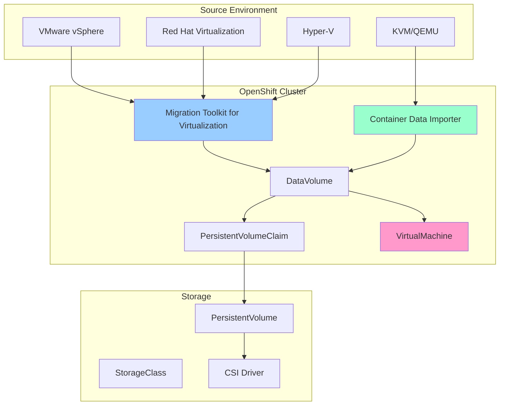

# Use Case: VM Importation and Migration

## Business Context

Organizations often need to migrate existing virtual machines from various virtualization platforms (VMware vSphere, Red Hat Virtualization, Hyper-V, or KVM) to OpenShift Virtualization. This use case demonstrates how to import VMs while maintaining data integrity, minimizing downtime, and ensuring seamless operation in the new environment.

## Technical Requirements

### Infrastructure Requirements
- OpenShift 4.12+ cluster with KubeVirt enabled
- Container Data Importer (CDI) operator installed
- Sufficient storage capacity for VM disk images
- Network connectivity to source virtualization platform
- Migration Toolkit for Virtualization (MTV) operator (optional)

### Resource Requirements
- **CPU**: 2+ cores per VM being imported
- **Memory**: 4GB+ RAM per VM being imported
- **Storage**: 2x the source VM disk size (for staging and final storage)
- **Network**: High-bandwidth connection for large VM transfers

## Implementation Architecture



## Implementation Steps

### Step 1: Prepare the Source Environment

#### For VMware vSphere
```bash
# Create a service account for MTV
# In vSphere Client:
# 1. Create a dedicated user account
# 2. Assign minimal required permissions:
#    - Datastore > Browse datastore
#    - Virtual machine > Snapshot management
#    - Virtual machine > Provisioning
```

#### For KVM/QEMU Direct Import
```bash
# Prepare VM disk images
qemu-img convert -f qcow2 -O qcow2 /path/to/source.qcow2 /path/to/optimized.qcow2

# Compress for faster transfer
gzip /path/to/optimized.qcow2
```

### Step 2: Install Migration Tools

#### Install Migration Toolkit for Virtualization
```yaml
apiVersion: operators.coreos.com/v1alpha1
kind: Subscription
metadata:
  name: mtv-operator
  namespace: openshift-mtv
spec:
  channel: release-v2.4
  installPlanApproval: Automatic
  name: mtv-operator
  source: redhat-operators
  sourceNamespace: openshift-marketplace
---
apiVersion: v1
kind: Namespace
metadata:
  name: openshift-mtv
```

#### Install Container Data Importer
```yaml
apiVersion: operators.coreos.com/v1alpha1
kind: Subscription
metadata:
  name: containerized-data-importer
  namespace: openshift-cnv
spec:
  channel: stable
  installPlanApproval: Automatic
  name: containerized-data-importer
  source: redhat-operators
  sourceNamespace: openshift-marketplace
```

### Step 3: Configure Source Provider (MTV)

```yaml
apiVersion: forklift.konveyor.io/v1beta1
kind: Provider
metadata:
  name: vmware-source
  namespace: openshift-mtv
spec:
  type: vsphere
  url: https://vcenter.example.com/sdk
  secret:
    name: vmware-credentials
    namespace: openshift-mtv
---
apiVersion: v1
kind: Secret
metadata:
  name: vmware-credentials
  namespace: openshift-mtv
type: Opaque
stringData:
  user: migration-user@vsphere.local
  password: "your-secure-password"
  thumbprint: "AA:BB:CC:DD:EE:FF:00:11:22:33:44:55:66:77:88:99:AA:BB:CC:DD"
```

### Step 4: Create Migration Plan

```yaml
apiVersion: forklift.konveyor.io/v1beta1
kind: Plan
metadata:
  name: webapp-migration-plan
  namespace: openshift-mtv
spec:
  provider:
    source:
      name: vmware-source
      namespace: openshift-mtv
    destination:
      name: host
      namespace: openshift-mtv
  targetNamespace: app-web-prod
  vms:
  - id: vm-12345
    name: web-server-01
  - id: vm-12346
    name: app-server-01
  map:
    network:
    - source:
        name: "VM Network"
      destination:
        name: default
        type: pod
    - source:
        name: "Storage Network"
      destination:
        name: storage-net
        type: multus
    storage:
    - source:
        name: "datastore1"
      destination:
        storageClass: ocs-storagecluster-ceph-rbd
    - source:
        name: "datastore2"
      destination:
        storageClass: ocs-storagecluster-cephfs
```

### Step 5: Direct Import Using CDI (Alternative Method)

#### Import from HTTP/HTTPS Source
```yaml
apiVersion: cdi.kubevirt.io/v1beta1
kind: DataVolume
metadata:
  name: imported-vm-disk
  namespace: app-web-prod
spec:
  source:
    http:
      url: "https://storage.example.com/vm-images/web-server.qcow2"
      secretRef: "image-pull-secret"
  storage:
    accessModes:
    - ReadWriteOnce
    resources:
      requests:
        storage: 50Gi
    storageClassName: ocs-storagecluster-ceph-rbd
---
apiVersion: v1
kind: Secret
metadata:
  name: image-pull-secret
  namespace: app-web-prod
type: kubernetes.io/basic-auth
stringData:
  username: "storage-user"
  password: "storage-password"
```

#### Import from Registry
```yaml
apiVersion: cdi.kubevirt.io/v1beta1
kind: DataVolume
metadata:
  name: registry-imported-vm
  namespace: app-web-prod
spec:
  source:
    registry:
      url: "docker://quay.io/example/vm-images:web-server-v1.0"
      pullMethod: pod
      secretRef: "registry-credentials"
  storage:
    accessModes:
    - ReadWriteOnce
    resources:
      requests:
        storage: 30Gi
    storageClassName: ocs-storagecluster-ceph-rbd
```

### Step 6: Create Virtual Machine Definition

```yaml
apiVersion: kubevirt.io/v1
kind: VirtualMachine
metadata:
  name: imported-web-server
  namespace: app-web-prod
  labels:
    app: web-server
    tier: frontend
    environment: production
  annotations:
    description: "Imported web server from VMware vSphere"
spec:
  running: false
  template:
    metadata:
      labels:
        kubevirt.io/vm: imported-web-server
    spec:
      domain:
        cpu:
          cores: 4
          sockets: 1
          threads: 1
        memory:
          guest: 8Gi
        devices:
          disks:
          - name: rootdisk
            disk:
              bus: virtio
          - name: cloudinitdisk
            disk:
              bus: virtio
          interfaces:
          - name: default
            masquerade: {}
          - name: storage-network
            bridge: {}
        machine:
          type: pc-q35-rhel8.6.0
        resources:
          requests:
            memory: 8Gi
            cpu: 4
      networks:
      - name: default
        pod: {}
      - name: storage-network
        multus:
          networkName: storage-net
      volumes:
      - name: rootdisk
        dataVolume:
          name: imported-vm-disk
      - name: cloudinitdisk
        cloudInitNoCloud:
          userData: |
            #cloud-config
            user: admin
            password: changeme
            chpasswd: { expire: False }
            ssh_pwauth: True
            package_upgrade: true
            packages:
              - qemu-guest-agent
            runcmd:
              - systemctl enable qemu-guest-agent
              - systemctl start qemu-guest-agent
```

### Step 7: Execute Migration

#### Start Migration Plan
```bash
# Apply the migration plan
oc apply -f migration-plan.yaml

# Monitor migration progress
oc get migration -n openshift-mtv -w

# Check migration status
oc describe migration webapp-migration -n openshift-mtv
```

#### Monitor Import Progress (CDI)
```bash
# Check DataVolume status
oc get dv imported-vm-disk -n app-web-prod

# Monitor import progress
oc describe dv imported-vm-disk -n app-web-prod

# Check PVC status
oc get pvc imported-vm-disk -n app-web-prod
```

### Step 8: Post-Migration Validation

#### Start and Validate VM
```bash
# Start the imported VM
oc patch vm imported-web-server -n app-web-prod --type merge -p '{"spec":{"running":true}}'

# Check VM status
oc get vm imported-web-server -n app-web-prod

# Check VMI status
oc get vmi imported-web-server -n app-web-prod

# Access VM console
virtctl console imported-web-server -n app-web-prod
```

#### Network Connectivity Test
```bash
# Test pod network connectivity
oc exec -it deployment/test-client -- ping $(oc get vmi imported-web-server -n app-web-prod -o jsonpath='{.status.interfaces[0].ipAddress}')

# Test multus network connectivity
oc exec -it deployment/storage-client -- ping $(oc get vmi imported-web-server -n app-web-prod -o jsonpath='{.status.interfaces[1].ipAddress}')
```

## Troubleshooting Guide

### Common Issues and Solutions

#### 1. Import Fails with "Insufficient Storage"
```bash
# Check available storage
oc get pv | grep Available

# Check storage class
oc describe storageclass ocs-storagecluster-ceph-rbd

# Solution: Request smaller disk or add more storage capacity
```

#### 2. Network Import Timeout
```yaml
# Increase timeout in DataVolume
apiVersion: cdi.kubevirt.io/v1beta1
kind: DataVolume
metadata:
  name: imported-vm-disk
  annotations:
    cdi.kubevirt.io/storage.pod.restarts: "10"
    cdi.kubevirt.io/storage.pod.retries: "4"
spec:
  # ... rest of spec
```

#### 3. VM Boot Issues After Import
```bash
# Check VM events
oc describe vm imported-web-server -n app-web-prod

# Common fixes:
# 1. Update machine type
# 2. Install virtio drivers
# 3. Adjust memory/CPU allocation
```

#### 4. Performance Issues
```yaml
# Optimize disk performance
spec:
  domain:
    devices:
      disks:
      - name: rootdisk
        disk:
          bus: virtio
        cache: writethrough  # Add cache policy
        io: native          # Add I/O policy
```

## Best Practices

### Pre-Migration
1. **Inventory Assessment**: Document all VMs, their dependencies, and resource requirements
2. **Network Planning**: Map source networks to destination networks
3. **Storage Planning**: Choose appropriate storage classes for different workload types
4. **Security Review**: Ensure imported VMs meet security standards

### During Migration
1. **Batch Processing**: Migrate VMs in small batches to manage resources
2. **Monitoring**: Continuously monitor migration progress and resource utilization
3. **Validation**: Test each migrated VM before proceeding to the next batch
4. **Documentation**: Keep detailed logs of the migration process

### Post-Migration
1. **Performance Tuning**: Optimize VM configurations for the new environment
2. **Security Hardening**: Apply security policies and configurations
3. **Backup Configuration**: Set up backup strategies for migrated VMs
4. **Monitoring Setup**: Configure monitoring and alerting for new VMs

### Production Considerations
1. **Resource Quotas**: Implement appropriate resource quotas per namespace
2. **Network Policies**: Apply network segmentation policies
3. **Storage Policies**: Use appropriate storage classes for different tiers
4. **Disaster Recovery**: Plan for cross-cluster failover scenarios

## Integration with RH OVE Ecosystem

### GitOps Integration
```yaml
# ArgoCD Application for VM management
apiVersion: argoproj.io/v1alpha1
kind: Application
metadata:
  name: imported-vms
  namespace: argocd
spec:
  project: production
  source:
    repoURL: https://git.company.com/rh-ove/vm-configs
    targetRevision: HEAD
    path: imported-vms
  destination:
    server: https://kubernetes.default.svc
    namespace: app-web-prod
  syncPolicy:
    automated:
      prune: false
      selfHeal: true
```

### Monitoring Integration
```yaml
# ServiceMonitor for VM metrics
apiVersion: monitoring.coreos.com/v1
kind: ServiceMonitor
metadata:
  name: vm-metrics
  namespace: app-web-prod
spec:
  selector:
    matchLabels:
      app: kubevirt-vm
  endpoints:
  - port: metrics
    interval: 30s
    path: /metrics
```

This comprehensive guide provides everything needed to successfully import and migrate VMs into the RH OVE multi-cluster ecosystem while maintaining enterprise-grade security, monitoring, and operational standards.
