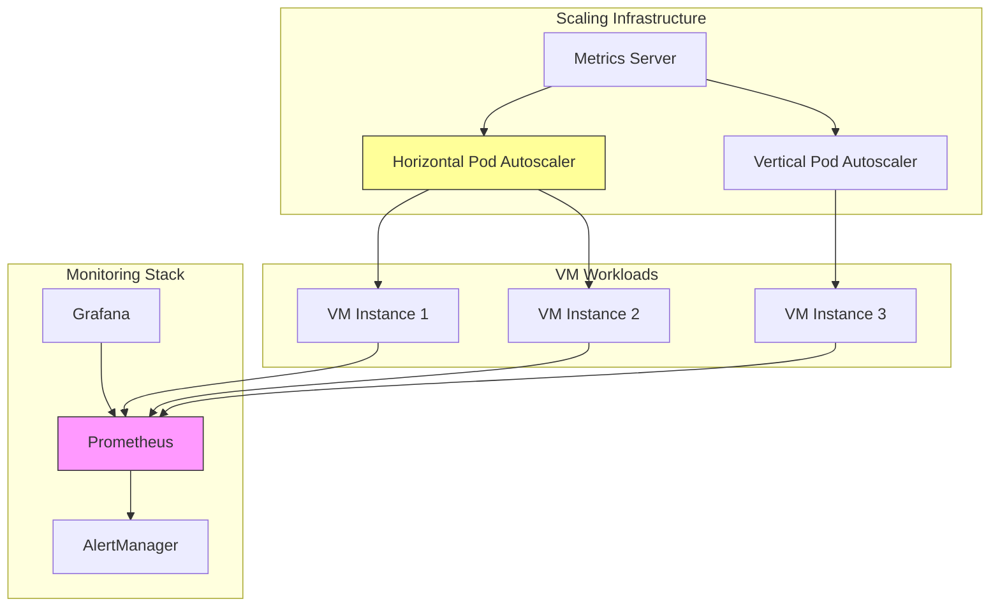

# Use Case: VM Scaling and Performance Optimization

## Business Context

Dynamic scaling and performance optimization are essential for maintaining optimal VM performance while managing resource costs. This use case demonstrates how to implement auto-scaling, resource optimization, and performance monitoring for virtual machines in the RH OVE ecosystem.

## Technical Requirements

### Infrastructure Requirements
- OpenShift 4.12+ with KubeVirt enabled
- Horizontal Pod Autoscaler (HPA) support
- Metrics server and custom metrics API
- Persistent storage with performance monitoring capabilities
- CPU and memory monitoring tools (Prometheus/Grafana)

### Resource Requirements
- **CPU**: Variable based on workload demands
- **Memory**: Dynamic allocation based on usage patterns
- **Storage**: High-performance storage with IOPS monitoring
- **Network**: Low-latency network for performance-sensitive applications

## Architecture Overview



## Implementation Steps

### Step 1: Enable VM Performance Monitoring

#### Deploy VM with Performance Monitoring
```yaml
apiVersion: kubevirt.io/v1
kind: VirtualMachine
metadata:
  name: performance-vm
  namespace: vm-workloads
spec:
  running: true
  template:
    metadata:
      labels:
        app: performance-vm
        monitoring: "enabled"
    spec:
      domain:
        cpu:
          cores: 2
          model: host-passthrough
        devices:
          disks:
          - disk:
              bus: virtio
            name: rootdisk
          interfaces:
          - name: default
            bridge: {}
        memory:
          guest: 4Gi
        resources:
          requests:
            memory: 4Gi
            cpu: 2
          limits:
            memory: 8Gi
            cpu: 4
      networks:
      - name: default
        pod: {}
      volumes:
      - dataVolume:
          name: performance-vm-dv
        name: rootdisk
---
apiVersion: cdi.kubevirt.io/v1beta1
kind: DataVolume
metadata:
  name: performance-vm-dv
  namespace: vm-workloads
spec:
  source:
    http:
      url: "https://vm-images.example.com/performance-vm.img"
  pvc:
    accessModes:
    - ReadWriteOnce
    resources:
      requests:
        storage: 50Gi
    storageClassName: fast-ssd
```

### Step 2: Configure Horizontal Pod Autoscaler for VMs

#### HPA Configuration
```yaml
apiVersion: autoscaling/v2
kind: HorizontalPodAutoscaler
metadata:
  name: vm-hpa
  namespace: vm-workloads
spec:
  scaleTargetRef:
    apiVersion: kubevirt.io/v1
    kind: VirtualMachine
    name: performance-vm
  minReplicas: 1
  maxReplicas: 5
  metrics:
  - type: Resource
    resource:
      name: cpu
      target:
        type: Utilization
        averageUtilization: 70
  - type: Resource
    resource:
      name: memory
      target:
        type: Utilization
        averageUtilization: 80
  behavior:
    scaleUp:
      stabilizationWindowSeconds: 60
      policies:
      - type: Percent
        value: 50
        periodSeconds: 60
    scaleDown:
      stabilizationWindowSeconds: 300
      policies:
      - type: Percent
        value: 25
        periodSeconds: 60
```

### Step 3: Implement Vertical Pod Autoscaler

#### VPA Configuration
```yaml
apiVersion: autoscaling.k8s.io/v1
kind: VerticalPodAutoscaler
metadata:
  name: vm-vpa
  namespace: vm-workloads
spec:
  targetRef:
    apiVersion: kubevirt.io/v1
    kind: VirtualMachine
    name: performance-vm
  updatePolicy:
    updateMode: "Auto"
  resourcePolicy:
    containerPolicies:
    - containerName: compute
      minAllowed:
        cpu: 100m
        memory: 1Gi
      maxAllowed:
        cpu: 8
        memory: 16Gi
      controlledResources: ["cpu", "memory"]
```

### Step 4: Performance Monitoring and Alerting

#### ServiceMonitor for VM Metrics
```yaml
apiVersion: monitoring.coreos.com/v1
kind: ServiceMonitor
metadata:
  name: vm-performance-monitor
  namespace: vm-workloads
  labels:
    app: vm-monitor
spec:
  selector:
    matchLabels:
      monitoring: "enabled"
  endpoints:
  - port: metrics
    interval: 30s
    path: /metrics
    honorLabels: true
```

#### Performance Alerting Rules
```yaml
apiVersion: monitoring.coreos.com/v1
kind: PrometheusRule
metadata:
  name: vm-performance-alerts
  namespace: vm-workloads
spec:
  groups:
  - name: vm.performance
    rules:
    - alert: VMHighCPUUsage
      expr: kubevirt_vm_cpu_usage > 0.8
      for: 5m
      labels:
        severity: warning
      annotations:
        summary: "VM {{ $labels.name }} has high CPU usage"
        description: "VM {{ $labels.name }} CPU usage is above 80% for more than 5 minutes."
    
    - alert: VMHighMemoryUsage
      expr: kubevirt_vm_memory_usage > 0.9
      for: 5m
      labels:
        severity: critical
      annotations:
        summary: "VM {{ $labels.name }} has high memory usage"
        description: "VM {{ $labels.name }} memory usage is above 90% for more than 5 minutes."
    
    - alert: VMDiskIOHigh
      expr: kubevirt_vm_disk_iops > 1000
      for: 10m
      labels:
        severity: warning
      annotations:
        summary: "VM {{ $labels.name }} has high disk I/O"
        description: "VM {{ $labels.name }} disk IOPS is above 1000 for more than 10 minutes."
```

### Step 5: Performance Optimization Strategies

#### CPU Pinning for Performance-Critical VMs
```yaml
apiVersion: kubevirt.io/v1
kind: VirtualMachine
metadata:
  name: high-performance-vm
  namespace: vm-workloads
spec:
  running: true
  template:
    metadata:
      annotations:
        cpu-load-balancing.crio.io: "disable"
        cpu-quota.crio.io: "disable"
        irq-load-balancing.crio.io: "disable"
    spec:
      domain:
        cpu:
          cores: 4
          sockets: 1
          threads: 1
          dedicatedCpuPlacement: true
          isolateEmulatorThread: true
          model: host-passthrough
        devices:
          disks:
          - disk:
              bus: virtio
            name: rootdisk
        memory:
          guest: 8Gi
          hugepages:
            pageSize: 1Gi
        resources:
          requests:
            memory: 8Gi
            cpu: 4
          limits:
            memory: 8Gi
            cpu: 4
      nodeSelector:
        node-role.kubernetes.io/worker: ""
        performance-node: "true"
      volumes:
      - dataVolume:
          name: high-performance-vm-dv
        name: rootdisk
```

### Step 6: Storage Performance Optimization

#### High-Performance Storage Configuration
```yaml
apiVersion: storage.k8s.io/v1
kind: StorageClass
metadata:
  name: high-performance-ssd
provisioner: kubernetes.io/csi-driver
parameters:
  type: gp3
  iops: "3000"
  throughput: "125"
  fsType: ext4
reclaimPolicy: Delete
allowVolumeExpansion: true
volumeBindingMode: WaitForFirstConsumer
```

## Troubleshooting Guide

### Common Issues and Solutions

#### Scaling Not Triggering
- **Issue**: HPA/VPA not scaling VMs as expected
- **Solution**: 
  - Check metrics server functionality: `kubectl top nodes`
  - Verify resource requests are set properly
  - Check HPA status: `kubectl describe hpa vm-hpa`

#### Performance Degradation
- **Issue**: VM performance is not meeting expectations
- **Solution**:
  - Review CPU pinning configuration
  - Check for resource contention on nodes
  - Verify storage performance metrics
  - Analyze network latency and throughput

#### Memory Issues
- **Issue**: Out of memory errors or high memory pressure
- **Solution**:
  - Increase memory limits in VM specification
  - Enable hugepages for better memory performance
  - Check for memory leaks in applications

## Best Practices

### Resource Management
- **Right-sizing**: Start with conservative resource allocations and scale based on monitoring data
- **Resource Limits**: Always set both requests and limits to prevent resource starvation
- **Node Selection**: Use node selectors and taints to ensure VMs are scheduled on appropriate nodes

### Performance Tuning
- **CPU Optimization**: Use CPU pinning for performance-critical workloads
- **Memory Optimization**: Configure hugepages for memory-intensive applications
- **Storage Optimization**: Use high-performance storage classes for I/O intensive workloads
- **Network Optimization**: Configure SR-IOV for network-intensive applications

### Monitoring and Alerting
- **Proactive Monitoring**: Set up comprehensive monitoring for all performance metrics
- **Alert Thresholds**: Configure appropriate alert thresholds to prevent performance issues
- **Capacity Planning**: Use historical data for capacity planning and resource allocation

## Integration with RH OVE Ecosystem

### GitOps Integration
```yaml
apiVersion: argoproj.io/v1alpha1
kind: Application
metadata:
  name: vm-performance
  namespace: argocd
spec:
  project: default
  source:
    repoURL: https://git.example.com/vm-performance-config
    targetRevision: HEAD
    path: performance
  destination:
    server: https://kubernetes.default.svc
    namespace: vm-workloads
  syncPolicy:
    automated:
      prune: false
      selfHeal: true
    syncOptions:
    - CreateNamespace=true
```

### Multi-Cluster Performance Management
- **Centralized Monitoring**: Aggregate performance metrics across multiple clusters
- **Cross-Cluster Scaling**: Implement scaling policies that consider cluster resource availability
- **Performance Benchmarking**: Establish performance baselines across different cluster configurations

This comprehensive guide provides the tools and strategies needed to implement effective VM scaling and performance optimization within the RH OVE ecosystem, ensuring optimal resource utilization and application performance.
