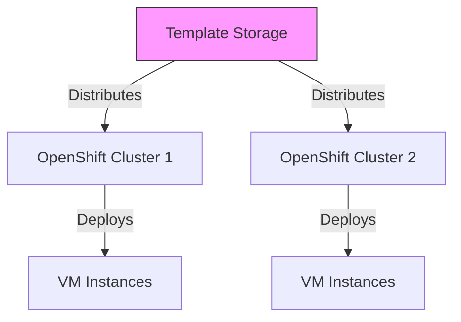

# Use Case: VM Template Management

## Business Context

Efficient VM template management is crucial for maintaining consistency, reducing deployment times, and ensuring that VMs adhere to organizational standards. By leveraging templates, organizations can streamline the creation of VMs with predefined configurations that meet specific operational, security, and compliance requirements.

## Technical Requirements

### Infrastructure Requirements
- OpenShift 4.12+ with KubeVirt enabled
- Storage solutions for template images (e.g., OpenShift Data Foundation)
- Network connectivity between clusters for template distribution

### Resource Requirements
- **Storage**: Adequate space for storing multiple VM templates
- **Network**: Fast connectivity for template distribution and deployment

## Architecture Overview



## Implementation Steps

### Step 1: Create VM Templates

#### Define Template Specification
```yaml
apiVersion: kubevirt.io/v1alpha3
kind: VirtualMachineTemplate
metadata:
  name: webserver-template
spec:
  domain:
    cpu:
      cores: 2
    devices:
      disks:
      - name: rootdisk
        disk:
          bus: virtio
    memory:
      guest: 4Gi
  volumes:
  - name: rootdisk
    containerDisk:
      image: kubevirt/cirros-registry-disk-demo
```

### Step 2: Store Templates

#### Upload Template to Storage
- Use OpenShift Data Foundation or another persistent storage solution to store VM templates.

### Step 3: Distribute Templates

#### Sync Templates Across Clusters
- Ensure templates are replicated to all relevant clusters using synchronized storage.

### Step 4: Deploy VMs Using Templates

#### Create VMs from Templates
```yaml
apiVersion: kubevirt.io/v1alpha3
kind: VirtualMachine
metadata:
  name: new-webserver
spec:
  running: false
  template:
    metadata:
      labels:
        vm.kubevirt.io/template: webserver-template
    spec:
      domain:
        cpu:
          cores: 2
        devices:
          disks:
          - disk:
              bus: virtio
            name: rootdisk
        memory:
          guest: 4Gi
```

## Troubleshooting Guide

### Common Issues and Solutions

#### Template Sync Issues
- Verify storage connectivity and check log files for errors.

#### Deployment Failures
- Ensure templates are properly defined and contain all necessary configurations.

## Best Practices

- **Template Versioning**: Keep versions of templates to track changes and rollback if necessary.
- **Regular Audits**: Periodically review and update templates to ensure they meet current security and compliance standards.
- **Backup Templates**: Ensure templates are backed up to prevent loss in case of storage failures.

## Integration with RH OVE Ecosystem

### Monitoring Integration
- Set up monitoring for template storage systems to detect and resolve issues promptly.

This guide provides the necessary steps and best practices for efficient VM template management within an RH OVE environment, facilitating faster and more consistent VM deployments.
