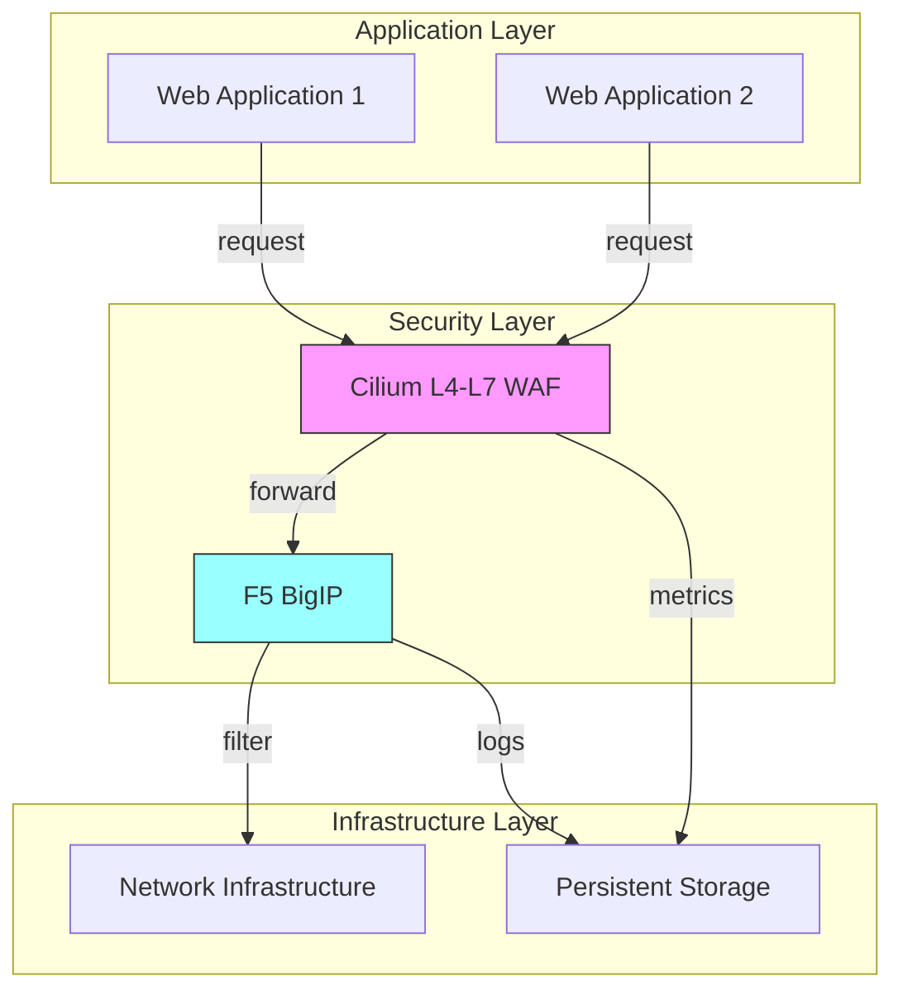

# Use Case: Web Application Firewall (WAF) Firewalling and Integration with F5 BigIP

## Business Context

As enterprises adopt cloud-native architectures, securing web applications becomes crucial for protecting sensitive data and maintaining business continuity. This use case demonstrates how to implement a robust Web Application Firewall (WAF) using native L4-L7 capabilities and integrate it with F5 BigIP for enhanced security management within the RH OVE ecosystem.

## Technical Requirements

### Infrastructure Requirements
- OpenShift 4.12+ cluster with Multus CNI enabled
- Cilium CNI for L4-L7 Policy Enforcement
- F5 BigIP for advanced traffic management and security policies
- Persistent storage solutions for logs and reports

### Resource Requirements
- **CPU**: Sufficient compute resources to support firewall processing
- **Memory**: Adequate memory allocation for traffic inspection and logs
- **Storage**: High-performance storage for log retention and reporting
- **Network**: Scalable network infrastructure for seamless traffic flow

## Architecture Overview



## Implementation Steps

### Step 1: Deploy Cilium L4-L7 Firewall

#### Cilium Configuration
```yaml
apiVersion: cilium.io/v2
kind: CiliumNetworkPolicy
metadata:
  name: web-app-waf-policy
  namespace: infrastructure
spec:
  endpointSelector:
    matchLabels:
      app.kubernetes.io/name: web
  ingress:
  - rules:
      http:
      - method: "POST"
        path: "/api"
      - method: "GET"
        path: "/"
  egress:
  - toEndpoints:
    - matchLabels:
        infrastructure: f5-bigip
```

### Step 2: Integrate with F5 BigIP

#### F5 BigIP Virtual Server Configuration
- Configure F5 virtual server to handle traffic directed from Cilium WAF.
- Implement F5 policies for SSL termination, traffic redirection, and detailed logging.

```bash
# Example F5 BigIP CLI configuration
create ltm virtual vs-web-app {
  destination 192.168.1.100:80
  ip-protocol tcp
  profiles add { http { context clientside } }
  pool my-web-app-pool
  rules { waf-inspection }  
}

# Associate WAF policies
create ltm policy waf-inspection {
  rules add {
    10 { conditions { tcp } actions { forward pool-member my-web-app-pool
    } }
  }
}
```

### Step 3: Advanced Traffic Monitoring and Logging

#### Persistent Storage Configuration
- Configure persistent volumes for log storage using Cilium and F5 BigIP integrations.

```yaml
apiVersion: v1
kind: PersistentVolumeClaim
metadata:
  name: storage-logs
  namespace: infrastructure
spec:
  accessModes:
  - ReadWriteOnce
  resources:
    requests:
      storage: 500Gi
  storageClassName: high-performance
```

### Step 4: Deploy Monitoring and Analytics Tools

#### Monitoring with Grafana and Prometheus
- Use Grafana dashboards to visualize traffic patterns and security metrics.
- Implement Prometheus alerting for suspicious activity detection.

```yaml
# Grafana Dashboard Configuration
apiVersion: integreatly.org/v1alpha1
kind: GrafanaDashboard
metadata:
  name: waf-dashboard
  namespace: monitoring
spec:
  json: |
    {
      "title": "Web Application Firewall Overview",
      "panels": [
        {
          "type": "graph",
          "title": "HTTP Requests",
          "targets": [
            { "expr": "sum(rate(http_requests_total[5m]))", "interval": ",5m" }
          ]
        }
      ]
    }
```

### Troubleshooting and Maintenance

#### Common Issues and Solutions

- **Policy Misconfiguration**: Verify Cilium and F5 policy configurations for errors.
- **Performance Degradation**: Ensure adequate resources for Cilium and F5 processing.
- **Logging Failures**: Check storage availability and permissions.

### Best Practices

- **Regular Audits**: Conduct regular audits of firewall rules and configurations.
- **Security Hardening**: Apply security patches to F5 BigIP and Cilium regularly.
- **Performance Monitoring**: Continuously monitor firewall performance and resource usage.

## Integration with RH OVE Ecosystem

- **Seamless Traffic Flow**: Ensure smooth integration of traffic between application components and security layers.
- **Consistent Policy Management**: Use GitOps practices to manage and version firewall rules.
- **Network Observability**: Leverage Cilium Hubble for enhanced network observability within the OpenShift clusters.

This comprehensive guide provides the steps and best practices required to deploy and manage an effective Web Application Firewall solution in combination with F5 BigIP, ensuring robust protection for your web applications while seamlessly integrating within the RH OVE multi-cluster ecosystem.
